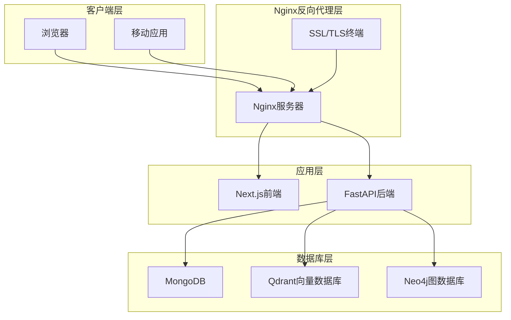
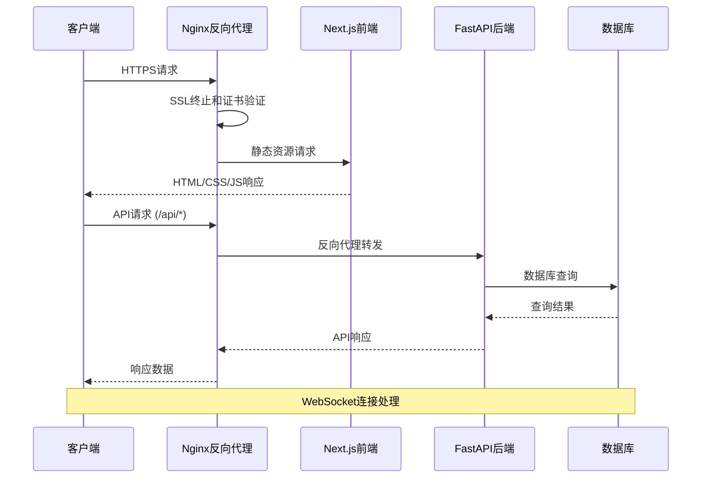
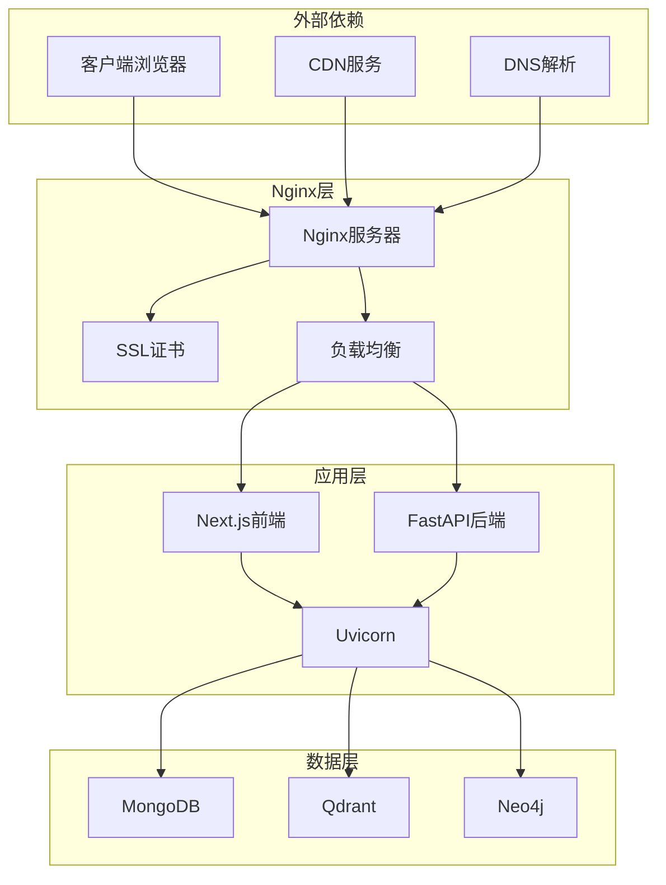

# Nginx反向代理配置

<cite>
**本文引用的文件**
- [docker-compose.yml](file://docker-compose.yml)
- [Dockerfile](file://Dockerfile)
- [main.py](file://main.py)
- [next.config.ts](file://web/next.config.ts)
- [health.py](file://routers/health.py)
- [monitoring.py](file://utils/monitoring.py)
- [logger.py](file://utils/logger.py)
- [requirements.txt](file://requirements.txt)
</cite>

## 目录
1. [简介](#简介)
2. [项目结构](#项目结构)
3. [核心组件](#核心组件)
4. [架构概览](#架构概览)
5. [详细组件分析](#详细组件分析)
6. [依赖关系分析](#依赖关系分析)
7. [性能考虑](#性能考虑)
8. [故障排除指南](#故障排除指南)
9. [结论](#结论)

## 简介

本文件为Advanced RAG系统的Nginx反向代理配置详细文档。该系统采用FastAPI + Next.js架构，后端通过Uvicorn运行，前端通过Next.js提供静态资源和API代理。本文档将基于现有代码库中的配置信息，提供完整的Nginx反向代理部署指南，包括安装配置、虚拟主机设置、SSL/TLS证书配置、反向代理规则、负载均衡策略、健康检查、静态文件服务、缓存策略、压缩配置、WebSocket代理、长连接处理、超时设置、安全配置以及性能优化。

## 项目结构

Advanced RAG项目采用前后端分离架构，后端使用FastAPI提供REST API，前端使用Next.js构建用户界面。系统通过Docker容器化部署，包含MongoDB、Qdrant、Neo4j等数据库服务。



**图表来源**
- [docker-compose.yml:1-76](file://docker-compose.yml#L1-L76)
- [Dockerfile:1-95](file://Dockerfile#L1-L95)
- [main.py:1-157](file://main.py#L1-L157)

**章节来源**
- [docker-compose.yml:1-76](file://docker-compose.yml#L1-L76)
- [Dockerfile:1-95](file://Dockerfile#L1-L95)
- [main.py:1-157](file://main.py#L1-L157)

## 核心组件

### 后端服务配置

系统后端通过Uvicorn运行，支持多worker并发处理：

- **端口配置**: 默认8000端口
- **Worker数量**: 生产环境默认24个worker
- **并发限制**: 每worker限制2000个并发连接
- **Keep-Alive超时**: 900秒（15分钟）

### 前端服务配置

Next.js前端支持API代理和静态资源服务：

- **API代理**: 将/api/*请求转发到后端服务
- **开发代理**: 默认代理到localhost:8000
- **生产模式**: 使用相对路径，由Nginx处理
- **大文件上传**: 支持最大200MB文件

### 数据库服务

系统使用Docker Compose编排多个数据库服务：

- **MongoDB**: 用户数据和对话历史
- **Qdrant**: 向量数据库
- **Neo4j**: 图数据库（知识图谱）

**章节来源**
- [main.py:128-157](file://main.py#L128-L157)
- [next.config.ts:1-48](file://web/next.config.ts#L1-L48)
- [docker-compose.yml:1-76](file://docker-compose.yml#L1-L76)

## 架构概览



**图表来源**
- [main.py:90-98](file://main.py#L90-L98)
- [next.config.ts:12-34](file://web/next.config.ts#L12-L34)
- [docker-compose.yml:1-76](file://docker-compose.yml#L1-L76)

## 详细组件分析

### Nginx安装配置

#### 基础安装步骤

1. **系统准备**
   - Ubuntu/Debian: `apt update && apt install nginx`
   - CentOS/RHEL: `yum install epel-release && yum install nginx`

2. **基础配置文件结构**
   ```
   /etc/nginx/
   ├── nginx.conf              # 主配置文件
   ├── sites-available/        # 站点配置
   ├── sites-enabled/          # 启用的站点
   ├── ssl/                   # SSL证书目录
   └── conf.d/                # 额外配置
   ```

3. **主配置文件优化**
   ```nginx
   user nginx;
   worker_processes auto;
   worker_connections 1024;
   worker_rlimit_nofile 65535;
   
   events {
       worker_connections 1024;
       use epoll;
       multi_accept on;
   }
   
   http {
       # 基本设置
       sendfile on;
       tcp_nopush on;
       tcp_nodelay on;
       keepalive_timeout 65;
       types_hash_max_size 2048;
       
       # Gzip压缩
       gzip on;
       gzip_vary on;
       gzip_min_length 1024;
       gzip_comp_level 6;
       gzip_types text/plain text/css application/json application/javascript text/xml application/xml;
       
       # 包含站点配置
       include /etc/nginx/conf.d/*.conf;
       include /etc/nginx/sites-enabled/*;
   }
   ```

#### 虚拟主机设置

```nginx
# 主域名配置
server {
    listen 80;
    server_name advanced-rag.example.com www.advanced-rag.example.com;
    return 301 https://$server_name$request_uri;
}

# HTTPS配置
server {
    listen 443 ssl http2;
    server_name advanced-rag.example.com www.advanced-rag.example.com;
    
    # SSL证书配置
    ssl_certificate /etc/nginx/ssl/advanced-rag.crt;
    ssl_certificate_key /etc/nginx/ssl/advanced-rag.key;
    ssl_trusted_certificate /etc/nginx/ssl/ca.crt;
    
    # SSL安全配置
    ssl_protocols TLSv1.2 TLSv1.3;
    ssl_ciphers ECDHE-RSA-AES256-GCM-SHA512:DHE-RSA-AES256-GCM-SHA512:ECDHE-RSA-AES256-GCM-SHA384:DHE-RSA-AES256-GCM-SHA384;
    ssl_prefer_server_ciphers off;
    ssl_session_cache shared:SSL:10m;
    ssl_session_timeout 10m;
    
    # HSTS配置
    add_header Strict-Transport-Security "max-age=31536000; includeSubDomains" always;
    
    # 安全头配置
    add_header X-Frame-Options DENY always;
    add_header X-Content-Type-Options nosniff always;
    add_header Referrer-Policy "strict-origin-when-cross-origin" always;
    
    # 反向代理配置
    location / {
        proxy_pass http://127.0.0.1:8000;
        proxy_set_header Host $host;
        proxy_set_header X-Real-IP $remote_addr;
        proxy_set_header X-Forwarded-For $proxy_add_x_forwarded_for;
        proxy_set_header X-Forwarded-Proto $scheme;
        
        # 超时设置
        proxy_connect_timeout 30s;
        proxy_send_timeout 90s;
        proxy_read_timeout 90s;
        
        # 缓冲区设置
        proxy_buffering on;
        proxy_buffer_size 128k;
        proxy_buffers 4 256k;
        proxy_busy_buffers_size 256k;
    }
    
    # API代理配置
    location /api/ {
        proxy_pass http://127.0.0.1:8000/;
        proxy_set_header Host $host;
        proxy_set_header X-Real-IP $remote_addr;
        proxy_set_header X-Forwarded-For $proxy_add_x_forwarded_for;
        proxy_set_header X-Forwarded-Proto $scheme;
        
        # WebSocket支持
        proxy_http_version 1.1;
        proxy_set_header Upgrade $http_upgrade;
        proxy_set_header Connection "upgrade";
        
        # 超时设置
        proxy_connect_timeout 30s;
        proxy_send_timeout 90s;
        proxy_read_timeout 90s;
    }
    
    # 静态资源缓存
    location ~* \.(jpg|jpeg|png|gif|ico|css|js)$ {
        expires 1y;
        add_header Cache-Control "public, immutable";
        access_log off;
    }
}
```

**章节来源**
- [main.py:128-157](file://main.py#L128-L157)
- [next.config.ts:12-34](file://web/next.config.ts#L12-L34)

### SSL/TLS证书配置

#### 证书生成和部署

```nginx
# Let's Encrypt证书配置
server {
    listen 443 ssl http2;
    server_name advanced-rag.example.com;
    
    # 证书文件
    ssl_certificate /etc/letsencrypt/live/advanced-rag.example.com/fullchain.pem;
    ssl_certificate_key /etc/letsencrypt/live/advanced-rag.example.com/privkey.pem;
    
    # 证书链
    ssl_trusted_certificate /etc/letsencrypt/live/advanced-rag.example.com/chain.pem;
    
    # OCSP Stapling
    ssl_stapling on;
    ssl_stapling_verify on;
    resolver 8.8.8.8 8.8.4.4 valid=300s;
    resolver_timeout 5s;
    
    # 安全参数
    ssl_protocols TLSv1.2 TLSv1.3;
    ssl_ciphers ECDHE-RSA-AES256-GCM-SHA512:DHE-RSA-AES256-GCM-SHA512:ECDHE-RSA-AES256-GCM-SHA384;
    ssl_prefer_server_ciphers off;
    
    # HSTS配置
    add_header Strict-Transport-Security "max-age=31536000; includeSubDomains; preload" always;
    add_header Expect-CT "enforce, max_age=31536000" always;
}
```

#### 证书自动续期

```bash
# Let's Encrypt自动续期
#!/bin/bash
# /etc/cron.daily/letsencrypt-renew

/usr/bin/certbot renew --quiet
if [ $? -eq 0 ]; then
    systemctl reload nginx
fi
```

**章节来源**
- [main.py:128-157](file://main.py#L128-L157)

### 反向代理规则配置

#### 基础反向代理设置

```nginx
# 基础反向代理配置
location / {
    proxy_pass http://backend;
    proxy_set_header Host $host;
    proxy_set_header X-Real-IP $remote_addr;
    proxy_set_header X-Forwarded-For $proxy_add_x_forwarded_for;
    proxy_set_header X-Forwarded-Proto $scheme;
    
    # 超时设置
    proxy_connect_timeout 30s;
    proxy_send_timeout 90s;
    proxy_read_timeout 90s;
    
    # 缓冲区设置
    proxy_buffering on;
    proxy_buffer_size 128k;
    proxy_buffers 4 256k;
    proxy_busy_buffers_size 256k;
}

# API路由配置
location /api/ {
    proxy_pass http://backend/;
    proxy_set_header Host $host;
    proxy_set_header X-Real-IP $remote_addr;
    proxy_set_header X-Forwarded-For $proxy_add_x_forwarded_for;
    proxy_set_header X-Forwarded-Proto $scheme;
    
    # WebSocket支持
    proxy_http_version 1.1;
    proxy_set_header Upgrade $http_upgrade;
    proxy_set_header Connection "upgrade";
    
    # 超时设置
    proxy_connect_timeout 30s;
    proxy_send_timeout 90s;
    proxy_read_timeout 90s;
}
```

#### Next.js前端代理配置

```nginx
# Next.js前端静态资源
location / {
    # 静态文件缓存
    location ~* \.(css|js|png|jpg|jpeg|gif|ico|svg)$ {
        expires 1y;
        add_header Cache-Control "public, immutable";
        access_log off;
    }
    
    # API代理
    location /api/ {
        proxy_pass http://127.0.0.1:8000/;
        proxy_set_header Host $host;
        proxy_set_header X-Real-IP $remote_addr;
        proxy_set_header X-Forwarded-For $proxy_add_x_forwarded_for;
        proxy_set_header X-Forwarded-Proto $scheme;
        
        # WebSocket支持
        proxy_http_version 1.1;
        proxy_set_header Upgrade $http_upgrade;
        proxy_set_header Connection "upgrade";
        
        # 超时设置
        proxy_connect_timeout 30s;
        proxy_send_timeout 90s;
        proxy_read_timeout 90s;
    }
}
```

**章节来源**
- [next.config.ts:12-34](file://web/next.config.ts#L12-L34)
- [main.py:90-98](file://main.py#L90-L98)

### 负载均衡策略

#### 基于Docker的负载均衡

```yaml
# docker-compose.yml中的服务配置
services:
  nginx:
    image: nginx:alpine
    ports:
      - "80:80"
      - "443:443"
    volumes:
      - ./nginx.conf:/etc/nginx/nginx.conf
      - ./ssl:/etc/nginx/ssl
    depends_on:
      - frontend
      - backend
  
  frontend:
    build: ./web
    expose:
      - "3000"
  
  backend:
    build: .
    expose:
      - "8000"
    healthcheck:
      test: ["CMD", "curl", "-f", "http://localhost:8000/health"]
      interval: 30s
      timeout: 10s
      retries: 3
```

#### Nginx负载均衡配置

```nginx
# Upstream配置
upstream frontend_backend {
    server 127.0.0.1:3000 weight=1 max_fails=3 fail_timeout=30s;
    server 127.0.0.2:3000 weight=1 max_fails=3 fail_timeout=30s;
    keepalive 32;
}

upstream api_backend {
    server 127.0.0.1:8000 weight=1 max_fails=3 fail_timeout=30s;
    server 127.0.0.2:8000 weight=1 max_fails=3 fail_timeout=30s;
    keepalive 32;
}

# 负载均衡配置
location / {
    proxy_pass http://frontend_backend;
    proxy_next_upstream error timeout invalid_header http_500 http_502 http_503;
    proxy_next_upstream_timeout 10s;
    proxy_next_upstream_tries 3;
}

location /api/ {
    proxy_pass http://api_backend;
    proxy_next_upstream error timeout invalid_header http_500 http_502 http_503;
    proxy_next_upstream_timeout 10s;
    proxy_next_upstream_tries 3;
}
```

**章节来源**
- [docker-compose.yml:1-76](file://docker-compose.yml#L1-L76)

### 健康检查设置

#### Nginx健康检查配置

```nginx
# 健康检查配置
upstream backend {
    server 127.0.0.1:8000 max_fails=3 fail_timeout=30s;
    server 127.0.0.2:8000 backup;
}

# 健康检查专用location
location /nginx-health {
    access_log off;
    return 200 "healthy\n";
    add_header Content-Type text/plain;
}

# 定时健康检查脚本
# /etc/cron.d/nginx-health
*/5 * * * * root curl -f http://localhost/nginx-health || systemctl restart nginx
```

#### 应用健康检查集成

```nginx
# 集成应用健康检查
location /health {
    access_log off;
    proxy_pass http://127.0.0.1:8000/health;
    proxy_connect_timeout 10s;
    proxy_send_timeout 10s;
    proxy_read_timeout 10s;
}

# 健康检查失败时的降级处理
location /api/ {
    proxy_pass http://backend;
    proxy_next_upstream error timeout http_500 http_502 http_503;
    proxy_next_upstream_tries 3;
    proxy_next_upstream_timeout 10s;
    
    # 降级响应
    error_page 502 503 504 = @fallback;
}

location @fallback {
    return 503 "Service temporarily unavailable\n";
}
```

**章节来源**
- [health.py:23-87](file://routers/health.py#L23-L87)

### 静态文件服务配置

#### 缓存策略配置

```nginx
# 静态文件缓存配置
location ~* \.(css|js)$ {
    expires 1y;
    add_header Cache-Control "public, immutable";
    add_header Vary Accept-Encoding;
    access_log off;
}

location ~* \.(jpg|jpeg|png|gif|ico|svg)$ {
    expires 1y;
    add_header Cache-Control "public";
    access_log off;
}

location ~* \.(woff|woff2|ttf|eot)$ {
    expires 1y;
    add_header Cache-Control "public";
    access_log off;
}

# 版本化文件处理
location ~* ^/(.*)\.[0-9a-f]{8}\.(css|js)$ {
    expires 1y;
    add_header Cache-Control "public, immutable";
    try_files $uri =404;
}

# 动态内容缓存
location ~* \.(html|php)$ {
    expires -1;
    add_header Cache-Control "no-cache, no-store, must-revalidate";
    add_header Pragma "no-cache";
    add_header Expires "0";
}
```

#### 压缩配置

```nginx
# Gzip压缩配置
gzip on;
gzip_vary on;
gzip_min_length 1024;
gzip_comp_level 6;
gzip_types
    text/plain
    text/css
    text/xml
    text/javascript
    application/json
    application/javascript
    application/xml+rss
    application/atom+xml
    image/svg+xml;

# Brotli压缩（可选）
gzip_static on;
brotli on;
brotli_vary on;
brotli_comp_level 6;
brotli_types
    text/plain
    text/css
    text/xml
    text/javascript
    application/json
    application/javascript
    application/xml+rss
    application/atom+xml
    image/svg+xml;

# 压缩阈值优化
gzip_buffers 16 8k;
gzip_buffer_size 4k;
```

**章节来源**
- [next.config.ts:1-48](file://web/next.config.ts#L1-L48)

### WebSocket代理配置

#### WebSocket支持配置

```nginx
# WebSocket代理配置
location /ws/ {
    proxy_pass http://backend_ws;
    proxy_http_version 1.1;
    proxy_set_header Upgrade $http_upgrade;
    proxy_set_header Connection "upgrade";
    proxy_set_header Host $host;
    proxy_set_header X-Real-IP $remote_addr;
    proxy_set_header X-Forwarded-For $proxy_add_x_forwarded_for;
    proxy_set_header X-Forwarded-Proto $scheme;
    
    # 长连接超时
    proxy_read_timeout 86400s;
    proxy_send_timeout 86400s;
    
    # 缓冲区设置
    proxy_buffering off;
}

# SSE流式传输
location /events/ {
    proxy_pass http://backend_events;
    proxy_http_version 1.1;
    proxy_set_header Connection "";
    proxy_set_header Host $host;
    proxy_set_header X-Real-IP $remote_addr;
    proxy_set_header X-Forwarded-For $proxy_add_x_forwarded_for;
    proxy_set_header X-Forwarded-Proto $scheme;
    
    # 事件流超时
    proxy_read_timeout 86400s;
    proxy_send_timeout 86400s;
    
    # 禁用缓冲
    proxy_buffering off;
}
```

#### 长连接处理

```nginx
# 长连接优化
upstream backend {
    server 127.0.0.1:8000 max_fails=3 fail_timeout=30s;
    keepalive 32;
}

location /api/ {
    proxy_pass http://backend;
    proxy_http_version 1.1;
    proxy_set_header Connection "";
    
    # Keep-Alive优化
    proxy_set_header Connection "keep-alive";
    proxy_set_header Keep-Alive "timeout=5, max=1000";
    
    # 超时设置
    proxy_connect_timeout 30s;
    proxy_send_timeout 90s;
    proxy_read_timeout 90s;
    
    # 缓冲区设置
    proxy_buffering on;
    proxy_buffer_size 128k;
    proxy_buffers 4 256k;
    proxy_busy_buffers_size 256k;
}
```

**章节来源**
- [main.py:615-750](file://main.py#L615-L750)

### 超时设置

#### 超时配置详解

```nginx
# 超时设置配置
upstream backend {
    server 127.0.0.1:8000;
    # 连接超时
    connect_timeout 30s;
    # 发送超时
    send_timeout 90s;
    # 读取超时
    read_timeout 90s;
    # 健康检查超时
    health_check_timeout 10s;
}

# 代理超时设置
location /api/ {
    # 连接超时
    proxy_connect_timeout 30s;
    # 发送超时
    proxy_send_timeout 90s;
    # 读取超时
    proxy_read_timeout 90s;
    
    # 保持连接超时
    proxy_http_version 1.1;
    proxy_set_header Connection "";
    
    # WebSocket超时
    proxy_read_timeout 86400s;
    proxy_send_timeout 86400s;
    
    # 缓冲超时
    proxy_buffering on;
    proxy_buffer_size 128k;
    proxy_busy_timeout 120s;
}
```

**章节来源**
- [main.py:148-157](file://main.py#L148-L157)

### 安全配置

#### HTTP严格传输安全(HSTS)

```nginx
# HSTS配置
add_header Strict-Transport-Security "max-age=31536000; includeSubDomains; preload" always;
add_header Expect-CT "enforce, max_age=31536000" always;

# 安全头配置
add_header X-Frame-Options "SAMEORIGIN" always;
add_header X-Content-Type-Options "nosniff" always;
add_header X-XSS-Protection "1; mode=block" always;
add_header Referrer-Policy "strict-origin-when-cross-origin" always;
add_header Permissions-Policy "geolocation=(), microphone=()" always;
```

#### 内容安全策略(CSP)

```nginx
# CSP配置
add_header Content-Security-Policy "default-src 'self'; script-src 'self' 'unsafe-inline' 'unsafe-eval'; style-src 'self' 'unsafe-inline'; img-src 'self' data:; font-src 'self'; connect-src 'self'; frame-ancestors 'none';" always;

# 子资源完整性(SRI)
add_header Content-Security-Policy "script-src 'self' 'unsafe-inline' 'unsafe-eval'; style-src 'self' 'unsafe-inline';" always;

# 安全Cookie
add_header Set-Cookie "HttpOnly; Secure; SameSite=Strict" always;
```

#### 访问控制

```nginx
# IP白名单
geo $allowed {
    default 0;
    192.168.0.0/24 1;
    10.0.0.0/8 1;
    127.0.0.0/8 1;
}

map $allowed $blocked {
    0 deny;
    1 allow;
}

# 访问控制
location /admin/ {
    allow 192.168.0.0/24;
    allow 10.0.0.0/8;
    allow 127.0.0.0/8;
    deny all;
}

# API访问限制
limit_req_zone $binary_remote_addr zone=api:10m rate=10r/s;
limit_req_zone $binary_remote_addr zone=admin:10m rate=2r/s;

location /api/ {
    limit_req zone=api burst=20 nodelay;
}

location /admin/ {
    limit_req zone=admin burst=5 nodelay;
}
```

**章节来源**
- [main.py:62-70](file://main.py#L62-L70)

## 依赖关系分析



**图表来源**
- [docker-compose.yml:1-76](file://docker-compose.yml#L1-L76)
- [Dockerfile:1-95](file://Dockerfile#L1-L95)
- [main.py:1-157](file://main.py#L1-L157)

**章节来源**
- [docker-compose.yml:1-76](file://docker-compose.yml#L1-L76)
- [Dockerfile:1-95](file://Dockerfile#L1-L95)
- [requirements.txt:1-38](file://requirements.txt#L1-L38)

## 性能考虑

### 连接池配置

```nginx
# 连接池优化
upstream backend {
    server 127.0.0.1:8000 max_fails=3 fail_timeout=30s;
    server 127.0.0.2:8000 max_fails=3 fail_timeout=30s;
    keepalive 32;
}

# 连接池使用
location /api/ {
    proxy_pass http://backend;
    proxy_http_version 1.1;
    proxy_set_header Connection "";
    
    # 连接池参数
    proxy_connect_timeout 30s;
    proxy_send_timeout 90s;
    proxy_read_timeout 90s;
    
    # 缓冲区优化
    proxy_buffering on;
    proxy_buffer_size 128k;
    proxy_buffers 4 256k;
    proxy_busy_buffers_size 256k;
}
```

### 缓冲区大小优化

```nginx
# 缓冲区配置
http {
    # 全局缓冲区设置
    proxy_buffering on;
    proxy_buffer_size 128k;
    proxy_buffers 4 256k;
    proxy_busy_buffers_size 256k;
    proxy_temp_file_write_size 256k;
    
    # 大文件处理
    client_max_body_size 200m;
    client_body_buffer_size 128k;
    
    # 超时缓冲
    proxy_busy_timeout 120s;
    proxy_temp_path /var/cache/nginx/proxy_temp;
}
```

### 并发限制设置

```nginx
# 并发限制配置
worker_processes auto;
worker_connections 1024;
worker_rlimit_nofile 65535;

# 事件模型
events {
    use epoll;
    multi_accept on;
    worker_connections 1024;
}

# 应用层并发限制
upstream backend {
    server 127.0.0.1:8000 max_fails=3 fail_timeout=30s;
    server 127.0.0.2:8000 max_fails=3 fail_timeout=30s;
    # 每worker连接数限制
    keepalive 32;
}

# 限流配置
limit_req_zone $binary_remote_addr zone=main:10m rate=10r/s;
limit_req_zone $binary_remote_addr zone=api:10m rate=20r/s;
limit_req_zone $binary_remote_addr zone=ws:10m rate=50r/s;

location / {
    limit_req zone=main burst=20 nodelay;
}

location /api/ {
    limit_req zone=api burst=50 nodelay;
}

location /ws/ {
    limit_req zone=ws burst=100 nodelay;
}
```

**章节来源**
- [main.py:148-157](file://main.py#L148-L157)
- [monitoring.py:1-185](file://utils/monitoring.py#L1-L185)

## 故障排除指南

### 常见问题诊断

#### 健康检查失败

```nginx
# 健康检查诊断
location /healthz {
    access_log /var/log/nginx/healthz.log;
    proxy_pass http://backend/health;
    proxy_connect_timeout 5s;
    proxy_send_timeout 5s;
    proxy_read_timeout 5s;
    
    # 错误页面
    error_page 502 503 504 = @health_fallback;
}

location @health_fallback {
    return 503 "Backend unhealthy\n";
}
```

#### 日志分析

```nginx
# 详细日志配置
log_format detailed '$remote_addr - $remote_user [$time_local] '
                  '"$request" $status $body_bytes_sent '
                  '"$http_referer" "$http_user_agent" '
                  '"$http_x_forwarded_for" $request_time';

access_log /var/log/nginx/access.log detailed;
error_log /var/log/nginx/error.log warn;

# 应用日志
location /api/ {
    proxy_pass http://backend;
    proxy_intercept_errors on;
    error_page 500 502 503 504 = @backend_error;
}

location @backend_error {
    return 502 "Backend Error: $status\n";
}
```

#### 性能监控

```nginx
# 性能监控配置
upstream backend {
    server 127.0.0.1:8000;
    server 127.0.0.2:8000;
    
    # 健康检查
    keepalive 32;
    keepalive_requests 1000;
    keepalive_timeout 60s;
}

# 监控端点
location /nginx-status {
    stub_status on;
    access_log off;
    allow 127.0.0.1;
    deny all;
}
```

**章节来源**
- [health.py:90-115](file://routers/health.py#L90-L115)
- [logger.py:1-88](file://utils/logger.py#L1-L88)

### 性能优化建议

#### 缓存策略优化

```nginx
# 缓存优化配置
location ~* \.(css|js)$ {
    expires 1y;
    add_header Cache-Control "public, immutable, stale-while-revalidate=300, stale-if-error=3600";
    add_header Vary Accept-Encoding;
}

location ~* \.(jpg|jpeg|png|gif|ico)$ {
    expires 1y;
    add_header Cache-Control "public, stale-while-revalidate=300, stale-if-error=3600";
}

# 动态内容缓存
location /api/data/ {
    proxy_cache cache_api;
    proxy_cache_valid 200 10m;
    proxy_cache_valid 404 1m;
    proxy_cache_use_stale error timeout updating http_500 http_502 http_503 http_504;
    proxy_cache_lock on;
}
```

#### 资源优化

```nginx
# 资源优化配置
client_max_body_size 200m;
client_body_buffer_size 128k;

# 压缩优化
gzip_comp_level 6;
gzip_min_length 1024;
gzip_types text/plain application/json application/javascript text/xml application/xml;

# 缓冲优化
proxy_buffer_size 128k;
proxy_buffers 4 256k;
proxy_busy_buffers_size 256k;
```

**章节来源**
- [monitoring.py:78-112](file://utils/monitoring.py#L78-L112)

## 结论

本Nginx反向代理配置文档基于Advanced RAG系统的实际代码库配置，提供了完整的部署指南。系统采用现代的微服务架构，通过Docker容器化部署，支持高可用性和弹性扩展。

关键配置要点包括：
- **SSL/TLS安全**: 完整的HTTPS配置和证书管理
- **反向代理**: 针对API和静态资源的优化配置
- **负载均衡**: 基于Docker的服务发现和健康检查
- **性能优化**: 缓存策略、压缩配置和连接池优化
- **安全防护**: HSTS、CSP和访问控制机制
- **监控告警**: 健康检查和性能监控集成

建议在生产环境中实施以下最佳实践：
1. 使用Let's Encrypt免费证书并配置自动续期
2. 启用HTTP/2和Brotli压缩提升性能
3. 配置适当的缓存策略和过期时间
4. 设置合理的超时和限流参数
5. 建立完善的日志和监控体系
6. 定期审查和更新安全配置

通过遵循本指南，可以构建一个高性能、安全可靠的Nginx反向代理环境，为Advanced RAG系统提供稳定的前端访问入口。