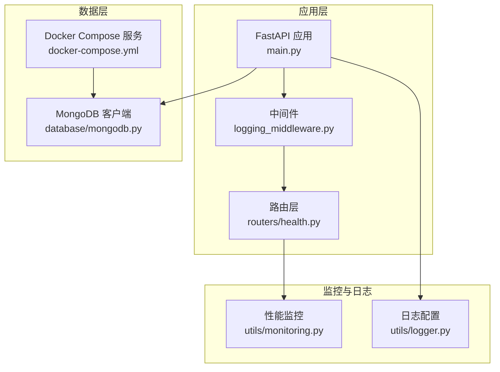
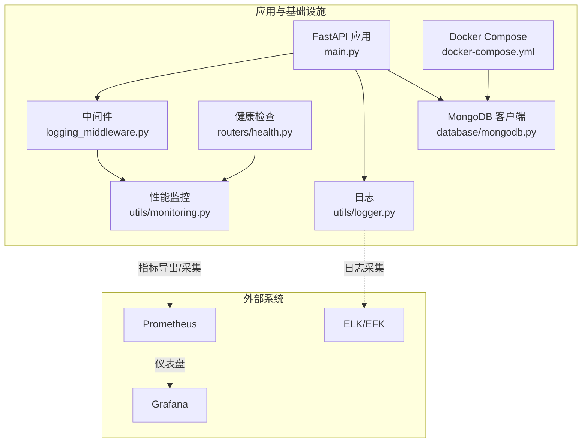
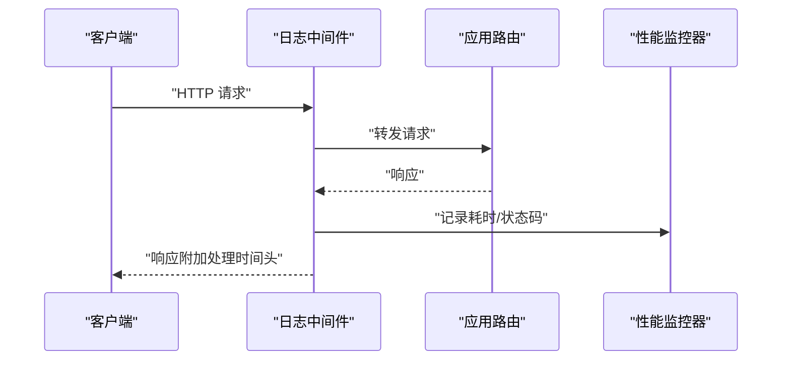
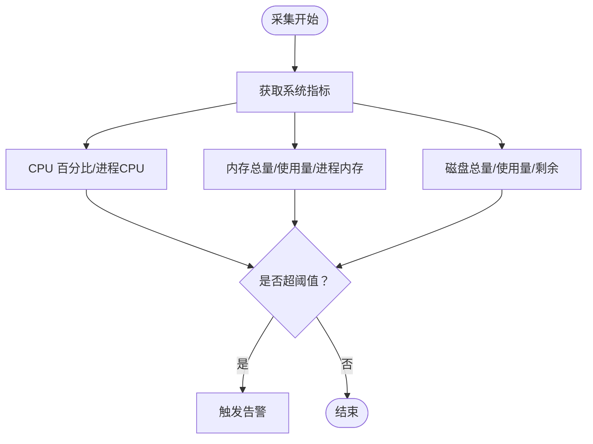
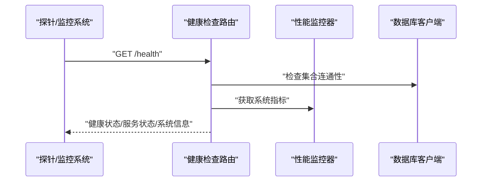
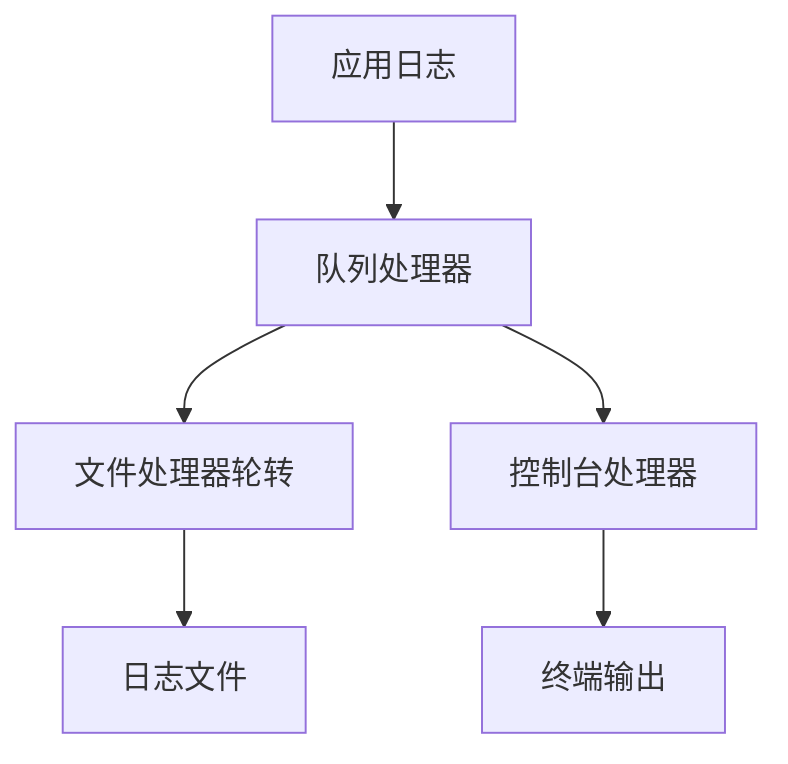
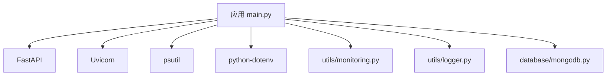

# 备份与监控配置

<cite>
**本文引用的文件**
- [main.py](file://main.py)
- [docker-compose.yml](file://docker-compose.yml)
- [utils/monitoring.py](file://utils/monitoring.py)
- [utils/logger.py](file://utils/logger.py)
- [middleware/logging_middleware.py](file://middleware/logging_middleware.py)
- [routers/health.py](file://routers/health.py)
- [database/mongodb.py](file://database/mongodb.py)
- [utils/lifespan.py](file://utils/lifespan.py)
- [README.md](file://README.md)
- [requirements.txt](file://requirements.txt)
</cite>

## 目录
1. [简介](#简介)
2. [项目结构](#项目结构)
3. [核心组件](#核心组件)
4. [架构总览](#架构总览)
5. [详细组件分析](#详细组件分析)
6. [依赖分析](#依赖分析)
7. [性能考虑](#性能考虑)
8. [故障排查指南](#故障排查指南)
9. [结论](#结论)
10. [附录](#附录)

## 简介
本文件面向运维与平台工程团队，提供本项目的备份与监控配置说明。内容涵盖：
- 数据备份策略：全量备份、增量备份与差异备份的配置思路与落地建议
- 备份存储配置、备份验证与恢复测试流程
- 监控系统配置：应用性能监控、系统资源监控与业务指标监控
- 告警配置、通知渠道与故障处理流程
- 日志管理、日志聚合与日志分析设置
- 容量规划、趋势分析与预测性维护策略

说明：当前代码库未内置自动化备份脚本或监控面板配置文件，本文提供基于现有代码与环境的落地实践建议。

## 项目结构
项目采用 FastAPI + 多数据库（MongoDB、Qdrant、Neo4j）的架构，监控与日志由工具模块提供基础能力，健康检查端点暴露系统与服务状态。

**图表来源**
- [main.py:55-103](file://main.py#L55-L103)
- [middleware/logging_middleware.py:8-51](file://middleware/logging_middleware.py#L8-L51)
- [routers/health.py:23-87](file://routers/health.py#L23-L87)
- [utils/monitoring.py:13-115](file://utils/monitoring.py#L13-L115)
- [utils/logger.py:15-87](file://utils/logger.py#L15-L87)
- [database/mongodb.py:92-199](file://database/mongodb.py#L92-L199)
- [docker-compose.yml:1-76](file://docker-compose.yml#L1-L76)

**章节来源**
- [main.py:55-103](file://main.py#L55-L103)
- [docker-compose.yml:1-76](file://docker-compose.yml#L1-L76)
- [README.md:125-166](file://README.md#L125-L166)

## 核心组件
- 应用入口与生命周期：负责加载环境变量、注册中间件与路由、启动/关闭数据库连接。
- 日志系统：异步文件处理器，支持轮转与生产环境日志级别过滤。
- 请求监控：中间件记录请求耗时、状态码，并汇总到性能监控器。
- 性能监控器：统计请求次数、错误计数、平均/分位耗时与系统资源指标。
- 健康检查：对外暴露健康状态、存活/就绪探针与性能指标端点。
- 数据库客户端：MongoDB 连接池配置与连接校验，支撑备份与恢复验证。

**章节来源**
- [main.py:128-157](file://main.py#L128-L157)
- [utils/logger.py:15-87](file://utils/logger.py#L15-L87)
- [middleware/logging_middleware.py:8-51](file://middleware/logging_middleware.py#L8-L51)
- [utils/monitoring.py:13-115](file://utils/monitoring.py#L13-L115)
- [routers/health.py:23-134](file://routers/health.py#L23-L134)
- [database/mongodb.py:92-199](file://database/mongodb.py#L92-L199)

## 架构总览
下图展示备份与监控在系统中的位置与交互：

**图表来源**
- [main.py:55-103](file://main.py#L55-L103)
- [middleware/logging_middleware.py:8-51](file://middleware/logging_middleware.py#L8-L51)
- [routers/health.py:117-134](file://routers/health.py#L117-L134)
- [utils/monitoring.py:13-115](file://utils/monitoring.py#L13-L115)
- [utils/logger.py:15-87](file://utils/logger.py#L15-L87)
- [database/mongodb.py:92-199](file://database/mongodb.py#L92-L199)
- [docker-compose.yml:1-76](file://docker-compose.yml#L1-L76)

## 详细组件分析

### 备份策略设计与配置建议
说明：当前代码库未包含自动化备份脚本。以下为基于现有数据库与容器编排的落地建议。

- 全量备份
  - MongoDB：使用官方工具进行逻辑导出（mongodump）或物理备份（副本集/分片集群）。结合 docker-compose 的命名卷实现持久化数据卷快照。
  - Qdrant/Neo4j：依据官方备份指南进行快照或导出。
  - 建议：制定每日全量备份计划，保留若干周期的归档副本，定期进行恢复演练。

- 增量备份
  - MongoDB：启用 oplog 并结合时间点恢复（PITR）策略，配合备份工具实现增量归档。
  - Qdrant/Neo4j：评估各自增量备份能力，结合快照策略形成组合方案。

- 差异备份
  - 基于全量与增量的差异对比，生成差异归档，降低存储与传输成本。

- 备份存储配置
  - 使用对象存储（S3/MinIO）或NAS/NFS挂载，确保跨地域冗余与加密。
  - 配置访问密钥与权限最小化，定期轮换。

- 备份验证与恢复测试
  - 定期抽样验证备份完整性（校验文件/集合数量/索引存在性）。
  - 每季度进行一次完整恢复演练，记录耗时与问题清单。

- 恢复测试流程
  - 制定恢复场景清单（灾难恢复、数据误删、版本回滚）。
  - 明确恢复优先级与SLA，准备恢复脚本与回滚预案。

**章节来源**
- [docker-compose.yml:58-72](file://docker-compose.yml#L58-L72)
- [database/mongodb.py:122-151](file://database/mongodb.py#L122-L151)

### 监控系统配置（Prometheus、Grafana、ELK）

- Prometheus
  - 应用指标采集：利用健康检查端点 /health/metrics 暴露的请求统计与系统指标，编写 Exporter 或使用 Pushgateway 将指标推送到 Prometheus。
  - 采集频率：建议 15-30s，避免对应用造成额外压力。
  - 指标分类：请求耗时分布（p50/p95/p99）、错误率、CPU/内存/磁盘使用率、数据库连接池状态。

- Grafana
  - 仪表盘：创建“应用性能”“系统资源”“数据库健康”三类仪表盘。
  - 面板建议：
    - 请求延迟与吞吐（TPS）
    - 错误率与慢请求占比
    - CPU/内存/磁盘使用率
    - 数据库连接池利用率与等待时间
  - 告警阈值：基于历史基线与业务SLA设定阈值，区分严重/警告级别。

- ELK/EFK
  - 日志采集：在应用所在节点部署 Filebeat/Fluent Bit，收集 logs/ 目录下的日志文件。
  - 日志聚合：将日志写入 Elasticsearch，使用 Kibana 进行可视化与检索。
  - 日志分类：应用日志、系统日志、容器标准输出（stdout/stderr）。
  - 索引策略：按天滚动索引，设置生命周期（ILM）自动清理旧索引。

**章节来源**
- [routers/health.py:117-134](file://routers/health.py#L117-L134)
- [utils/monitoring.py:78-111](file://utils/monitoring.py#L78-L111)
- [utils/logger.py:15-87](file://utils/logger.py#L15-L87)

### 应用性能监控
- 请求监控装饰器与中间件：自动记录请求耗时、状态码，并写入性能监控器。
- 统计维度：请求次数、错误次数、平均/分位耗时（p50/p95/p99）。
- 慢请求告警：当单请求耗时超过阈值（如 1s）时触发告警。

**图表来源**
- [middleware/logging_middleware.py:8-51](file://middleware/logging_middleware.py#L8-L51)
- [utils/monitoring.py:22-48](file://utils/monitoring.py#L22-L48)

**章节来源**
- [middleware/logging_middleware.py:8-51](file://middleware/logging_middleware.py#L8-L51)
- [utils/monitoring.py:13-115](file://utils/monitoring.py#L13-L115)

### 系统资源监控
- 系统指标采集：CPU 百分比、进程 CPU/内存、磁盘使用率与总量。
- 采集频率：短间隔采样（如 1s）以捕捉瞬时峰值。
- 告警策略：CPU/内存/磁盘使用率超过阈值时触发告警。

**图表来源**
- [utils/monitoring.py:78-111](file://utils/monitoring.py#L78-L111)

**章节来源**
- [utils/monitoring.py:78-111](file://utils/monitoring.py#L78-L111)

### 业务指标监控
- 健康检查与就绪探针：对外暴露 /health、/health/liveness、/health/readiness、/health/metrics。
- 业务关键链路：文档入库、检索、对话等关键接口的延迟与成功率。
- 指标导出：将健康检查与性能监控结果接入 Prometheus/Grafana。

**图表来源**
- [routers/health.py:23-87](file://routers/health.py#L23-L87)
- [routers/health.py:117-134](file://routers/health.py#L117-L134)
- [database/mongodb.py:92-199](file://database/mongodb.py#L92-L199)

**章节来源**
- [routers/health.py:23-134](file://routers/health.py#L23-L134)
- [database/mongodb.py:92-199](file://database/mongodb.py#L92-L199)

### 告警配置、通知渠道与故障处理流程
- 告警规则
  - 请求延迟：p95/p99 超过阈值
  - 错误率：错误请求占比超过阈值
  - 系统资源：CPU/内存/磁盘使用率持续超阈值
  - 服务不可用：健康检查连续失败
- 通知渠道
  - 邮件、企业微信/钉钉机器人、Slack、PagerDuty
- 故障处理流程
  - 一级：快速降级与限流，隔离问题模块
  - 二级：回滚至上一稳定版本
  - 三级：全量排查与修复，事后复盘

[本节为概念性流程说明，不直接分析具体文件]

### 日志管理、日志聚合与日志分析
- 日志级别与输出
  - 开发环境：INFO+ 控制台输出
  - 生产环境：WARNING+ 文件输出，INFO+ 控制台输出
- 异步写入：使用队列监听器避免阻塞主线程
- 日志轮转：单文件最大 10MB，最多 5 个备份
- 日志采集与分析：通过 Filebeat/Fluent Bit 收集，Elasticsearch 存储，Kibana 可视化

**图表来源**
- [utils/logger.py:15-87](file://utils/logger.py#L15-L87)

**章节来源**
- [utils/logger.py:15-87](file://utils/logger.py#L15-L87)

### 容量规划、趋势分析与预测性维护
- 容量规划
  - 基于日均请求量、峰值并发、响应延迟与资源使用率估算硬件与数据库连接池规模
- 趋势分析
  - 使用 Grafana 展示近 30/90 天的趋势，识别增长拐点
- 预测性维护
  - 基于历史指标与回归模型预测未来负载，提前扩容或优化
  - 定期审查慢查询与热点接口，进行索引与缓存优化

[本节为通用运维实践说明，不直接分析具体文件]

## 依赖分析
- 应用依赖
  - FastAPI、Uvicorn、psutil（用于系统指标）
  - MongoDB（Motor）、Qdrant 客户端、Neo4j 驱动
  - python-dotenv（环境变量加载）
- 监控与日志
  - Prometheus/Grafana/ELK 为外部系统，通过指标与日志采集对接

**图表来源**
- [main.py:8-18](file://main.py#L8-L18)
- [requirements.txt:4-38](file://requirements.txt#L4-L38)
- [utils/monitoring.py:1-11](file://utils/monitoring.py#L1-L11)
- [utils/logger.py:1-8](file://utils/logger.py#L1-L8)
- [database/mongodb.py:1-11](file://database/mongodb.py#L1-L11)

**章节来源**
- [requirements.txt:4-38](file://requirements.txt#L4-L38)
- [main.py:8-18](file://main.py#L8-L18)

## 性能考虑
- 连接池与超时
  - MongoDB 连接池参数（最大/最小池大小、空闲超时、选择/连接/套接字超时）已在客户端中配置，建议结合并发与延迟目标调整
- 并发与 worker 数量
  - 生产环境使用多 worker，开发环境单 worker 支持热重载
- 日志与监控开销
  - 异步日志与轻量级监控装饰器，避免对主请求路径造成显著延迟

**章节来源**
- [database/mongodb.py:122-151](file://database/mongodb.py#L122-L151)
- [main.py:128-157](file://main.py#L128-L157)
- [utils/logger.py:56-81](file://utils/logger.py#L56-L81)
- [utils/monitoring.py:118-161](file://utils/monitoring.py#L118-L161)

## 故障排查指南
- 健康检查失败
  - 检查数据库连接字符串与凭据，确认服务可达
  - 查看健康检查端点返回的服务状态与系统信息
- 慢请求定位
  - 通过中间件记录的处理时间与性能监控器的 p95/p99 统计定位瓶颈
- 日志排查
  - 检查 logs/ 目录下日志文件大小与轮转情况，关注 WARNING+ 级别日志
- 生命周期与初始化
  - 应用启动时进行数据库连接重试与默认助手/知识空间初始化，失败时查看日志定位

**章节来源**
- [routers/health.py:23-87](file://routers/health.py#L23-L87)
- [middleware/logging_middleware.py:8-51](file://middleware/logging_middleware.py#L8-L51)
- [utils/logger.py:15-87](file://utils/logger.py#L15-L87)
- [utils/lifespan.py:26-87](file://utils/lifespan.py#L26-L87)

## 结论
- 本项目提供了完善的日志与监控基础能力，结合健康检查端点与性能监控器，可满足日常运维与可观测性需求。
- 备份策略应基于容器卷与数据库官方工具实施，并配套验证与恢复演练。
- 监控体系建议采用 Prometheus + Grafana + ELK 的组合，覆盖应用性能、系统资源与业务指标。
- 告警与故障处理流程需明确分级与响应时限，保障业务连续性。

[本节为总结性内容，不直接分析具体文件]

## 附录

### 环境变量与配置要点
- 应用配置：ENVIRONMENT、API_HOST、API_PORT、LOG_LEVEL
- 数据库配置：MONGODB_URI/MONGODB_HOST/MONGODB_PORT/MONGODB_DB_NAME、Qdrant/Neo4j/Redis/Ollama 等
- 日志配置：LOG_LEVEL、LOG_FILE

**章节来源**
- [README.md:125-166](file://README.md#L125-L166)