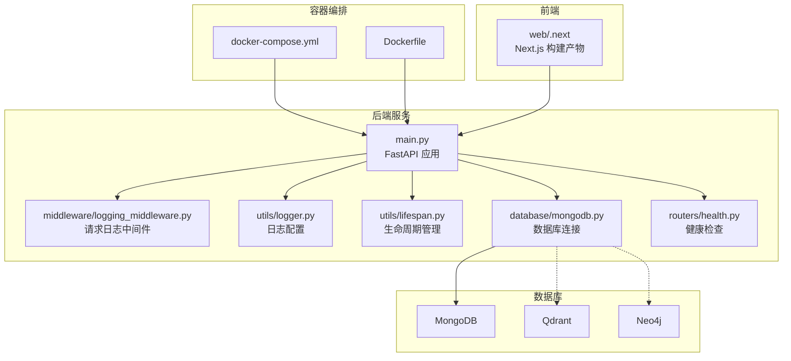
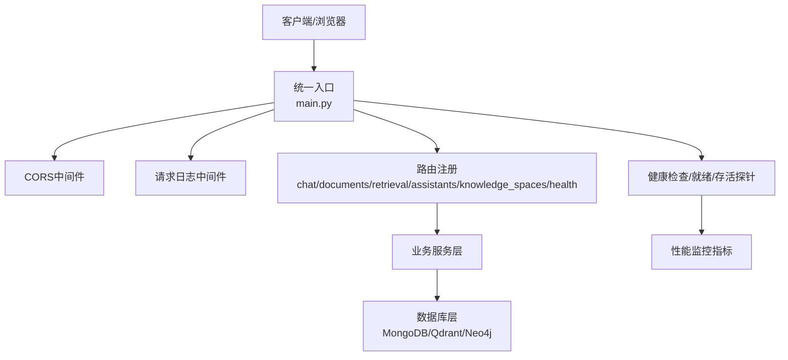
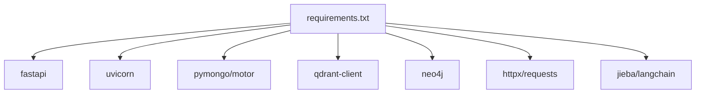

# 安全加固配置

<cite>
**本文引用的文件**
- [Dockerfile](file://Dockerfile)
- [docker-compose.yml](file://docker-compose.yml)
- [main.py](file://main.py)
- [requirements.txt](file://requirements.txt)
- [utils/logger.py](file://utils/logger.py)
- [utils/lifespan.py](file://utils/lifespan.py)
- [middleware/logging_middleware.py](file://middleware/logging_middleware.py)
- [database/mongodb.py](file://database/mongodb.py)
- [routers/health.py](file://routers/health.py)
- [models/user.py](file://models/user.py)
- [models/email.py](file://models/email.py)
</cite>

## 目录
1. [引言](#引言)
2. [项目结构](#项目结构)
3. [核心组件](#核心组件)
4. [架构总览](#架构总览)
5. [详细组件分析](#详细组件分析)
6. [依赖分析](#依赖分析)
7. [性能考虑](#性能考虑)
8. [故障排查指南](#故障排查指南)
9. [结论](#结论)
10. [附录](#附录)

## 引言
本文件面向安全加固场景，基于代码库现状，系统梳理并提出可落地的安全配置建议，涵盖防火墙与端口管理、访问控制、容器与网络隔离、资源限制、应用层安全（认证、授权、会话）、数据加密（传输与存储）、安全审计与日志、入侵检测、安全扫描与合规、安全更新与应急响应等。由于当前仓库未内置专用的安全中间件、鉴权与会话组件、密钥管理与加密模块，本文在“现状分析”基础上给出“加固建议”，帮助在不改变业务逻辑的前提下提升整体安全性。

## 项目结构
该系统由Python后端（FastAPI）与多数据库（MongoDB、Qdrant、Neo4j）组成，并通过Docker与docker-compose进行容器化部署。前端采用Next.js（位于web子目录），后端提供REST API。整体结构如下：

图示来源
- [docker-compose.yml:1-76](file://docker-compose.yml#L1-L76)
- [Dockerfile:1-95](file://Dockerfile#L1-L95)
- [main.py:1-157](file://main.py#L1-L157)
- [middleware/logging_middleware.py:1-52](file://middleware/logging_middleware.py#L1-L52)
- [utils/logger.py:1-88](file://utils/logger.py#L1-L88)
- [utils/lifespan.py:1-88](file://utils/lifespan.py#L1-L88)
- [database/mongodb.py:1-800](file://database/mongodb.py#L1-L800)
- [routers/health.py:1-134](file://routers/health.py#L1-L134)

章节来源
- [Dockerfile:1-95](file://Dockerfile#L1-L95)
- [docker-compose.yml:1-76](file://docker-compose.yml#L1-L76)
- [main.py:1-157](file://main.py#L1-L157)

## 核心组件
- 应用入口与路由：FastAPI应用、CORS中间件、静态文件挂载、全局异常处理。
- 日志与审计：自定义异步日志、请求日志中间件、健康检查与指标端点。
- 数据库连接：MongoDB连接池配置、URI解析与连接参数。
- 生命周期与健康检查：应用启动连接数据库、关闭断开连接；健康检查端点与就绪/存活探针。
- 模型与权限：用户模型与细粒度权限字段，邮件模型。

章节来源
- [main.py:55-126](file://main.py#L55-L126)
- [utils/logger.py:15-82](file://utils/logger.py#L15-L82)
- [middleware/logging_middleware.py:8-51](file://middleware/logging_middleware.py#L8-L51)
- [database/mongodb.py:39-196](file://database/mongodb.py#L39-L196)
- [routers/health.py:23-115](file://routers/health.py#L23-L115)
- [models/user.py:8-85](file://models/user.py#L8-L85)
- [models/email.py:15-104](file://models/email.py#L15-L104)

## 架构总览
下图展示后端与数据库、容器编排及健康检查的整体交互关系，便于理解安全边界与暴露面。

图示来源
- [main.py:90-98](file://main.py#L90-L98)
- [routers/health.py:23-115](file://routers/health.py#L23-L115)
- [database/mongodb.py:92-196](file://database/mongodb.py#L92-L196)

## 详细组件分析

### 防火墙配置与端口管理
- 暴露端口
  - 应用容器对外暴露端口由Dockerfile中的EXPOSE与运行命令决定，当前为固定端口。
  - docker-compose中数据库服务映射了多个端口，需结合实际网络策略最小化暴露。
- 建议
  - 仅暴露必要端口；对数据库端口使用容器网络隔离，避免直接映射到宿主机。
  - 在宿主机/云平台安全组中限制来源IP范围，仅放行受信网段。
  - 对外仅开放反向代理/负载均衡端口，内部服务间通过容器网络通信。

章节来源
- [Dockerfile:89-95](file://Dockerfile#L89-L95)
- [docker-compose.yml:7-8](file://docker-compose.yml#L7-L8)
- [docker-compose.yml:31-34](file://docker-compose.yml#L31-L34)
- [docker-compose.yml:44-47](file://docker-compose.yml#L44-L47)

### 访问控制列表（ACL）与CORS
- CORS现状
  - 当前允许所有来源、方法与头部，便于开发调试，但生产环境存在安全风险。
- 建议
  - 明确白名单域名，限定允许的方法与头部。
  - 对敏感接口启用更严格的跨域策略，避免通配符暴露。

章节来源
- [main.py:62-70](file://main.py#L62-L70)

### Docker容器安全配置与网络隔离
- 容器镜像
  - 使用官方精简基础镜像，减少攻击面；构建阶段启用缓存以提高效率。
- 运行参数
  - 建议以非root用户运行、启用只读根文件系统、限制可写目录（如日志目录）。
  - 使用容器健康检查与重启策略，配合编排工具实现弹性与可观测性。
- 网络隔离
  - 将数据库置于独立网络，仅在编排层面暴露必要端口。
  - 使用容器网络而非Host网络，避免端口冲突与横向移动风险。

章节来源
- [Dockerfile:12-21](file://Dockerfile#L12-L21)
- [Dockerfile:83-87](file://Dockerfile#L83-L87)
- [Dockerfile:91-95](file://Dockerfile#L91-L95)
- [docker-compose.yml:74-76](file://docker-compose.yml#L74-L76)

### 资源限制
- CPU/内存
  - 生产环境可通过容器编排设置CPU/内存限制，避免资源滥用。
- 并发与连接
  - 应用侧已设置每worker并发连接上限与keep-alive超时，建议结合容器资源限制协同使用。
- 数据库连接池
  - MongoDB连接池参数可调优，避免过度占用资源。

章节来源
- [main.py:148-157](file://main.py#L148-L157)
- [database/mongodb.py:122-136](file://database/mongodb.py#L122-L136)

### 应用层安全：认证、授权与会话
- 认证与授权现状
  - 代码库未发现内置认证/授权中间件或会话管理组件；用户模型包含角色与细粒度权限字段，可用于后续接入鉴权框架。
- 建议
  - 引入标准化鉴权方案（如OAuth2/JWT），在路由层统一校验。
  - 会话管理采用短期令牌与刷新令牌策略，严格设置过期时间与安全标志。
  - 对敏感操作（如管理员权限变更）实施二次确认与审计记录。

章节来源
- [models/user.py:8-85](file://models/user.py#L8-L85)

### 数据加密配置：传输与存储
- 传输加密
  - 建议在反向代理层强制HTTPS，TLS版本与套件遵循安全基线。
- 存储加密
  - MongoDB可启用副本集/分片集群的传输加密与静态加密；对敏感字段建议应用层加密。
- 密钥管理
  - 使用安全的密钥管理系统（KMS）或硬件安全模块（HSM），避免硬编码密钥。
  - 定期轮换密钥，最小化密钥暴露面。

章节来源
- [database/mongodb.py:122-136](file://database/mongodb.py#L122-L136)

### 安全审计、日志与入侵检测
- 日志现状
  - 提供异步文件日志与控制台日志，生产环境可调整日志级别以降低噪声。
  - 请求日志中间件记录请求/响应状态与耗时，便于异常追踪。
- 建议
  - 将日志集中到安全信息事件管理（SIEM）系统，开启告警规则。
  - 对敏感操作与异常事件增加结构化审计字段（操作人、时间、IP、结果）。
  - 引入WAF与入侵检测系统（IDS），对常见攻击模式进行拦截与告警。

章节来源
- [utils/logger.py:15-82](file://utils/logger.py#L15-L82)
- [middleware/logging_middleware.py:8-51](file://middleware/logging_middleware.py#L8-L51)

### 健康检查与可观测性
- 健康检查
  - 提供综合健康检查、存活探针与就绪探针，便于编排工具进行自动恢复与流量切换。
- 指标采集
  - 健康端点包含系统资源与请求统计，建议接入Prometheus/Grafana进行可视化与告警。

章节来源
- [routers/health.py:23-115](file://routers/health.py#L23-L115)

### 安全扫描、漏洞评估与合规
- 建议
  - 定期进行容器镜像扫描（镜像层与依赖漏洞）与代码静态分析。
  - 对第三方依赖进行版本跟踪与CVE监控，建立补丁发布流程。
  - 制定合规清单（如数据保护、访问控制、日志留存等），定期自评与外部审计。

章节来源
- [requirements.txt:1-38](file://requirements.txt#L1-L38)

### 安全更新策略、补丁管理与应急响应
- 更新策略
  - 基础镜像与运行时组件定期升级；对关键依赖采用“锁定版本+自动提醒”的策略。
- 补丁管理
  - 建立补丁审批与灰度发布流程，确保变更可回滚。
- 应急响应
  - 制定事件分级与处置流程，明确职责与沟通渠道；对敏感事件进行溯源与复盘。

## 依赖分析
后端依赖主要围绕Web框架、数据库驱动、HTTP客户端与文本处理库。建议对依赖进行漏洞扫描与版本治理。

图示来源
- [requirements.txt:4-38](file://requirements.txt#L4-L38)

章节来源
- [requirements.txt:1-38](file://requirements.txt#L1-L38)

## 性能考虑
- 连接池与并发
  - 数据库连接池参数与应用并发限制需与容器资源匹配，避免资源争用。
- 日志写入
  - 异步日志可降低I/O阻塞，建议结合日志轮转与压缩策略。
- 健康检查
  - 健康检查应轻量且快速，避免成为性能瓶颈。

章节来源
- [database/mongodb.py:122-136](file://database/mongodb.py#L122-L136)
- [utils/logger.py:46-67](file://utils/logger.py#L46-L67)
- [routers/health.py:23-87](file://routers/health.py#L23-L87)

## 故障排查指南
- 数据库连接失败
  - 检查连接字符串、认证信息与网络可达性；确认容器网络与端口映射。
- 请求异常与慢请求
  - 通过请求日志中间件定位异常与慢请求；结合健康检查端点判断服务状态。
- 日志问题
  - 检查日志目录权限与磁盘空间；调整日志级别以减少噪声。

章节来源
- [database/mongodb.py:154-184](file://database/mongodb.py#L154-L184)
- [middleware/logging_middleware.py:8-51](file://middleware/logging_middleware.py#L8-L51)
- [utils/logger.py:31-54](file://utils/logger.py#L31-L54)

## 结论
本项目在容器化与日志方面具备良好基础，但在认证授权、访问控制、传输与存储加密、入侵检测与合规等方面尚需补齐。建议以“最小暴露面、纵深防御、可观测性与可追溯性”为核心原则，逐步引入标准化安全组件与流程，确保系统在生产环境下的安全性与稳定性。

## 附录
- 端口与服务映射参考
  - 应用端口：由Dockerfile与运行命令确定。
  - 数据库端口：MongoDB、Qdrant、Neo4j在compose文件中定义。
- 环境变量与配置
  - 应用通过dotenv加载环境变量，建议将敏感信息纳入密钥管理。

章节来源
- [Dockerfile:14-20](file://Dockerfile#L14-L20)
- [docker-compose.yml:3-17](file://docker-compose.yml#L3-L17)
- [docker-compose.yml:26-57](file://docker-compose.yml#L26-L57)
- [main.py:20-53](file://main.py#L20-L53)