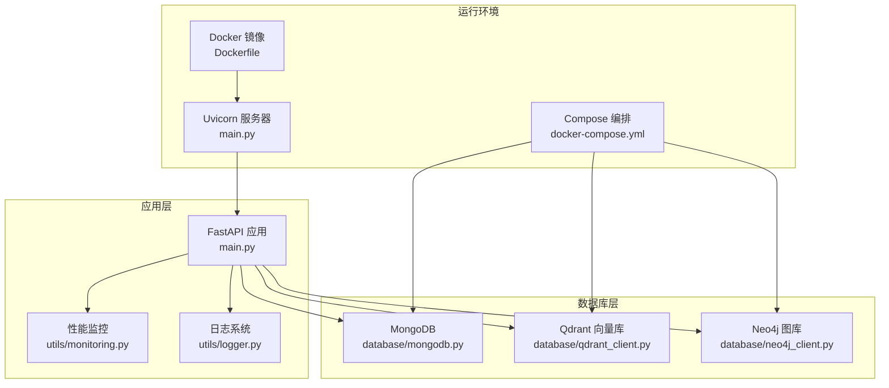
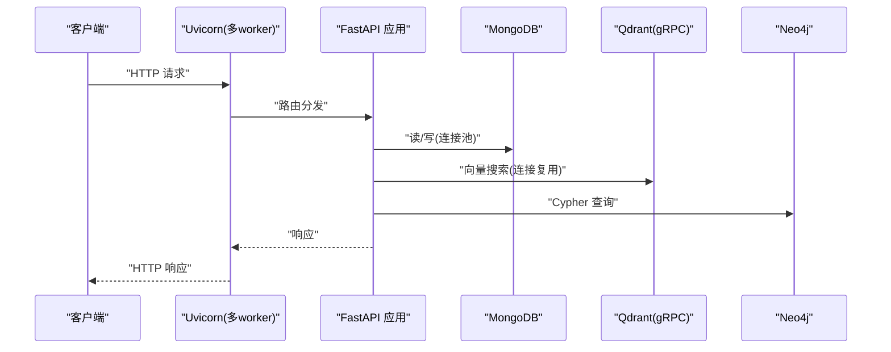
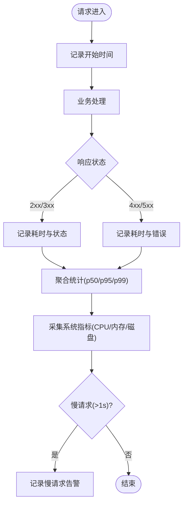
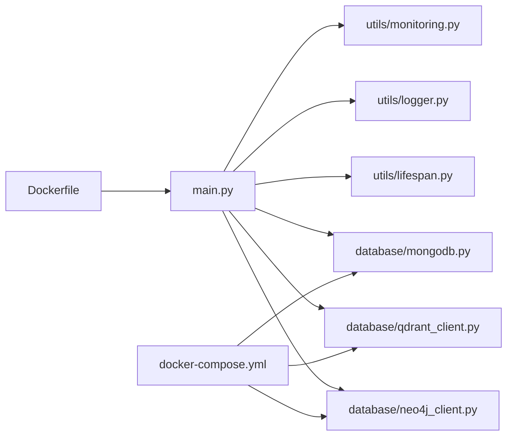

# 性能调优配置

<cite>
**本文引用的文件**   
- [main.py](file://main.py)
- [Dockerfile](file://Dockerfile)
- [docker-compose.yml](file://docker-compose.yml)
- [requirements.txt](file://requirements.txt)
- [utils/monitoring.py](file://utils/monitoring.py)
- [utils/lifespan.py](file://utils/lifespan.py)
- [utils/logger.py](file://utils/logger.py)
- [database/mongodb.py](file://database/mongodb.py)
- [database/qdrant_client.py](file://database/qdrant_client.py)
- [database/neo4j_client.py](file://database/neo4j_client.py)
- [README.md](file://README.md)
- [scripts/boot_verify.py](file://scripts/boot_verify.py)
</cite>

## 目录
1. [简介](#简介)
2. [项目结构](#项目结构)
3. [核心组件](#核心组件)
4. [架构总览](#架构总览)
5. [详细组件分析](#详细组件分析)
6. [依赖关系分析](#依赖关系分析)
7. [性能考虑](#性能考虑)
8. [故障排查指南](#故障排查指南)
9. [结论](#结论)
10. [附录](#附录)

## 简介
本文件面向系统运维与平台工程团队，提供本项目的系统级与应用级性能调优配置说明，涵盖：
- 系统级调优：内核参数、文件描述符限制、网络栈优化
- 应用服务器调优：Uvicorn/Gunicorn 进程与线程配置、连接池参数
- 数据库调优：MongoDB、Qdrant、Neo4j 的连接池与查询优化要点
- 内存与GC：Python 运行时内存与资源监控
- 负载测试与基准：如何设计压测场景与评估瓶颈
- 实时监控：指标采集、可视化与告警

## 项目结构
后端基于 FastAPI + Uvicorn，数据库包含 MongoDB、Qdrant、Neo4j，容器编排使用 Docker Compose。

**图表来源**
- [main.py:128-157](file://main.py#L128-L157)
- [Dockerfile:94](file://Dockerfile#L94)
- [docker-compose.yml:1-76](file://docker-compose.yml#L1-L76)
- [database/mongodb.py:92-199](file://database/mongodb.py#L92-L199)
- [database/qdrant_client.py:18-96](file://database/qdrant_client.py#L18-L96)
- [database/neo4j_client.py:6-39](file://database/neo4j_client.py#L6-L39)
- [utils/monitoring.py:13-115](file://utils/monitoring.py#L13-L115)
- [utils/logger.py:15-87](file://utils/logger.py#L15-L87)

**章节来源**
- [main.py:128-157](file://main.py#L128-L157)
- [Dockerfile:94](file://Dockerfile#L94)
- [docker-compose.yml:1-76](file://docker-compose.yml#L1-L76)

## 核心组件
- 应用入口与服务器：FastAPI 应用、Uvicorn 运行参数（工作进程、并发、keep-alive）
- 数据库客户端：MongoDB 连接池参数、Qdrant gRPC 连接与超时、Neo4j 驱动
- 监控与日志：请求耗时统计、慢请求告警、系统指标采集、异步日志

**章节来源**
- [main.py:128-157](file://main.py#L128-L157)
- [database/mongodb.py:122-136](file://database/mongodb.py#L122-L136)
- [database/qdrant_client.py:66-96](file://database/qdrant_client.py#L66-L96)
- [database/neo4j_client.py:16-39](file://database/neo4j_client.py#L16-L39)
- [utils/monitoring.py:13-115](file://utils/monitoring.py#L13-L115)
- [utils/logger.py:15-87](file://utils/logger.py#L15-L87)

## 架构总览
下图展示生产环境的运行形态与关键性能参数位置。

**图表来源**
- [main.py:128-157](file://main.py#L128-L157)
- [database/mongodb.py:122-136](file://database/mongodb.py#L122-L136)
- [database/qdrant_client.py:66-96](file://database/qdrant_client.py#L66-L96)
- [database/neo4j_client.py:40-62](file://database/neo4j_client.py#L40-L62)

## 详细组件分析

### 应用服务器性能配置（Uvicorn）
- 工作进程数（UVICORN_WORKERS）
  - 生产环境默认 24，可通过环境变量覆盖
  - 建议与 CPU 核心数匹配，或略小于核数以留出系统开销
- 并发与 keep-alive
  - limit_concurrency=2000：每个 worker 的并发连接上限
  - timeout_keep_alive=900：长连接保活时间（15 分钟），适合大文件上传
- reload
  - 开发环境启用，生产环境禁用，避免热重启带来的额外开销

建议项（基于现有实现）：
- 通过环境变量 UVICORN_WORKERS 调整 worker 数量
- 通过环境变量 PORT 设置监听端口
- 如需更高吞吐，结合 limit_concurrency 与系统 FD 限额协同调优

**章节来源**
- [main.py:139-157](file://main.py#L139-L157)
- [Dockerfile:19](file://Dockerfile#L19)
- [Dockerfile:94](file://Dockerfile#L94)

### 数据库性能配置

#### MongoDB（Motor 异步客户端）
- 连接池参数（通过环境变量注入）
  - maxPoolSize：默认 100，建议与 worker 数量匹配或更高以应对峰值并发
  - minPoolSize：默认 10，保持一定空闲连接
  - maxIdleTimeMS：默认 30000（30 秒），降低空闲连接回收频率
  - serverSelectionTimeoutMS：默认 5000（5 秒），缩短超时以快速失败
  - connectTimeoutMS：默认 10000（10 秒）
  - socketTimeoutMS：默认 30000（30 秒）
- 连接字符串拼接与查询参数合并，确保连接池参数生效

调优建议：
- 将 maxPoolSize 设为 worker 数 × N（N=2~4，视 IO 密集程度）
- 配合 limit_concurrency 与系统 FD 限额，避免连接池耗尽
- 对长事务或批处理任务，适当提高 connectTimeoutMS 与 socketTimeoutMS

**章节来源**
- [database/mongodb.py:122-136](file://database/mongodb.py#L122-L136)
- [database/mongodb.py:154-166](file://database/mongodb.py#L154-L166)

#### Qdrant（gRPC 优先）
- 连接策略
  - prefer_grpc=True：优先使用 gRPC，具备连接复用与更低延迟
  - 超时：通过 QDRANT_TIMEOUT 控制（默认 30.0 秒）
  - gRPC 端口：默认 6334，避免 HTTP 502 问题
- 重试与降级
  - 插入/查询失败时具备指数退避与自动重建集合能力
- 健康检查
  - get_collections() 用于可用性探测

调优建议：
- 在高并发场景下，优先使用 gRPC 并增大 QDRANT_TIMEOUT
- 集合维度与向量维度一致，避免自动重建带来的停机窗口
- 对批量入库场景，合理拆分批次并开启幂等插入

**章节来源**
- [database/qdrant_client.py:66-96](file://database/qdrant_client.py#L66-L96)
- [database/qdrant_client.py:210-335](file://database/qdrant_client.py#L210-L335)
- [database/qdrant_client.py:124-139](file://database/qdrant_client.py#L124-L139)

#### Neo4j
- 连接与容器适配
  - 支持容器内 localhost 替换为 host.docker.internal
  - 验证连接：verify_connectivity()
- 查询执行
  - session.run() 执行 Cypher，返回记录列表

调优建议：
- 对复杂图查询，尽量使用 MATCH/RETURN 的谓词下推与索引
- 控制事务大小，避免长时间持有锁

**章节来源**
- [database/neo4j_client.py:16-39](file://database/neo4j_client.py#L16-L39)
- [database/neo4j_client.py:56-62](file://database/neo4j_client.py#L56-L62)

### 监控与日志

#### 性能监控（请求耗时、慢请求、系统指标）
- 请求统计
  - 记录每个路径/方法的耗时、错误计数，支持 p50/p95/p99
  - 仅保留最近 1000 次请求时间，避免内存膨胀
- 系统指标
  - CPU、内存、磁盘使用率与进程级指标
- 慢请求告警
  - 超过 1 秒的请求记录 warning 日志

**图表来源**
- [utils/monitoring.py:22-184](file://utils/monitoring.py#L22-L184)

**章节来源**
- [utils/monitoring.py:13-115](file://utils/monitoring.py#L13-L115)
- [utils/monitoring.py:118-184](file://utils/monitoring.py#L118-L184)

#### 日志系统（异步写入）
- 异步日志队列：QueueListener 后台线程写文件，避免阻塞请求
- 生产环境：文件日志级别提升至 WARNING，减少 IO 压力
- 第三方库日志抑制：对 httpx、motor、pymongo 等设置 WARNING

**章节来源**
- [utils/logger.py:15-87](file://utils/logger.py#L15-L87)

### 生命周期与数据库连接
- 应用启动时连接 MongoDB，带重试机制
- 应用关闭时断开连接，保证资源释放

**章节来源**
- [utils/lifespan.py:26-87](file://utils/lifespan.py#L26-L87)
- [database/mongodb.py:99-199](file://database/mongodb.py#L99-L199)

## 依赖关系分析

**图表来源**
- [main.py:15-18](file://main.py#L15-L18)
- [utils/monitoring.py:7-11](file://utils/monitoring.py#L7-L11)
- [utils/logger.py:6-8](file://utils/logger.py#L6-L8)
- [utils/lifespan.py:4-5](file://utils/lifespan.py#L4-L5)
- [database/mongodb.py:2-6](file://database/mongodb.py#L2-L6)
- [database/qdrant_client.py:5-13](file://database/qdrant_client.py#L5-L13)
- [database/neo4j_client.py:3-4](file://database/neo4j_client.py#L3-L4)
- [Dockerfile:94](file://Dockerfile#L94)
- [docker-compose.yml:1-76](file://docker-compose.yml#L1-L76)

**章节来源**
- [requirements.txt:4-38](file://requirements.txt#L4-L38)

## 性能考虑

### 系统级调优（建议项）
- 内核参数
  - net.core.somaxconn：监听队列长度，建议 ≥ 4096
  - net.ipv4.tcp_max_syn_backlog：半连接队列，建议 ≥ 4096
  - fs.file-max / fs.nr_open：文件描述符上限，建议 ≥ 1048576
- 文件描述符限制
  - systemd 服务 LimitNOFILE=1048576
  - ulimit -n 1048576
- 网络栈优化
  - tcp_tw_reuse=1、tcp_fin_timeout=15
  - 调整 net.core.netdev_max_backlog 以适应高并发网卡

说明：以上为通用建议，需结合实际部署环境与内核版本进行验证。

### 应用服务器调优
- 进程数与并发
  - UVICORN_WORKERS ≈ CPU 核心数或略小
  - limit_concurrency 与 maxPoolSize 协同，避免连接池与 FD 竞争
- keep-alive
  - timeout_keep_alive=900 适合大文件上传，短请求可适当下调

**章节来源**
- [main.py:139-157](file://main.py#L139-L157)

### 数据库调优
- MongoDB
  - maxPoolSize 与 worker 数匹配，minPoolSize 保持空闲连接
  - 针对长事务与批处理，适度提高超时参数
- Qdrant
  - 优先 gRPC，合理设置 QDRANT_TIMEOUT
  - 批量入库时拆分批次，避免维度不匹配导致重建
- Neo4j
  - 使用谓词下推与索引，控制事务大小

**章节来源**
- [database/mongodb.py:122-136](file://database/mongodb.py#L122-L136)
- [database/qdrant_client.py:66-96](file://database/qdrant_client.py#L66-L96)
- [database/neo4j_client.py:40-62](file://database/neo4j_client.py#L40-L62)

### 内存管理与资源监控
- Python 进程内存
  - 使用系统指标采集（CPU/内存/磁盘）与慢请求告警
  - 生产环境日志级别上调，减少 IO
- 资源监控
  - 持续记录 p50/p95/p99，关注尾部延迟增长

**章节来源**
- [utils/monitoring.py:78-111](file://utils/monitoring.py#L78-L111)
- [utils/logger.py:77-81](file://utils/logger.py#L77-L81)

### 负载测试与基准
- 场景设计
  - 高并发短请求（对话）、长连接大文件上传、混合检索（向量+关键词+图谱）
- 指标
  - 吞吐（req/s）、P95/P99 延迟、错误率、连接池命中率
- 工具
  - wrk、ab、k6、JMeter 等
- 基准脚本参考
  - boot_verify.py 展示了上传与空间查询的基本流程，可用于构造自动化压测

**章节来源**
- [scripts/boot_verify.py:45-72](file://scripts/boot_verify.py#L45-L72)

### 瓶颈分析方法
- 分层定位
  - 应用层：慢请求统计、系统指标
  - 数据库层：连接池饱和、查询耗时、网络往返
  - 存储层：IO 延迟、磁盘队列、网络抖动
- 采样与火焰图
  - 使用 cprofile/py-spy 等工具定位热点函数

## 故障排查指南
- 启动失败（MongoDB 连接）
  - 检查 MONGODB_URI/MONGODB_HOST/PORT/DB_NAME 配置
  - 查看连接池参数与超时设置
- Qdrant 插入失败
  - 检查集合维度是否与向量维度一致
  - 观察重试日志与超时设置
- Neo4j 查询失败
  - 检查容器内 URI 替换逻辑与认证
- 慢请求
  - 查看慢请求告警与 p95/p99 统计
- 日志风暴
  - 生产环境日志级别上调，减少 INFO 级别写入

**章节来源**
- [database/mongodb.py:168-184](file://database/mongodb.py#L168-L184)
- [database/qdrant_client.py:280-335](file://database/qdrant_client.py#L280-L335)
- [database/neo4j_client.py:30-33](file://database/neo4j_client.py#L30-L33)
- [utils/monitoring.py:178-184](file://utils/monitoring.py#L178-L184)
- [utils/logger.py:77-81](file://utils/logger.py#L77-L81)

## 结论
本项目在生产环境默认采用多 worker 与连接池参数优化，辅以 gRPC 与系统指标采集。建议结合业务流量特征，按 CPU 核心数设定 worker 数，按并发与超时参数调优连接池，并通过慢请求统计与系统指标持续观测尾延迟变化，逐步收敛至稳定高效状态。

## 附录

### 环境变量与默认值清单
- 应用与服务器
  - ENVIRONMENT=production
  - UVICORN_PORT=8000
  - UVICORN_WORKERS=24
- 数据库
  - MONGODB_URI/MONGODB_HOST/MONGODB_PORT/MONGODB_DB_NAME
  - QDRANT_URL/QDRANT_API_KEY/QDRANT_TIMEOUT/QDRANT_GRPC_PORT
  - NEO4J_URI/NEO4J_USER/NEO4J_PASSWORD
- 日志
  - LOG_LEVEL=INFO（生产环境自动提升至 WARNING）

**章节来源**
- [Dockerfile:14-20](file://Dockerfile#L14-L20)
- [README.md:129-166](file://README.md#L129-L166)