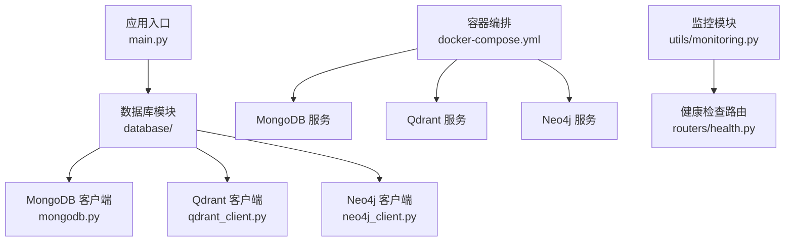
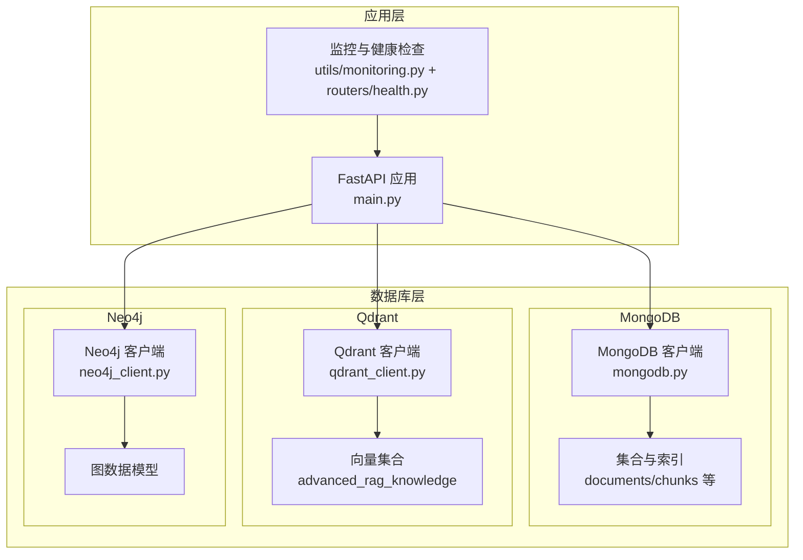
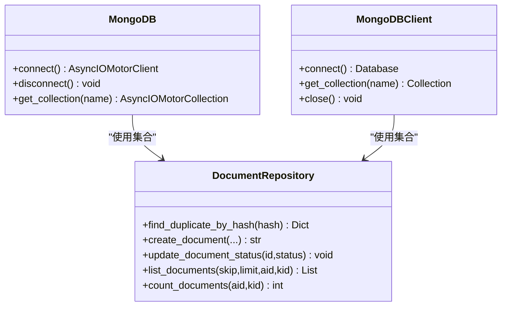
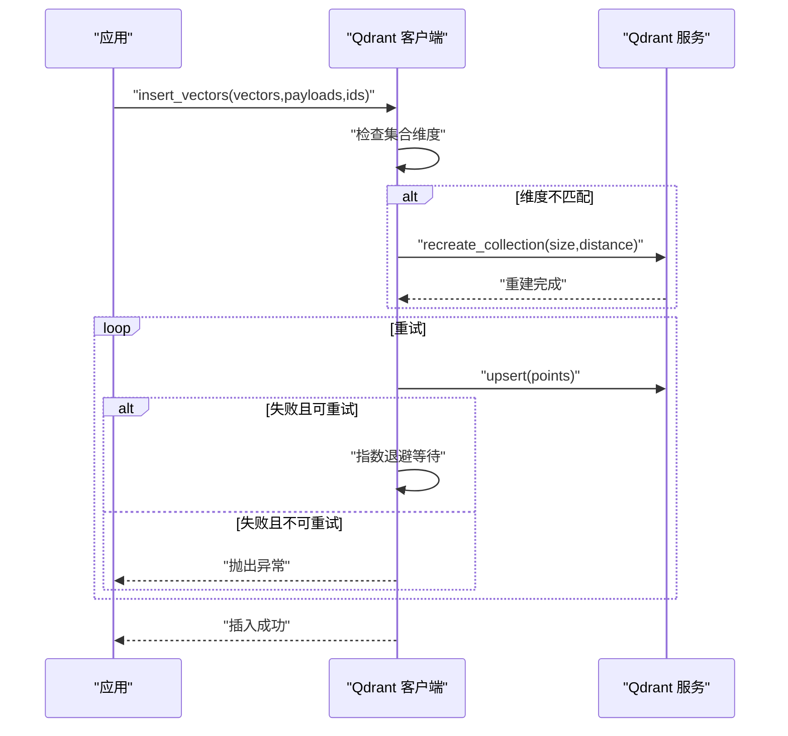
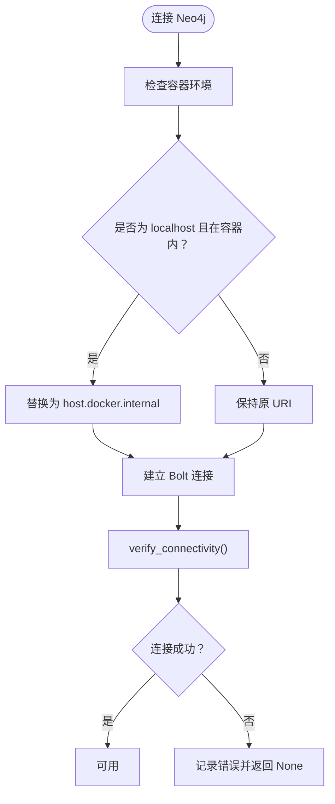
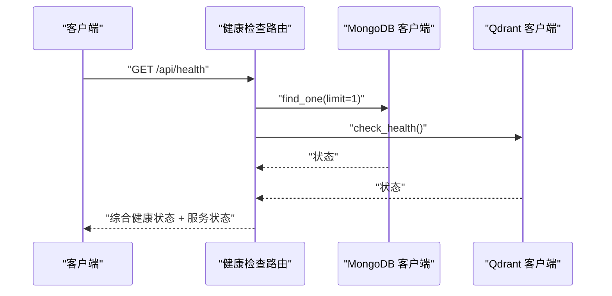
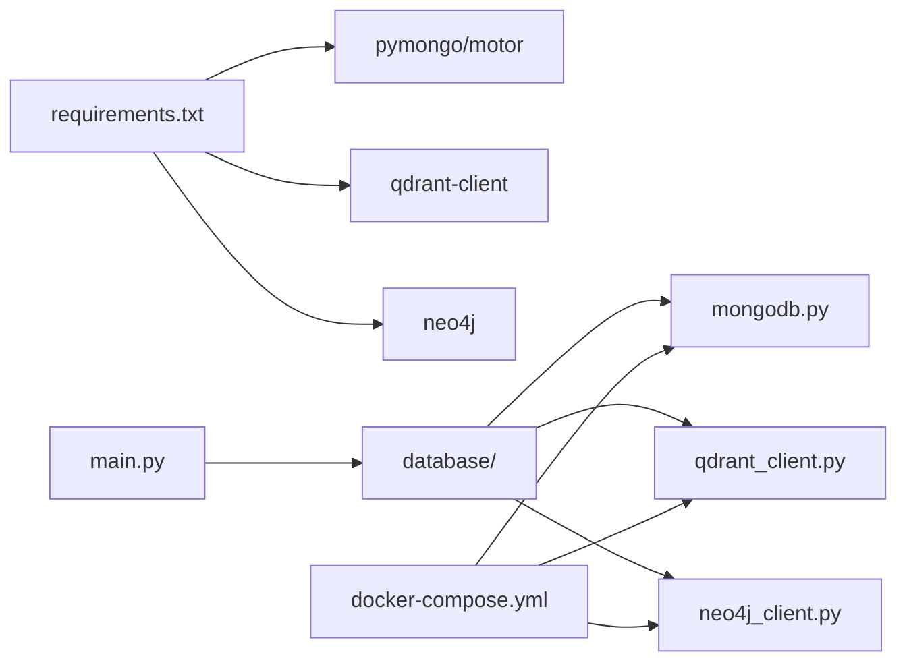

# 数据库生产配置

<cite>
**本文档引用的文件**
- [database/mongodb.py](file://database/mongodb.py)
- [database/qdrant_client.py](file://database/qdrant_client.py)
- [database/neo4j_client.py](file://database/neo4j_client.py)
- [docker-compose.yml](file://docker-compose.yml)
- [requirements.txt](file://requirements.txt)
- [main.py](file://main.py)
- [utils/monitoring.py](file://utils/monitoring.py)
- [routers/health.py](file://routers/health.py)
- [scripts/README_MIGRATIONS.md](file://scripts/README_MIGRATIONS.md)
</cite>

## 目录
1. [简介](#简介)
2. [项目结构](#项目结构)
3. [核心组件](#核心组件)
4. [架构概览](#架构概览)
5. [详细组件分析](#详细组件分析)
6. [依赖关系分析](#依赖关系分析)
7. [性能考虑](#性能考虑)
8. [故障排查指南](#故障排查指南)
9. [结论](#结论)
10. [附录](#附录)

## 简介
本文件面向数据库生产部署，系统性梳理并规范以下数据库的生产配置与运维要点：
- MongoDB：副本集配置、主从复制与故障转移、连接池与性能调优
- Qdrant：集群配置、分片策略与数据持久化
- Neo4j：高可用集群、读写分离与备份策略
- 安全配置：认证、授权、SSL 加密与访问控制
- 性能调优：连接池、索引策略、查询优化与监控指标
- 维护任务：健康检查、监控与迁移脚本

## 项目结构
数据库相关代码集中在 database/ 目录，配合 docker-compose.yml 提供本地开发环境，requirements.txt 明确依赖版本，main.py 提供应用入口与环境变量加载。

**图表来源**
- [main.py:55-98](file://main.py#L55-L98)
- [database/mongodb.py:92-196](file://database/mongodb.py#L92-L196)
- [database/qdrant_client.py:18-96](file://database/qdrant_client.py#L18-L96)
- [database/neo4j_client.py:6-39](file://database/neo4j_client.py#L6-L39)
- [docker-compose.yml:1-76](file://docker-compose.yml#L1-L76)

**章节来源**
- [main.py:1-157](file://main.py#L1-L157)
- [docker-compose.yml:1-76](file://docker-compose.yml#L1-L76)
- [requirements.txt:1-38](file://requirements.txt#L1-L38)

## 核心组件
- MongoDB 客户端（异步/同步双版本）：支持环境变量驱动的连接字符串解析、连接池参数配置、集合操作与文档仓库封装
- Qdrant 客户端：gRPC 优先连接、自动重试与维度校验、集合创建与向量检索
- Neo4j 客户端：Bolt 连接、容器环境兼容、Cypher 查询封装
- 健康检查与监控：统一健康检查端点、系统资源与请求统计监控
- 迁移脚本：索引创建与模型迁移，保障生产环境一致性

**章节来源**
- [database/mongodb.py:92-313](file://database/mongodb.py#L92-L313)
- [database/qdrant_client.py:18-544](file://database/qdrant_client.py#L18-L544)
- [database/neo4j_client.py:6-104](file://database/neo4j_client.py#L6-L104)
- [routers/health.py:23-135](file://routers/health.py#L23-L135)
- [utils/monitoring.py:13-185](file://utils/monitoring.py#L13-L185)
- [scripts/README_MIGRATIONS.md:1-135](file://scripts/README_MIGRATIONS.md#L1-L135)

## 架构概览
生产环境推荐使用容器化部署，结合健康检查与监控，形成高可用与可观测的数据库体系。

**图表来源**
- [main.py:55-98](file://main.py#L55-L98)
- [database/mongodb.py:92-313](file://database/mongodb.py#L92-L313)
- [database/qdrant_client.py:18-544](file://database/qdrant_client.py#L18-L544)
- [database/neo4j_client.py:6-104](file://database/neo4j_client.py#L6-L104)
- [utils/monitoring.py:13-185](file://utils/monitoring.py#L13-L185)
- [routers/health.py:23-135](file://routers/health.py#L23-L135)

## 详细组件分析

### MongoDB 生产配置
- 连接与认证
  - 支持 MONGODB_URI 或独立 HOST/PORT/USERNAME/PASSWORD/ AUTH_SOURCE 组合
  - 连接字符串解析与数据库名提取，兼容带/不带认证的多种形式
- 连接池参数（生产建议）
  - maxPoolSize：100-200（根据并发 worker 数量调整）
  - minPoolSize：10（保持最小活跃连接）
  - maxIdleTimeMS：30000（30秒）
  - serverSelectionTimeoutMS：5000（5秒）
  - connectTimeoutMS：10000（10秒）
  - socketTimeoutMS：30000（30秒）
- 健康检查与错误处理
  - 连接后执行 ping 校验
  - 失败时记录详细提示（服务状态、环境变量配置、Docker 地址映射）
- 集合与仓库
  - 文档仓库与分块仓库封装常用 CRUD 操作
  - ObjectId 转换与时间戳管理
- 副本集与主从复制（生产建议）
  - 使用官方 MongoDB 副本集部署，配置 arbiter 与隐藏节点
  - 应用侧使用副本集连接字符串（mongodb://host1:port,host2:port,host3:port/?replicaSet=rs0）
  - 设置合适的 write concern（w=majority）与 read preference（secondaryPreferred）
  - 配置自动故障转移与仲裁节点，确保 2N+1 节点奇数布局
- 故障转移机制
  - 通过驱动层感知主节点变更，自动重连
  - 建议开启连接池超时与重试策略，避免瞬时抖动影响业务
- 索引与查询优化
  - 基于迁移脚本创建必要索引（用户、助手、文档、资源等）
  - 对高频查询字段建立复合索引，避免全表扫描
- 数据持久化
  - 使用卷挂载持久化 /data/db 与 /data/configdb
  - 定期备份与快照策略，结合 oplog 保证增量恢复
- 安全配置
  - 启用认证（SCRAM-SHA-256 或 SCRAM-SHA-1）
  - 限制网络访问（仅允许应用网段）
  - 使用 TLS/SSL 加密传输
  - 最小权限原则分配角色与资源访问

**图表来源**
- [database/mongodb.py:92-313](file://database/mongodb.py#L92-L313)
- [database/mongodb.py:315-768](file://database/mongodb.py#L315-L768)

**章节来源**
- [database/mongodb.py:92-313](file://database/mongodb.py#L92-L313)
- [database/mongodb.py:315-768](file://database/mongodb.py#L315-L768)
- [docker-compose.yml:18-24](file://docker-compose.yml#L18-L24)

### Qdrant 生产配置
- 连接与协议
  - 优先使用 gRPC（端口 6334）以获得更好的性能与连接复用
  - HTTP 连接仅在本地开发场景下使用，生产建议 HTTPS 或 gRPC
- 自动重试与维度校验
  - 插入失败时自动重建集合（维度不匹配）
  - 支持指数退避重试（502/503/504/超时等）
- 集合管理
  - create_collection：按向量维度与距离度量创建
  - get_collection_info：获取点数统计
- 搜索与过滤
  - query_points：支持分数阈值与 payload 过滤
  - delete_by_document_id：按文档 ID 删除相关向量
- 分片策略（生产建议）
  - 单机部署：单集合，按文档 ID 过滤
  - 集群部署：使用 Qdrant 集群版，按业务域拆分集合或使用命名空间
- 数据持久化
  - 卷挂载 /qdrant/storage，定期快照与 WAL 备份
- 安全配置
  - 生产环境使用 HTTPS 或 gRPC + TLS
  - API Key 与访问控制白名单
- 性能调优
  - 调整超时与 gRPC 并发参数
  - 合理设置向量维度与距离度量（余弦/COSINE 更适合高维）

**图表来源**
- [database/qdrant_client.py:210-335](file://database/qdrant_client.py#L210-L335)

**章节来源**
- [database/qdrant_client.py:18-544](file://database/qdrant_client.py#L18-L544)
- [docker-compose.yml:26-38](file://docker-compose.yml#L26-L38)

### Neo4j 高可用配置
- 连接与认证
  - 默认 bolt://localhost:7687，支持用户名/密码认证
  - 容器内自动替换 localhost 为 host.docker.internal
- 图模型与查询
  - create_entity：基于 MERGE 的幂等创建
  - create_relationship：创建关系并设置属性
- 高可用与读写分离（生产建议）
  - 使用 Neo4j 集群（Causal Clustering），包含 Core 节点与 Read Replica
  - 读查询路由到 Read Replica，写操作路由到 Core
  - 配置负载均衡与故障转移
- 备份策略
  - 采用在线热备份（dbms.backup.enabled）与快照
  - 定期导出 GraphML/CSV 作为离线备份
- 安全配置
  - 启用原生认证与 LDAP 集成
  - 限制网络访问与 TLS 加密
  - 最小权限的角色授权

**图表来源**
- [database/neo4j_client.py:16-39](file://database/neo4j_client.py#L16-L39)

**章节来源**
- [database/neo4j_client.py:6-104](file://database/neo4j_client.py#L6-L104)
- [docker-compose.yml:39-57](file://docker-compose.yml#L39-L57)

### 健康检查与监控
- 健康检查端点
  - /api/health：检查 MongoDB 与 Qdrant 连接状态，汇总整体健康
  - /api/health/liveness：存活探针（Kubernetes）
  - /api/health/readiness：就绪探针（Kubernetes）
- 性能监控
  - 记录请求耗时、错误率与百分位数（p50/p95/p99）
  - 采集 CPU、内存、磁盘使用率
- 系统指标
  - 进程级 CPU/内存占用
  - 磁盘容量与使用率

**图表来源**
- [routers/health.py:23-87](file://routers/health.py#L23-L87)
- [database/mongodb.py:34-89](file://database/mongodb.py#L34-L89)
- [database/qdrant_client.py:124-139](file://database/qdrant_client.py#L124-L139)

**章节来源**
- [routers/health.py:23-135](file://routers/health.py#L23-L135)
- [utils/monitoring.py:13-185](file://utils/monitoring.py#L13-L185)

### 迁移与维护
- 迁移脚本
  - 创建 MongoDB 与 Neo4j 索引
  - 用户模型字段迁移与资源 schema 版本升级
  - 记录迁移历史于 migration_history 集合
- 迁移最佳实践
  - 生产前在测试环境验证
  - 备份数据库后再执行
  - 幂等性设计，支持重复运行

**章节来源**
- [scripts/README_MIGRATIONS.md:1-135](file://scripts/README_MIGRATIONS.md#L1-L135)

## 依赖关系分析
- 应用依赖数据库客户端模块，数据库客户端依赖对应驱动
- docker-compose 提供三类数据库服务，分别映射不同端口
- 健康检查路由依赖数据库客户端进行连接验证

**图表来源**
- [requirements.txt:9-13](file://requirements.txt#L9-L13)
- [main.py:15-17](file://main.py#L15-L17)
- [database/mongodb.py:1-10](file://database/mongodb.py#L1-L10)
- [database/qdrant_client.py:1-15](file://database/qdrant_client.py#L1-L15)
- [database/neo4j_client.py:1-4](file://database/neo4j_client.py#L1-L4)
- [docker-compose.yml:1-76](file://docker-compose.yml#L1-L76)

**章节来源**
- [requirements.txt:1-38](file://requirements.txt#L1-L38)
- [main.py:15-17](file://main.py#L15-L17)
- [docker-compose.yml:1-76](file://docker-compose.yml#L1-L76)

## 性能考虑
- 连接池与超时
  - MongoDB：合理设置 maxPoolSize/minPoolSize 与超时参数，避免连接饥饿
  - Qdrant：gRPC 优先，调整超时与重试策略
  - Neo4j：Bolt 连接池与读写分离
- 索引策略
  - 基于迁移脚本创建必要索引，避免全表扫描
  - 复合索引覆盖高频查询条件
- 查询优化
  - 限制返回字段与数量，使用投影与分页
  - 合理使用过滤条件与排序键
- 监控与告警
  - 使用 /api/health/metrics 获取请求统计与系统指标
  - 配置慢查询与错误率阈值告警

[本节为通用指导，无需特定文件引用]

## 故障排查指南
- MongoDB
  - 连接失败：检查 MONGODB_URI/MONGODB_HOST/MONGODB_PORT/认证信息
  - Docker 环境：确认 host.docker.internal 映射与端口开放
  - 副本集：验证主节点切换与仲裁节点状态
- Qdrant
  - gRPC 502：优先使用 gRPC（端口 6334），避免 httpx 问题
  - 维度不匹配：自动重建集合或手动调整向量维度
  - 重试失败：检查网络与服务可用性
- Neo4j
  - 连接失败：确认 NEO4J_URI/NEO4J_USER/NEO4J_PASSWORD
  - 容器内：localhost 替换为 host.docker.internal
  - 集群：检查 Core/Replica 节点状态与复制延迟
- 健康检查
  - /api/health：查看服务状态与错误摘要
  - /api/health/metrics：定位性能瓶颈与资源占用

**章节来源**
- [database/mongodb.py:154-184](file://database/mongodb.py#L154-L184)
- [database/qdrant_client.py:97-123](file://database/qdrant_client.py#L97-L123)
- [database/neo4j_client.py:16-39](file://database/neo4j_client.py#L16-L39)
- [routers/health.py:23-135](file://routers/health.py#L23-L135)

## 结论
通过容器化部署与完善的健康检查、监控与迁移机制，本项目实现了对 MongoDB、Qdrant 与 Neo4j 的生产级配置与运维支撑。建议在生产环境中进一步完善副本集/集群的高可用与灾备策略，并持续优化索引与查询性能，结合监控告警体系保障系统稳定运行。

[本节为总结性内容，无需特定文件引用]

## 附录
- 环境变量参考
  - MongoDB：MONGODB_URI、MONGODB_HOST、MONGODB_PORT、MONGODB_USERNAME、MONGODB_PASSWORD、MONGODB_AUTH_SOURCE、MONGODB_DB_NAME、MONGODB_MAX_POOL_SIZE、MONGODB_MIN_POOL_SIZE、MONGODB_MAX_IDLE_TIME_MS、MONGODB_SERVER_SELECTION_TIMEOUT_MS、MONGODB_CONNECT_TIMEOUT_MS、MONGODB_SOCKET_TIMEOUT_MS
  - Qdrant：QDRANT_URL、QDRANT_API_KEY、QDRANT_TIMEOUT、QDRANT_GRPC_PORT
  - Neo4j：NEO4J_URI、NEO4J_USER、NEO4J_PASSWORD
- 迁移命令示例
  - 查看迁移状态：python scripts/migrate_models.py --status
  - 运行指定迁移：python scripts/migrate_models.py --migrations 001_create_mongodb_indexes 002_create_neo4j_indexes

**章节来源**
- [database/mongodb.py:101-120](file://database/mongodb.py#L101-L120)
- [database/qdrant_client.py:35-37](file://database/qdrant_client.py#L35-L37)
- [database/neo4j_client.py:11-13](file://database/neo4j_client.py#L11-L13)
- [scripts/README_MIGRATIONS.md:13-46](file://scripts/README_MIGRATIONS.md#L13-L46)