# 生产环境配置

<cite>
**本文档引用的文件**
- [docker-compose.yml](file://docker-compose.yml)
- [Dockerfile](file://Dockerfile)
- [requirements.txt](file://requirements.txt)
- [main.py](file://main.py)
- [database/mongodb.py](file://database/mongodb.py)
- [database/qdrant_client.py](file://database/qdrant_client.py)
- [database/neo4j_client.py](file://database/neo4j_client.py)
- [utils/monitoring.py](file://utils/monitoring.py)
- [routers/health.py](file://routers/health.py)
- [utils/logger.py](file://utils/logger.py)
- [utils/lifespan.py](file://utils/lifespan.py)
- [web/Dockerfile](file://web/Dockerfile)
- [web/next.config.ts](file://web/next.config.ts)
- [README.md](file://README.md)
</cite>

## 目录
1. [简介](#简介)
2. [项目结构](#项目结构)
3. [核心组件](#核心组件)
4. [架构概览](#架构概览)
5. [详细组件分析](#详细组件分析)
6. [依赖关系分析](#依赖关系分析)
7. [性能考虑](#性能考虑)
8. [故障排除指南](#故障排除指南)
9. [结论](#结论)
10. [附录](#附录)

## 简介

本文件为 advanced-rag 生产环境配置的详细文档，涵盖系统要求、硬件配置建议、软件依赖、数据库生产级配置、Nginx反向代理配置、SSL/TLS证书配置、负载均衡设置、环境变量配置、安全配置、性能参数调优、Redis缓存配置、消息队列设置、文件存储配置、安全加固措施、备份策略、监控配置和告警规则设置。

## 项目结构

该系统采用前后端分离架构，后端基于 FastAPI，前端基于 Next.js。生产环境推荐使用 Docker Compose 进行编排，包含以下核心服务：

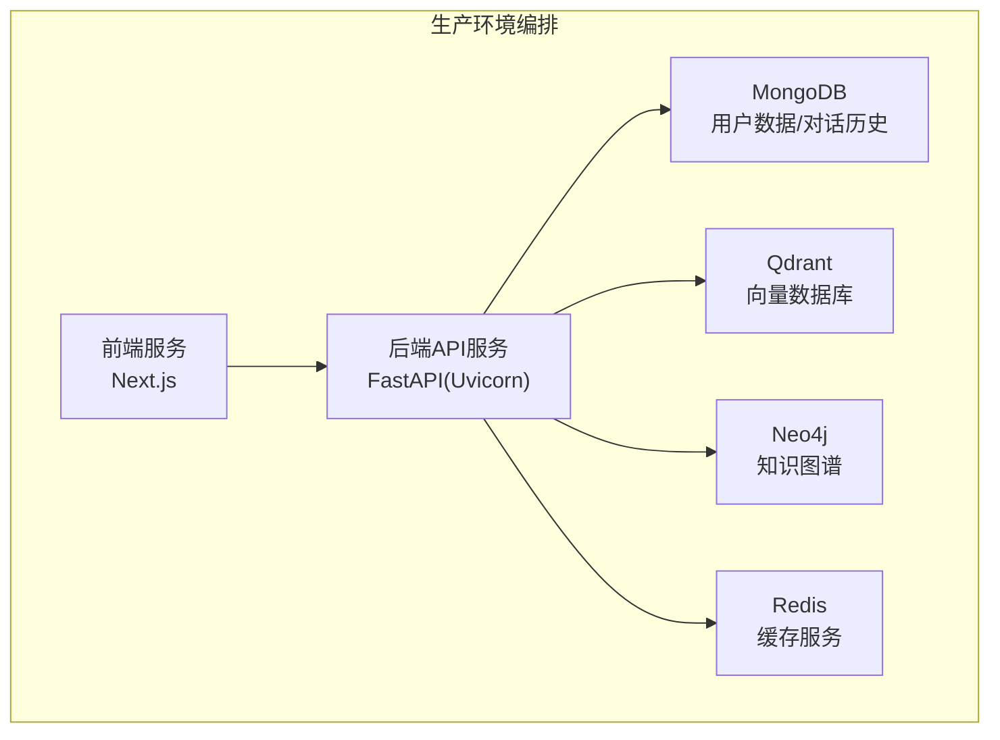

**图表来源**
- [docker-compose.yml:1-76](file://docker-compose.yml#L1-L76)
- [web/next.config.ts:12-34](file://web/next.config.ts#L12-L34)

**章节来源**
- [docker-compose.yml:1-76](file://docker-compose.yml#L1-L76)
- [web/next.config.ts:12-34](file://web/next.config.ts#L12-L34)

## 核心组件

### 后端服务配置

后端服务基于 FastAPI 和 Uvicorn，生产环境配置要点：

- **工作进程数量**: 默认 24 个工作进程，可根据 CPU 核心数调整
- **端口暴露**: 8000 端口
- **健康检查**: 内置健康检查端点
- **日志级别**: 生产环境默认 WARNING 级别

**章节来源**
- [Dockerfile:14-20](file://Dockerfile#L14-L20)
- [main.py:128-157](file://main.py#L128-L157)
- [utils/logger.py:77-81](file://utils/logger.py#L77-L81)

### 前端服务配置

前端服务基于 Next.js，生产环境配置要点：

- **构建模式**: Standalone 输出模式
- **端口**: 3000 端口
- **代理配置**: 通过环境变量 NEXT_PUBLIC_API_URL 配置后端 API 地址
- **大文件上传**: 支持最大 200MB 文件上传

**章节来源**
- [web/Dockerfile:20-38](file://web/Dockerfile#L20-L38)
- [web/next.config.ts:3-10](file://web/next.config.ts#L3-L10)
- [web/next.config.ts:12-34](file://web/next.config.ts#L12-L34)

## 架构概览

生产环境架构采用微服务化部署，包含以下关键组件：

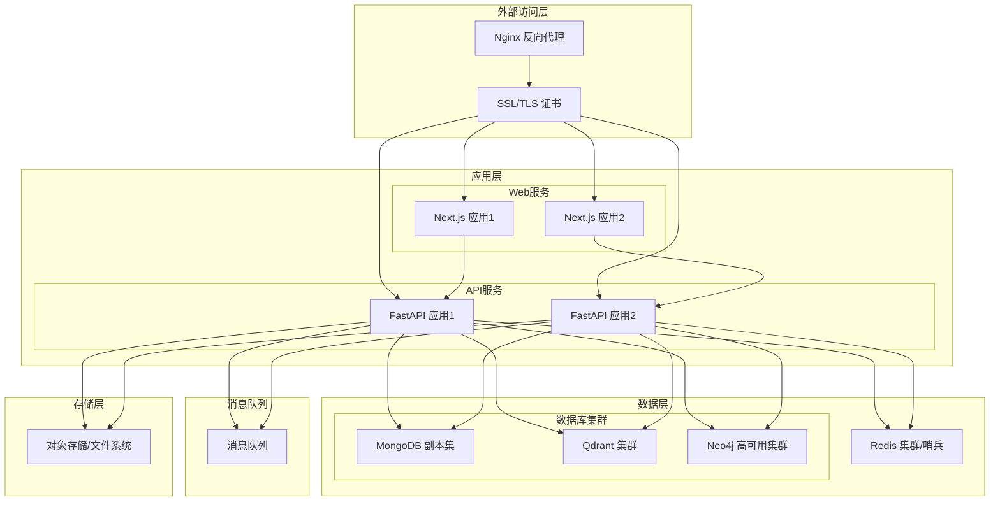

**图表来源**
- [docker-compose.yml:1-76](file://docker-compose.yml#L1-L76)
- [main.py:90-98](file://main.py#L90-L98)

## 详细组件分析

### 数据库生产级配置

#### MongoDB 副本集配置

生产环境建议使用 MongoDB 副本集确保高可用性和数据冗余：

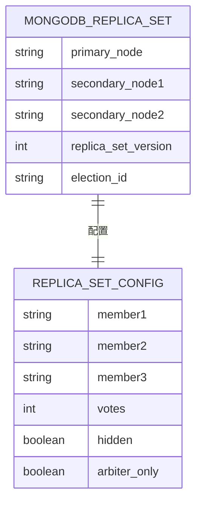

**图表来源**
- [database/mongodb.py:122-136](file://database/mongodb.py#L122-L136)

关键配置参数：
- **连接池配置**: maxPoolSize=100, minPoolSize=10, maxIdleTimeMS=30000
- **超时配置**: serverSelectionTimeoutMS=5000, connectTimeoutMS=10000, socketTimeoutMS=30000
- **认证配置**: 使用独立的认证数据库和专用用户

**章节来源**
- [database/mongodb.py:122-136](file://database/mongodb.py#L122-L136)
- [database/mongodb.py:101-121](file://database/mongodb.py#L101-L121)

#### Qdrant 集群配置

Qdrant 生产环境建议使用集群模式：

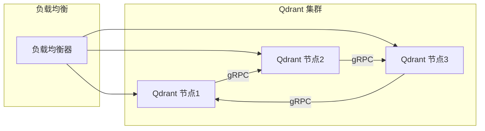

**图表来源**
- [database/qdrant_client.py:66-96](file://database/qdrant_client.py#L66-L96)

关键配置：
- **gRPC 优先**: 使用 gRPC 协议替代 HTTP，提升性能和稳定性
- **连接复用**: 通过 prefer_grpc=True 实现连接复用
- **超时配置**: 默认超时 30 秒，可根据网络环境调整

**章节来源**
- [database/qdrant_client.py:66-96](file://database/qdrant_client.py#L66-L96)
- [database/qdrant_client.py:195-208](file://database/qdrant_client.py#L195-L208)

#### Neo4j 高可用配置

Neo4j 生产环境建议使用高可用集群：

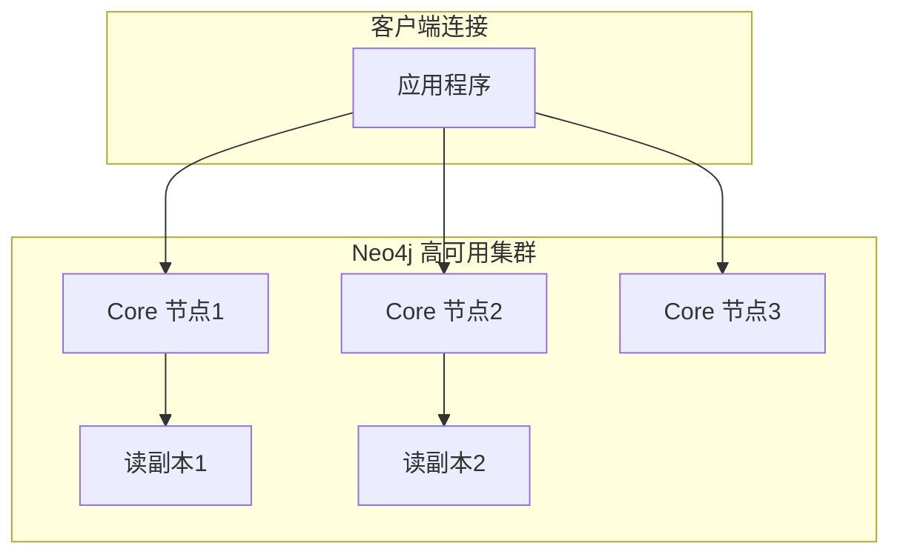

**图表来源**
- [database/neo4j_client.py:16-38](file://database/neo4j_client.py#L16-L38)

**章节来源**
- [database/neo4j_client.py:16-38](file://database/neo4j_client.py#L16-L38)

### Nginx 反向代理配置

生产环境推荐使用 Nginx 作为反向代理和负载均衡器：

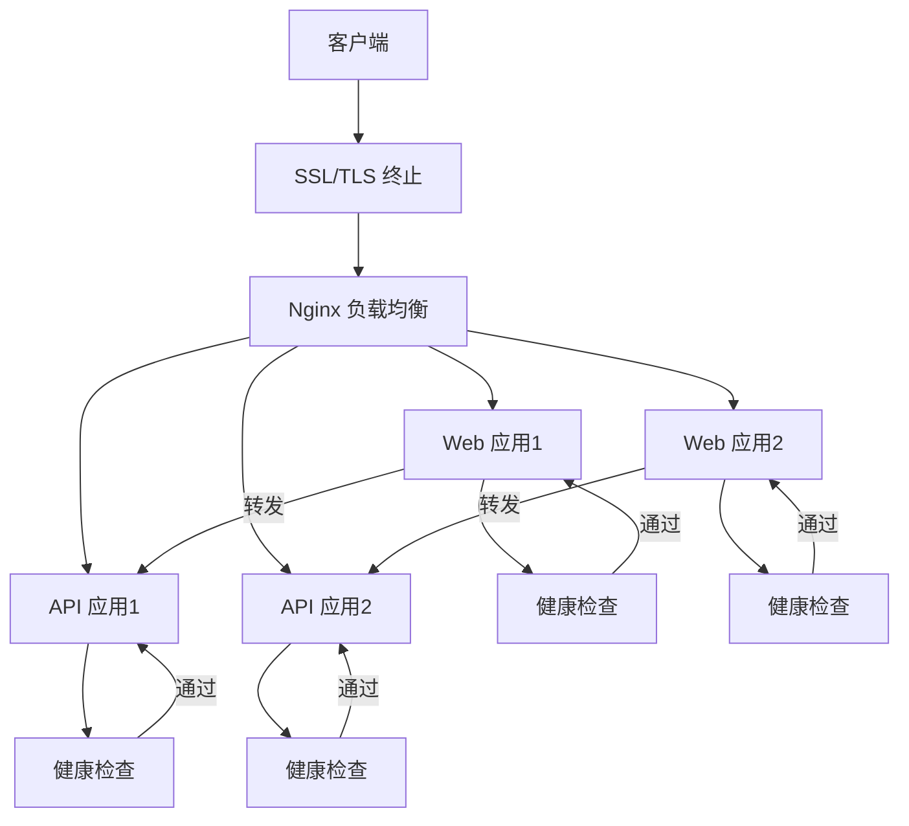

**图表来源**
- [routers/health.py:90-115](file://routers/health.py#L90-L115)

### 环境变量配置

生产环境关键环境变量配置：

| 组件 | 环境变量 | 默认值 | 说明 |
|------|----------|--------|------|
| 应用 | ENVIRONMENT | production | 环境模式 |
| 应用 | UVICORN_PORT | 8000 | 服务端口 |
| 应用 | UVICORN_WORKERS | 24 | 工作进程数 |
| MongoDB | MONGODB_URI | - | 连接字符串 |
| Qdrant | QDRANT_URL | http://localhost:6333 | 服务地址 |
| Neo4j | NEO4J_URI | bolt://localhost:7687 | 连接地址 |
| Redis | REDIS_HOST | localhost | 主机地址 |
| 日志 | LOG_LEVEL | WARNING | 日志级别 |

**章节来源**
- [main.py:20-53](file://main.py#L20-L53)
- [Dockerfile:14-20](file://Dockerfile#L14-L20)
- [database/mongodb.py:101-121](file://database/mongodb.py#L101-L121)
- [database/qdrant_client.py:35-36](file://database/qdrant_client.py#L35-L36)
- [database/neo4j_client.py:11-13](file://database/neo4j_client.py#L11-L13)

### 安全配置

#### 认证与授权

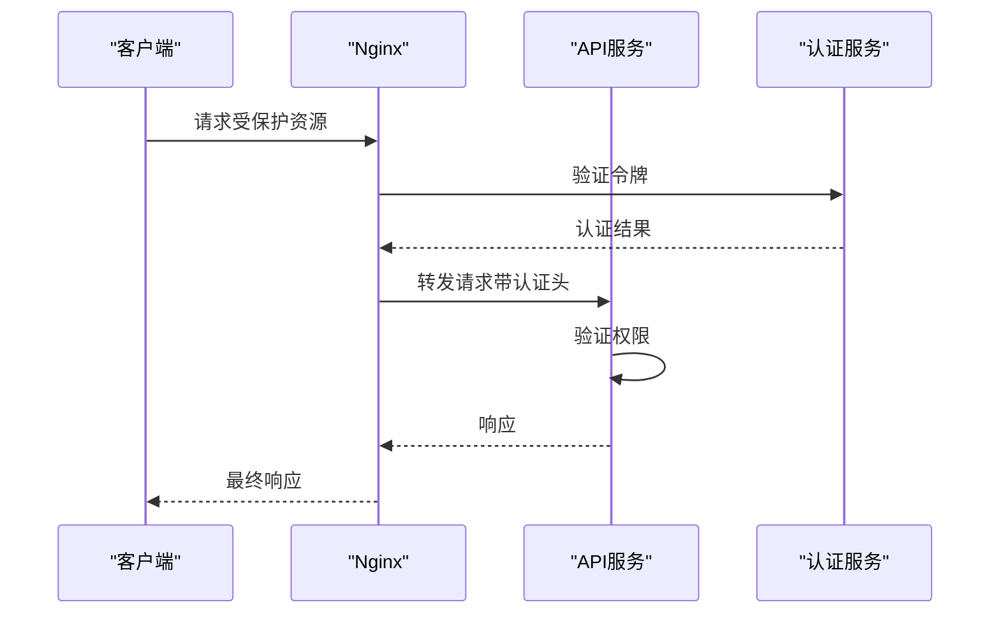

#### 数据传输安全

- **TLS/SSL**: 所有外部通信必须使用 HTTPS
- **API 密钥**: 对外提供的 API 接口使用密钥认证
- **数据库连接**: MongoDB 和 Neo4j 使用 TLS 加密连接

**章节来源**
- [database/mongodb.py:154-184](file://database/mongodb.py#L154-L184)
- [database/neo4j_client.py:26-32](file://database/neo4j_client.py#L26-L32)

### 性能参数调优

#### 连接池配置

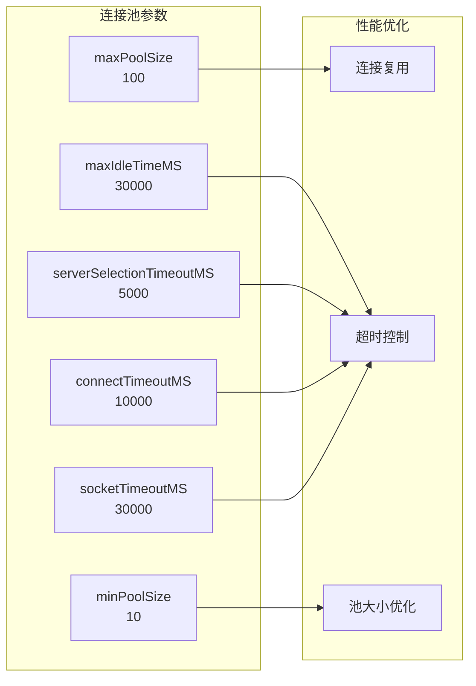

**图表来源**
- [database/mongodb.py:122-136](file://database/mongodb.py#L122-L136)

#### 缓存策略

- **Redis 配置**: 使用 Redis 作为缓存层，支持数据序列化
- **缓存键设计**: 采用命名空间隔离不同业务模块
- **过期策略**: 根据数据访问频率设置合理的过期时间

**章节来源**
- [README.md:149-153](file://README.md#L149-L153)

### Redis 缓存配置

Redis 生产环境配置建议：

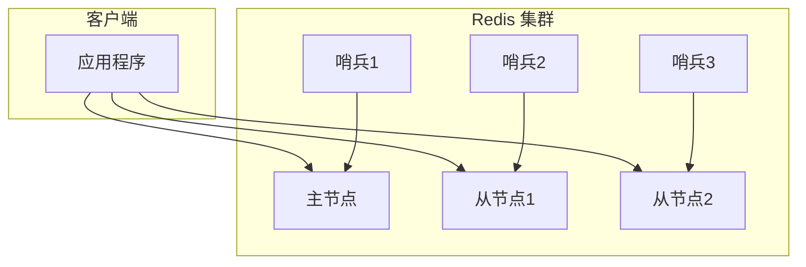

**图表来源**
- [README.md:149-153](file://README.md#L149-L153)

### 消息队列设置

消息队列用于异步处理耗时任务：

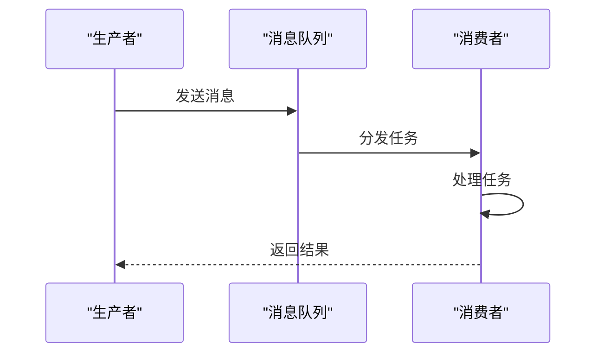

**章节来源**
- [README.md:34-34](file://README.md#L34-L34)

### 文件存储配置

文件存储支持本地文件系统和对象存储：

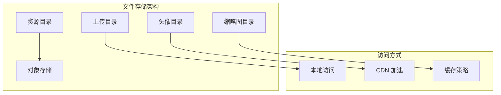

**图表来源**
- [Dockerfile:84-87](file://Dockerfile#L84-L87)

## 依赖关系分析

系统组件间的依赖关系如下：

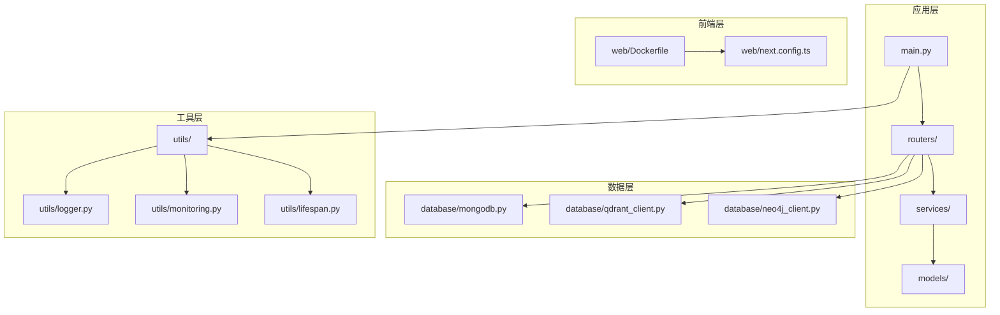

**图表来源**
- [main.py:15-18](file://main.py#L15-L18)
- [routers/health.py:1-12](file://routers/health.py#L1-L12)

**章节来源**
- [main.py:15-18](file://main.py#L15-L18)
- [routers/health.py:1-12](file://routers/health.py#L1-L12)

## 性能考虑

### 监控与指标

系统内置性能监控功能：

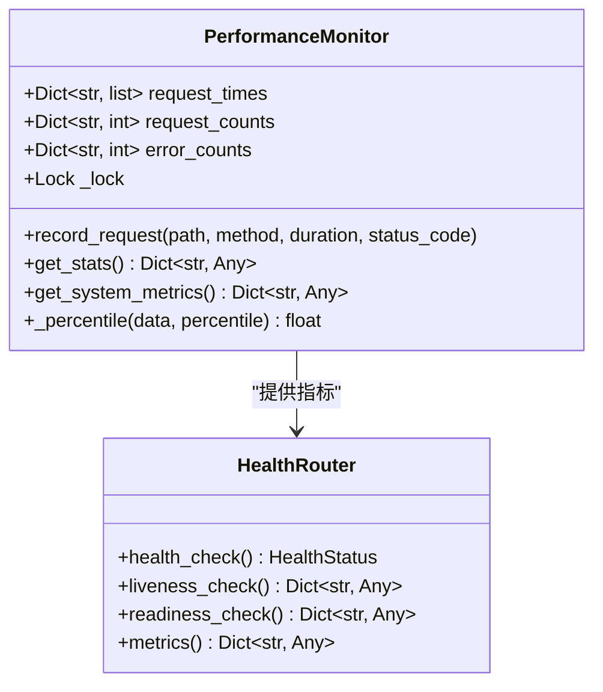

**图表来源**
- [utils/monitoring.py:13-77](file://utils/monitoring.py#L13-L77)
- [routers/health.py:23-87](file://routers/health.py#L23-L87)

### 负载均衡策略

推荐使用以下负载均衡策略：

1. **轮询算法**: 基础的负载均衡方式
2. **最少连接**: 将新请求分配给当前连接数最少的实例
3. **健康检查**: 定期检查后端服务健康状态
4. **会话保持**: 对于需要状态保持的请求使用会话保持

## 故障排除指南

### 常见问题诊断

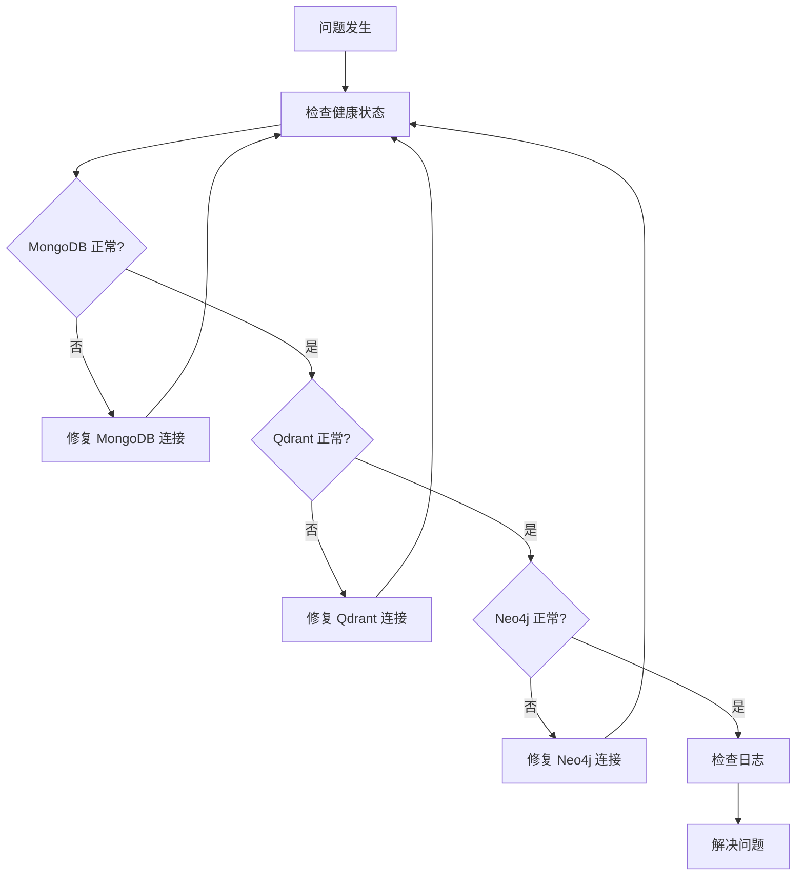

### 性能问题排查

1. **连接池耗尽**: 检查 maxPoolSize 配置和连接泄漏
2. **查询性能慢**: 分析查询计划和索引使用情况
3. **内存使用过高**: 监控内存使用趋势和垃圾回收
4. **CPU 使用率异常**: 检查长时间运行的任务和死循环

**章节来源**
- [routers/health.py:23-87](file://routers/health.py#L23-L87)
- [utils/monitoring.py:118-161](file://utils/monitoring.py#L118-L161)

## 结论

本生产环境配置文档提供了 advanced-rag 系统的完整部署指南。通过采用容器化部署、数据库集群、负载均衡和完善的监控体系，可以确保系统的高可用性、高性能和安全性。建议根据实际业务规模和访问量对配置参数进行进一步优化，并建立完善的运维流程和应急预案。

## 附录

### 系统要求清单

- **硬件要求**:
  - CPU: 至少 8 核心，推荐 16 核心以上
  - 内存: 至少 16GB RAM，推荐 32GB 以上
  - 存储: 至少 1TB SSD，根据数据量扩展
  - 网络: 千兆以太网

- **软件要求**:
  - Docker Engine 20.10+
  - Docker Compose 2.0+
  - Linux 内核 4.14+
  - Python 3.10+

- **网络要求**:
  - 开放端口: 80, 443, 8000, 27017, 6333, 6334, 7474, 7687
  - 防火墙规则: 仅允许必要的端口访问
  - DNS 配置: 正确的域名解析

### 备份策略

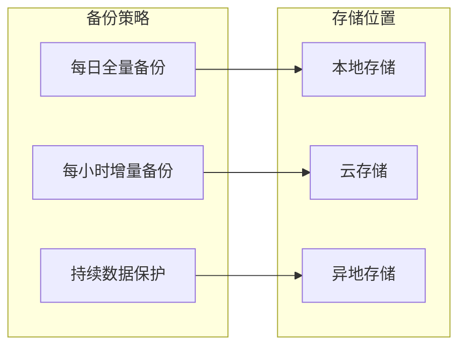

### 监控与告警

- **系统监控**: CPU、内存、磁盘、网络使用率
- **应用监控**: 请求响应时间、错误率、吞吐量
- **数据库监控**: 连接数、查询性能、存储使用
- **告警阈值**: 根据业务 SLA 设定合理的告警阈值