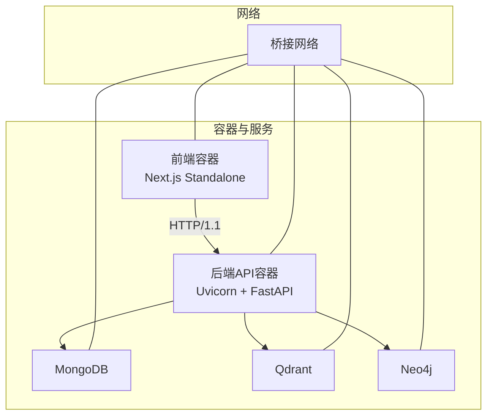
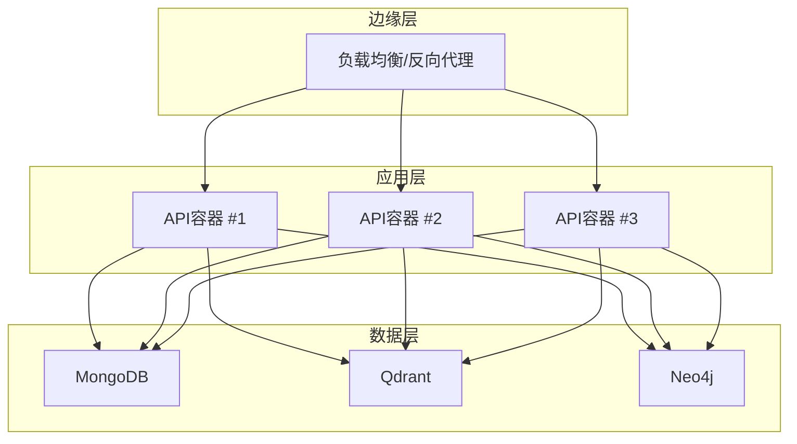
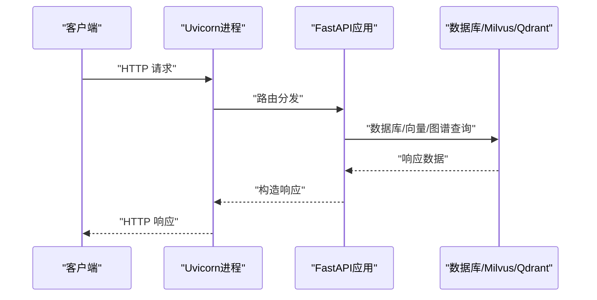
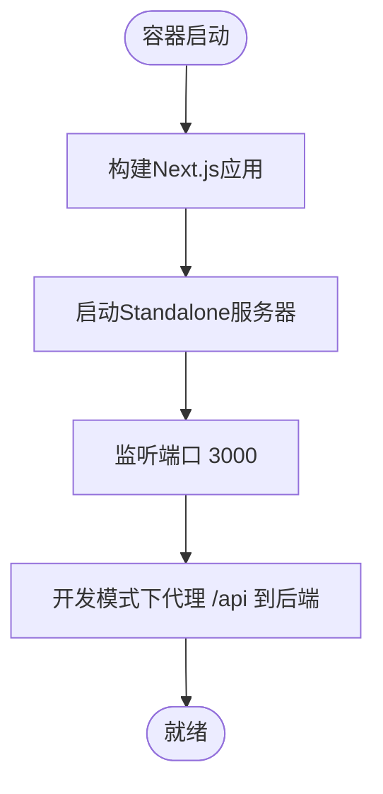
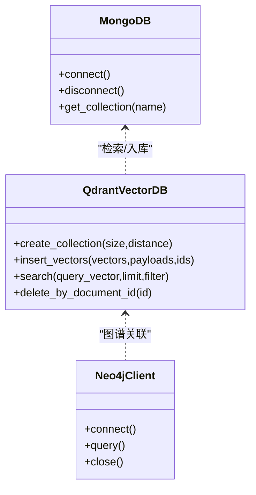
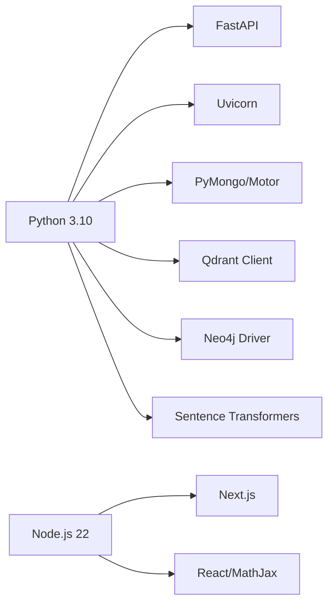

# 系统要求与硬件配置

<cite>
**本文引用的文件**
- [Dockerfile](file://Dockerfile)
- [docker-compose.yml](file://docker-compose.yml)
- [requirements.txt](file://requirements.txt)
- [README.md](file://README.md)
- [main.py](file://main.py)
- [utils/lifespan.py](file://utils/lifespan.py)
- [utils/monitoring.py](file://utils/monitoring.py)
- [web/Dockerfile](file://web/Dockerfile)
- [web/next.config.ts](file://web/next.config.ts)
- [database/mongodb.py](file://database/mongodb.py)
- [database/qdrant_client.py](file://database/qdrant_client.py)
- [download_dependencies.sh](file://download_dependencies.sh)
- [download_dependencies.ps1](file://download_dependencies.ps1)
</cite>

## 目录
1. [简介](#简介)
2. [项目结构](#项目结构)
3. [核心组件](#核心组件)
4. [架构总览](#架构总览)
5. [详细组件分析](#详细组件分析)
6. [依赖关系分析](#依赖关系分析)
7. [性能考量](#性能考量)
8. [故障排查指南](#故障排查指南)
9. [结论](#结论)
10. [附录](#附录)

## 简介
本文件面向生产环境部署与运维团队，提供高级RAG系统的系统要求与硬件配置指南。内容涵盖：
- 生产环境最低与推荐硬件配置（CPU、内存、存储、网络）
- 不同规模部署场景（小型、中型、大型）的资源配置建议
- Docker容器资源限制配置（内存限制、CPU配额、存储卷）
- 操作系统兼容性、依赖库版本要求与网络端口规划
- 性能基准测试指标与容量规划指南

## 项目结构
系统由后端FastAPI服务、前端Next.js应用、以及MongoDB、Qdrant、Neo4j等外部依赖组成。下图展示核心组件与容器化部署关系。

图表来源
- [docker-compose.yml:1-76](file://docker-compose.yml#L1-L76)
- [web/Dockerfile:1-38](file://web/Dockerfile#L1-L38)
- [Dockerfile:1-95](file://Dockerfile#L1-L95)

章节来源
- [docker-compose.yml:1-76](file://docker-compose.yml#L1-L76)
- [web/Dockerfile:1-38](file://web/Dockerfile#L1-L38)
- [Dockerfile:1-95](file://Dockerfile#L1-L95)

## 核心组件
- 后端API容器：基于Python 3.10，使用Uvicorn多worker模式，监听8000端口，支持健康检查。
- 前端容器：基于Node.js 22，Next.js 16，Standalone输出模式，监听3000端口。
- 数据库与向量/图数据库：MongoDB、Qdrant、Neo4j（可选），通过docker-compose统一编排。
- 环境与依赖：requirements.txt声明核心依赖，Dockerfile内置国内镜像源与缓存策略。

章节来源
- [main.py:128-157](file://main.py#L128-L157)
- [Dockerfile:12-21](file://Dockerfile#L12-L21)
- [web/Dockerfile:1-38](file://web/Dockerfile#L1-L38)
- [requirements.txt:1-38](file://requirements.txt#L1-L38)
- [README.md:73-79](file://README.md#L73-L79)

## 架构总览
下图展示生产环境典型拓扑：反向代理（Nginx/Ingress）前置，后端API容器集群，以及独立运行的数据库与向量/图数据库。

图表来源
- [README.md:180-227](file://README.md#L180-L227)
- [docker-compose.yml:1-76](file://docker-compose.yml#L1-L76)

## 详细组件分析

### 后端API容器（Uvicorn + FastAPI）
- 默认端口：8000
- 默认worker数量：24（生产环境）
- keep-alive超时：900秒，支持大文件上传
- 并发连接限制：每worker 2000
- 健康检查：/health（容器内健康探针）

图表来源
- [main.py:148-157](file://main.py#L148-L157)
- [Dockerfile:89-95](file://Dockerfile#L89-L95)

章节来源
- [main.py:128-157](file://main.py#L128-L157)
- [Dockerfile:18-21](file://Dockerfile#L18-L21)
- [Dockerfile:89-95](file://Dockerfile#L89-L95)

### 前端容器（Next.js Standalone）
- 默认端口：3000
- Standalone输出模式，便于容器化部署
- 开发时支持代理到后端API（localhost:8000）

图表来源
- [web/Dockerfile:18-38](file://web/Dockerfile#L18-L38)
- [web/next.config.ts:13-34](file://web/next.config.ts#L13-L34)

章节来源
- [web/Dockerfile:1-38](file://web/Dockerfile#L1-L38)
- [web/next.config.ts:1-47](file://web/next.config.ts#L1-L47)

### 数据库与向量/图数据库
- MongoDB：连接池参数可调（最大连接池、最小连接池、超时等）
- Qdrant：优先使用gRPC（端口6334），避免HTTP/httpx相关问题；支持自动集合重建与重试
- Neo4j：可选，用于知识图谱

图表来源
- [database/mongodb.py:92-199](file://database/mongodb.py#L92-L199)
- [database/qdrant_client.py:18-544](file://database/qdrant_client.py#L18-L544)

章节来源
- [database/mongodb.py:92-199](file://database/mongodb.py#L92-L199)
- [database/qdrant_client.py:18-544](file://database/qdrant_client.py#L18-L544)
- [docker-compose.yml:26-57](file://docker-compose.yml#L26-L57)

### 容器资源限制与存储卷
- 后端API容器
  - CPU配额：建议按worker数量与CPU核心数设定（生产默认24 worker）
  - 内存限制：建议不低于4GB，结合向量化模型与并发连接数评估
  - 存储卷：/app/uploads、/app/conversation_uploads、/app/resources、/app/avatars、/app/thumbnails、/app/logs
- 前端容器
  - CPU与内存限制：建议与后端一致或略低
  - 存储卷：public静态资源随Standalone打包，无需额外挂载
- 数据库容器
  - MongoDB：持久化卷（/data/db、/data/configdb）
  - Qdrant：持久化卷（/qdrant/storage）
  - Neo4j：持久化卷（/data、/logs、/import、/plugins）

章节来源
- [Dockerfile:84-87](file://Dockerfile#L84-L87)
- [docker-compose.yml:58-72](file://docker-compose.yml#L58-L72)

## 依赖关系分析
- Python后端依赖：FastAPI、Uvicorn、MongoDB驱动、Qdrant客户端、Neo4j驱动、向量化与分块库等
- 前端依赖：Next.js、React、数学公式渲染等
- Docker镜像：后端基于python:3.10-slim，前端基于node:22-alpine

图表来源
- [requirements.txt:4-38](file://requirements.txt#L4-L38)
- [web/package.json:12-26](file://web/package.json#L12-L26)
- [Dockerfile:12-12](file://Dockerfile#L12-L12)
- [web/Dockerfile:1-1](file://web/Dockerfile#L1-L1)

章节来源
- [requirements.txt:1-38](file://requirements.txt#L1-L38)
- [web/package.json:1-40](file://web/package.json#L1-L40)
- [Dockerfile:12-12](file://Dockerfile#L12-L12)
- [web/Dockerfile:1-1](file://web/Dockerfile#L1-L1)

## 性能考量
- 并发与吞吐
  - 默认24个Uvicorn worker，每个worker并发连接限制2000
  - keep-alive超时900秒，适合大文件上传与长会话
- 数据库连接池
  - MongoDB连接池参数可调（最大池大小、最小池大小、超时等），建议按峰值并发与数据库规格调整
- 向量检索性能
  - Qdrant优先使用gRPC（端口6334），避免HTTP/httpx相关问题；支持自动集合重建与重试
- 监控与指标
  - 内置系统指标采集（CPU、内存、磁盘）与请求耗时统计（p50/p95/p99）
  - 建议结合外部APM与数据库性能分析工具进行容量规划

章节来源
- [main.py:140-157](file://main.py#L140-L157)
- [database/mongodb.py:122-136](file://database/mongodb.py#L122-L136)
- [database/qdrant_client.py:66-91](file://database/qdrant_client.py#L66-L91)
- [utils/monitoring.py:78-111](file://utils/monitoring.py#L78-L111)

## 故障排查指南
- 健康检查失败
  - 后端：容器健康探针访问/health；确认Uvicorn端口与worker配置
  - 数据库：MongoDB、Qdrant、Neo4j健康检查配置
- 连接问题
  - MongoDB：检查URI/主机端口、认证信息、连接池参数
  - Qdrant：优先使用gRPC（6334），避免HTTP 502；确认集合存在与维度匹配
- 性能瓶颈
  - 查看慢请求日志与系统指标，评估worker数量、内存与数据库连接池
- 依赖缺失
  - 构建前需下载第三方依赖到vendor目录，避免构建时从GitHub拉取

章节来源
- [Dockerfile:91-95](file://Dockerfile#L91-L95)
- [docker-compose.yml:18-24](file://docker-compose.yml#L18-L24)
- [database/mongodb.py:176-184](file://database/mongodb.py#L176-L184)
- [database/qdrant_client.py:124-138](file://database/qdrant_client.py#L124-L138)
- [download_dependencies.sh:1-29](file://download_dependencies.sh#L1-L29)
- [download_dependencies.ps1:1-35](file://download_dependencies.ps1#L1-L35)

## 结论
- 生产环境建议采用多容器编排，后端与前端分离部署，数据库与向量/图数据库独立扩缩容
- 硬件配置应围绕并发连接、数据库连接池与向量检索性能综合评估
- 容器资源限制应结合监控指标与压测结果动态调整
- 建议建立完善的健康检查、日志与告警体系，保障系统稳定性与可维护性

## 附录

### 生产环境硬件配置建议
- 小型部署（10-50用户）
  - CPU：4核（8线程）起步，建议8核
  - 内存：8GB起步，建议16GB
  - 存储：系统盘50GB SSD + 数据库/向量/图库持久化卷按需扩容
  - 网络：千兆以太网，带宽满足并发请求峰值
- 中型部署（50-200用户）
  - CPU：8核（16线程），建议16核
  - 内存：16GB起步，建议32GB
  - 存储：系统盘100GB SSD + 数据库/向量/图库持久化卷按需扩容
  - 网络：千兆以太网，建议万兆上联
- 大型部署（200+用户）
  - CPU：16核（32线程），建议32核以上
  - 内存：32GB起步，建议64GB以上
  - 存储：系统盘200GB SSD + 大容量SSD/NVMe阵列
  - 网络：万兆以太网，建议40G/100G上联

### Docker容器资源限制配置示例
- 后端API容器
  - CPU配额：根据worker数量与CPU核心数设定（如24核宿主机可设为24.0）
  - 内存限制：建议4–8GB（结合模型与并发）
  - 存储卷：挂载/app/uploads、/app/resources、/app/logs等
- 前端容器
  - CPU配额：建议2.0–4.0
  - 内存限制：建议1–2GB
  - 存储卷：无需挂载（Standalone）
- 数据库容器
  - MongoDB：持久化卷映射，内存与CPU按数据库规格分配
  - Qdrant：持久化卷映射，预留足够的磁盘空间
  - Neo4j：持久化卷映射，按图谱规模与查询负载评估

### 操作系统兼容性与依赖版本
- 操作系统
  - Linux（推荐发行版：Ubuntu 20.04+/CentOS 8+/Rocky 8+）
  - Windows（WSL2或Docker Desktop）
  - macOS（Docker Desktop）
- Python与Node.js
  - Python 3.10（Docker镜像python:3.10-slim）
  - Node.js 22（Docker镜像node:22-alpine）
- 关键依赖版本（节选）
  - FastAPI >= 0.104.0
  - Uvicorn[standard] >= 0.24.0
  - PyMongo/Motor >= 4.6.0
  - Qdrant Client >= 1.7.0
  - Neo4j >= 5.15.0
  - Sentence Transformers >= 2.2.0
  - Next.js >= 16.1.1
  - React >= 19.2.1

章节来源
- [README.md:73-79](file://README.md#L73-L79)
- [requirements.txt:4-38](file://requirements.txt#L4-L38)
- [web/package.json:12-26](file://web/package.json#L12-L26)
- [Dockerfile:12-12](file://Dockerfile#L12-L12)
- [web/Dockerfile:1-1](file://web/Dockerfile#L1-L1)

### 网络端口规划
- 后端API容器
  - 8000：HTTP服务端口（容器暴露）
  - 健康检查：/health
- 前端容器
  - 3000：HTTP服务端口（容器暴露）
- 数据库与向量/图数据库
  - MongoDB：27017（容器暴露）
  - Qdrant：6333（REST）、6334（gRPC）
  - Neo4j：7474（HTTP）、7687（Bolt）

章节来源
- [Dockerfile:89-89](file://Dockerfile#L89-L89)
- [web/Dockerfile:35-35](file://web/Dockerfile#L35-L35)
- [docker-compose.yml:7-56](file://docker-compose.yml#L7-L56)

### 性能基准测试指标与容量规划
- 关键指标
  - 平均响应时间（p50/p95/p99）
  - 慢请求占比（>1秒）
  - CPU使用率、内存占用、磁盘IOPS
  - 数据库连接池利用率、Qdrant查询延迟
- 压测建议
  - 以并发用户数逐步提升，观察系统指标与错误率
  - 针对文档上传/解析、RAG检索、深度研究等关键路径进行专项压测
  - 结合容器资源限制与数据库连接池参数进行调优

章节来源
- [utils/monitoring.py:49-68](file://utils/monitoring.py#L49-L68)
- [utils/monitoring.py:78-111](file://utils/monitoring.py#L78-L111)
- [utils/monitoring.py:178-183](file://utils/monitoring.py#L178-L183)