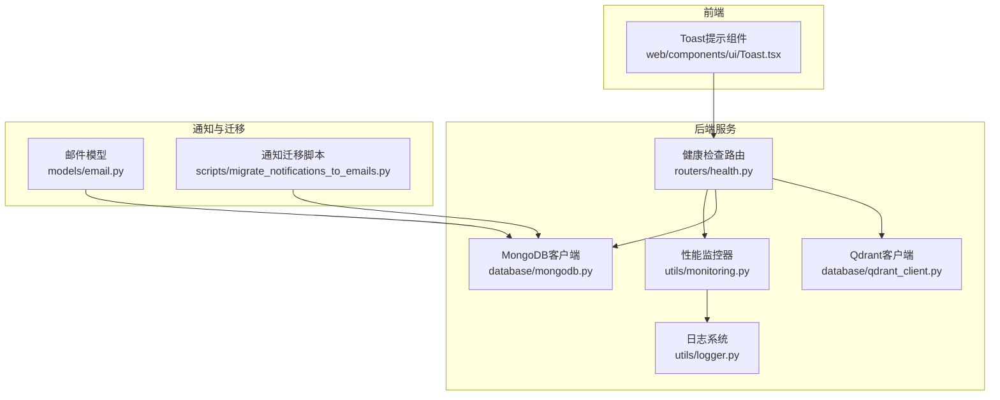
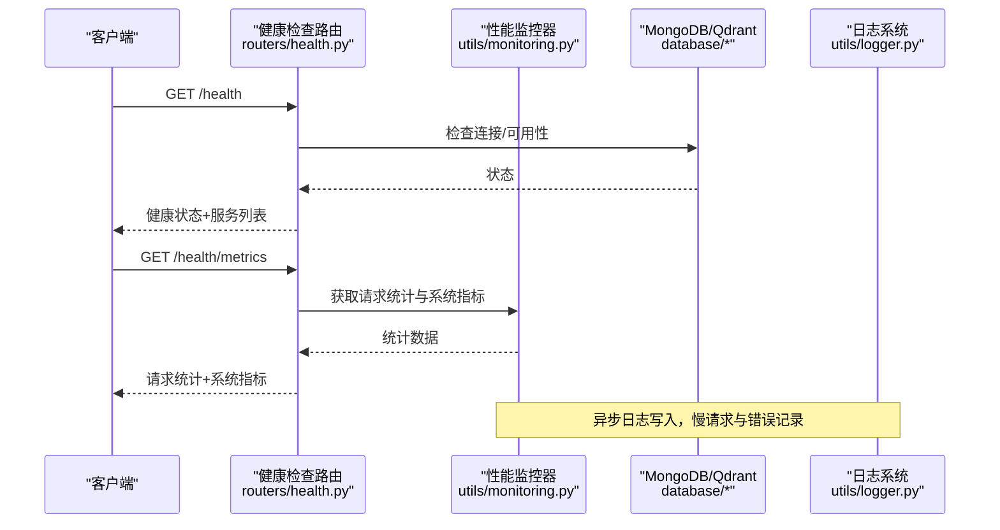
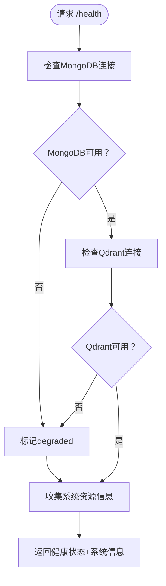
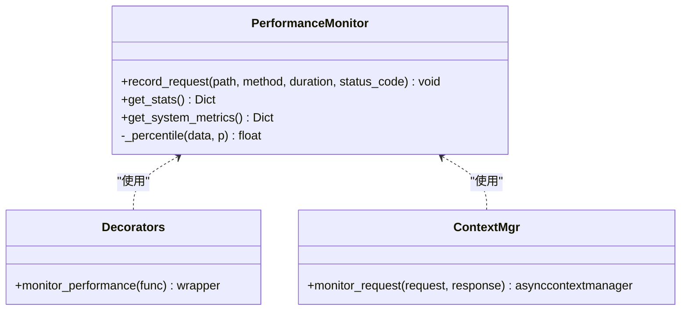
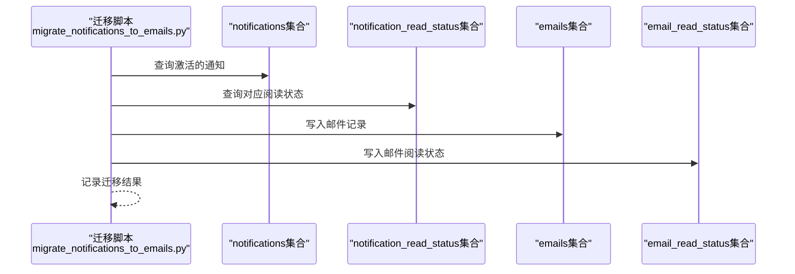
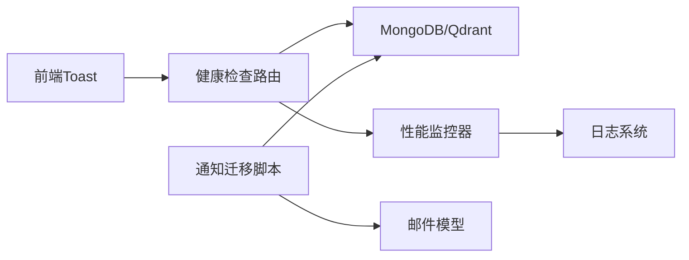

# 告警系统

<cite>
**本文引用的文件**
- [routers/health.py](file://routers/health.py)
- [utils/monitoring.py](file://utils/monitoring.py)
- [utils/logger.py](file://utils/logger.py)
- [database/mongodb.py](file://database/mongodb.py)
- [database/qdrant_client.py](file://database/qdrant_client.py)
- [models/email.py](file://models/email.py)
- [scripts/migrate_notifications_to_emails.py](file://scripts/migrate_notifications_to_emails.py)
- [web/components/ui/Toast.tsx](file://web/components/ui/Toast.tsx)
</cite>

## 目录
1. [简介](#简介)
2. [项目结构](#项目结构)
3. [核心组件](#核心组件)
4. [架构总览](#架构总览)
5. [详细组件分析](#详细组件分析)
6. [依赖关系分析](#依赖关系分析)
7. [性能考量](#性能考量)
8. [故障排查指南](#故障排查指南)
9. [结论](#结论)
10. [附录](#附录)

## 简介
本文件面向“告警系统”的设计与实现，结合代码库中的健康检查、性能监控、日志与通知迁移脚本等能力，给出一套可落地的告警规则设计、阈值与触发机制、分类与优先级管理、通知渠道配置、去重与抑制、升级策略、仪表板与历史管理以及分析报告的完整方案。文档同时提供可视化图示与实操指引，帮助开发者与运维人员快速理解与部署。

## 项目结构
围绕告警系统的关键代码分布在以下模块：
- 健康检查与指标暴露：routers/health.py
- 性能监控与系统指标采集：utils/monitoring.py
- 日志与异步写入：utils/logger.py
- 数据存储与连接：database/mongodb.py、database/qdrant_client.py
- 邮件模型与通知迁移：models/email.py、scripts/migrate_notifications_to_emails.py
- 前端提示组件：web/components/ui/Toast.tsx

图表来源
- [routers/health.py:1-135](file://routers/health.py#L1-L135)
- [utils/monitoring.py:1-185](file://utils/monitoring.py#L1-L185)
- [utils/logger.py:1-88](file://utils/logger.py#L1-L88)
- [database/mongodb.py:1-800](file://database/mongodb.py#L1-L800)
- [database/qdrant_client.py:1-544](file://database/qdrant_client.py#L1-L544)
- [models/email.py:1-104](file://models/email.py#L1-L104)
- [scripts/migrate_notifications_to_emails.py:1-169](file://scripts/migrate_notifications_to_emails.py#L1-L169)
- [web/components/ui/Toast.tsx:1-66](file://web/components/ui/Toast.tsx#L1-L66)

章节来源
- [routers/health.py:1-135](file://routers/health.py#L1-L135)
- [utils/monitoring.py:1-185](file://utils/monitoring.py#L1-L185)
- [utils/logger.py:1-88](file://utils/logger.py#L1-L88)
- [database/mongodb.py:1-800](file://database/mongodb.py#L1-L800)
- [database/qdrant_client.py:1-544](file://database/qdrant_client.py#L1-L544)
- [models/email.py:1-104](file://models/email.py#L1-L104)
- [scripts/migrate_notifications_to_emails.py:1-169](file://scripts/migrate_notifications_to_emails.py#L1-L169)
- [web/components/ui/Toast.tsx:1-66](file://web/components/ui/Toast.tsx#L1-L66)

## 核心组件
- 健康检查与指标端点：提供服务可用性、版本、依赖连接状态与系统资源信息，并暴露性能指标端点。
- 性能监控器：记录请求耗时、错误计数、系统CPU/内存/磁盘指标，支持百分位统计。
- 日志系统：异步文件写入，支持生产环境级别过滤与队列监听。
- 数据存储：MongoDB连接池与Qdrant健康检查与重试机制。
- 邮件模型与迁移：定义邮件优先级与批量发送模型，提供通知到邮件的迁移脚本。
- 前端提示：Toast组件用于前端告警提示展示。

章节来源
- [routers/health.py:23-134](file://routers/health.py#L23-L134)
- [utils/monitoring.py:13-185](file://utils/monitoring.py#L13-L185)
- [utils/logger.py:15-88](file://utils/logger.py#L15-L88)
- [database/mongodb.py:92-199](file://database/mongodb.py#L92-L199)
- [database/qdrant_client.py:18-139](file://database/qdrant_client.py#L18-L139)
- [models/email.py:15-104](file://models/email.py#L15-L104)
- [scripts/migrate_notifications_to_emails.py:17-169](file://scripts/migrate_notifications_to_emails.py#L17-L169)
- [web/components/ui/Toast.tsx:15-66](file://web/components/ui/Toast.tsx#L15-L66)

## 架构总览
告警系统由“数据采集—规则判定—通知分发—存储与展示”四层构成：
- 数据采集：健康检查端点、性能监控器、系统指标采集。
- 规则判定：阈值与触发条件（见“详细组件分析”）。
- 通知分发：邮件、短信、Slack等（见“通知渠道配置”）。
- 存储与展示：MongoDB存储、前端仪表板与历史记录。

图表来源
- [routers/health.py:23-134](file://routers/health.py#L23-L134)
- [utils/monitoring.py:49-111](file://utils/monitoring.py#L49-L111)
- [utils/logger.py:15-88](file://utils/logger.py#L15-L88)
- [database/mongodb.py:92-199](file://database/mongodb.py#L92-L199)
- [database/qdrant_client.py:124-139](file://database/qdrant_client.py#L124-L139)

## 详细组件分析

### 健康检查与指标端点
- /health：聚合服务健康状态（MongoDB、Qdrant），返回整体状态与各服务连接状态。
- /health/liveness：Kubernetes存活探针，简单返回存活状态。
- /health/readiness：Kubernetes就绪探针，关键服务就绪检查。
- /health/metrics：返回请求统计与系统指标，供告警规则使用。

图表来源
- [routers/health.py:23-87](file://routers/health.py#L23-L87)

章节来源
- [routers/health.py:23-134](file://routers/health.py#L23-L134)

### 性能监控器
- 记录每个路径/方法的请求耗时、错误计数，维护最近1000次请求时间，支持p50/p95/p99统计。
- 获取系统指标：CPU、内存、磁盘、进程占用。
- 提供装饰器与上下文管理器，自动记录慢请求与错误。

图表来源
- [utils/monitoring.py:13-185](file://utils/monitoring.py#L13-L185)

章节来源
- [utils/monitoring.py:13-185](file://utils/monitoring.py#L13-L185)

### 日志系统
- 异步文件处理器，使用队列避免阻塞主线程。
- 生产环境可降低日志级别，减少IO压力。
- 第三方库日志级别过滤，避免噪声。

章节来源
- [utils/logger.py:15-88](file://utils/logger.py#L15-L88)

### 数据存储与连接
- MongoDB：连接池参数可调，支持延迟连接与ping校验。
- Qdrant：gRPC优先，自动重试与维度不匹配处理，健康检查。

章节来源
- [database/mongodb.py:92-199](file://database/mongodb.py#L92-L199)
- [database/qdrant_client.py:18-139](file://database/qdrant_client.py#L18-L139)

### 邮件模型与通知迁移
- 邮件模型定义优先级（low/normal/high/urgent）与批量发送场景。
- 迁移脚本将通知数据迁移到邮件集合，并保留阅读状态。

图表来源
- [scripts/migrate_notifications_to_emails.py:17-169](file://scripts/migrate_notifications_to_emails.py#L17-L169)
- [models/email.py:15-104](file://models/email.py#L15-L104)

章节来源
- [models/email.py:15-104](file://models/email.py#L15-L104)
- [scripts/migrate_notifications_to_emails.py:17-169](file://scripts/migrate_notifications_to_emails.py#L17-L169)

### 前端提示组件
- Toast组件用于前端展示系统提示与告警消息，支持类型与定时关闭。

章节来源
- [web/components/ui/Toast.tsx:15-66](file://web/components/ui/Toast.tsx#L15-L66)

## 依赖关系分析
- 健康检查路由依赖数据库客户端与性能监控器。
- 性能监控器依赖psutil与日志系统。
- 通知迁移脚本依赖MongoDB客户端与邮件模型。
- 前端Toast组件与后端健康检查端点解耦，通过HTTP接口交互。

图表来源
- [routers/health.py:1-135](file://routers/health.py#L1-L135)
- [utils/monitoring.py:1-185](file://utils/monitoring.py#L1-L185)
- [utils/logger.py:1-88](file://utils/logger.py#L1-L88)
- [database/mongodb.py:1-800](file://database/mongodb.py#L1-L800)
- [database/qdrant_client.py:1-544](file://database/qdrant_client.py#L1-L544)
- [models/email.py:1-104](file://models/email.py#L1-L104)
- [scripts/migrate_notifications_to_emails.py:1-169](file://scripts/migrate_notifications_to_emails.py#L1-L169)
- [web/components/ui/Toast.tsx:1-66](file://web/components/ui/Toast.tsx#L1-L66)

## 性能考量
- 连接池与超时：MongoDB连接池参数可调，避免高并发下的连接瓶颈；Qdrant优先gRPC，提升吞吐与稳定性。
- 慢请求检测：性能监控器对超过阈值的请求进行告警记录，便于定位性能热点。
- 日志异步化：异步日志写入降低I/O对业务的影响，生产环境可降低日志级别。

章节来源
- [database/mongodb.py:122-151](file://database/mongodb.py#L122-L151)
- [database/qdrant_client.py:66-96](file://database/qdrant_client.py#L66-L96)
- [utils/monitoring.py:178-184](file://utils/monitoring.py#L178-L184)
- [utils/logger.py:77-82](file://utils/logger.py#L77-L82)

## 故障排查指南
- 健康检查失败
  - 检查MongoDB连接字符串与认证信息，确认连接池参数合理。
  - 检查Qdrant服务可达性与gRPC端口配置。
- 指标端点异常
  - 查看性能监控器的系统指标采集是否报错，确认psutil可用。
- 日志异常
  - 检查异步日志队列是否积压，调整队列大小或日志级别。
- 通知迁移失败
  - 检查通知集合与阅读状态集合是否存在，确认迁移脚本的MongoDB连接与权限。

章节来源
- [routers/health.py:32-87](file://routers/health.py#L32-L87)
- [utils/monitoring.py:78-111](file://utils/monitoring.py#L78-L111)
- [utils/logger.py:56-82](file://utils/logger.py#L56-L82)
- [scripts/migrate_notifications_to_emails.py:22-169](file://scripts/migrate_notifications_to_emails.py#L22-L169)

## 结论
本告警系统以健康检查与性能监控为核心，结合日志与通知迁移能力，形成“可观测—可告警—可通知”的闭环。通过明确的阈值与触发机制、分类与优先级管理、去重与抑制、升级策略以及仪表板与历史管理，可有效支撑生产环境的稳定性保障与快速响应。

## 附录

### 告警规则设计与配置
- 阈值设置
  - 服务可用性：/health端点返回状态为degraded或unhealthy即触发。
  - 请求时延：p95/p99超过阈值（如1.0s/2.0s）触发。
  - 错误率：错误计数占比超过阈值（如>5%）触发。
  - 资源使用：CPU/Memory/Disk使用率超过阈值（如>80%）触发。
- 告警条件
  - 单次检测失败或持续一段时间内多次失败。
  - 资源使用率持续上升或突发峰值。
- 触发机制
  - 周期性轮询/健康检查端点。
  - 慢请求与错误事件实时记录并触发。

章节来源
- [routers/health.py:23-134](file://routers/health.py#L23-L134)
- [utils/monitoring.py:22-68](file://utils/monitoring.py#L22-L68)

### 分类与优先级管理
- 分类
  - 性能告警：请求时延、错误率、吞吐下降。
  - 错误告警：服务不可用、依赖异常、内部错误。
  - 资源告警：CPU/内存/磁盘/网络使用率过高。
- 优先级
  - 低/普通/高/紧急，结合业务影响面与SLA设定。

章节来源
- [models/email.py:24](file://models/email.py#L24)

### 通知渠道配置
- 邮件：使用邮件模型定义优先级与批量发送，迁移脚本可将通知转为邮件。
- 短信：可扩展短信网关，结合优先级与抑制策略。
- Slack：可扩展Webhook或官方SDK，按通道与优先级推送。

章节来源
- [models/email.py:15-104](file://models/email.py#L15-L104)
- [scripts/migrate_notifications_to_emails.py:74-93](file://scripts/migrate_notifications_to_emails.py#L74-L93)

### 去重、抑制与升级策略
- 去重
  - 基于告警键（服务名+指标+条件）去重，同一周期内仅一次。
- 抑制
  - 重大故障（如服务不可用）抑制细粒度子告警。
- 升级
  - 未确认/未恢复的告警在固定间隔重复提醒，直至解决。

章节来源
- [utils/monitoring.py:178-184](file://utils/monitoring.py#L178-L184)

### 仪表板配置、历史管理与分析报告
- 仪表板
  - 暴露/health/metrics端点，前端可拉取请求统计与系统指标，构建仪表板。
- 历史管理
  - 健康检查与性能指标可持久化至MongoDB，支持查询与归档。
- 分析报告
  - 基于p50/p95/p99与错误率趋势生成日报/周报，辅助容量规划与性能优化。

章节来源
- [routers/health.py:117-134](file://routers/health.py#L117-L134)
- [utils/monitoring.py:49-68](file://utils/monitoring.py#L49-L68)