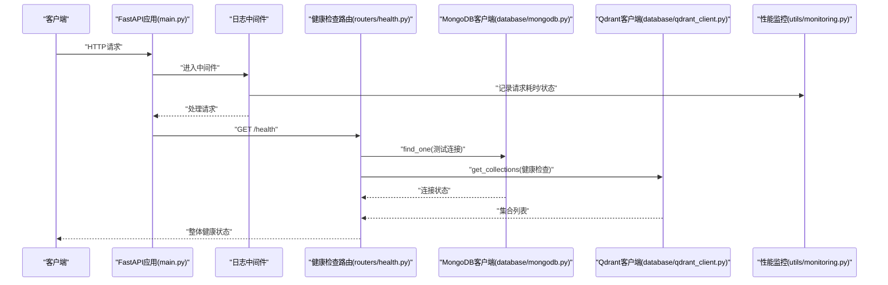
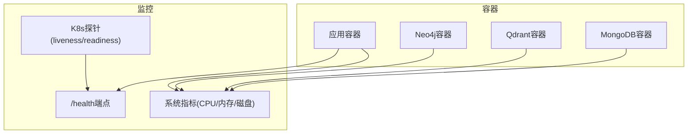
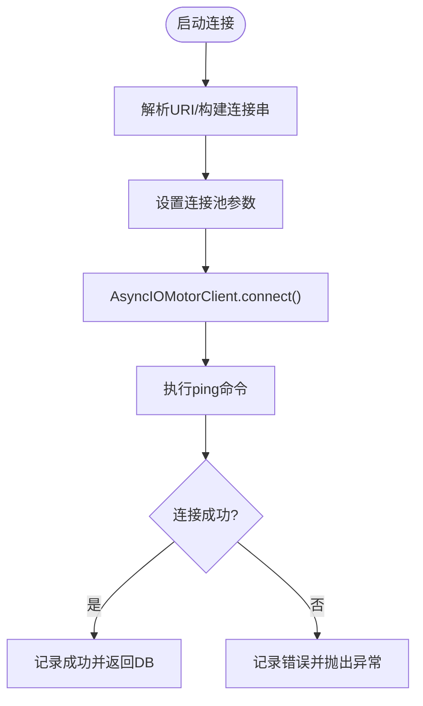
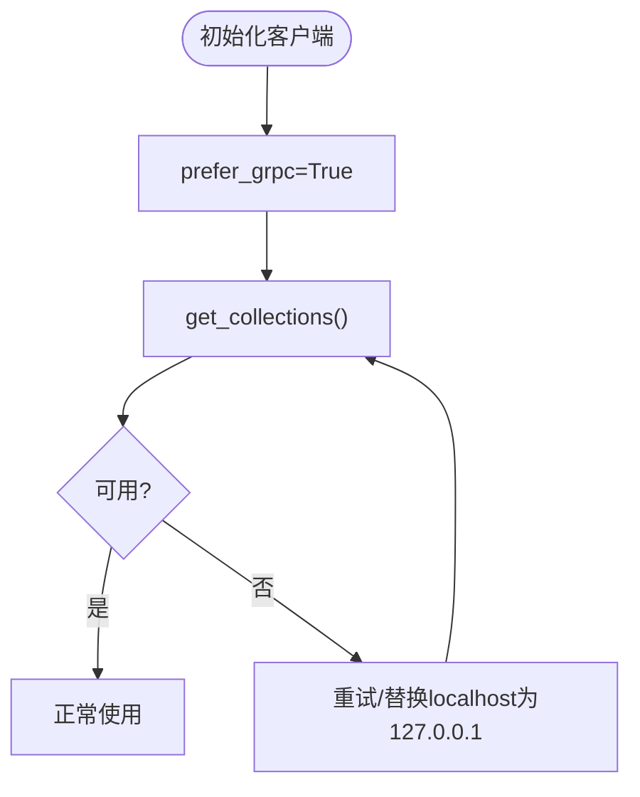
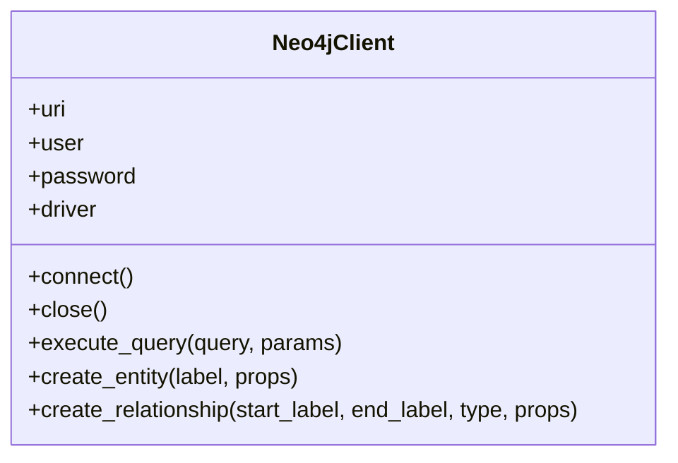
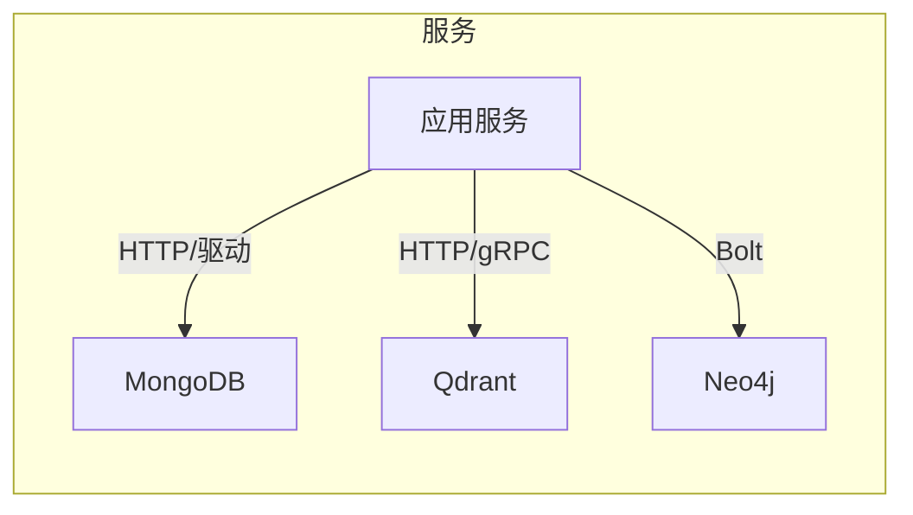
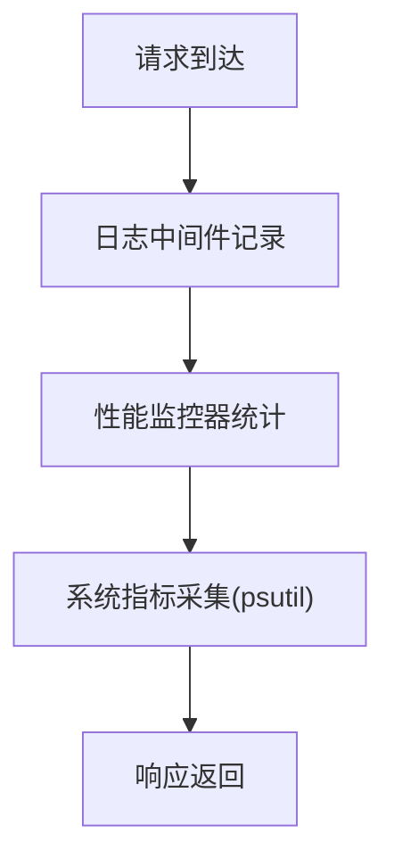
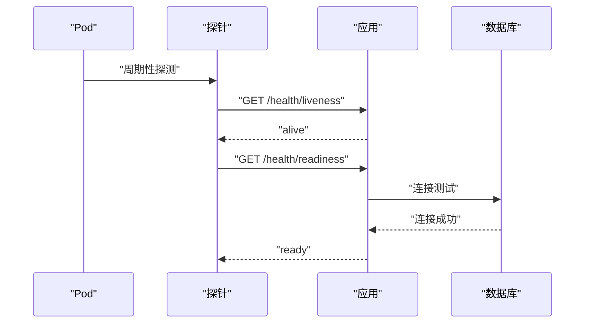
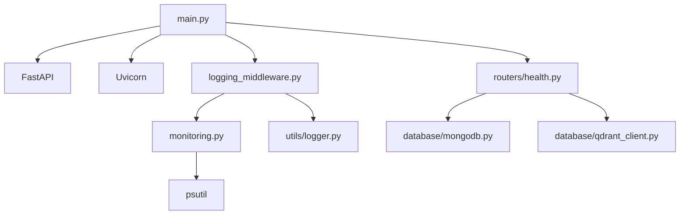

# 基础设施监控

<cite>
**本文引用的文件**
- [docker-compose.yml](file://docker-compose.yml)
- [Dockerfile](file://Dockerfile)
- [main.py](file://main.py)
- [utils/monitoring.py](file://utils/monitoring.py)
- [utils/logger.py](file://utils/logger.py)
- [utils/lifespan.py](file://utils/lifespan.py)
- [middleware/logging_middleware.py](file://middleware/logging_middleware.py)
- [routers/health.py](file://routers/health.py)
- [database/mongodb.py](file://database/mongodb.py)
- [database/qdrant_client.py](file://database/qdrant_client.py)
- [database/neo4j_client.py](file://database/neo4j_client.py)
- [requirements.txt](file://requirements.txt)
- [README.md](file://README.md)
</cite>

## 目录
1. [简介](#简介)
2. [项目结构](#项目结构)
3. [核心组件](#核心组件)
4. [架构总览](#架构总览)
5. [详细组件分析](#详细组件分析)
6. [依赖关系分析](#依赖关系分析)
7. [性能考量](#性能考量)
8. [故障排查指南](#故障排查指南)
9. [结论](#结论)
10. [附录](#附录)

## 简介
本文件面向基础设施监控，围绕容器化环境与微服务架构，系统梳理以下监控主题：
- 容器化环境监控：Docker容器指标、网络与存储监控要点
- 数据库监控策略：MongoDB、Qdrant、Neo4j的健康与性能指标
- 微服务架构：服务发现与依赖关系监控思路
- 资源使用监控：CPU、内存、网络带宽、磁盘I/O
- 编排平台集成与自动化运维：Kubernetes探针与健康检查

该文档基于仓库中的实际实现进行分析，并提供可视化图表与落地建议。

## 项目结构
后端采用FastAPI应用，数据库由MongoDB、Qdrant与Neo4j组成，容器编排通过Docker Compose实现。核心监控能力集中在健康检查端点、性能监控器与日志中间件中。

```mermaid
graph TB
subgraph "容器编排"
DC["docker-compose.yml"]
IMG["Dockerfile"]
end
subgraph "应用层"
APP["main.py"]
LIFE["utils/lifespan.py"]
LOGMW["middleware/logging_middleware.py"]
HEALTH["routers/health.py"]
end
subgraph "监控工具"
MON["utils/monitoring.py"]
LOG["utils/logger.py"]
end
subgraph "数据库"
MONGO["database/mongodb.py"]
QDRANT["database/qdrant_client.py"]
NEO4J["database/neo4j_client.py"]
end
DC --> IMG
DC --> APP
APP --> LOGMW
APP --> HEALTH
APP --> LIFE
LOGMW --> MON
HEALTH --> MON
HEALTH --> MONGO
HEALTH --> QDRANT
MONGO --> |连接| MONGO
QDRANT --> |连接| QDRANT
NEO4J --> |连接| NEO4J
```

**图表来源**
- [docker-compose.yml:1-76](file://docker-compose.yml#L1-L76)
- [Dockerfile:1-95](file://Dockerfile#L1-L95)
- [main.py:1-157](file://main.py#L1-L157)
- [utils/monitoring.py:1-185](file://utils/monitoring.py#L1-L185)
- [utils/logger.py:1-88](file://utils/logger.py#L1-L88)
- [utils/lifespan.py:1-88](file://utils/lifespan.py#L1-L88)
- [middleware/logging_middleware.py:1-52](file://middleware/logging_middleware.py#L1-L52)
- [routers/health.py:1-135](file://routers/health.py#L1-L135)
- [database/mongodb.py:1-1290](file://database/mongodb.py#L1-L1290)
- [database/qdrant_client.py:1-544](file://database/qdrant_client.py#L1-L544)
- [database/neo4j_client.py:1-104](file://database/neo4j_client.py#L1-L104)

**章节来源**
- [docker-compose.yml:1-76](file://docker-compose.yml#L1-L76)
- [Dockerfile:1-95](file://Dockerfile#L1-L95)
- [main.py:1-157](file://main.py#L1-L157)
- [README.md:1-200](file://README.md#L1-L200)

## 核心组件
- 健康检查端点：统一聚合MongoDB、Qdrant与系统资源状态
- 性能监控器：记录请求耗时、错误率与系统资源使用
- 日志中间件：统一记录请求与慢请求，辅助定位性能瓶颈
- 应用生命周期：启动时连接数据库并做初始化，关闭时释放连接
- 数据库客户端：封装连接、健康检查与重试策略

**章节来源**
- [routers/health.py:23-87](file://routers/health.py#L23-L87)
- [utils/monitoring.py:13-185](file://utils/monitoring.py#L13-L185)
- [middleware/logging_middleware.py:8-52](file://middleware/logging_middleware.py#L8-L52)
- [utils/lifespan.py:26-88](file://utils/lifespan.py#L26-L88)
- [database/mongodb.py:92-199](file://database/mongodb.py#L92-L199)
- [database/qdrant_client.py:18-139](file://database/qdrant_client.py#L18-L139)
- [database/neo4j_client.py:6-39](file://database/neo4j_client.py#L6-L39)

## 架构总览
下图展示容器化环境与监控的关键交互：容器编排负责数据库与应用服务的生命周期；应用通过健康检查端点暴露服务状态；性能监控器与日志中间件协同收集指标与日志。

**图表来源**
- [main.py:55-98](file://main.py#L55-L98)
- [middleware/logging_middleware.py:8-52](file://middleware/logging_middleware.py#L8-L52)
- [routers/health.py:23-87](file://routers/health.py#L23-L87)
- [database/mongodb.py:92-199](file://database/mongodb.py#L92-L199)
- [database/qdrant_client.py:124-139](file://database/qdrant_client.py#L124-L139)
- [utils/monitoring.py:22-48](file://utils/monitoring.py#L22-L48)

## 详细组件分析

### 容器化环境监控
- Docker Compose服务定义了MongoDB、Qdrant、Neo4j的端口映射、卷挂载与网络隔离，便于独立监控各容器资源使用与健康状态
- 应用容器通过健康检查端点暴露存活与就绪状态，适配Kubernetes探针
- Dockerfile中定义了健康检查指令，结合应用端的健康检查端点形成双重保障

**图表来源**
- [docker-compose.yml:3-56](file://docker-compose.yml#L3-L56)
- [Dockerfile:91-92](file://Dockerfile#L91-L92)
- [routers/health.py:90-114](file://routers/health.py#L90-L114)

**章节来源**
- [docker-compose.yml:1-76](file://docker-compose.yml#L1-L76)
- [Dockerfile:91-92](file://Dockerfile#L91-L92)
- [routers/health.py:90-114](file://routers/health.py#L90-L114)

### 数据库监控策略

#### MongoDB
- 连接池参数可调：最大连接池、最小连接池、空闲超时、服务器选择与Socket超时等，提升高并发稳定性
- 启动时通过ping命令验证连接可用性
- 健康检查通过读取集合进行连通性验证

**图表来源**
- [database/mongodb.py:99-184](file://database/mongodb.py#L99-L184)

**章节来源**
- [database/mongodb.py:92-199](file://database/mongodb.py#L92-L199)
- [routers/health.py:32-47](file://routers/health.py#L32-L47)

#### Qdrant
- 优先使用gRPC连接，避免HTTP/httpx相关问题，提升性能与稳定性
- 健康检查通过获取集合列表判断服务可用性
- 插入操作具备重试与维度自动重建能力，增强鲁棒性

**图表来源**
- [database/qdrant_client.py:66-123](file://database/qdrant_client.py#L66-L123)

**章节来源**
- [database/qdrant_client.py:18-139](file://database/qdrant_client.py#L18-L139)
- [routers/health.py:49-65](file://routers/health.py#L49-L65)

#### Neo4j
- 支持容器内URI自动替换，兼容Docker环境
- 连接验证通过driver.verify_connectivity
- 提供Cypher查询执行与实体/关系创建示例

**图表来源**
- [database/neo4j_client.py:6-103](file://database/neo4j_client.py#L6-L103)

**章节来源**
- [database/neo4j_client.py:6-39](file://database/neo4j_client.py#L6-L39)

### 微服务架构下的服务发现与依赖关系监控
- 服务发现：通过容器网络与端口映射实现服务间通信；应用侧通过环境变量配置各依赖服务地址
- 依赖关系：健康检查端点聚合MongoDB、Qdrant状态，形成依赖链路视图
- 探针集成：Kubernetes存活/就绪探针对接应用健康端点，实现编排平台集成

**图表来源**
- [README.md:28-44](file://README.md#L28-L44)
- [routers/health.py:23-87](file://routers/health.py#L23-L87)
- [database/mongodb.py:92-199](file://database/mongodb.py#L92-L199)
- [database/qdrant_client.py:18-139](file://database/qdrant_client.py#L18-L139)
- [database/neo4j_client.py:6-39](file://database/neo4j_client.py#L6-L39)

**章节来源**
- [README.md:28-44](file://README.md#L28-L44)
- [routers/health.py:23-87](file://routers/health.py#L23-L87)

### 资源使用情况监控
- CPU/内存/磁盘：健康检查端点采集系统资源使用率与可用内存
- 进程指标：性能监控器采集进程CPU与内存占用
- 网络带宽与磁盘I/O：建议结合系统级监控（如cAdvisor/Prometheus Node Exporter）与容器编排平台的Pod指标采集

**图表来源**
- [middleware/logging_middleware.py:8-52](file://middleware/logging_middleware.py#L8-L52)
- [utils/monitoring.py:78-111](file://utils/monitoring.py#L78-L111)
- [routers/health.py:67-81](file://routers/health.py#L67-L81)

**章节来源**
- [utils/monitoring.py:78-111](file://utils/monitoring.py#L78-L111)
- [routers/health.py:67-81](file://routers/health.py#L67-L81)

### 容器编排平台集成与自动化运维
- Dockerfile中定义健康检查指令，配合应用的/liveness与/readiness端点
- 应用生命周期管理在启动时连接数据库并做初始化，关闭时释放连接
- 健康检查端点同时提供系统资源信息，便于编排平台评估节点负载

**图表来源**
- [Dockerfile:91-92](file://Dockerfile#L91-L92)
- [routers/health.py:90-114](file://routers/health.py#L90-L114)
- [utils/lifespan.py:26-88](file://utils/lifespan.py#L26-L88)

**章节来源**
- [Dockerfile:91-92](file://Dockerfile#L91-L92)
- [routers/health.py:90-114](file://routers/health.py#L90-L114)
- [utils/lifespan.py:26-88](file://utils/lifespan.py#L26-L88)

## 依赖关系分析
- 应用依赖：FastAPI、Uvicorn、数据库驱动（pymongo、motor、qdrant-client、neo4j）
- 监控与日志：psutil用于系统指标，自定义异步日志处理器
- 健康检查：依赖数据库客户端的连接与查询能力

**图表来源**
- [requirements.txt:4-38](file://requirements.txt#L4-L38)
- [main.py:8-18](file://main.py#L8-L18)
- [middleware/logging_middleware.py:1-52](file://middleware/logging_middleware.py#L1-L52)
- [utils/monitoring.py:1-11](file://utils/monitoring.py#L1-L11)
- [routers/health.py:1-11](file://routers/health.py#L1-L11)
- [utils/logger.py:1-88](file://utils/logger.py#L1-L88)

**章节来源**
- [requirements.txt:1-38](file://requirements.txt#L1-L38)
- [main.py:8-18](file://main.py#L8-L18)

## 性能考量
- 连接池优化：MongoDB连接池参数直接影响高并发下的吞吐与延迟
- gRPC优先：Qdrant客户端优先使用gRPC，降低HTTP相关问题并提升性能
- 慢请求识别：日志中间件对超过阈值的请求进行告警，辅助定位性能瓶颈
- 系统指标采样：健康检查端点定期采集CPU/内存使用率，避免频繁高开销操作

[本节为通用指导，无需具体文件引用]

## 故障排查指南
- MongoDB连接失败：检查URI/主机/端口/认证配置，确认容器网络可达
- Qdrant连接失败：确认URL为HTTP或HTTPS，优先使用gRPC；当localhost报502时尝试127.0.0.1
- Neo4j连接失败：检查用户/密码与容器内URI替换逻辑
- 应用健康检查异常：查看健康端点返回的服务状态与错误摘要
- 日志过多或性能下降：调整日志级别与过滤第三方库日志

**章节来源**
- [database/mongodb.py:176-184](file://database/mongodb.py#L176-L184)
- [database/qdrant_client.py:109-122](file://database/qdrant_client.py#L109-L122)
- [database/neo4j_client.py:30-33](file://database/neo4j_client.py#L30-L33)
- [routers/health.py:23-87](file://routers/health.py#L23-L87)
- [utils/logger.py:68-82](file://utils/logger.py#L68-L82)

## 结论
本项目在容器化与微服务架构下，通过健康检查端点、性能监控器与日志中间件实现了基础的基础设施监控闭环。建议在生产环境中补充系统级监控（CPU/网络/磁盘I/O）与容器编排平台的探针配置，以获得更全面的可观测性。

[本节为总结性内容，无需具体文件引用]

## 附录

### 健康检查端点与指标
- GET /health：聚合服务健康状态与系统资源
- GET /health/liveness：存活探针
- GET /health/readiness：就绪探针
- GET /health/metrics：请求统计与系统指标

**章节来源**
- [routers/health.py:23-135](file://routers/health.py#L23-L135)

### 环境变量与配置要点
- 应用与数据库连接：参考README中的.env示例
- Docker部署：使用docker-compose一键启动数据库与应用

**章节来源**
- [README.md:125-166](file://README.md#L125-L166)
- [README.md:180-184](file://README.md#L180-L184)