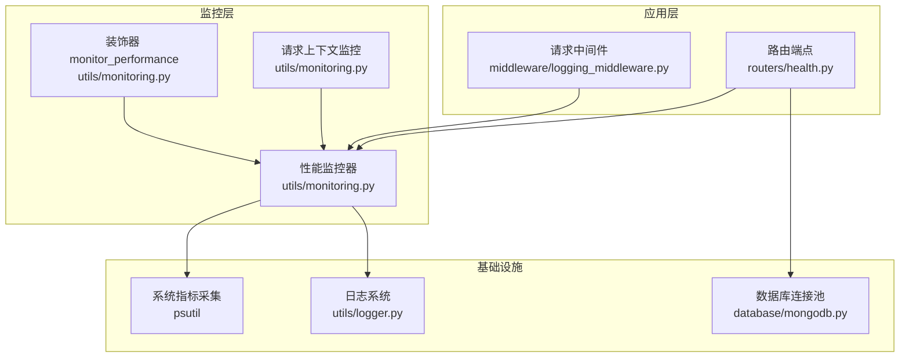
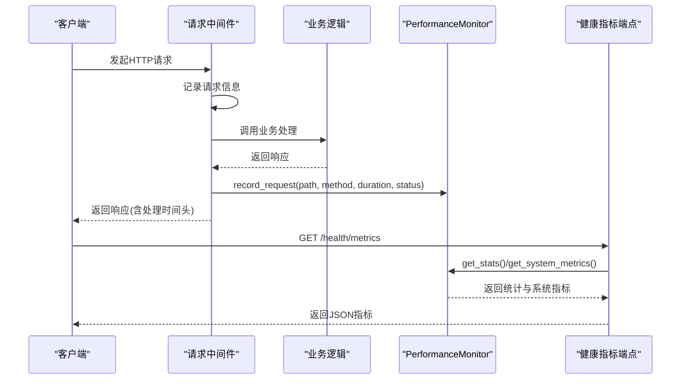
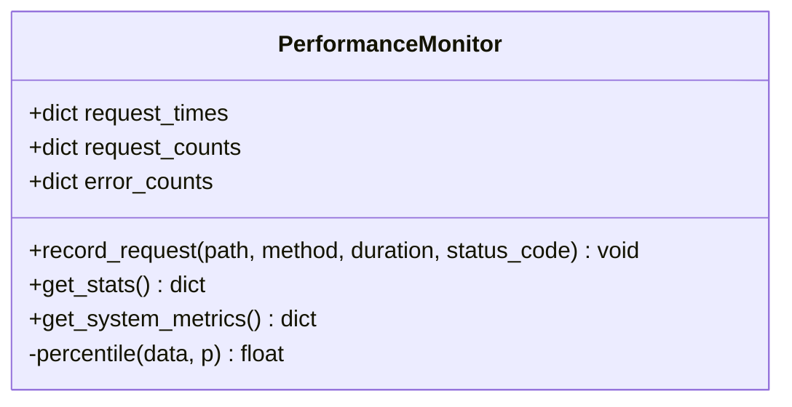
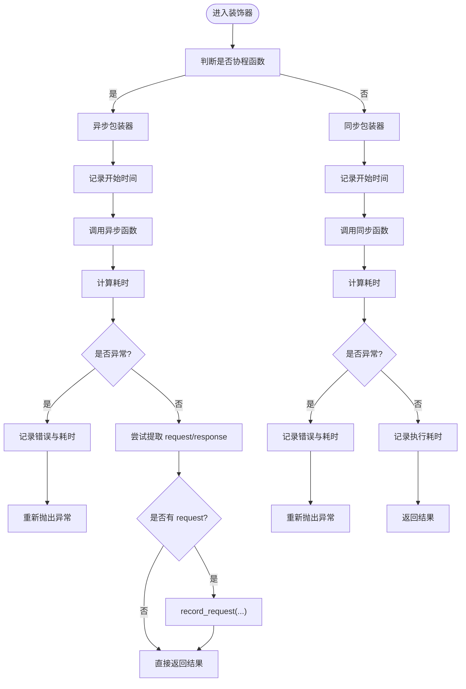
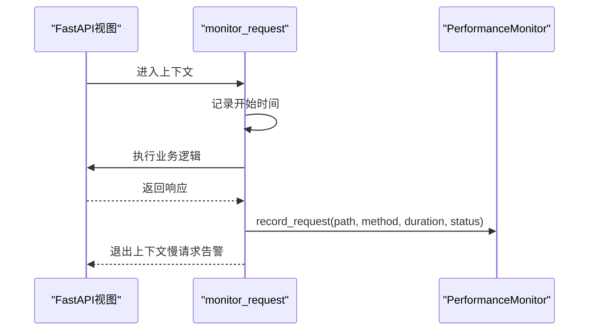
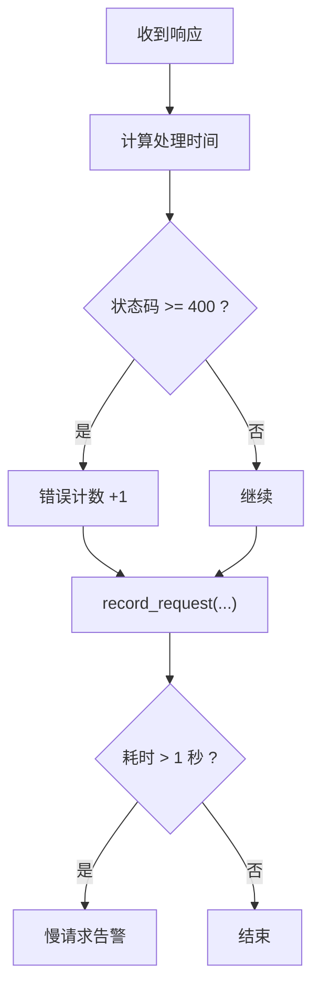
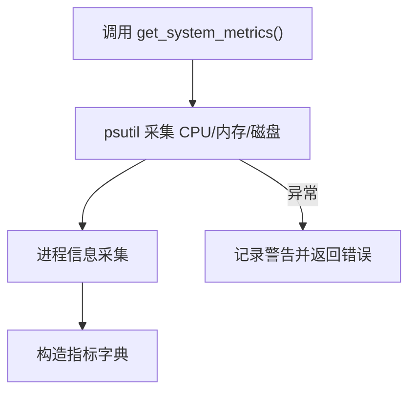
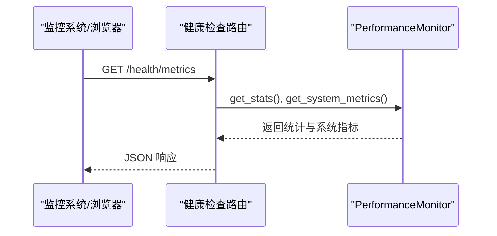
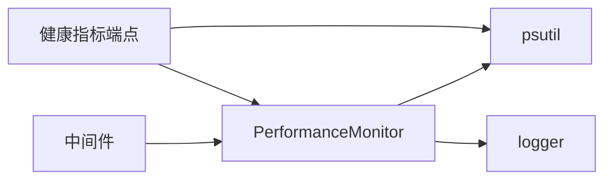

# 性能监控

<cite>
**本文引用的文件**
- [utils/monitoring.py](file://utils/monitoring.py)
- [middleware/logging_middleware.py](file://middleware/logging_middleware.py)
- [routers/health.py](file://routers/health.py)
- [utils/logger.py](file://utils/logger.py)
- [database/mongodb.py](file://database/mongodb.py)
</cite>

## 目录
1. [简介](#简介)
2. [项目结构](#项目结构)
3. [核心组件](#核心组件)
4. [架构总览](#架构总览)
5. [组件详解](#组件详解)
6. [依赖关系分析](#依赖关系分析)
7. [性能考量](#性能考量)
8. [故障排查指南](#故障排查指南)
9. [结论](#结论)
10. [附录](#附录)

## 简介
本文件围绕项目中的性能监控体系进行深入说明，重点覆盖以下方面：
- PerformanceMonitor 类的实现原理：请求性能记录、统计信息计算、系统资源监控
- 性能监控装饰器 monitor_performance 的使用方法与应用场景
- 请求响应时间统计、错误率监控与慢请求检测机制
- CPU、内存、磁盘等系统指标的采集与分析方法
- 性能基准测试、瓶颈识别与优化建议
- 监控数据可视化与报表生成方案

## 项目结构
与性能监控相关的核心位置如下：
- 性能监控与系统指标采集：utils/monitoring.py
- 请求日志与慢请求检测中间件：middleware/logging_middleware.py
- 健康检查与指标端点：routers/health.py
- 日志系统（异步写入与过滤）：utils/logger.py
- 数据库连接池与性能相关配置：database/mongodb.py

图表来源
- [utils/monitoring.py:13-185](file://utils/monitoring.py#L13-L185)
- [middleware/logging_middleware.py:8-51](file://middleware/logging_middleware.py#L8-L51)
- [routers/health.py:23-134](file://routers/health.py#L23-L134)
- [utils/logger.py:15-88](file://utils/logger.py#L15-L88)
- [database/mongodb.py:99-196](file://database/mongodb.py#L99-L196)

章节来源
- [utils/monitoring.py:13-185](file://utils/monitoring.py#L13-L185)
- [middleware/logging_middleware.py:8-51](file://middleware/logging_middleware.py#L8-L51)
- [routers/health.py:23-134](file://routers/health.py#L23-L134)
- [utils/logger.py:15-88](file://utils/logger.py#L15-L88)
- [database/mongodb.py:99-196](file://database/mongodb.py#L99-L196)

## 核心组件
- PerformanceMonitor：负责请求时间序列记录、统计计算（均值、最小/最大、分位数）、错误计数与系统资源采集
- monitor_performance 装饰器：自动测量函数执行耗时，并将请求耗时与状态码上报至监控器
- monitor_request 上下文管理器：对 FastAPI 请求生命周期进行监控，记录耗时与慢请求告警
- 日志系统：异步文件写入、队列监听、级别过滤，降低日志对主流程的影响
- 健康检查与指标端点：对外暴露请求统计与系统指标，便于集成监控平台

章节来源
- [utils/monitoring.py:13-185](file://utils/monitoring.py#L13-L185)
- [middleware/logging_middleware.py:8-51](file://middleware/logging_middleware.py#L8-L51)
- [routers/health.py:117-134](file://routers/health.py#L117-L134)
- [utils/logger.py:15-88](file://utils/logger.py#L15-L88)

## 架构总览
性能监控由“采集-统计-上报-展示”四层构成：
- 采集层：中间件、装饰器、上下文管理器、系统指标采集
- 统计层：PerformanceMonitor 内部维护每个路由的请求时间序列与统计
- 上报层：/health/metrics 暴露指标；慢请求通过日志告警
- 展示层：外部监控平台或自建仪表板消费指标

图表来源
- [middleware/logging_middleware.py:8-51](file://middleware/logging_middleware.py#L8-L51)
- [utils/monitoring.py:22-47](file://utils/monitoring.py#L22-L47)
- [routers/health.py:117-134](file://routers/health.py#L117-L134)

## 组件详解

### PerformanceMonitor 类
- 请求记录
  - 以 method+path 为键，维护最近约 1000 次请求的耗时序列
  - 每次记录会同时累加请求次数与错误次数（状态码 ≥ 400）
- 统计计算
  - 提供 count、error_count、avg_time、min_time、max_time、p50、p95、p99
  - 分位数采用排序后插值法计算
- 系统指标采集
  - 采集 CPU 百分比、内存使用（总量/可用/使用/百分比）、进程级内存
  - 采集磁盘总量/使用/剩余/百分比
  - 异常时返回错误信息，避免中断指标端点

图表来源
- [utils/monitoring.py:13-112](file://utils/monitoring.py#L13-L112)

章节来源
- [utils/monitoring.py:13-112](file://utils/monitoring.py#L13-L112)

### monitor_performance 装饰器
- 自动测量被装饰函数的执行耗时
- 对异步函数与同步函数分别包装
- 尝试从 kwargs 或第一个参数中解析 request/response，提取 path/method/status_code 并上报
- 异常时同样记录耗时并抛出

图表来源
- [utils/monitoring.py:118-161](file://utils/monitoring.py#L118-L161)

章节来源
- [utils/monitoring.py:118-161](file://utils/monitoring.py#L118-L161)

### monitor_request 上下文管理器
- 在 FastAPI 请求生命周期中，捕获请求开始与结束时间
- 记录耗时与状态码到监控器
- 对超过阈值（1 秒）的请求进行慢请求告警

图表来源
- [utils/monitoring.py:163-184](file://utils/monitoring.py#L163-L184)

章节来源
- [utils/monitoring.py:163-184](file://utils/monitoring.py#L163-L184)

### 请求响应时间统计、错误率监控与慢请求检测
- 响应时间统计：基于 PerformanceMonitor 的时间序列，计算均值、最小/最大与分位数
- 错误率监控：统计状态码 ≥ 400 的错误次数，结合请求总量得到错误率
- 慢请求检测：中间件与上下文管理器对耗时 > 1 秒的请求进行告警

图表来源
- [middleware/logging_middleware.py:29-40](file://middleware/logging_middleware.py#L29-L40)
- [utils/monitoring.py:22-47](file://utils/monitoring.py#L22-L47)
- [utils/monitoring.py:178-183](file://utils/monitoring.py#L178-L183)

章节来源
- [middleware/logging_middleware.py:29-40](file://middleware/logging_middleware.py#L29-L40)
- [utils/monitoring.py:22-47](file://utils/monitoring.py#L22-L47)
- [utils/monitoring.py:178-183](file://utils/monitoring.py#L178-L183)

### 系统资源监控
- CPU：整体 CPU 使用率与进程级 CPU 使用率
- 内存：总量、可用、使用、百分比与进程级内存占用（MB）
- 磁盘：总量、使用、剩余、百分比（GB）
- 异常保护：采集失败时返回错误信息，避免影响指标端点

图表来源
- [utils/monitoring.py:78-111](file://utils/monitoring.py#L78-L111)

章节来源
- [utils/monitoring.py:78-111](file://utils/monitoring.py#L78-L111)

### 指标端点与健康检查
- /health/metrics：返回 request_stats 与 system_metrics
- /health：返回服务健康状态与可选系统资源信息
- /health/liveness、/health/readiness：Kubernetes 探针

图表来源
- [routers/health.py:117-134](file://routers/health.py#L117-L134)
- [utils/monitoring.py:49-111](file://utils/monitoring.py#L49-L111)

章节来源
- [routers/health.py:23-134](file://routers/health.py#L23-L134)
- [utils/monitoring.py:49-111](file://utils/monitoring.py#L49-L111)

## 依赖关系分析
- PerformanceMonitor 依赖：
  - 时间与锁：time、asyncio.Lock
  - 系统指标：psutil
  - 日志：utils.logger.logger
- 中间件依赖：
  - FastAPI Request/Response
  - PerformanceMonitor
  - 日志
- 路由依赖：
  - PerformanceMonitor
  - psutil（独立于监控器的系统信息）

图表来源
- [utils/monitoring.py:13-185](file://utils/monitoring.py#L13-L185)
- [middleware/logging_middleware.py:8-51](file://middleware/logging_middleware.py#L8-L51)
- [routers/health.py:23-134](file://routers/health.py#L23-L134)

章节来源
- [utils/monitoring.py:13-185](file://utils/monitoring.py#L13-L185)
- [middleware/logging_middleware.py:8-51](file://middleware/logging_middleware.py#L8-L51)
- [routers/health.py:23-134](file://routers/health.py#L23-L134)

## 性能考量
- 时间序列长度控制：仅保留最近约 1000 次请求，避免内存无限增长
- 异步安全：使用 asyncio.Lock 保证并发安全
- 日志开销控制：异步文件处理器与队列监听，减少 I/O 对主流程影响
- 数据库连接池：MongoDB 连接池参数可调，提升高并发下的稳定性与吞吐
- 指标采集频率：系统指标采集间隔短（如 0.1 秒），兼顾实时性与开销

章节来源
- [utils/monitoring.py:20-47](file://utils/monitoring.py#L20-L47)
- [utils/logger.py:15-88](file://utils/logger.py#L15-L88)
- [database/mongodb.py:129-150](file://database/mongodb.py#L129-L150)

## 故障排查指南
- 指标端点返回错误
  - 检查系统指标采集是否异常（psutil 权限、路径访问）
  - 查看日志警告信息
- 慢请求频繁
  - 审核对应路由的业务逻辑与外部依赖（数据库、向量库、第三方 API）
  - 结合分位数（p95/p99）定位尾部延迟
- 错误率上升
  - 关注状态码分布与错误计数变化
  - 结合日志定位异常堆栈
- 日志过多或性能抖动
  - 检查日志级别与过滤策略
  - 确认异步日志队列未积压

章节来源
- [utils/monitoring.py:109-111](file://utils/monitoring.py#L109-L111)
- [middleware/logging_middleware.py:33-50](file://middleware/logging_middleware.py#L33-L50)
- [utils/logger.py:77-81](file://utils/logger.py#L77-L81)

## 结论
该性能监控体系以轻量、低侵入的方式实现了请求耗时统计、错误率监控与系统资源采集，并通过中间件、装饰器与上下文管理器覆盖了主要的请求路径。配合 /health/metrics 指标端点与异步日志系统，能够满足日常运维与问题定位需求。建议在生产环境结合外部监控平台进行可视化与告警，并持续关注数据库连接池与系统指标采集的调优。

## 附录

### 使用场景与最佳实践
- 路由装饰：对关键路由或批量处理接口使用 monitor_performance 装饰器
- 中间件：全局中间件已覆盖大部分请求，可按需调整日志策略
- 上下文监控：在 FastAPI 视图中使用 monitor_request 包裹复杂逻辑
- 指标端点：定期抓取 /health/metrics，纳入监控面板
- 健康检查：结合 /health、/health/liveness、/health/readiness 进行容器编排

章节来源
- [utils/monitoring.py:118-161](file://utils/monitoring.py#L118-L161)
- [utils/monitoring.py:163-184](file://utils/monitoring.py#L163-L184)
- [middleware/logging_middleware.py:8-51](file://middleware/logging_middleware.py#L8-L51)
- [routers/health.py:23-134](file://routers/health.py#L23-L134)