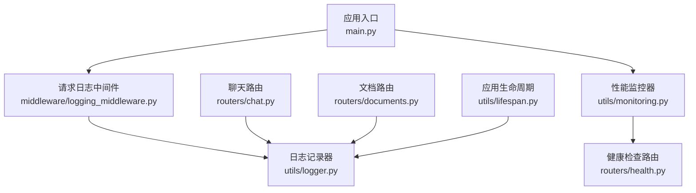
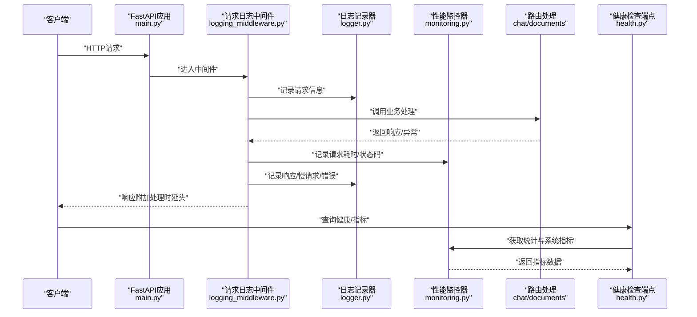
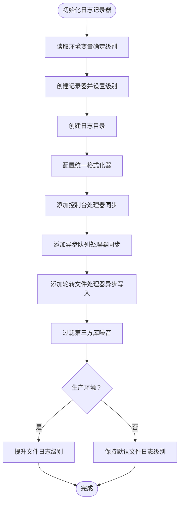
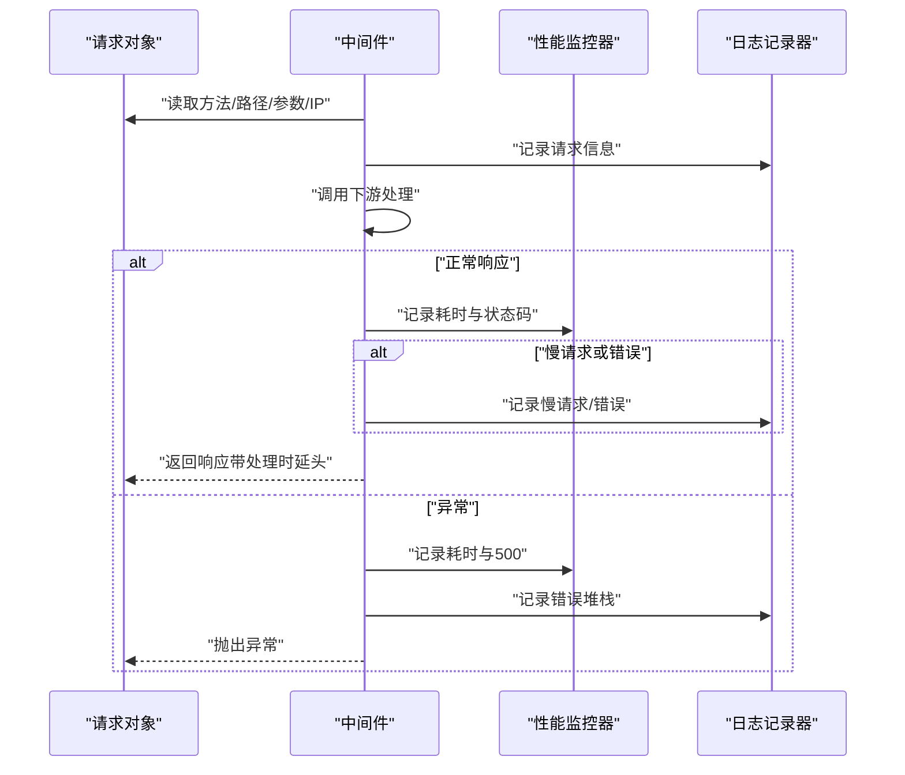
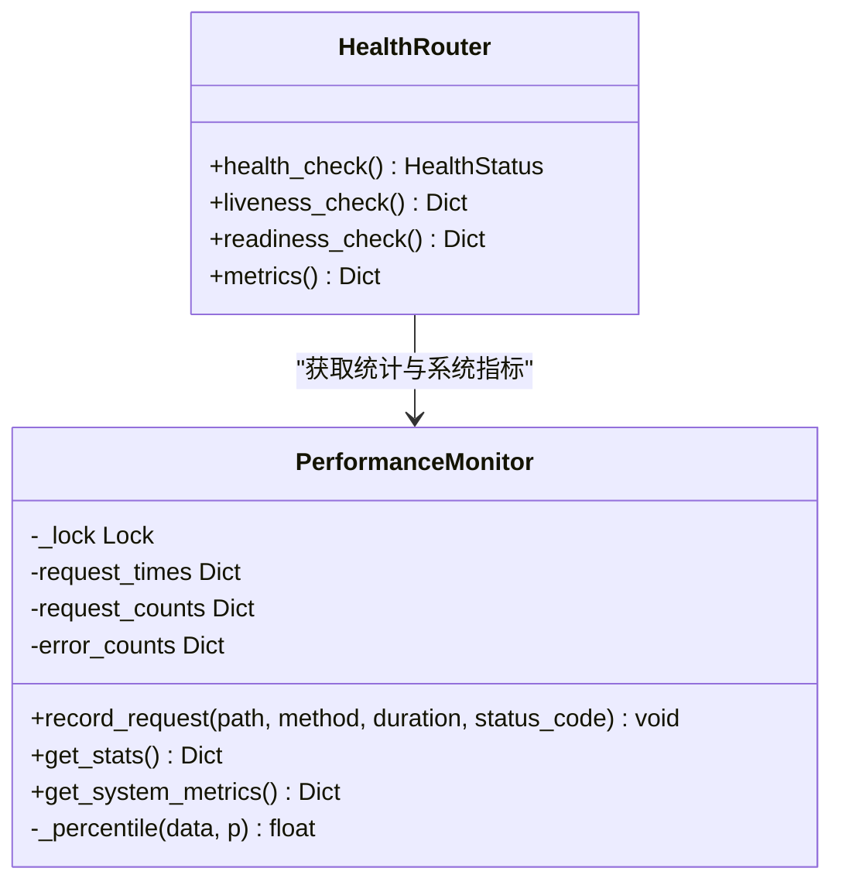
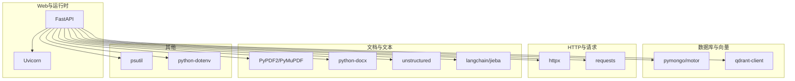

# 日志管理

<cite>
**本文引用的文件**
- [utils/logger.py](file://utils/logger.py)
- [middleware/logging_middleware.py](file://middleware/logging_middleware.py)
- [main.py](file://main.py)
- [utils/monitoring.py](file://utils/monitoring.py)
- [routers/health.py](file://routers/health.py)
- [routers/chat.py](file://routers/chat.py)
- [routers/documents.py](file://routers/documents.py)
- [utils/lifespan.py](file://utils/lifespan.py)
- [requirements.txt](file://requirements.txt)
</cite>

## 目录
1. [简介](#简介)
2. [项目结构](#项目结构)
3. [核心组件](#核心组件)
4. [架构总览](#架构总览)
5. [详细组件分析](#详细组件分析)
6. [依赖分析](#依赖分析)
7. [性能考虑](#性能考虑)
8. [故障排查指南](#故障排查指南)
9. [结论](#结论)
10. [附录](#附录)

## 简介
本文件系统性阐述本项目的日志管理方案，涵盖日志配置与使用、日志中间件实现原理、请求处理中的应用、结构化日志最佳实践、日志轮转与存储管理、检索与聚合方案，以及与性能监控的协同机制。目标是帮助开发者与运维人员快速理解并高效使用日志体系，支撑生产环境的可观测性与稳定性。

## 项目结构
日志相关能力由以下模块协同构成：
- 日志配置与输出：utils/logger.py
- 请求日志中间件：middleware/logging_middleware.py
- 应用入口与中间件注册：main.py
- 性能监控与指标采集：utils/monitoring.py
- 健康检查与指标端点：routers/health.py
- 路由层日志使用示例：routers/chat.py、routers/documents.py
- 应用生命周期与启动日志：utils/lifespan.py
- 依赖声明：requirements.txt

图表来源
- [main.py:72-73](file://main.py#L72-L73)
- [middleware/logging_middleware.py:8-51](file://middleware/logging_middleware.py#L8-L51)
- [utils/logger.py:15-86](file://utils/logger.py#L15-L86)
- [utils/monitoring.py:13-115](file://utils/monitoring.py#L13-L115)
- [routers/health.py:23-87](file://routers/health.py#L23-L87)
- [routers/chat.py:615-750](file://routers/chat.py#L615-L750)
- [routers/documents.py:723-800](file://routers/documents.py#L723-L800)
- [utils/lifespan.py:26-87](file://utils/lifespan.py#L26-L87)

章节来源
- [main.py:72-73](file://main.py#L72-L73)
- [utils/logger.py:15-86](file://utils/logger.py#L15-L86)
- [middleware/logging_middleware.py:8-51](file://middleware/logging_middleware.py#L8-L51)
- [utils/monitoring.py:13-115](file://utils/monitoring.py#L13-L115)
- [routers/health.py:23-87](file://routers/health.py#L23-L87)
- [routers/chat.py:615-750](file://routers/chat.py#L615-L750)
- [routers/documents.py:723-800](file://routers/documents.py#L723-L800)
- [utils/lifespan.py:26-87](file://utils/lifespan.py#L26-L87)

## 核心组件
- 异步日志记录器：基于队列与队列监听器实现异步写入，避免阻塞主线程；同时提供控制台处理器便于开发调试；支持按环境调整文件日志级别。
- 请求日志中间件：记录请求/响应信息、处理时延、慢请求识别与错误上报，并将性能指标写入性能监控器。
- 性能监控器：收集请求耗时、错误次数、系统资源指标，提供统计接口供健康检查端点使用。
- 健康检查与指标端点：对外暴露系统健康状态、请求统计与系统资源使用情况。
- 路由层日志：在业务关键节点记录操作、进度、异常与堆栈，支撑问题定位与审计。

章节来源
- [utils/logger.py:15-86](file://utils/logger.py#L15-L86)
- [middleware/logging_middleware.py:8-51](file://middleware/logging_middleware.py#L8-L51)
- [utils/monitoring.py:13-115](file://utils/monitoring.py#L13-L115)
- [routers/health.py:117-134](file://routers/health.py#L117-L134)
- [routers/chat.py:615-750](file://routers/chat.py#L615-L750)
- [routers/documents.py:723-800](file://routers/documents.py#L723-L800)

## 架构总览
下图展示日志与监控在请求链路中的交互：

图表来源
- [main.py:72-73](file://main.py#L72-L73)
- [middleware/logging_middleware.py:8-51](file://middleware/logging_middleware.py#L8-L51)
- [utils/logger.py:15-86](file://utils/logger.py#L15-L86)
- [utils/monitoring.py:22-48](file://utils/monitoring.py#L22-L48)
- [routers/health.py:117-134](file://routers/health.py#L117-L134)

## 详细组件分析

### 日志配置与输出（异步记录器）
- 日志级别：优先从环境变量读取，支持开发与生产差异化配置；生产环境默认降低文件日志级别，减少噪声。
- 输出目标：
  - 控制台处理器：同步输出，便于本地调试。
  - 文件处理器：异步写入，使用队列与队列监听器，避免阻塞；采用轮转文件处理器，限制单文件大小与备份数量。
- 第三方库噪音过滤：针对常见HTTP与数据库相关库设置较高阈值，降低无关日志。
- 日志格式：简洁统一，包含时间、级别、记录器名称与消息体。

图表来源
- [utils/logger.py:15-86](file://utils/logger.py#L15-L86)

章节来源
- [utils/logger.py:15-86](file://utils/logger.py#L15-L86)

### 请求日志中间件（请求处理中的应用）
- 记录内容：请求方法、路径、查询参数、客户端IP；对健康检查请求进行过滤，降低日志量。
- 性能监控：计算处理时延，记录到性能监控器；慢请求（>1秒）与错误（>=500）单独标注。
- 响应头注入：将处理时延写入响应头，便于前端与网关侧观测。
- 异常处理：捕获异常并记录错误堆栈，同时上报性能监控器。

图表来源
- [middleware/logging_middleware.py:8-51](file://middleware/logging_middleware.py#L8-L51)
- [utils/monitoring.py:22-48](file://utils/monitoring.py#L22-L48)
- [utils/logger.py:15-86](file://utils/logger.py#L15-L86)

章节来源
- [middleware/logging_middleware.py:8-51](file://middleware/logging_middleware.py#L8-L51)
- [utils/monitoring.py:22-48](file://utils/monitoring.py#L22-L48)

### 性能监控与健康检查
- 性能监控器：
  - 记录每次请求的耗时序列，维护最近N次的滑动窗口，计算均值、最小、最大与分位数。
  - 统计错误次数，便于趋势分析。
  - 采集CPU、内存、磁盘等系统指标，包含进程级指标。
- 健康检查端点：
  - /health：检查数据库与向量库连通性，汇总服务状态与系统资源。
  - /health/metrics：返回请求统计与系统指标，供外部监控系统抓取。

图表来源
- [utils/monitoring.py:13-115](file://utils/monitoring.py#L13-L115)
- [routers/health.py:23-134](file://routers/health.py#L23-L134)

章节来源
- [utils/monitoring.py:13-115](file://utils/monitoring.py#L13-L115)
- [routers/health.py:23-134](file://routers/health.py#L23-L134)

### 路由层日志使用示例
- 聊天路由：记录对话请求、Agent执行、流式输出断连检测与错误处理，便于定位RAG链路问题。
- 文档路由：记录上传、解析、分块、向量化、存储全流程进度与异常堆栈，支持大文件与长时间任务的可观测性。

章节来源
- [routers/chat.py:615-750](file://routers/chat.py#L615-L750)
- [routers/documents.py:723-800](file://routers/documents.py#L723-L800)

### 应用生命周期与启动日志
- 启动阶段：带重试的数据库连接、默认助手与知识空间初始化，期间记录连接状态与初始化结果。
- 关闭阶段：优雅断开数据库连接，记录异常以便排障。

章节来源
- [utils/lifespan.py:26-87](file://utils/lifespan.py#L26-L87)

## 依赖分析
- Web框架与运行时：FastAPI、Uvicorn
- 数据库与向量库：MongoDB（pymongo、motor）、Qdrant（qdrant-client）
- HTTP与请求：httpx、requests
- 文档解析与文本处理：PyPDF2、PyMuPDF、python-docx、unstructured、langchain、jieba
- 其他：psutil（系统指标）、python-dotenv（环境变量）

图表来源
- [requirements.txt:4-38](file://requirements.txt#L4-L38)

章节来源
- [requirements.txt:4-38](file://requirements.txt#L4-L38)

## 性能考虑
- 异步日志写入：通过队列与队列监听器分离I/O，避免阻塞请求线程，适合高并发场景。
- 日志轮转：单文件上限与备份数量可控，结合定期清理策略，平衡磁盘占用与历史留存。
- 过滤噪音：对第三方库设置较高日志级别，减少无关输出，降低I/O与存储压力。
- 慢请求与错误识别：中间件对慢请求与错误进行标注，便于快速定位性能瓶颈与异常。
- 系统指标采集：周期性采集CPU、内存、磁盘与进程指标，辅助容量规划与异常预警。

## 故障排查指南
- 全局异常处理：应用入口注册全局异常处理器，记录异常堆栈并返回统一错误响应，便于集中排查。
- 健康检查：通过/health与/health/metrics快速判断服务、数据库与向量库连通性与系统资源状况。
- 路由层日志：聊天与文档路由在关键步骤记录进度与异常堆栈，结合性能监控器统计，定位耗时环节。
- 启动与关闭：生命周期管理记录数据库连接与初始化过程，异常时可据此复现问题。

章节来源
- [main.py:109-125](file://main.py#L109-L125)
- [routers/health.py:23-134](file://routers/health.py#L23-L134)
- [routers/chat.py:615-750](file://routers/chat.py#L615-L750)
- [routers/documents.py:723-800](file://routers/documents.py#L723-L800)
- [utils/lifespan.py:26-87](file://utils/lifespan.py#L26-L87)

## 结论
本项目的日志管理以异步记录器为核心，配合请求日志中间件与性能监控器，形成从请求观测到系统指标的完整闭环。通过健康检查与指标端点，能够将日志与监控能力对外暴露，便于集成到现有可观测性平台。建议在生产环境中合理设置日志级别与轮转策略，结合慢请求与错误告警，持续优化系统稳定性与可维护性。

## 附录

### 日志级别与输出目标配置
- 环境变量：LOG_LEVEL（默认INFO），ENVIRONMENT（production时降低文件日志级别）
- 输出目标：控制台（同步，开发调试）与文件（异步轮转，生产降噪）
- 格式：统一包含时间、级别、记录器名称与消息体

章节来源
- [utils/logger.py:15-86](file://utils/logger.py#L15-L86)

### 日志轮转策略与存储管理
- 单文件上限：固定大小
- 备份数量：固定数量
- 存储位置：项目根/logs目录
- 建议：结合系统日志轮转工具（如logrotate）进行归档与清理

章节来源
- [utils/logger.py:46-54](file://utils/logger.py#L46-L54)

### 结构化日志与最佳实践
- 请求追踪：中间件记录方法、路径、参数、客户端IP与处理时延，必要时可扩展Trace-ID。
- 错误堆栈：全局异常处理器与路由层异常捕获均开启堆栈记录，便于溯源。
- 性能指标：慢请求与错误统计、系统资源指标，结合健康检查端点统一暴露。

章节来源
- [middleware/logging_middleware.py:8-51](file://middleware/logging_middleware.py#L8-L51)
- [utils/monitoring.py:22-48](file://utils/monitoring.py#L22-L48)
- [routers/health.py:117-134](file://routers/health.py#L117-L134)

### 日志聚合、分析与可视化集成
- 指标端点：/health/metrics返回请求统计与系统指标，可被Prometheus等抓取。
- 健康检查：/health与/health/readiness用于Kubernetes探针与外部监控。
- 建议：将应用日志与指标接入集中式日志与监控平台（如ELK/EFK、Grafana Loki、Prometheus+Grafana），实现统一检索、告警与可视化。

章节来源
- [routers/health.py:23-134](file://routers/health.py#L23-L134)
- [utils/monitoring.py:78-111](file://utils/monitoring.py#L78-L111)