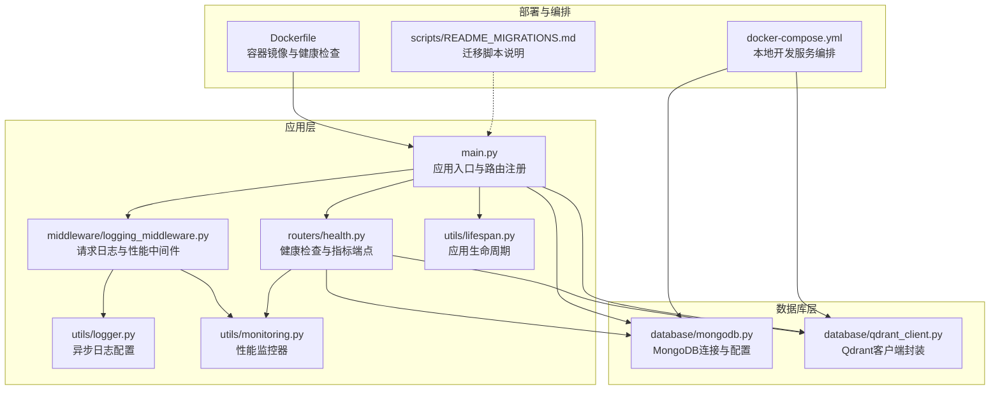
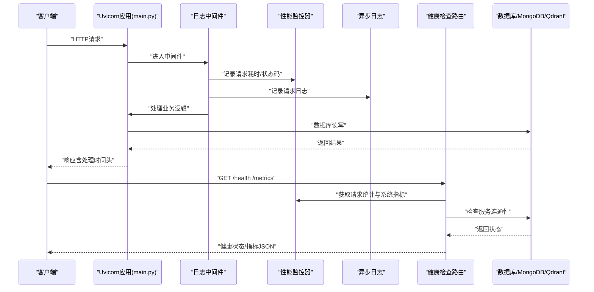
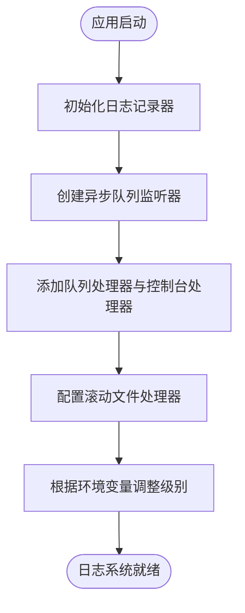
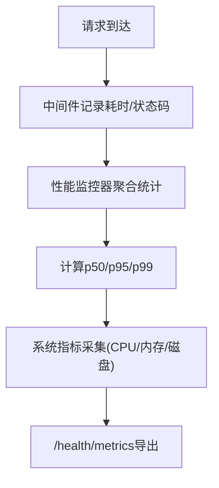
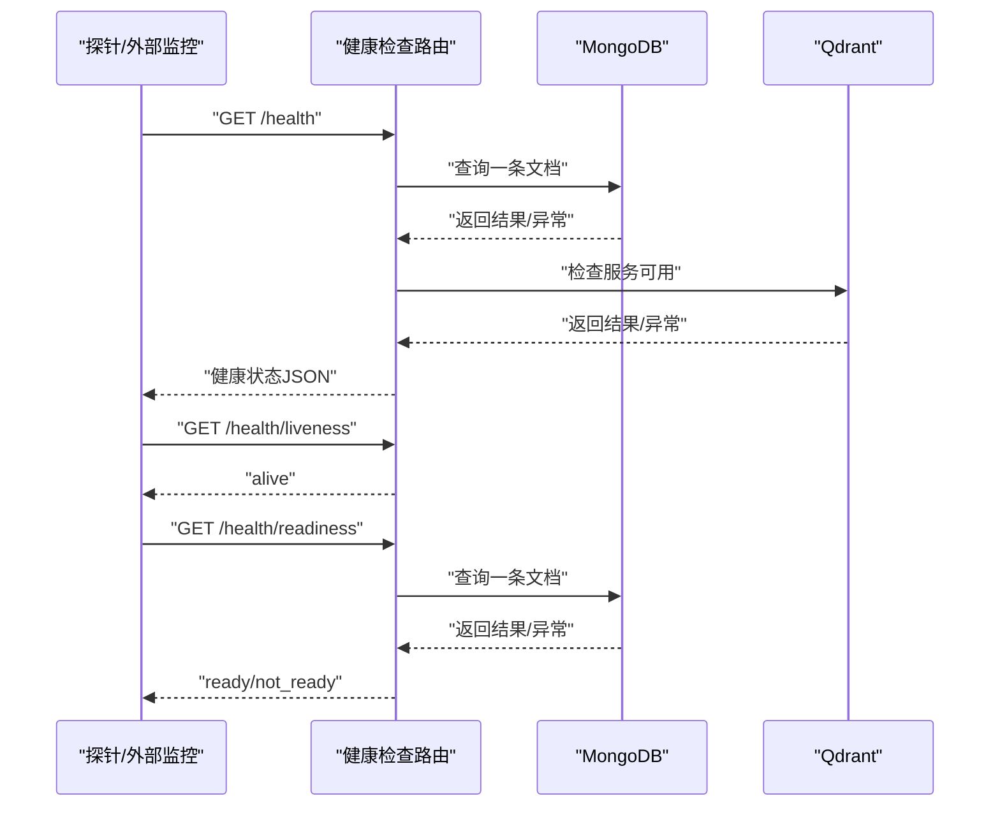
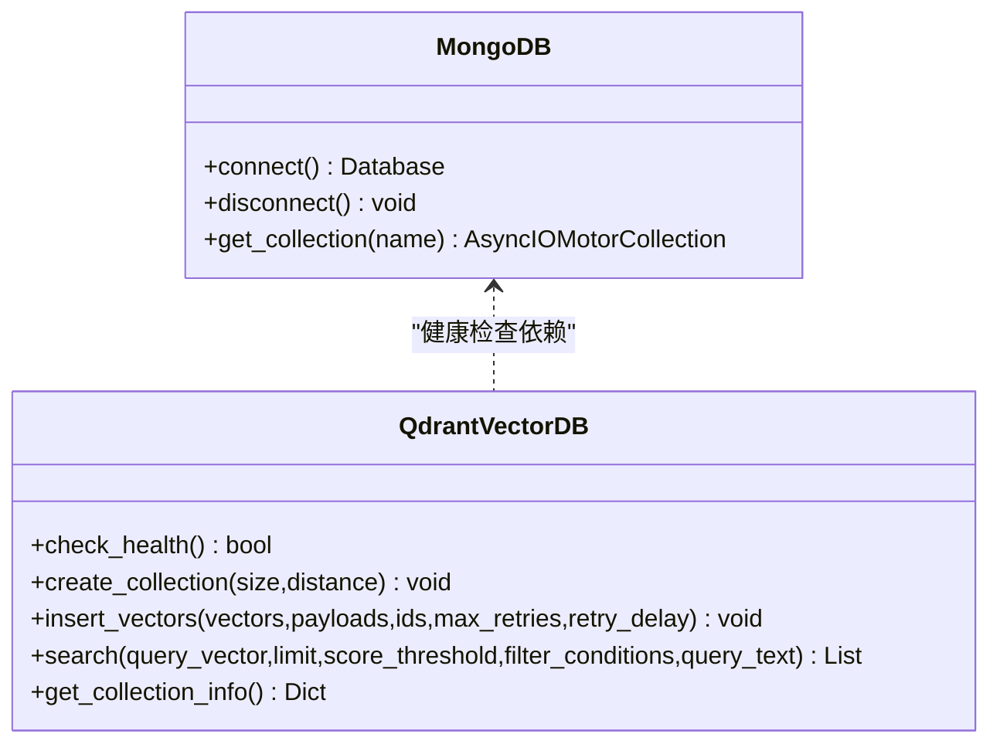
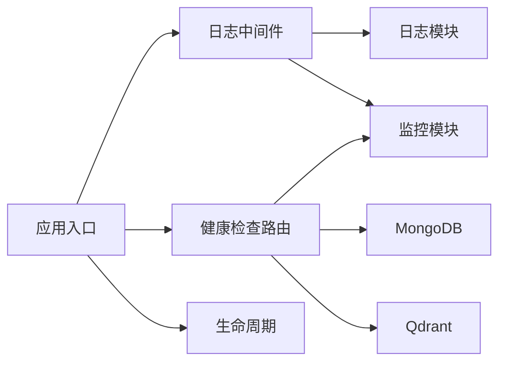

# 监控运维

<cite>
**本文引用的文件**
- [main.py](file://main.py)
- [utils/logger.py](file://utils/logger.py)
- [middleware/logging_middleware.py](file://middleware/logging_middleware.py)
- [utils/monitoring.py](file://utils/monitoring.py)
- [routers/health.py](file://routers/health.py)
- [utils/lifespan.py](file://utils/lifespan.py)
- [database/mongodb.py](file://database/mongodb.py)
- [database/qdrant_client.py](file://database/qdrant_client.py)
- [docker-compose.yml](file://docker-compose.yml)
- [Dockerfile](file://Dockerfile)
- [scripts/README_MIGRATIONS.md](file://scripts/README_MIGRATIONS.md)
</cite>

## 目录
1. [简介](#简介)
2. [项目结构](#项目结构)
3. [核心组件](#核心组件)
4. [架构总览](#架构总览)
5. [详细组件分析](#详细组件分析)
6. [依赖分析](#依赖分析)
7. [性能考虑](#性能考虑)
8. [故障排查指南](#故障排查指南)
9. [结论](#结论)
10. [附录](#附录)

## 简介
本文件面向运维与平台工程团队，系统化梳理本项目的监控与运维实践，涵盖应用性能指标采集、数据库与基础设施监控、日志管理策略、健康检查与运维自动化、以及与外部监控体系（如 Prometheus/Grafana/ELK）的对接建议。文档基于仓库内现有实现进行解读，并提供可落地的配置与最佳实践。

## 项目结构
项目采用 FastAPI + Uvicorn 的服务架构，结合中间件与工具模块实现统一的日志与性能监控能力；数据库层包含 MongoDB、Qdrant 等依赖服务，通过 Docker Compose 提供本地开发环境；健康检查端点与生命周期管理保障服务可用性与稳定性。

**图表来源**
- [main.py:55-98](file://main.py#L55-L98)
- [middleware/logging_middleware.py:8-51](file://middleware/logging_middleware.py#L8-L51)
- [utils/logger.py:15-87](file://utils/logger.py#L15-L87)
- [utils/monitoring.py:13-185](file://utils/monitoring.py#L13-L185)
- [routers/health.py:23-134](file://routers/health.py#L23-L134)
- [utils/lifespan.py:26-87](file://utils/lifespan.py#L26-L87)
- [database/mongodb.py:92-199](file://database/mongodb.py#L92-L199)
- [database/qdrant_client.py:18-139](file://database/qdrant_client.py#L18-L139)
- [Dockerfile:91-94](file://Dockerfile#L91-L94)
- [docker-compose.yml:18-24](file://docker-compose.yml#L18-L24)

**章节来源**
- [main.py:55-98](file://main.py#L55-L98)
- [docker-compose.yml:1-76](file://docker-compose.yml#L1-L76)
- [Dockerfile:1-95](file://Dockerfile#L1-L95)

## 核心组件
- 日志系统：基于异步队列的文件处理器，支持滚动与后台写入，降低对主线程的影响；生产环境可调整日志级别与输出位置。
- 请求监控：中间件统一记录请求耗时、状态码，并通过性能监控器汇总统计；慢请求与错误请求会被特别标注。
- 健康检查：提供综合健康状态、存活探针、就绪探针与指标端点，覆盖数据库与系统资源。
- 生命周期管理：启动时连接数据库并做初始化，关闭时释放连接，增强健壮性。
- 数据库连接：MongoDB 连接池参数可配置，Qdrant 优先使用 gRPC 以提升性能与稳定性。

**章节来源**
- [utils/logger.py:15-87](file://utils/logger.py#L15-L87)
- [middleware/logging_middleware.py:8-51](file://middleware/logging_middleware.py#L8-L51)
- [utils/monitoring.py:13-185](file://utils/monitoring.py#L13-L185)
- [routers/health.py:23-134](file://routers/health.py#L23-L134)
- [utils/lifespan.py:26-87](file://utils/lifespan.py#L26-L87)
- [database/mongodb.py:122-136](file://database/mongodb.py#L122-L136)
- [database/qdrant_client.py:66-96](file://database/qdrant_client.py#L66-L96)

## 架构总览
下图展示从请求进入应用到数据库访问与健康检查指标输出的整体流程，体现日志、监控与健康检查的协同工作方式。

**图表来源**
- [main.py:72-73](file://main.py#L72-L73)
- [middleware/logging_middleware.py:8-51](file://middleware/logging_middleware.py#L8-L51)
- [utils/monitoring.py:22-48](file://utils/monitoring.py#L22-L48)
- [routers/health.py:23-134](file://routers/health.py#L23-L134)
- [database/mongodb.py:99-167](file://database/mongodb.py#L99-L167)
- [database/qdrant_client.py:124-139](file://database/qdrant_client.py#L124-L139)

## 详细组件分析

### 日志管理策略
- 异步写入：通过队列监听器在后台线程写入文件，避免阻塞请求处理；控制台处理器用于开发调试。
- 日志轮转：使用滚动文件处理器，单文件最大 10MB，保留 5 份备份，编码 UTF-8。
- 环境适配：生产环境可将文件日志级别提升至 WARNING，减少 IO 压力；同时过滤第三方库噪声。
- 输出位置：日志目录 logs 自动创建，便于集中收集与归档。

**图表来源**
- [utils/logger.py:15-87](file://utils/logger.py#L15-L87)

**章节来源**
- [utils/logger.py:15-87](file://utils/logger.py#L15-L87)

### 请求监控与性能指标
- 中间件采集：记录请求路径、方法、状态码与处理时间；慢请求（>1s）与错误请求（>=4xx/5xx）会被标注。
- 统计聚合：性能监控器按路径+方法聚合最近 1000 次请求的耗时，计算平均、最小、最大与百分位数（p50/p95/p99）。
- 系统指标：CPU、内存、磁盘与进程级指标（CPU/内存）实时采集，便于定位资源瓶颈。
- 指标端点：/health/metrics 汇总请求统计与系统指标，便于外部监控系统抓取。

**图表来源**
- [middleware/logging_middleware.py:23-31](file://middleware/logging_middleware.py#L23-L31)
- [utils/monitoring.py:22-68](file://utils/monitoring.py#L22-L68)
- [utils/monitoring.py:78-111](file://utils/monitoring.py#L78-L111)
- [routers/health.py:117-134](file://routers/health.py#L117-L134)

**章节来源**
- [middleware/logging_middleware.py:8-51](file://middleware/logging_middleware.py#L8-L51)
- [utils/monitoring.py:13-185](file://utils/monitoring.py#L13-L185)
- [routers/health.py:117-134](file://routers/health.py#L117-L134)

### 健康检查与就绪/存活探针
- 综合健康：检查 MongoDB 与 Qdrant 连通性，汇总服务状态与系统资源信息。
- 存活探针：简单返回存活状态，适合容器编排的 Liveness。
- 就绪探针：验证关键依赖（如 MongoDB）可用后返回就绪，避免流量接入导致级联失败。
- 指标端点：统一输出请求统计与系统指标，便于外部监控系统抓取。

**图表来源**
- [routers/health.py:23-114](file://routers/health.py#L23-L114)
- [database/mongodb.py:99-167](file://database/mongodb.py#L99-L167)
- [database/qdrant_client.py:124-139](file://database/qdrant_client.py#L124-L139)

**章节来源**
- [routers/health.py:23-134](file://routers/health.py#L23-L134)

### 数据库连接与性能参数
- MongoDB：连接池参数可配置（最大/最小连接池、空闲超时、服务器选择/连接/套接字超时），启动时 ping 校验，失败时给出明确提示与修复建议。
- Qdrant：优先使用 gRPC（端口 6334），避免 HTTP/httpx 的 502 问题；带重试与维度自动重建逻辑，提升稳定性。

**图表来源**
- [database/mongodb.py:92-199](file://database/mongodb.py#L92-L199)
- [database/qdrant_client.py:18-139](file://database/qdrant_client.py#L18-L139)

**章节来源**
- [database/mongodb.py:92-199](file://database/mongodb.py#L92-L199)
- [database/qdrant_client.py:18-139](file://database/qdrant_client.py#L18-L139)

### 应用生命周期与启动初始化
- 启动阶段：连接数据库并进行初始化（如默认助手与知识空间），失败时重试并记录错误。
- 关闭阶段：释放数据库连接，避免资源泄漏。

**章节来源**
- [utils/lifespan.py:26-87](file://utils/lifespan.py#L26-L87)

### 部署与容器健康检查
- Dockerfile：设置 HEALTHCHECK，周期性访问 /health，失败时重启容器。
- docker-compose：本地开发环境提供 MongoDB、Qdrant、Neo4j 的健康检查与持久化卷。

**章节来源**
- [Dockerfile:91-94](file://Dockerfile#L91-L94)
- [docker-compose.yml:18-24](file://docker-compose.yml#L18-L24)

### 运维自动化与迁移
- 迁移脚本：提供迁移状态查看、选择性执行与强制重跑能力；迁移历史记录在 MongoDB 中，便于审计与回溯。
- 建议：在生产环境执行前备份数据库，先在测试环境验证迁移脚本。

**章节来源**
- [scripts/README_MIGRATIONS.md:13-135](file://scripts/README_MIGRATIONS.md#L13-L135)

## 依赖分析
- 中间件依赖日志与监控模块，形成统一的请求观测面。
- 健康检查路由依赖数据库与监控模块，提供服务可用性与系统指标。
- 应用入口注册中间件与健康检查路由，统一对外暴露监控与可观测能力。
- 数据库层通过连接池与重试策略提升稳定性，容器编排提供本地开发与健康检查支撑。

**图表来源**
- [middleware/logging_middleware.py:8-51](file://middleware/logging_middleware.py#L8-L51)
- [utils/logger.py:15-87](file://utils/logger.py#L15-L87)
- [utils/monitoring.py:13-185](file://utils/monitoring.py#L13-L185)
- [routers/health.py:23-134](file://routers/health.py#L23-L134)
- [database/mongodb.py:92-199](file://database/mongodb.py#L92-L199)
- [database/qdrant_client.py:18-139](file://database/qdrant_client.py#L18-L139)
- [main.py:72-73](file://main.py#L72-L73)

**章节来源**
- [main.py:72-73](file://main.py#L72-L73)
- [routers/health.py:23-134](file://routers/health.py#L23-L134)

## 性能考虑
- 连接池与超时：MongoDB 连接池参数可调，建议根据并发与实例规格平衡 maxPoolSize/minPoolSize；Qdrant 优先 gRPC，减少 HTTP 层开销。
- 日志吞吐：异步队列写入与滚动文件处理器配合，避免日志 IO 影响请求处理；生产环境可提高文件日志级别。
- 慢请求识别：中间件与监控器均对慢请求进行标注，便于定位热点接口与异常耗时。
- 并发与 Worker：生产环境通过环境变量控制 Uvicorn Worker 数量，提升并发处理能力。

**章节来源**
- [database/mongodb.py:122-136](file://database/mongodb.py#L122-L136)
- [database/qdrant_client.py:66-96](file://database/qdrant_client.py#L66-L96)
- [utils/logger.py:56-66](file://utils/logger.py#L56-L66)
- [middleware/logging_middleware.py:38-40](file://middleware/logging_middleware.py#L38-L40)
- [main.py:140-157](file://main.py#L140-L157)

## 故障排查指南
- 健康检查失败
  - MongoDB：检查连接字符串、认证信息与网络可达性；查看启动日志中的提示信息。
  - Qdrant：确认 gRPC 端口可达，避免使用 HTTP 导致的 502；必要时切换为 127.0.0.1。
- 慢请求与错误
  - 中间件会标注慢请求与错误状态码，结合 /health/metrics 的请求统计定位热点接口。
- 日志问题
  - 检查 logs 目录权限与磁盘空间；生产环境可提高文件日志级别以减少 IO。
- 迁移失败
  - 查看 migration_history 集合中的错误记录；确认数据库连接与权限；先在测试环境验证。

**章节来源**
- [database/mongodb.py:168-184](file://database/mongodb.py#L168-L184)
- [database/qdrant_client.py:109-122](file://database/qdrant_client.py#L109-L122)
- [routers/health.py:40-65](file://routers/health.py#L40-L65)
- [utils/monitoring.py:178-183](file://utils/monitoring.py#L178-L183)
- [scripts/README_MIGRATIONS.md:115-135](file://scripts/README_MIGRATIONS.md#L115-L135)

## 结论
本项目在日志、监控与健康检查方面具备完善的内置能力，配合数据库层的连接池与重试策略、容器编排的健康检查，能够满足生产环境的可观测性与稳定性需求。建议结合外部监控体系（Prometheus/Grafana/ELK）进一步完善指标采集与可视化，并在生产环境严格执行迁移与变更流程。

## 附录

### A. 外部监控体系对接建议
- 指标采集
  - Prometheus：抓取 /health/metrics 端点，将请求统计与系统指标纳入时序数据库。
  - Grafana：基于 Prometheus 数据源创建仪表板，展示请求耗时分布（p50/p95/p99）、错误率、慢请求占比与资源使用趋势。
- 日志聚合
  - ELK：将 logs 目录挂载到 Filebeat/Logstash，统一收集与检索；按服务、环境与时间分区管理。
- 告警规则
  - 基于 Prometheus 报警规则示例（阈值与窗口按业务调整）：
    - 请求错误率（5 分钟窗口，>1%）
    - 慢请求比例（p95 > 阈值）
    - 系统 CPU 使用率（>80%，持续 5 分钟）
    - 内存使用率（>85%，持续 5 分钟）
    - 磁盘剩余空间（<10%，持续 10 分钟）
    - 数据库连接池空闲/超时异常（>阈值）
  - 通知渠道：邮件、企业微信/飞书机器人、PagerDuty 等。

[本节为概念性内容，不直接分析具体文件，故不提供“图表来源”与“章节来源”]