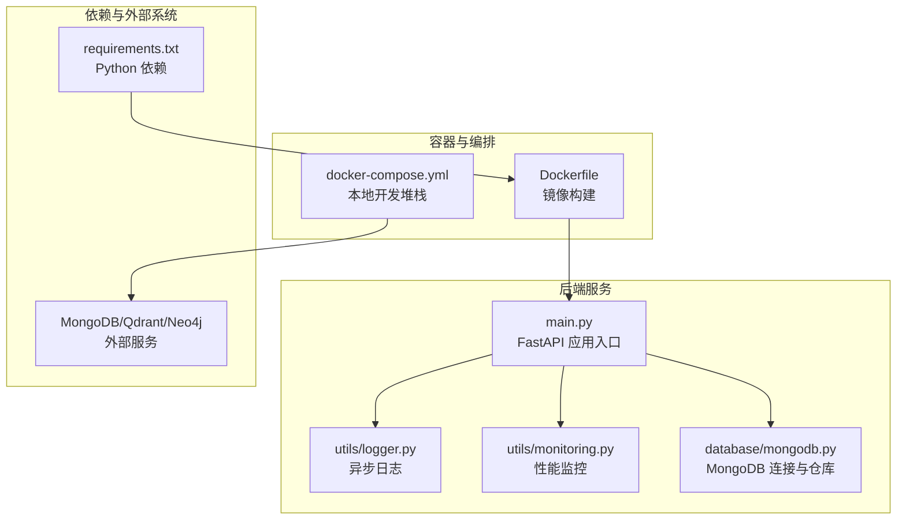
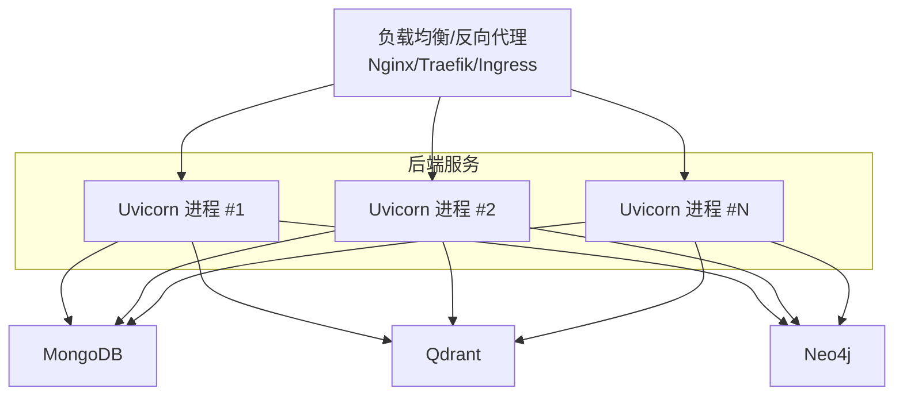
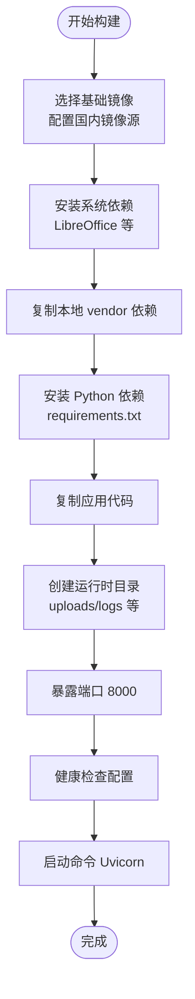
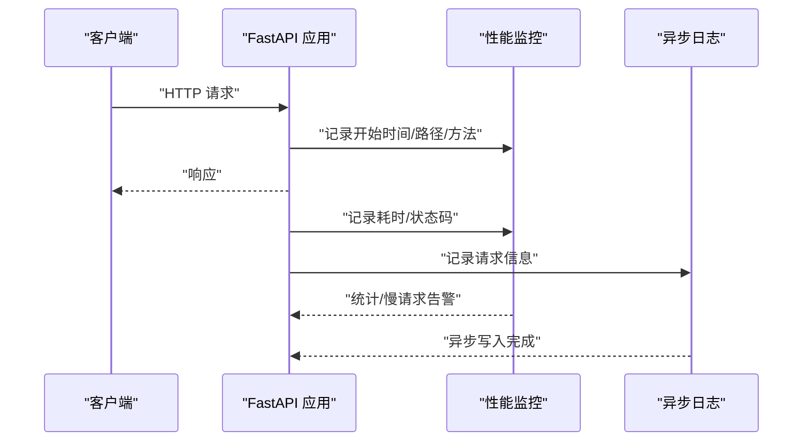

# 部署运维

<cite>
**本文引用的文件**
- [Dockerfile](file://Dockerfile)
- [docker-compose.yml](file://docker-compose.yml)
- [requirements.txt](file://requirements.txt)
- [main.py](file://main.py)
- [README.md](file://README.md)
- [utils/logger.py](file://utils/logger.py)
- [utils/monitoring.py](file://utils/monitoring.py)
- [database/mongodb.py](file://database/mongodb.py)
- [scripts/README_MIGRATIONS.md](file://scripts/README_MIGRATIONS.md)
</cite>

## 目录
1. [简介](#简介)
2. [项目结构](#项目结构)
3. [核心组件](#核心组件)
4. [架构总览](#架构总览)
5. [详细组件分析](#详细组件分析)
6. [依赖分析](#依赖分析)
7. [性能考虑](#性能考虑)
8. [故障排除指南](#故障排除指南)
9. [结论](#结论)
10. [附录](#附录)

## 简介
本文件面向生产环境的 advanced-rag 部署与运维，覆盖以下主题：
- Docker 容器化部署与镜像构建
- Kubernetes 集群部署要点
- 传统服务器部署步骤
- 环境配置指南（数据库、缓存、负载均衡、SSL）
- 监控指标采集、日志管理与告警
- 性能调优、容量规划与扩展策略
- 备份恢复、灾难恢复与高可用
- 安全加固、访问控制与数据保护
- 故障排除、FAQ 与运维最佳实践
- 自动化运维脚本与 CI/CD 流水线建议

## 项目结构
后端基于 FastAPI，容器化与编排由 Docker 与 docker-compose 提供；数据库与向量/图数据库通过 Compose 启动；日志与性能监控由内置工具模块提供；迁移脚本用于数据库结构初始化与演进。

**图表来源**
- [Dockerfile:1-95](file://Dockerfile#L1-L95)
- [docker-compose.yml:1-76](file://docker-compose.yml#L1-L76)
- [main.py:1-157](file://main.py#L1-L157)
- [utils/logger.py:1-88](file://utils/logger.py#L1-L88)
- [utils/monitoring.py:1-185](file://utils/monitoring.py#L1-L185)
- [database/mongodb.py:1-1290](file://database/mongodb.py#L1-L1290)
- [requirements.txt:1-38](file://requirements.txt#L1-L38)

**章节来源**
- [Dockerfile:1-95](file://Dockerfile#L1-L95)
- [docker-compose.yml:1-76](file://docker-compose.yml#L1-L76)
- [main.py:1-157](file://main.py#L1-L157)
- [README.md:1-290](file://README.md#L1-L290)

## 核心组件
- 应用入口与路由：FastAPI 应用在入口文件中注册路由、CORS、静态文件挂载与全局异常处理，并依据环境变量加载不同配置文件。
- 日志系统：提供异步文件处理器与队列监听器，支持生产环境降级日志级别，减少 IO 压力。
- 性能监控：提供请求耗时统计、慢请求检测与系统资源指标采集。
- 数据库连接：MongoDB 客户端封装，支持解析 URI、连接池参数配置与连接校验。
- 部署与编排：Dockerfile 定义生产镜像与健康检查；docker-compose 提供本地开发堆栈（MongoDB、Qdrant、Neo4j）。

**章节来源**
- [main.py:1-157](file://main.py#L1-L157)
- [utils/logger.py:1-88](file://utils/logger.py#L1-L88)
- [utils/monitoring.py:1-185](file://utils/monitoring.py#L1-L185)
- [database/mongodb.py:1-1290](file://database/mongodb.py#L1-L1290)
- [Dockerfile:1-95](file://Dockerfile#L1-L95)
- [docker-compose.yml:1-76](file://docker-compose.yml#L1-L76)

## 架构总览
下图展示生产环境典型拓扑：反向代理/负载均衡前置，后端以多副本运行，数据库与向量/图数据库通过独立服务提供。

[此图为概念性架构示意，不直接映射具体源文件，故不提供图表来源]

## 详细组件分析

### Docker 容器化部署
- 镜像基础与环境变量
  - 基础镜像为精简版 Python 3.10，设置生产环境变量与 Uvicorn 默认参数。
  - 配置国内镜像源加速 APT 与 pip。
- 系统依赖与本地依赖安装
  - 安装 LibreOffice 与必要系统包；从本地 vendor 目录安装 PaddleOCR，避免构建时拉取 GitHub 依赖。
- 应用目录与权限
  - 创建上传、头像、缩略图、日志等目录并赋予读写权限。
- 健康检查
  - 通过健康检查端点探测服务可用性。
- 运行命令
  - 通过 Uvicorn 启动，支持通过环境变量调整端口与 worker 数量。

**图表来源**
- [Dockerfile:1-95](file://Dockerfile#L1-L95)

**章节来源**
- [Dockerfile:1-95](file://Dockerfile#L1-L95)
- [README.md:200-228](file://README.md#L200-L228)

### Kubernetes 集群部署
- Pod 与副本
  - 建议使用 Deployment 管理多副本，副本数与 CPU/内存配额按流量峰值与响应时间目标设定。
- 服务暴露
  - 使用 ClusterIP/LoadBalancer 暴露服务，结合 Ingress 控制器统一接入。
- 存储
  - 上传目录建议挂载持久卷（PV/PVC），避免容器重启丢失数据。
- 环境变量与密钥
  - 使用 ConfigMap 管理非敏感配置，Secret 管理数据库凭据、API 密钥等。
- 健康检查
  - 使用 liveness/readiness 探针对接健康检查端点。
- 资源限制
  - 设置 requests/limits，保障节点调度与 QoS。

[本节为通用部署建议，不直接分析具体源文件，故不提供章节来源]

### 传统服务器部署
- 系统与依赖
  - 安装 Python 3.10+、系统依赖（如 LibreOffice、ffmpeg），下载第三方依赖到本地 vendor。
- 依赖安装
  - 安装 requirements.txt 中的 Python 包。
- 运行
  - 使用 Uvicorn 直接启动，或使用 systemd 管理服务生命周期。
- 监控与日志
  - 配置日志轮转与集中化日志收集。

**章节来源**
- [README.md:81-124](file://README.md#L81-L124)
- [requirements.txt:1-38](file://requirements.txt#L1-L38)

### 环境配置指南
- 应用配置
  - 环境变量文件优先级：生产环境优先 .env.production，其次 .env.development，最后 .env；未找到时使用默认加载。
  - 端口、工作进程数、超时与并发限制在入口文件中按环境动态配置。
- 数据库配置
  - MongoDB 支持通过单一 URI 或分离的主机/端口/凭据组合配置；连接池参数可调；启动时执行 ping 校验。
- 缓存设置
  - 项目技术栈中包含 Redis 说明，可在 Compose 中启用或在生产中独立部署。
- 负载均衡与 SSL
  - 建议在反向代理层启用 HTTPS 终止与证书管理，后端以明文 HTTP 运行。
- AI 服务
  - Ollama 作为本地推理服务，需在同机或内网可达。

**章节来源**
- [main.py:20-52](file://main.py#L20-L52)
- [main.py:128-157](file://main.py#L128-L157)
- [database/mongodb.py:92-196](file://database/mongodb.py#L92-L196)
- [README.md:125-166](file://README.md#L125-L166)

### 监控指标、日志与告警
- 日志
  - 异步文件处理器与队列监听器，支持控制台与文件输出；生产环境降低文件日志级别。
- 性能监控
  - 记录请求耗时、错误计数与慢请求检测；采集 CPU/内存/磁盘使用率。
- 告警
  - 建议结合日志与指标系统（如 Prometheus/Grafana/Alertmanager）设置阈值告警。

**图表来源**
- [utils/monitoring.py:118-185](file://utils/monitoring.py#L118-L185)
- [utils/logger.py:15-88](file://utils/logger.py#L15-L88)

**章节来源**
- [utils/logger.py:1-88](file://utils/logger.py#L1-L88)
- [utils/monitoring.py:1-185](file://utils/monitoring.py#L1-L185)

### 性能调优、容量规划与扩展
- Uvicorn 工作进程
  - 生产环境默认多 worker，可通过环境变量覆盖；注意与并发连接数限制配合。
- 连接池与超时
  - MongoDB 连接池参数可调，建议按 CPU/IO 与 QPS 设定；超时与空闲时间合理配置。
- 扩展策略
  - 水平扩展后端副本；数据库与向量/图数据库需具备高可用与读副本能力。

**章节来源**
- [main.py:141-157](file://main.py#L141-L157)
- [database/mongodb.py:122-151](file://database/mongodb.py#L122-L151)

### 备份恢复、灾难恢复与高可用
- 备份
  - MongoDB：定期导出集合或使用副本集快照；Qdrant/Neo4j：按官方备份流程备份存储卷。
- 恢复
  - 在隔离环境验证备份完整性；按迁移脚本顺序恢复数据结构。
- DR
  - 跨可用区部署，使用只读副本与自动故障转移；DNS/负载均衡切换策略。
- 迁移
  - 使用迁移脚本初始化索引与模型字段，记录迁移历史。

**章节来源**
- [scripts/README_MIGRATIONS.md:1-135](file://scripts/README_MIGRATIONS.md#L1-L135)

### 安全加固、访问控制与数据保护
- 访问控制
  - 反向代理层启用认证与 IP 白名单；后端路由当前为匿名访问，建议在网关层限制来源。
- 传输安全
  - 启用 TLS 终止与强加密套件；内部服务间通信建议 mTLS。
- 数据保护
  - 上传目录权限最小化；敏感配置放入 Secret；日志脱敏与保留周期控制。

[本节为通用安全建议，不直接分析具体源文件，故不提供章节来源]

### 故障排除指南
- 健康检查失败
  - 检查 Uvicorn 进程与端口映射；查看健康检查探针配置。
- 数据库连接失败
  - 校验 URI/凭据/网络连通性；确认连接池参数与超时设置。
- 慢请求与高延迟
  - 分析慢请求日志与系统指标；评估数据库索引与并发配置。
- 迁移失败
  - 查看迁移历史集合与日志；确认数据库权限与服务可用性。

**章节来源**
- [Dockerfile:91-95](file://Dockerfile#L91-L95)
- [database/mongodb.py:154-184](file://database/mongodb.py#L154-L184)
- [utils/monitoring.py:178-184](file://utils/monitoring.py#L178-L184)
- [scripts/README_MIGRATIONS.md:115-135](file://scripts/README_MIGRATIONS.md#L115-L135)

### 自动化运维与 CI/CD
- 构建
  - 在 CI 中执行依赖下载脚本与镜像构建；缓存 pip/apt 与构建上下文。
- 测试
  - 运行测试脚本与健康检查端点验证。
- 部署
  - 使用 Helm/Kustomize/ArgoCD 管理配置与发布；滚动更新与回滚策略。
- 监控与告警
  - 集成日志与指标，配置告警规则与通知渠道。

[本节为通用运维建议，不直接分析具体源文件，故不提供章节来源]

## 依赖分析
- Python 依赖集中在 requirements.txt，包含 Web 框架、数据库驱动、HTTP 客户端、文档解析、文本处理与数据模型等。
- Dockerfile 依赖 vendor 本地依赖安装 PaddleOCR，构建前需执行下载脚本。

**图表来源**
- [requirements.txt:1-38](file://requirements.txt#L1-L38)
- [Dockerfile:55-67](file://Dockerfile#L55-L67)

**章节来源**
- [requirements.txt:1-38](file://requirements.txt#L1-L38)
- [Dockerfile:55-67](file://Dockerfile#L55-L67)

## 性能考虑
- 并发与连接
  - 合理设置 Uvicorn worker 数与 keep-alive 超时；MongoDB 连接池参数与超时需匹配。
- I/O 与缓存
  - 上传目录与日志目录使用高性能存储；Redis 缓存热点数据。
- 监控与压测
  - 基准测试与容量评估，持续观察慢请求与系统资源使用。

[本节为通用性能建议，不直接分析具体源文件，故不提供章节来源]

## 故障排除指南
- 常见问题
  - 依赖缺失：确保系统依赖与 Python 依赖均已安装。
  - 端口占用：检查 8000 端口占用与防火墙放行。
  - 数据库不可达：确认服务地址、凭据与网络策略。
- 日志定位
  - 查看应用日志与系统指标，结合慢请求记录定位瓶颈。
- 回滚与恢复
  - 使用迁移历史与备份进行回滚与恢复。

**章节来源**
- [README.md:170-188](file://README.md#L170-L188)
- [utils/logger.py:77-82](file://utils/logger.py#L77-L82)
- [scripts/README_MIGRATIONS.md:115-135](file://scripts/README_MIGRATIONS.md#L115-L135)

## 结论
本运维文档提供了 advanced-rag 在生产环境的部署与运维全景：从容器化与编排、数据库与外部系统配置，到监控、日志、性能调优、备份恢复与高可用、安全加固与自动化运维。建议结合实际业务规模与 SLA 目标，细化资源配置与告警阈值，并持续完善 CI/CD 与演练流程。

## 附录
- 快速参考
  - 构建镜像：遵循 Dockerfile 说明，先下载 vendor 依赖再构建。
  - 运行容器：使用 .env 文件注入环境变量，映射端口 8000。
  - Compose：一键启动 MongoDB、Qdrant、Neo4j 等服务。
  - 健康检查：访问 /health 端点验证服务状态。

**章节来源**
- [README.md:200-228](file://README.md#L200-L228)
- [Dockerfile:4-6](file://Dockerfile#L4-L6)
- [docker-compose.yml:1-76](file://docker-compose.yml#L1-L76)