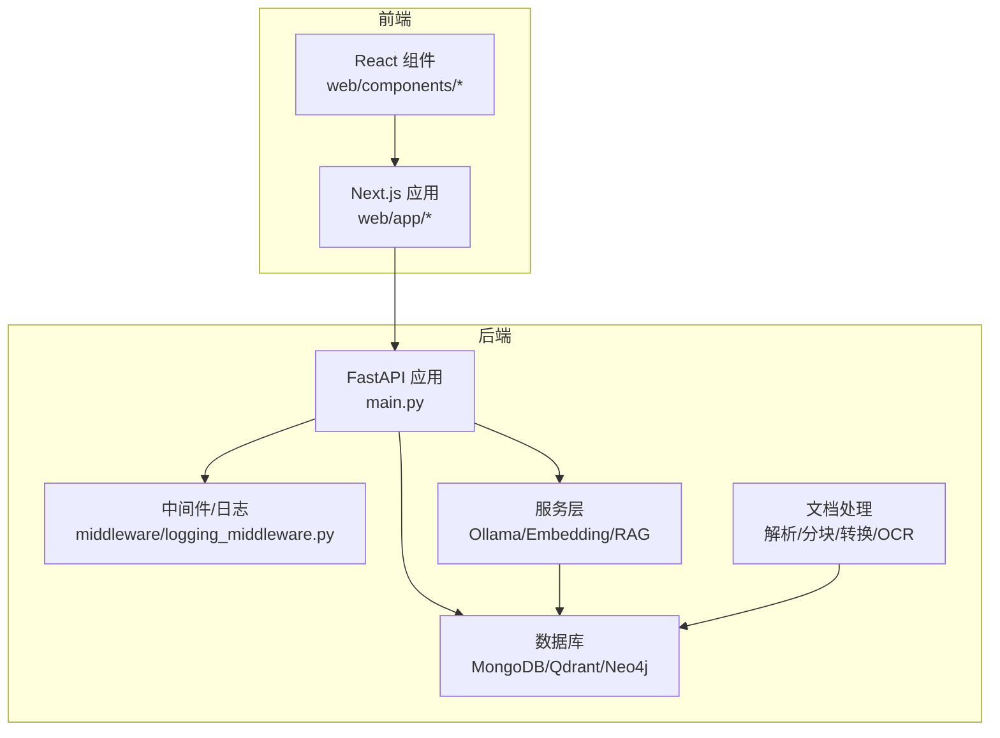
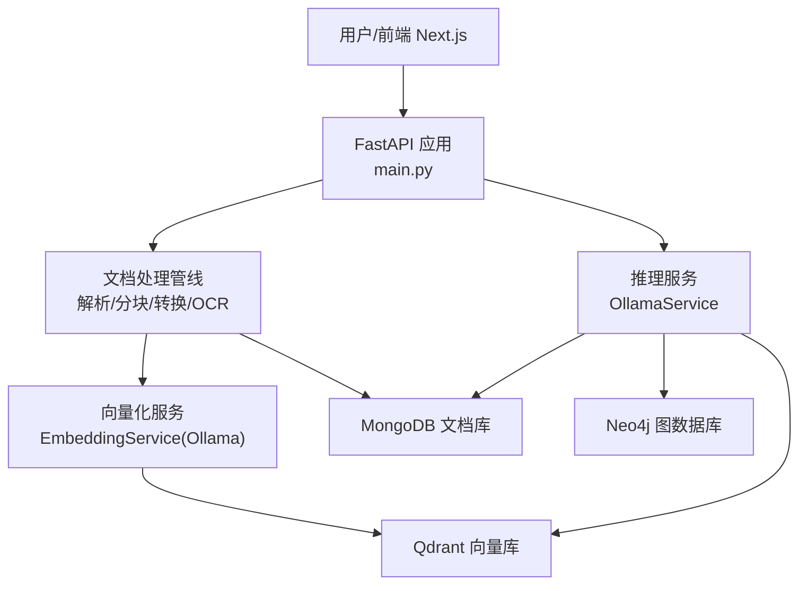
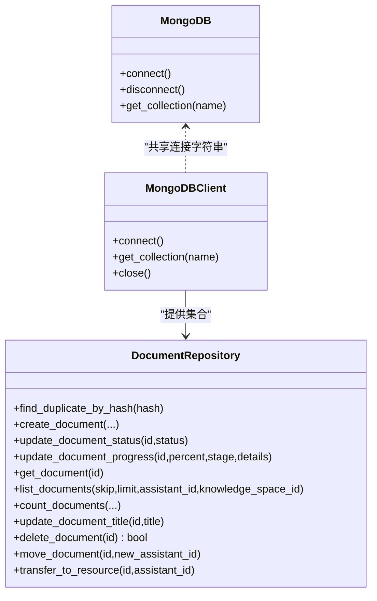
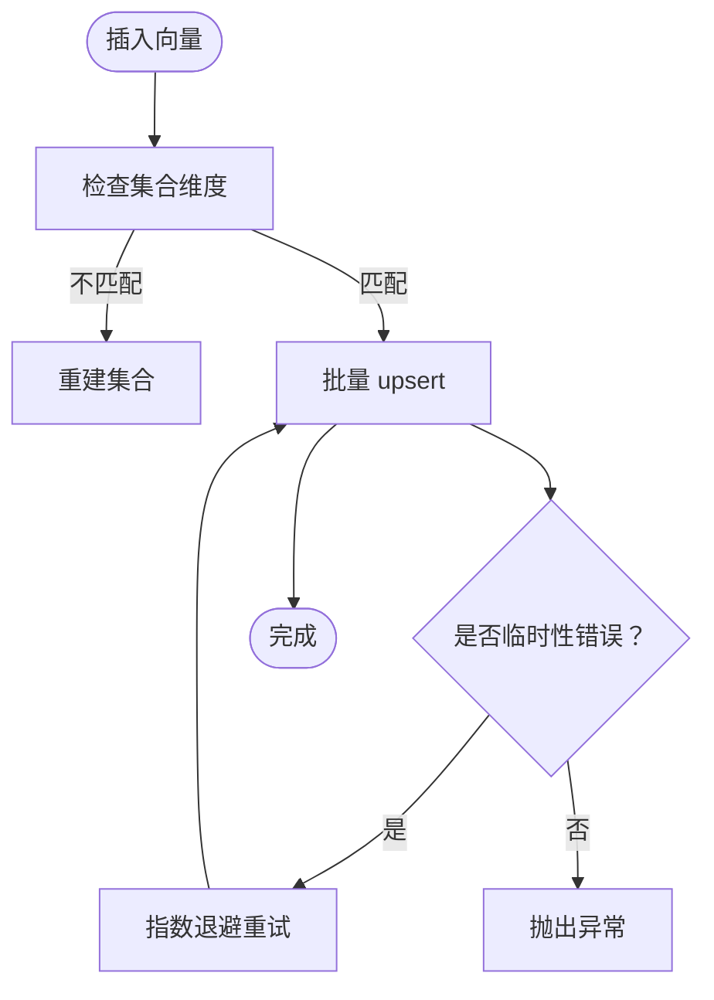
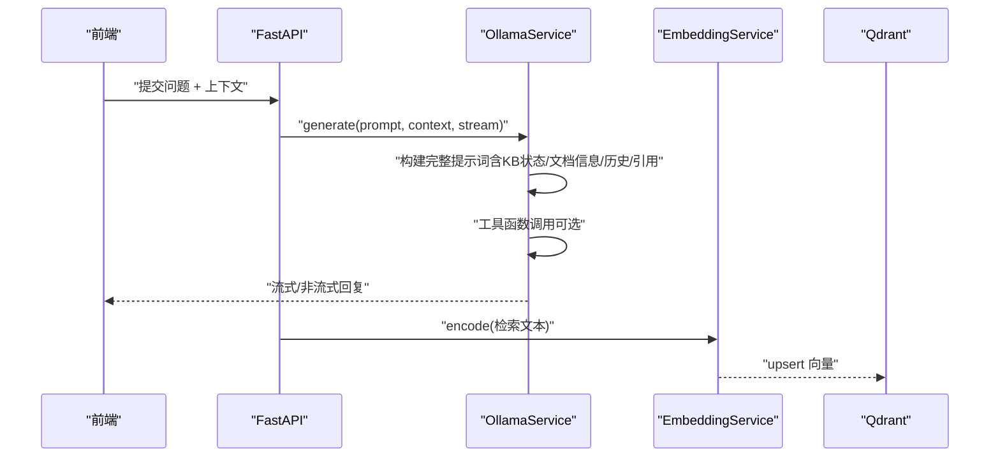
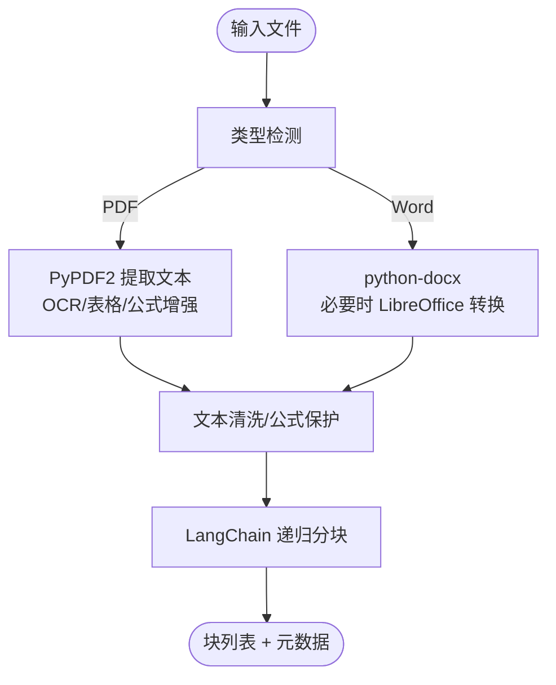
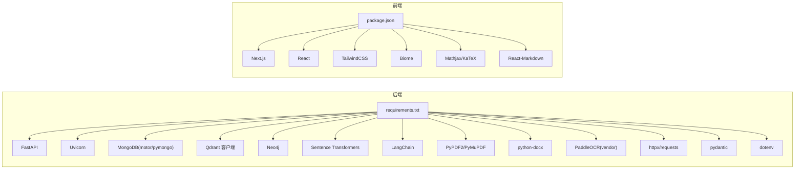

# 技术栈

<cite>
**本文引用的文件**
- [main.py](file://main.py)
- [requirements.txt](file://requirements.txt)
- [docker-compose.yml](file://docker-compose.yml)
- [Dockerfile](file://Dockerfile)
- [database/mongodb.py](file://database/mongodb.py)
- [database/qdrant_client.py](file://database/qdrant_client.py)
- [database/neo4j_client.py](file://database/neo4j_client.py)
- [services/ollama_service.py](file://services/ollama_service.py)
- [embedding/embedding_service.py](file://embedding/embedding_service.py)
- [chunking/langchain/recursive_chunker.py](file://chunking/langchain/recursive_chunker.py)
- [parsers/pdf_parser.py](file://parsers/pdf_parser.py)
- [utils/document_converter.py](file://utils/document_converter.py)
- [web/package.json](file://web/package.json)
- [web/app/layout.tsx](file://web/app/layout.tsx)
- [web/components/ui/Layout.tsx](file://web/components/ui/Layout.tsx)
</cite>

## 目录
1. [引言](#引言)
2. [项目结构](#项目结构)
3. [核心组件](#核心组件)
4. [架构总览](#架构总览)
5. [详细组件分析](#详细组件分析)
6. [依赖分析](#依赖分析)
7. [性能考量](#性能考量)
8. [故障排查指南](#故障排查指南)
9. [结论](#结论)
10. [附录](#附录)

## 引言
本技术栈文档面向 advanced-rag 项目的后端与前端技术选型与集成方案，重点说明：
- 后端技术栈：FastAPI、MongoDB、Qdrant、Neo4j、Ollama、LangChain、PyPDF2、python-docx、PaddleOCR 等
- 前端技术栈：Next.js、React 的应用架构优势
- AI 模型服务集成：Ollama 本地模型推理的优势与流式输出机制
- 文档处理相关第三方库：PDF/Word/OCR/表格/公式等处理链路
- 组件间的集成方案与协作关系
- 版本兼容性与依赖管理策略

## 项目结构
项目采用前后端分离与多模块后端组织方式：
- 后端主入口与路由：FastAPI 应用入口、中间件、静态资源挂载、路由注册
- 数据层：MongoDB（异步/同步）、Qdrant 向量库、Neo4j 图数据库
- 服务层：Ollama 推理服务、Embedding 向量化服务、RAG 服务
- 文档处理：解析器、分块器、转换器、OCR/表格/公式工具
- 前端：Next.js 应用、React 组件、主题与布局

**图表来源**
- [main.py:55-98](file://main.py#L55-L98)
- [database/mongodb.py:92-196](file://database/mongodb.py#L92-L196)
- [database/qdrant_client.py:18-124](file://database/qdrant_client.py#L18-L124)
- [database/neo4j_client.py:6-39](file://database/neo4j_client.py#L6-L39)
- [services/ollama_service.py:9-35](file://services/ollama_service.py#L9-L35)
- [embedding/embedding_service.py:8-45](file://embedding/embedding_service.py#L8-L45)
- [web/app/layout.tsx:16-48](file://web/app/layout.tsx#L16-L48)
- [web/components/ui/Layout.tsx:12-59](file://web/components/ui/Layout.tsx#L12-L59)

**章节来源**
- [main.py:55-98](file://main.py#L55-L98)
- [docker-compose.yml:1-76](file://docker-compose.yml#L1-L76)
- [Dockerfile:1-95](file://Dockerfile#L1-L95)

## 核心组件
- 后端框架：FastAPI，提供高性能 ASGI 服务、自动 OpenAPI 文档、中间件与静态资源挂载
- 数据库：MongoDB（异步 Motor + 同步 PyMongo）、Qdrant（gRPC 优先）、Neo4j（Cypher）
- 向量化与检索：Sentence Transformers（Python 库）+ Ollama Embedding API
- 文档解析与处理：PyPDF2、PyMuPDF、python-docx、PaddleOCR（本地 vendor 安装）、LangChain 分块器
- AI 推理：Ollama 本地模型，支持流式与非流式生成
- 前端：Next.js 16、React 19、TailwindCSS 4、Biome Lint/Format

**章节来源**
- [requirements.txt:1-38](file://requirements.txt#L1-L38)
- [web/package.json:1-40](file://web/package.json#L1-L40)

## 架构总览
后端通过 FastAPI 提供统一 API，文档处理链路将原始文件转为结构化文本与向量，写入 MongoDB 与 Qdrant；Neo4j 用于知识图谱；前端 Next.js 通过 API 与后端交互。

**图表来源**
- [main.py:91-97](file://main.py#L91-L97)
- [services/ollama_service.py:50-93](file://services/ollama_service.py#L50-L93)
- [embedding/embedding_service.py:175-259](file://embedding/embedding_service.py#L175-L259)
- [database/qdrant_client.py:210-335](file://database/qdrant_client.py#L210-L335)
- [database/mongodb.py:315-597](file://database/mongodb.py#L315-L597)
- [database/neo4j_client.py:40-63](file://database/neo4j_client.py#L40-L63)

## 详细组件分析

### 后端框架：FastAPI
- 路由注册：聊天、文档、检索、助手、知识空间、健康检查
- 中间件：CORS 允许跨域、请求日志
- 静态资源：头像、视频封面、资源封面
- 异常处理：全局 JSON 响应与日志记录
- 启动参数：端口、Worker 数量、超时、并发限制

**章节来源**
- [main.py:55-126](file://main.py#L55-L126)

### 数据库：MongoDB
- 异步客户端（Motor）与同步客户端（PyMongo）双栈设计，满足不同场景
- 连接池参数可配置，包含最大/最小连接数、超时、空闲时间
- 文档仓库与分块仓库封装常用 CRUD 与状态更新
- 支持 Docker 容器内 URI 替换（host.docker.internal）

**图表来源**
- [database/mongodb.py:92-196](file://database/mongodb.py#L92-L196)
- [database/mongodb.py:209-313](file://database/mongodb.py#L209-L313)
- [database/mongodb.py:315-597](file://database/mongodb.py#L315-L597)

**章节来源**
- [database/mongodb.py:92-196](file://database/mongodb.py#L92-L196)
- [database/mongodb.py:209-313](file://database/mongodb.py#L209-L313)
- [database/mongodb.py:315-597](file://database/mongodb.py#L315-L597)

### 数据库：Qdrant 向量库
- 优先使用 gRPC（端口 6334）以规避 HTTP/httpx 502 问题，提升性能与稳定性
- 自动健康检查、集合创建/重建（按维度）、批量 upsert 带重试
- 搜索支持过滤、阈值、payload 返回
- 删除支持按 document_id 与 ID 列表

**图表来源**
- [database/qdrant_client.py:210-335](file://database/qdrant_client.py#L210-L335)

**章节来源**
- [database/qdrant_client.py:18-124](file://database/qdrant_client.py#L18-L124)
- [database/qdrant_client.py:210-335](file://database/qdrant_client.py#L210-L335)
- [database/qdrant_client.py:336-414](file://database/qdrant_client.py#L336-L414)

### 数据库：Neo4j 图数据库
- 连接与容器环境适配（localhost → host.docker.internal）
- Cypher 查询封装、实体/关系创建（MERGE）

**章节来源**
- [database/neo4j_client.py:6-39](file://database/neo4j_client.py#L6-L39)
- [database/neo4j_client.py:40-102](file://database/neo4j_client.py#L40-L102)

### AI 模型服务：Ollama 本地推理
- 流式与非流式生成，支持超时与空闲超时控制
- 提示词链构建：系统提示词 + 助手特定提示词 + 知识库状态 + 文档信息 + 对话历史 + 引用内容
- 工具函数调用：XML 格式工具调用，自动注入 assistant_id
- 向量化服务：通过 Ollama Embedding API 获取向量，支持模型名称规范化与检测

**图表来源**
- [services/ollama_service.py:50-93](file://services/ollama_service.py#L50-L93)
- [services/ollama_service.py:94-274](file://services/ollama_service.py#L94-L274)
- [embedding/embedding_service.py:175-259](file://embedding/embedding_service.py#L175-L259)
- [database/qdrant_client.py:210-335](file://database/qdrant_client.py#L210-L335)

**章节来源**
- [services/ollama_service.py:9-35](file://services/ollama_service.py#L9-L35)
- [services/ollama_service.py:50-93](file://services/ollama_service.py#L50-L93)
- [services/ollama_service.py:94-274](file://services/ollama_service.py#L94-L274)
- [services/ollama_service.py:453-638](file://services/ollama_service.py#L453-L638)
- [services/ollama_service.py:639-670](file://services/ollama_service.py#L639-L670)
- [embedding/embedding_service.py:8-45](file://embedding/embedding_service.py#L8-L45)
- [embedding/embedding_service.py:175-259](file://embedding/embedding_service.py#L175-L259)

### 文档处理：解析器与分块器
- PDF 解析：PyPDF2 文本提取 + OCR（PaddleOCR vendor 安装）+ 表格/公式增强
- Word 文档：python-docx + LibreOffice 转换（.doc → .docx）
- 分块器：LangChain 递归分块器（兼容多版本 LangChain）
- 编码与清洗：统一换行、控制字符清理、LaTeX 公式保护

**图表来源**
- [parsers/pdf_parser.py:103-201](file://parsers/pdf_parser.py#L103-L201)
- [utils/document_converter.py:14-40](file://utils/document_converter.py#L14-L40)
- [chunking/langchain/recursive_chunker.py:69-109](file://chunking/langchain/recursive_chunker.py#L69-L109)

**章节来源**
- [parsers/pdf_parser.py:12-208](file://parsers/pdf_parser.py#L12-L208)
- [utils/document_converter.py:11-163](file://utils/document_converter.py#L11-L163)
- [chunking/langchain/recursive_chunker.py:7-110](file://chunking/langchain/recursive_chunker.py#L7-L110)

### 前端技术栈：Next.js 与 React
- Next.js 16、React 19、TypeScript、TailwindCSS 4
- 主题系统：系统跟随/明暗切换，Hydration 安全
- 页面布局：允许/禁止滚动两种模式，适配聊天与内容页
- 生态：Mathjax/KaTeX、Markdown 渲染、语法高亮、GFM 支持

**章节来源**
- [web/package.json:1-40](file://web/package.json#L1-L40)
- [web/app/layout.tsx:16-48](file://web/app/layout.tsx#L16-L48)
- [web/components/ui/Layout.tsx:12-59](file://web/components/ui/Layout.tsx#L12-L59)

## 依赖分析
- 后端依赖：FastAPI、Uvicorn、MongoDB（motor/pymongo）、Qdrant 客户端、Neo4j、Sentence Transformers、LangChain、PyPDF2、PyMuPDF、python-docx、PaddleOCR（本地 vendor 宣传安装）、httpx/requests、pydantic、python-dotenv
- 前端依赖：Next.js、React、TailwindCSS、Biome、Mathjax/KaTeX、Markdown 渲染生态

**图表来源**
- [requirements.txt:1-38](file://requirements.txt#L1-L38)
- [web/package.json:12-35](file://web/package.json#L12-L35)

**章节来源**
- [requirements.txt:1-38](file://requirements.txt#L1-L38)
- [web/package.json:1-40](file://web/package.json#L1-L40)

## 性能考量
- 后端
  - FastAPI：多 worker（生产默认 24）、keep-alive 超时、并发连接限制
  - MongoDB：连接池参数可调，建议按 CPU/IO 与数据库负载平衡
  - Qdrant：gRPC 优先、自动健康检查、维度不匹配自动重建、插入重试
  - Ollama：超时与空闲超时控制、流式输出降低感知延迟
- 前端
  - Next.js App Router + SSR/Streaming，TailwindCSS 减少打包体积
  - React 19 与 Biome 提升开发体验与质量

**章节来源**
- [main.py:128-157](file://main.py#L128-L157)
- [database/mongodb.py:122-151](file://database/mongodb.py#L122-L151)
- [database/qdrant_client.py:66-96](file://database/qdrant_client.py#L66-L96)
- [services/ollama_service.py:32-34](file://services/ollama_service.py#L32-L34)
- [web/package.json:1-40](file://web/package.json#L1-L40)

## 故障排查指南
- 数据库连接
  - MongoDB：检查连接字符串、认证、容器内 URI 替换、连接池参数
  - Qdrant：确认 gRPC 端口、本地 HTTP/HTTPS 与 API Key 警告、集合维度
  - Neo4j：容器内 localhost → host.docker.internal、验证连接
- 文档处理
  - PDF：文本版 vs 扫描版、OCR 依赖、表格/公式提取失败回退
  - Word：LibreOffice 安装与路径、.doc → .docx 转换失败
- 推理与向量化
  - Ollama：模型存在性、embedding 模型检测、超时与空闲超时
  - 向量化：文本截断、模型维度、批量处理与重试
- 前端
  - 主题 Hydration、滚动布局差异、包管理与构建

**章节来源**
- [database/mongodb.py:154-184](file://database/mongodb.py#L154-L184)
- [database/qdrant_client.py:98-123](file://database/qdrant_client.py#L98-L123)
- [database/neo4j_client.py:16-33](file://database/neo4j_client.py#L16-L33)
- [parsers/pdf_parser.py:126-139](file://parsers/pdf_parser.py#L126-L139)
- [utils/document_converter.py:34-39](file://utils/document_converter.py#L34-L39)
- [services/ollama_service.py:205-228](file://services/ollama_service.py#L205-L228)
- [embedding/embedding_service.py:175-229](file://embedding/embedding_service.py#L175-L229)
- [web/app/layout.tsx:22-38](file://web/app/layout.tsx#L22-L38)

## 结论
advanced-rag 采用“FastAPI + 本地 Ollama + 多数据库”的混合架构，兼顾易部署、低延迟与可扩展性。后端通过模块化设计（数据库/服务/解析/分块）清晰解耦，前端以 Next.js/React 提供现代化交互体验。整体技术栈在版本与依赖上强调兼容与可维护，适合中小型团队快速落地与迭代。

## 附录

### 版本兼容性与依赖管理策略
- 后端
  - FastAPI >= 0.104.0、Uvicorn >= 0.24.0、MongoDB(motor/pymongo)、Qdrant 客户端 >= 1.7.0、Neo4j >= 5.15.0、LangChain >= 0.1.0、PyPDF2/PyMuPDF/python-docx、PaddleOCR 通过 vendor 安装
  - Sentence Transformers、httpx/requests、pydantic、python-dotenv
- 前端
  - Next.js 16、React 19、TailwindCSS 4、Biome、Mathjax/KaTeX、React-Markdown
- 容器与镜像
  - Dockerfile 使用 python:3.10-slim，国内镜像源加速，apt/pip 配置，vendor 依赖本地安装，健康检查与默认环境变量

**章节来源**
- [requirements.txt:1-38](file://requirements.txt#L1-L38)
- [web/package.json:1-40](file://web/package.json#L1-L40)
- [Dockerfile:1-95](file://Dockerfile#L1-L95)
- [docker-compose.yml:1-76](file://docker-compose.yml#L1-L76)