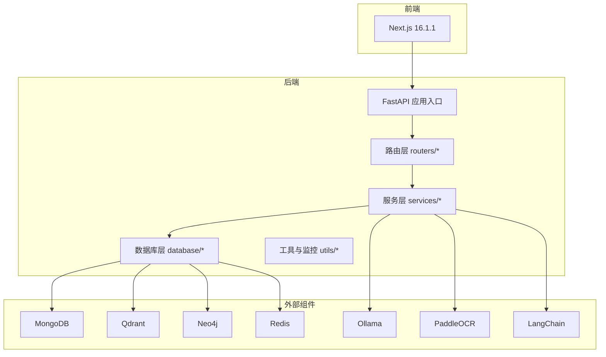
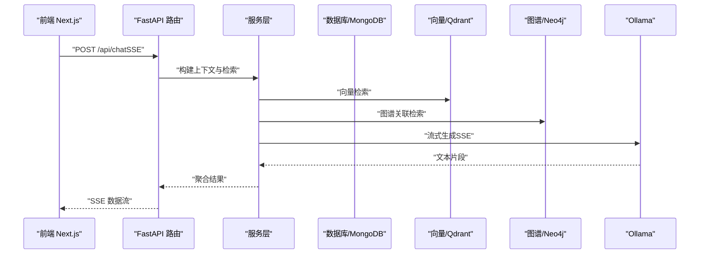
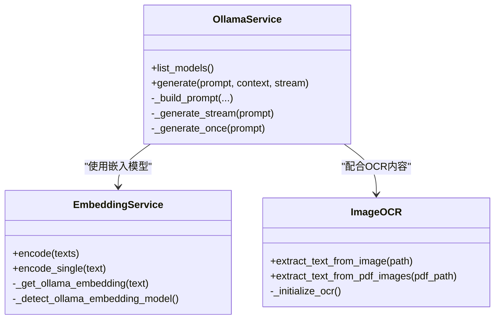
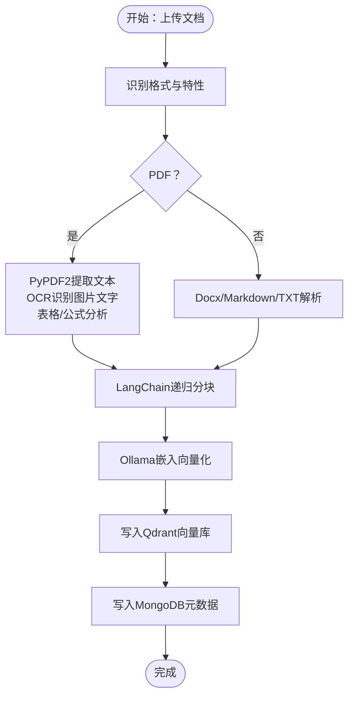
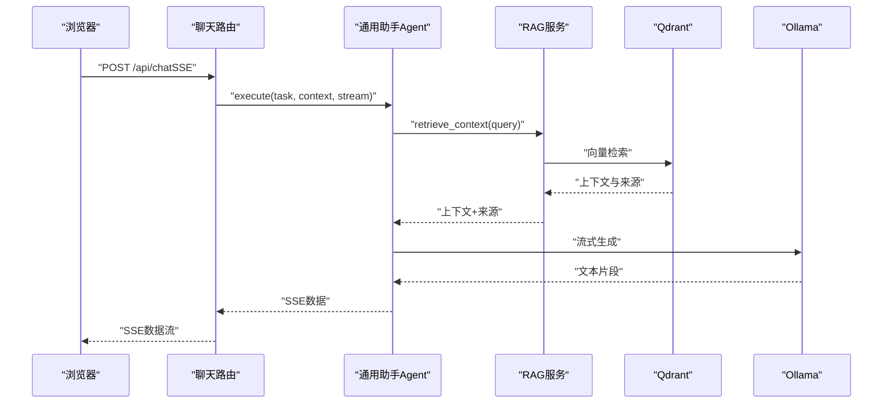
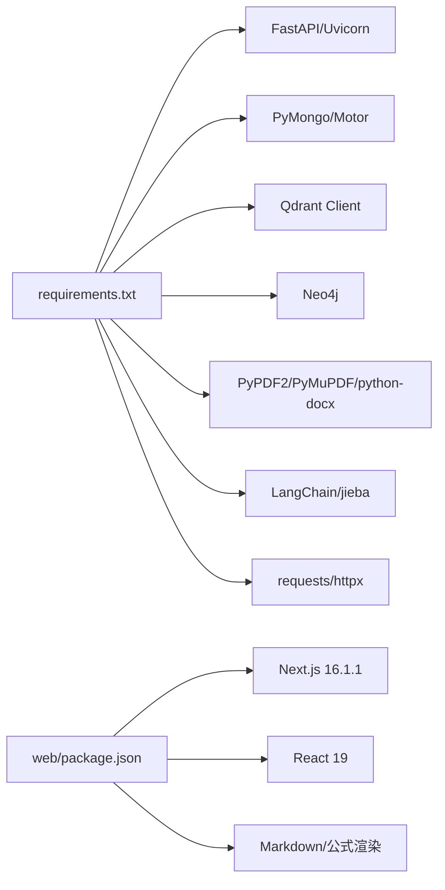

# 技术栈概览

<cite>
**本文档引用的文件**
- [main.py](file://main.py)
- [requirements.txt](file://requirements.txt)
- [README.md](file://README.md)
- [docker-compose.yml](file://docker-compose.yml)
- [web/package.json](file://web/package.json)
- [database/mongodb.py](file://database/mongodb.py)
- [database/qdrant_client.py](file://database/qdrant_client.py)
- [database/neo4j_client.py](file://database/neo4j_client.py)
- [services/ollama_service.py](file://services/ollama_service.py)
- [embedding/embedding_service.py](file://embedding/embedding_service.py)
- [utils/image_ocr.py](file://utils/image_ocr.py)
- [parsers/pdf_parser.py](file://parsers/pdf_parser.py)
- [chunking/langchain/recursive_chunker.py](file://chunking/langchain/recursive_chunker.py)
- [routers/chat.py](file://routers/chat.py)
- [services/rag_service.py](file://services/rag_service.py)
</cite>

## 目录
1. [简介](#简介)
2. [项目结构](#项目结构)
3. [核心组件](#核心组件)
4. [架构总览](#架构总览)
5. [详细组件分析](#详细组件分析)
6. [依赖关系分析](#依赖关系分析)
7. [性能考量](#性能考量)
8. [故障排查指南](#故障排查指南)
9. [结论](#结论)
10. [附录](#附录)

## 简介
Advanced RAG项目是一个“纯开源高级RAG系统”，聚焦于“AI助手对话（含深度研究）+ 知识库检索/入库”。后端基于FastAPI 0.104+构建，提供高性能、类型安全的API；前端采用Next.js 16.1.1 + React构建现代化用户界面。系统通过多数据库与向量/图谱/缓存的组合，实现混合检索与重排、深度研究与知识抽取。

## 项目结构
项目采用“后端Python + 前端Next.js”的双栈分离架构，核心模块包括：
- 后端入口与路由：FastAPI应用入口、路由层、中间件、工具与监控
- 数据层：MongoDB（用户与对话历史）、Qdrant（向量数据库）、Neo4j（知识图谱）、Redis（可选缓存）
- AI与文档处理：Ollama本地推理、sentence-transformers重排、PaddleOCR OCR、LangChain文本分块与语义处理、多格式解析器
- 服务层：RAG检索、嵌入向量化、提示词链、工具函数、模型选择与运行时配置
- 前端：Next.js应用，提供聊天、知识空间、文档管理等界面

**图表来源**
- [main.py:1-171](file://main.py#L1-L171)
- [routers/chat.py:1-800](file://routers/chat.py#L1-L800)
- [database/mongodb.py:1-800](file://database/mongodb.py#L1-L800)
- [database/qdrant_client.py:1-544](file://database/qdrant_client.py#L1-L544)
- [database/neo4j_client.py:1-104](file://database/neo4j_client.py#L1-L104)
- [services/ollama_service.py:1-674](file://services/ollama_service.py#L1-L674)
- [utils/image_ocr.py:1-224](file://utils/image_ocr.py#L1-L224)
- [web/package.json:1-40](file://web/package.json#L1-L40)

**章节来源**
- [README.md:26-54](file://README.md#L26-L54)
- [main.py:55-100](file://main.py#L55-L100)

## 核心组件
- Web框架与路由
  - FastAPI 0.104+：高性能ASGI框架，提供类型安全的API与自动生成文档
  - 路由注册：聊天、文档、检索、知识空间、设置、健康检查等
- 数据库与缓存
  - MongoDB：用户与对话历史存储，异步/同步客户端封装
  - Qdrant：向量数据库，支持gRPC连接与维度自动适配
  - Neo4j：知识图谱存储，Cypher查询封装
  - Redis：可选缓存（Compose中提供）
- AI与模型
  - Ollama：本地模型推理，支持流式与非流式生成
  - sentence-transformers：重排模型（通过BGE等）
- 文档与文本处理
  - PaddleOCR：图片与扫描版PDF OCR
  - LangChain：文本分块（递归/语义/混合）
  - 多格式解析：PDF、Word、Markdown、TXT等
- 前端
  - Next.js 16.1.1 + React：现代化UI与SSR/SSG支持

**章节来源**
- [requirements.txt:4-42](file://requirements.txt#L4-L42)
- [README.md:28-44](file://README.md#L28-L44)
- [web/package.json:12-26](file://web/package.json#L12-L26)

## 架构总览
后端通过FastAPI统一对外提供REST接口，内部通过服务层协调数据库、向量与图谱、模型与OCR等能力。前端Next.js通过SSE与后端交互，实现流式对话与深度研究结果渲染。

**图表来源**
- [routers/chat.py:623-760](file://routers/chat.py#L623-L760)
- [services/rag_service.py:34-266](file://services/rag_service.py#L34-L266)
- [services/ollama_service.py:50-93](file://services/ollama_service.py#L50-L93)
- [database/qdrant_client.py:336-414](file://database/qdrant_client.py#L336-L414)
- [database/neo4j_client.py:40-101](file://database/neo4j_client.py#L40-L101)

## 详细组件分析

### 后端技术栈与选择理由
- FastAPI 0.104+
  - 优点：类型安全、自动生成OpenAPI/Swagger、高性能、SSE友好
  - 集成：CORS、静态文件、健康检查、全局异常处理
- MongoDB
  - 优点：灵活文档模型、异步驱动Motor、适合对话与元数据存储
  - 集成：连接池配置、Ping校验、请求级兜底重连
- Qdrant
  - 优点：高性能向量检索、gRPC连接、自动维度适配与集合重建
  - 集成：重试机制、维度不匹配自动修复、滚动读取
- Neo4j
  - 优点：图谱建模能力强、Cypher查询直观
  - 集成：容器内URI自动修正、连接校验、会话执行
- Redis
  - 用途：可选缓存（Compose提供），提升热点数据访问性能

**章节来源**
- [main.py:55-127](file://main.py#L55-L127)
- [database/mongodb.py:92-195](file://database/mongodb.py#L92-L195)
- [database/qdrant_client.py:18-123](file://database/qdrant_client.py#L18-L123)
- [database/neo4j_client.py:6-39](file://database/neo4j_client.py#L6-L39)
- [docker-compose.yml:58-75](file://docker-compose.yml#L58-L75)

### 前端技术栈与选择理由
- Next.js 16.1.1 + React
  - 优点：SSR/SSG、类型安全（TS）、生态完善、SEO友好
  - 集成：主题切换、SSE流式渲染、Markdown/公式渲染、MathJax/KaTeX
- UI与组件
  - React组件：聊天面板、消息渲染、文档上传、通知等
  - 第三方库：react-markdown、rehype-*、katex、mathjax等

**章节来源**
- [web/package.json:12-26](file://web/package.json#L12-L26)
- [web/app/layout.tsx:16-49](file://web/app/layout.tsx#L16-L49)

### AI模型集成
- Ollama
  - 本地推理：支持流式/非流式生成、超时与重试、容器内URI修正
  - 模型管理：模型列表、自动检测embedding模型、维度截断与重试
- sentence-transformers
  - 用途：重排（BGE等）与向量检索结合，提升召回质量
- PaddleOCR
  - 用途：扫描版PDF与图片OCR，支持临时文件提取与批量识别

**图表来源**
- [services/ollama_service.py:9-674](file://services/ollama_service.py#L9-L674)
- [embedding/embedding_service.py:8-333](file://embedding/embedding_service.py#L8-L333)
- [utils/image_ocr.py:7-224](file://utils/image_ocr.py#L7-L224)

**章节来源**
- [services/ollama_service.py:12-35](file://services/ollama_service.py#L12-L35)
- [embedding/embedding_service.py:11-44](file://embedding/embedding_service.py#L11-L44)
- [utils/image_ocr.py:15-37](file://utils/image_ocr.py#L15-L37)

### 文档处理与文本分块
- 多格式解析
  - PDF：PyPDF2文本提取 + PaddleOCR图片OCR + 表格/公式分析
  - Word/Markdown/TXT：python-docx/内置解析
- 文本分块
  - LangChain递归分块器：支持中英分隔符与层级切分
  - 混合分块：代码/公式与语义分块结合
- 知识抽取与入库
  - 通过RAG服务与嵌入向量写入Qdrant，同时维护MongoDB文档元数据

**图表来源**
- [parsers/pdf_parser.py:103-217](file://parsers/pdf_parser.py#L103-L217)
- [chunking/langchain/recursive_chunker.py:69-109](file://chunking/langchain/recursive_chunker.py#L69-L109)
- [embedding/embedding_service.py:292-318](file://embedding/embedding_service.py#L292-L318)
- [database/qdrant_client.py:210-335](file://database/qdrant_client.py#L210-L335)
- [database/mongodb.py:338-406](file://database/mongodb.py#L338-L406)

**章节来源**
- [parsers/pdf_parser.py:19-102](file://parsers/pdf_parser.py#L19-L102)
- [chunking/langchain/recursive_chunker.py:10-38](file://chunking/langchain/recursive_chunker.py#L10-L38)
- [embedding/embedding_service.py:175-291](file://embedding/embedding_service.py#L175-L291)

### 对话与检索流程
- SSE流式对话
  - 前端发起POST /api/chat，后端通过Agent执行，边检索边生成
  - 支持客户端断开检测，自动停止流式输出
- 深度研究
  - 多Agent协作，返回HTML结果，支持对话历史与来源标注

**图表来源**
- [routers/chat.py:623-760](file://routers/chat.py#L623-L760)
- [services/rag_service.py:34-266](file://services/rag_service.py#L34-L266)
- [database/qdrant_client.py:336-414](file://database/qdrant_client.py#L336-L414)
- [services/ollama_service.py:453-638](file://services/ollama_service.py#L453-L638)

**章节来源**
- [routers/chat.py:623-760](file://routers/chat.py#L623-L760)
- [services/rag_service.py:268-317](file://services/rag_service.py#L268-L317)

## 依赖关系分析
- Python后端依赖
  - Web框架：FastAPI、Uvicorn
  - 数据库：PyMongo/Motor、Qdrant Client、Neo4j
  - 文档与文本：PyPDF2、PyMuPDF、python-docx、LangChain、jieba
  - 其他：requests、httpx、python-dotenv、pytest等
- 前端依赖
  - Next.js 16.1.1、React 19、react-markdown、KaTeX/MathJax、highlight等

**图表来源**
- [requirements.txt:4-42](file://requirements.txt#L4-L42)
- [web/package.json:12-26](file://web/package.json#L12-L26)

**章节来源**
- [requirements.txt:1-42](file://requirements.txt#L1-L42)
- [web/package.json:1-40](file://web/package.json#L1-L40)

## 性能考量
- 连接与并发
  - MongoDB连接池参数可调（最大池大小、最小池大小、空闲超时等）
  - Uvicorn生产环境多worker、keep-alive超时与并发连接限制
- 向量检索
  - Qdrant优先使用gRPC，自动维度适配与重试；动态检索参数（prefetch_k/final_k）按查询特征调整
- 模型与IO
  - Ollama超时与重试策略；嵌入向量化截断与维度检测；OCR图片临时文件清理
- 前端体验
  - SSE流式渲染，断开检测；Markdown/公式渲染按需加载

**章节来源**
- [database/mongodb.py:122-151](file://database/mongodb.py#L122-L151)
- [main.py:142-171](file://main.py#L142-L171)
- [database/qdrant_client.py:66-96](file://database/qdrant_client.py#L66-L96)
- [services/rag_service.py:11-33](file://services/rag_service.py#L11-L33)
- [services/ollama_service.py:32-34](file://services/ollama_service.py#L32-L34)
- [embedding/embedding_service.py:188-193](file://embedding/embedding_service.py#L188-L193)
- [utils/image_ocr.py:172-186](file://utils/image_ocr.py#L172-L186)

## 故障排查指南
- 数据库连接失败
  - MongoDB：检查URI/主机/端口/认证；启动时Ping校验；请求级兜底重连
  - Qdrant：gRPC连接、自动维度重建、重试与超时；容器内localhost替换
  - Neo4j：容器内URI修正、连接校验
- 模型与嵌入
  - Ollama模型未找到：检查模型名称与标签；自动检测embedding模型
  - 嵌入超上下文：字符截断与重试；维度不匹配自动重建
- OCR与解析
  - PaddleOCR未安装：延迟初始化与错误返回；PDF图片OCR依赖PyMuPDF
  - PDF解析：文本版与扫描版区分，OCR失败不阻断主流程
- 前端SSE
  - 断开检测：客户端断开自动停止流式输出，避免资源浪费

**章节来源**
- [database/mongodb.py:176-184](file://database/mongodb.py#L176-L184)
- [database/qdrant_client.py:98-123](file://database/qdrant_client.py#L98-L123)
- [database/neo4j_client.py:20-33](file://database/neo4j_client.py#L20-L33)
- [services/ollama_service.py:26-35](file://services/ollama_service.py#L26-L35)
- [embedding/embedding_service.py:277-280](file://embedding/embedding_service.py#L277-L280)
- [utils/image_ocr.py:31-37](file://utils/image_ocr.py#L31-L37)
- [routers/chat.py:692-724](file://routers/chat.py#L692-L724)

## 结论
Advanced RAG项目通过“FastAPI + Next.js”的现代技术栈，结合MongoDB、Qdrant、Neo4j与Ollama等组件，实现了从文档入库、向量化、图谱建模到流式对话与深度研究的完整闭环。其设计强调可扩展性（多Agent协作、可插拔检索）、可观测性（日志与健康检查）与易用性（SSE流式、自动模型检测与维度适配）。建议在生产环境中合理配置连接池与超时参数，并根据业务规模选择合适的向量维度与检索参数。

## 附录

### 技术栈版本与兼容性
- 后端
  - FastAPI >= 0.104.0
  - MongoDB：Motor + PyMongo
  - Qdrant Client >= 1.7.0
  - Neo4j >= 5.15.0
  - sentence-transformers >= 2.2.0
  - LangChain >= 0.1.0
- 前端
  - Next.js 16.1.1
  - React 19
  - react-markdown、KaTeX/MathJax、highlight等

**章节来源**
- [requirements.txt:5-34](file://requirements.txt#L5-L34)
- [web/package.json:16-18](file://web/package.json#L16-L18)

### 部署与运行
- Docker Compose
  - MongoDB、Qdrant、Neo4j、Redis一键启动
- 环境变量
  - MONGODB_URI/QDRANT_URL/NEO4J_URI/OLLAMA_BASE_URL等
- 启动方式
  - Python入口或Uvicorn命令；Next.js开发/生产模式

**章节来源**
- [docker-compose.yml:1-96](file://docker-compose.yml#L1-L96)
- [README.md:125-166](file://README.md#L125-L166)
- [main.py:129-171](file://main.py#L129-L171)