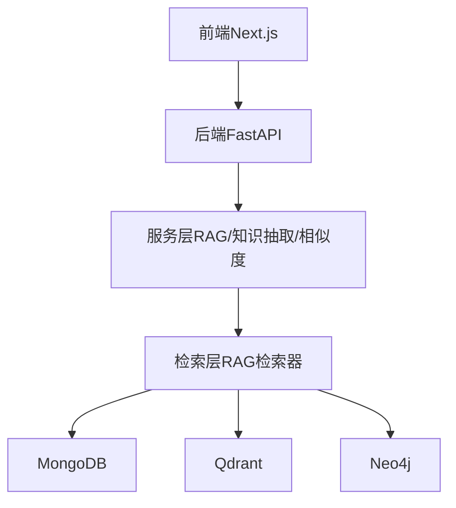
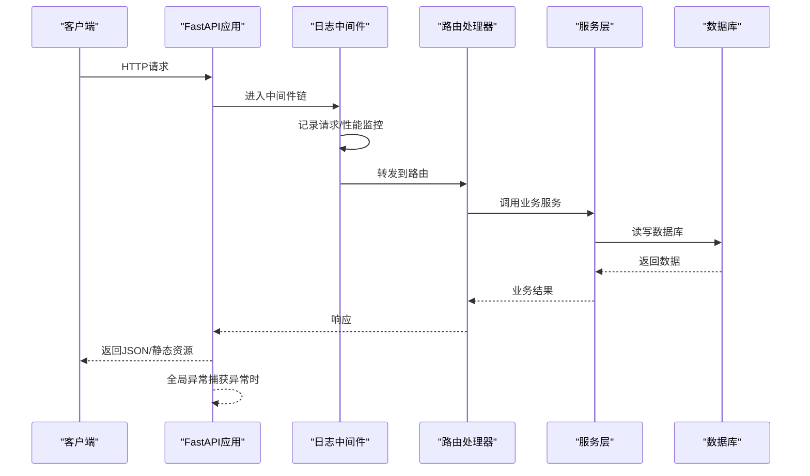
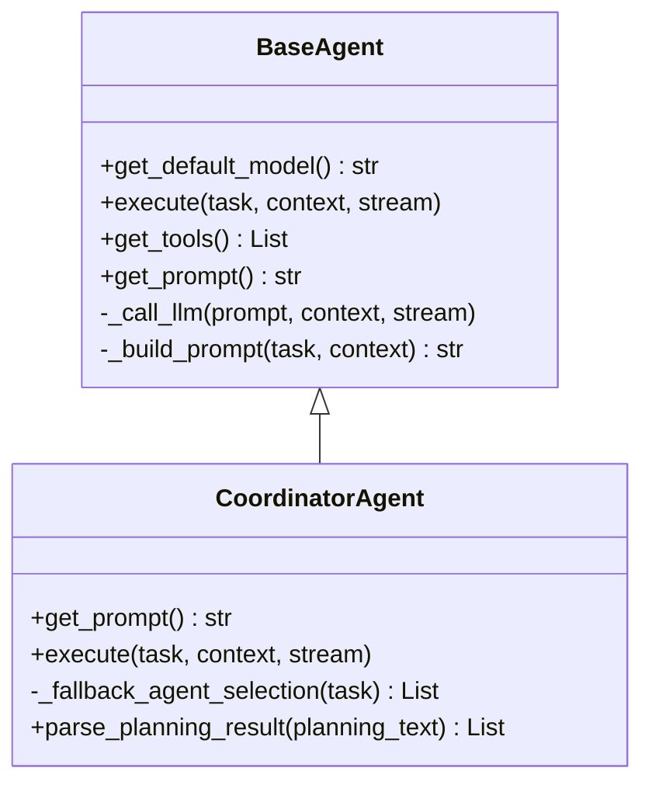
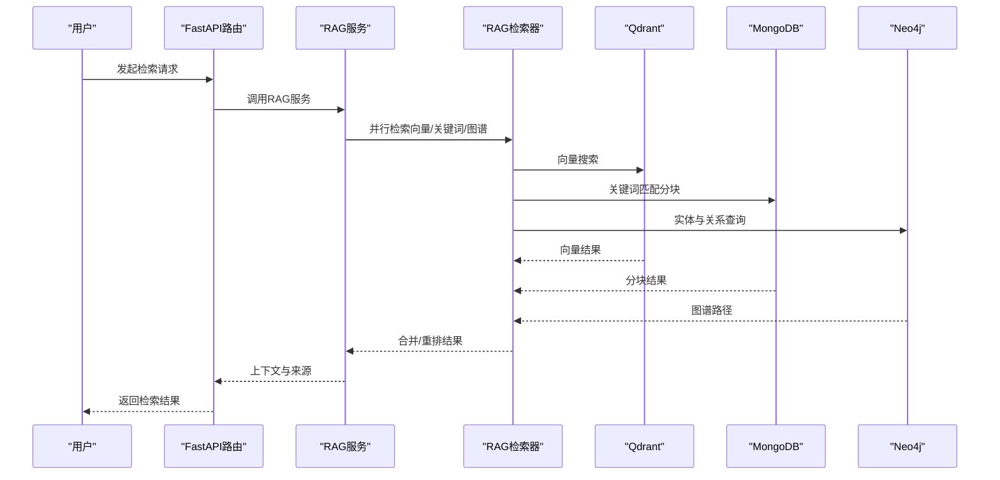
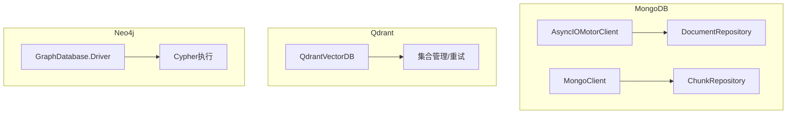
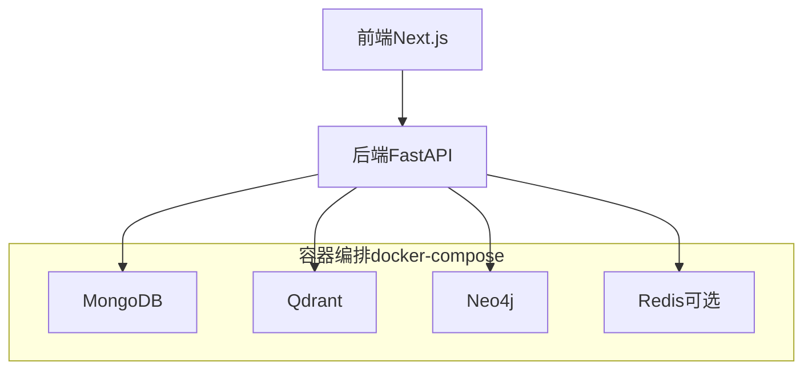
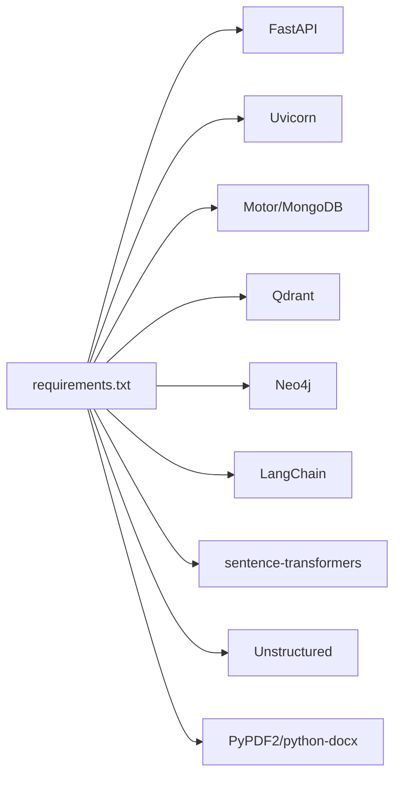

# 架构设计理念

<cite>
**本文引用的文件**
- [main.py](file://main.py)
- [README.md](file://README.md)
- [docker-compose.yml](file://docker-compose.yml)
- [requirements.txt](file://requirements.txt)
- [agents/base/base_agent.py](file://agents/base/base_agent.py)
- [agents/coordinator/coordinator_agent.py](file://agents/coordinator/coordinator_agent.py)
- [services/rag_service.py](file://services/rag_service.py)
- [database/mongodb.py](file://database/mongodb.py)
- [database/qdrant_client.py](file://database/qdrant_client.py)
- [database/neo4j_client.py](file://database/neo4j_client.py)
- [retrieval/rag_retriever.py](file://retrieval/rag_retriever.py)
- [middleware/logging_middleware.py](file://middleware/logging_middleware.py)
- [web/package.json](file://web/package.json)
- [web/Dockerfile](file://web/Dockerfile)
</cite>

## 目录
1. [引言](#引言)
2. [项目结构](#项目结构)
3. [核心组件](#核心组件)
4. [架构总览](#架构总览)
5. [详细组件分析](#详细组件分析)
6. [依赖分析](#依赖分析)
7. [性能考量](#性能考量)
8. [故障排查指南](#故障排查指南)
9. [结论](#结论)
10. [附录](#附录)

## 引言
本项目以“纯开源高级RAG系统”为目标，围绕“AI助手对话（含深度研究/深度思考）”与“知识库检索/入库”两大能力展开，采用前后端分离架构：后端基于FastAPI提供RESTful API，前端采用Next.js构建交互界面。系统通过模块化设计与分层架构实现高内聚、低耦合，结合多数据库协同（MongoDB文档存储、Qdrant向量数据库、Neo4j图数据库）与Agent协作机制，形成可扩展、可演进的检索增强生成（RAG）平台。

## 项目结构
项目采用清晰的分层与模块化组织：
- 后端入口与路由：FastAPI应用入口、路由注册、中间件与异常处理
- 业务层：RAG服务、知识抽取、查询理解、相似度计算等
- 数据层：MongoDB（文档与分块）、Qdrant（向量）、Neo4j（图谱）
- 检索层：RAG检索器（向量/关键词/图谱混合检索与重排）
- Agent系统：基类抽象、专家Agent分工、协调Agent调度与工作流编排
- 前端：Next.js应用，提供聊天、知识空间、文档管理等界面
- 部署：Docker Compose统一编排数据库与服务依赖

```mermaid
graph TB
subgraph "前端Next.js"
WEB["web/前端应用"]
end
subgraph "后端FastAPI"
MAIN["main.py应用入口"]
ROUTERS["routers/*路由"]
SERVICES["services/*业务服务"]
RETRIEVAL["retrieval/*检索"]
AGENTS["agents/*Agent系统"]
DATABASE["database/*数据库客户端"]
MIDDLEWARE["middleware/*中间件"]
end
subgraph "数据库与外部服务"
MONGO["MongoDB"]
QDRANT["Qdrant"]
NEO4J["Neo4j"]
EMBED["嵌入模型/Ollama"]
end
WEB --> MAIN
MAIN --> ROUTERS
ROUTERS --> SERVICES
SERVICES --> RETRIEVAL
SERVICES --> DATABASE
RETRIEVAL --> DATABASE
RETRIEVAL --> EMBED
DATABASE --> MONGO
DATABASE --> QDRANT
DATABASE --> NEO4J
AGENTS --> SERVICES
MAIN --> MIDDLEWARE
```

图表来源
- [main.py:55-104](file://main.py#L55-L104)
- [README.md:55-70](file://README.md#L55-L70)
- [docker-compose.yml:1-96](file://docker-compose.yml#L1-L96)

章节来源
- [README.md:55-70](file://README.md#L55-L70)
- [main.py:55-104](file://main.py#L55-L104)

## 核心组件
- 后端框架与中间件：FastAPI应用、CORS、静态文件挂载、请求日志中间件、全局异常处理
- 数据库层：MongoDB（异步/同步客户端、文档与分块仓库）、Qdrant（向量客户端封装、集合管理、重试与gRPC优化）、Neo4j（图谱客户端、Cypher执行）
- 检索层：RAG检索器（向量/关键词/图谱混合检索、动态k裁剪、重排）
- 服务层：RAG服务（检索上下文、邻居扩展、上下文拼接与token预算控制）
- Agent系统：基类抽象、协调Agent（任务规划与专家选择）、专家Agent（文档检索、公式分析、代码分析、概念解释、示例生成、习题、科学计算、总结）
- 前端：Next.js应用（聊天、知识空间、文档管理、UI组件）

章节来源
- [main.py:55-127](file://main.py#L55-L127)
- [middleware/logging_middleware.py:8-52](file://middleware/logging_middleware.py#L8-L52)
- [database/mongodb.py:92-204](file://database/mongodb.py#L92-L204)
- [database/qdrant_client.py:18-123](file://database/qdrant_client.py#L18-L123)
- [database/neo4j_client.py:6-40](file://database/neo4j_client.py#L6-L40)
- [retrieval/rag_retriever.py:17-138](file://retrieval/rag_retriever.py#L17-L138)
- [services/rag_service.py:8-67](file://services/rag_service.py#L8-L67)
- [agents/base/base_agent.py:8-56](file://agents/base/base_agent.py#L8-L56)
- [agents/coordinator/coordinator_agent.py:7-54](file://agents/coordinator/coordinator_agent.py#L7-L54)

## 架构总览
系统采用前后端分离与多数据库协同的分层架构：
- 展示层：Next.js前端，负责用户交互与页面渲染
- API层：FastAPI后端，提供REST接口、中间件与异常处理
- 业务层：RAG服务、知识抽取、查询理解、相似度计算等
- 检索层：RAG检索器，融合向量、关键词与图谱检索，并进行重排
- 数据层：MongoDB存储文档与分块元数据，Qdrant存储向量，Neo4j存储知识图谱
- Agent层：多Agent协作，协调Agent负责任务规划，专家Agent负责具体任务执行

图表来源
- [README.md:26-54](file://README.md#L26-L54)
- [main.py:90-99](file://main.py#L90-L99)
- [retrieval/rag_retriever.py:17-138](file://retrieval/rag_retriever.py#L17-L138)
- [database/mongodb.py:92-204](file://database/mongodb.py#L92-L204)
- [database/qdrant_client.py:18-123](file://database/qdrant_client.py#L18-L123)
- [database/neo4j_client.py:6-40](file://database/neo4j_client.py#L6-L40)

## 详细组件分析

### 后端服务架构（FastAPI）
- 应用入口与生命周期：通过生命周期钩子进行数据库连接与健康检查
- 中间件体系：CORS跨域、静态文件挂载（头像/缩略图/封面）、请求日志中间件
- 异常处理：全局异常捕获，统一返回JSON响应并记录日志
- 路由注册：按模块注册聊天、文档、检索、助手、知识空间、设置与健康检查

图表来源
- [main.py:55-127](file://main.py#L55-L127)
- [middleware/logging_middleware.py:8-52](file://middleware/logging_middleware.py#L8-L52)

章节来源
- [main.py:55-127](file://main.py#L55-L127)
- [middleware/logging_middleware.py:8-52](file://middleware/logging_middleware.py#L8-L52)

### Agent协作系统
- Agent基类抽象：统一模型选择、提示词构建、工具与执行接口
- 协调Agent：分析用户问题，智能选择所需专家Agent，给出任务分配与理由
- 专家Agent：针对具体任务（文档检索、公式分析、代码分析、概念解释、示例生成、习题、科学计算、总结）执行
- 工作流编排：协调Agent输出规划结果，后续由工作流编排器驱动专家Agent执行

图表来源
- [agents/base/base_agent.py:8-122](file://agents/base/base_agent.py#L8-L122)
- [agents/coordinator/coordinator_agent.py:7-54](file://agents/coordinator/coordinator_agent.py#L7-L54)

章节来源
- [agents/base/base_agent.py:8-122](file://agents/base/base_agent.py#L8-L122)
- [agents/coordinator/coordinator_agent.py:7-54](file://agents/coordinator/coordinator_agent.py#L7-L54)

### RAG服务与检索流程
- RAG服务：动态检索参数（prefetch_k/final_k）、并行检索（知识空间集合）、邻居扩展、上下文拼接与token预算控制、回退策略
- RAG检索器：向量检索（Qdrant）、关键词检索（MongoDB）、图谱检索（Neo4j）、结果合并与重排（CrossEncoder）
- 数据一致性：通过MongoDB文档与分块仓库、Qdrant集合与Payload、Neo4j实体与关系维护

图表来源
- [services/rag_service.py:34-126](file://services/rag_service.py#L34-L126)
- [retrieval/rag_retriever.py:89-138](file://retrieval/rag_retriever.py#L89-L138)
- [database/qdrant_client.py:336-414](file://database/qdrant_client.py#L336-L414)
- [database/mongodb.py:793-806](file://database/mongodb.py#L793-L806)
- [database/neo4j_client.py:40-63](file://database/neo4j_client.py#L40-L63)

章节来源
- [services/rag_service.py:34-126](file://services/rag_service.py#L34-L126)
- [retrieval/rag_retriever.py:89-138](file://retrieval/rag_retriever.py#L89-L138)

### 数据库架构设计
- MongoDB：异步/同步客户端、文档与分块仓库、连接池参数优化、健康检查与依赖注入
- Qdrant：gRPC优先、连接复用、自动集合创建/重建、插入重试与维度自适应、滚动查询
- Neo4j：容器环境兼容、连接校验、Cypher执行、实体与关系创建

图表来源
- [database/mongodb.py:92-204](file://database/mongodb.py#L92-L204)
- [database/qdrant_client.py:18-123](file://database/qdrant_client.py#L18-L123)
- [database/neo4j_client.py:6-40](file://database/neo4j_client.py#L6-L40)

章节来源
- [database/mongodb.py:92-204](file://database/mongodb.py#L92-L204)
- [database/qdrant_client.py:18-123](file://database/qdrant_client.py#L18-L123)
- [database/neo4j_client.py:6-40](file://database/neo4j_client.py#L6-L40)

### 微服务化与容器化部署
- 微服务化思路：后端以模块化服务为核心，数据库与外部服务（Qdrant/Neo4j/Ollama）作为独立依赖，便于横向扩展与替换
- 容器化策略：Docker Compose编排MongoDB/Qdrant/Neo4j/Redis，后端与前端分别构建镜像并暴露端口，支持一键部署与弹性扩缩容

图表来源
- [docker-compose.yml:1-96](file://docker-compose.yml#L1-L96)
- [web/Dockerfile:1-39](file://web/Dockerfile#L1-L39)

章节来源
- [docker-compose.yml:1-96](file://docker-compose.yml#L1-L96)
- [web/Dockerfile:1-39](file://web/Dockerfile#L1-L39)

## 依赖分析
- 后端依赖：FastAPI、Uvicorn、MongoDB（Motor/pymongo）、Qdrant、Neo4j、LangChain、sentence-transformers、PyPDF2/python-docx/unstructured等
- 前端依赖：Next.js、React、MathJax、react-markdown、TailwindCSS等
- 运行时开关：通过运行时配置控制重排与图谱检索开关，实现模块化启用/降级

图表来源
- [requirements.txt:4-42](file://requirements.txt#L4-L42)

章节来源
- [requirements.txt:4-42](file://requirements.txt#L4-L42)

## 性能考量
- 连接池与并发：MongoDB连接池参数、Qdrant gRPC优先与连接复用、Uvicorn多worker与keep-alive超时
- 异步与并行：RAG检索器并行执行向量/关键词/图谱检索，RAG服务异步gather聚合
- 动态参数与裁剪：基于查询特征动态调整prefetch_k/final_k，重排后在线自适应裁剪k
- Token预算与截断：上下文拼接时估算与截断token，避免prompt过大
- 日志与监控：中间件记录慢请求与错误，辅助定位性能瓶颈

章节来源
- [database/mongodb.py:122-151](file://database/mongodb.py#L122-L151)
- [database/qdrant_client.py:66-96](file://database/qdrant_client.py#L66-L96)
- [main.py:144-171](file://main.py#L144-L171)
- [retrieval/rag_retriever.py:139-167](file://retrieval/rag_retriever.py#L139-L167)
- [services/rag_service.py:251-261](file://services/rag_service.py#L251-L261)
- [middleware/logging_middleware.py:8-52](file://middleware/logging_middleware.py#L8-L52)

## 故障排查指南
- 数据库连接失败：MongoDB连接失败时抛出异常并提示检查配置；Qdrant连接失败自动降级；Neo4j连接失败记录错误
- 检索异常：RAG检索失败时可选择回退到不使用上下文继续处理
- 日志与监控：中间件记录慢请求与错误码，便于定位问题
- 健康检查：后端健康检查端点与Compose健康检查共同保障服务可用性

章节来源
- [database/mongodb.py:168-184](file://database/mongodb.py#L168-L184)
- [database/qdrant_client.py:97-123](file://database/qdrant_client.py#L97-L123)
- [database/neo4j_client.py:16-33](file://database/neo4j_client.py#L16-L33)
- [services/rag_service.py:294-312](file://services/rag_service.py#L294-L312)
- [middleware/logging_middleware.py:33-50](file://middleware/logging_middleware.py#L33-L50)
- [docker-compose.yml:18-24](file://docker-compose.yml#L18-L24)

## 结论
本项目通过前后端分离、模块化与分层架构，结合多数据库协同与Agent协作机制，构建了具备高扩展性与可演进性的高级RAG系统。FastAPI提供高性能API与中间件生态，RAG检索器融合向量/关键词/图谱检索并支持重排，数据库层以连接池与gRPC优化保障高并发稳定性，容器化部署简化运维与弹性扩缩容。整体设计在功能完备性与工程可维护性之间取得平衡，适合持续演进与规模化部署。

## 附录
- 前端技术栈：Next.js、React、TailwindCSS、MathJax、react-markdown等
- 部署建议：使用Docker Compose编排数据库与服务，后端与前端分别构建镜像，按需启用Redis缓存

章节来源
- [web/package.json:12-39](file://web/package.json#L12-L39)
- [web/Dockerfile:1-39](file://web/Dockerfile#L1-L39)
- [README.md:26-54](file://README.md#L26-L54)