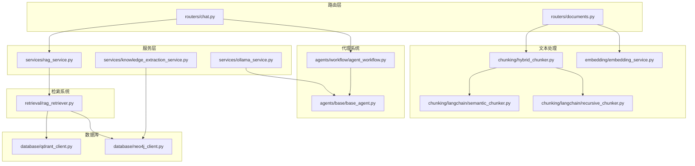
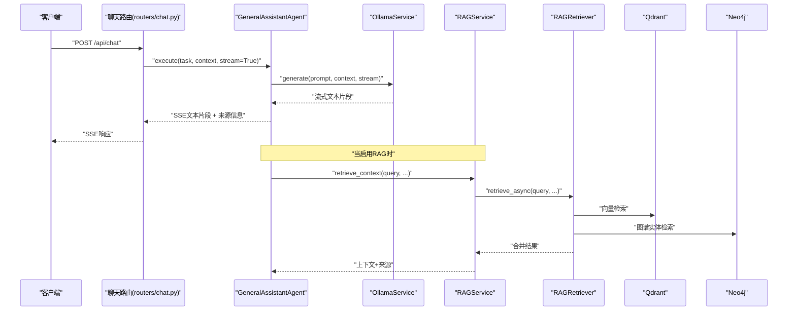
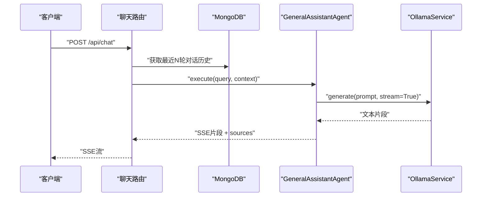
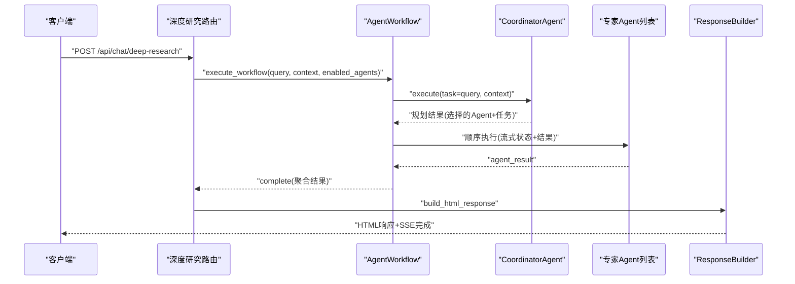
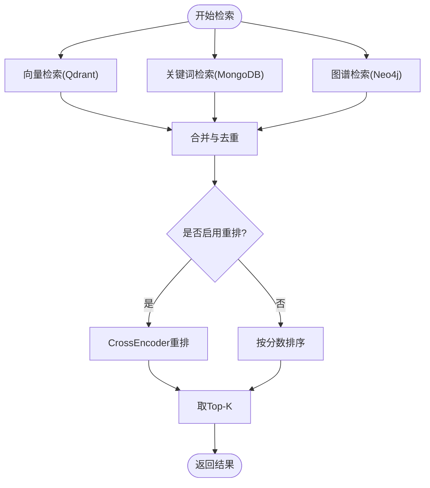
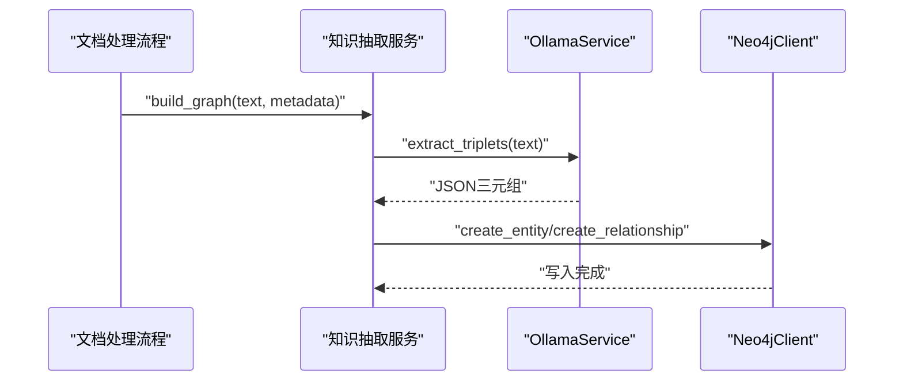
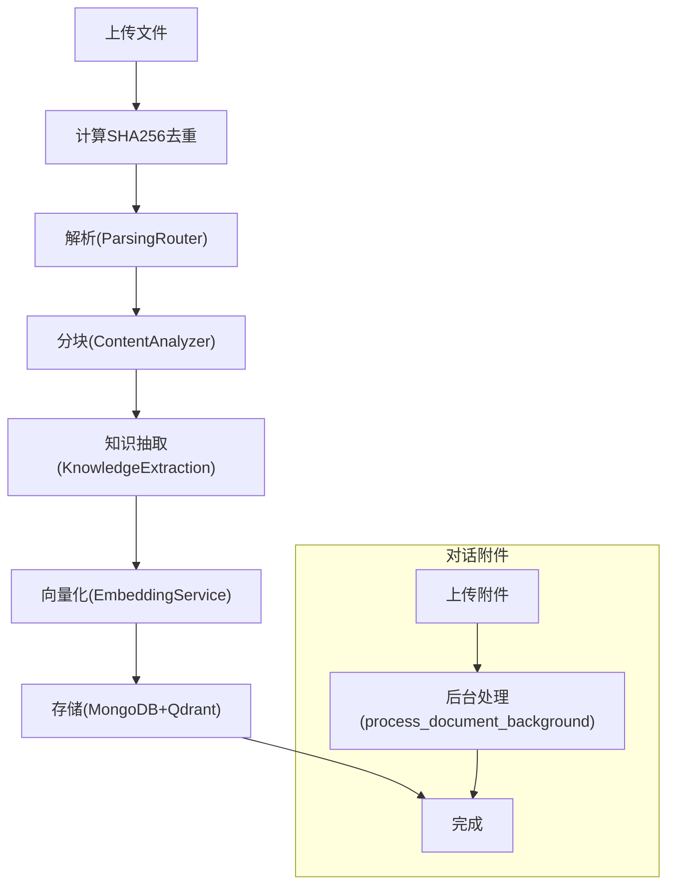
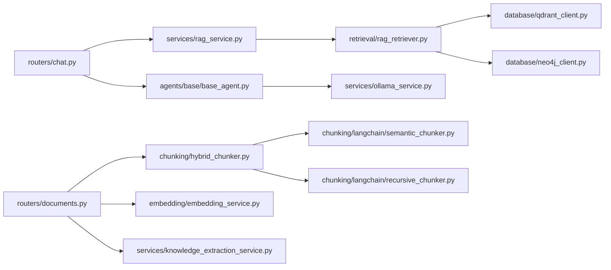

# 核心功能特性

<cite>
**本文引用的文件**
- [README.md](file://README.md)
- [main.py](file://main.py)
- [routers/chat.py](file://routers/chat.py)
- [routers/documents.py](file://routers/documents.py)
- [agents/base/base_agent.py](file://agents/base/base_agent.py)
- [agents/workflow/agent_workflow.py](file://agents/workflow/agent_workflow.py)
- [chunking/hybrid_chunker.py](file://chunking/hybrid_chunker.py)
- [chunking/langchain/semantic_chunker.py](file://chunking/langchain/semantic_chunker.py)
- [chunking/langchain/recursive_chunker.py](file://chunking/langchain/recursive_chunker.py)
- [retrieval/rag_retriever.py](file://retrieval/rag_retriever.py)
- [services/rag_service.py](file://services/rag_service.py)
- [services/knowledge_extraction_service.py](file://services/knowledge_extraction_service.py)
- [services/ollama_service.py](file://services/ollama_service.py)
- [embedding/embedding_service.py](file://embedding/embedding_service.py)
- [database/qdrant_client.py](file://database/qdrant_client.py)
- [database/neo4j_client.py](file://database/neo4j_client.py)
</cite>

## 目录
1. [简介](#简介)
2. [项目结构](#项目结构)
3. [核心组件](#核心组件)
4. [架构总览](#架构总览)
5. [详细组件分析](#详细组件分析)
6. [依赖关系分析](#依赖关系分析)
7. [性能考量](#性能考量)
8. [故障排查指南](#故障排查指南)
9. [结论](#结论)
10. [附录](#附录)

## 简介
advanced-rag 是一个“纯粹的开源高级RAG系统”，基于 FastAPI + Next.js 构建，专注于两大能力：AI助手对话（含深度研究/深度思考）与知识库检索/入库。系统提供匿名对话体验（无需登录即可使用），并内置高阶RAG引擎与多Agent协作框架。

## 项目结构
后端采用模块化分层设计：
- 路由层：routers/ 定义 API 入口与参数校验
- 服务层：services/ 实现业务逻辑（RAG、知识抽取、模型调用）
- 代理系统：agents/ 多Agent协作框架
- 文本处理：chunking/ 解析/分块；embedding/ 向量化
- 检索系统：retrieval/ 混合检索与重排
- 数据库：database/ MongoDB/Qdrant/Neo4j 客户端
- 中间件与工具：middleware/、utils/

图表来源
- [routers/chat.py](file://routers/chat.py)
- [routers/documents.py](file://routers/documents.py)
- [agents/base/base_agent.py](file://agents/base/base_agent.py)
- [agents/workflow/agent_workflow.py](file://agents/workflow/agent_workflow.py)
- [chunking/hybrid_chunker.py](file://chunking/hybrid_chunker.py)
- [chunking/langchain/semantic_chunker.py](file://chunking/langchain/semantic_chunker.py)
- [chunking/langchain/recursive_chunker.py](file://chunking/langchain/recursive_chunker.py)
- [retrieval/rag_retriever.py](file://retrieval/rag_retriever.py)
- [services/rag_service.py](file://services/rag_service.py)
- [services/knowledge_extraction_service.py](file://services/knowledge_extraction_service.py)
- [services/ollama_service.py](file://services/ollama_service.py)
- [embedding/embedding_service.py](file://embedding/embedding_service.py)
- [database/qdrant_client.py](file://database/qdrant_client.py)
- [database/neo4j_client.py](file://database/neo4j_client.py)

章节来源
- [README.md](file://README.md)
- [main.py](file://main.py)

## 核心组件
- 匿名对话与对话历史：无需登录即可发起对话、查看历史、重新生成回答，消息持久化于 MongoDB。
- 深度研究（Deep Research）：多Agent协作，协调Agent规划任务，专家Agent并行执行，前端实时展示规划与各Agent状态。
- 高阶RAG引擎：混合分块（规则+语义）、双路索引（Qdrant向量+Neo4j图谱）、混合检索（向量+关键词+图谱）、重排（CrossEncoder/BGE-reranker）。
- 知识库入库：文档上传→解析→分块→知识抽取→向量化→入库（MongoDB/Qdrant/Neo4j），支持对话附件入库。

章节来源
- [README.md](file://README.md)
- [routers/chat.py](file://routers/chat.py)
- [routers/documents.py](file://routers/documents.py)
- [agents/workflow/agent_workflow.py](file://agents/workflow/agent_workflow.py)
- [retrieval/rag_retriever.py](file://retrieval/rag_retriever.py)

## 架构总览
系统采用“路由层-服务层-组件层-数据库层”的清晰分层，配合异步与流式处理提升交互体验与吞吐能力。

图表来源
- [routers/chat.py](file://routers/chat.py)
- [services/ollama_service.py](file://services/ollama_service.py)
- [services/rag_service.py](file://services/rag_service.py)
- [retrieval/rag_retriever.py](file://retrieval/rag_retriever.py)
- [database/qdrant_client.py](file://database/qdrant_client.py)
- [database/neo4j_client.py](file://database/neo4j_client.py)

## 详细组件分析

### 匿名对话与用户体验
- 设计要点
  - 无需登录即可创建/查看/编辑对话，消息持久化于 MongoDB。
  - 支持断开检测与流式输出，保证良好交互体验。
  - 支持重新生成回答（删除后续消息并重新生成）。
- 关键流程
  - 创建对话：生成UUID，写入MongoDB。
  - 添加消息：追加消息并更新时间戳，助手回复时可自动生成标题。
  - 对话检索：可选启用RAG，支持知识空间过滤与对话历史上下文。
- 最佳实践
  - 为对话标题设置合理上限，避免过长标题影响前端渲染。
  - 对大文件上传与解析设置超时与进度反馈，提升稳定性。

图表来源
- [routers/chat.py](file://routers/chat.py)
- [services/ollama_service.py](file://services/ollama_service.py)

章节来源
- [routers/chat.py](file://routers/chat.py)

### 深度研究（Deep Research）模式
- 设计思路
  - 协调Agent负责任务规划与专家Agent选择。
  - 专家Agent并行执行，前端实时展示规划、状态与结果。
  - 支持手动指定启用的专家Agent，或由协调Agent自动决策。
- 关键流程
  - 初始化协调Agent与专家Agent（按需异步加载配置）。
  - 协调Agent规划任务并返回选择的专家列表与任务分配。
  - 顺序执行专家Agent，流式返回状态与结果。
  - 工作流完成后，前端构建HTML响应。
- 最佳实践
  - 合理设置模型配置（LLM/Embedding），避免并发过载。
  - 对Agent执行状态进行细粒度上报，便于前端可视化。

图表来源
- [routers/chat.py](file://routers/chat.py)
- [agents/workflow/agent_workflow.py](file://agents/workflow/agent_workflow.py)

章节来源
- [agents/base/base_agent.py](file://agents/base/base_agent.py)
- [agents/workflow/agent_workflow.py](file://agents/workflow/agent_workflow.py)
- [routers/chat.py](file://routers/chat.py)

### 高阶RAG引擎
- 混合分块（规则分块+语义分块）
  - 规则分块：优先提取代码块、公式、表格，保持结构完整性。
  - 语义分块：对普通文本使用LangChain语义分块器，保持语义连贯。
  - 去重与元数据：计算文本哈希去重，附加content_type等元数据。
- 双路索引（向量索引+知识图谱索引）
  - 向量索引：Qdrant，支持高维向量存储与相似度检索。
  - 知识图谱索引：Neo4j，抽取实体关系构建图谱。
- 混合检索（向量+关键词+图谱）
  - 并行执行三种检索策略，合并结果并按策略打分。
  - 关键词检索：按文档ID过滤，计算命中率作为初始分数。
  - 图谱检索：抽取查询实体，查询一跳邻居，构造知识文本。
- 精准重排（BGE-reranker）
  - 当前环境为防止崩溃暂时禁用sentence-transformers，保留接口。
  - 可在满足依赖与GPU/CPU资源条件下启用CrossEncoder重排。

图表来源
- [retrieval/rag_retriever.py](file://retrieval/rag_retriever.py)
- [database/qdrant_client.py](file://database/qdrant_client.py)
- [database/neo4j_client.py](file://database/neo4j_client.py)

章节来源
- [chunking/hybrid_chunker.py](file://chunking/hybrid_chunker.py)
- [chunking/langchain/semantic_chunker.py](file://chunking/langchain/semantic_chunker.py)
- [chunking/langchain/recursive_chunker.py](file://chunking/langchain/recursive_chunker.py)
- [retrieval/rag_retriever.py](file://retrieval/rag_retriever.py)
- [services/knowledge_extraction_service.py](file://services/knowledge_extraction_service.py)
- [database/qdrant_client.py](file://database/qdrant_client.py)
- [database/neo4j_client.py](file://database/neo4j_client.py)

### 知识抽取与图谱构建
- 知识抽取
  - 使用Ollama抽取“实体-关系-实体”三元组，解析JSON并规范化。
  - 支持从查询中提取关键实体，用于图谱检索。
- 图谱构建
  - 将三元组写入Neo4j，创建节点与关系，携带source_doc/source_chunk等属性。
  - 关系名称规范化（大写、下划线、去除非法字符）。

图表来源
- [services/knowledge_extraction_service.py](file://services/knowledge_extraction_service.py)
- [services/ollama_service.py](file://services/ollama_service.py)
- [database/neo4j_client.py](file://database/neo4j_client.py)

章节来源
- [services/knowledge_extraction_service.py](file://services/knowledge_extraction_service.py)
- [services/ollama_service.py](file://services/ollama_service.py)
- [database/neo4j_client.py](file://database/neo4j_client.py)

### 知识库入库流程
- 文档上传与去重
  - 支持PDF/Word/Markdown/TXT，计算SHA256去重，避免重复入库。
- 解析与分块
  - 增强解析模块（ParsingRouter）选择合适解析器；结果统一合成。
  - 分块路由（ContentAnalyzer）根据内容类型选择分块器（规则/语义）。
- 知识抽取与图谱
  - 对文本块异步抽取三元组并写入Neo4j，限制并发避免过载。
- 向量化与入库
  - 分批向量化（默认50），批量写入MongoDB与Qdrant。
  - Qdrant集合按向量维度动态创建，支持gRPC连接与重试。
- 对话附件入库
  - 与知识库共用流水线，解析→分块→向量化→入库，支持实时状态查询。

图表来源
- [routers/documents.py](file://routers/documents.py)
- [services/knowledge_extraction_service.py](file://services/knowledge_extraction_service.py)
- [embedding/embedding_service.py](file://embedding/embedding_service.py)
- [database/qdrant_client.py](file://database/qdrant_client.py)

章节来源
- [routers/documents.py](file://routers/documents.py)
- [services/knowledge_extraction_service.py](file://services/knowledge_extraction_service.py)
- [embedding/embedding_service.py](file://embedding/embedding_service.py)
- [database/qdrant_client.py](file://database/qdrant_client.py)

## 依赖关系分析
- 组件耦合
  - 路由层仅负责参数校验与调用服务层，低耦合高内聚。
  - 服务层封装业务逻辑，避免路由层直接依赖底层组件。
  - 代理系统通过抽象基类解耦不同Agent实现。
- 外部依赖
  - Ollama：本地推理与向量化。
  - Qdrant：向量数据库，支持gRPC与连接复用。
  - Neo4j：知识图谱数据库。
  - LangChain：语义分块与文本分割。
- 循环依赖
  - 通过延迟导入与模块拆分避免循环依赖。

图表来源
- [routers/chat.py](file://routers/chat.py)
- [routers/documents.py](file://routers/documents.py)
- [agents/base/base_agent.py](file://agents/base/base_agent.py)
- [services/rag_service.py](file://services/rag_service.py)
- [retrieval/rag_retriever.py](file://retrieval/rag_retriever.py)
- [chunking/hybrid_chunker.py](file://chunking/hybrid_chunker.py)
- [chunking/langchain/semantic_chunker.py](file://chunking/langchain/semantic_chunker.py)
- [chunking/langchain/recursive_chunker.py](file://chunking/langchain/recursive_chunker.py)
- [embedding/embedding_service.py](file://embedding/embedding_service.py)
- [services/knowledge_extraction_service.py](file://services/knowledge_extraction_service.py)
- [services/ollama_service.py](file://services/ollama_service.py)
- [database/qdrant_client.py](file://database/qdrant_client.py)
- [database/neo4j_client.py](file://database/neo4j_client.py)

章节来源
- [main.py](file://main.py)
- [README.md](file://README.md)

## 性能考量
- 异步与并发
  - 检索与处理均采用异步与并发（asyncio.gather、Semaphore），提升吞吐。
  - Qdrant批量插入与gRPC连接复用，降低延迟。
- 资源控制
  - 对大文件解析与分块设置超时与进度上报，避免长时间占用。
  - 向量化分批处理（默认50），避免内存峰值过高。
- 模型与硬件
  - Ollama模型选择与超时配置可根据硬件能力调整。
  - Qdrant集合维度自动适配，避免维度不匹配导致的失败。

## 故障排查指南
- 常见问题
  - Ollama连接失败：检查地址与模型是否可用，确认超时与重试配置。
  - Qdrant不可用：检查gRPC端口与连接，关注维度不匹配与重试机制。
  - Neo4j连接失败：确认URI、凭据与容器内可达性。
  - 重排功能不可用：sentence-transformers加载失败，当前环境已禁用，按需启用。
- 日志与中间件
  - 全局异常捕获与请求日志中间件，便于定位问题。
- 最佳实践
  - 对外暴露的API均支持SSE与断开检测，确保客户端体验。
  - 对话附件入库与知识库入库共享同一后台处理流程，保持一致性。

章节来源
- [services/ollama_service.py](file://services/ollama_service.py)
- [database/qdrant_client.py](file://database/qdrant_client.py)
- [database/neo4j_client.py](file://database/neo4j_client.py)
- [retrieval/rag_retriever.py](file://retrieval/rag_retriever.py)
- [main.py](file://main.py)

## 结论
advanced-rag 通过清晰的分层架构、强大的多Agent协作与高阶RAG引擎，实现了匿名对话与知识库检索/入库的完整闭环。混合分块、双路索引、混合检索与重排等能力共同提升了检索质量与用户体验。系统在性能与稳定性方面做了充分考虑，适合在本地或容器环境中部署与扩展。

## 附录
- API概览（节选）
  - 常规对话：POST /api/chat（流式SSE）
  - 深度研究：POST /api/chat/deep-research（流式SSE）
  - 对话附件上传：POST /api/chat/conversation-attachment（后台处理）
  - 文档上传入库：POST /api/documents/upload（后台处理）
  - 健康检查：GET /health

章节来源
- [README.md](file://README.md)
- [routers/chat.py](file://routers/chat.py)
- [routers/documents.py](file://routers/documents.py)