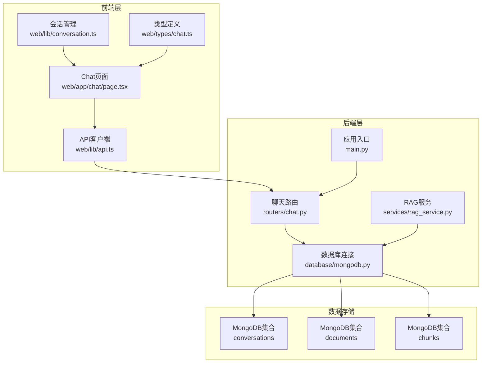
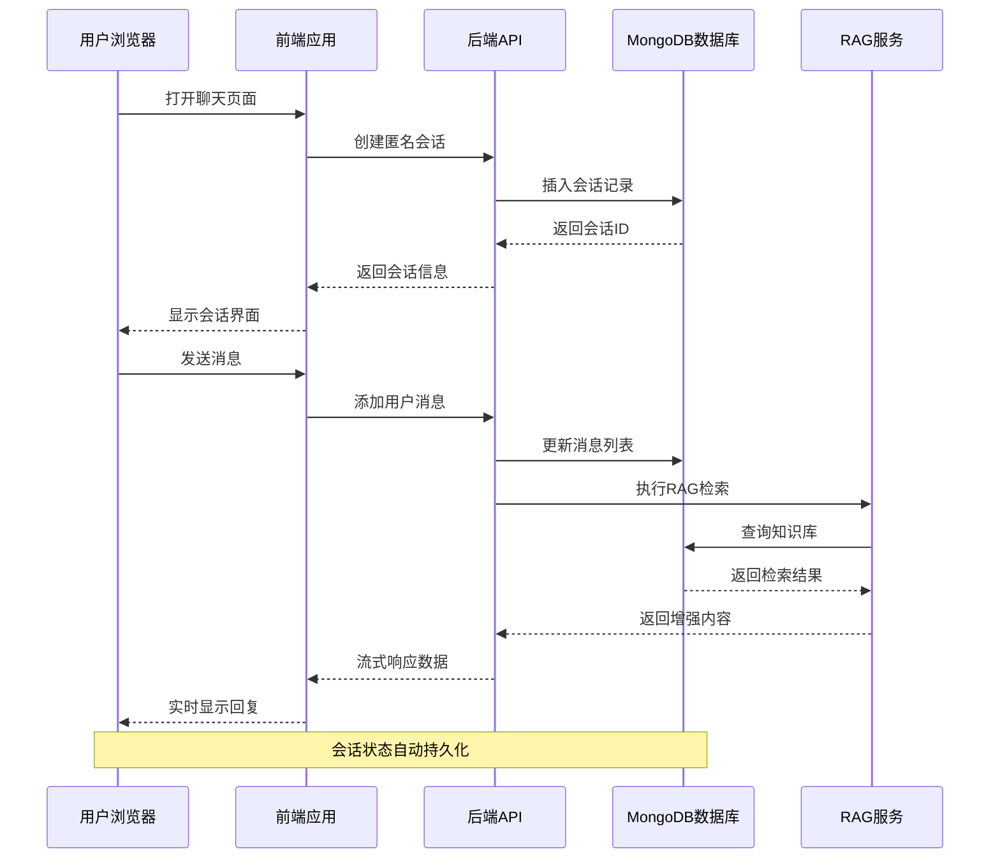
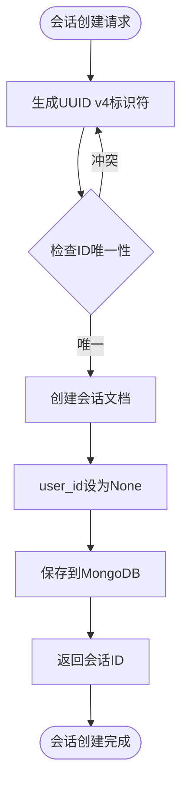
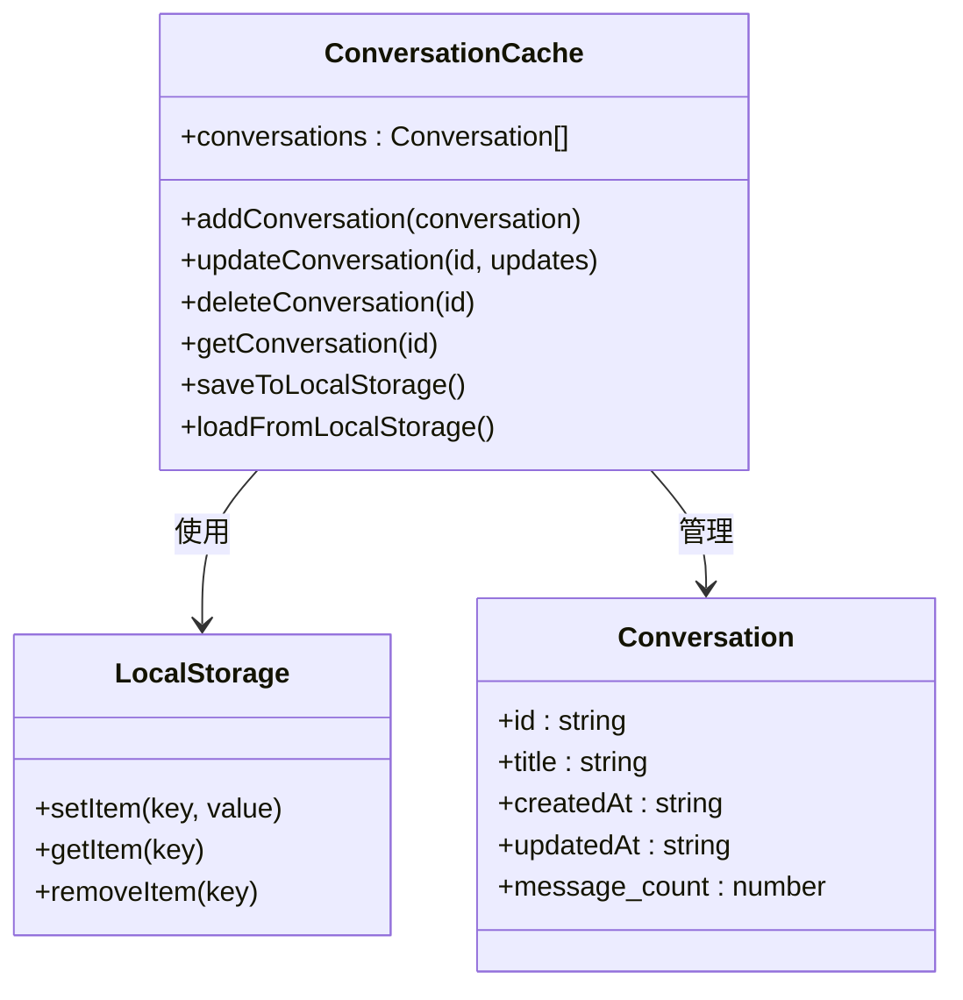
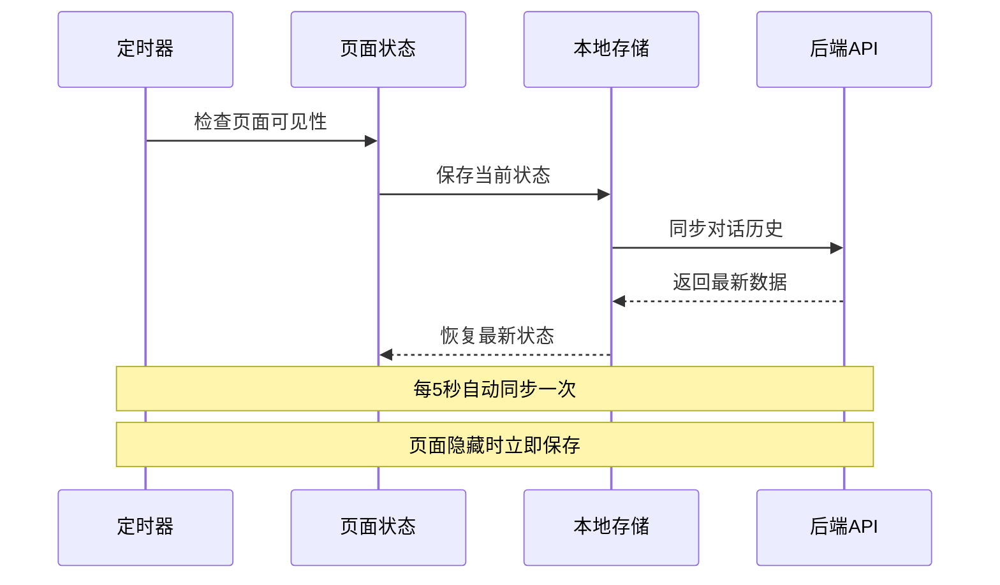
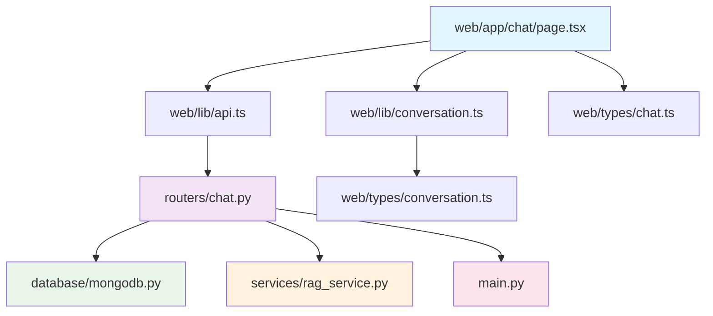

# 匿名对话功能

<cite>
**本文档引用的文件**
- [web/app/chat/page.tsx](file://web/app/chat/page.tsx)
- [routers/chat.py](file://routers/chat.py)
- [web/lib/api.ts](file://web/lib/api.ts)
- [web/lib/conversation.ts](file://web/lib/conversation.ts)
- [web/types/conversation.ts](file://web/types/conversation.ts)
- [web/types/chat.ts](file://web/types/chat.ts)
- [database/mongodb.py](file://database/mongodb.py)
- [services/rag_service.py](file://services/rag_service.py)
- [main.py](file://main.py)
</cite>

## 目录
1. [简介](#简介)
2. [项目结构](#项目结构)
3. [核心组件](#核心组件)
4. [架构概览](#架构概览)
5. [详细组件分析](#详细组件分析)
6. [依赖分析](#依赖分析)
7. [性能考虑](#性能考虑)
8. [故障排除指南](#故障排除指南)
9. [结论](#结论)
10. [附录](#附录)

## 简介

Advanced RAG项目的匿名对话功能是一个革命性的设计，它允许用户在无需注册或登录的情况下即可享受智能对话体验。这一功能的核心价值在于消除了使用门槛，让用户能够随时随地进行知识探索和智能问答。

匿名对话功能采用"无需登录即可使用"的设计理念，通过会话标识符管理和本地状态持久化技术，为用户提供无缝的对话体验。该系统不仅支持实时对话，还具备强大的历史记录管理能力，确保用户在不同设备间切换时能够延续之前的对话状态。

## 项目结构

匿名对话功能跨越了前端React应用和后端FastAPI服务两个层面，形成了完整的全栈解决方案：



**图表来源**
- [web/app/chat/page.tsx:1-800](file://web/app/chat/page.tsx#L1-L800)
- [routers/chat.py:1-800](file://routers/chat.py#L1-L800)
- [database/mongodb.py:1-800](file://database/mongodb.py#L1-L800)

**章节来源**
- [web/app/chat/page.tsx:1-800](file://web/app/chat/page.tsx#L1-L800)
- [routers/chat.py:1-800](file://routers/chat.py#L1-L800)
- [database/mongodb.py:1-800](file://database/mongodb.py#L1-L800)

## 核心组件

匿名对话功能由以下核心组件构成：

### 1. 会话管理组件
- **会话标识符生成**：使用UUID v4算法生成全局唯一的会话ID
- **状态持久化**：结合MongoDB数据库和浏览器localStorage双重存储
- **会话生命周期管理**：支持会话创建、更新、删除和恢复

### 2. 前端交互组件
- **实时对话界面**：基于Next.js的React组件实现
- **流式响应处理**：支持Server-Sent Events的实时数据传输
- **状态同步机制**：确保前后端状态一致性

### 3. 后端服务组件
- **RESTful API接口**：提供完整的对话管理服务
- **RAG检索引擎**：集成知识库检索和增强功能
- **流式响应生成**：支持长连接和断线重连

**章节来源**
- [web/app/chat/page.tsx:22-530](file://web/app/chat/page.tsx#L22-L530)
- [routers/chat.py:97-150](file://routers/chat.py#L97-L150)
- [web/lib/api.ts:203-230](file://web/lib/api.ts#L203-L230)

## 架构概览

匿名对话功能采用分层架构设计，实现了前后端分离和数据持久化的完美结合：



**图表来源**
- [web/app/chat/page.tsx:680-766](file://web/app/chat/page.tsx#L680-L766)
- [routers/chat.py:623-760](file://routers/chat.py#L623-L760)
- [services/rag_service.py:34-126](file://services/rag_service.py#L34-L126)

## 详细组件分析

### 会话管理机制

匿名对话的核心在于会话管理系统的可靠性设计：

#### 会话标识符生成
系统使用UUID v4算法生成不可预测的会话ID，确保每个会话的唯一性和安全性：



**图表来源**
- [routers/chat.py:107-143](file://routers/chat.py#L107-L143)

#### 状态持久化策略
系统采用多层次的数据持久化策略：

1. **数据库持久化**：所有对话数据存储在MongoDB中
2. **本地缓存**：使用localStorage存储临时会话状态
3. **会话恢复**：支持断线重连和页面刷新后的状态恢复

**章节来源**
- [web/app/chat/page.tsx:330-420](file://web/app/chat/page.tsx#L330-L420)
- [routers/chat.py:248-352](file://routers/chat.py#L248-L352)

### 隐私保护机制

匿名对话功能在设计上充分考虑了用户隐私保护：

#### 数据匿名化
- 会话记录中user_id字段始终为None，确保用户身份完全匿名
- 不收集或存储任何个人身份信息
- 所有对话数据仅与会话ID关联

#### 会话清理策略
系统实现了智能的会话清理机制：
- **临时会话清理**：超过5分钟未活动的会话自动清理
- **历史会话管理**：用户可手动删除不需要的对话记录
- **数据最小化原则**：仅存储必要的对话历史数据

**章节来源**
- [routers/chat.py:121-130](file://routers/chat.py#L121-L130)
- [web/app/chat/page.tsx:364-368](file://web/app/chat/page.tsx#L364-L368)

### 全局对话历史管理

#### 本地历史缓存
前端实现了完整的本地历史缓存机制：



**图表来源**
- [web/lib/conversation.ts:78-129](file://web/lib/conversation.ts#L78-L129)
- [web/types/conversation.ts:1-10](file://web/types/conversation.ts#L1-L10)

#### 远程历史同步
后端提供了完整的对话历史同步机制：

**章节来源**
- [web/lib/conversation.ts:16-76](file://web/lib/conversation.ts#L16-L76)
- [routers/chat.py:152-195](file://routers/chat.py#L152-L195)

### 技术实现细节

#### 会话标识符生成
系统使用Python的uuid库生成全局唯一的会话ID：

```mermaid
flowchart LR
A[会话创建请求] --> B[uuid.uuid4()]
B --> C[转换为字符串]
C --> D[验证唯一性]
D --> E{唯一吗?}
E --> |否| B
E --> |是| F[返回会话ID]
```

**图表来源**
- [routers/chat.py:107-108](file://routers/chat.py#L107-L108)

#### 状态同步机制
前端实现了复杂的状态同步机制：



**图表来源**
- [web/app/chat/page.tsx:490-529](file://web/app/chat/page.tsx#L490-L529)

**章节来源**
- [web/app/chat/page.tsx:512-518](file://web/app/chat/page.tsx#L512-L518)
- [routers/chat.py:623-760](file://routers/chat.py#L623-L760)

### 跨设备访问支持

系统通过以下机制支持跨设备访问：

#### 会话状态恢复
- **自动恢复**：页面重新加载时自动恢复最近的对话状态
- **断线重连**：网络中断后自动重新连接并恢复对话
- **多标签页同步**：同一浏览器的不同标签页共享对话状态

#### 设备间同步
- **云端同步**：所有对话数据存储在云端数据库中
- **本地缓存**：使用localStorage提供离线访问能力
- **状态一致性**：通过定期同步确保多设备状态一致

**章节来源**
- [web/app/chat/page.tsx:468-482](file://web/app/chat/page.tsx#L468-L482)
- [routers/chat.py:248-352](file://routers/chat.py#L248-L352)

## 依赖分析

匿名对话功能的依赖关系相对简洁，主要依赖于以下几个核心组件：



**图表来源**
- [web/app/chat/page.tsx:1-50](file://web/app/chat/page.tsx#L1-L50)
- [routers/chat.py:1-20](file://routers/chat.py#L1-L20)
- [database/mongodb.py:1-20](file://database/mongodb.py#L1-L20)

**章节来源**
- [main.py:15-99](file://main.py#L15-L99)
- [routers/chat.py:1-20](file://routers/chat.py#L1-L20)

## 性能考虑

匿名对话功能在设计时充分考虑了性能优化：

### 数据库性能优化
- **连接池管理**：MongoDB连接池配置支持高并发访问
- **索引优化**：对常用查询字段建立合适的索引
- **查询优化**：使用聚合管道减少网络往返

### 前端性能优化
- **状态缓存**：合理使用localStorage减少API调用
- **懒加载**：按需加载对话历史和附件
- **内存管理**：及时清理不再使用的对话数据

### 网络性能优化
- **流式传输**：使用Server-Sent Events实现实时数据传输
- **断线重连**：自动处理网络中断和重连
- **压缩传输**：对传输数据进行适当的压缩

## 故障排除指南

### 常见问题及解决方案

#### 会话状态丢失
**问题描述**：用户发现对话状态在刷新后丢失
**解决方案**：
1. 检查浏览器localStorage是否正常工作
2. 确认会话ID是否正确传递到后端
3. 验证MongoDB连接是否稳定

#### 对话历史无法同步
**问题描述**：多设备间对话历史不同步
**解决方案**：
1. 确认网络连接正常
2. 检查后端API是否正常运行
3. 验证MongoDB数据库连接状态

#### 流式响应中断
**问题描述**：实时对话响应中断
**解决方案**：
1. 检查网络连接稳定性
2. 确认后端服务是否正常
3. 验证RAG服务的可用性

**章节来源**
- [web/app/chat/page.tsx:645-663](file://web/app/chat/page.tsx#L645-L663)
- [routers/chat.py:720-743](file://routers/chat.py#L720-L743)

## 结论

Advanced RAG项目的匿名对话功能代表了现代AI助手技术的发展方向。通过精心设计的架构和实现，该功能成功地平衡了易用性、隐私保护和性能要求。

匿名对话功能的核心优势在于：
- **零门槛使用**：用户无需注册即可享受智能对话服务
- **隐私保护**：完全匿名的对话体验，保护用户隐私
- **跨设备支持**：无缝的多设备对话体验
- **高性能表现**：优化的架构确保流畅的用户体验

该功能为教育、研究和知识探索领域提供了强大的技术支持，降低了获取智能知识服务的门槛，推动了AI技术的普及应用。

## 附录

### 使用场景示例

#### 场景一：学术研究
研究人员可以在不注册的情况下快速获取相关文献的摘要和分析，支持跨设备查阅和笔记整理。

#### 场景二：学习辅助
学生可以随时向AI助手提问，获取个性化的学习指导和资源推荐，支持离线学习和复习。

#### 场景三：创意激发
创作者可以与AI助手进行头脑风暴，获得灵感和建议，支持多设备协作和内容整理。

### 配置示例

#### 基础配置
```typescript
// 前端配置示例
const conversationConfig = {
  enableRAG: true,
  deepResearchEnabled: false,
  streaming: true
};
```

#### 高级配置
```python
# 后端配置示例
{
    "mongodb": {
        "uri": "mongodb://localhost:27017/advanced_rag",
        "maxPoolSize": 100,
        "minPoolSize": 10
    },
    "session": {
        "timeout": 300,
        "cleanup": true
    }
}
```