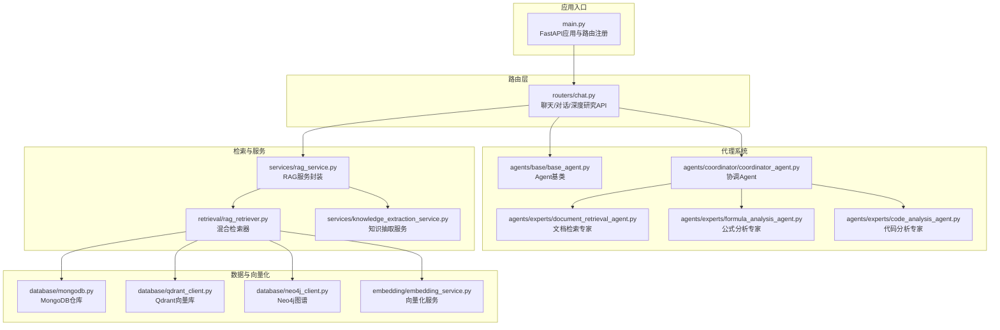
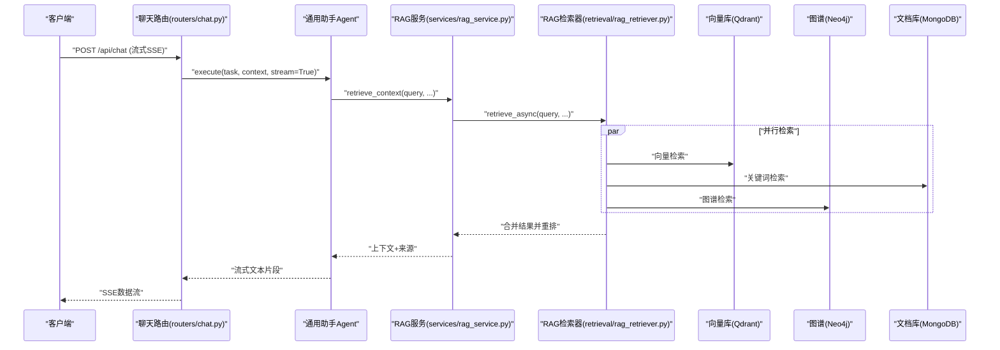
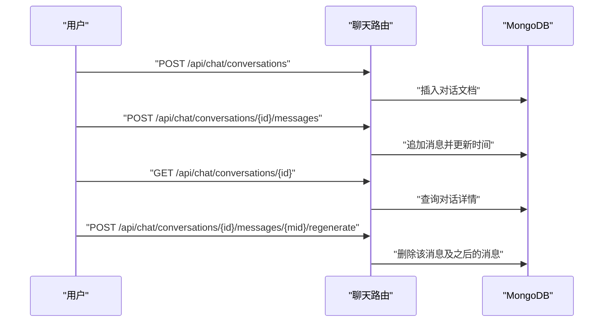
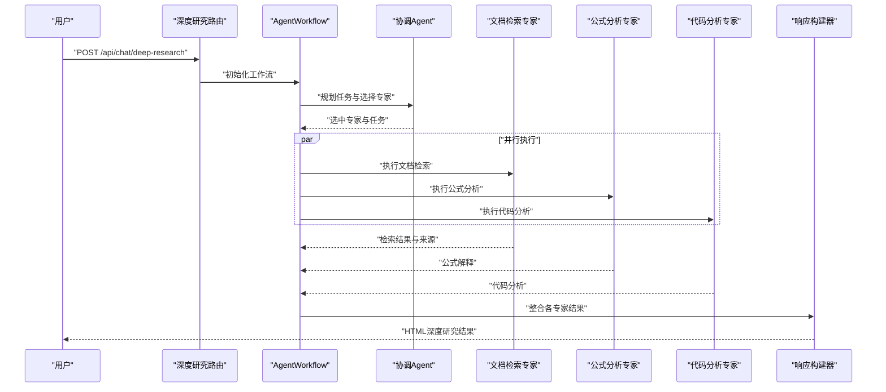
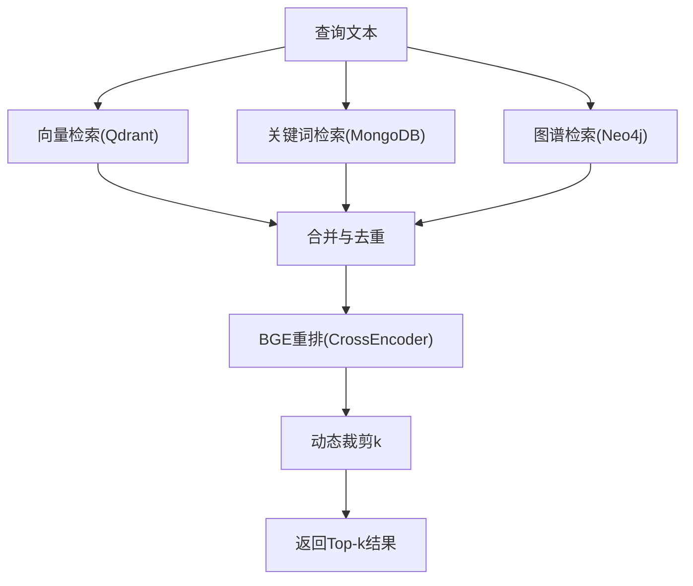
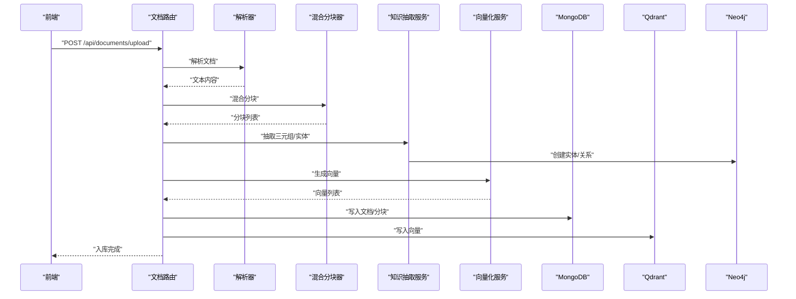
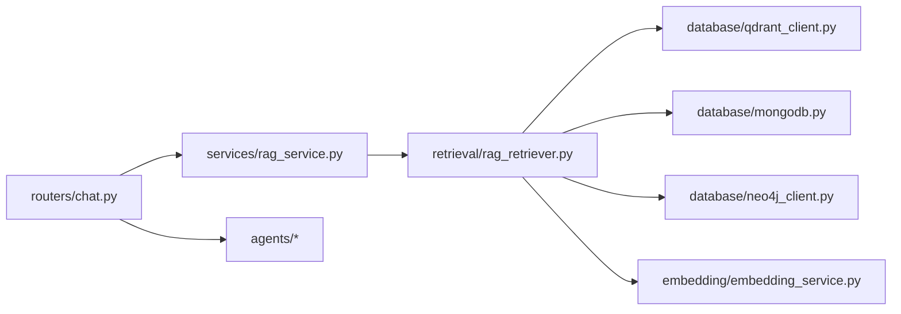

# 核心功能特性

<cite>
**本文引用的文件**
- [README.md](file://README.md)
- [main.py](file://main.py)
- [routers/chat.py](file://routers/chat.py)
- [agents/base/base_agent.py](file://agents/base/base_agent.py)
- [agents/coordinator/coordinator_agent.py](file://agents/coordinator/coordinator_agent.py)
- [agents/experts/document_retrieval_agent.py](file://agents/experts/document_retrieval_agent.py)
- [agents/experts/formula_analysis_agent.py](file://agents/experts/formula_analysis_agent.py)
- [agents/experts/code_analysis_agent.py](file://agents/experts/code_analysis_agent.py)
- [chunking/hybrid_chunker.py](file://chunking/hybrid_chunker.py)
- [retrieval/rag_retriever.py](file://retrieval/rag_retriever.py)
- [services/rag_service.py](file://services/rag_service.py)
- [services/knowledge_extraction_service.py](file://services/knowledge_extraction_service.py)
- [database/qdrant_client.py](file://database/qdrant_client.py)
- [database/mongodb.py](file://database/mongodb.py)
- [database/neo4j_client.py](file://database/neo4j_client.py)
- [embedding/embedding_service.py](file://embedding/embedding_service.py)
</cite>

## 目录
1. [简介](#简介)
2. [项目结构](#项目结构)
3. [核心组件](#核心组件)
4. [架构总览](#架构总览)
5. [详细组件分析](#详细组件分析)
6. [依赖关系分析](#依赖关系分析)
7. [性能考量](#性能考量)
8. [故障排查指南](#故障排查指南)
9. [结论](#结论)
10. [附录](#附录)

## 简介
Advanced RAG 是一个“纯开源高级RAG系统”，基于 FastAPI + Next.js 构建，专注于“AI助手对话（含深度研究/深度思考）”与“知识库检索/入库”。系统提供匿名访问能力，支持全局对话历史管理；内置高阶RAG引擎，具备混合分块、双路索引、混合检索与精准重排；并提供从文档上传到入库的完整流水线。

## 项目结构
后端采用模块化分层设计：
- 应用入口与中间件：main.py、中间件与静态资源挂载
- 路由层：routers/ 提供聊天、文档、检索、知识空间、设置、健康检查等API
- 代理系统：agents/ 多Agent协作框架，含协调Agent与专家Agent
- 分块与解析：chunking/、parsers/
- 检索与服务：retrieval/、services/
- 数据库与向量化：database/、embedding/
- 工具与监控：utils/

图表来源
- [main.py:90-99](file://main.py#L90-L99)
- [routers/chat.py:623-760](file://routers/chat.py#L623-L760)
- [agents/base/base_agent.py:1-122](file://agents/base/base_agent.py#L1-L122)
- [agents/coordinator/coordinator_agent.py:1-252](file://agents/coordinator/coordinator_agent.py#L1-L252)
- [services/rag_service.py:34-126](file://services/rag_service.py#L34-L126)
- [retrieval/rag_retriever.py:89-138](file://retrieval/rag_retriever.py#L89-L138)
- [database/qdrant_client.py:336-414](file://database/qdrant_client.py#L336-L414)
- [database/mongodb.py:338-548](file://database/mongodb.py#L338-L548)
- [database/neo4j_client.py:40-101](file://database/neo4j_client.py#L40-L101)
- [embedding/embedding_service.py:175-318](file://embedding/embedding_service.py#L175-L318)

章节来源
- [README.md:55-70](file://README.md#L55-L70)
- [main.py:90-99](file://main.py#L90-L99)

## 核心组件
- 匿名对话与全局历史：无需登录即可创建/维护对话，消息持久化于MongoDB，支持标题自动生成、消息编辑与重新生成。
- 深度研究（多Agent协作）：协调Agent分析问题并选择专家Agent，专家Agent执行专项任务，最终由响应构建器整合输出。
- 高阶RAG引擎：混合分块（规则+语义）、双路索引（向量+图谱）、混合检索（向量+关键词+图谱）、精准重排（BGE-reranker）。
- 知识库入库：前端上传文档→解析/分块→知识抽取→向量化→入库（MongoDB、Qdrant、Neo4j）。

章节来源
- [README.md:11-22](file://README.md#L11-L22)
- [routers/chat.py:97-150](file://routers/chat.py#L97-L150)
- [routers/chat.py:762-800](file://routers/chat.py#L762-L800)

## 架构总览
系统采用“路由层-服务层-检索层-数据层”的分层架构，配合Agent编排实现“对话+深度研究+知识库”的一体化能力。

图表来源
- [routers/chat.py:623-760](file://routers/chat.py#L623-L760)
- [services/rag_service.py:34-126](file://services/rag_service.py#L34-L126)
- [retrieval/rag_retriever.py:89-138](file://retrieval/rag_retriever.py#L89-L138)
- [database/qdrant_client.py:336-414](file://database/qdrant_client.py#L336-L414)
- [database/neo4j_client.py:40-101](file://database/neo4j_client.py#L40-L101)
- [database/mongodb.py:338-548](file://database/mongodb.py#L338-L548)

## 详细组件分析

### 匿名对话与全局历史管理
- 无需登录：创建对话时user_id为空，实现匿名模式；对话列表、详情、消息增删改查均支持匿名访问。
- 全局历史：对话消息存储于MongoDB集合conversations，支持按conversation_id读取与追加消息；消息包含角色、内容、时间戳、来源与推荐资源。
- 标题自动生成：助手回复后若标题为默认值，异步生成标题并更新。
- 重新生成回答：删除用户消息及其后续消息，重新触发生成。

图表来源
- [routers/chat.py:97-150](file://routers/chat.py#L97-L150)
- [routers/chat.py:248-352](file://routers/chat.py#L248-L352)
- [routers/chat.py:354-456](file://routers/chat.py#L354-L456)
- [routers/chat.py:541-621](file://routers/chat.py#L541-L621)

章节来源
- [routers/chat.py:97-150](file://routers/chat.py#L97-L150)
- [routers/chat.py:197-246](file://routers/chat.py#L197-L246)
- [routers/chat.py:248-352](file://routers/chat.py#L248-L352)
- [routers/chat.py:541-621](file://routers/chat.py#L541-L621)

### 深度研究（多Agent协作）
- 协调Agent：分析用户问题，智能选择所需专家Agent（如文档检索、公式分析、代码分析、概念解释、示例生成、习题、科学计算、总结），并给出理由与任务分配。
- 专家Agent：文档检索专家调用RAG服务检索上下文并总结；公式分析专家抽取并解释公式；代码分析专家分析代码片段。
- 工作流与响应构建：路由层通过AgentWorkflow与ResponseBuilder编排多Agent输出，返回HTML格式的深度研究结果。

图表来源
- [routers/chat.py:762-800](file://routers/chat.py#L762-L800)
- [agents/coordinator/coordinator_agent.py:55-169](file://agents/coordinator/coordinator_agent.py#L55-L169)
- [agents/experts/document_retrieval_agent.py:25-79](file://agents/experts/document_retrieval_agent.py#L25-L79)
- [agents/experts/formula_analysis_agent.py:26-107](file://agents/experts/formula_analysis_agent.py#L26-L107)
- [agents/experts/code_analysis_agent.py:25-79](file://agents/experts/code_analysis_agent.py#L25-L79)

章节来源
- [agents/coordinator/coordinator_agent.py:19-54](file://agents/coordinator/coordinator_agent.py#L19-L54)
- [agents/coordinator/coordinator_agent.py:170-214](file://agents/coordinator/coordinator_agent.py#L170-L214)
- [agents/experts/document_retrieval_agent.py:15-24](file://agents/experts/document_retrieval_agent.py#L15-L24)
- [agents/experts/formula_analysis_agent.py:15-24](file://agents/experts/formula_analysis_agent.py#L15-L24)
- [agents/experts/code_analysis_agent.py:14-23](file://agents/experts/code_analysis_agent.py#L14-L23)

### 高阶RAG引擎（四大能力）
- 混合分块：规则分块（代码/公式/表格）+ 语义分块（基于嵌入的语义边界），去重与元数据增强。
- 双路索引：向量索引（Qdrant）+ 知识图谱索引（Neo4j）。
- 混合检索：向量检索 + 关键词检索 + 图谱检索，合并与初步去重。
- 精准重排：BGE-reranker交叉编码器重排，动态裁剪k以平衡召回与精度。

图表来源
- [retrieval/rag_retriever.py:115-137](file://retrieval/rag_retriever.py#L115-L137)
- [retrieval/rag_retriever.py:328-363](file://retrieval/rag_retriever.py#L328-L363)
- [retrieval/rag_retriever.py:365-392](file://retrieval/rag_retriever.py#L365-L392)
- [services/rag_service.py:11-32](file://services/rag_service.py#L11-L32)

章节来源
- [chunking/hybrid_chunker.py:52-121](file://chunking/hybrid_chunker.py#L52-L121)
- [retrieval/rag_retriever.py:176-205](file://retrieval/rag_retriever.py#L176-L205)
- [retrieval/rag_retriever.py:206-241](file://retrieval/rag_retriever.py#L206-L241)
- [retrieval/rag_retriever.py:242-327](file://retrieval/rag_retriever.py#L242-L327)
- [retrieval/rag_retriever.py:365-392](file://retrieval/rag_retriever.py#L365-L392)
- [services/rag_service.py:11-32](file://services/rag_service.py#L11-L32)

### 知识库入库（全流程）
- 文档上传：前端上传PDF/Word/Markdown/TXT等，后端解析与分块。
- 解析与分块：解析器解析文档，混合分块器按规则+语义切分。
- 知识抽取：抽取三元组并构建Neo4j图谱，同时提取查询实体用于图谱检索。
- 向量化：使用Ollama嵌入模型生成向量。
- 入库：写入MongoDB（文档/分块）、Qdrant（向量）、Neo4j（实体/关系）。

图表来源
- [services/knowledge_extraction_service.py:36-106](file://services/knowledge_extraction_service.py#L36-L106)
- [services/knowledge_extraction_service.py:147-228](file://services/knowledge_extraction_service.py#L147-L228)
- [embedding/embedding_service.py:175-318](file://embedding/embedding_service.py#L175-L318)
- [database/mongodb.py:338-548](file://database/mongodb.py#L338-L548)
- [database/qdrant_client.py:210-335](file://database/qdrant_client.py#L210-L335)
- [database/neo4j_client.py:64-101](file://database/neo4j_client.py#L64-L101)

章节来源
- [services/knowledge_extraction_service.py:12-35](file://services/knowledge_extraction_service.py#L12-L35)
- [services/knowledge_extraction_service.py:107-146](file://services/knowledge_extraction_service.py#L107-L146)
- [chunking/hybrid_chunker.py:52-121](file://chunking/hybrid_chunker.py#L52-L121)
- [embedding/embedding_service.py:175-318](file://embedding/embedding_service.py#L175-L318)
- [database/mongodb.py:338-548](file://database/mongodb.py#L338-L548)
- [database/qdrant_client.py:210-335](file://database/qdrant_client.py#L210-L335)
- [database/neo4j_client.py:64-101](file://database/neo4j_client.py#L64-L101)

## 依赖关系分析
- 组件耦合：路由层依赖服务层；服务层依赖检索器；检索器依赖向量库、图谱与文档库；Agent层依赖服务层与检索器。
- 外部依赖：Ollama（本地推理/嵌入）、Qdrant（向量检索）、Neo4j（图谱检索）、MongoDB（文档与对话）。
- 运行时开关：通过运行时配置与环境变量控制图谱检索、重排等功能开关。

图表来源
- [routers/chat.py:623-760](file://routers/chat.py#L623-L760)
- [services/rag_service.py:34-126](file://services/rag_service.py#L34-L126)
- [retrieval/rag_retriever.py:89-138](file://retrieval/rag_retriever.py#L89-L138)
- [database/qdrant_client.py:336-414](file://database/qdrant_client.py#L336-L414)
- [database/mongodb.py:338-548](file://database/mongodb.py#L338-L548)
- [database/neo4j_client.py:40-101](file://database/neo4j_client.py#L40-L101)
- [embedding/embedding_service.py:175-318](file://embedding/embedding_service.py#L175-L318)

章节来源
- [retrieval/rag_retriever.py:102-137](file://retrieval/rag_retriever.py#L102-L137)

## 性能考量
- 并行检索：向量、关键词、图谱检索并行执行，提升整体吞吐。
- 动态参数：根据查询特征（对比/列举/条款）动态调整prefetch_k与final_k，平衡召回与精度。
- 重排与动态裁剪：BGE重排后按分数分布动态调整k，兼顾precision与recall。
- 连接优化：Qdrant优先使用gRPC连接与连接复用，降低延迟；MongoDB连接池参数可调。
- 重试与降级：Qdrant插入与搜索失败时自动重试与降级；重排模型加载失败自动降级。

章节来源
- [services/rag_service.py:11-32](file://services/rag_service.py#L11-L32)
- [services/rag_service.py:100-126](file://services/rag_service.py#L100-L126)
- [retrieval/rag_retriever.py:139-168](file://retrieval/rag_retriever.py#L139-L168)
- [retrieval/rag_retriever.py:52-69](file://retrieval/rag_retriever.py#L52-L69)
- [database/qdrant_client.py:66-96](file://database/qdrant_client.py#L66-L96)
- [database/qdrant_client.py:278-335](file://database/qdrant_client.py#L278-L335)

## 故障排查指南
- 重排模型加载失败：自动降级，避免反复尝试；检查环境变量ENABLE_RERANKER与RERANKER_MODEL。
- Qdrant连接/维度不匹配：自动重建集合或重试；gRPC连接优化；关注超时与5xx错误。
- Neo4j连接失败：冷却机制避免刷屏；检查NEO4J_URI/USER/PASSWORD。
- Ollama嵌入失败：重试与超时控制；模型不存在时提示下载；注意上下文长度限制。
- MongoDB连接失败：首次请求重试；检查URI/认证/网络；连接池参数可调。

章节来源
- [retrieval/rag_retriever.py:52-69](file://retrieval/rag_retriever.py#L52-L69)
- [database/qdrant_client.py:98-123](file://database/qdrant_client.py#L98-L123)
- [database/qdrant_client.py:247-335](file://database/qdrant_client.py#L247-L335)
- [services/knowledge_extraction_service.py:155-171](file://services/knowledge_extraction_service.py#L155-L171)
- [database/neo4j_client.py:16-33](file://database/neo4j_client.py#L16-L33)
- [embedding/embedding_service.py:227-290](file://embedding/embedding_service.py#L227-L290)
- [database/mongodb.py:168-184](file://database/mongodb.py#L168-L184)

## 结论
Advanced RAG通过“匿名对话+深度研究+高阶RAG+知识库入库”的完整闭环，实现了易用、高效、可扩展的RAG系统。其核心优势在于：
- 无门槛使用：匿名对话与全局历史管理，降低使用成本。
- 多Agent协作：智能任务分配与结果整合，适合复杂问题的深度研究。
- 高阶RAG引擎：混合分块、双路索引、混合检索与精准重排，显著提升检索质量与效率。
- 端到端入库：从解析到入库的自动化流水线，支撑持续知识积累。

## 附录
- 快速开始与环境配置参考：[README.md:71-188](file://README.md#L71-L188)
- 核心API接口参考：[README.md:189-199](file://README.md#L189-L199)
- Agent基类与工具：[agents/base/base_agent.py:1-122](file://agents/base/base_agent.py#L1-L122)
- 协调Agent与专家Agent：[agents/coordinator/coordinator_agent.py:1-252](file://agents/coordinator/coordinator_agent.py#L1-L252)
- 混合分块器：[chunking/hybrid_chunker.py:1-179](file://chunking/hybrid_chunker.py#L1-L179)
- RAG检索器与服务：[retrieval/rag_retriever.py:1-393](file://retrieval/rag_retriever.py#L1-L393), [services/rag_service.py:1-323](file://services/rag_service.py#L1-L323)
- 知识抽取与图谱：[services/knowledge_extraction_service.py:1-229](file://services/knowledge_extraction_service.py#L1-L229), [database/neo4j_client.py:1-104](file://database/neo4j_client.py#L1-L104)
- 向量化服务：[embedding/embedding_service.py:1-333](file://embedding/embedding_service.py#L1-L333)
- 数据库客户端：[database/qdrant_client.py:1-544](file://database/qdrant_client.py#L1-L544), [database/mongodb.py:1-800](file://database/mongodb.py#L1-L800)