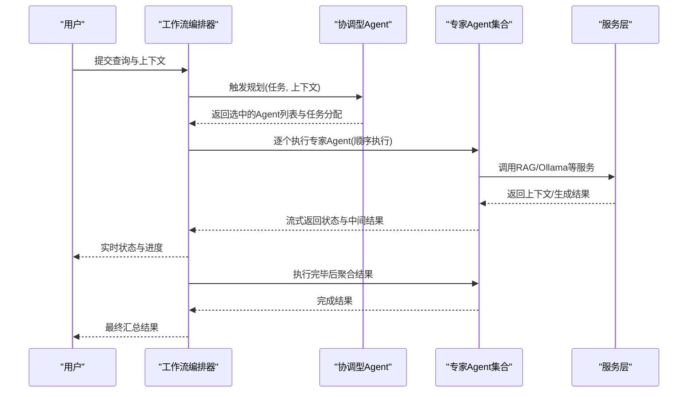
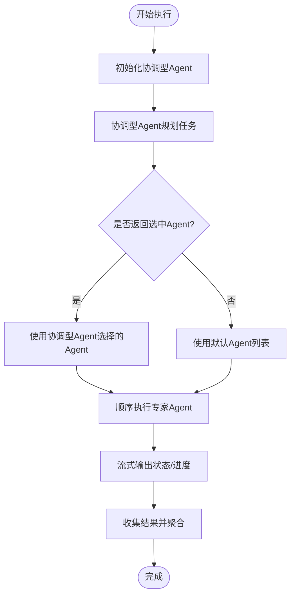
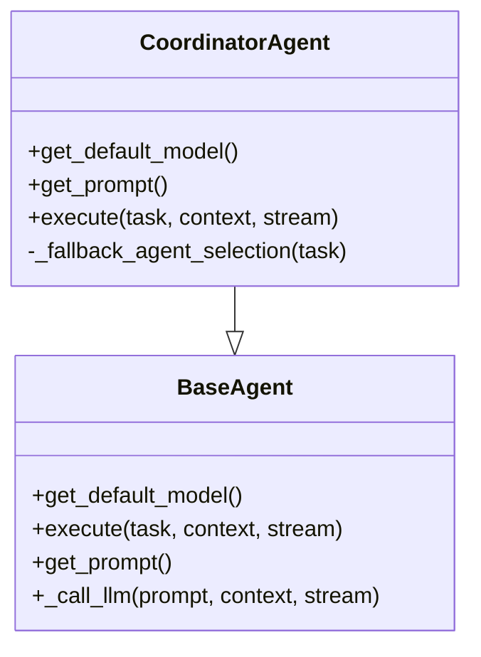
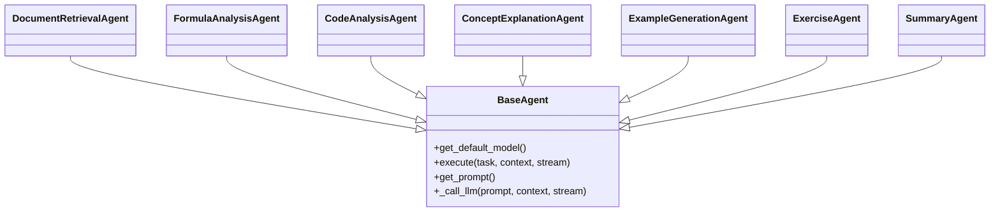
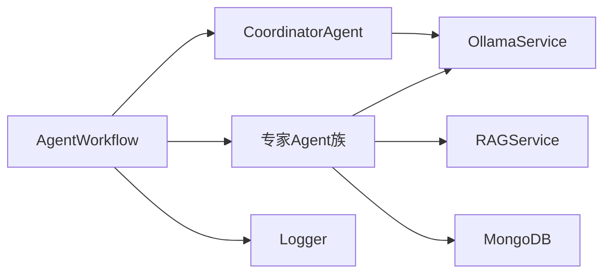
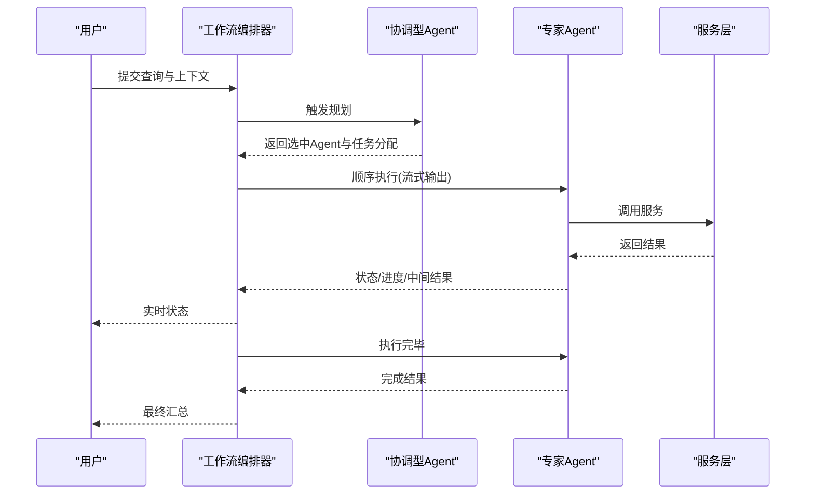

# Agent工作流编排

<cite>
**本文引用的文件**
- [agent_workflow.py](file://agents/workflow/agent_workflow.py)
- [coordinator_agent.py](file://agents/coordinator/coordinator_agent.py)
- [base_agent.py](file://agents/base/base_agent.py)
- [code_analysis_agent.py](file://agents/experts/code_analysis_agent.py)
- [concept_explanation_agent.py](file://agents/experts/concept_explanation_agent.py)
- [document_retrieval_agent.py](file://agents/experts/document_retrieval_agent.py)
- [formula_analysis_agent.py](file://agents/experts/formula_analysis_agent.py)
- [example_generation_agent.py](file://agents/experts/example_generation_agent.py)
- [exercise_agent.py](file://agents/experts/exercise_agent.py)
- [summary_agent.py](file://agents/experts/summary_agent.py)
- [rag_service.py](file://services/rag_service.py)
- [ollama_service.py](file://services/ollama_service.py)
- [mongodb.py](file://database/mongodb.py)
- [logger.py](file://utils/logger.py)
- [assistants.py](file://routers/assistants.py)
</cite>

## 目录
1. [简介](#简介)
2. [项目结构](#项目结构)
3. [核心组件](#核心组件)
4. [架构总览](#架构总览)
5. [详细组件分析](#详细组件分析)
6. [依赖分析](#依赖分析)
7. [性能考虑](#性能考虑)
8. [故障排查指南](#故障排查指南)
9. [结论](#结论)
10. [附录](#附录)

## 简介
本文件面向“Agent工作流编排”，系统性阐述多Agent协作的工作流程与编排机制，涵盖任务分配、执行顺序控制、结果整合与状态管理、错误处理与异常恢复策略，并提供从任务规划到最终结果输出的完整示例流程。重点说明工作流编排器如何协调不同专家Agent之间的协作，确保任务按最优顺序执行并有效整合各Agent的输出结果。

## 项目结构
该系统采用“协调型Agent + 专家Agent + 服务层”的分层架构：
- 协调型Agent负责任务规划与专家Agent选择
- 专家Agent负责具体领域的任务执行
- 服务层提供RAG检索与LLM调用能力
- 数据层提供Agent配置与知识库检索
- 日志与路由提供可观测性与外部接入

```mermaid
graph TB
WF["工作流编排器<br/>agents/workflow/agent_workflow.py"]
COORD["协调型Agent<br/>agents/coordinator/coordinator_agent.py"]
EXP1["专家Agent: 文档检索<br/>agents/experts/document_retrieval_agent.py"]
EXP2["专家Agent: 公式分析<br/>agents/experts/formula_analysis_agent.py"]
EXP3["专家Agent: 代码分析<br/>agents/experts/code_analysis_agent.py"]
EXP4["专家Agent: 概念解释<br/>agents/experts/concept_explanation_agent.py"]
EXP5["专家Agent: 示例生成<br/>agents/experts/example_generation_agent.py"]
EXP6["专家Agent: 习题处理<br/>agents/experts/exercise_agent.py"]
EXP7["专家Agent: 总结<br/>agents/experts/summary_agent.py"]
RAG["RAG服务<br/>services/rag_service.py"]
OLL["Ollama服务<br/>services/ollama_service.py"]
DB["MongoDB<br/>database/mongodb.py"]
LOG["日志<br/>utils/logger.py"]
WF --> COORD
WF --> EXP1
WF --> EXP2
WF --> EXP3
WF --> EXP4
WF --> EXP5
WF --> EXP6
WF --> EXP7
EXP1 --> RAG
EXP1 --> OLL
EXP2 --> OLL
EXP3 --> OLL
EXP4 --> OLL
EXP5 --> OLL
EXP6 --> OLL
EXP7 --> OLL
COORD --> OLL
WF --> DB
WF --> LOG
```

图表来源
- [agent_workflow.py:47-388](file://agents/workflow/agent_workflow.py#L47-L388)
- [coordinator_agent.py:7-252](file://agents/coordinator/coordinator_agent.py#L7-L252)
- [document_retrieval_agent.py:8-79](file://agents/experts/document_retrieval_agent.py#L8-L79)
- [formula_analysis_agent.py:8-107](file://agents/experts/formula_analysis_agent.py#L8-L107)
- [code_analysis_agent.py:7-79](file://agents/experts/code_analysis_agent.py#L7-L79)
- [concept_explanation_agent.py:7-70](file://agents/experts/concept_explanation_agent.py#L7-L70)
- [example_generation_agent.py:7-68](file://agents/experts/example_generation_agent.py#L7-L68)
- [exercise_agent.py:7-102](file://agents/experts/exercise_agent.py#L7-L102)
- [summary_agent.py:7-87](file://agents/experts/summary_agent.py#L7-L87)
- [rag_service.py:8-323](file://services/rag_service.py#L8-L323)
- [ollama_service.py:9-674](file://services/ollama_service.py#L9-L674)
- [mongodb.py:92-204](file://database/mongodb.py#L92-L204)
- [logger.py:15-88](file://utils/logger.py#L15-L88)

章节来源
- [agent_workflow.py:47-388](file://agents/workflow/agent_workflow.py#L47-L388)
- [coordinator_agent.py:7-252](file://agents/coordinator/coordinator_agent.py#L7-L252)
- [base_agent.py:8-122](file://agents/base/base_agent.py#L8-L122)

## 核心组件
- 工作流编排器（AgentWorkflow）
  - 负责初始化协调型Agent与专家Agent实例，按协调型Agent规划的顺序执行专家Agent，并聚合结果
  - 支持流式输出，实时反馈每个Agent的状态与进度
  - 提供错误处理与异常恢复，保证整体流程的鲁棒性
- 协调型Agent（CoordinatorAgent）
  - 基于用户问题智能选择所需专家Agent，生成任务分配与选择理由
  - 提供后备选择逻辑，确保在解析失败时仍能返回合理Agent列表
- 专家Agent族
  - 文档检索、公式分析、代码分析、概念解释、示例生成、习题处理、总结等
  - 统一继承自BaseAgent，具备一致的执行接口与提示词构建能力
- 服务层
  - RAG服务：并行检索知识库，构建上下文与来源信息
  - Ollama服务：封装流式/非流式LLM生成，支持工具函数调用与提示词链
- 数据层
  - MongoDB：提供Agent配置与知识库集合查询，支持连接池与异步操作
- 日志
  - 异步文件处理器，避免阻塞主线程，支持生产环境日志降噪

章节来源
- [agent_workflow.py:47-388](file://agents/workflow/agent_workflow.py#L47-L388)
- [coordinator_agent.py:7-252](file://agents/coordinator/coordinator_agent.py#L7-L252)
- [base_agent.py:8-122](file://agents/base/base_agent.py#L8-L122)
- [rag_service.py:8-323](file://services/rag_service.py#L8-L323)
- [ollama_service.py:9-674](file://services/ollama_service.py#L9-L674)
- [mongodb.py:92-204](file://database/mongodb.py#L92-L204)
- [logger.py:15-88](file://utils/logger.py#L15-L88)

## 架构总览
工作流执行采用“规划-执行-汇总”的三阶段模式：
1. 规划阶段：协调型Agent分析问题，选择必要专家Agent并给出任务分配与理由
2. 执行阶段：工作流编排器按顺序驱动专家Agent执行，实时上报状态与进度
3. 汇总阶段：将各专家Agent结果整合，必要时由总结Agent进行归纳

图表来源
- [agent_workflow.py:106-337](file://agents/workflow/agent_workflow.py#L106-L337)
- [coordinator_agent.py:55-168](file://agents/coordinator/coordinator_agent.py#L55-L168)
- [rag_service.py:34-266](file://services/rag_service.py#L34-L266)
- [ollama_service.py:50-93](file://services/ollama_service.py#L50-L93)

## 详细组件分析

### 工作流编排器（AgentWorkflow）
- 任务规划与执行
  - 初始化协调型Agent（异步加载模型配置）
  - 协调型Agent返回选中的专家Agent列表与任务分配
  - 工作流按顺序执行专家Agent，支持流式输出状态与进度
- 结果整合
  - 收集各专家Agent的输出，形成统一的聚合结果
  - 提供成功/失败统计，便于前端展示
- 状态管理与错误处理
  - 发送规划阶段、Agent状态变更、完成事件
  - 捕获单个Agent执行异常，不影响其他Agent继续执行
  - 提供后备Agent选择与默认Agent兜底

图表来源
- [agent_workflow.py:106-337](file://agents/workflow/agent_workflow.py#L106-L337)

章节来源
- [agent_workflow.py:47-388](file://agents/workflow/agent_workflow.py#L47-L388)

### 协调型Agent（CoordinatorAgent）
- 角色与职责
  - 分析用户问题，智能选择必要专家Agent
  - 为每个选中Agent分配具体任务，并说明选择理由
- 提示词与规划
  - 使用系统提示词引导Agent进行结构化规划
  - 严格要求返回JSON格式，包含选中Agent列表、任务分配与理由
- 备份与容错
  - 若JSON解析失败，使用关键词匹配的后备选择逻辑
  - 确保至少返回一个Agent，避免空规划

图表来源
- [base_agent.py:8-122](file://agents/base/base_agent.py#L8-L122)
- [coordinator_agent.py:7-252](file://agents/coordinator/coordinator_agent.py#L7-L252)

章节来源
- [coordinator_agent.py:7-252](file://agents/coordinator/coordinator_agent.py#L7-L252)

### 专家Agent族（示例）
- 文档检索Agent
  - 调用RAG服务检索相关上下文，再由LLM总结输出
  - 输出包含内容、来源、推荐资源与置信度
- 公式分析Agent
  - 从问题中提取公式，进行解释与推导说明
- 代码分析Agent
  - 检测是否包含代码，若无则提示不需要分析
- 概念解释Agent
  - 深入解释专业概念，提供定义、意义、应用与关系
- 示例生成Agent
  - 生成从简单到复杂的示例，提供完整解题过程
- 习题Agent
  - 自动判断是出题还是解题，分别生成题目或提供详细解题步骤
- 总结Agent
  - 接收其他Agent结果，进行归纳与提炼

图表来源
- [base_agent.py:8-122](file://agents/base/base_agent.py#L8-L122)
- [document_retrieval_agent.py:8-79](file://agents/experts/document_retrieval_agent.py#L8-L79)
- [formula_analysis_agent.py:8-107](file://agents/experts/formula_analysis_agent.py#L8-L107)
- [code_analysis_agent.py:7-79](file://agents/experts/code_analysis_agent.py#L7-L79)
- [concept_explanation_agent.py:7-70](file://agents/experts/concept_explanation_agent.py#L7-L70)
- [example_generation_agent.py:7-68](file://agents/experts/example_generation_agent.py#L7-L68)
- [exercise_agent.py:7-102](file://agents/experts/exercise_agent.py#L7-L102)
- [summary_agent.py:7-87](file://agents/experts/summary_agent.py#L7-L87)

章节来源
- [document_retrieval_agent.py:8-79](file://agents/experts/document_retrieval_agent.py#L8-L79)
- [formula_analysis_agent.py:8-107](file://agents/experts/formula_analysis_agent.py#L8-L107)
- [code_analysis_agent.py:7-79](file://agents/experts/code_analysis_agent.py#L7-L79)
- [concept_explanation_agent.py:7-70](file://agents/experts/concept_explanation_agent.py#L7-L70)
- [example_generation_agent.py:7-68](file://agents/experts/example_generation_agent.py#L7-L68)
- [exercise_agent.py:7-102](file://agents/experts/exercise_agent.py#L7-L102)
- [summary_agent.py:7-87](file://agents/experts/summary_agent.py#L7-L87)

### 服务层与数据层
- RAG服务
  - 并行检索多个知识库集合，进行邻居扩展与上下文拼接
  - 控制最大token预算，避免提示词过大
  - 支持回退策略：检索失败时可选择不使用上下文继续处理
- Ollama服务
  - 支持流式与非流式生成，内置超时与空闲超时保护
  - 提供工具函数调用与提示词链集成
- MongoDB
  - 异步客户端与连接池配置，支持生产环境高并发
  - 提供数据库连接与集合访问能力

章节来源
- [rag_service.py:8-323](file://services/rag_service.py#L8-L323)
- [ollama_service.py:9-674](file://services/ollama_service.py#L9-L674)
- [mongodb.py:92-204](file://database/mongodb.py#L92-L204)

## 依赖分析
- 组件耦合
  - 工作流编排器依赖协调型Agent与专家Agent族，以及RAG与Ollama服务
  - 协调型Agent与专家Agent均依赖BaseAgent抽象，统一执行接口
  - 专家Agent与RAG服务耦合紧密（文档检索Agent）
- 外部依赖
  - Ollama服务作为LLM调用入口，承担生成与流式输出
  - MongoDB提供Agent配置与知识库集合查询
- 循环依赖
  - 未发现循环依赖，模块边界清晰

图表来源
- [agent_workflow.py:47-105](file://agents/workflow/agent_workflow.py#L47-L105)
- [coordinator_agent.py:7-252](file://agents/coordinator/coordinator_agent.py#L7-L252)
- [base_agent.py:8-122](file://agents/base/base_agent.py#L8-L122)
- [rag_service.py:8-323](file://services/rag_service.py#L8-L323)
- [ollama_service.py:9-674](file://services/ollama_service.py#L9-L674)
- [mongodb.py:92-204](file://database/mongodb.py#L92-L204)
- [logger.py:15-88](file://utils/logger.py#L15-L88)

章节来源
- [agent_workflow.py:47-105](file://agents/workflow/agent_workflow.py#L47-L105)
- [coordinator_agent.py:7-252](file://agents/coordinator/coordinator_agent.py#L7-L252)
- [base_agent.py:8-122](file://agents/base/base_agent.py#L8-L122)
- [rag_service.py:8-323](file://services/rag_service.py#L8-L323)
- [ollama_service.py:9-674](file://services/ollama_service.py#L9-L674)
- [mongodb.py:92-204](file://database/mongodb.py#L92-L204)
- [logger.py:15-88](file://utils/logger.py#L15-L88)

## 性能考虑
- 并行检索与顺序执行
  - RAG服务对多个知识库集合进行并行检索，提升检索效率
  - 工作流编排器采用顺序执行专家Agent，确保前端可实时展示进度
- 流式输出与异步日志
  - Ollama服务支持流式生成，降低首字节延迟
  - 日志采用异步文件处理器，避免阻塞主线程
- 连接池与超时配置
  - MongoDB连接池参数可调，适应高并发场景
  - Ollama服务超时与空闲超时配置，保障稳定性
- Token预算与上下文裁剪
  - RAG服务对上下文进行token估算与截断，避免提示词过大导致性能下降

章节来源
- [rag_service.py:34-266](file://services/rag_service.py#L34-L266)
- [ollama_service.py:36-93](file://services/ollama_service.py#L36-L93)
- [mongodb.py:122-136](file://database/mongodb.py#L122-L136)
- [logger.py:56-82](file://utils/logger.py#L56-L82)

## 故障排查指南
- 协调型Agent规划失败
  - 现象：返回错误事件或未返回选中Agent
  - 处理：检查提示词链与JSON格式；查看后备选择逻辑是否生效
- 专家Agent执行异常
  - 现象：单个Agent状态为error，不影响其他Agent继续执行
  - 处理：查看Agent日志，定位具体异常；必要时调整提示词或输入
- RAG检索失败
  - 现象：检索异常或超时
  - 处理：启用回退策略（不使用上下文继续处理）；检查知识库集合与向量模型
- LLM调用超时
  - 现象：流式生成长时间无响应
  - 处理：检查Ollama服务状态与模型加载；调整超时配置
- 数据库连接问题
  - 现象：连接失败或首次请求重试
  - 处理：检查MONGODB_URI与连接池参数；确认服务可达性

章节来源
- [coordinator_agent.py:162-168](file://agents/coordinator/coordinator_agent.py#L162-L168)
- [agent_workflow.py:306-336](file://agents/workflow/agent_workflow.py#L306-L336)
- [rag_service.py:294-317](file://services/rag_service.py#L294-L317)
- [ollama_service.py:453-637](file://services/ollama_service.py#L453-L637)
- [mongodb.py:154-184](file://database/mongodb.py#L154-L184)

## 结论
本工作流编排系统通过“协调型Agent + 专家Agent + 服务层”的分层设计，实现了从任务规划到结果整合的完整闭环。系统具备良好的可扩展性与容错能力，支持流式输出与异步日志，满足生产环境的性能与稳定性要求。通过合理的Agent选择与顺序执行策略，能够有效整合多Agent输出，提升整体回答质量与用户体验。

## 附录

### 工作流示例：从任务规划到最终结果输出
- 输入
  - 用户查询：包含问题与上下文（可选）
  - 上下文：包含生成模型、知识库集合等配置
- 执行步骤
  1) 协调型Agent分析问题，返回选中的专家Agent列表与任务分配
  2) 工作流编排器顺序执行专家Agent，实时发送状态与进度
  3) 专家Agent调用RAG服务或LLM服务，产出内容与来源
  4) 工作流编排器聚合结果，必要时由总结Agent进行归纳
- 输出
  - 规划阶段事件：包含选中Agent、任务分配与理由
  - 执行阶段事件：每个Agent的状态、进度与中间结果
  - 完成阶段事件：聚合后的最终结果与统计信息

图表来源
- [agent_workflow.py:106-337](file://agents/workflow/agent_workflow.py#L106-L337)
- [coordinator_agent.py:55-168](file://agents/coordinator/coordinator_agent.py#L55-L168)
- [rag_service.py:34-266](file://services/rag_service.py#L34-L266)
- [ollama_service.py:50-93](file://services/ollama_service.py#L50-L93)