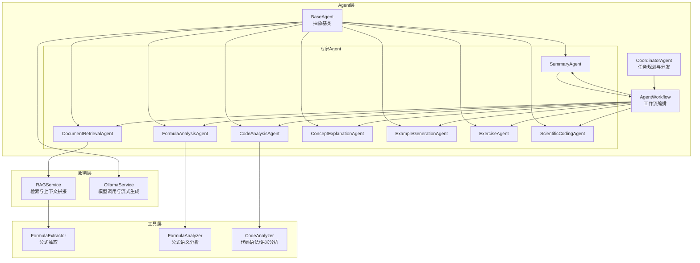
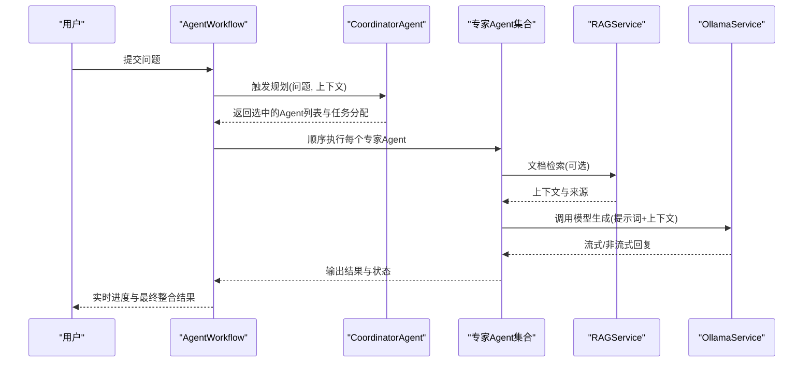
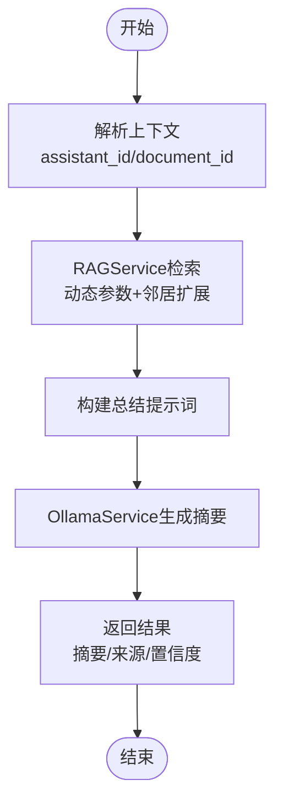
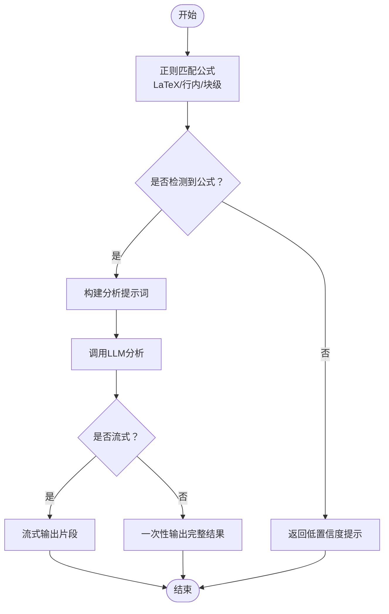
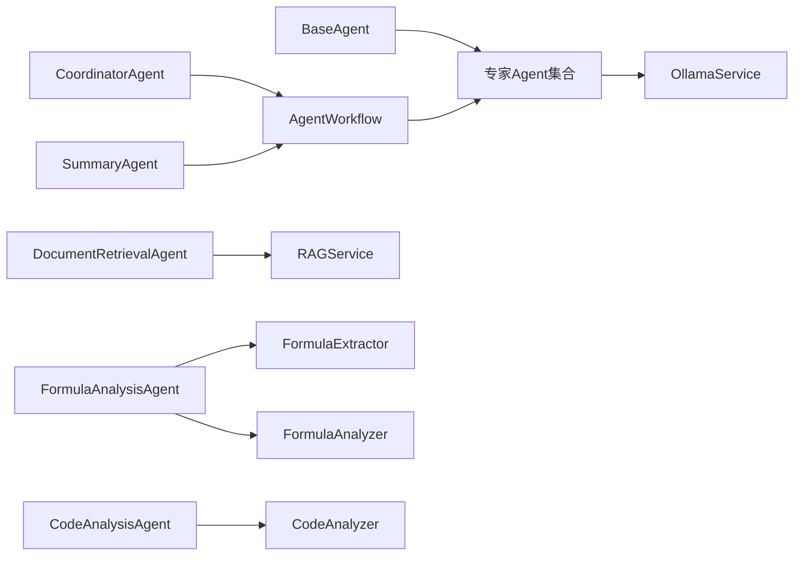

# 专家Agent群组

<cite>
**本文引用的文件**
- [agents/experts/document_retrieval_agent.py](file://agents/experts/document_retrieval_agent.py)
- [agents/experts/formula_analysis_agent.py](file://agents/experts/formula_analysis_agent.py)
- [agents/experts/code_analysis_agent.py](file://agents/experts/code_analysis_agent.py)
- [agents/experts/concept_explanation_agent.py](file://agents/experts/concept_explanation_agent.py)
- [agents/experts/example_generation_agent.py](file://agents/experts/example_generation_agent.py)
- [agents/experts/exercise_agent.py](file://agents/experts/exercise_agent.py)
- [agents/experts/scientific_coding_agent.py](file://agents/experts/scientific_coding_agent.py)
- [agents/experts/summary_agent.py](file://agents/experts/summary_agent.py)
- [agents/base/base_agent.py](file://agents/base/base_agent.py)
- [agents/coordinator/coordinator_agent.py](file://agents/coordinator/coordinator_agent.py)
- [agents/workflow/agent_workflow.py](file://agents/workflow/agent_workflow.py)
- [services/rag_service.py](file://services/rag_service.py)
- [services/ollama_service.py](file://services/ollama_service.py)
- [utils/formula_analyzer.py](file://utils/formula_analyzer.py)
- [utils/formula_extractor.py](file://utils/formula_extractor.py)
- [utils/code_analyzer.py](file://utils/code_analyzer.py)
</cite>

## 目录
1. [引言](#引言)
2. [项目结构](#项目结构)
3. [核心组件](#核心组件)
4. [架构总览](#架构总览)
5. [详细组件分析](#详细组件分析)
6. [依赖分析](#依赖分析)
7. [性能考虑](#性能考虑)
8. [故障排查指南](#故障排查指南)
9. [结论](#结论)
10. [附录](#附录)

## 引言
本文件面向“专家Agent群组”的使用者与开发者，系统化介绍八大专家Agent的能力边界、适用场景、工作原理与协作方式。围绕以下主题展开：
- 文档检索专家：处理文档查询与资料检索，结合RAG服务输出结构化摘要与来源标注
- 公式分析专家：识别并解释数学/物理公式，提供变量含义、适用条件与推导说明
- 代码分析专家：分析代码示例与技术实现，指出优缺点并给出改进建议
- 概念解释专家：深入解释物理学专业概念，提供定义、物理意义与应用示例
- 示例生成专家：生成实际应用示例与计算案例，覆盖从简单到复杂的多层级示例
- 习题专家：根据知识点生成题目或解答用户问题，提供详细解题步骤与多种方法
- 科学计算编码专家：生成MATLAB/Python科学计算代码，强调学术规范与可视化
- 总结专家：整合多Agent输出，提炼核心要点与学习建议

同时，文档阐述Agent基类、协调Agent与工作流编排器如何协同，以及RAG服务、Ollama服务与工具模块如何支撑Agent能力。

## 项目结构
专家Agent群组位于 agents/experts 目录，配合 agents/base、agents/coordinator、agents/workflow 提供统一的抽象、协调与编排；服务层 services 提供RAG与模型调用能力；工具层 utils 提供公式与代码分析工具。

图表来源
- [agents/base/base_agent.py:1-122](file://agents/base/base_agent.py#L1-L122)
- [agents/coordinator/coordinator_agent.py:1-252](file://agents/coordinator/coordinator_agent.py#L1-L252)
- [agents/workflow/agent_workflow.py:1-388](file://agents/workflow/agent_workflow.py#L1-L388)
- [agents/experts/document_retrieval_agent.py:1-79](file://agents/experts/document_retrieval_agent.py#L1-L79)
- [agents/experts/formula_analysis_agent.py:1-107](file://agents/experts/formula_analysis_agent.py#L1-L107)
- [agents/experts/code_analysis_agent.py:1-79](file://agents/experts/code_analysis_agent.py#L1-L79)
- [agents/experts/concept_explanation_agent.py:1-70](file://agents/experts/concept_explanation_agent.py#L1-L70)
- [agents/experts/example_generation_agent.py:1-68](file://agents/experts/example_generation_agent.py#L1-L68)
- [agents/experts/exercise_agent.py:1-102](file://agents/experts/exercise_agent.py#L1-L102)
- [agents/experts/scientific_coding_agent.py:1-82](file://agents/experts/scientific_coding_agent.py#L1-L82)
- [agents/experts/summary_agent.py:1-87](file://agents/experts/summary_agent.py#L1-L87)
- [services/rag_service.py:1-323](file://services/rag_service.py#L1-L323)
- [services/ollama_service.py:1-674](file://services/ollama_service.py#L1-L674)
- [utils/formula_extractor.py:1-149](file://utils/formula_extractor.py#L1-L149)
- [utils/formula_analyzer.py:1-233](file://utils/formula_analyzer.py#L1-L233)
- [utils/code_analyzer.py:1-350](file://utils/code_analyzer.py#L1-L350)

章节来源
- [agents/base/base_agent.py:1-122](file://agents/base/base_agent.py#L1-L122)
- [agents/coordinator/coordinator_agent.py:1-252](file://agents/coordinator/coordinator_agent.py#L1-L252)
- [agents/workflow/agent_workflow.py:1-388](file://agents/workflow/agent_workflow.py#L1-L388)

## 核心组件
- BaseAgent：定义Agent通用接口（默认模型、系统提示词、执行流程、工具与提示词构建），并封装OllamaService调用
- CoordinatorAgent：分析用户问题，智能选择必要专家Agent，返回选中Agent列表与任务分配
- AgentWorkflow：编排多Agent协作，顺序执行专家Agent并输出状态与结果
- 专家Agent：八大专家Agent分别聚焦不同专业领域，统一继承BaseAgent并实现自身execute逻辑
- RAGService：检索知识库、动态调参、邻居扩展、上下文拼接与来源去重
- OllamaService：封装模型调用、提示词构建、工具函数调用与流式/非流式生成
- 工具模块：公式抽取与分析、代码语法/语义分析，辅助专家Agent提升专业能力

章节来源
- [agents/base/base_agent.py:1-122](file://agents/base/base_agent.py#L1-L122)
- [agents/coordinator/coordinator_agent.py:1-252](file://agents/coordinator/coordinator_agent.py#L1-L252)
- [agents/workflow/agent_workflow.py:1-388](file://agents/workflow/agent_workflow.py#L1-L388)
- [services/rag_service.py:1-323](file://services/rag_service.py#L1-L323)
- [services/ollama_service.py:1-674](file://services/ollama_service.py#L1-L674)
- [utils/formula_extractor.py:1-149](file://utils/formula_extractor.py#L1-L149)
- [utils/formula_analyzer.py:1-233](file://utils/formula_analyzer.py#L1-L233)
- [utils/code_analyzer.py:1-350](file://utils/code_analyzer.py#L1-L350)

## 架构总览
专家Agent群组采用“协调-编排-执行”的三层架构：
- 协调层：CoordinatorAgent基于问题特征选择必要专家Agent，遵循“只选必要Agent”的原则
- 编排层：AgentWorkflow顺序执行专家Agent，实时反馈状态与进度，支持流式输出
- 执行层：各专家Agent基于BaseAgent统一接口，结合RAG/Ollama/工具模块完成专业任务

图表来源
- [agents/coordinator/coordinator_agent.py:55-168](file://agents/coordinator/coordinator_agent.py#L55-L168)
- [agents/workflow/agent_workflow.py:106-336](file://agents/workflow/agent_workflow.py#L106-L336)
- [services/rag_service.py:34-266](file://services/rag_service.py#L34-L266)
- [services/ollama_service.py:50-93](file://services/ollama_service.py#L50-L93)

## 详细组件分析

### 文档检索专家（DocumentRetrievalAgent）
- 适用场景
  - 需要从知识库检索与问题相关的文档片段
  - 需要结构化摘要与信息来源标注
  - 支持按文档ID或助手ID过滤检索范围
- 专业能力
  - 调用RAGService进行检索，动态调整检索参数
  - 对检索结果进行邻居扩展与上下文拼接，控制最大token预算
  - 使用LLM对检索内容进行二次总结，标注来源
- 工作原理
  - 接收任务与上下文（可选包含assistant_id、document_id）
  - 调用RAGService.retrieve_context获取上下文与来源
  - 构建总结提示词，调用OllamaService生成摘要
  - 流式/非流式返回结果，包含置信度与原始上下文
- 使用示例
  - 查询“热力学第二定律的推导与应用”，自动检索相关文档并生成摘要
  - 指定document_id仅检索某篇论文，或指定assistant_id限定知识空间
- 配置说明
  - 默认模型名称可在get_default_model中设置
  - 支持通过上下文传入assistant_id与document_id影响检索范围

图表来源
- [agents/experts/document_retrieval_agent.py:25-79](file://agents/experts/document_retrieval_agent.py#L25-L79)
- [services/rag_service.py:34-266](file://services/rag_service.py#L34-L266)
- [services/ollama_service.py:50-93](file://services/ollama_service.py#L50-L93)

章节来源
- [agents/experts/document_retrieval_agent.py:1-79](file://agents/experts/document_retrieval_agent.py#L1-L79)
- [services/rag_service.py:1-323](file://services/rag_service.py#L1-L323)

### 公式分析专家（FormulaAnalysisAgent）
- 适用场景
  - 问题包含LaTeX/行内/块级公式，需要解释物理意义与变量含义
  - 需要推导过程、适用条件与应用场景说明
- 专业能力
  - 从输入文本中提取LaTeX公式（支持多种模式）
  - 调用LLM对公式进行逐条分析，输出变量、关系、函数与结构信息
  - 支持流式输出，便于前端实时渲染
- 工作原理
  - 检测输入是否包含公式，若无则返回低置信度提示
  - 使用正则表达式匹配多种LaTeX公式模式
  - 构建分析提示词，调用OllamaService生成分析结果
- 使用示例
  - 输入“求解简谐振动的周期公式”，自动识别并解释T=2π√(m/k)
  - 输入包含多个公式的问题，逐条分析其物理意义与适用范围
- 配置说明
  - 默认模型名称可在get_default_model中设置
  - 置信度较高（0.9），适合在问题明确包含公式时启用

图表来源
- [agents/experts/formula_analysis_agent.py:26-87](file://agents/experts/formula_analysis_agent.py#L26-L87)
- [utils/formula_extractor.py:29-57](file://utils/formula_extractor.py#L29-L57)
- [utils/formula_analyzer.py:33-77](file://utils/formula_analyzer.py#L33-L77)

章节来源
- [agents/experts/formula_analysis_agent.py:1-107](file://agents/experts/formula_analysis_agent.py#L1-L107)
- [utils/formula_extractor.py:1-149](file://utils/formula_extractor.py#L1-L149)
- [utils/formula_analyzer.py:1-233](file://utils/formula_analyzer.py#L1-L233)

### 代码分析专家（CodeAnalysisAgent）
- 适用场景
  - 问题包含代码片段或需要解释技术实现
  - 需要分析功能、关键逻辑、优缺点与改进建议
- 专业能力
  - 检测输入是否包含代码（代码块/函数/类定义等特征）
  - 若未检测到代码，返回低置信度提示
  - 调用LLM对代码进行功能分析与实现建议
- 工作原理
  - 通过关键词与结构特征判断是否包含代码
  - 构建分析提示词，调用OllamaService生成分析结果
- 使用示例
  - 输入“解释这个Python函数的实现”，自动识别并分析函数逻辑
  - 输入“这段C++代码如何优化”，提供优化建议与替代方案
- 配置说明
  - 默认模型名称可在get_default_model中设置
  - 置信度中等（0.85），适合在问题明确包含代码时启用

章节来源
- [agents/experts/code_analysis_agent.py:1-79](file://agents/experts/code_analysis_agent.py#L1-L79)

### 概念解释专家（ConceptExplanationAgent）
- 适用场景
  - 需要深入解释物理学专业概念与理论
  - 需要定义、物理意义、公式与定律、应用示例与关联关系
- 专业能力
  - 针对概念解释设计系统提示词，覆盖定义、意义、公式、示例与关系
  - 支持流式输出，便于逐步呈现解释内容
- 工作原理
  - 构建概念解释提示词，调用OllamaService生成解释内容
- 使用示例
  - 输入“解释熵的概念及其在热力学中的意义”，输出定义、物理意义与应用
- 配置说明
  - 默认模型名称可在get_default_model中设置
  - 置信度较高（0.9），适合概念性问题

章节来源
- [agents/experts/concept_explanation_agent.py:1-70](file://agents/experts/concept_explanation_agent.py#L1-L70)

### 示例生成专家（ExampleGenerationAgent）
- 适用场景
  - 需要生成实际应用示例与计算案例
  - 需要从简单到复杂的多层级示例与完整解题过程
- 专业能力
  - 生成简单示例、中等难度计算示例与复杂应用场景
  - 每个示例包含完整的解题过程与物理意义说明
- 工作原理
  - 构建示例生成提示词，调用OllamaService生成示例内容
- 使用示例
  - 输入“生成简谐振动的计算示例”，输出从基础到进阶的多个示例
- 配置说明
  - 默认模型名称可在get_default_model中设置
  - 置信度中等（0.85）

章节来源
- [agents/experts/example_generation_agent.py:1-68](file://agents/experts/example_generation_agent.py#L1-L68)

### 习题专家（ExerciseAgent）
- 适用场景
  - 需要根据知识点生成题目（选择、填空、计算、应用题）
  - 需要解答用户提出的问题，提供详细解题步骤与答案验证
- 专业能力
  - 自动判断是“解题”还是“出题”
  - 解题模式：题目分析、思路、推导、计算、验证与总结
  - 出题模式：按知识点生成多种题型与参考答案
- 工作原理
  - 通过关键词判断任务类型
  - 构建相应提示词，调用OllamaService生成结果
- 使用示例
  - 输入“根据能量守恒定律生成几道练习题”，自动生成题目与答案
  - 输入“求解一个自由落体问题”，输出详细解题步骤
- 配置说明
  - 默认模型名称可在get_default_model中设置
  - 置信度较高（0.9）

章节来源
- [agents/experts/exercise_agent.py:1-102](file://agents/experts/exercise_agent.py#L1-L102)

### 科学计算编码专家（ScientificCodingAgent）
- 适用场景
  - 需要生成MATLAB/Python科学计算代码
  - 需要数据可视化、数据处理与分析代码
- 专业能力
  - 生成符合学术规范的代码，包含注释与变量命名规范
  - 提供使用说明、示例数据与运行结果
- 工作原理
  - 构建代码生成提示词，调用OllamaService生成完整代码
- 使用示例
  - 输入“生成一个绘制正弦波的Python脚本”，输出完整代码与注释
- 配置说明
  - 默认模型名称可在get_default_model中设置
  - 置信度中等（0.85）

章节来源
- [agents/experts/scientific_coding_agent.py:1-82](file://agents/experts/scientific_coding_agent.py#L1-L82)

### 总结专家（SummaryAgent）
- 适用场景
  - 需要整合多个专家Agent的输出，提炼核心要点与学习建议
- 专业能力
  - 接收other_results并格式化为提示词的一部分
  - 生成核心要点、关键概念、重要结论与学习建议
- 工作原理
  - 从上下文获取其他Agent结果，构建总结提示词
  - 调用OllamaService生成总结内容
- 使用示例
  - 在完成文档检索、公式分析、示例生成等任务后，调用总结专家整合输出
- 配置说明
  - 默认模型名称可在get_default_model中设置
  - 置信度较高（0.9）

章节来源
- [agents/experts/summary_agent.py:1-87](file://agents/experts/summary_agent.py#L1-L87)

## 依赖分析
- 组件耦合与内聚
  - 专家Agent均继承BaseAgent，共享统一接口与模型调用能力
  - CoordinatorAgent与AgentWorkflow负责任务规划与编排，降低专家Agent间的耦合
  - RAGService与OllamaService作为外部依赖，通过服务层封装，便于替换与扩展
- 直接与间接依赖
  - 专家Agent直接依赖BaseAgent与OllamaService
  - DocumentRetrievalAgent间接依赖RAGService与FormulaExtractor/Analyzer（通过工具模块）
  - SummaryAgent依赖AgentWorkflow收集的other_results
- 外部依赖与集成点
  - OllamaService通过HTTP调用本地/远程模型服务，支持流式与非流式生成
  - RAGService通过MongoDB与向量检索器进行知识检索，支持邻居扩展与动态参数

图表来源
- [agents/base/base_agent.py:1-122](file://agents/base/base_agent.py#L1-L122)
- [agents/coordinator/coordinator_agent.py:1-252](file://agents/coordinator/coordinator_agent.py#L1-L252)
- [agents/workflow/agent_workflow.py:1-388](file://agents/workflow/agent_workflow.py#L1-L388)
- [agents/experts/document_retrieval_agent.py:1-79](file://agents/experts/document_retrieval_agent.py#L1-L79)
- [agents/experts/formula_analysis_agent.py:1-107](file://agents/experts/formula_analysis_agent.py#L1-L107)
- [agents/experts/code_analysis_agent.py:1-79](file://agents/experts/code_analysis_agent.py#L1-L79)
- [agents/experts/summary_agent.py:1-87](file://agents/experts/summary_agent.py#L1-L87)
- [services/rag_service.py:1-323](file://services/rag_service.py#L1-L323)
- [services/ollama_service.py:1-674](file://services/ollama_service.py#L1-L674)
- [utils/formula_extractor.py:1-149](file://utils/formula_extractor.py#L1-L149)
- [utils/formula_analyzer.py:1-233](file://utils/formula_analyzer.py#L1-L233)
- [utils/code_analyzer.py:1-350](file://utils/code_analyzer.py#L1-L350)

章节来源
- [agents/base/base_agent.py:1-122](file://agents/base/base_agent.py#L1-L122)
- [agents/coordinator/coordinator_agent.py:1-252](file://agents/coordinator/coordinator_agent.py#L1-L252)
- [agents/workflow/agent_workflow.py:1-388](file://agents/workflow/agent_workflow.py#L1-L388)

## 性能考虑
- 检索性能
  - RAGService采用动态检索参数（prefetch_k/final_k），根据查询长度与关键词自动调整
  - 并行检索多个知识空间集合，合并结果后按分数去重与排序
  - 上下文拼接时估算token并截断，避免提示词过长导致性能下降
- 生成性能
  - OllamaService支持流式生成，前端可实时渲染，降低感知延迟
  - 非流式生成适用于短文本与确认性输出
- Agent编排
  - AgentWorkflow顺序执行专家Agent，便于前端展示进度与状态
  - 支持按需启用Agent，避免不必要的计算开销

## 故障排查指南
- 协调Agent规划失败
  - 现象：返回默认Agent列表或报错
  - 排查：检查JSON解析逻辑与关键词匹配，确认selected_agents在有效范围内
- 文档检索失败
  - 现象：返回空上下文或错误提示
  - 排查：确认RAGService检索参数、集合名称与知识空间配置；检查MongoDB连接与向量检索器
- 模型调用失败
  - 现象：OllamaService流式/非流式生成异常
  - 排查：检查OLLAMA_BASE_URL与OLLAMA_MODEL环境变量；确认模型服务可达与超时设置
- 公式/代码识别不足
  - 现象：公式分析/代码分析返回低置信度
  - 排查：确认输入格式（LaTeX/代码块/函数/类定义等特征）是否满足识别条件

章节来源
- [agents/coordinator/coordinator_agent.py:130-168](file://agents/coordinator/coordinator_agent.py#L130-L168)
- [services/rag_service.py:294-317](file://services/rag_service.py#L294-L317)
- [services/ollama_service.py:12-34](file://services/ollama_service.py#L12-L34)
- [agents/experts/formula_analysis_agent.py:33-44](file://agents/experts/formula_analysis_agent.py#L33-L44)
- [agents/experts/code_analysis_agent.py:33-41](file://agents/experts/code_analysis_agent.py#L33-L41)

## 结论
专家Agent群组通过“协调-编排-执行”的架构实现了多专家协同与高效输出。八大专家Agent覆盖从知识检索、公式分析、代码理解、概念解释、示例生成、习题处理、科学计算编码到总结整合的完整科研与教学闭环。配合RAG与Ollama服务，以及公式与代码分析工具，能够为用户提供高质量、可溯源、可解释的专业级服务体验。

## 附录
- 使用示例（概念性说明）
  - 复杂问题示例：先由CoordinatorAgent选择“文档检索+公式分析+示例生成+总结专家”，再由AgentWorkflow顺序执行，最终输出整合结果
  - 简单问题示例：CoordinatorAgent仅选择“概念解释专家”，AgentWorkflow顺序执行并返回结果
- 配置建议
  - 根据硬件与延迟需求调整OLLAMA_MODEL与OLLAMA_TIMEOUT
  - 在知识空间较多时，合理设置RAGService的prefetch_k与final_k
  - 在前端开启流式渲染以提升用户体验