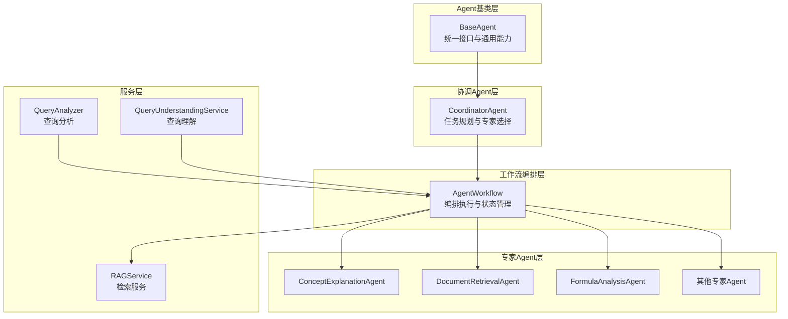
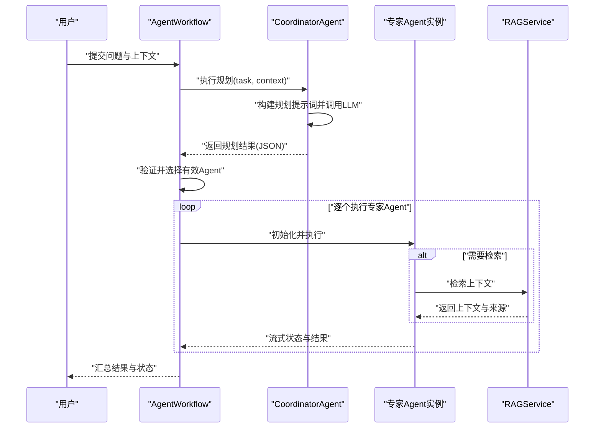
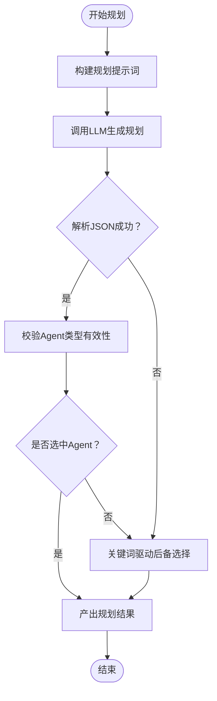
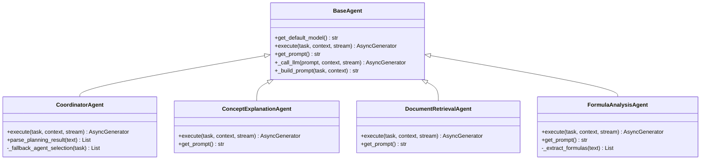
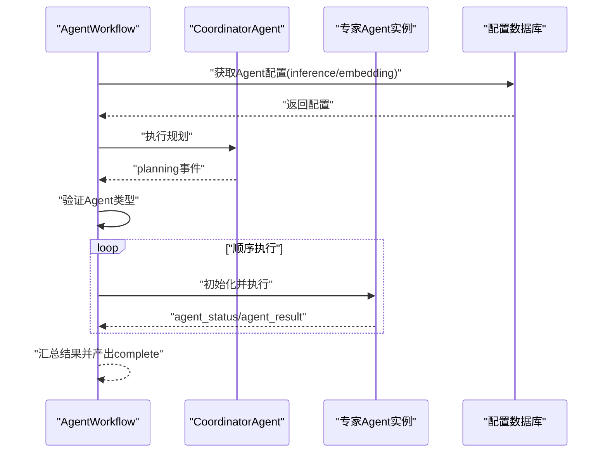
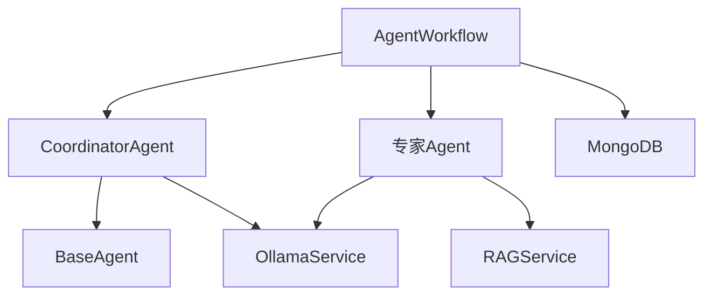

# 协调Agent机制

<cite>
**本文引用的文件**
- [coordinator_agent.py](file://agents/coordinator/coordinator_agent.py)
- [base_agent.py](file://agents/base/base_agent.py)
- [agent_workflow.py](file://agents/workflow/agent_workflow.py)
- [agent_config.py](file://models/agent_config.py)
- [concept_explanation_agent.py](file://agents/experts/concept_explanation_agent.py)
- [document_retrieval_agent.py](file://agents/experts/document_retrieval_agent.py)
- [formula_analysis_agent.py](file://agents/experts/formula_analysis_agent.py)
- [query_analyzer.py](file://services/query_analyzer.py)
- [query_understanding_service.py](file://services/query_understanding_service.py)
- [rag_service.py](file://services/rag_service.py)
</cite>

## 目录
1. [引言](#引言)
2. [项目结构](#项目结构)
3. [核心组件](#核心组件)
4. [架构概览](#架构概览)
5. [详细组件分析](#详细组件分析)
6. [依赖分析](#依赖分析)
7. [性能考量](#性能考量)
8. [故障排除指南](#故障排除指南)
9. [结论](#结论)
10. [附录](#附录)

## 引言
本文件系统性阐述“协调Agent机制”的设计与实现，重点围绕以下目标：
- 解释协调Agent的核心职责与工作原理：任务分析、专家Agent选择策略、规划输出格式
- 说明如何分析用户问题的复杂度与需求，智能判断所需专家Agent并为其分配具体任务
- 给出提示词设计、JSON格式输出规范与错误处理机制
- 提供从问题分析到Agent选择的完整流程示例
- 展示后备Agent选择逻辑的实现细节与最佳实践建议

## 项目结构
该机制位于“agents”子系统中，采用“基类 + 协调Agent + 专家Agent + 工作流编排”的分层架构：
- 基类层：统一抽象与通用能力（如LLM调用、提示词构建）
- 协调Agent层：负责任务规划与专家Agent选择
- 专家Agent层：针对具体任务域的专用Agent
- 工作流编排层：串联协调与专家Agent，管理执行状态与结果聚合

图表来源
- [base_agent.py:8-122](file://agents/base/base_agent.py#L8-L122)
- [coordinator_agent.py:7-252](file://agents/coordinator/coordinator_agent.py#L7-L252)
- [agent_workflow.py:47-388](file://agents/workflow/agent_workflow.py#L47-L388)
- [concept_explanation_agent.py:7-70](file://agents/experts/concept_explanation_agent.py#L7-L70)
- [document_retrieval_agent.py:8-79](file://agents/experts/document_retrieval_agent.py#L8-L79)
- [formula_analysis_agent.py:8-107](file://agents/experts/formula_analysis_agent.py#L8-L107)
- [query_analyzer.py:9-163](file://services/query_analyzer.py#L9-L163)
- [query_understanding_service.py:9-248](file://services/query_understanding_service.py#L9-L248)
- [rag_service.py:8-323](file://services/rag_service.py#L8-L323)

章节来源
- [base_agent.py:1-122](file://agents/base/base_agent.py#L1-L122)
- [coordinator_agent.py:1-252](file://agents/coordinator/coordinator_agent.py#L1-L252)
- [agent_workflow.py:1-388](file://agents/workflow/agent_workflow.py#L1-L388)

## 核心组件
- 协调Agent（CoordinatorAgent）：负责接收用户问题，构建规划提示词，调用LLM生成JSON格式的专家选择与任务分配，并在解析失败时启用后备选择逻辑
- 专家Agent：针对不同任务域的专用Agent，如概念解释、文档检索、公式分析等
- 工作流编排（AgentWorkflow）：串联协调Agent与专家Agent，管理执行顺序、状态上报与结果聚合
- 基类Agent（BaseAgent）：提供统一的提示词构建、LLM调用与通用接口
- 查询分析与理解服务：为系统提供前置分析与结构化解析能力，辅助决策

章节来源
- [coordinator_agent.py:7-252](file://agents/coordinator/coordinator_agent.py#L7-L252)
- [agent_workflow.py:47-388](file://agents/workflow/agent_workflow.py#L47-L388)
- [base_agent.py:8-122](file://agents/base/base_agent.py#L8-L122)

## 架构概览
协调Agent机制的执行流程如下：
1. 接收用户问题与上下文
2. 协调Agent分析问题并生成专家选择与任务分配（JSON）
3. 工作流编排器根据选择结果初始化对应专家Agent
4. 顺序执行专家Agent，实时上报状态与进度
5. 聚合各专家Agent结果并返回最终输出

图表来源
- [agent_workflow.py:106-336](file://agents/workflow/agent_workflow.py#L106-L336)
- [coordinator_agent.py:55-168](file://agents/coordinator/coordinator_agent.py#L55-L168)
- [document_retrieval_agent.py:25-79](file://agents/experts/document_retrieval_agent.py#L25-L79)
- [rag_service.py:34-317](file://services/rag_service.py#L34-L317)

## 详细组件分析

### 协调Agent（CoordinatorAgent）
- 职责
  - 分析用户问题复杂度与需求
  - 智能选择必要专家Agent（避免全量选择）
  - 为每个选中Agent分配具体任务
  - 说明选择理由
- 提示词设计
  - 明确Agent职责与可用专家清单
  - 强调只选择必要Agent与严格JSON输出要求
  - 提供规划提示词模板，包含问题输入与JSON格式约束
- 规划输出格式
  - 字段：selected_agents（Agent类型列表）、agent_tasks（任务描述字典）、reasoning（选择理由）
  - 输出为JSON，支持Markdown代码块包裹
- 错误处理与后备逻辑
  - JSON解析失败时，启用关键词驱动的后备选择逻辑
  - 若未选中任何Agent，回退到默认Agent组合
  - 统一错误输出为“error”类型，包含错误信息

图表来源
- [coordinator_agent.py:55-213](file://agents/coordinator/coordinator_agent.py#L55-L213)

章节来源
- [coordinator_agent.py:7-252](file://agents/coordinator/coordinator_agent.py#L7-L252)

### 专家Agent（示例：概念解释、文档检索、公式分析）
- 概念解释专家（ConceptExplanationAgent）
  - 任务：定义概念、解释本质、说明应用场景、提供示例与类比、解释概念间关系
  - 输出：流式chunk与最终complete结果，包含置信度
- 文档检索专家（DocumentRetrievalAgent）
  - 任务：理解问题需求、检索相关文档片段、整理总结、标注来源
  - 依赖：RAGService检索与LLM总结
- 公式分析专家（FormulaAnalysisAgent）
  - 任务：识别问题中的公式、解释物理意义、分析变量含义、说明适用条件与场景、提供推导过程
  - 特性：内置公式提取（支持LaTeX）

图表来源
- [base_agent.py:8-122](file://agents/base/base_agent.py#L8-L122)
- [coordinator_agent.py:7-252](file://agents/coordinator/coordinator_agent.py#L7-L252)
- [concept_explanation_agent.py:7-70](file://agents/experts/concept_explanation_agent.py#L7-L70)
- [document_retrieval_agent.py:8-79](file://agents/experts/document_retrieval_agent.py#L8-L79)
- [formula_analysis_agent.py:8-107](file://agents/experts/formula_analysis_agent.py#L8-L107)

章节来源
- [concept_explanation_agent.py:1-70](file://agents/experts/concept_explanation_agent.py#L1-L70)
- [document_retrieval_agent.py:1-79](file://agents/experts/document_retrieval_agent.py#L1-L79)
- [formula_analysis_agent.py:1-107](file://agents/experts/formula_analysis_agent.py#L1-L107)

### 工作流编排（AgentWorkflow）
- 功能
  - 异步初始化协调Agent与专家Agent（支持从配置数据库加载模型）
  - 接收协调Agent的规划结果，验证并选择有效Agent
  - 顺序执行专家Agent，实时上报状态（pending/running/completed/error）
  - 聚合专家结果，返回最终汇总
- 关键流程
  - 规划阶段：产出“planning”事件，包含selected_agents、agent_tasks、reasoning
  - 状态上报：对未被选中的Agent标记“skipped”，对被选中的Agent标记“pending”
  - 执行阶段：逐个Agent执行，流式产出“agent_status”和“agent_result”
  - 完成阶段：产出“complete”事件，包含所有Agent结果与统计信息

图表来源
- [agent_workflow.py:62-336](file://agents/workflow/agent_workflow.py#L62-L336)

章节来源
- [agent_workflow.py:1-388](file://agents/workflow/agent_workflow.py#L1-L388)

### 提示词设计与JSON输出规范
- 协调Agent提示词
  - 明确职责：分析复杂度、选择必要Agent、分配任务、说明理由
  - 提供专家Agent清单与选择原则（只选必要、数量建议）
  - 严格要求JSON输出格式，包含selected_agents、agent_tasks、reasoning
- 专家Agent提示词
  - 概念解释：定义、本质、公式、应用、关系
  - 文档检索：理解需求、检索相关片段、整理总结、标注来源
  - 公式分析：识别公式、解释物理意义、变量含义、适用条件、推导过程
- JSON输出规范
  - 规划阶段：必须返回JSON；支持Markdown代码块包裹
  - 解析阶段：优先匹配代码块中的JSON，否则尝试直接解析
  - 失败回退：使用关键词驱动的后备Agent选择与默认任务

章节来源
- [coordinator_agent.py:19-100](file://agents/coordinator/coordinator_agent.py#L19-L100)
- [concept_explanation_agent.py:14-23](file://agents/experts/concept_explanation_agent.py#L14-L23)
- [document_retrieval_agent.py:15-23](file://agents/experts/document_retrieval_agent.py#L15-L23)
- [formula_analysis_agent.py:15-24](file://agents/experts/formula_analysis_agent.py#L15-L24)

### 错误处理机制
- 协调Agent
  - JSON解析失败：记录警告并启用后备Agent选择逻辑
  - 未选中Agent：回退到默认Agent组合
  - 其他异常：统一产出“error”事件
- 工作流编排
  - Agent初始化失败：标记为“error”，继续执行后续Agent
  - 执行异常：记录错误并产出“error”状态
  - 最终汇总：统计成功/失败Agent数量
- 查询分析与理解服务
  - 模型请求失败：使用关键词匹配作为后备方案
  - JSON解析失败：使用简单关键词提取

章节来源
- [coordinator_agent.py:108-168](file://agents/coordinator/coordinator_agent.py#L108-L168)
- [agent_workflow.py:306-336](file://agents/workflow/agent_workflow.py#L306-L336)
- [query_analyzer.py:95-157](file://services/query_analyzer.py#L95-L157)
- [query_understanding_service.py:116-134](file://services/query_understanding_service.py#L116-L134)

### 使用示例：从问题分析到Agent选择的完整流程
- 输入：用户提出一个涉及“传感器原理与应用”的复杂问题
- 协调Agent分析：
  - 识别关键词（传感器、原理、应用）
  - 选择必要Agent：概念解释、文档检索、公式分析
  - 分配任务：解释核心概念、检索相关文档、分析涉及的公式
  - 说明理由：问题包含专业知识、需要文献支撑与公式解释
- 工作流编排：
  - 初始化协调Agent与专家Agent
  - 顺序执行专家Agent，实时上报状态
  - 聚合结果并返回最终输出

章节来源
- [coordinator_agent.py:170-213](file://agents/coordinator/coordinator_agent.py#L170-L213)
- [agent_workflow.py:106-336](file://agents/workflow/agent_workflow.py#L106-L336)

## 依赖分析
- 组件耦合
  - CoordinatorAgent依赖BaseAgent提供的LLM调用与提示词构建能力
  - AgentWorkflow依赖CoordinatorAgent的规划结果与专家Agent映射表
  - 专家Agent依赖RAGService进行文档检索（如适用）
- 外部依赖
  - OllamaService：统一LLM调用
  - MongoDB：Agent配置与助手信息存储
  - RAGService：知识检索与上下文拼接

图表来源
- [base_agent.py:5-25](file://agents/base/base_agent.py#L5-L25)
- [coordinator_agent.py:3-12](file://agents/coordinator/coordinator_agent.py#L3-L12)
- [agent_workflow.py:7-15](file://agents/workflow/agent_workflow.py#L7-L15)
- [rag_service.py:58-95](file://services/rag_service.py#L58-L95)

章节来源
- [base_agent.py:1-122](file://agents/base/base_agent.py#L1-L122)
- [agent_workflow.py:1-388](file://agents/workflow/agent_workflow.py#L1-L388)

## 性能考量
- 模型选择
  - 协调Agent默认使用轻量推理模型，专家Agent根据任务域选择合适模型
  - 支持从配置数据库动态加载模型，便于按需调整
- 流式输出
  - 专家Agent支持流式chunk输出，提升用户体验
  - 工作流编排器实时上报状态，前端可逐步渲染
- 检索优化
  - RAGService动态调节检索参数（prefetch_k、final_k），平衡召回与质量
  - 邻居扩展与去重，控制上下文长度与token预算

章节来源
- [agent_workflow.py:62-104](file://agents/workflow/agent_workflow.py#L62-L104)
- [rag_service.py:11-32](file://services/rag_service.py#L11-L32)
- [rag_service.py:252-266](file://services/rag_service.py#L252-L266)

## 故障排除指南
- 协调Agent规划失败
  - 现象：返回“error”事件
  - 处理：检查提示词格式、模型可用性；确认JSON输出符合规范
- JSON解析失败
  - 现象：日志出现警告，启用后备Agent选择
  - 处理：修正提示词，确保输出严格JSON；或检查模型稳定性
- 专家Agent执行异常
  - 现象：标记为“error”，继续执行其他Agent
  - 处理：查看Agent内部日志，修复依赖（如RAGService）
- 查询分析与理解服务异常
  - 现象：使用关键词匹配后备方案
  - 处理：检查Ollama服务连通性与模型可用性

章节来源
- [coordinator_agent.py:130-168](file://agents/coordinator/coordinator_agent.py#L130-L168)
- [agent_workflow.py:306-336](file://agents/workflow/agent_workflow.py#L306-L336)
- [query_analyzer.py:95-157](file://services/query_analyzer.py#L95-L157)
- [query_understanding_service.py:116-134](file://services/query_understanding_service.py#L116-L134)

## 结论
协调Agent机制通过“任务分析 + 专家选择 + 规划输出 + 编排执行”的闭环，实现了对复杂问题的智能分解与高效执行。其关键优势在于：
- 明确的提示词设计与严格的JSON输出规范，确保规划结果可解析、可追踪
- 完善的后备逻辑与错误处理，提升系统鲁棒性
- 工作流编排的实时状态上报与结果聚合，改善用户体验
- 与RAG服务的深度集成，满足知识密集型任务的需求

## 附录
- Agent类型与职责
  - document_retrieval：文档检索与总结
  - formula_analysis：公式识别与分析
  - code_analysis：代码理解与解释
  - concept_explanation：概念解释与关系梳理
  - example_generation：示例与案例生成
  - exercise：习题生成与解题过程
  - scientific_coding：科学计算代码生成
  - summary：研究结果总结与整合
- 配置模型
  - AgentConfig：包含agent_type、inference_model、embedding_model
  - 支持从数据库动态加载配置，便于运行时调整

章节来源
- [coordinator_agent.py:29-53](file://agents/coordinator/coordinator_agent.py#L29-L53)
- [agent_config.py:6-23](file://models/agent_config.py#L6-L23)