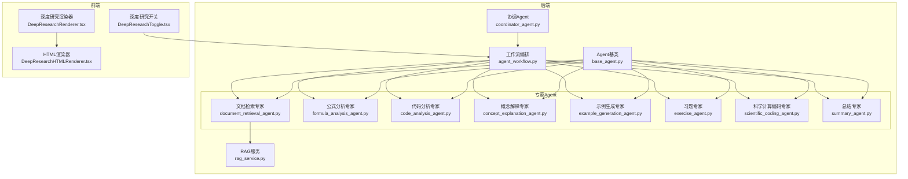
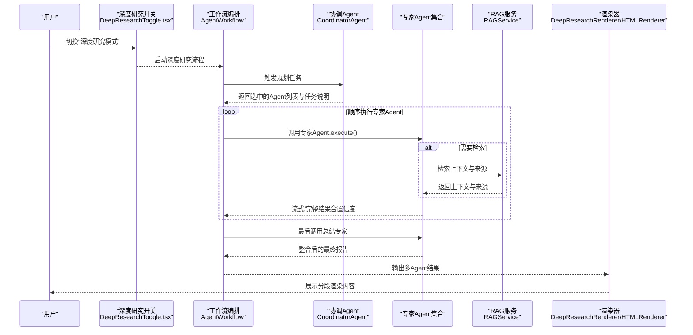
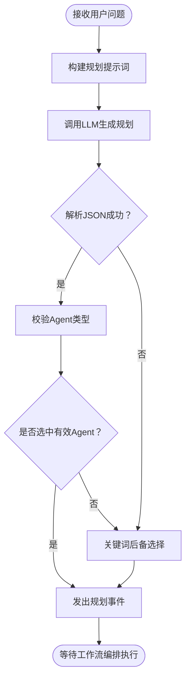
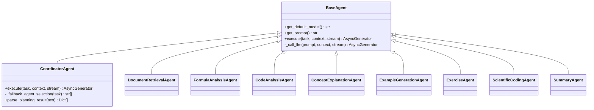
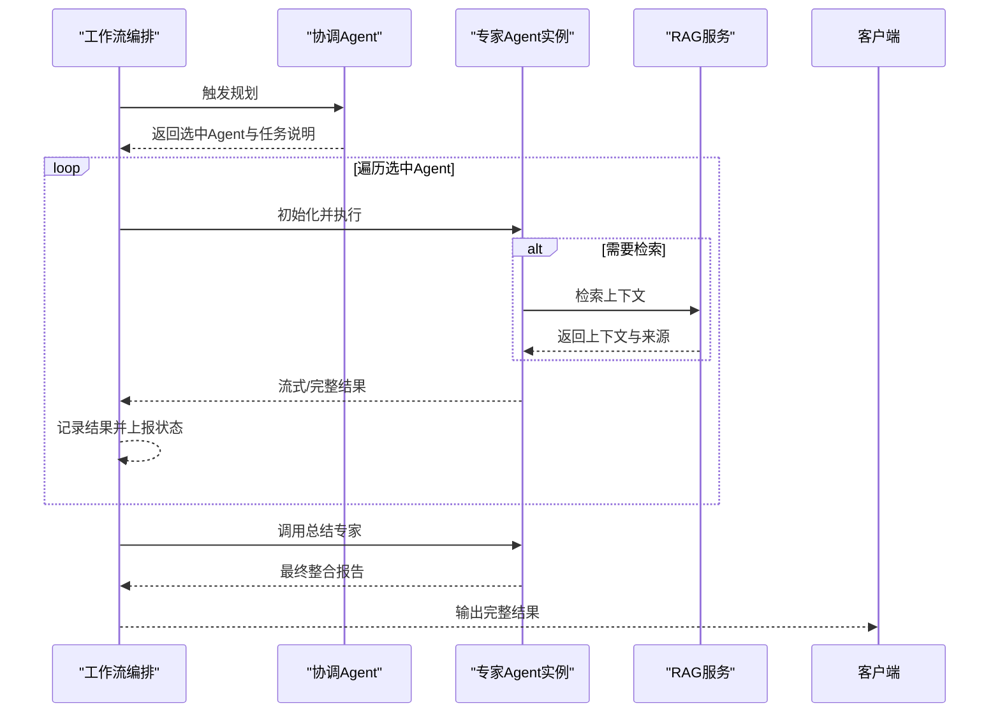
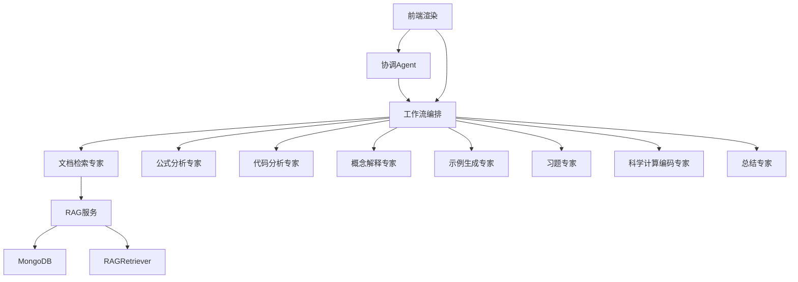

# 深度研究功能

<cite>
**本文引用的文件**
- [agents/coordinator/coordinator_agent.py](file://agents/coordinator/coordinator_agent.py)
- [agents/experts/document_retrieval_agent.py](file://agents/experts/document_retrieval_agent.py)
- [agents/experts/formula_analysis_agent.py](file://agents/experts/formula_analysis_agent.py)
- [agents/experts/code_analysis_agent.py](file://agents/experts/code_analysis_agent.py)
- [agents/experts/concept_explanation_agent.py](file://agents/experts/concept_explanation_agent.py)
- [agents/experts/example_generation_agent.py](file://agents/experts/example_generation_agent.py)
- [agents/experts/exercise_agent.py](file://agents/experts/exercise_agent.py)
- [agents/experts/scientific_coding_agent.py](file://agents/experts/scientific_coding_agent.py)
- [agents/experts/summary_agent.py](file://agents/experts/summary_agent.py)
- [agents/base/base_agent.py](file://agents/base/base_agent.py)
- [agents/workflow/agent_workflow.py](file://agents/workflow/agent_workflow.py)
- [services/rag_service.py](file://services/rag_service.py)
- [web/components/chat/DeepResearchRenderer.tsx](file://web/components/chat/DeepResearchRenderer.tsx)
- [web/components/chat/DeepResearchHTMLRenderer.tsx](file://web/components/chat/DeepResearchHTMLRenderer.tsx)
- [web/components/chat/DeepResearchToggle.tsx](file://web/components/chat/DeepResearchToggle.tsx)
</cite>

## 目录
1. [简介](#简介)
2. [项目结构](#项目结构)
3. [核心组件](#核心组件)
4. [架构总览](#架构总览)
5. [详细组件分析](#详细组件分析)
6. [依赖分析](#依赖分析)
7. [性能考虑](#性能考虑)
8. [故障排查指南](#故障排查指南)
9. [结论](#结论)
10. [附录](#附录)

## 简介
本文件面向Advanced RAG项目的“深度研究”功能，系统性阐述多Agent协作的工作原理与实现细节。该功能通过一个协调Agent对用户问题进行智能分析，自动选择并编排八个专家Agent（文档检索、公式分析、代码分析、概念解释、示例生成、习题、科学计算编码、总结）协同工作，最终整合输出高质量的学术研究结果。文档覆盖任务规划、工作流编排、结果整合、前端渲染与配置说明，并提供典型使用示例。

## 项目结构
深度研究功能涉及后端Agent体系、工作流编排、RAG检索服务以及前端渲染组件。整体结构围绕“协调Agent + 专家Agent + 工作流编排 + RAG服务 + 前端渲染”的链路展开。

图表来源
- [agents/coordinator/coordinator_agent.py:1-252](file://agents/coordinator/coordinator_agent.py#L1-L252)
- [agents/workflow/agent_workflow.py:1-388](file://agents/workflow/agent_workflow.py#L1-L388)
- [agents/experts/document_retrieval_agent.py:1-79](file://agents/experts/document_retrieval_agent.py#L1-L79)
- [agents/experts/formula_analysis_agent.py:1-107](file://agents/experts/formula_analysis_agent.py#L1-L107)
- [agents/experts/code_analysis_agent.py:1-79](file://agents/experts/code_analysis_agent.py#L1-L79)
- [agents/experts/concept_explanation_agent.py:1-70](file://agents/experts/concept_explanation_agent.py#L1-L70)
- [agents/experts/example_generation_agent.py:1-68](file://agents/experts/example_generation_agent.py#L1-L68)
- [agents/experts/exercise_agent.py:1-102](file://agents/experts/exercise_agent.py#L1-L102)
- [agents/experts/scientific_coding_agent.py:1-82](file://agents/experts/scientific_coding_agent.py#L1-L82)
- [agents/experts/summary_agent.py:1-87](file://agents/experts/summary_agent.py#L1-L87)
- [agents/base/base_agent.py:1-122](file://agents/base/base_agent.py#L1-L122)
- [services/rag_service.py:1-323](file://services/rag_service.py#L1-L323)
- [web/components/chat/DeepResearchRenderer.tsx:1-177](file://web/components/chat/DeepResearchRenderer.tsx#L1-L177)
- [web/components/chat/DeepResearchHTMLRenderer.tsx:1-235](file://web/components/chat/DeepResearchHTMLRenderer.tsx#L1-L235)
- [web/components/chat/DeepResearchToggle.tsx:1-53](file://web/components/chat/DeepResearchToggle.tsx#L1-L53)

章节来源
- [agents/coordinator/coordinator_agent.py:1-252](file://agents/coordinator/coordinator_agent.py#L1-L252)
- [agents/workflow/agent_workflow.py:1-388](file://agents/workflow/agent_workflow.py#L1-L388)
- [agents/base/base_agent.py:1-122](file://agents/base/base_agent.py#L1-L122)

## 核心组件
- 协调Agent：负责解析用户问题、智能选择专家Agent、分配任务并给出选择理由；具备JSON规划结果解析与后备Agent选择逻辑。
- 专家Agent：八位专家分别承担文档检索、公式分析、代码分析、概念解释、示例生成、习题处理、科学计算编码与总结整合。
- 工作流编排：统一调度协调Agent与专家Agent，管理Agent实例缓存、并发与顺序执行、状态上报与结果聚合。
- RAG服务：提供检索上下文、来源与推荐资源，支撑文档检索专家的检索与总结。
- 前端渲染：将多Agent结果按Agent类型分段渲染，支持HTML净化与公式渲染，提供深度研究开关。

章节来源
- [agents/coordinator/coordinator_agent.py:1-252](file://agents/coordinator/coordinator_agent.py#L1-L252)
- [agents/experts/document_retrieval_agent.py:1-79](file://agents/experts/document_retrieval_agent.py#L1-L79)
- [agents/experts/formula_analysis_agent.py:1-107](file://agents/experts/formula_analysis_agent.py#L1-L107)
- [agents/experts/code_analysis_agent.py:1-79](file://agents/experts/code_analysis_agent.py#L1-L79)
- [agents/experts/concept_explanation_agent.py:1-70](file://agents/experts/concept_explanation_agent.py#L1-L70)
- [agents/experts/example_generation_agent.py:1-68](file://agents/experts/example_generation_agent.py#L1-L68)
- [agents/experts/exercise_agent.py:1-102](file://agents/experts/exercise_agent.py#L1-L102)
- [agents/experts/scientific_coding_agent.py:1-82](file://agents/experts/scientific_coding_agent.py#L1-L82)
- [agents/experts/summary_agent.py:1-87](file://agents/experts/summary_agent.py#L1-L87)
- [agents/workflow/agent_workflow.py:1-388](file://agents/workflow/agent_workflow.py#L1-L388)
- [services/rag_service.py:1-323](file://services/rag_service.py#L1-L323)
- [web/components/chat/DeepResearchRenderer.tsx:1-177](file://web/components/chat/DeepResearchRenderer.tsx#L1-L177)
- [web/components/chat/DeepResearchHTMLRenderer.tsx:1-235](file://web/components/chat/DeepResearchHTMLRenderer.tsx#L1-L235)
- [web/components/chat/DeepResearchToggle.tsx:1-53](file://web/components/chat/DeepResearchToggle.tsx#L1-L53)

## 架构总览
深度研究采用“协调-执行-汇总”的三层协作模式：
- 协调层：解析问题、选择Agent、下发任务。
- 执行层：专家Agent按序执行，产出内容与置信度。
- 汇总层：总结专家整合各Agent结果，形成最终报告。

图表来源
- [agents/workflow/agent_workflow.py:106-336](file://agents/workflow/agent_workflow.py#L106-L336)
- [agents/coordinator/coordinator_agent.py:55-168](file://agents/coordinator/coordinator_agent.py#L55-L168)
- [agents/experts/document_retrieval_agent.py:25-77](file://agents/experts/document_retrieval_agent.py#L25-L77)
- [services/rag_service.py:34-266](file://services/rag_service.py#L34-L266)
- [web/components/chat/DeepResearchRenderer.tsx:114-175](file://web/components/chat/DeepResearchRenderer.tsx#L114-L175)
- [web/components/chat/DeepResearchHTMLRenderer.tsx:17-235](file://web/components/chat/DeepResearchHTMLRenderer.tsx#L17-L235)

## 详细组件分析

### 协调Agent（CoordinatorAgent）
- 职责：分析用户问题，智能选择所需专家Agent，分配具体任务，说明选择理由；支持JSON规划结果解析与关键词后备选择。
- 关键能力：
  - 规划提示词：明确Agent职责与选择原则，限定返回JSON格式。
  - 任务规划：构造规划提示词并调用LLM生成规划结果，解析JSON并校验Agent类型有效性。
  - 后备策略：若JSON解析失败或未选中Agent，按关键词规则自动选择默认Agent组合。
  - 结果输出：以事件形式返回规划阶段结果，包含选中Agent列表、任务说明与选择理由。
- 适用场景：复杂学术问题的初步拆解与专家组合决策。

图表来源
- [agents/coordinator/coordinator_agent.py:55-213](file://agents/coordinator/coordinator_agent.py#L55-L213)

章节来源
- [agents/coordinator/coordinator_agent.py:1-252](file://agents/coordinator/coordinator_agent.py#L1-L252)

### 专家Agent家族
- 文档检索专家（DocumentRetrievalAgent）
  - 能力：检索相关文档片段，总结关键信息并标注来源；支持推荐资源。
  - 适用：需要权威资料支撑的学术问题。
- 公式分析专家（FormulaAnalysisAgent）
  - 能力：识别并解释公式、变量、适用条件与应用场景；可提供推导过程。
  - 适用：物理/数学问题中的公式解读与推导。
- 代码分析专家（CodeAnalysisAgent）
  - 能力：分析代码功能、逻辑、优缺点与改进建议；适用于技术实现讨论。
  - 适用：代码理解与优化建议。
- 概念解释专家（ConceptExplanationAgent）
  - 能力：深入解释专业概念、物理意义、应用场景与关联关系。
  - 适用：基础概念澄清与知识梳理。
- 示例生成专家（ExampleGenerationAgent）
  - 能力：生成从简单到复杂的应用示例与完整解题过程。
  - 适用：教学与实践结合的学习场景。
- 习题专家（ExerciseAgent）
  - 能力：区分解题与出题模式，提供详细解题步骤与多种解法。
  - 适用：练习与测评场景。
- 科学计算编码专家（ScientificCodingAgent）
  - 能力：生成符合学术规范的MATLAB/Python科学计算代码，含注释与可视化。
  - 适用：仿真、数据分析与可视化。
- 总结专家（SummaryAgent）
  - 能力：整合多Agent结果，提炼核心要点与学习建议。
  - 适用：研究结论与报告收尾。

图表来源
- [agents/base/base_agent.py:8-122](file://agents/base/base_agent.py#L8-L122)
- [agents/coordinator/coordinator_agent.py:7-252](file://agents/coordinator/coordinator_agent.py#L7-L252)
- [agents/experts/document_retrieval_agent.py:8-79](file://agents/experts/document_retrieval_agent.py#L8-L79)
- [agents/experts/formula_analysis_agent.py:8-107](file://agents/experts/formula_analysis_agent.py#L8-L107)
- [agents/experts/code_analysis_agent.py:7-79](file://agents/experts/code_analysis_agent.py#L7-L79)
- [agents/experts/concept_explanation_agent.py:7-70](file://agents/experts/concept_explanation_agent.py#L7-L70)
- [agents/experts/example_generation_agent.py:7-68](file://agents/experts/example_generation_agent.py#L7-L68)
- [agents/experts/exercise_agent.py:7-102](file://agents/experts/exercise_agent.py#L7-L102)
- [agents/experts/scientific_coding_agent.py:7-82](file://agents/experts/scientific_coding_agent.py#L7-L82)
- [agents/experts/summary_agent.py:7-87](file://agents/experts/summary_agent.py#L7-L87)

章节来源
- [agents/base/base_agent.py:1-122](file://agents/base/base_agent.py#L1-L122)
- [agents/experts/document_retrieval_agent.py:1-79](file://agents/experts/document_retrieval_agent.py#L1-L79)
- [agents/experts/formula_analysis_agent.py:1-107](file://agents/experts/formula_analysis_agent.py#L1-L107)
- [agents/experts/code_analysis_agent.py:1-79](file://agents/experts/code_analysis_agent.py#L1-L79)
- [agents/experts/concept_explanation_agent.py:1-70](file://agents/experts/concept_explanation_agent.py#L1-L70)
- [agents/experts/example_generation_agent.py:1-68](file://agents/experts/example_generation_agent.py#L1-L68)
- [agents/experts/exercise_agent.py:1-102](file://agents/experts/exercise_agent.py#L1-L102)
- [agents/experts/scientific_coding_agent.py:1-82](file://agents/experts/scientific_coding_agent.py#L1-L82)
- [agents/experts/summary_agent.py:1-87](file://agents/experts/summary_agent.py#L1-L87)

### 工作流编排（AgentWorkflow）
- 职责：统一管理协调Agent与专家Agent的生命周期，按序执行并上报状态，聚合结果并触发总结专家。
- 关键流程：
  - 异步加载配置：从数据库获取Agent模型配置，支持延迟初始化与缓存。
  - 任务规划：协调Agent返回选中Agent列表与任务说明。
  - 执行调度：顺序执行专家Agent，实时上报状态（pending/running/completed/error）。
  - 结果聚合：收集各Agent结果，交由总结专家整合，输出最终报告。
- 并发与顺序：当前实现为顺序执行，便于前端进度展示；如需提升吞吐，可在保持一致性的同时引入并行执行与结果合并。

图表来源
- [agents/workflow/agent_workflow.py:106-336](file://agents/workflow/agent_workflow.py#L106-L336)

章节来源
- [agents/workflow/agent_workflow.py:1-388](file://agents/workflow/agent_workflow.py#L1-L388)

### RAG服务（RAGService）
- 职责：封装检索逻辑，动态调整检索参数，支持多集合并行检索、邻居扩展、去重与上下文截断，保证token预算。
- 关键能力：
  - 动态检索参数：根据问题类型（对比/列举/条款）调整prefetch_k与final_k。
  - 并行检索：对多个知识空间集合并行检索，合并结果。
  - 上下文构建：拼接命中块与邻居扩展文本，控制最大token预算。
  - 来源标注：按分数排序并去重，标注文档/附件来源。
- 适用场景：需要权威知识支撑的学术研究与问答。

章节来源
- [services/rag_service.py:1-323](file://services/rag_service.py#L1-L323)

### 前端渲染组件
- 深度研究渲染器（DeepResearchRenderer.tsx）
  - 功能：将多Agent结果按Agent类型分段渲染，支持HTML转Markdown与纯文本样式标题。
- HTML渲染器（DeepResearchHTMLRenderer.tsx）
  - 功能：DOMPurify净化HTML、公式渲染（KaTeX/MathJax）、表格响应式、图片懒加载与外链处理。
- 深度研究开关（DeepResearchToggle.tsx）
  - 功能：本地存储用户偏好，切换深度研究模式。

章节来源
- [web/components/chat/DeepResearchRenderer.tsx:1-177](file://web/components/chat/DeepResearchRenderer.tsx#L1-L177)
- [web/components/chat/DeepResearchHTMLRenderer.tsx:1-235](file://web/components/chat/DeepResearchHTMLRenderer.tsx#L1-L235)
- [web/components/chat/DeepResearchToggle.tsx:1-53](file://web/components/chat/DeepResearchToggle.tsx#L1-L53)

## 依赖分析
- 组件耦合：
  - 协调Agent与工作流编排紧密耦合，前者负责规划，后者负责执行。
  - 专家Agent均继承自BaseAgent，共享统一的LLM调用与提示词构建能力。
  - 文档检索专家依赖RAG服务，RAG服务依赖数据库与检索器。
  - 前端渲染组件依赖后端输出的多Agent结果，HTML渲染器进一步依赖公式渲染库。
- 外部依赖：
  - LLM推理：通过OllamaService统一调用。
  - 数据库：Agent配置与知识空间集合名称存储于MongoDB。
  - 检索：RAGRetriever负责向量检索与重排。

图表来源
- [agents/workflow/agent_workflow.py:47-104](file://agents/workflow/agent_workflow.py#L47-L104)
- [services/rag_service.py:58-121](file://services/rag_service.py#L58-L121)

章节来源
- [agents/workflow/agent_workflow.py:1-388](file://agents/workflow/agent_workflow.py#L1-L388)
- [services/rag_service.py:1-323](file://services/rag_service.py#L1-L323)

## 性能考虑
- 检索参数动态调整：根据问题类型自动调节prefetch_k与final_k，平衡召回与质量。
- 上下文截断：估算tokens并截断，避免超长prompt导致性能下降。
- 并行检索：多集合并行检索，缩短总体延迟。
- Agent顺序执行：便于前端进度反馈；如需提升吞吐，可引入并行执行与结果合并。
- 缓存策略：工作流对Agent配置与实例进行缓存，减少重复初始化开销。

## 故障排查指南
- 协调Agent规划失败
  - 现象：返回error事件或未选中Agent。
  - 排查：确认提示词格式与JSON结构；检查后备选择逻辑是否生效。
  - 参考路径：[agents/coordinator/coordinator_agent.py:162-168](file://agents/coordinator/coordinator_agent.py#L162-L168)
- 专家Agent执行异常
  - 现象：返回error状态或执行中断。
  - 排查：查看Agent日志与上下文传递；确认模型可用性与网络连通性。
  - 参考路径：[agents/experts/document_retrieval_agent.py:71-77](file://agents/experts/document_retrieval_agent.py#L71-L77)
- RAG检索失败
  - 现象：检索结果为空或报错。
  - 排查：检查知识空间集合名称、向量模型、数据库连接与运行时配置。
  - 参考路径：[services/rag_service.py:294-317](file://services/rag_service.py#L294-L317)
- 前端渲染异常
  - 现象：HTML未正确渲染或公式不显示。
  - 排查：确认DOMPurify加载、公式渲染库可用、容器引用正确。
  - 参考路径：[web/components/chat/DeepResearchHTMLRenderer.tsx:23-191](file://web/components/chat/DeepResearchHTMLRenderer.tsx#L23-L191)

章节来源
- [agents/coordinator/coordinator_agent.py:162-168](file://agents/coordinator/coordinator_agent.py#L162-L168)
- [agents/experts/document_retrieval_agent.py:71-77](file://agents/experts/document_retrieval_agent.py#L71-L77)
- [services/rag_service.py:294-317](file://services/rag_service.py#L294-L317)
- [web/components/chat/DeepResearchHTMLRenderer.tsx:23-191](file://web/components/chat/DeepResearchHTMLRenderer.tsx#L23-L191)

## 结论
Advanced RAG的深度研究功能通过“协调-执行-汇总”的多Agent协作模式，实现了对复杂学术问题的系统化解析与高质量回答。协调Agent负责智能选角与任务分配，专家Agent覆盖从知识检索到公式分析、代码实现与总结整合的全链路能力，工作流编排保障执行顺序与状态可见性，RAG服务提供权威知识支撑，前端渲染确保结果可读性与可编辑性。该架构既满足教学与研究场景的深度需求，又具备良好的扩展性与稳定性。

## 附录

### 使用示例
- 示例1：物理公式推导与应用
  - 输入：关于热力学第二定律的推导与工程应用问题。
  - 协调Agent选择：公式分析专家、概念解释专家、示例生成专家、总结专家。
  - 输出：公式解释、推导过程、工程应用示例与总结。
- 示例2：代码实现与优化建议
  - 输入：一段Python科学计算代码，请求解释与优化。
  - 协调Agent选择：代码分析专家、科学计算编码专家、总结专家。
  - 输出：代码分析、优化建议与改进代码。
- 示例3：教学练习与解题
  - 输入：高中物理力学练习题。
  - 协调Agent选择：习题专家、概念解释专家、示例生成专家。
  - 输出：题目生成与详细解题步骤。

### 配置说明
- Agent模型配置
  - 通过数据库集合“agent_configs”存储各Agent的推理模型与嵌入模型，工作流异步加载并缓存。
  - 参考路径：[agents/workflow/agent_workflow.py:18-44](file://agents/workflow/agent_workflow.py#L18-L44)
- 深度研究开关
  - 前端组件支持本地存储用户偏好，切换“深度研究模式”，启动多Agent协作。
  - 参考路径：[web/components/chat/DeepResearchToggle.tsx:14-29](file://web/components/chat/DeepResearchToggle.tsx#L14-L29)