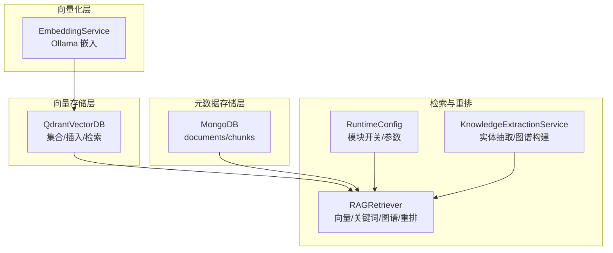
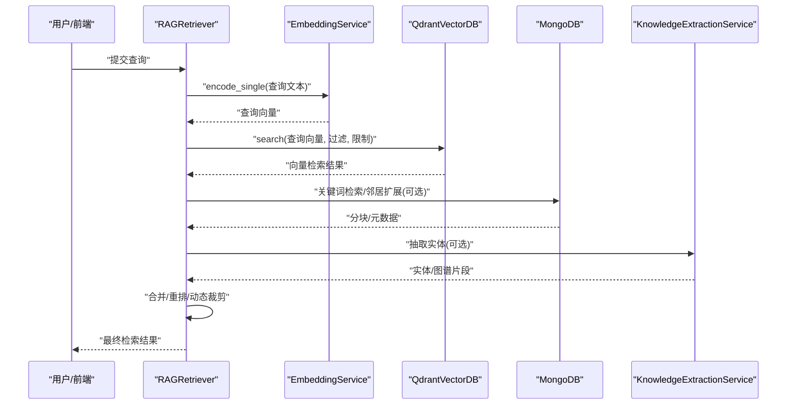
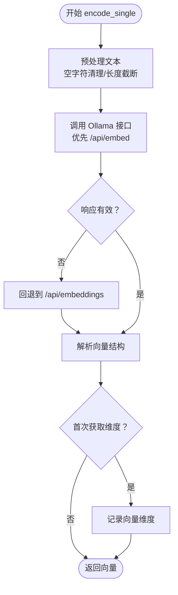
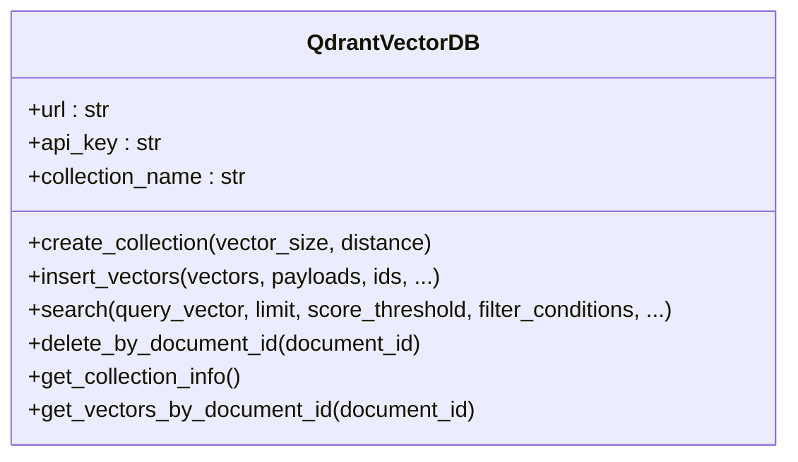
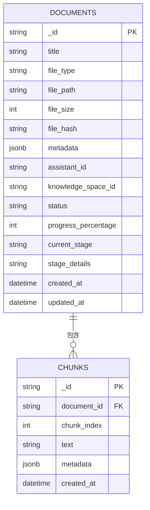
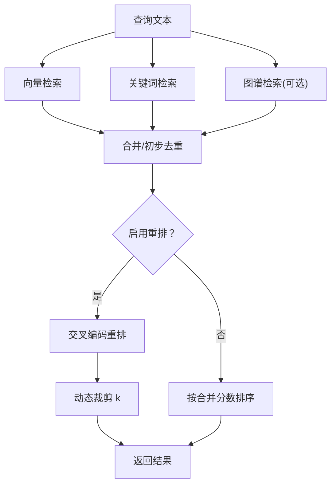
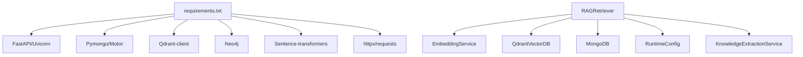

# 向量化与存储

<cite>
**本文引用的文件**
- [embedding_service.py](file://embedding/embedding_service.py)
- [qdrant_client.py](file://database/qdrant_client.py)
- [mongodb.py](file://database/mongodb.py)
- [rag_retriever.py](file://retrieval/rag_retriever.py)
- [runtime_config.py](file://services/runtime_config.py)
- [knowledge_extraction_service.py](file://services/knowledge_extraction_service.py)
- [requirements.txt](file://requirements.txt)
</cite>

## 目录
1. [简介](#简介)
2. [项目结构](#项目结构)
3. [核心组件](#核心组件)
4. [架构总览](#架构总览)
5. [详细组件分析](#详细组件分析)
6. [依赖关系分析](#依赖关系分析)
7. [性能考量](#性能考量)
8. [故障排查指南](#故障排查指南)
9. [结论](#结论)
10. [附录](#附录)

## 简介
本章节面向 Advanced RAG 项目的向量化与存储系统，围绕嵌入向量服务、Qdrant 向量数据库与 MongoDB 文档元数据存储展开，系统阐述模型选择策略、向量生成流程、索引与相似度配置、批量插入优化、性能调优与召回/精确率平衡策略。读者可据此理解从文本到向量、再到检索与重排的完整链路。

## 项目结构
- 向量化服务：负责将文本编码为向量，当前实现基于 Ollama 的嵌入模型。
- 向量存储：使用 Qdrant，提供集合管理、批量插入、相似度检索与过滤。
- 文档元数据存储：使用 MongoDB，保存文档与分块元数据，支撑检索与上下文拼接。
- 检索与重排：RAG 检索器整合向量、关键词与图谱检索，并支持在线动态裁剪与交叉编码重排。
- 运行时配置：通过 MongoDB 持久化的运行时配置，控制模块开关与参数，支撑性能与功能的动态调整。

图表来源
- [embedding_service.py](file://embedding/embedding_service.py)
- [qdrant_client.py](file://database/qdrant_client.py)
- [mongodb.py](file://database/mongodb.py)
- [rag_retriever.py](file://retrieval/rag_retriever.py)
- [runtime_config.py](file://services/runtime_config.py)
- [knowledge_extraction_service.py](file://services/knowledge_extraction_service.py)

章节来源
- [embedding_service.py](file://embedding/embedding_service.py)
- [qdrant_client.py](file://database/qdrant_client.py)
- [mongodb.py](file://database/mongodb.py)
- [rag_retriever.py](file://retrieval/rag_retriever.py)
- [runtime_config.py](file://services/runtime_config.py)
- [knowledge_extraction_service.py](file://services/knowledge_extraction_service.py)

## 核心组件
- 嵌入向量服务（EmbeddingService）
  - 基于 Ollama 的嵌入模型，支持模型名称规范化与自动检测，提供单条与批量向量编码。
  - 内置超时与重试机制，适配不同模型接口差异。
- Qdrant 向量数据库客户端（QdrantVectorDB）
  - 集合创建与维度校验、批量 upsert、gRPC 连接优化、重试与维度自动重建、过滤检索与集合信息查询。
- MongoDB 文档与分块仓库（DocumentRepository/ChunkRepository）
  - 文档元数据存储、状态与进度管理、分块 CRUD、邻居扩展与上下文拼接支持。
- RAG 检索器（RAGRetriever）
  - 混合检索（向量/关键词/图谱）、在线动态裁剪 k、交叉编码重排、运行时配置驱动。
- 运行时配置（RuntimeConfig）
  - 模块开关与参数持久化缓存，支持低/高/自定义模式，动态调整性能与功能。
- 知识抽取服务（KnowledgeExtractionService）
  - 从文本抽取三元组并写入 Neo4j，辅助图谱检索。

章节来源
- [embedding_service.py](file://embedding/embedding_service.py)
- [qdrant_client.py](file://database/qdrant_client.py)
- [mongodb.py](file://database/mongodb.py)
- [rag_retriever.py](file://retrieval/rag_retriever.py)
- [runtime_config.py](file://services/runtime_config.py)
- [knowledge_extraction_service.py](file://services/knowledge_extraction_service.py)

## 架构总览
下图展示从文本到向量、入库、检索与重排的整体流程，以及各组件间的交互关系。

图表来源
- [rag_retriever.py](file://retrieval/rag_retriever.py)
- [embedding_service.py](file://embedding/embedding_service.py)
- [qdrant_client.py](file://database/qdrant_client.py)
- [mongodb.py](file://database/mongodb.py)
- [knowledge_extraction_service.py](file://services/knowledge_extraction_service.py)

## 详细组件分析

### 嵌入向量服务（EmbeddingService）
- 模型选择与检测
  - 支持显式配置模型名，自动规范化（含标签处理）；若未配置则扫描可用模型并按关键字优先级选择。
  - 支持新旧接口回退（/api/embed 与 /api/embeddings），提升兼容性。
- 文本预处理与向量计算
  - 对空字符与过长文本进行处理，避免 Ollama 上下文超限错误。
  - 首次调用时探测向量维度，后续复用。
- 批量与重试
  - 当前实现逐条调用，便于兼容不同模型行为；具备超时与连接错误的指数退避重试。
- 环境变量与部署
  - 通过环境变量控制 Ollama 地址、模型名、最大字符数、超时等。

图表来源
- [embedding_service.py](file://embedding/embedding_service.py)

章节来源
- [embedding_service.py](file://embedding/embedding_service.py)

### Qdrant 向量数据库客户端（QdrantVectorDB）
- 连接与健康检查
  - 优先使用 gRPC（端口 6334）以规避 HTTP/httpx 502 问题，支持连接复用与超时配置。
  - 本地 HTTP 连接自动忽略 API key，避免安全告警。
- 集合管理
  - 创建集合时校验维度，不匹配则重建；支持单向量与多向量配置兼容。
- 批量插入（upsert）
  - 自动生成 UUID ID，ID 格式标准化；维度不匹配时自动重建集合；重试机制覆盖常见临时性错误。
- 检索与过滤
  - 支持 score_threshold、过滤条件（如 document_id）、按向量相似度检索；集合不存在时可自动创建。
- 元数据与统计
  - 提供集合信息查询、按文档 ID 获取向量、删除等操作。

图表来源
- [qdrant_client.py](file://database/qdrant_client.py)

章节来源
- [qdrant_client.py](file://database/qdrant_client.py)

### MongoDB 文档与分块仓库（DocumentRepository/ChunkRepository）
- 文档元数据
  - 存储标题、文件类型、路径、大小、哈希、知识空间/助手关联、状态与进度等。
  - 支持重复检测（基于文件哈希）、状态与进度更新、列表与计数查询。
- 分块管理
  - 保存分块文本、索引、元数据（内容类型、分块器类型、token 数、章节路径、文件类型）。
  - 支持按文档获取分块、按索引批量获取、邻居扩展、按文档删除分块。
- 连接与池化
  - 异步 Motor 与同步 PyMongo 双客户端，连接池参数可配置，支持 ping 校验与错误提示。

图表来源
- [mongodb.py](file://database/mongodb.py)

章节来源
- [mongodb.py](file://database/mongodb.py)

### RAG 检索器（RAGRetriever）
- 检索策略
  - 并行执行向量检索、关键词检索、图谱检索（可选）。
  - 向量检索：基于 EmbeddingService 编码查询，调用 QdrantVectorDB 检索。
  - 关键词检索：按文档 ID 限定范围，基于分词交集计算匹配度。
  - 图谱检索：基于 KnowledgeExtractionService 抽取实体，Cypher 查询一跳邻居并构造上下文。
- 重排与动态裁剪
  - 可选 CrossEncoder 重排，控制 token 预算，避免长 chunk 导致延迟。
  - 在线动态裁剪 k：依据重排分数分布（top1 与 topN 差距）自适应调整返回数量，平衡召回与精确率。
- 运行时配置
  - 通过 RuntimeConfig 控制模块开关（kg_extract_enabled/kg_retrieve_enabled/rerank_enabled 等）与参数（并发、批大小、超时等）。

图表来源
- [rag_retriever.py](file://retrieval/rag_retriever.py)
- [runtime_config.py](file://services/runtime_config.py)
- [knowledge_extraction_service.py](file://services/knowledge_extraction_service.py)

章节来源
- [rag_retriever.py](file://retrieval/rag_retriever.py)
- [runtime_config.py](file://services/runtime_config.py)
- [knowledge_extraction_service.py](file://services/knowledge_extraction_service.py)

### 运行时配置（RuntimeConfig）
- 模式与模块
  - low/high/custom 三种模式，分别预设模块开关与参数；custom 模式保留基础能力（embedding 始终开启）。
- 参数项
  - kg_concurrency、kg_chunk_timeout_s、kg_max_chunks、embedding_batch_size、embedding_concurrency、ocr_concurrency 等。
- 缓存与持久化
  - MongoDB 持久化，TTL 缓存，异步/同步读取接口，支持热更新。

章节来源
- [runtime_config.py](file://services/runtime_config.py)

### 知识抽取服务（KnowledgeExtractionService）
- 三元组抽取
  - 使用 Ollama 生成 JSON 格式的实体-关系-实体三元组，解析与修复输出。
- 实体提取
  - 从查询中提取关键实体，用于图谱检索。
- 图谱构建
  - 将三元组写入 Neo4j，规范化关系类型，携带 source_doc/source_chunk 元信息。

章节来源
- [knowledge_extraction_service.py](file://services/knowledge_extraction_service.py)

## 依赖关系分析
- 第三方依赖
  - FastAPI、Uvicorn、Pymongo/Motor、Qdrant-client、Neo4j、Sentence-transformers、Requests、httpx 等。
- 组件耦合
  - RAGRetriever 依赖 EmbeddingService、QdrantVectorDB、MongoDB、RuntimeConfig、KnowledgeExtractionService。
  - QdrantVectorDB 依赖 qdrant-client；MongoDB 依赖 pymongo/motor；EmbeddingService 依赖 requests。

图表来源
- [requirements.txt](file://requirements.txt)
- [rag_retriever.py](file://retrieval/rag_retriever.py)
- [embedding_service.py](file://embedding/embedding_service.py)
- [qdrant_client.py](file://database/qdrant_client.py)
- [mongodb.py](file://database/mongodb.py)
- [runtime_config.py](file://services/runtime_config.py)
- [knowledge_extraction_service.py](file://services/knowledge_extraction_service.py)

章节来源
- [requirements.txt](file://requirements.txt)
- [rag_retriever.py](file://retrieval/rag_retriever.py)

## 性能考量
- 向量生成
  - 文本预处理：避免空字符与过长文本，减少 Ollama 上下文超限风险。
  - 模型接口回退：兼容新旧接口，降低因服务端变更导致的失败。
  - 重试策略：超时与连接错误采用指数退避，提升稳定性。
- 向量存储
  - gRPC 连接：优先使用 gRPC（端口 6334）以规避 HTTP/httpx 502 问题，支持连接复用。
  - 批量 upsert：自动维度校验与重建，重试覆盖常见临时性错误。
  - 过滤检索：结合 document_id 等条件缩小候选集，提升检索效率。
- 元数据存储
  - 连接池参数可配置，异步 Motor 与同步 PyMongo 双栈，满足不同场景并发需求。
  - 分块邻居扩展与按索引批量获取，支持高效上下文拼接。
- 检索与重排
  - 并行检索：向量、关键词、图谱检索并行执行，缩短端到端延迟。
  - 动态裁剪 k：依据重排分数分布自适应调整返回数量，兼顾召回与精确率。
  - 重排 token 预算：控制输入长度，避免长文本导致的延迟与内存压力。

章节来源
- [embedding_service.py](file://embedding/embedding_service.py)
- [qdrant_client.py](file://database/qdrant_client.py)
- [mongodb.py](file://database/mongodb.py)
- [rag_retriever.py](file://retrieval/rag_retriever.py)

## 故障排查指南
- Ollama 嵌入失败
  - 现象：超时、连接错误、模型未找到、返回空向量。
  - 处理：检查 Ollama 地址与模型名，确认模型存在；启用重试与日志级别；必要时调整最大字符数。
- Qdrant 插入失败
  - 现象：维度不匹配、502/503/504、超时、连接错误。
  - 处理：自动重建集合（维度不匹配时）；指数退避重试；确认 gRPC 连接与超时配置。
- Qdrant 检索失败
  - 现象：集合不存在、查询异常。
  - 处理：自动创建集合（按查询向量维度）；检查过滤条件与阈值设置。
- MongoDB 连接失败
  - 现象：连接字符串错误、认证失败、服务器选择超时。
  - 处理：核对环境变量与连接池参数；确认服务可达与凭据正确；必要时使用 .env 文件。

章节来源
- [embedding_service.py](file://embedding/embedding_service.py)
- [qdrant_client.py](file://database/qdrant_client.py)
- [mongodb.py](file://database/mongodb.py)

## 结论
Advanced RAG 的向量化与存储体系以 Ollama 嵌入为核心，结合 Qdrant 的高性能向量检索与 MongoDB 的灵活元数据管理，形成可扩展、可配置、可调优的检索链路。通过运行时配置与动态裁剪策略，系统在召回与精确率之间取得良好平衡；通过 gRPC 连接、批量 upsert 与重试机制，显著提升了稳定性与吞吐。建议在生产环境中合理设置模型与参数，持续监控检索质量与性能指标，按需扩展硬件资源与索引策略。

## 附录
- 环境变量与关键参数
  - Ollama：OLLAMA_BASE_URL、OLLAMA_EMBEDDING_MODEL、OLLAMA_EMBEDDING_MAX_CHARS
  - Qdrant：QDRANT_URL、QDRANT_API_KEY、QDRANT_TIMEOUT、QDRANT_GRPC_PORT
  - MongoDB：MONGODB_URI/MONGODB_HOST/MONGODB_PORT/MONGODB_USERNAME/MONGODB_PASSWORD/MONGODB_AUTH_SOURCE/MONGODB_DB_NAME
  - 运行时配置：通过 MongoDB 集合 app_settings 持久化，支持 TTL 缓存与热更新
- 依赖版本要点
  - qdrant-client、pymongo/motor、neo4j、sentence-transformers、requests/httpx 等

章节来源
- [requirements.txt](file://requirements.txt)
- [runtime_config.py](file://services/runtime_config.py)