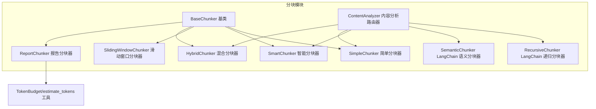
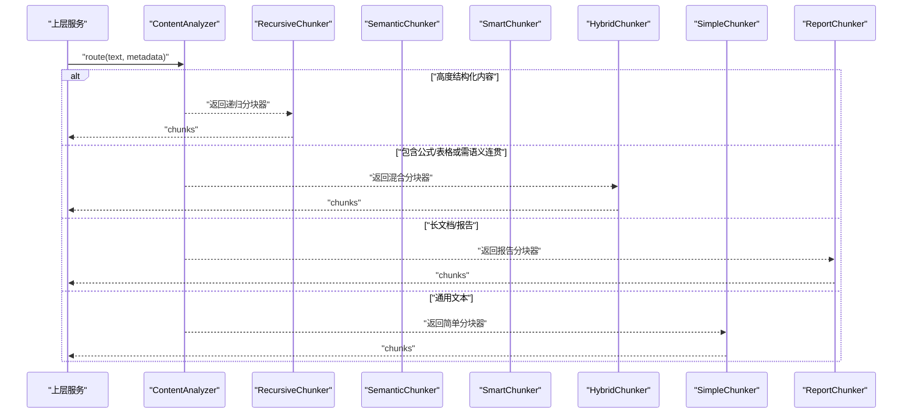
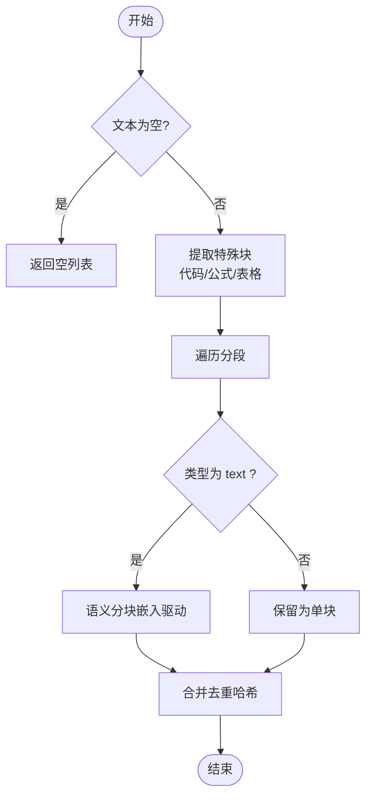
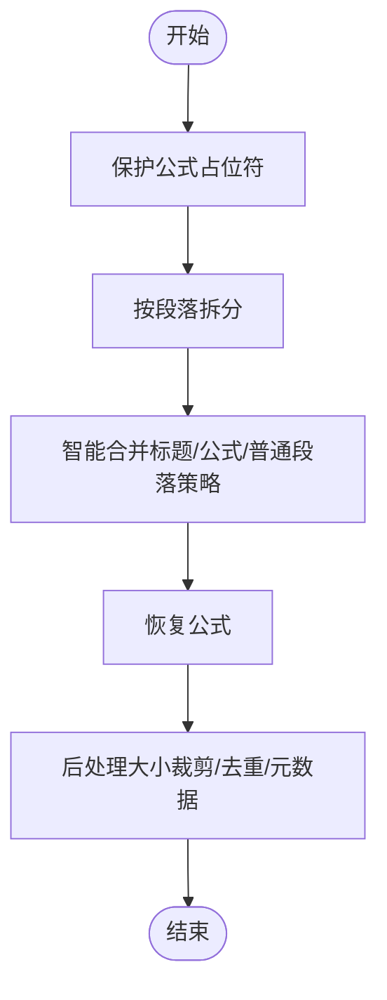
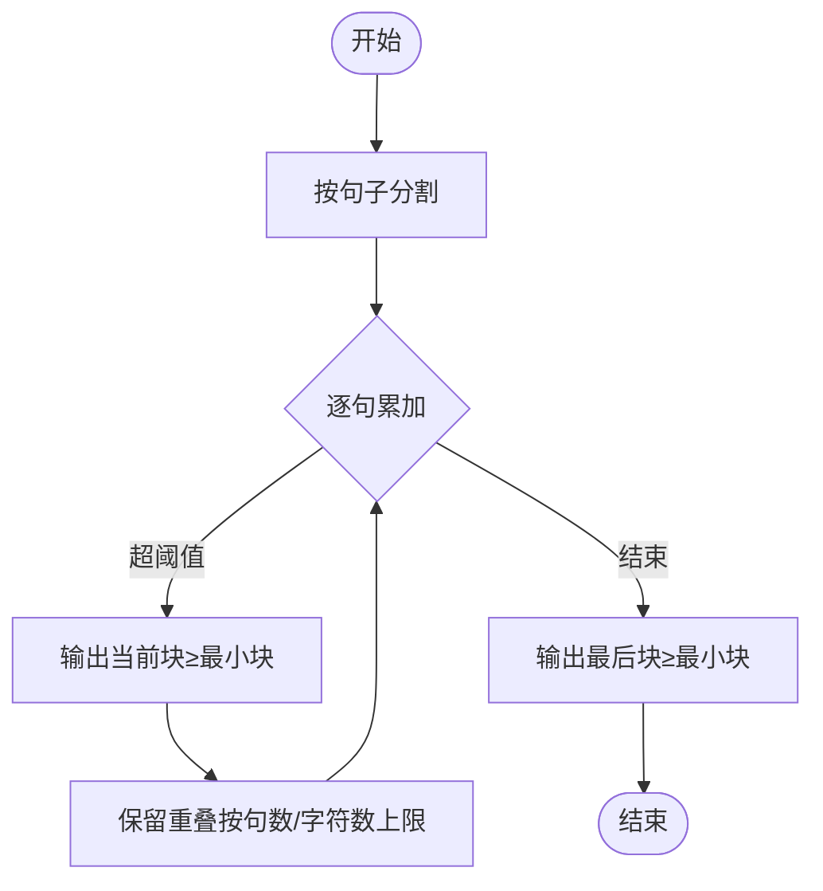
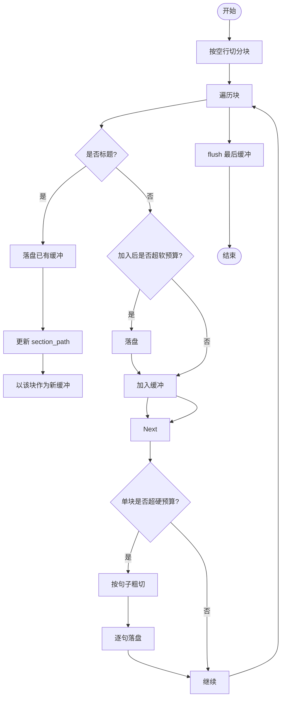
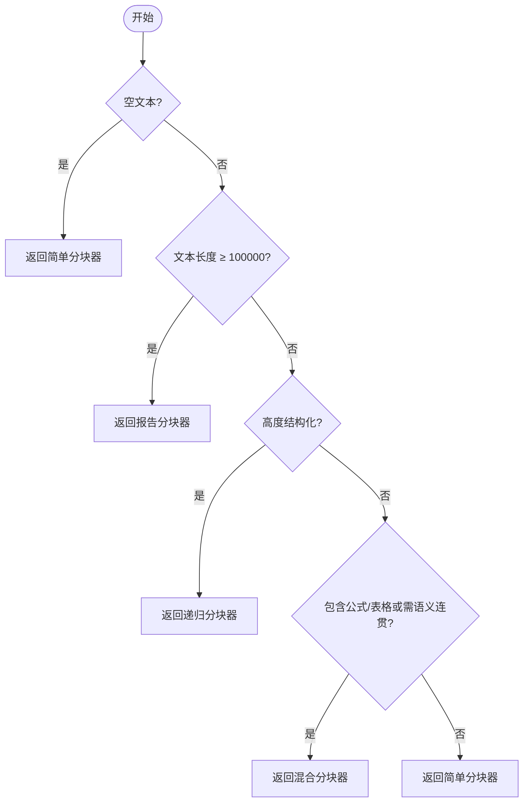
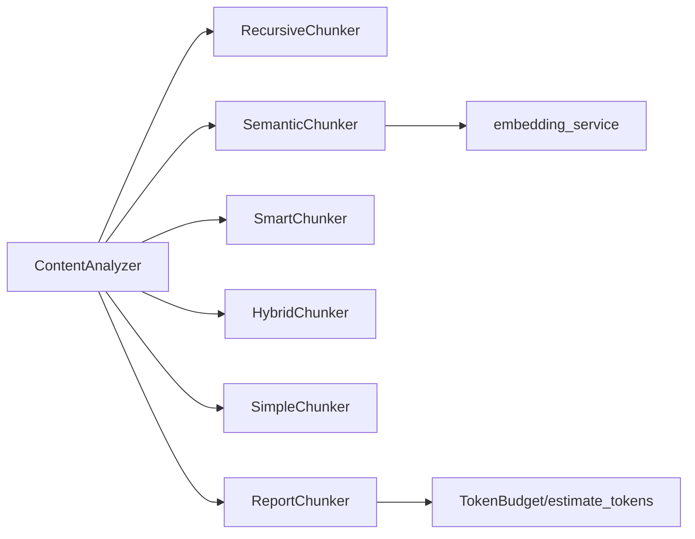

# 文档分块策略

<cite>
**本文引用的文件**
- [chunking/__init__.py](file://chunking/__init__.py)
- [chunking/base.py](file://chunking/base.py)
- [chunking/simple_chunker.py](file://chunking/simple_chunker.py)
- [chunking/smart_chunker.py](file://chunking/smart_chunker.py)
- [chunking/sliding_window_chunker.py](file://chunking/sliding_window_chunker.py)
- [chunking/hybrid_chunker.py](file://chunking/hybrid_chunker.py)
- [chunking/report_chunker.py](file://chunking/report_chunker.py)
- [chunking/langchain/recursive_chunker.py](file://chunking/langchain/recursive_chunker.py)
- [chunking/langchain/semantic_chunker.py](file://chunking/langchain/semantic_chunker.py)
- [chunking/router/content_analyzer.py](file://chunking/router/content_analyzer.py)
- [chunking/router/README.md](file://chunking/router/README.md)
- [chunking/README.md](file://chunking/README.md)
- [utils/token_utils.py](file://utils/token_utils.py)
</cite>

## 目录
1. [简介](#简介)
2. [项目结构](#项目结构)
3. [核心组件](#核心组件)
4. [架构总览](#架构总览)
5. [详细组件分析](#详细组件分析)
6. [依赖分析](#依赖分析)
7. [性能考量](#性能考量)
8. [故障排查指南](#故障排查指南)
9. [结论](#结论)
10. [附录](#附录)

## 简介
本文件系统性梳理 Advanced RAG 项目的文档分块策略，重点覆盖以下方面：
- 混合分块策略：规则分块与语义分块的融合，兼顾结构完整性与语义连贯性
- 智能分块器的内容感知机制：句子边界检测、段落结构保持、公式保护
- 滑动窗口分块的重叠策略与窗口大小优化
- 报告专用分块器：面向长行业报告的结构化与 token 预算控制
- 简单分块器与基础分块器的适用场景与性能特点
- 分块参数调优指南与不同内容类型的最优策略建议

## 项目结构
分块模块采用清晰的分层设计：
- 基础分块器：simple_chunker、smart_chunker、sliding_window_chunker
- 路由模块：content_analyzer，根据内容特征自动选择分块器
- LangChain 分块器：recursive_chunker、semantic_chunker（可选依赖）
- 报告专用分块器：report_chunker，结合结构与 token 预算
- 工具支持：token_utils 提供 token 估算与预算控制

图表来源
- [chunking/__init__.py:1-34](file://chunking/__init__.py#L1-L34)
- [chunking/base.py:6-23](file://chunking/base.py#L6-L23)
- [chunking/simple_chunker.py:7-111](file://chunking/simple_chunker.py#L7-L111)
- [chunking/smart_chunker.py:7-408](file://chunking/smart_chunker.py#L7-L408)
- [chunking/sliding_window_chunker.py:6-97](file://chunking/sliding_window_chunker.py#L6-L97)
- [chunking/hybrid_chunker.py:9-179](file://chunking/hybrid_chunker.py#L9-L179)
- [chunking/report_chunker.py:42-143](file://chunking/report_chunker.py#L42-L143)
- [chunking/router/content_analyzer.py:12-299](file://chunking/router/content_analyzer.py#L12-L299)
- [chunking/langchain/recursive_chunker.py:7-110](file://chunking/langchain/recursive_chunker.py#L7-L110)
- [chunking/langchain/semantic_chunker.py:8-139](file://chunking/langchain/semantic_chunker.py#L8-L139)
- [utils/token_utils.py:7-72](file://utils/token_utils.py#L7-L72)

章节来源
- [chunking/README.md:1-89](file://chunking/README.md#L1-L89)
- [chunking/__init__.py:1-34](file://chunking/__init__.py#L1-L34)

## 核心组件
- 基类 BaseChunker：统一的抽象接口，定义 chunk(text, metadata) 规范
- SimpleChunker：固定大小 + 分隔符优先的简单分块，通用性强、性能稳定
- SmartChunker：内容感知分块，保护公式完整性、识别段落与标题、智能合并
- SlidingWindowChunker：按句子粒度滑动合并，保留重叠以增强上下文
- HybridChunker：规则 + 语义融合，优先抽取代码/公式/表格，其余文本语义分块
- ReportChunker：面向长行业报告，维护章节路径与 token 预算
- ContentAnalyzer：内容分析路由器，自动选择最佳分块器
- LangChain 分块器：递归分块（结构化）与语义分块（连贯性）

章节来源
- [chunking/base.py:6-23](file://chunking/base.py#L6-L23)
- [chunking/simple_chunker.py:7-111](file://chunking/simple_chunker.py#L7-L111)
- [chunking/smart_chunker.py:7-408](file://chunking/smart_chunker.py#L7-L408)
- [chunking/sliding_window_chunker.py:6-97](file://chunking/sliding_window_chunker.py#L6-L97)
- [chunking/hybrid_chunker.py:9-179](file://chunking/hybrid_chunker.py#L9-L179)
- [chunking/report_chunker.py:42-143](file://chunking/report_chunker.py#L42-L143)
- [chunking/router/content_analyzer.py:12-299](file://chunking/router/content_analyzer.py#L12-L299)
- [chunking/langchain/recursive_chunker.py:7-110](file://chunking/langchain/recursive_chunker.py#L7-L110)
- [chunking/langchain/semantic_chunker.py:8-139](file://chunking/langchain/semantic_chunker.py#L8-L139)

## 架构总览
分块策略的整体流程：输入文本与元数据 → 路由器分析 → 选择分块器 → 输出标准化块（含 text、metadata、索引等）

图表来源
- [chunking/router/content_analyzer.py:253-299](file://chunking/router/content_analyzer.py#L253-L299)
- [chunking/langchain/recursive_chunker.py:69-109](file://chunking/langchain/recursive_chunker.py#L69-L109)
- [chunking/langchain/semantic_chunker.py:81-139](file://chunking/langchain/semantic_chunker.py#L81-L139)
- [chunking/hybrid_chunker.py:52-121](file://chunking/hybrid_chunker.py#L52-L121)
- [chunking/simple_chunker.py:28-109](file://chunking/simple_chunker.py#L28-L109)
- [chunking/report_chunker.py:58-142](file://chunking/report_chunker.py#L58-L142)

## 详细组件分析

### 混合分块策略（规则 + 语义）
混合分块器将“规则分块”与“语义分块”结合：
- 规则分块：识别并保留代码块、公式、表格的完整性
- 语义分块：对普通文本使用基于嵌入的语义断点
- 去重与细粒度元数据：基于哈希去重，content_type 标记

图表来源
- [chunking/hybrid_chunker.py:52-121](file://chunking/hybrid_chunker.py#L52-L121)
- [chunking/hybrid_chunker.py:123-179](file://chunking/hybrid_chunker.py#L123-L179)

章节来源
- [chunking/hybrid_chunker.py:9-179](file://chunking/hybrid_chunker.py#L9-L179)

### 智能分块器（内容感知）
智能分块器针对包含公式、表格、标题、段落的复杂文档：
- 公式保护：识别多种 LaTeX/行内公式形式，用占位符保护后再恢复
- 段落边界：双换行、编号标题、章节标题等优先级识别
- 智能合并：标题与内容合并策略、公式段落整体性、大段落按句子边界拆分
- 后处理：最小/最大块大小控制、块索引与元数据注入

图表来源
- [chunking/smart_chunker.py:67-96](file://chunking/smart_chunker.py#L67-L96)
- [chunking/smart_chunker.py:98-134](file://chunking/smart_chunker.py#L98-L134)
- [chunking/smart_chunker.py:174-203](file://chunking/smart_chunker.py#L174-L203)
- [chunking/smart_chunker.py:205-301](file://chunking/smart_chunker.py#L205-L301)
- [chunking/smart_chunker.py:303-346](file://chunking/smart_chunker.py#L303-L346)
- [chunking/smart_chunker.py:348-407](file://chunking/smart_chunker.py#L348-L407)

章节来源
- [chunking/smart_chunker.py:7-408](file://chunking/smart_chunker.py#L7-L408)

### 滑动窗口分块（重叠策略与窗口优化）
滑动窗口分块以句子为单位，动态累积至阈值后输出，并保留重叠部分：
- 句子边界：中英文常见标点分割
- 重叠策略：输出块后，从当前块末尾保留不超过重叠大小的若干句子
- 最小块：低于阈值的最后块可选择丢弃或合并

图表来源
- [chunking/sliding_window_chunker.py:27-75](file://chunking/sliding_window_chunker.py#L27-L75)
- [chunking/sliding_window_chunker.py:77-96](file://chunking/sliding_window_chunker.py#L77-L96)

章节来源
- [chunking/sliding_window_chunker.py:6-97](file://chunking/sliding_window_chunker.py#L6-L97)

### 报告专用分块器（结构 + token 预算）
报告分块器专为长行业报告设计：
- 结构优先：按空行切分为块，识别标题并维护 section_path
- token 预算：使用 TokenBudget 控制 chunk_tokens、overlap_tokens、max_chunk_tokens
- 单块超预算：按句子边界粗切
- 元数据：包含 token_count、chunker_type、content_type、chunk_index

图表来源
- [chunking/report_chunker.py:58-142](file://chunking/report_chunker.py#L58-L142)
- [utils/token_utils.py:7-72](file://utils/token_utils.py#L7-L72)

章节来源
- [chunking/report_chunker.py:42-143](file://chunking/report_chunker.py#L42-L143)
- [utils/token_utils.py:7-72](file://utils/token_utils.py#L7-L72)

### 内容分析路由器（自动分块器选择）
路由器根据文档内容与元数据特征，按优先级选择分块器：
- 超长报告（>10万字符）→ 报告分块器
- 高度结构化（代码/LaTeX/结构化标记）→ 递归分块器
- 包含公式/表格或需语义连贯 → 混合分块器
- 其他 → 简单分块器

图表来源
- [chunking/router/content_analyzer.py:253-299](file://chunking/router/content_analyzer.py#L253-L299)

章节来源
- [chunking/router/content_analyzer.py:12-299](file://chunking/router/content_analyzer.py#L12-L299)
- [chunking/router/README.md:1-137](file://chunking/router/README.md#L1-L137)

### LangChain 分块器（递归与语义）
- 递归分块器：按优先级分隔符（段落/行/中英文标点/空格/字符级）递归切分，适合代码、论文等结构化内容
- 语义分块器：基于嵌入相似度的断点检测，适合长文档的语义连贯性

章节来源
- [chunking/langchain/recursive_chunker.py:7-110](file://chunking/langchain/recursive_chunker.py#L7-L110)
- [chunking/langchain/semantic_chunker.py:8-139](file://chunking/langchain/semantic_chunker.py#L8-L139)

## 依赖分析
- 模块内聚与耦合
  - 基础分块器均继承自 BaseChunker，接口一致，便于替换与测试
  - 路由器与 LangChain 分块器通过延迟初始化解耦外部依赖
  - 报告分块器依赖 token_utils 的估算与预算控制
- 外部依赖
  - LangChain 分块器依赖 langchain/text_splitter 或 langchain_text_splitters
  - 语义分块器依赖 embedding_service 的嵌入编码能力

图表来源
- [chunking/router/content_analyzer.py:32-79](file://chunking/router/content_analyzer.py#L32-L79)
- [chunking/langchain/semantic_chunker.py:31-46](file://chunking/langchain/semantic_chunker.py#L31-L46)
- [chunking/report_chunker.py:50-56](file://chunking/report_chunker.py#L50-L56)
- [utils/token_utils.py:7-14](file://utils/token_utils.py#L7-L14)

章节来源
- [chunking/router/content_analyzer.py:32-79](file://chunking/router/content_analyzer.py#L32-L79)
- [chunking/langchain/semantic_chunker.py:31-46](file://chunking/langchain/semantic_chunker.py#L31-L46)
- [chunking/report_chunker.py:50-56](file://chunking/report_chunker.py#L50-L56)
- [utils/token_utils.py:7-14](file://utils/token_utils.py#L7-L14)

## 性能考量
- 简单分块器：时间复杂度 O(n)，空间开销低，适合短文本与通用场景
- 滑动窗口分块器：按句子合并，重叠保留成本可控，适合需要上下文的场景
- 智能分块器：公式保护与段落识别带来额外正则扫描成本，但显著提升语义完整性
- 混合分块器：规则抽取 + 语义分块，整体成本高于简单分块，但对技术文档收益明显
- 语义分块器：依赖嵌入编码，成本较高，适合长文档；失败时回退到简单分块
- 报告分块器：token 预算控制减少超预算风险，句子粗切避免大块处理开销

## 故障排查指南
- 语义分块器初始化失败
  - 现象：抛出 ImportError 或初始化异常
  - 处理：确认已安装 LangChain 相关依赖；查看日志；自动回退到简单分块
- 空文本或纯空白
  - 现象：返回空列表
  - 处理：在上层进行判空处理或设置兜底策略
- 分块结果过小或过多
  - 现象：最小块被丢弃或过度切分
  - 处理：调整最小块大小、分隔符优先级或合并策略
- 公式/表格被破坏
  - 现象：公式断裂、表格不完整
  - 处理：使用智能分块器或混合分块器；确保元数据中提供结构信息
- 报告分块 token 超预算
  - 现象：单块超出 max_chunk_tokens
  - 处理：降低 chunk_tokens 或增大 max_chunk_tokens；必要时减小重叠

章节来源
- [chunking/langchain/semantic_chunker.py:72-78](file://chunking/langchain/semantic_chunker.py#L72-L78)
- [chunking/langchain/semantic_chunker.py:128-139](file://chunking/langchain/semantic_chunker.py#L128-L139)
- [chunking/simple_chunker.py:30-31](file://chunking/simple_chunker.py#L30-L31)
- [chunking/smart_chunker.py:372-385](file://chunking/smart_chunker.py#L372-L385)
- [chunking/report_chunker.py:113-135](file://chunking/report_chunker.py#L113-L135)

## 结论
Advanced RAG 的分块策略通过“内容感知 + 自动路由”的方式，实现了对多样化文档类型的高效适配：
- 规则分块保障结构完整性（代码/公式/表格）
- 语义分块提升长文档的连贯性
- 智能与滑动窗口分块在不同粒度上平衡上下文与效率
- 报告分块器以结构与 token 预算为核心，确保大规模文档的可控性
- 路由器基于元数据与文本特征自动选择最优分块器，降低人工调参成本

## 附录

### 参数调优指南
- 简单分块器
  - chunk_size：根据下游模型上下文长度设定；短文本可设 500，长文本可设 1000
  - chunk_overlap：建议 10%-20%；通用场景 50-200
  - separators：优先使用段落/句子边界，避免跨段落切分
- 智能分块器
  - chunk_size：建议 1000；公式/表格多时可增大
  - chunk_overlap：建议 200；保证上下文连贯
  - min_chunk_size/max_chunk_size：防止过小/过大块
- 滑动窗口分块器
  - chunk_size：建议 500-1000
  - chunk_overlap：建议 100-200
  - min_chunk_size：建议 100
- 混合分块器
  - chunk_size/chunk_overlap：与语义分块器一致
  - semantic_threshold：0.3-0.7，越小越易断点
- 报告分块器
  - TokenBudget：chunk_tokens 建议 800，overlap_tokens 120，max_chunk_tokens 1200
  - min_chunk_tokens：建议 120，避免过小块

### 不同内容类型的最优策略建议
- 代码文档/论文（高度结构化）
  - 推荐：LangChain 递归分块器或混合分块器（规则优先）
- 包含公式/表格的学术/技术文档
  - 推荐：智能分块器或混合分块器（公式保护 + 语义分块）
- 长篇报告/文章（需语义连贯）
  - 推荐：报告分块器（结构 + token 预算）或语义分块器（LangChain）
- 通用短文本/FAQ/说明
  - 推荐：简单分块器（稳定、快速）

章节来源
- [chunking/router/README.md:7-137](file://chunking/router/README.md#L7-L137)
- [chunking/README.md:34-89](file://chunking/README.md#L34-L89)