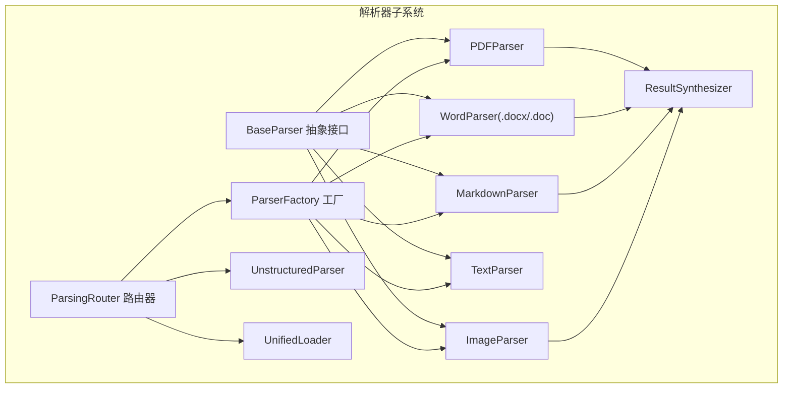
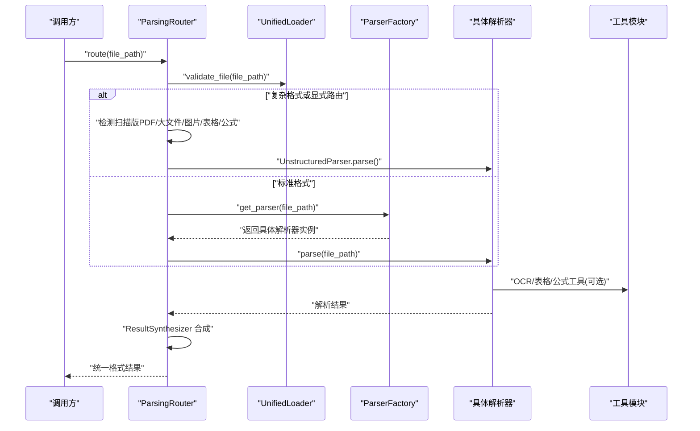
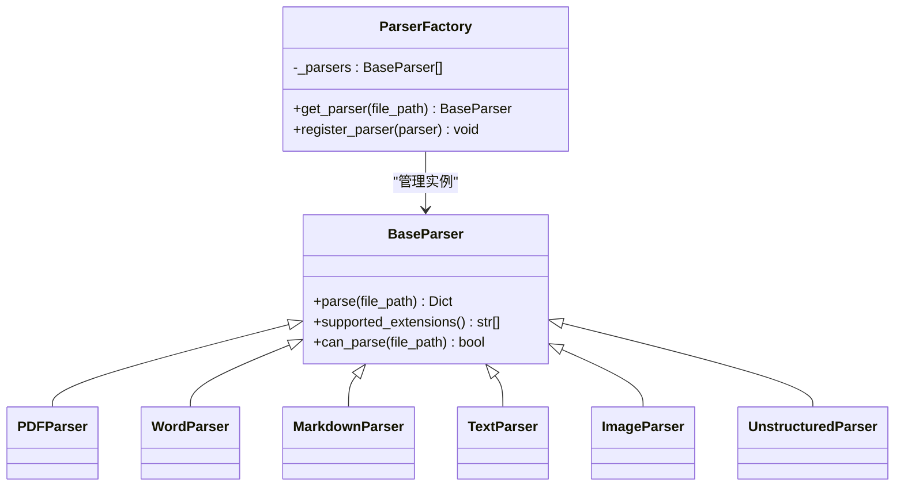
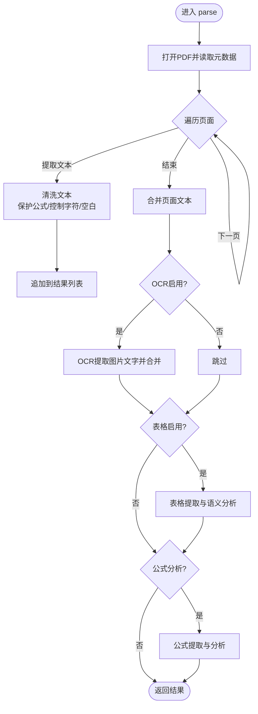
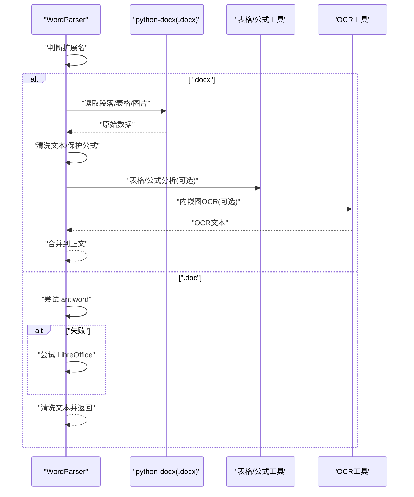
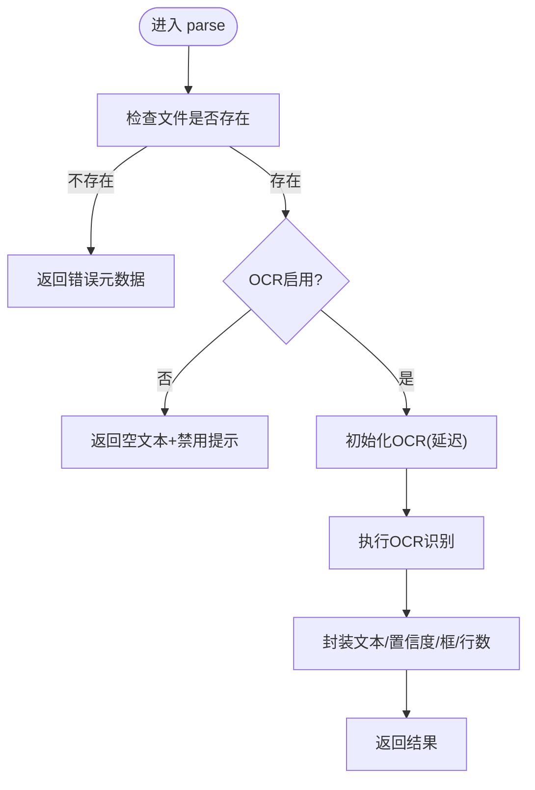
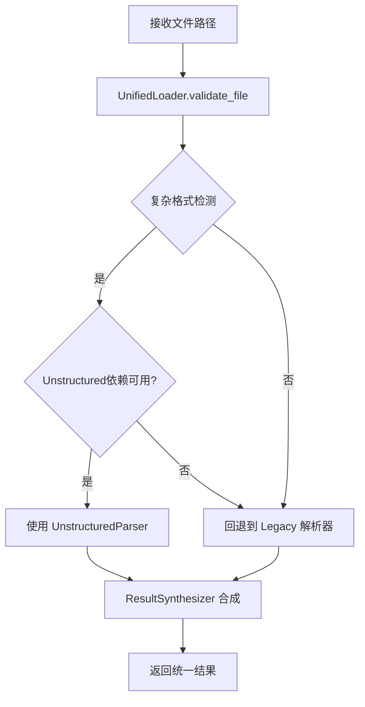
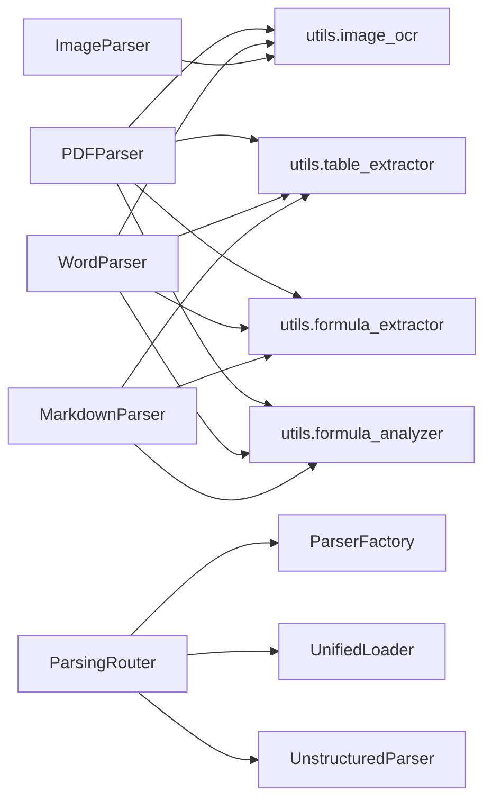

# 文档解析器系统

<cite>
**本文引用的文件**
- [parsers/__init__.py](file://parsers/__init__.py)
- [parsers/base.py](file://parsers/base.py)
- [parsers/parser_factory.py](file://parsers/parser_factory.py)
- [parsers/pdf_parser.py](file://parsers/pdf_parser.py)
- [parsers/word_parser.py](file://parsers/word_parser.py)
- [parsers/markdown_parser.py](file://parsers/markdown_parser.py)
- [parsers/text_parser.py](file://parsers/text_parser.py)
- [parsers/image_parser.py](file://parsers/image_parser.py)
- [parsers/router/parsing_router.py](file://parsers/router/parsing_router.py)
- [parsers/utils/unified_loader.py](file://parsers/utils/unified_loader.py)
- [parsers/utils/result_synthesizer.py](file://parsers/utils/result_synthesizer.py)
- [parsers/unstructured/unstructured_parser.py](file://parsers/unstructured/unstructured_parser.py)
- [utils/image_ocr.py](file://utils/image_ocr.py)
- [utils/table_extractor.py](file://utils/table_extractor.py)
- [utils/formula_analyzer.py](file://utils/formula_analyzer.py)
- [utils/formula_extractor.py](file://utils/formula_extractor.py)
</cite>

## 目录
1. [简介](#简介)
2. [项目结构](#项目结构)
3. [核心组件](#核心组件)
4. [架构总览](#架构总览)
5. [详细组件分析](#详细组件分析)
6. [依赖关系分析](#依赖关系分析)
7. [性能考虑](#性能考虑)
8. [故障排查指南](#故障排查指南)
9. [结论](#结论)
10. [附录](#附录)

## 简介
本文件面向 Advanced RAG 项目的“文档解析器系统”，系统性阐述解析器工厂的设计与单例实现、多格式文档解析的统一接口设计、各类解析器的实现机制（PDF 文本提取与结构保持、Word 文档格式保留解析、Markdown 语法解析、纯文本基础解析、图像解析器的 OCR 集成）、解析器扩展与自定义解析器注册流程，以及性能优化策略与错误处理机制（含大文件处理与内存管理最佳实践）。目标是帮助开发者与使用者全面理解解析器体系的工作原理与使用方式。

## 项目结构
解析器子系统位于 parsers 目录，采用“按功能模块划分 + 工厂与路由器协调”的组织方式：
- 基础抽象层：BaseParser 抽象接口，统一 parse 与扩展名声明。
- 具体解析器：PDF、Word、Markdown、Text、Image 等。
- 工厂与路由器：ParserFactory 负责解析器实例选择；ParsingRouter 负责根据文档特征智能路由到 Legacy 或 Unstructured 解析器。
- 工具模块：UnifiedLoader（文件校验与加载）、ResultSynthesizer（结果格式统一与表格/代码块回填）、UnstructuredParser（复杂格式布局分析）。
- OCR 与表格/公式工具：image_ocr、table_extractor、formula_analyzer、formula_extractor。

图表来源
- [parsers/base.py:6-32](file://parsers/base.py#L6-L32)
- [parsers/parser_factory.py:32-58](file://parsers/parser_factory.py#L32-L58)
- [parsers/router/parsing_router.py:10-273](file://parsers/router/parsing_router.py#L10-L273)
- [parsers/pdf_parser.py:12-221](file://parsers/pdf_parser.py#L12-L221)
- [parsers/word_parser.py:18-401](file://parsers/word_parser.py#L18-L401)
- [parsers/markdown_parser.py:11-109](file://parsers/markdown_parser.py#L11-L109)
- [parsers/text_parser.py:7-36](file://parsers/text_parser.py#L7-L36)
- [parsers/image_parser.py:10-61](file://parsers/image_parser.py#L10-L61)
- [parsers/utils/unified_loader.py:7-60](file://parsers/utils/unified_loader.py#L7-L60)
- [parsers/utils/result_synthesizer.py:20-134](file://parsers/utils/result_synthesizer.py#L20-L134)
- [parsers/unstructured/unstructured_parser.py:7-115](file://parsers/unstructured/unstructured_parser.py#L7-L115)

章节来源
- [parsers/__init__.py:1-38](file://parsers/__init__.py#L1-L38)
- [parsers/base.py:1-32](file://parsers/base.py#L1-L32)
- [parsers/parser_factory.py:1-58](file://parsers/parser_factory.py#L1-L58)
- [parsers/router/parsing_router.py:1-273](file://parsers/router/parsing_router.py#L1-L273)

## 核心组件
- BaseParser 抽象接口：定义 parse(file_path) 与 supported_extensions()，并提供 can_parse(file_path) 的通用实现。
- ParserFactory 工厂：内置解析器集合，提供 get_parser(file_path) 选择器与 register_parser(parser) 注册器。
- ParsingRouter 路由器：根据文件类型、大小、内容特征判断是否使用 Unstructured 或原有解析器。
- UnifiedLoader：文件存在性与大小校验，提供基础文件信息。
- ResultSynthesizer：统一解析结果格式，支持将表格/代码块写回正文，保留 raw_markdown。
- 各具体解析器：PDF、Word、Markdown、Text、Image，均继承 BaseParser 并实现各自 parse 逻辑。
- OCR/表格/公式工具：ImageOCR、TableExtractor、FormulaExtractor、FormulaAnalyzer。

章节来源
- [parsers/base.py:6-32](file://parsers/base.py#L6-L32)
- [parsers/parser_factory.py:32-58](file://parsers/parser_factory.py#L32-L58)
- [parsers/router/parsing_router.py:10-273](file://parsers/router/parsing_router.py#L10-L273)
- [parsers/utils/unified_loader.py:7-60](file://parsers/utils/unified_loader.py#L7-L60)
- [parsers/utils/result_synthesizer.py:20-134](file://parsers/utils/result_synthesizer.py#L20-L134)

## 架构总览
解析器系统采用“工厂 + 路由器 + 工具链”的分层架构：
- 路由层：ParsingRouter 基于文件特征与依赖可用性决定使用 Legacy 解析器还是 Unstructured 解析器。
- 解析层：ParserFactory 维护解析器集合；各具体解析器负责对应格式的文本提取与结构增强。
- 工具层：UnifiedLoader 校验输入；ResultSynthesizer 统一输出；OCR/表格/公式工具提供增强能力。
- 扩展层：支持动态注册新解析器，便于接入更多格式。

图表来源
- [parsers/router/parsing_router.py:221-273](file://parsers/router/parsing_router.py#L221-L273)
- [parsers/utils/unified_loader.py:43-60](file://parsers/utils/unified_loader.py#L43-L60)
- [parsers/parser_factory.py:37-57](file://parsers/parser_factory.py#L37-L57)
- [parsers/utils/result_synthesizer.py:41-102](file://parsers/utils/result_synthesizer.py#L41-L102)

## 详细组件分析

### 解析器工厂与单例实现
- 设计要点
  - 工厂类内部维护解析器列表，初始化时构建默认解析器集合（PDF、Text、Markdown、Word、可选 Unstructured、Image）。
  - 提供类方法 get_parser(file_path)：遍历解析器，基于 can_parse(file_path) 选择首个匹配者。
  - 提供 register_parser(parser)：允许动态注册自定义解析器，扩展新格式支持。
- 单例特性
  - 通过类变量 _parsers 一次性构建并缓存，后续调用无需重复初始化，达到单例效果。
- 适用场景
  - 快速扩展：新增解析器只需实现 BaseParser 并通过 register_parser 注册。
  - 条件启用：Unstructured 解析器按导入可用性动态加入集合。

图表来源
- [parsers/base.py:6-32](file://parsers/base.py#L6-L32)
- [parsers/parser_factory.py:32-58](file://parsers/parser_factory.py#L32-L58)
- [parsers/pdf_parser.py:12-221](file://parsers/pdf_parser.py#L12-L221)
- [parsers/word_parser.py:18-401](file://parsers/word_parser.py#L18-L401)
- [parsers/markdown_parser.py:11-109](file://parsers/markdown_parser.py#L11-L109)
- [parsers/text_parser.py:7-36](file://parsers/text_parser.py#L7-L36)
- [parsers/image_parser.py:10-61](file://parsers/image_parser.py#L10-L61)
- [parsers/unstructured/unstructured_parser.py:7-115](file://parsers/unstructured/unstructured_parser.py#L7-L115)

章节来源
- [parsers/parser_factory.py:19-58](file://parsers/parser_factory.py#L19-L58)

### PDF 解析器：文本提取与结构保持
- 功能概述
  - 使用 PyPDF2 提取文本与元数据；对文本进行清洗（编码修复、控制字符过滤、空白规范化、公式保护）。
  - 可选 OCR：对图片进行 OCR 提取文字并合并到全文；统计图片数量与 OCR 文本长度。
  - 可选表格提取：从全文中识别表格，生成 HTML/Markdown/语义结构。
  - 可选公式分析：提取并分析公式变量、关系、结构与复杂度。
  - 运行时开关：通过运行时配置控制 OCR 与表格解析是否启用。
- 实现要点
  - 页面级迭代提取，逐页清洗并聚合；若全页无文本，记录警告提示扫描版 PDF。
  - 公式保护：先保护公式，再进行空白与控制字符处理，避免破坏数学表达式。
  - OCR/表格/公式模块按需调用，异常捕获并记录，不影响主流程。
- 输出结构
  - text：清洗后的文本。
  - metadata：包含标题、作者、主题、页数、页面明细、提取方式、抽取页数、图片 OCR 统计、表格信息、公式信息等。

图表来源
- [parsers/pdf_parser.py:103-217](file://parsers/pdf_parser.py#L103-L217)

章节来源
- [parsers/pdf_parser.py:12-221](file://parsers/pdf_parser.py#L12-L221)

### Word 文档解析器：格式保留解析
- 功能概述
  - 支持 .docx 与 .doc 两种格式。.docx 使用 python-docx；.doc 通过 antiword/LibreOffice 转换。
  - 提取段落文本并清洗，保留公式标记；提取元数据（标题、作者、主题、段落数）。
  - 可选表格提取：生成 HTML/Markdown/语义结构；可选公式分析。
  - 可选图片提取与 OCR：遍历文档内嵌图片，临时写出后 OCR，将 OCR 文本合并到正文。
- 实现要点
  - .docx：逐段提取，清洗文本，保留公式；表格与图片遍历提取；OCR 临时文件管理。
  - .doc：优先 antiword，失败回退 LibreOffice；超时与缺失工具处理。
  - 运行时开关：控制 OCR 与表格解析启用。
- 输出结构
  - text：清洗后的文本。
  - metadata：包含提取方式、段落数、表格数量、图片信息（如存在）、公式信息等。

图表来源
- [parsers/word_parser.py:131-396](file://parsers/word_parser.py#L131-L396)

章节来源
- [parsers/word_parser.py:18-401](file://parsers/word_parser.py#L18-L401)

### Markdown 解析器：语法解析与增强
- 功能概述
  - 使用 markdown.Markdown 渲染为 HTML，再去除标签提取纯文本。
  - 可选表格提取：从原始 Markdown 中识别表格，生成 HTML/Markdown/语义结构。
  - 可选代码块分析：提取 fenced code blocks，调用 CodeAnalyzer 分析语言与内容。
  - 可选公式分析：提取并分析公式变量、关系与结构。
- 实现要点
  - 开启 tables、fenced_code、codehilite 扩展，保证表格与代码高亮渲染。
  - 清理多余空行，保留标题层级信息在元数据中。
  - 运行时开关控制表格解析启用。
- 输出结构
  - text：去标签后的纯文本。
  - raw_markdown：原始 Markdown（用于回填表格/代码块）。
  - metadata：包含格式、章节数量、表格信息、代码块分析、公式信息等。

章节来源
- [parsers/markdown_parser.py:14-109](file://parsers/markdown_parser.py#L14-L109)

### 纯文本解析器：基础解析
- 功能概述
  - 使用 chardet 自动检测编码，忽略解码错误读取文本。
  - 返回文本与基础元数据（编码、行数）。
- 实现要点
  - 二进制读取原始数据，检测编码后再读取文本，提升兼容性。
- 输出结构
  - text：检测编码后的文本。
  - metadata：包含编码与行数。

章节来源
- [parsers/text_parser.py:10-36](file://parsers/text_parser.py#L10-L36)

### 图像解析器：OCR 集成
- 功能概述
  - 使用 PaddleOCR 提取图片文字，支持 jpg/png/bmp/webp/tiff 等。
  - 支持运行时开关关闭 OCR，返回空文本与错误信息。
  - 输出文本、置信度、行数、可选框信息。
- 实现要点
  - 延迟初始化 OCR 引擎；文件存在性检查；异常捕获与日志记录。
- 输出结构
  - text：OCR 提取文本。
  - metadata：包含提取方式、置信度、行数、错误信息（如有）、框信息（如有）。

图表来源
- [parsers/image_parser.py:13-57](file://parsers/image_parser.py#L13-L57)
- [utils/image_ocr.py:38-122](file://utils/image_ocr.py#L38-L122)

章节来源
- [parsers/image_parser.py:10-61](file://parsers/image_parser.py#L10-L61)
- [utils/image_ocr.py:7-224](file://utils/image_ocr.py#L7-L224)

### 路由器与统一接口设计
- UnifiedLoader：校验文件存在与大小，提供基础文件信息。
- ParsingRouter：
  - 显式路由：对仅 Unstructured 支持的格式（.pptx/.xlsx/.xls/.html/.htm）直接走 Unstructured。
  - 复杂格式检测：扫描版 PDF、大文件、Word 中的大量表格/图片、PDF 中无文本等场景优先使用 Unstructured。
  - 依赖检测：若缺少 unstructured[pdf] 依赖，避免先报错再回退，直接使用原有解析器。
  - 回退策略：当 Unstructured 不可用或不适合时，回退到 ParserFactory 选择的解析器。
- ResultSynthesizer：
  - 将不同解析器输出统一为 text/metadata。
  - 可选将表格/代码块写回正文，或优先使用 raw_markdown 保留结构。
  - 合并多个结果（如多页 PDF 合并）。

图表来源
- [parsers/router/parsing_router.py:221-273](file://parsers/router/parsing_router.py#L221-L273)
- [parsers/utils/unified_loader.py:43-60](file://parsers/utils/unified_loader.py#L43-L60)
- [parsers/utils/result_synthesizer.py:41-102](file://parsers/utils/result_synthesizer.py#L41-L102)

章节来源
- [parsers/router/parsing_router.py:10-273](file://parsers/router/parsing_router.py#L10-L273)
- [parsers/utils/unified_loader.py:7-60](file://parsers/utils/unified_loader.py#L7-L60)
- [parsers/utils/result_synthesizer.py:20-134](file://parsers/utils/result_synthesizer.py#L20-L134)

### 扩展机制与自定义解析器注册
- 扩展步骤
  - 实现 BaseParser 子类，覆盖 parse(file_path) 与 supported_extensions()。
  - 通过 ParserFactory.register_parser(parser) 注册实例。
  - 路由器会自动参与后续解析流程。
- 注意事项
  - 保持 parse 返回统一结构：包含 text 与 metadata。
  - 合理处理异常与日志，避免影响整体流程。
  - 如需增强功能（OCR/表格/公式），可复用现有工具模块。

章节来源
- [parsers/base.py:6-32](file://parsers/base.py#L6-L32)
- [parsers/parser_factory.py:53-58](file://parsers/parser_factory.py#L53-L58)

## 依赖关系分析
- 组件耦合
  - 解析器依赖工具模块（OCR/表格/公式），但通过运行时导入与异常处理降低耦合风险。
  - 路由器依赖工厂与加载器，同时对 Unstructured 进行条件初始化，避免不必要的依赖。
- 外部依赖
  - PDF：PyPDF2；OCR：PaddleOCR；表格：PyMuPDF（PDF图片提取）。
  - Word：python-docx（.docx）；antiword/LibreOffice（.doc）。
  - Markdown：markdown 库。
- 循环依赖
  - 未发现循环依赖；工具模块相互独立，解析器与路由器通过接口交互。

图表来源
- [parsers/pdf_parser.py:138-204](file://parsers/pdf_parser.py#L138-L204)
- [parsers/word_parser.py:235-284](file://parsers/word_parser.py#L235-L284)
- [parsers/markdown_parser.py:46-96](file://parsers/markdown_parser.py#L46-L96)
- [parsers/image_parser.py:34-57](file://parsers/image_parser.py#L34-L57)
- [parsers/router/parsing_router.py:22-30](file://parsers/router/parsing_router.py#L22-L30)

章节来源
- [parsers/pdf_parser.py:12-221](file://parsers/pdf_parser.py#L12-L221)
- [parsers/word_parser.py:18-401](file://parsers/word_parser.py#L18-L401)
- [parsers/markdown_parser.py:11-109](file://parsers/markdown_parser.py#L11-L109)
- [parsers/image_parser.py:10-61](file://parsers/image_parser.py#L10-L61)
- [parsers/router/parsing_router.py:10-273](file://parsers/router/parsing_router.py#L10-L273)

## 性能考虑
- 大文件处理
  - 路由器对大文件（>2MB）优先选择 Unstructured，以获得更好的布局与结构解析能力。
  - PDF/Word 中的图片与表格较多时，优先使用 Unstructured，减少二次处理成本。
- 内存管理
  - OCR 与表格/公式工具在解析器内部按需调用，避免全局持有大对象。
  - Word 内嵌图 OCR 使用临时文件，及时删除，防止磁盘占用。
  - PDF 图片 OCR 使用临时文件流式处理，完成后立即清理。
- 并发与异步
  - 当前解析器为同步实现；如需并发，可在上层服务层进行任务拆分与并发调度。
- 依赖懒加载
  - Unstructured 与 OCR 引擎采用延迟初始化，减少启动时资源占用。

[本节为通用性能建议，不直接分析特定文件]

## 故障排查指南
- 常见问题与定位
  - PDF 无文本：检查是否为扫描版 PDF，确认 OCR 是否启用与依赖是否满足。
  - Word .doc 转换失败：确认 antiword 或 LibreOffice 是否安装并可执行。
  - OCR 失败：检查 PaddleOCR 是否安装，GPU/CPU 环境配置，临时文件权限。
  - 表格/公式解析失败：确认运行时配置开关，查看日志 warning。
  - Unstructured 依赖缺失：安装 unstructured[pdf] 或其他所需依赖。
- 日志与错误
  - 各解析器与工具模块均记录 warning/error 日志，便于定位问题。
  - ResultSynthesizer 对空文本给出告警，便于上层感知。

章节来源
- [parsers/pdf_parser.py:149-150](file://parsers/pdf_parser.py#L149-L150)
- [parsers/word_parser.py:370-377](file://parsers/word_parser.py#L370-L377)
- [utils/image_ocr.py:31-36](file://utils/image_ocr.py#L31-L36)
- [parsers/router/parsing_router.py:253-256](file://parsers/router/parsing_router.py#L253-L256)
- [parsers/utils/result_synthesizer.py:96-98](file://parsers/utils/result_synthesizer.py#L96-L98)

## 结论
Advanced RAG 的文档解析器系统通过统一抽象接口、工厂与路由器协调、工具模块增强，实现了对多格式文档的稳定解析与结构保持。其设计兼顾扩展性（动态注册）、鲁棒性（异常捕获与回退）与性能（懒加载与大文件路由）。结合 OCR、表格与公式工具，系统能够覆盖从文本版到扫描版、从简单到复杂的多样化文档场景。

## 附录
- 统一输出规范
  - text：解析得到的文本内容。
  - metadata：包含格式、章节/段落数、表格/代码块/公式信息、提取方式、置信度、错误信息等。
- 建议实践
  - 新增格式支持：实现 BaseParser 子类并通过工厂注册。
  - 上层集成：使用 ParsingRouter.route 获取解析器，交由 ResultSynthesizer 合成统一结果。
  - 监控与日志：关注 warning/error 日志，结合运行时配置调整解析策略。