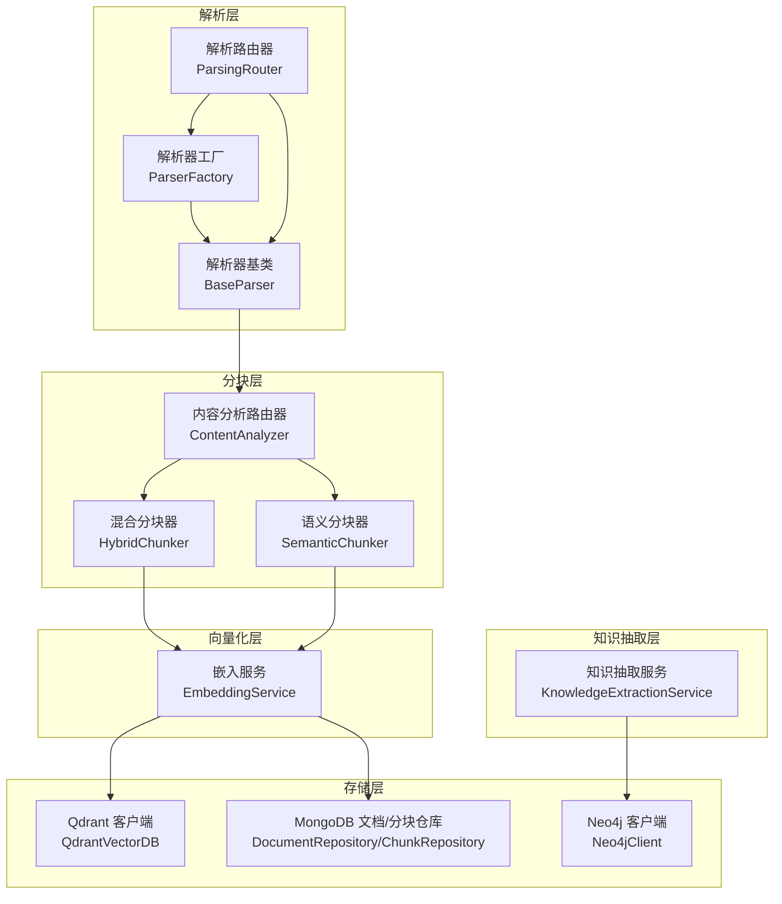
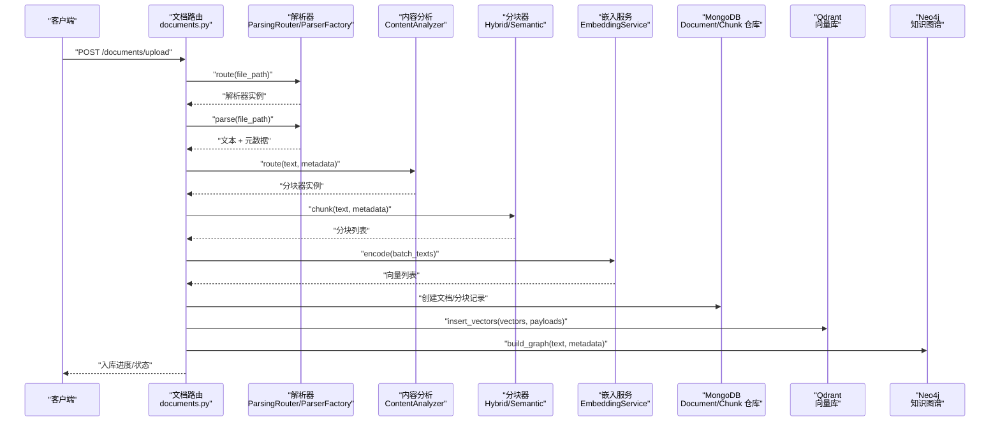
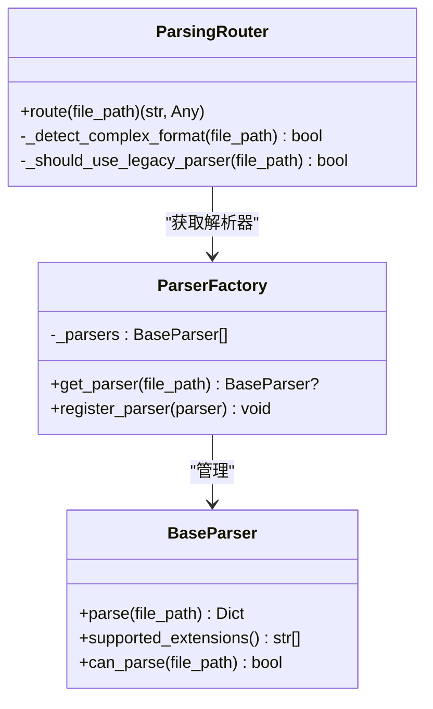
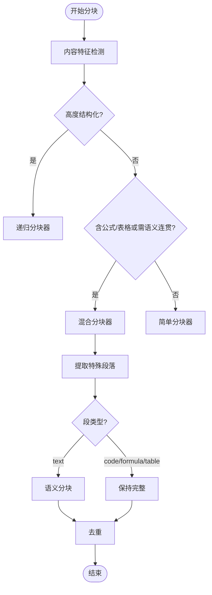
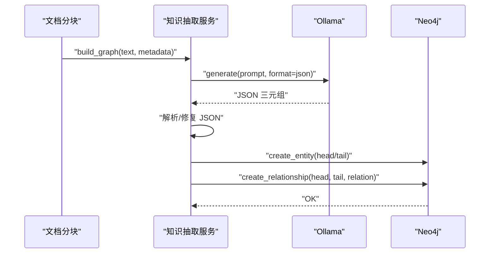
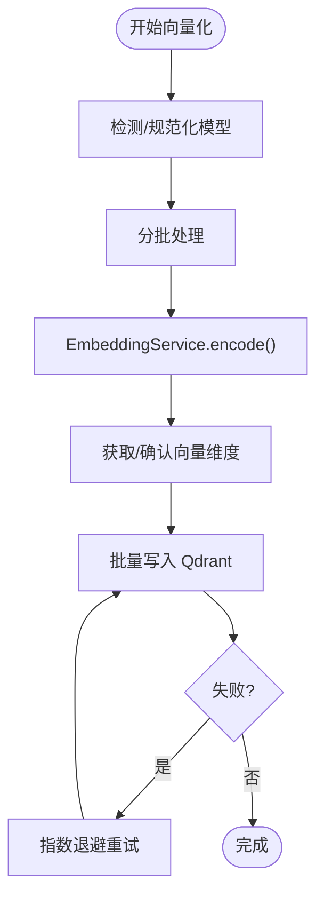
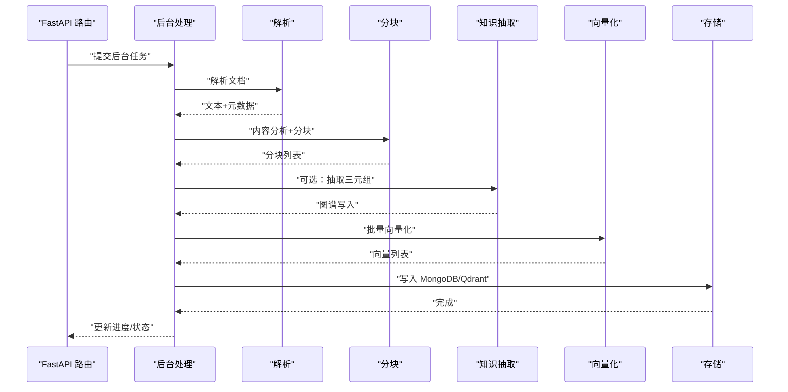
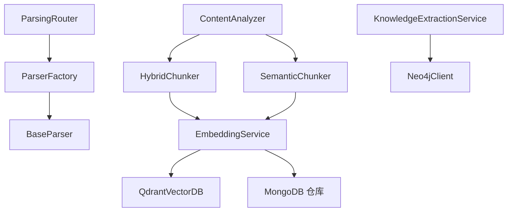

# 知识库入库流程

<cite>
**本文档引用的文件**
- [parser_factory.py](file://parsers/parser_factory.py)
- [base.py](file://parsers/base.py)
- [parsing_router.py](file://parsers/router/parsing_router.py)
- [content_analyzer.py](file://chunking/router/content_analyzer.py)
- [semantic_chunker.py](file://chunking/langchain/semantic_chunker.py)
- [hybrid_chunker.py](file://chunking/hybrid_chunker.py)
- [embedding_service.py](file://embedding/embedding_service.py)
- [qdrant_client.py](file://database/qdrant_client.py)
- [knowledge_extraction_service.py](file://services/knowledge_extraction_service.py)
- [documents.py](file://routers/documents.py)
- [document_converter.py](file://utils/document_converter.py)
- [image_ocr.py](file://utils/image_ocr.py)
- [neo4j_client.py](file://database/neo4j_client.py)
</cite>

## 目录
1. [简介](#简介)
2. [项目结构](#项目结构)
3. [核心组件](#核心组件)
4. [架构总览](#架构总览)
5. [详细组件分析](#详细组件分析)
6. [依赖关系分析](#依赖关系分析)
7. [性能考虑](#性能考虑)
8. [故障排除指南](#故障排除指南)
9. [结论](#结论)
10. [附录](#附录)

## 简介
本文件面向 Advanced RAG 项目的知识库入库流程，系统性阐述从“文档上传”到“知识库构建”的完整链路，涵盖多格式文档解析（PDF、Word、图片等）、智能分块处理、知识抽取与向量化入库等环节。重点包括：
- 解析器工厂的设计模式与扩展机制
- 混合分块策略的技术实现与选择逻辑
- 知识抽取服务的功能特性与图谱构建
- 嵌入向量生成、维度适配与存储优化
- 完整流程示例与配置说明，帮助开发者优化入库效率与质量

## 项目结构
知识库入库流程涉及解析层、分块层、向量化层、存储层与知识抽取层，各层职责清晰、耦合度低，便于扩展与维护。

**图表来源**
- [parsing_router.py:10-273](file://parsers/router/parsing_router.py#L10-L273)
- [parser_factory.py:32-58](file://parsers/parser_factory.py#L32-L58)
- [base.py:6-32](file://parsers/base.py#L6-L32)
- [content_analyzer.py:12-300](file://chunking/router/content_analyzer.py#L12-L300)
- [hybrid_chunker.py:9-179](file://chunking/hybrid_chunker.py#L9-L179)
- [semantic_chunker.py:8-139](file://chunking/langchain/semantic_chunker.py#L8-L139)
- [embedding_service.py:8-333](file://embedding/embedding_service.py#L8-L333)
- [qdrant_client.py:18-544](file://database/qdrant_client.py#L18-L544)
- [knowledge_extraction_service.py:12-229](file://services/knowledge_extraction_service.py#L12-L229)
- [neo4j_client.py:6-104](file://database/neo4j_client.py#L6-L104)

**章节来源**
- [parsing_router.py:10-273](file://parsers/router/parsing_router.py#L10-L273)
- [parser_factory.py:32-58](file://parsers/parser_factory.py#L32-L58)
- [base.py:6-32](file://parsers/base.py#L6-L32)
- [content_analyzer.py:12-300](file://chunking/router/content_analyzer.py#L12-L300)
- [hybrid_chunker.py:9-179](file://chunking/hybrid_chunker.py#L9-L179)
- [semantic_chunker.py:8-139](file://chunking/langchain/semantic_chunker.py#L8-L139)
- [embedding_service.py:8-333](file://embedding/embedding_service.py#L8-L333)
- [qdrant_client.py:18-544](file://database/qdrant_client.py#L18-L544)
- [knowledge_extraction_service.py:12-229](file://services/knowledge_extraction_service.py#L12-L229)
- [neo4j_client.py:6-104](file://database/neo4j_client.py#L6-L104)

## 核心组件
- 解析器工厂与路由器：根据文件类型与复杂度自动选择解析器，支持扩展新解析器。
- 内容分析路由器：根据文档结构与特征选择合适的分块策略（递归、语义、混合、智能、报告）。
- 混合分块器：规则分块与语义分块结合，保留代码/公式/表格完整性，去重与细粒度元数据。
- 嵌入服务：基于 Ollama 的向量化服务，自动模型检测与维度适配，批处理与重试。
- 存储层：MongoDB 存储文档与分块元数据，Qdrant 存储向量，Neo4j 构建知识图谱。
- 知识抽取服务：从文本抽取三元组并写入 Neo4j，支持 JSON 解析与实体提取。

**章节来源**
- [parser_factory.py:32-58](file://parsers/parser_factory.py#L32-L58)
- [parsing_router.py:10-273](file://parsers/router/parsing_router.py#L10-L273)
- [content_analyzer.py:12-300](file://chunking/router/content_analyzer.py#L12-L300)
- [hybrid_chunker.py:9-179](file://chunking/hybrid_chunker.py#L9-L179)
- [semantic_chunker.py:8-139](file://chunking/langchain/semantic_chunker.py#L8-L139)
- [embedding_service.py:8-333](file://embedding/embedding_service.py#L8-L333)
- [qdrant_client.py:18-544](file://database/qdrant_client.py#L18-L544)
- [knowledge_extraction_service.py:12-229](file://services/knowledge_extraction_service.py#L12-L229)

## 架构总览
下面的序列图展示了从文档上传到知识库构建的完整流程，包括解析、分块、知识抽取、向量化与入库。

**图表来源**
- [documents.py:274-800](file://routers/documents.py#L274-L800)
- [parsing_router.py:221-273](file://parsers/router/parsing_router.py#L221-L273)
- [parser_factory.py:38-51](file://parsers/parser_factory.py#L38-L51)
- [content_analyzer.py:253-300](file://chunking/router/content_analyzer.py#L253-L300)
- [hybrid_chunker.py:52-121](file://chunking/hybrid_chunker.py#L52-L121)
- [semantic_chunker.py:81-139](file://chunking/langchain/semantic_chunker.py#L81-L139)
- [embedding_service.py:292-318](file://embedding/embedding_service.py#L292-L318)
- [qdrant_client.py:210-335](file://database/qdrant_client.py#L210-L335)
- [knowledge_extraction_service.py:147-213](file://services/knowledge_extraction_service.py#L147-L213)

**章节来源**
- [documents.py:274-800](file://routers/documents.py#L274-L800)

## 详细组件分析

### 解析器工厂与扩展机制
- 设计模式：工厂模式 + 路由器模式。工厂负责构建解析器列表并按扩展名选择解析器；路由器根据文件复杂度与格式特征选择解析器类型（Unstructured 或 Legacy）。
- 扩展机制：通过 ParserFactory.register_parser 注册新解析器；解析器需继承 BaseParser 并实现 parse 与 supported_extensions。
- 复杂格式检测：解析路由器检测扫描版 PDF、大文件、复杂 Word/PPTX/Excel/HTML 等，优先使用 Unstructured；否则回退到原有解析器。

**图表来源**
- [base.py:6-32](file://parsers/base.py#L6-L32)
- [parser_factory.py:32-58](file://parsers/parser_factory.py#L32-L58)
- [parsing_router.py:10-273](file://parsers/router/parsing_router.py#L10-L273)

**章节来源**
- [base.py:6-32](file://parsers/base.py#L6-L32)
- [parser_factory.py:32-58](file://parsers/parser_factory.py#L32-L58)
- [parsing_router.py:10-273](file://parsers/router/parsing_router.py#L10-L273)

### 智能分块策略与内容分析
- 内容分析路由器根据文档特征选择分块器：
  - 高度结构化内容（代码、论文）→ 递归分块器
  - 包含公式/表格或需要语义连贯性的长文档 → 混合分块器
  - 其他 → 简单分块器
  - 超长报告 → 报告分块器
- 混合分块器：
  - 规则分块：识别代码块、公式、表格，保持完整性
  - 语义分块：对普通文本使用基于嵌入的语义分块
  - 去重与元数据：按内容类型（content_type）细粒度标注
- 语义分块器：
  - 基于 LangChain 的语义分块，失败时回退到简单分块

**图表来源**
- [content_analyzer.py:81-298](file://chunking/router/content_analyzer.py#L81-L298)
- [hybrid_chunker.py:123-179](file://chunking/hybrid_chunker.py#L123-L179)
- [semantic_chunker.py:48-139](file://chunking/langchain/semantic_chunker.py#L48-L139)

**章节来源**
- [content_analyzer.py:12-300](file://chunking/router/content_analyzer.py#L12-L300)
- [hybrid_chunker.py:9-179](file://chunking/hybrid_chunker.py#L9-L179)
- [semantic_chunker.py:8-139](file://chunking/langchain/semantic_chunker.py#L8-L139)

### 知识抽取与图谱构建
- 知识抽取服务：
  - 三元组抽取：从文本中抽取“实体-关系-实体”，支持 JSON 解析与修复
  - 实体提取：从查询中提取关键实体
  - 图谱构建：将实体与关系写入 Neo4j，支持冷却与重试
- 运行时配置：支持按模块开关与并发/超时参数控制，降低长文档压力

**图表来源**
- [knowledge_extraction_service.py:147-213](file://services/knowledge_extraction_service.py#L147-L213)
- [neo4j_client.py:64-101](file://database/neo4j_client.py#L64-L101)

**章节来源**
- [knowledge_extraction_service.py:12-229](file://services/knowledge_extraction_service.py#L12-L229)
- [neo4j_client.py:6-104](file://database/neo4j_client.py#L6-L104)

### 嵌入向量生成与存储优化
- 嵌入服务：
  - 自动模型检测与规范化，兼容不同返回结构
  - 截断过长文本、重试与指数退避、首调用获取维度
  - 批处理编码，兼容性参数保留
- Qdrant 存储：
  - gRPC 优先连接，连接复用与超时优化
  - 集合自动创建/重建（维度不匹配时）
  - 批量 upsert，失败重试与临时性错误指数退避
  - 健康检查与降级策略

**图表来源**
- [embedding_service.py:107-318](file://embedding/embedding_service.py#L107-L318)
- [qdrant_client.py:210-335](file://database/qdrant_client.py#L210-L335)

**章节来源**
- [embedding_service.py:8-333](file://embedding/embedding_service.py#L8-L333)
- [qdrant_client.py:18-544](file://database/qdrant_client.py#L18-L544)

### 文档上传与后台处理流程
- 文档路由：
  - 支持多文件上传，后台任务处理
  - 延迟初始化 MongoDB，避免启动时连接超时
- 处理步骤：
  1) 解析：解析路由器 + 增强解析模块（结果合成器）
  2) 分块：内容分析路由器 + 混合/语义分块
  3) 知识抽取：可选，按运行时配置控制并发与超时
  4) 向量化：批处理编码，进度更新
  5) 存储：MongoDB + Qdrant（健康检查与降级）

**图表来源**
- [documents.py:274-800](file://routers/documents.py#L274-L800)

**章节来源**
- [documents.py:274-800](file://routers/documents.py#L274-L800)

## 依赖关系分析
- 解析层依赖：解析路由器依赖解析工厂与统一加载器；解析器需遵循 BaseParser 接口。
- 分块层依赖：内容分析路由器依赖多种分块器；混合分块器依赖语义分块器与正则表达式。
- 向量化层依赖：嵌入服务依赖 Ollama；Qdrant 客户端依赖 qdrant-client。
- 存储层依赖：MongoDB 仓库依赖 Motor/Mongo；Neo4j 客户端依赖 neo4j。
- 知识抽取依赖：Ollama 服务与 Neo4j 客户端。

**图表来源**
- [parsing_router.py:10-273](file://parsers/router/parsing_router.py#L10-L273)
- [parser_factory.py:32-58](file://parsers/parser_factory.py#L32-L58)
- [base.py:6-32](file://parsers/base.py#L6-L32)
- [content_analyzer.py:12-300](file://chunking/router/content_analyzer.py#L12-L300)
- [hybrid_chunker.py:9-179](file://chunking/hybrid_chunker.py#L9-L179)
- [semantic_chunker.py:8-139](file://chunking/langchain/semantic_chunker.py#L8-L139)
- [embedding_service.py:8-333](file://embedding/embedding_service.py#L8-L333)
- [qdrant_client.py:18-544](file://database/qdrant_client.py#L18-L544)
- [knowledge_extraction_service.py:12-229](file://services/knowledge_extraction_service.py#L12-L229)
- [neo4j_client.py:6-104](file://database/neo4j_client.py#L6-L104)

**章节来源**
- [parsing_router.py:10-273](file://parsers/router/parsing_router.py#L10-L273)
- [parser_factory.py:32-58](file://parsers/parser_factory.py#L32-L58)
- [base.py:6-32](file://parsers/base.py#L6-L32)
- [content_analyzer.py:12-300](file://chunking/router/content_analyzer.py#L12-L300)
- [hybrid_chunker.py:9-179](file://chunking/hybrid_chunker.py#L9-L179)
- [semantic_chunker.py:8-139](file://chunking/langchain/semantic_chunker.py#L8-L139)
- [embedding_service.py:8-333](file://embedding/embedding_service.py#L8-L333)
- [qdrant_client.py:18-544](file://database/qdrant_client.py#L18-L544)
- [knowledge_extraction_service.py:12-229](file://services/knowledge_extraction_service.py#L12-L229)
- [neo4j_client.py:6-104](file://database/neo4j_client.py#L6-L104)

## 性能考虑
- 解析与分块超时控制：解析与分块均采用线程监控与超时机制，避免长时间阻塞。
- 向量化批处理：通过批大小参数控制内存占用与吞吐，支持运行时配置覆盖。
- Qdrant 写入重试：指数退避与维度不匹配自动重建，提升稳定性。
- gRPC 连接优化：优先使用 gRPC，连接复用与超时配置减少网络开销。
- 知识抽取并发控制：通过信号量限制并发，分批处理避免任务队列过长。
- 文档转换与 OCR：LibreOffice 转换与 PaddleOCR 延迟初始化，避免不必要的资源消耗。

[本节为通用性能指导，不直接分析具体文件]

## 故障排除指南
- 解析失败：
  - 检查文件类型与扩展名是否受支持
  - 复杂格式（扫描版 PDF、大文件、含图片/表格的 Word）应使用 Unstructured
  - 回退到原有解析器并查看日志
- 分块失败：
  - 确认内容分析特征检测是否正确
  - 语义分块失败会自动回退到简单分块
- 向量化失败：
  - 检查 Ollama 地址与模型配置
  - 控制单文本长度，避免超上下文
  - 查看重试日志与超时设置
- Qdrant 不可用：
  - 健康检查失败时自动降级，仅写入 MongoDB
  - 维度不匹配会自动重建集合
- 知识抽取失败：
  - 检查 Neo4j 连接与冷却时间
  - JSON 解析失败时查看修复逻辑与日志

**章节来源**
- [parsing_router.py:32-89](file://parsers/router/parsing_router.py#L32-L89)
- [semantic_chunker.py:128-139](file://chunking/langchain/semantic_chunker.py#L128-L139)
- [embedding_service.py:175-291](file://embedding/embedding_service.py#L175-L291)
- [qdrant_client.py:124-123](file://database/qdrant_client.py#L124-L123)
- [knowledge_extraction_service.py:160-213](file://services/knowledge_extraction_service.py#L160-L213)

## 结论
Advanced RAG 的知识库入库流程通过“解析-分块-抽取-向量化-存储”的流水线设计，实现了对多格式文档的高效处理与高质量知识入库。解析器工厂与解析路由器提供了灵活的扩展与路由能力；混合分块策略兼顾结构完整性与语义连贯性；嵌入服务与 Qdrant 存储在性能与稳定性方面做了充分优化；知识抽取服务进一步增强了知识图谱能力。配合完善的超时控制、重试与降级策略，系统能够在复杂场景下保持稳定与高效。

[本节为总结性内容，不直接分析具体文件]

## 附录

### 配置清单与建议
- Ollama 嵌入配置
  - OLLAMA_BASE_URL：Ollama 服务地址（默认 http://127.0.0.1:11434）
  - OLLAMA_EMBEDDING_MODEL：指定嵌入模型名称（可带标签）
  - OLLAMA_EMBEDDING_MAX_CHARS：单文本最大字符数（默认 2000）
- Qdrant 存储配置
  - QDRANT_URL：Qdrant 服务地址（默认 http://localhost:6333）
  - QDRANT_API_KEY：API 密钥（本地开发通常可省略）
  - QDRANT_TIMEOUT：连接超时（秒）
  - QDRANT_GRPC_PORT：gRPC 端口（默认 6334）
- Neo4j 图谱配置
  - NEO4J_URI：Neo4j 连接地址（默认 bolt://localhost:7687）
  - NEO4J_USER：用户名（默认 neo4j）
  - NEO4J_PASSWORD：密码
  - NEO4J_ENABLED：是否启用图谱构建（true/false）
- 运行时参数（后台处理）
  - embedding_batch_size：向量化批大小（默认 50）
  - kg_concurrency：知识抽取并发数（默认 3）
  - kg_chunk_timeout_s：单块抽取超时（秒）
  - kg_max_chunks：最大抽取块数（0 表示不限制）

**章节来源**
- [embedding_service.py:21-44](file://embedding/embedding_service.py#L21-L44)
- [qdrant_client.py:35-90](file://database/qdrant_client.py#L35-L90)
- [knowledge_extraction_service.py:156-158](file://services/knowledge_extraction_service.py#L156-L158)
- [documents.py:521-527](file://routers/documents.py#L521-L527)

### 常见流程示例
- 上传 .doc → 自动转换为 .docx → 使用原有解析器 → 分块 → 向量化 → 存储
- 上传扫描版 PDF → Unstructured OCR → 文本合成 → 分块 → 向量化 → 存储
- 上传长报告 → 报告分块器 → 向量化 → 存储
- 上传包含公式/表格的文档 → 混合分块器 → 向量化 → 存储 → 可选知识抽取

**章节来源**
- [document_converter.py:14-40](file://utils/document_converter.py#L14-L40)
- [image_ocr.py:124-224](file://utils/image_ocr.py#L124-L224)
- [content_analyzer.py:274-298](file://chunking/router/content_analyzer.py#L274-L298)
- [documents.py:274-800](file://routers/documents.py#L274-L800)