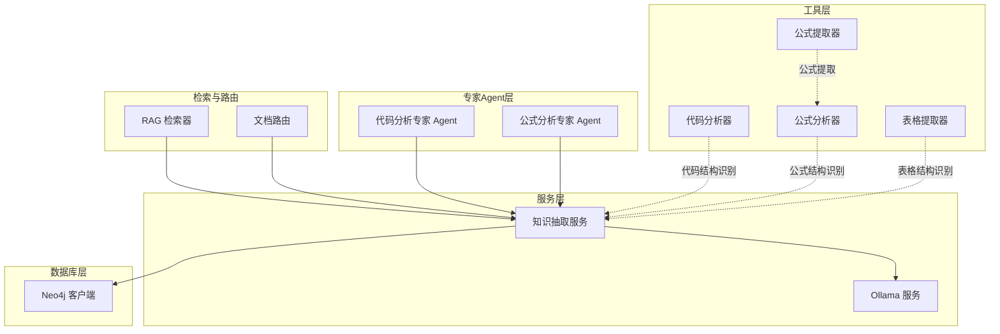
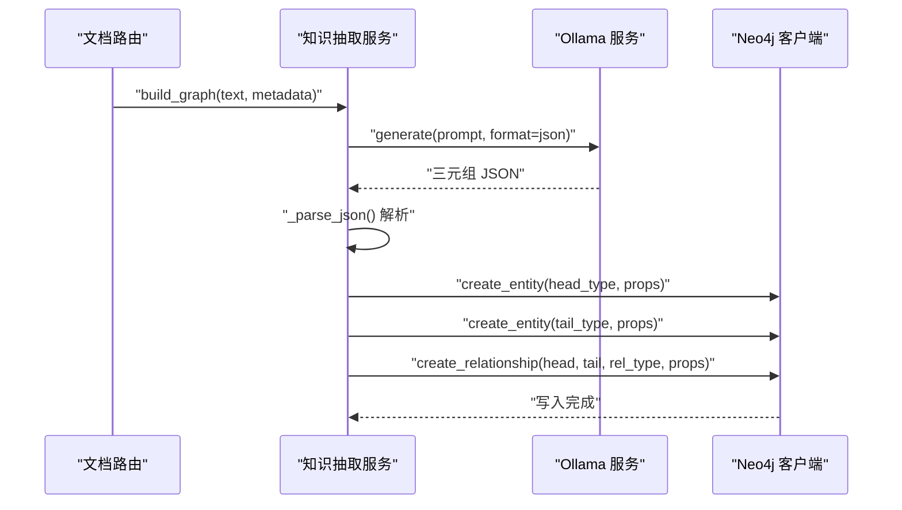
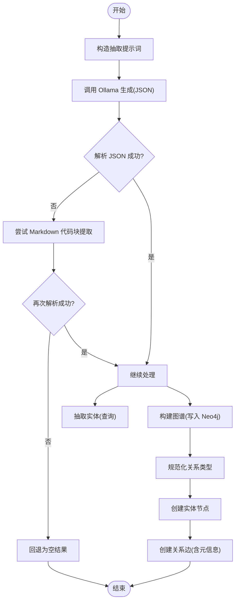
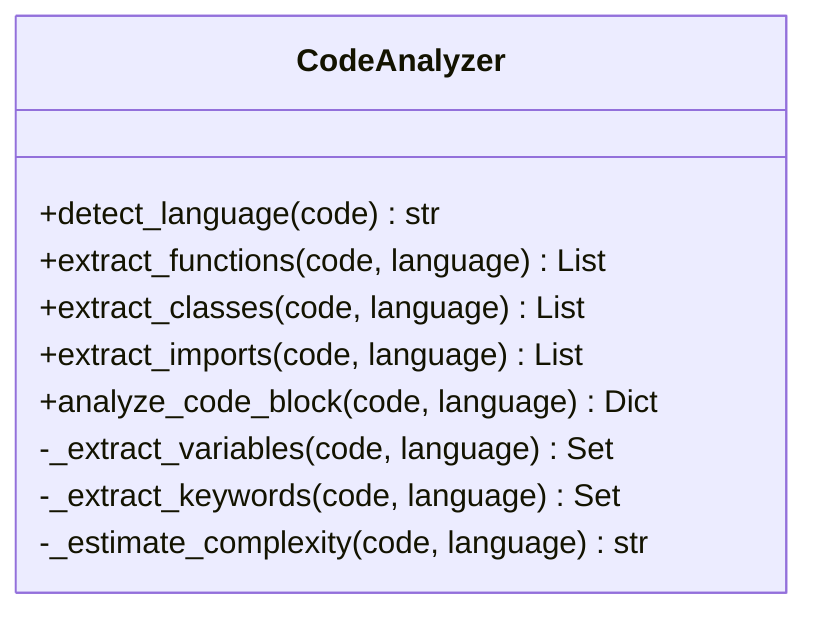
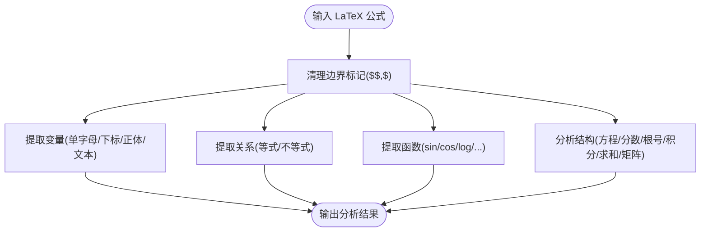
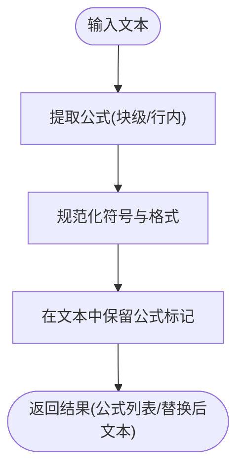
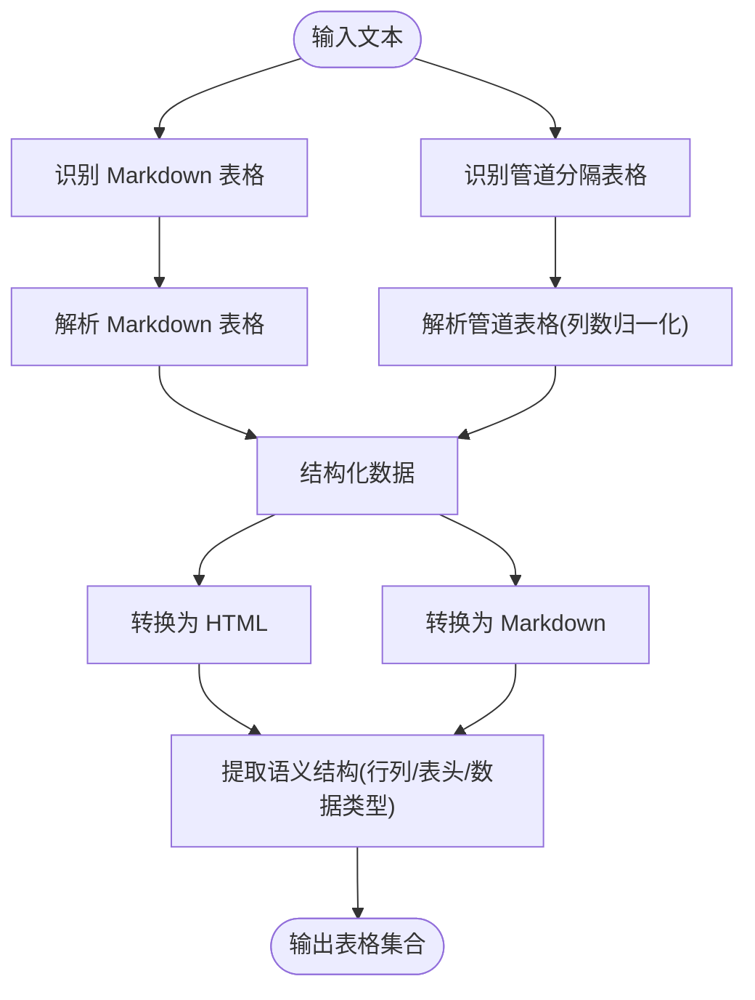
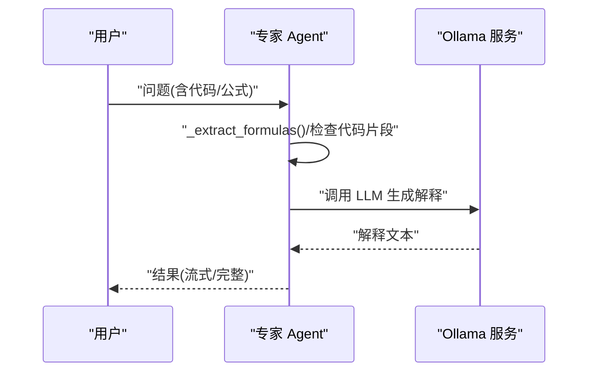
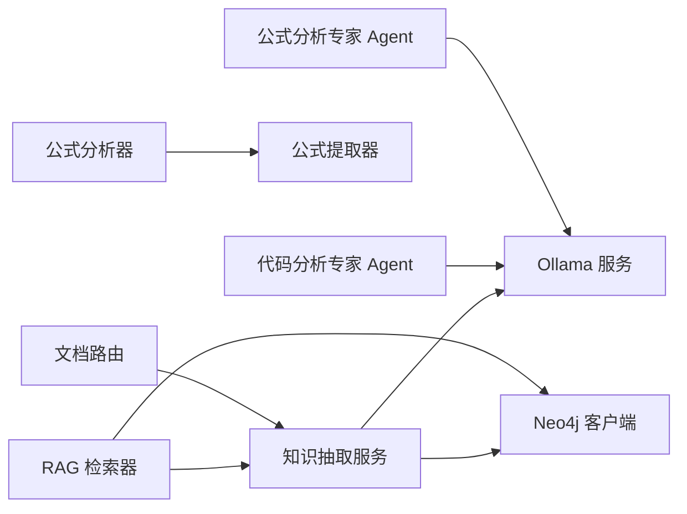

# 知识抽取服务

<cite>
**本文引用的文件**
- [知识抽取服务](file://services/knowledge_extraction_service.py)
- [代码分析器](file://utils/code_analyzer.py)
- [公式分析器](file://utils/formula_analyzer.py)
- [公式提取器](file://utils/formula_extractor.py)
- [表格提取器](file://utils/table_extractor.py)
- [Neo4j 客户端](file://database/neo4j_client.py)
- [Ollama 服务](file://services/ollama_service.py)
- [代码分析专家 Agent](file://agents/experts/code_analysis_agent.py)
- [公式分析专家 Agent](file://agents/experts/formula_analysis_agent.py)
- [Agent 基类](file://agents/base/base_agent.py)
- [RAG 检索器](file://retrieval/rag_retriever.py)
- [文档路由](file://routers/documents.py)
- [测试：高层RAG集成测试](file://tests/test_high_level_rag.py)
- [评估：问答评估](file://eval/evaluate.py)
- [README](file://README.md)
</cite>

## 目录
1. [简介](#简介)
2. [项目结构](#项目结构)
3. [核心组件](#核心组件)
4. [架构总览](#架构总览)
5. [详细组件分析](#详细组件分析)
6. [依赖分析](#依赖分析)
7. [性能考虑](#性能考虑)
8. [故障排查指南](#故障排查指南)
9. [结论](#结论)
10. [附录](#附录)

## 简介
本文件面向 Advanced RAG 项目的“知识抽取服务”，系统性阐述其整体架构、核心功能模块与处理流程，覆盖以下方面：
- 代码抽取：语法树与结构识别（函数、类、导入、变量、关键字、复杂度估算）
- 公式抽取：数学表达式解析与LaTeX处理（变量、关系、函数、结构与复杂度）
- 表格抽取：数据表格识别与结构化转换（Markdown/管道分隔表格、HTML/Markdown导出、语义结构）
- 预处理流程：文本清洗、格式标准化、噪声过滤（公式保护、LaTeX规范化）
- 后处理机制：实体链接、关系验证、结构化存储（Neo4j）
- 质量评估与优化：抽取精度提升与性能调优策略

## 项目结构
知识抽取服务位于后端服务层，围绕“抽取—存储—检索—评估”的闭环展开，主要涉及如下模块：
- 服务层：知识抽取服务负责抽取三元组、实体，并将结果写入图数据库
- 工具层：代码分析器、公式分析器、表格提取器分别承担不同模态的结构化抽取
- 数据库层：Neo4j 客户端提供图数据库连接与节点/关系创建
- 专家 Agent 层：代码分析专家与公式分析专家用于增强理解与解释
- 路由与检索：文档入库路由触发抽取，检索器在查询阶段利用抽取的实体进行图谱检索
- 评估：问答评估脚本用于端到端质量评估

**图表来源**
- [知识抽取服务:12-228](file://services/knowledge_extraction_service.py#L12-L228)
- [Ollama 服务:9-674](file://services/ollama_service.py#L9-L674)
- [代码分析器:7-350](file://utils/code_analyzer.py#L7-L350)
- [公式分析器:8-233](file://utils/formula_analyzer.py#L8-L233)
- [公式提取器:6-149](file://utils/formula_extractor.py#L6-L149)
- [表格提取器:7-290](file://utils/table_extractor.py#L7-L290)
- [Neo4j 客户端:6-104](file://database/neo4j_client.py#L6-L104)
- [RAG 检索器:243-272](file://retrieval/rag_retriever.py#L243-L272)
- [文档路由:422-446](file://routers/documents.py#L422-L446)

**章节来源**
- [知识抽取服务:12-228](file://services/knowledge_extraction_service.py#L12-L228)
- [README:1-290](file://README.md#L1-L290)

## 核心组件
- 知识抽取服务：负责从文本中抽取三元组与实体，调用 Ollama 生成，解析 JSON，规范化关系类型，最终写入 Neo4j
- 代码分析器：识别代码语言、函数、类、导入、变量、关键字，估算复杂度
- 公式分析器：从 LaTeX 公式中提取变量、关系、函数，分析结构与复杂度
- 公式提取器：识别并规范化 LaTeX/行内公式，保留公式在文本清洗中不被破坏
- 表格提取器：识别 Markdown/管道分隔表格，结构化转换为 HTML/Markdown，并提取语义结构
- Neo4j 客户端：提供连接、查询、创建实体与关系的能力
- 专家 Agent：代码分析专家与公式分析专家，辅助理解与解释

**章节来源**
- [知识抽取服务:12-228](file://services/knowledge_extraction_service.py#L12-L228)
- [代码分析器:7-350](file://utils/code_analyzer.py#L7-L350)
- [公式分析器:8-233](file://utils/formula_analyzer.py#L8-L233)
- [公式提取器:6-149](file://utils/formula_extractor.py#L6-L149)
- [表格提取器:7-290](file://utils/table_extractor.py#L7-L290)
- [Neo4j 客户端:6-104](file://database/neo4j_client.py#L6-L104)
- [代码分析专家 Agent:7-79](file://agents/experts/code_analysis_agent.py#L7-L79)
- [公式分析专家 Agent:8-107](file://agents/experts/formula_analysis_agent.py#L8-L107)

## 架构总览
知识抽取服务在文档入库与查询阶段协同工作：
- 入库阶段：文档路由触发知识抽取服务，抽取三元组并写入 Neo4j
- 查询阶段：RAG 检索器先从查询中抽取实体，再在 Neo4j 中检索实体及其一跳邻居

**图表来源**
- [知识抽取服务:147-228](file://services/knowledge_extraction_service.py#L147-L228)
- [Ollama 服务:50-93](file://services/ollama_service.py#L50-L93)
- [Neo4j 客户端:64-101](file://database/neo4j_client.py#L64-L101)
- [文档路由:422-446](file://routers/documents.py#L422-L446)

## 详细组件分析

### 知识抽取服务
- 职责：抽取三元组与实体，构建知识图谱，写入 Neo4j
- 关键流程：
  - 三元组抽取：构造提示词，调用 Ollama，解析 JSON（支持 Markdown 代码块包裹）
  - 实体抽取：从查询中提取关键实体
  - 图谱构建：创建实体节点、关系边，规范化关系类型，携带文档/块元信息
  - 错误处理：连接失败冷却、异常捕获、日志记录
- 并发与性能：使用线程池执行同步 IO（requests），避免阻塞事件循环；支持环境变量开关 Neo4j

**图表来源**
- [知识抽取服务:36-146](file://services/knowledge_extraction_service.py#L36-L146)
- [知识抽取服务:147-228](file://services/knowledge_extraction_service.py#L147-L228)

**章节来源**
- [知识抽取服务:12-228](file://services/knowledge_extraction_service.py#L12-L228)

### 代码分析器
- 职责：识别代码语言，提取函数、类、导入、变量、关键字，估算复杂度
- 语言支持：Python、JavaScript、Java、C++
- 处理方式：正则匹配不同语言的语法特征，统一输出结构化字段

**图表来源**
- [代码分析器:7-350](file://utils/code_analyzer.py#L7-L350)

**章节来源**
- [代码分析器:7-350](file://utils/code_analyzer.py#L7-L350)

### 公式分析器
- 职责：从 LaTeX 公式中提取变量、关系、函数，分析结构与复杂度
- 处理方式：清理边界标记、正则匹配变量/关系/函数、结构特征统计、复杂度评分

**图表来源**
- [公式分析器:32-233](file://utils/formula_analyzer.py#L32-L233)

**章节来源**
- [公式分析器:8-233](file://utils/formula_analyzer.py#L8-L233)

### 公式提取器
- 职责：识别块级/行内 LaTeX 公式，规范化符号，保留公式在文本清洗中不被破坏
- 处理方式：多模式匹配、去重、位置记录、符号替换

**图表来源**
- [公式提取器:28-149](file://utils/formula_extractor.py#L28-L149)

**章节来源**
- [公式提取器:6-149](file://utils/formula_extractor.py#L6-L149)

### 表格提取器
- 职责：识别 Markdown/管道分隔表格，结构化转换为 HTML/Markdown，提取语义结构（行列数、表头、数据类型）
- 处理方式：行扫描、分隔行识别、列数归一化、HTML/Markdown 转换、HTML 转义

**图表来源**
- [表格提取器:10-290](file://utils/table_extractor.py#L10-L290)

**章节来源**
- [表格提取器:7-290](file://utils/table_extractor.py#L7-L290)

### 专家 Agent（代码/公式）
- 代码分析专家：识别代码并提供功能、关键段解释、实现建议与技术说明
- 公式分析专家：识别公式并解释物理意义、变量含义、适用条件与应用场景

**图表来源**
- [代码分析专家 Agent:25-79](file://agents/experts/code_analysis_agent.py#L25-L79)
- [公式分析专家 Agent:26-107](file://agents/experts/formula_analysis_agent.py#L26-L107)
- [Agent 基类:75-122](file://agents/base/base_agent.py#L75-L122)
- [Ollama 服务:50-93](file://services/ollama_service.py#L50-L93)

**章节来源**
- [代码分析专家 Agent:7-79](file://agents/experts/code_analysis_agent.py#L7-L79)
- [公式分析专家 Agent:8-107](file://agents/experts/formula_analysis_agent.py#L8-L107)
- [Agent 基类:8-122](file://agents/base/base_agent.py#L8-L122)

## 依赖分析
- 服务层依赖：
  - 知识抽取服务依赖 Ollama 服务进行三元组抽取，依赖 Neo4j 客户端进行图谱写入
  - RAG 检索器在查询阶段依赖知识抽取服务抽取实体，再通过 Neo4j 执行 Cypher 查询
  - 文档路由在入库阶段并发调度知识抽取服务，受运行时配置控制
- 工具层依赖：
  - 公式分析器依赖公式提取器进行公式识别
  - 专家 Agent 依赖 Ollama 服务进行生成
- 数据库层依赖：
  - Neo4j 客户端提供连接、查询、创建实体与关系的统一接口

**图表来源**
- [知识抽取服务:12-228](file://services/knowledge_extraction_service.py#L12-L228)
- [Ollama 服务:9-674](file://services/ollama_service.py#L9-L674)
- [Neo4j 客户端:6-104](file://database/neo4j_client.py#L6-L104)
- [RAG 检索器:243-272](file://retrieval/rag_retriever.py#L243-L272)
- [文档路由:422-446](file://routers/documents.py#L422-L446)
- [公式分析器:8-233](file://utils/formula_analyzer.py#L8-L233)
- [公式提取器:6-149](file://utils/formula_extractor.py#L6-L149)
- [代码分析专家 Agent:7-79](file://agents/experts/code_analysis_agent.py#L7-L79)
- [公式分析专家 Agent:8-107](file://agents/experts/formula_analysis_agent.py#L8-L107)

**章节来源**
- [知识抽取服务:12-228](file://services/knowledge_extraction_service.py#L12-L228)
- [RAG 检索器:243-272](file://retrieval/rag_retriever.py#L243-L272)
- [文档路由:422-446](file://routers/documents.py#L422-L446)

## 性能考虑
- I/O 阻塞规避：知识抽取服务与 Neo4j 客户端均使用线程池执行同步 IO，避免阻塞事件循环
- 连接稳定性：Neo4j 连接失败时启用冷却时间，避免频繁重试刷屏
- 并发控制：文档入库阶段通过信号量限制并发度，支持运行时参数调整
- 超时与流式：Ollama 服务支持流式生成与较长超时，适配大模型生成
- 环境变量控制：Neo4j 开关、并发度、超时、最大块数等参数可配置

**章节来源**
- [知识抽取服务:147-228](file://services/knowledge_extraction_service.py#L147-L228)
- [Neo4j 客户端:16-39](file://database/neo4j_client.py#L16-L39)
- [文档路由:434-446](file://routers/documents.py#L434-L446)
- [Ollama 服务:50-93](file://services/ollama_service.py#L50-L93)

## 故障排查指南
- Neo4j 连接失败
  - 现象：日志提示连接失败并进入冷却时间
  - 处理：检查环境变量 NEO4J_URI/USER/PASSWORD；确认容器内 URI 替换为 host.docker.internal
- 三元组 JSON 解析失败
  - 现象：模型返回 Markdown 代码块包裹的 JSON 或单对象
  - 处理：服务内置解析与修复逻辑；如仍失败，检查提示词与模型输出格式
- 实体提取为空
  - 现象：查询中未识别到实体
  - 处理：确认查询内容包含关键实体；检查 Agent 的提示词与模型选择
- 公式保护与清洗
  - 现象：文本清洗后公式丢失
  - 处理：使用公式提取器的保留函数，确保公式在清洗前后保持不变
- 表格识别不准确
  - 现象：Markdown/管道表格未被识别或列数不一致
  - 处理：检查分隔行与列数一致性；必要时手动修正格式

**章节来源**
- [知识抽取服务:63-105](file://services/knowledge_extraction_service.py#L63-L105)
- [Neo4j 客户端:16-39](file://database/neo4j_client.py#L16-L39)
- [公式提取器:107-131](file://utils/formula_extractor.py#L107-L131)
- [表格提取器:34-173](file://utils/table_extractor.py#L34-L173)

## 结论
知识抽取服务通过“抽取—存储—检索—评估”的闭环，实现了对多模态内容（代码、公式、表格）的结构化理解与知识图谱构建。其设计强调：
- 模块化与可扩展：工具层独立负责不同模态的抽取，服务层统一编排
- 稳定性与性能：线程池规避阻塞、连接冷却、并发控制与流式生成
- 可观测与可控：日志、环境变量与运行时配置提供可观测性与灵活性
在实际部署中，建议结合评估脚本持续优化提示词与模型配置，以提升抽取精度与系统整体性能。

## 附录

### 预处理流程（文本清洗、格式标准化、噪声过滤）
- 公式保护：在清洗前使用公式提取器保留公式，避免被误删
- LaTeX 规范化：替换常见错误编码为标准 LaTeX 符号，统一格式
- 表格格式化：识别 Markdown/管道表格，进行结构化转换与 HTML/Markdown 导出

**章节来源**
- [公式提取器:107-131](file://utils/formula_extractor.py#L107-L131)
- [表格提取器:134-233](file://utils/table_extractor.py#L134-L233)

### 后处理机制（实体链接、关系验证、结构化存储）
- 实体链接：通过 Neo4j MERGE 保证实体唯一性
- 关系验证：规范化关系类型（大写、下划线、去非法字符），避免无效类型
- 结构化存储：节点属性包含名称与来源元信息，关系属性包含文档/块 ID

**章节来源**
- [知识抽取服务:173-228](file://services/knowledge_extraction_service.py#L173-L228)
- [Neo4j 客户端:64-101](file://database/neo4j_client.py#L64-L101)

### 质量评估与优化策略
- 评估指标：基于问答评估脚本，使用 LLM-as-a-Judge 对回答正确性打分
- 优化策略：
  - 提示词工程：针对不同模态（代码/公式/表格）定制提示词
  - 模型选择：根据任务复杂度选择合适模型
  - 并发与超时：根据吞吐与延迟目标调整并发度与超时参数
  - 集成测试：通过高层集成测试验证抽取与检索链路

**章节来源**
- [评估：问答评估:19-91](file://eval/evaluate.py#L19-L91)
- [测试：高层RAG集成测试:64-85](file://tests/test_high_level_rag.py#L64-L85)