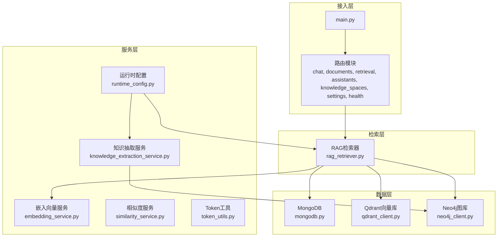
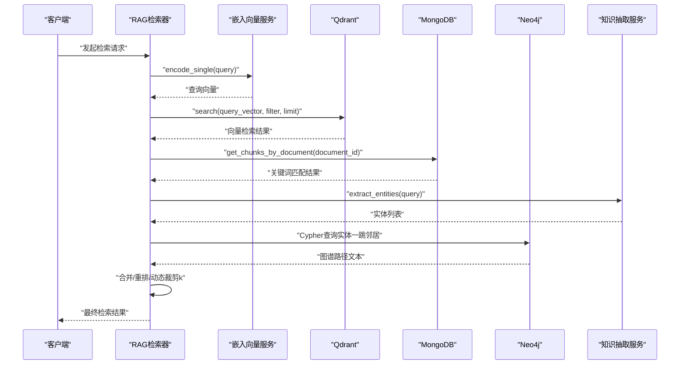
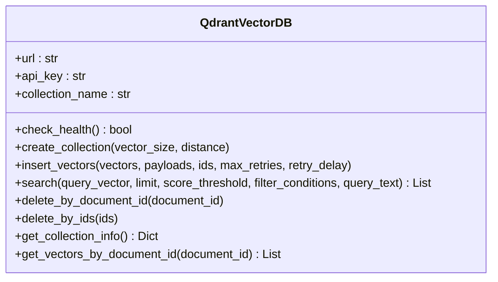
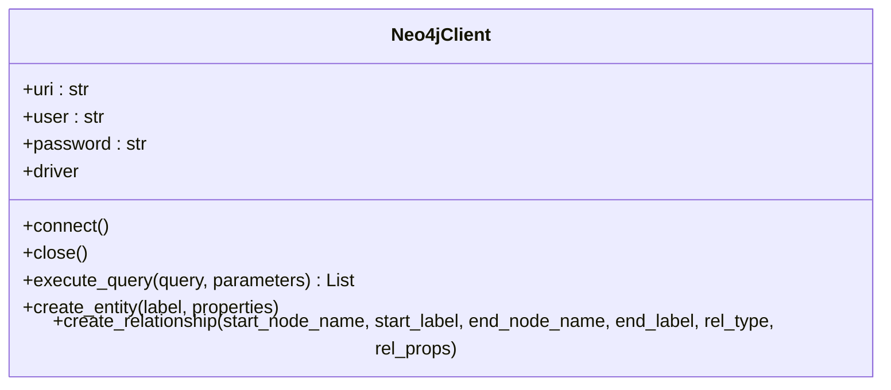
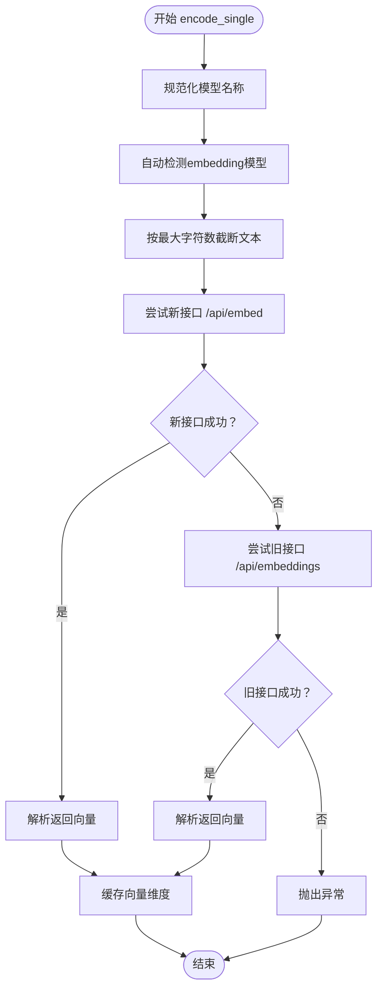
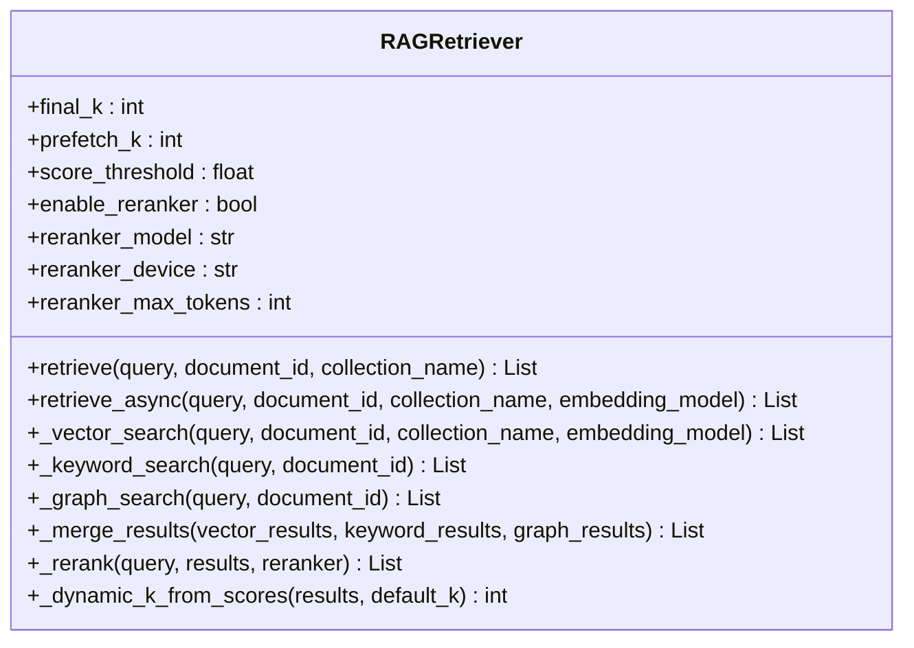
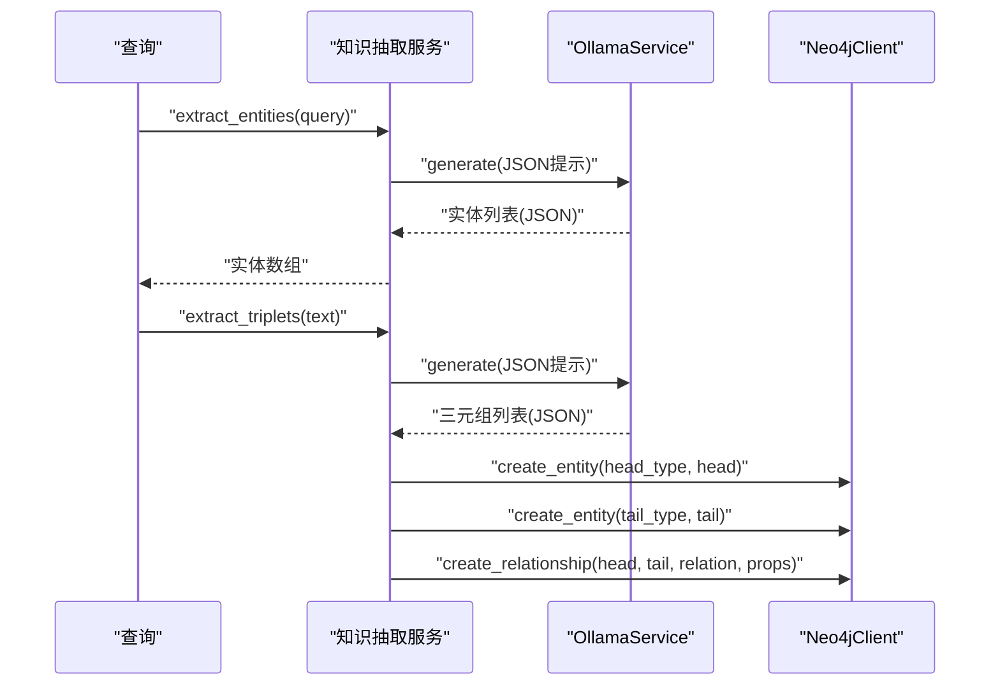
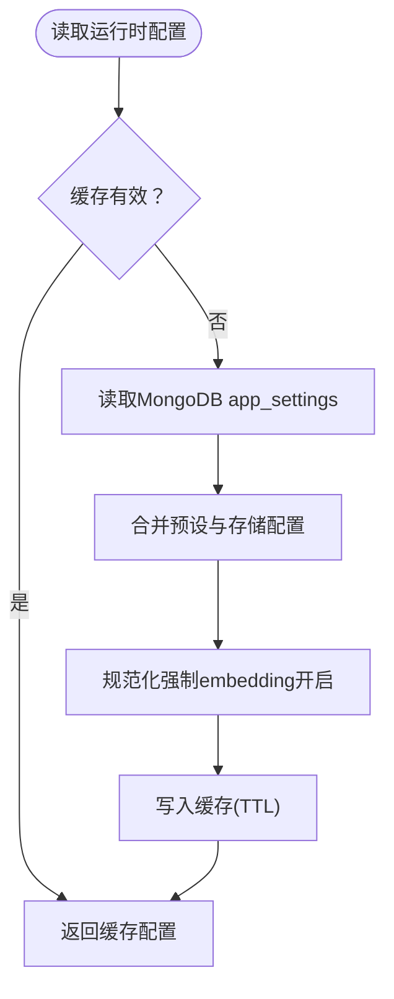
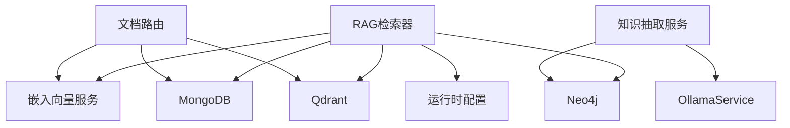

# 双路索引系统

<cite>
**本文引用的文件**
- [main.py](file://main.py)
- [docker-compose.yml](file://docker-compose.yml)
- [requirements.txt](file://requirements.txt)
- [database/qdrant_client.py](file://database/qdrant_client.py)
- [database/neo4j_client.py](file://database/neo4j_client.py)
- [database/mongodb.py](file://database/mongodb.py)
- [embedding/embedding_service.py](file://embedding/embedding_service.py)
- [retrieval/rag_retriever.py](file://retrieval/rag_retriever.py)
- [services/knowledge_extraction_service.py](file://services/knowledge_extraction_service.py)
- [services/runtime_config.py](file://services/runtime_config.py)
- [services/similarity_service.py](file://services/similarity_service.py)
- [utils/token_utils.py](file://utils/token_utils.py)
- [routers/documents.py](file://routers/documents.py)
</cite>

## 目录
1. [简介](#简介)
2. [项目结构](#项目结构)
3. [核心组件](#核心组件)
4. [架构总览](#架构总览)
5. [详细组件分析](#详细组件分析)
6. [依赖关系分析](#依赖关系分析)
7. [性能考量](#性能考量)
8. [故障排除指南](#故障排除指南)
9. [结论](#结论)
10. [附录](#附录)

## 简介
本文件面向Advanced RAG项目的双路索引系统，系统采用向量索引与知识图谱索引协同工作的方式，结合Qdrant向量数据库与Neo4j图数据库，提供高效、可扩展的检索与推理能力。系统通过嵌入向量服务统一生成文本向量，利用MongoDB存储文档与分块元数据，通过运行时配置控制模块开关与性能参数，最终在检索阶段融合向量检索、关键词检索与图谱检索，并可选地进行重排优化。

## 项目结构
项目采用模块化分层设计：
- 接入层：FastAPI应用入口与路由注册
- 数据层：MongoDB（文档与分块）、Qdrant（向量）、Neo4j（图谱）
- 服务层：嵌入向量服务、知识抽取与图谱构建、运行时配置、相似度计算等
- 检索层：RAG检索器，负责多路检索与融合

图表来源
- [main.py:55-99](file://main.py#L55-L99)
- [database/mongodb.py:92-204](file://database/mongodb.py#L92-L204)
- [database/qdrant_client.py:18-123](file://database/qdrant_client.py#L18-L123)
- [database/neo4j_client.py:6-39](file://database/neo4j_client.py#L6-L39)
- [embedding/embedding_service.py:8-44](file://embedding/embedding_service.py#L8-L44)
- [retrieval/rag_retriever.py:17-51](file://retrieval/rag_retriever.py#L17-L51)
- [services/knowledge_extraction_service.py:12-34](file://services/knowledge_extraction_service.py#L12-L34)
- [services/runtime_config.py:128-161](file://services/runtime_config.py#L128-L161)

章节来源
- [main.py:1-171](file://main.py#L1-L171)
- [docker-compose.yml:1-96](file://docker-compose.yml#L1-L96)
- [requirements.txt:1-42](file://requirements.txt#L1-L42)

## 核心组件
- Qdrant向量数据库客户端：封装连接、集合管理、向量插入、相似度搜索、过滤删除、滚动查询等能力，支持gRPC连接与重试机制。
- Neo4j图数据库客户端：封装连接、Cypher执行、实体与关系创建，支持容器环境URI适配。
- 嵌入向量服务：基于Ollama的文本向量化，支持模型名称规范化、自动检测、超时与重试、维度缓存。
- RAG检索器：异步多路检索（向量、关键词、图谱），结果合并与重排，动态裁剪k，运行时配置开关。
- 知识抽取服务：从文本抽取三元组并写入Neo4j，支持冷却机制避免频繁失败。
- 运行时配置：低/高预设模式与自定义模式，模块开关与参数缓存，TTL控制。
- MongoDB：异步与同步客户端封装，连接池参数优化，集合操作。

章节来源
- [database/qdrant_client.py:18-544](file://database/qdrant_client.py#L18-L544)
- [database/neo4j_client.py:6-104](file://database/neo4j_client.py#L6-L104)
- [embedding/embedding_service.py:8-333](file://embedding/embedding_service.py#L8-L333)
- [retrieval/rag_retriever.py:17-393](file://retrieval/rag_retriever.py#L17-L393)
- [services/knowledge_extraction_service.py:12-229](file://services/knowledge_extraction_service.py#L12-L229)
- [services/runtime_config.py:128-218](file://services/runtime_config.py#L128-L218)
- [database/mongodb.py:92-336](file://database/mongodb.py#L92-L336)

## 架构总览
双路索引系统通过检索器并行执行三种检索策略：
- 向量检索：对查询文本编码，调用Qdrant进行相似度搜索，支持过滤与阈值。
- 关键词检索：在MongoDB分块集合中按文档ID过滤，计算关键词命中率。
- 图谱检索：从查询中抽取实体，查询Neo4j图谱一跳邻居，构造知识文本。

随后进行结果合并与重排（可选），并根据重排分数在线动态调整返回数量k。

图表来源
- [retrieval/rag_retriever.py:89-137](file://retrieval/rag_retriever.py#L89-L137)
- [embedding/embedding_service.py:316-318](file://embedding/embedding_service.py#L316-L318)
- [database/qdrant_client.py:336-413](file://database/qdrant_client.py#L336-L413)
- [database/mongodb.py:793-800](file://database/mongodb.py#L793-L800)
- [services/knowledge_extraction_service.py:107-145](file://services/knowledge_extraction_service.py#L107-L145)
- [database/neo4j_client.py:40-62](file://database/neo4j_client.py#L40-L62)

## 详细组件分析

### Qdrant向量数据库客户端
- 连接与安全：自动处理API Key与HTTP连接的安全警告，优先使用gRPC（端口6334）以避免Windows上httpx的502问题，支持连接池与超时配置。
- 健康检查：通过获取集合列表验证服务可用性，失败时重试并回退到127.0.0.1。
- 集合管理：创建集合时校验维度，不匹配则重建；支持自动检测并重建。
- 向量插入：支持UUID ID生成与转换，带重试与指数退避，自动处理维度错误与临时性错误。
- 查询策略：支持过滤条件、相似度阈值、按文档ID删除、滚动查询获取全部向量。
- 性能优化：gRPC连接复用、连接池参数、重试与降级策略。

图表来源
- [database/qdrant_client.py:18-544](file://database/qdrant_client.py#L18-L544)

章节来源
- [database/qdrant_client.py:18-123](file://database/qdrant_client.py#L18-L123)
- [database/qdrant_client.py:140-209](file://database/qdrant_client.py#L140-L209)
- [database/qdrant_client.py:210-335](file://database/qdrant_client.py#L210-L335)
- [database/qdrant_client.py:336-413](file://database/qdrant_client.py#L336-L413)
- [database/qdrant_client.py:415-526](file://database/qdrant_client.py#L415-L526)

### Neo4j图数据库客户端
- 连接管理：支持容器环境URI适配（localhost替换为host.docker.internal），连接成功后验证连通性。
- Cypher执行：封装session.run，捕获异常并返回None，便于上层降级。
- 实体与关系：提供MERGE创建实体与关系的方法，支持属性注入与source_doc/source_chunk标注。

图表来源
- [database/neo4j_client.py:6-104](file://database/neo4j_client.py#L6-L104)

章节来源
- [database/neo4j_client.py:6-39](file://database/neo4j_client.py#L6-L39)
- [database/neo4j_client.py:40-101](file://database/neo4j_client.py#L40-L101)

### 嵌入向量服务
- 模型发现：支持规范化模型名称（处理标签与latest），自动检测可用embedding模型。
- 请求处理：优先使用新接口/api/embed，回退到旧接口/api/embeddings，统一解析返回结构，支持超时与重试。
- 文本截断：针对Ollama上下文长度限制进行字符截断，避免超长文本报错。
- 维度缓存：首次调用后缓存向量维度，后续调用复用。

图表来源
- [embedding/embedding_service.py:175-290](file://embedding/embedding_service.py#L175-L290)
- [embedding/embedding_service.py:292-318](file://embedding/embedding_service.py#L292-L318)

章节来源
- [embedding/embedding_service.py:8-44](file://embedding/embedding_service.py#L8-L44)
- [embedding/embedding_service.py:107-154](file://embedding/embedding_service.py#L107-L154)
- [embedding/embedding_service.py:175-290](file://embedding/embedding_service.py#L175-L290)
- [embedding/embedding_service.py:292-318](file://embedding/embedding_service.py#L292-L318)

### RAG检索器
- 异步检索：并行执行向量、关键词、图谱检索，支持运行时配置模块开关。
- 结果合并：向量结果作为基线，关键词结果提升分数，图谱结果作为补充。
- 重排与动态k：可选CrossEncoder重排，基于分数分布动态调整返回数量。
- 运行时配置：通过MongoDB app_settings读取，支持低/高预设与自定义模式，模块开关与参数缓存。

图表来源
- [retrieval/rag_retriever.py:17-137](file://retrieval/rag_retriever.py#L17-L137)
- [retrieval/rag_retriever.py:169-240](file://retrieval/rag_retriever.py#L169-L240)
- [retrieval/rag_retriever.py:242-326](file://retrieval/rag_retriever.py#L242-L326)
- [retrieval/rag_retriever.py:328-392](file://retrieval/rag_retriever.py#L328-L392)

章节来源
- [retrieval/rag_retriever.py:17-51](file://retrieval/rag_retriever.py#L17-L51)
- [retrieval/rag_retriever.py:89-137](file://retrieval/rag_retriever.py#L89-L137)
- [retrieval/rag_retriever.py:169-240](file://retrieval/rag_retriever.py#L169-L240)
- [retrieval/rag_retriever.py:242-326](file://retrieval/rag_retriever.py#L242-L326)
- [retrieval/rag_retriever.py:328-392](file://retrieval/rag_retriever.py#L328-L392)

### 知识抽取与图谱构建服务
- 三元组抽取：基于Ollama生成JSON格式三元组，支持从Markdown代码块中提取。
- 实体提取：从查询中提取关键实体，用于图谱检索。
- 图谱构建：创建实体与关系，规范化关系类型，支持source_doc/source_chunk属性，冷却机制避免频繁失败。

图表来源
- [services/knowledge_extraction_service.py:107-145](file://services/knowledge_extraction_service.py#L107-L145)
- [services/knowledge_extraction_service.py:36-70](file://services/knowledge_extraction_service.py#L36-L70)
- [services/knowledge_extraction_service.py:147-213](file://services/knowledge_extraction_service.py#L147-L213)

章节来源
- [services/knowledge_extraction_service.py:12-34](file://services/knowledge_extraction_service.py#L12-L34)
- [services/knowledge_extraction_service.py:107-145](file://services/knowledge_extraction_service.py#L107-L145)
- [services/knowledge_extraction_service.py:147-213](file://services/knowledge_extraction_service.py#L147-L213)

### 运行时配置
- 预设模式：低/高预设，强制保留embedding模块，其余模块可开关。
- 缓存与TTL：内存缓存+TTL，异步读取，避免频繁MongoDB访问。
- 动态更新：合并更新并写回MongoDB，刷新缓存。

图表来源
- [services/runtime_config.py:128-161](file://services/runtime_config.py#L128-L161)
- [services/runtime_config.py:164-188](file://services/runtime_config.py#L164-L188)
- [services/runtime_config.py:191-217](file://services/runtime_config.py#L191-L217)

章节来源
- [services/runtime_config.py:128-161](file://services/runtime_config.py#L128-L161)
- [services/runtime_config.py:164-188](file://services/runtime_config.py#L164-L188)
- [services/runtime_config.py:191-217](file://services/runtime_config.py#L191-L217)

### MongoDB客户端
- 异步与同步：提供AsyncIOMotorClient与同步MongoClient封装，连接池参数可配置。
- URI解析：支持MONGODB_URI或独立环境变量组合，自动解析数据库名。
- 连接测试：启动时ping校验，失败给出明确提示与建议。

章节来源
- [database/mongodb.py:92-204](file://database/mongodb.py#L92-L204)
- [database/mongodb.py:232-336](file://database/mongodb.py#L232-L336)

## 依赖关系分析
- 组件耦合：检索器依赖嵌入服务、MongoDB、Qdrant、Neo4j与运行时配置；知识抽取服务依赖Ollama与Neo4j。
- 外部依赖：QdrantClient、Neo4j驱动、MongoDB驱动、sentence-transformers（重排模型）。
- 循环依赖：未发现循环依赖，模块职责清晰。

图表来源
- [retrieval/rag_retriever.py:17-51](file://retrieval/rag_retriever.py#L17-L51)
- [services/knowledge_extraction_service.py:12-17](file://services/knowledge_extraction_service.py#L12-L17)
- [routers/documents.py:603-627](file://routers/documents.py#L603-L627)

章节来源
- [requirements.txt:9-14](file://requirements.txt#L9-L14)
- [requirements.txt:14](file://requirements.txt#L14)

## 性能考量
- 连接与协议
  - Qdrant：优先使用gRPC（端口6334），避免httpx 502问题，支持连接复用与超时配置。
  - MongoDB：合理设置连接池参数（maxPoolSize/minPoolSize/maxIdleTimeMS/serverSelectionTimeoutMS/connectTimeoutMS/socketTimeoutMS）。
- 重试与降级
  - Qdrant插入与搜索具备指数退避与临时性错误重试，集合不存在时自动创建。
  - Neo4j连接失败冷却，避免刷屏与资源浪费。
- 检索参数
  - 向量检索：prefetch_k放大候选池，score_threshold过滤低质量结果。
  - 重排：控制reranker_max_tokens，避免长文本导致延迟或崩溃。
  - 动态k：根据分数分布自适应调整返回数量，平衡召回与精度。
- Token预算
  - 使用近似token估算与二分截断，避免超预算与性能抖动。

章节来源
- [database/qdrant_client.py:66-95](file://database/qdrant_client.py#L66-L95)
- [database/qdrant_client.py:278-334](file://database/qdrant_client.py#L278-L334)
- [database/mongodb.py:122-136](file://database/mongodb.py#L122-L136)
- [retrieval/rag_retriever.py:42-50](file://retrieval/rag_retriever.py#L42-L50)
- [retrieval/rag_retriever.py:139-167](file://retrieval/rag_retriever.py#L139-L167)
- [utils/token_utils.py:16-71](file://utils/token_utils.py#L16-L71)

## 故障排除指南
- Qdrant连接问题
  - 现象：连接失败、502错误。
  - 处理：自动重试并回退到127.0.0.1；确认使用gRPC端口；检查API Key与HTTP安全警告。
  - 参考：[database/qdrant_client.py:98-123](file://database/qdrant_client.py#L98-L123)
- Neo4j连接问题
  - 现象：连接失败、容器内localhost不可达。
  - 处理：容器内自动替换localhost为host.docker.internal；连接失败后冷却5分钟。
  - 参考：[database/neo4j_client.py:16-38](file://database/neo4j_client.py#L16-L38)
- 嵌入服务超时/模型未找到
  - 现象：Ollama请求超时、模型未找到。
  - 处理：递增等待重试；检查模型名称与标签；确认Ollama服务可达。
  - 参考：[embedding/embedding_service.py:259-287](file://embedding/embedding_service.py#L259-L287)
- 检索结果为空
  - 现象：关键词检索在全局场景下跳过，图谱检索无实体。
  - 处理：限定document_id进行关键词匹配；确保知识抽取服务可用。
  - 参考：[retrieval/rag_retriever.py:214-215](file://retrieval/rag_retriever.py#L214-L215)

章节来源
- [database/qdrant_client.py:98-123](file://database/qdrant_client.py#L98-L123)
- [database/neo4j_client.py:16-38](file://database/neo4j_client.py#L16-L38)
- [embedding/embedding_service.py:259-287](file://embedding/embedding_service.py#L259-L287)
- [retrieval/rag_retriever.py:214-215](file://retrieval/rag_retriever.py#L214-L215)

## 结论
Advanced RAG的双路索引系统通过向量与图谱的协同，结合嵌入服务与运行时配置，实现了高可用、高性能的检索与推理能力。系统在连接协议、重试降级、参数调优与动态裁剪等方面进行了充分优化，能够满足生产环境的稳定性与性能需求。建议在部署时关注环境变量配置、容器网络与数据库连接池参数，并通过运行时配置灵活调整模块能力。

## 附录

### 环境变量与配置要点
- Qdrant
  - QDRANT_URL：服务地址（默认http://localhost:6333）
  - QDRANT_API_KEY：API密钥（本地HTTP可省略）
  - QDRANT_TIMEOUT：连接超时（秒）
  - QDRANT_GRPC_PORT：gRPC端口（默认6334）
- Neo4j
  - NEO4J_URI：Bolt连接地址（默认bolt://localhost:7687）
  - NEO4J_USER：用户名（默认neo4j）
  - NEO4J_PASSWORD：密码（默认password）
- MongoDB
  - MONGODB_URI：完整连接字符串（优先）
  - MONGODB_HOST/MONGODB_PORT/MONGODB_USERNAME/MONGODB_PASSWORD/MONGODB_AUTH_SOURCE/MONGODB_DB_NAME：独立配置
  - 连接池参数：MONGODB_MAX_POOL_SIZE、MONGODB_MIN_POOL_SIZE、MONGODB_MAX_IDLE_TIME_MS、MONGODB_SERVER_SELECTION_TIMEOUT_MS、MONGODB_CONNECT_TIMEOUT_MS、MONGODB_SOCKET_TIMEOUT_MS
- 嵌入向量服务
  - OLLAMA_BASE_URL：Ollama服务地址（默认http://127.0.0.1:11434）
  - OLLAMA_EMBEDDING_MODEL：指定模型名称
  - OLLAMA_EMBEDDING_MAX_CHARS：最大字符数（默认2000）
- 检索与运行时
  - ENABLE_RERANKER：是否启用重排
  - RERANKER_MODEL：重排模型名（默认BAAI/bge-reranker-base）
  - RERANKER_DEVICE：设备（cpu/cuda）
  - DYNK_MIN/DYNK_MAX/DYNK_GAP_HIGH/DYNK_GAP_LOW：动态k参数
  - NEO4J_ENABLED：是否启用Neo4j图谱构建

章节来源
- [database/qdrant_client.py:35-68](file://database/qdrant_client.py#L35-L68)
- [database/neo4j_client.py:11-13](file://database/neo4j_client.py#L11-L13)
- [database/mongodb.py:101-136](file://database/mongodb.py#L101-L136)
- [embedding/embedding_service.py:21-30](file://embedding/embedding_service.py#L21-L30)
- [retrieval/rag_retriever.py:42-50](file://retrieval/rag_retriever.py#L42-L50)
- [services/knowledge_extraction_service.py:156-158](file://services/knowledge_extraction_service.py#L156-L158)

### 数据同步与一致性
- 文档入库流程：文档路由在入库阶段检查Qdrant健康状况，若可用则按实际向量维度创建集合并存储向量；若不可用则仅存储到MongoDB。
- 图谱构建：知识抽取服务在构建图谱时具备冷却机制，避免频繁失败导致日志刷屏。

章节来源
- [routers/documents.py:603-627](file://routers/documents.py#L603-L627)
- [services/knowledge_extraction_service.py:160-171](file://services/knowledge_extraction_service.py#L160-L171)

### 查询与路由策略
- 检索路由：检索器根据运行时配置决定是否启用图谱检索与重排；向量检索支持按document_id过滤；关键词检索在限定文档ID时进行。
- 图谱查询：从查询中抽取实体，查询一跳邻居并构造知识文本，支持按文档ID过滤。

章节来源
- [retrieval/rag_retriever.py:102-120](file://retrieval/rag_retriever.py#L102-L120)
- [retrieval/rag_retriever.py:242-326](file://retrieval/rag_retriever.py#L242-L326)