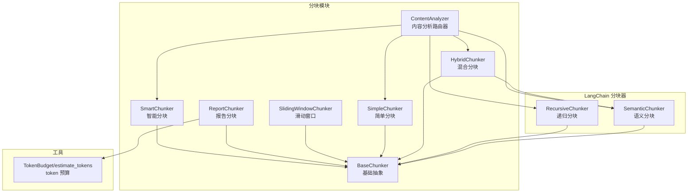
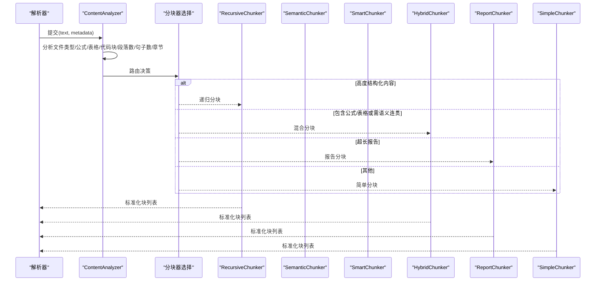
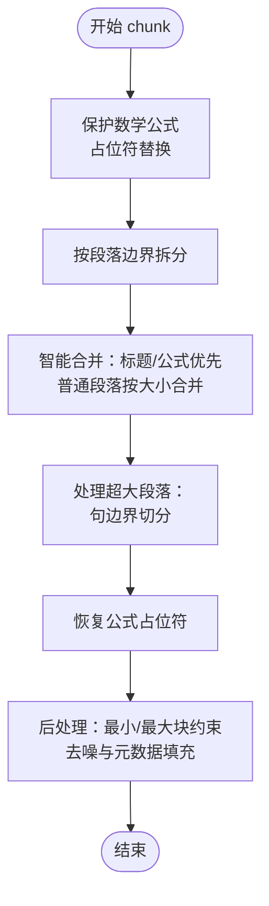
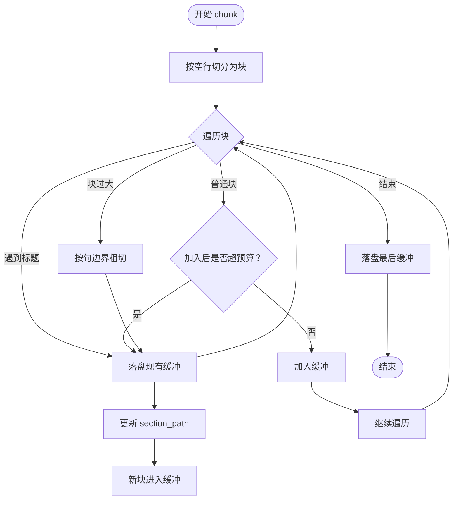
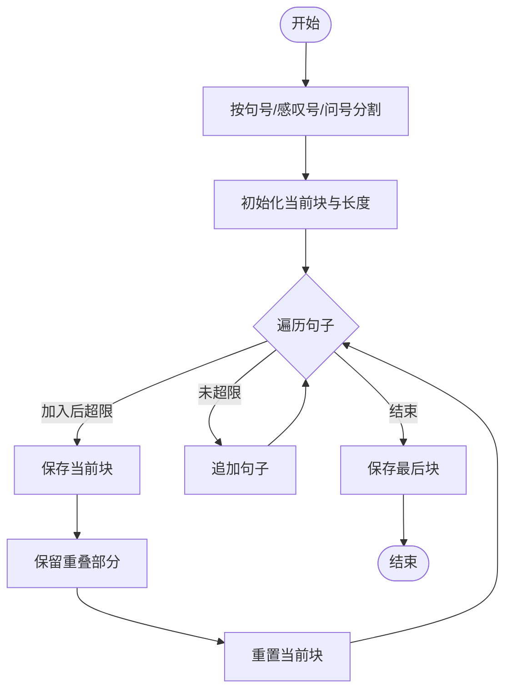
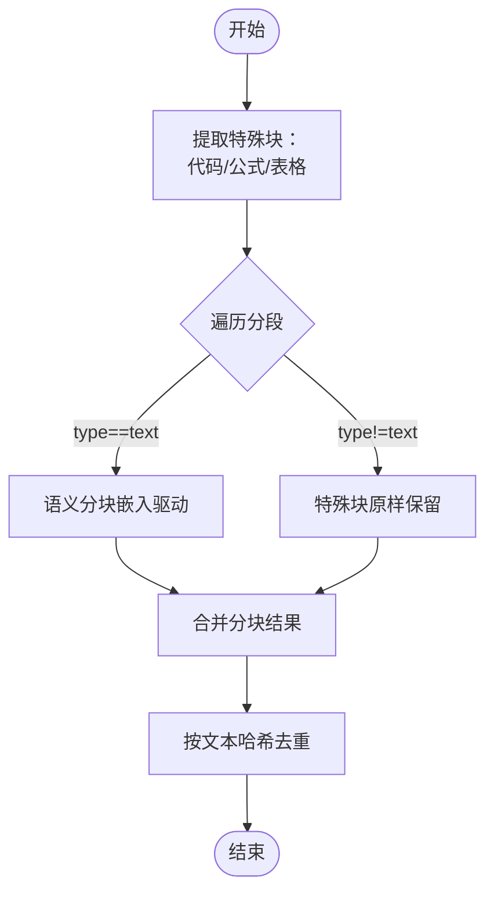
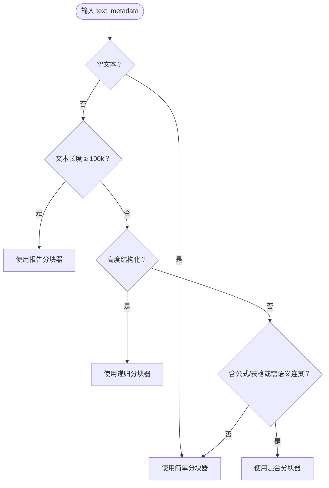
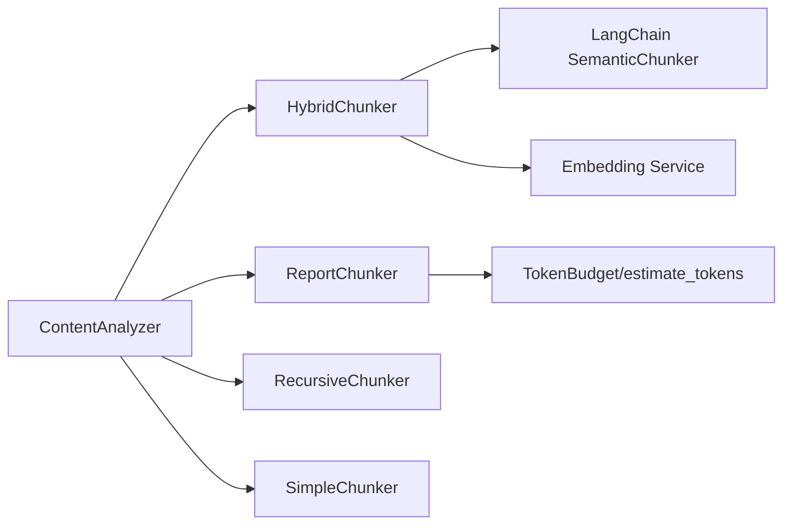

# 混合分块策略

<cite>
**本文引用的文件**
- [chunking/__init__.py](file://chunking/__init__.py)
- [chunking/base.py](file://chunking/base.py)
- [chunking/simple_chunker.py](file://chunking/simple_chunker.py)
- [chunking/smart_chunker.py](file://chunking/smart_chunker.py)
- [chunking/sliding_window_chunker.py](file://chunking/sliding_window_chunker.py)
- [chunking/hybrid_chunker.py](file://chunking/hybrid_chunker.py)
- [chunking/report_chunker.py](file://chunking/report_chunker.py)
- [chunking/langchain/semantic_chunker.py](file://chunking/langchain/semantic_chunker.py)
- [chunking/langchain/recursive_chunker.py](file://chunking/langchain/recursive_chunker.py)
- [chunking/router/content_analyzer.py](file://chunking/router/content_analyzer.py)
- [chunking/README.md](file://chunking/README.md)
- [chunking/router/README.md](file://chunking/router/README.md)
- [utils/token_utils.py](file://utils/token_utils.py)
</cite>

## 目录
1. [简介](#简介)
2. [项目结构](#项目结构)
3. [核心组件](#核心组件)
4. [架构总览](#架构总览)
5. [详细组件分析](#详细组件分析)
6. [依赖分析](#依赖分析)
7. [性能考量](#性能考量)
8. [故障排查指南](#故障排查指南)
9. [结论](#结论)
10. [附录](#附录)

## 简介
本文件系统性阐述 Advanced RAG 项目中的混合分块策略，聚焦四种核心分块算法：
- 智能分块（SmartChunker）：基于语义边界与长度约束的动态分块，强调数学公式与结构的完整性
- 报告分块（ReportChunker）：面向长篇行业报告的结构化分块，结合章节路径与 token 预算
- 滑动窗口分块（SlidingWindowChunker）：保持上下文连续性的重叠分块
- 混合分块（HybridChunker）：规则 + 语义的多策略融合，兼顾完整性与语义一致性

文档还涵盖参数配置、性能优化、质量评估指标、最佳实践与常见问题，并提供可操作的配置示例与使用场景，帮助开发者按文档类型选择最优分块策略。

## 项目结构
分块模块采用清晰的分层设计：
- 基础分块器：simple_chunker、smart_chunker、sliding_window_chunker
- 路由模块：content_analyzer，依据内容特征自动选择分块器
- LangChain 分块器：recursive_chunker、semantic_chunker（依赖外部库）
- 工具支持：token_utils 提供 token 预算估算

图表来源
- [chunking/router/content_analyzer.py:12-299](file://chunking/router/content_analyzer.py#L12-L299)
- [chunking/langchain/recursive_chunker.py:7-110](file://chunking/langchain/recursive_chunker.py#L7-L110)
- [chunking/langchain/semantic_chunker.py:8-139](file://chunking/langchain/semantic_chunker.py#L8-L139)
- [chunking/base.py:6-23](file://chunking/base.py#L6-L23)
- [chunking/simple_chunker.py:7-111](file://chunking/simple_chunker.py#L7-L111)
- [chunking/smart_chunker.py:7-408](file://chunking/smart_chunker.py#L7-L408)
- [chunking/sliding_window_chunker.py:6-97](file://chunking/sliding_window_chunker.py#L6-L97)
- [chunking/hybrid_chunker.py:9-179](file://chunking/hybrid_chunker.py#L9-L179)
- [chunking/report_chunker.py:42-143](file://chunking/report_chunker.py#L42-L143)
- [utils/token_utils.py:7-50](file://utils/token_utils.py#L7-L50)

章节来源
- [chunking/README.md:1-89](file://chunking/README.md#L1-L89)
- [chunking/router/README.md:1-137](file://chunking/router/README.md#L1-L137)

## 核心组件
- BaseChunker：定义统一的 chunk 接口，约定输入文本与可选元数据，输出标准化的块列表（包含 text 与 metadata）
- SimpleChunker：基于分隔符的固定大小分块，适合通用场景
- SmartChunker：识别段落边界、保护数学公式、合并策略灵活，适合含公式/表格/标题的文档
- SlidingWindowChunker：按句子边界滑动重叠分块，适合需要上下文连续性的场景
- ReportChunker：面向长报告的结构化分块，维护 section_path 并基于 token 预算控制块大小
- HybridChunker：规则抽取特殊块（代码/公式/表格）并用语义分块处理普通文本，最后去重
- ContentAnalyzer：根据文件类型、公式/表格/代码块数量、段落/句子/章节特征等自动路由到合适分块器

章节来源
- [chunking/base.py:6-23](file://chunking/base.py#L6-L23)
- [chunking/simple_chunker.py:7-111](file://chunking/simple_chunker.py#L7-L111)
- [chunking/smart_chunker.py:7-408](file://chunking/smart_chunker.py#L7-L408)
- [chunking/sliding_window_chunker.py:6-97](file://chunking/sliding_window_chunker.py#L6-L97)
- [chunking/report_chunker.py:42-143](file://chunking/report_chunker.py#L42-L143)
- [chunking/hybrid_chunker.py:9-179](file://chunking/hybrid_chunker.py#L9-L179)
- [chunking/router/content_analyzer.py:12-299](file://chunking/router/content_analyzer.py#L12-L299)

## 架构总览
分块策略的总体流程：解析器产出文本与元数据 → 路由器分析内容特征 → 选择分块器 → 输出标准化块集合。

图表来源
- [chunking/router/content_analyzer.py:253-299](file://chunking/router/content_analyzer.py#L253-L299)
- [chunking/langchain/recursive_chunker.py:69-109](file://chunking/langchain/recursive_chunker.py#L69-L109)
- [chunking/langchain/semantic_chunker.py:81-138](file://chunking/langchain/semantic_chunker.py#L81-L138)
- [chunking/hybrid_chunker.py:52-121](file://chunking/hybrid_chunker.py#L52-L121)
- [chunking/report_chunker.py:58-142](file://chunking/report_chunker.py#L58-L142)
- [chunking/simple_chunker.py:28-110](file://chunking/simple_chunker.py#L28-L110)

## 详细组件分析

### 智能分块（SmartChunker）
- 设计要点
  - 保护数学公式完整性：预扫描并用占位符替换，再恢复
  - 段落边界识别：支持中文/英文标题、编号段落、双换行等
  - 智能合并：标题、公式段落优先保持完整；普通段落按目标大小合并
  - 大段落切分：优先句边界，避免破坏语义
  - 后处理：最小/最大块大小约束、去噪、补充元数据
- 参数配置
  - chunk_size：目标块大小（字符）
  - chunk_overlap：块间重叠（字符）
  - min_chunk_size / max_chunk_size：块大小边界
- 适用场景
  - 含公式/表格/标题的学术论文、技术文档
  - 需要保持公式/表格/标题完整性的场景
- 性能优化
  - 公式匹配按逆序位置排序，避免重复与位置偏移
  - 段落合并时优先保留标题与公式段落，减少后续切分成本
- 质量评估
  - 公式完整性、段落边界正确性、块大小分布、最小块比例
- 使用建议
  - 配置合理的 chunk_size 与 chunk_overlap，平衡召回与上下文
  - 对超长段落启用句边界切分，避免语义断裂

图表来源
- [chunking/smart_chunker.py:67-407](file://chunking/smart_chunker.py#L67-L407)

章节来源
- [chunking/smart_chunker.py:7-408](file://chunking/smart_chunker.py#L7-L408)

### 报告分块（ReportChunker）
- 设计要点
  - 结构优先：段落/条款边界优先
  - 维护 section_path：记录标题层级路径，便于检索定位
  - token 预算：基于 TokenBudget 控制块大小与重叠，避免超出模型上下文
  - 单块过大：按句子粗切，确保语义完整性
- 参数配置
  - token_budget：包含 chunk_tokens、overlap_tokens、max_chunk_tokens
  - min_chunk_tokens：最小块 token 数
- 适用场景
  - 长篇行业报告、白皮书、政策文件等
  - 需要结构化与可追踪性的文档
- 质量评估
  - token 数分布、section_path 完整性、块内语义连贯性
- 使用建议
  - 为不同模型设置合适的 token 预算
  - 对超长块启用句边界切分

图表来源
- [chunking/report_chunker.py:58-142](file://chunking/report_chunker.py#L58-L142)
- [utils/token_utils.py:7-50](file://utils/token_utils.py#L7-L50)

章节来源
- [chunking/report_chunker.py:42-143](file://chunking/report_chunker.py#L42-L143)
- [utils/token_utils.py:7-50](file://utils/token_utils.py#L7-L50)

### 滑动窗口分块（SlidingWindowChunker）
- 设计要点
  - 按句子边界聚合，超过目标大小即保存
  - 保留重叠部分，确保上下文连续性
  - 最小块过滤，避免过小噪声
- 参数配置
  - chunk_size、chunk_overlap、min_chunk_size
- 适用场景
  - 需要上下文连续性的问答/检索场景
- 性能优化
  - 句子分割正则简洁高效
  - 重叠保留采用逆序累加，避免多余拷贝
- 质量评估
  - 重叠覆盖率、块大小分布、最小块比例
- 使用建议
  - 适当增大 chunk_overlap 以提升检索召回

图表来源
- [chunking/sliding_window_chunker.py:27-97](file://chunking/sliding_window_chunker.py#L27-L97)

章节来源
- [chunking/sliding_window_chunker.py:6-97](file://chunking/sliding_window_chunker.py#L6-L97)

### 混合分块（HybridChunker）
- 设计要点
  - 规则抽取：优先识别代码块、公式、表格，保持完整性
  - 语义分块：对普通文本使用基于嵌入的语义分块
  - 去重：对分块结果按文本哈希去重，避免冗余
  - 细粒度元数据：content_type 标记块类型
- 参数配置
  - chunk_size、chunk_overlap、semantic_threshold（语义断点阈值）
- 适用场景
  - 同时包含代码/公式/表格与普通文本的混合文档
- 性能优化
  - 语义分块失败时回退到简单分块，保证稳定性
  - 哈希去重避免重复计算
- 质量评估
  - 特殊块完整性、语义块连贯性、去重效果、块大小分布
- 使用建议
  - 合理设置 semantic_threshold，平衡语义断点敏感度

图表来源
- [chunking/hybrid_chunker.py:52-179](file://chunking/hybrid_chunker.py#L52-L179)
- [chunking/langchain/semantic_chunker.py:81-139](file://chunking/langchain/semantic_chunker.py#L81-L139)

章节来源
- [chunking/hybrid_chunker.py:9-179](file://chunking/hybrid_chunker.py#L9-L179)
- [chunking/langchain/semantic_chunker.py:8-139](file://chunking/langchain/semantic_chunker.py#L8-L139)

### 路由器（ContentAnalyzer）
- 路由策略（优先级）
  1) 高度结构化内容（代码/论文）→ 递归分块器
  2) 包含公式/表格或需语义连贯的长文档 → 混合分块器
  3) 超长报告 → 报告分块器
  4) 其他 → 简单分块器
- 决策依据
  - 文件类型、代码块数量、LaTeX 公式数量、结构化标记
  - 段落数、句子数、平均段落长度、章节标记
  - 元数据（formulas、tables、code_blocks、file_type）
- 性能与稳定性
  - 语义分块器初始化失败自动回退
  - 空文本使用简单分块器
- 使用建议
  - 传递解析器返回的 metadata，提升路由准确性
  - 关注路由日志，理解分块器选择原因

图表来源
- [chunking/router/content_analyzer.py:253-299](file://chunking/router/content_analyzer.py#L253-L299)

章节来源
- [chunking/router/content_analyzer.py:12-299](file://chunking/router/content_analyzer.py#L12-L299)
- [chunking/router/README.md:1-137](file://chunking/router/README.md#L1-L137)

## 依赖分析
- 组件耦合
  - HybridChunker 依赖 LangChain 语义分块器与嵌入服务，失败时回退到 SimpleChunker
  - ReportChunker 依赖 token_utils 的 TokenBudget 与估算函数
  - ContentAnalyzer 统一管理各分块器的延迟初始化与回退策略
- 外部依赖
  - LangChain 生态（text_splitter、SemanticChunker），在不可用时抛出 ImportError 并提示安装
- 潜在环路
  - 无直接循环依赖；分层清晰，接口稳定

图表来源
- [chunking/hybrid_chunker.py:37-41](file://chunking/hybrid_chunker.py#L37-L41)
- [chunking/langchain/semantic_chunker.py:31-78](file://chunking/langchain/semantic_chunker.py#L31-L78)
- [chunking/report_chunker.py:50-56](file://chunking/report_chunker.py#L50-L56)
- [utils/token_utils.py:7-50](file://utils/token_utils.py#L7-L50)
- [chunking/router/content_analyzer.py:32-79](file://chunking/router/content_analyzer.py#L32-L79)

章节来源
- [chunking/langchain/semantic_chunker.py:50-78](file://chunking/langchain/semantic_chunker.py#L50-L78)
- [chunking/langchain/recursive_chunker.py:40-67](file://chunking/langchain/recursive_chunker.py#L40-L67)
- [chunking/router/content_analyzer.py:32-79](file://chunking/router/content_analyzer.py#L32-L79)

## 性能考量
- 语义分块器
  - 依赖嵌入向量计算，适合长文档；对短文本开销较大
  - 可通过批量向量化与合理的 batch_size 降低延迟
- 滑动窗口分块器
  - 句子分割与重叠保留为 O(n)，适合中等规模文本
- 智能分块器
  - 公式匹配与段落合并为 O(n)，注意超大段落的句边界切分
- 报告分块器
  - 基于 token 预算，估算成本低；单块过大时的句边界切分增加复杂度
- 混合分块器
  - 规则抽取与语义分块叠加，建议在语义分块失败时快速回退
- 通用建议
  - 优先使用路由器自动选择分块器
  - 对超长文档优先考虑报告分块器或混合分块器
  - 在生产环境开启日志，观察路由决策与异常回退

## 故障排查指南
- 语义分块器初始化失败
  - 现象：抛出 ImportError，提示安装 LangChain
  - 处理：安装 langchain 与 langchain-text-splitters；或依赖路由器自动回退
- 递归分块器不可用
  - 现象：ImportError，提示安装 LangChain
  - 处理：安装对应依赖；或路由器自动回退到其他分块器
- 分块结果过小或过多
  - 检查 chunk_size、chunk_overlap、min_chunk_size 设置
  - 对智能/滑动窗口分块器，适当增大 chunk_size 或减小重叠
- 公式/表格完整性丢失
  - 确认使用智能分块器或混合分块器
  - 检查正则模式是否覆盖目标格式
- token 预算超限
  - 调整 TokenBudget 的 chunk_tokens 与 max_chunk_tokens
  - 对报告分块器启用句边界切分

章节来源
- [chunking/langchain/semantic_chunker.py:61-77](file://chunking/langchain/semantic_chunker.py#L61-L77)
- [chunking/langchain/recursive_chunker.py:44-65](file://chunking/langchain/recursive_chunker.py#L44-L65)
- [chunking/router/content_analyzer.py:43-46](file://chunking/router/content_analyzer.py#L43-L46)

## 结论
Advanced RAG 的分块策略通过“规则 + 语义”的组合，在保证特殊结构完整性的同时，兼顾语义连贯性与可扩展性。ContentAnalyzer 以元数据与文本特征为依据，自动选择最适合的分块器，显著降低了人工调参成本。开发者应根据文档类型与业务需求，优先采用路由器自动路由，并结合本文提供的参数配置与优化建议，持续迭代分块策略以提升检索与生成质量。

## 附录

### 分块质量评估指标
- 公式/表格/代码完整性：特殊块未被切分的比例
- 语义连贯性：相邻块间主题一致性（可借助嵌入相似度）
- 块大小分布：平均/方差、最小块比例、超大块比例
- 上下文覆盖率：滑动窗口重叠带来的上下文保留率
- token 预算符合度：实际 token 数与预算的偏差
- 去重效果：重复块比例、哈希碰撞率

### 最佳实践清单
- 优先传递解析器返回的 metadata（formulas、tables、code_blocks、file_type）
- 对长文档（>10k 字符）优先使用语义/混合/报告分块器
- 对超长报告（>100k 字符）使用报告分块器并设置合理 token 预算
- 对含公式/表格的混合文档使用混合分块器
- 对纯文本/短文档使用简单分块器或滑动窗口分块器
- 调优 chunk_size 与 chunk_overlap，结合业务召回与延迟权衡

### 配置示例（路径参考）
- 使用路由器自动选择分块器
  - [chunking/router/content_analyzer.py:253-299](file://chunking/router/content_analyzer.py#L253-L299)
- 直接指定分块器
  - 简单分块：[chunking/simple_chunker.py:10-27](file://chunking/simple_chunker.py#L10-L27)
  - 智能分块：[chunking/smart_chunker.py:19-39](file://chunking/smart_chunker.py#L19-L39)
  - 滑动窗口分块：[chunking/sliding_window_chunker.py:9-26](file://chunking/sliding_window_chunker.py#L9-L26)
  - 报告分块：[chunking/report_chunker.py:50-56](file://chunking/report_chunker.py#L50-L56)
  - 混合分块：[chunking/hybrid_chunker.py:20-33](file://chunking/hybrid_chunker.py#L20-L33)
- LangChain 分块器（如需）
  - 递归分块：[chunking/langchain/recursive_chunker.py:10-38](file://chunking/langchain/recursive_chunker.py#L10-L38)
  - 语义分块：[chunking/langchain/semantic_chunker.py:11-28](file://chunking/langchain/semantic_chunker.py#L11-L28)