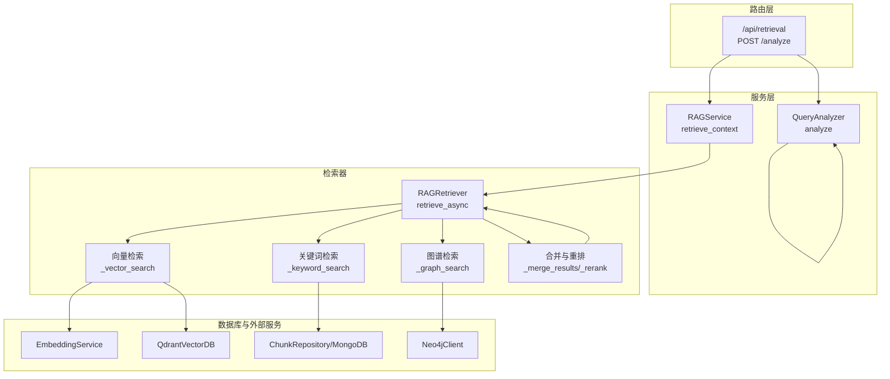
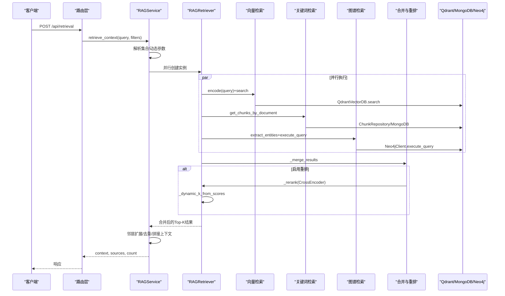
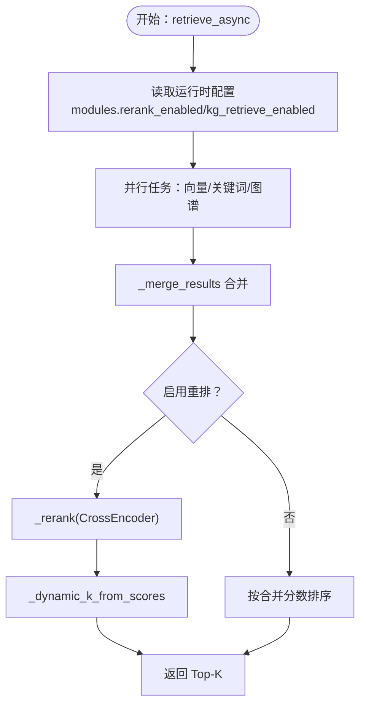
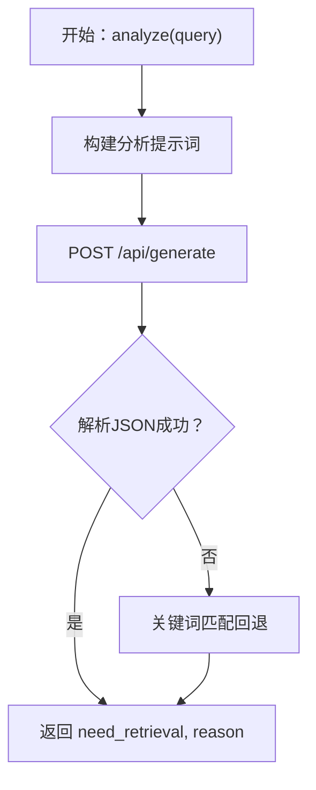
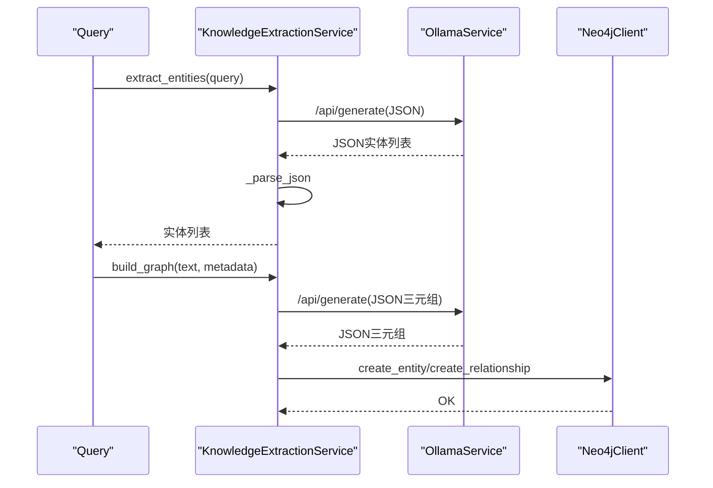
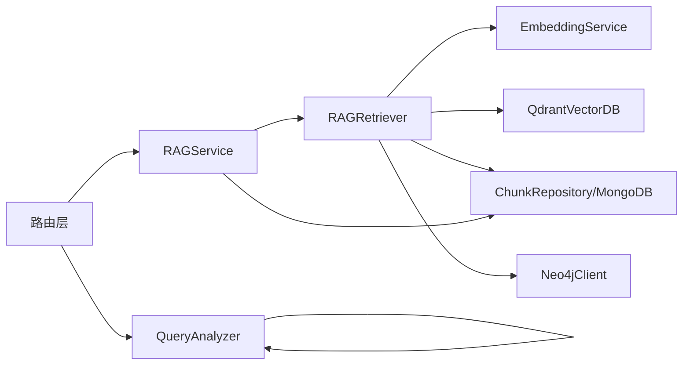

# 混合检索机制

<cite>
**本文引用的文件**
- [rag_retriever.py](file://retrieval/rag_retriever.py)
- [query_analyzer.py](file://services/query_analyzer.py)
- [knowledge_extraction_service.py](file://services/knowledge_extraction_service.py)
- [embedding_service.py](file://embedding/embedding_service.py)
- [neo4j_client.py](file://database/neo4j_client.py)
- [qdrant_client.py](file://database/qdrant_client.py)
- [mongodb.py](file://database/mongodb.py)
- [runtime_config.py](file://services/runtime_config.py)
- [rag_service.py](file://services/rag_service.py)
- [retrieval.py](file://routers/retrieval.py)
- [token_utils.py](file://utils/token_utils.py)
- [logger.py](file://utils/logger.py)
- [README.md](file://README.md)
</cite>

## 目录
1. [简介](#简介)
2. [项目结构](#项目结构)
3. [核心组件](#核心组件)
4. [架构总览](#架构总览)
5. [详细组件分析](#详细组件分析)
6. [依赖关系分析](#依赖关系分析)
7. [性能考量](#性能考量)
8. [故障排查指南](#故障排查指南)
9. [结论](#结论)
10. [附录](#附录)

## 简介
本文件围绕 Advanced RAG 项目的混合检索机制展开，系统阐述三种检索策略的并行执行与结果融合：向量检索（语义匹配）、关键词检索（精确匹配）、图谱检索（实体关系推理）。文档还涵盖检索任务的异步并发、结果合并与分数融合策略、查询分析服务的预处理、实体抽取服务在图谱检索中的作用，以及性能优化、参数调优与错误处理机制。最后提供检索流程示例、配置参数说明与监控指标，帮助开发者理解并优化混合检索系统的性能表现。

## 项目结构
- 后端采用 FastAPI，核心检索位于 retrieval 模块，服务层位于 services，数据库适配位于 database，工具与日志位于 utils。
- 检索链路贯穿：路由层接收请求 → 服务层进行动态参数与集合解析 → 检索器并行执行三种策略 → 合并与重排 → 上下文拼接与返回。

图表来源
- [retrieval.py:97-148](file://routers/retrieval.py#L97-L148)
- [rag_service.py:34-266](file://services/rag_service.py#L34-L266)
- [rag_retriever.py:89-137](file://retrieval/rag_retriever.py#L89-L137)
- [embedding_service.py:8-44](file://embedding/embedding_service.py#L8-L44)
- [qdrant_client.py:336-413](file://database/qdrant_client.py#L336-L413)
- [mongodb.py:793-800](file://database/mongodb.py#L793-L800)
- [neo4j_client.py:40-101](file://database/neo4j_client.py#L40-L101)

章节来源
- [README.md:46-54](file://README.md#L46-L54)
- [retrieval.py:1-150](file://routers/retrieval.py#L1-L150)
- [rag_service.py:1-323](file://services/rag_service.py#L1-L323)
- [rag_retriever.py:1-393](file://retrieval/rag_retriever.py#L1-L393)

## 核心组件
- RAGRetriever：混合检索器，负责并行执行三种检索策略、结果合并、重排与动态裁剪。
- QueryAnalyzer：查询分析器，判断是否需要检索上下文，支持模型分析与关键词回退。
- KnowledgeExtractionService：知识抽取与图谱构建服务，提供实体抽取与三元组抽取。
- EmbeddingService：向量化服务，封装 Ollama 接口，提供文本向量编码。
- Neo4jClient/QdrantVectorDB：图谱与向量数据库客户端，提供查询与写入能力。
- RAGService：高层检索服务，负责动态参数、集合解析、邻居扩展与上下文拼接。
- routers/retrieval：API 路由，暴露检索与查询分析接口。

章节来源
- [rag_retriever.py:17-137](file://retrieval/rag_retriever.py#L17-L137)
- [query_analyzer.py:9-163](file://services/query_analyzer.py#L9-L163)
- [knowledge_extraction_service.py:12-229](file://services/knowledge_extraction_service.py#L12-L229)
- [embedding_service.py:8-333](file://embedding/embedding_service.py#L8-L333)
- [neo4j_client.py:6-104](file://database/neo4j_client.py#L6-L104)
- [qdrant_client.py:18-544](file://database/qdrant_client.py#L18-L544)
- [rag_service.py:8-323](file://services/rag_service.py#L8-L323)
- [retrieval.py:1-150](file://routers/retrieval.py#L1-L150)

## 架构总览
混合检索的整体流程如下：
- 请求进入路由层，解析参数并调用服务层。
- 服务层根据知识空间/助手集合动态解析集合名称，构造多个检索器实例。
- 检索器并行执行三种策略：向量检索、关键词检索、图谱检索。
- 合并策略对向量与关键词结果进行去重与分数融合，图谱结果独立加入。
- 可选重排（CrossEncoder）对合并结果进行再排序，并在线动态调整最终返回数量。
- 服务层进行邻居扩展、去重与上下文拼接，控制 token 预算，返回结果。

图表来源
- [retrieval.py:97-148](file://routers/retrieval.py#L97-L148)
- [rag_service.py:34-266](file://services/rag_service.py#L34-L266)
- [rag_retriever.py:89-137](file://retrieval/rag_retriever.py#L89-L137)
- [qdrant_client.py:336-413](file://database/qdrant_client.py#L336-L413)
- [mongodb.py:793-800](file://database/mongodb.py#L793-L800)
- [neo4j_client.py:40-101](file://database/neo4j_client.py#L40-L101)

## 详细组件分析

### RAGRetriever：混合检索器
- 并行执行：使用 asyncio.gather 并行执行向量、关键词、图谱检索，提升吞吐。
- 结果合并：以 chunk_id 或结果 id 为键去重，向量结果权重为基，关键词结果按比例提升，图谱结果独立加入。
- 重排与动态裁剪：可选 CrossEncoder 重排，按分数分布动态调整最终返回数量，兼顾召回与精度。
- 异步图谱检索：当图谱模块关闭时，图谱任务降级为空任务，避免阻塞。

图表来源
- [rag_retriever.py:89-137](file://retrieval/rag_retriever.py#L89-L137)
- [rag_retriever.py:328-363](file://retrieval/rag_retriever.py#L328-L363)
- [rag_retriever.py:365-391](file://retrieval/rag_retriever.py#L365-L391)

章节来源
- [rag_retriever.py:17-137](file://retrieval/rag_retriever.py#L17-L137)
- [rag_retriever.py:328-391](file://retrieval/rag_retriever.py#L328-L391)

### QueryAnalyzer：查询分析服务
- 模型分析：使用 Ollama 小模型快速判断是否需要检索，支持 JSON 结果解析与超时控制。
- 关键词回退：当模型分析失败或超时时，使用关键词匹配策略进行回退，保证稳定性。
- 安全策略：解析失败时默认需要检索，避免漏检。

图表来源
- [query_analyzer.py:22-106](file://services/query_analyzer.py#L22-L106)
- [query_analyzer.py:107-157](file://services/query_analyzer.py#L107-L157)

章节来源
- [query_analyzer.py:9-163](file://services/query_analyzer.py#L9-L163)

### KnowledgeExtractionService：实体抽取与图谱检索
- 实体抽取：从查询中抽取关键实体，用于图谱检索的起点。
- 三元组抽取：从文本中抽取“实体-关系-实体”三元组，支持 JSON 输出解析与修复。
- 图谱构建：将三元组写入 Neo4j，规范化关系类型，支持连接失败冷却与错误处理。

图表来源
- [knowledge_extraction_service.py:107-145](file://services/knowledge_extraction_service.py#L107-L145)
- [knowledge_extraction_service.py:147-227](file://services/knowledge_extraction_service.py#L147-L227)
- [neo4j_client.py:64-101](file://database/neo4j_client.py#L64-L101)

章节来源
- [knowledge_extraction_service.py:12-229](file://services/knowledge_extraction_service.py#L12-L229)
- [neo4j_client.py:6-104](file://database/neo4j_client.py#L6-L104)

### EmbeddingService：向量化服务
- 模型发现与规范化：自动检测可用 embedding 模型，支持标签规范化与重试。
- 嵌入请求：统一走 /api/embed 或回退到 /api/embeddings，兼容不同返回结构。
- 超时与错误处理：指数退避重试，字符截断避免上下文超限，模型不存在时给出明确提示。

章节来源
- [embedding_service.py:8-333](file://embedding/embedding_service.py#L8-L333)

### Neo4jClient/QdrantVectorDB：检索数据源
- Neo4jClient：连接、查询与创建实体/关系，支持容器环境 URI 替换与连接失败冷却。
- QdrantVectorDB：gRPC 连接优化、健康检查、集合创建与维度校验、插入重试与自动重建、查询过滤与阈值。

章节来源
- [neo4j_client.py:6-104](file://database/neo4j_client.py#L6-L104)
- [qdrant_client.py:18-544](file://database/qdrant_client.py#L18-L544)

### RAGService：高层检索与上下文拼接
- 动态参数：根据查询长度与关键词启发式调整 prefetch_k 与 final_k。
- 集合解析：优先知识空间集合名称，其次助手集合名称，兼容多集合并行检索。
- 邻居扩展：对命中 chunk 拉取前后窗口补齐，增强上下文完整性。
- 上下文拼接：控制 token 预算，避免极端情况导致 prompt 过大。

章节来源
- [rag_service.py:8-323](file://services/rag_service.py#L8-L323)

### routers/retrieval：检索路由
- /api/retrieval：接收查询、文档/知识空间过滤，调用 RAGService 返回上下文与来源。
- /api/retrieval/analyze：调用 QueryAnalyzer 判断是否需要检索。

章节来源
- [retrieval.py:1-150](file://routers/retrieval.py#L1-L150)

## 依赖关系分析
- 检索器依赖：向量检索依赖 EmbeddingService 与 QdrantVectorDB；关键词检索依赖 ChunkRepository/MongoDB；图谱检索依赖 Neo4jClient 与 KnowledgeExtractionService。
- 服务层依赖：RAGService 依赖运行时配置与集合解析，调用 RAGRetriever 与 ChunkRepository。
- 路由层依赖：路由层依赖 QueryAnalyzer 与 RAGService。

图表来源
- [rag_retriever.py:6-11](file://retrieval/rag_retriever.py#L6-L11)
- [rag_service.py:58-121](file://services/rag_service.py#L58-L121)
- [retrieval.py:44-94](file://routers/retrieval.py#L44-L94)

章节来源
- [rag_retriever.py:1-393](file://retrieval/rag_retriever.py#L1-L393)
- [rag_service.py:1-323](file://services/rag_service.py#L1-L323)
- [retrieval.py:1-150](file://routers/retrieval.py#L1-L150)

## 性能考量
- 并行执行：使用 asyncio.gather 并行三种检索策略，显著降低端到端延迟。
- 动态参数：根据查询特征（长度、关键词）动态调整 prefetch_k 与 final_k，平衡召回与精度。
- 重排与动态裁剪：启用 CrossEncoder 重排，结合分数分布动态调整最终返回数量，提升质量。
- 连接优化：Qdrant 使用 gRPC 连接与连接复用，减少 HTTP/httpx 问题；Neo4j 连接失败冷却避免频繁错误日志。
- Token 控制：上下文拼接前估算 token 并按预算截断，避免 prompt 过大。
- 运行时配置：通过运行时配置模块控制模块开关与并发参数，便于在线调优。

章节来源
- [rag_retriever.py:139-167](file://retrieval/rag_retriever.py#L139-L167)
- [qdrant_client.py:66-95](file://database/qdrant_client.py#L66-L95)
- [rag_service.py:11-32](file://services/rag_service.py#L11-L32)
- [token_utils.py:16-71](file://utils/token_utils.py#L16-L71)
- [runtime_config.py:140-161](file://services/runtime_config.py#L140-L161)

## 故障排查指南
- 向量检索失败：检查 Ollama 模型可用性、上下文长度限制与 Qdrant 连接状态。
- 关键词检索缓慢：仅在指定文档 ID 时执行，全局关键词检索会非常慢，建议限制范围。
- 图谱检索失败：检查 Neo4j 连接、驱动可用性与实体抽取服务的 JSON 解析。
- 重排模型加载失败：自动降级，检查环境变量与设备配置。
- 日志与监控：使用异步日志模块，生产环境可降低 INFO 级别日志输出，关注 WARNING 及以上级别。

章节来源
- [rag_retriever.py:202-204](file://retrieval/rag_retriever.py#L202-L204)
- [rag_retriever.py:238-240](file://retrieval/rag_retriever.py#L238-L240)
- [rag_retriever.py:324-326](file://retrieval/rag_retriever.py#L324-L326)
- [rag_retriever.py:52-69](file://retrieval/rag_retriever.py#L52-L69)
- [logger.py:15-87](file://utils/logger.py#L15-L87)

## 结论
Advanced RAG 的混合检索机制通过并行执行向量、关键词与图谱三种策略，结合合并与重排，实现了高质量、高效率的检索体验。运行时配置与动态参数进一步提升了系统的灵活性与稳定性。开发者可据此进行参数调优与性能优化，以满足不同场景下的检索需求。

## 附录

### 检索流程示例
- 输入：查询文本、可选文档ID、知识空间IDs、助手ID。
- 步骤：路由层解析 → 服务层动态参数与集合解析 → 检索器并行执行 → 合并与重排 → 邻居扩展与上下文拼接 → 返回结果。

章节来源
- [retrieval.py:97-148](file://routers/retrieval.py#L97-L148)
- [rag_service.py:34-266](file://services/rag_service.py#L34-L266)
- [rag_retriever.py:89-137](file://retrieval/rag_retriever.py#L89-L137)

### 配置参数说明
- 运行时配置（RuntimeConfig）
  - modules：kg_extract_enabled、kg_retrieve_enabled、query_analyze_enabled、rerank_enabled、ocr_image_enabled、table_parse_enabled、embedding_enabled。
  - params：kg_concurrency、kg_chunk_timeout_s、kg_max_chunks、embedding_batch_size、embedding_concurrency、ocr_concurrency。
- 检索器参数（RAGRetriever）
  - final_k、prefetch_k、score_threshold、enable_reranker、reranker_model、reranker_device、reranker_max_tokens。
- 向量服务参数（EmbeddingService）
  - Ollama 基础 URL、模型名称、最大字符限制、重试策略。
- Qdrant 参数
  - URL、API Key、超时、gRPC 端口、集合名称。
- Neo4j 参数
  - URI、用户名、密码、连接失败冷却。

章节来源
- [runtime_config.py:15-83](file://services/runtime_config.py#L15-L83)
- [rag_retriever.py:20-50](file://retrieval/rag_retriever.py#L20-L50)
- [embedding_service.py:21-44](file://embedding/embedding_service.py#L21-L44)
- [qdrant_client.py:35-95](file://database/qdrant_client.py#L35-L95)
- [neo4j_client.py:11-14](file://database/neo4j_client.py#L11-L14)

### 监控指标
- 日志级别：INFO/WARNING/ERROR，生产环境可降低 INFO 输出。
- Qdrant 健康检查：连接测试与集合存在性检查。
- Neo4j 连接状态：连接失败冷却与错误日志抑制。
- Token 预算：上下文拼接前估算与截断，避免超预算。

章节来源
- [logger.py:15-87](file://utils/logger.py#L15-L87)
- [qdrant_client.py:124-138](file://database/qdrant_client.py#L124-L138)
- [rag_service.py:251-260](file://services/rag_service.py#L251-L260)