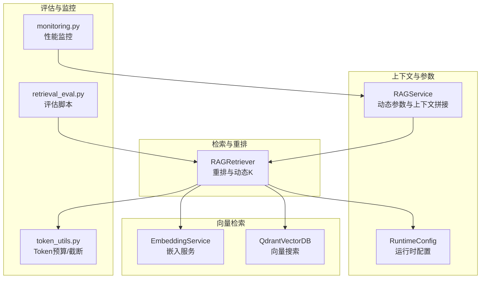
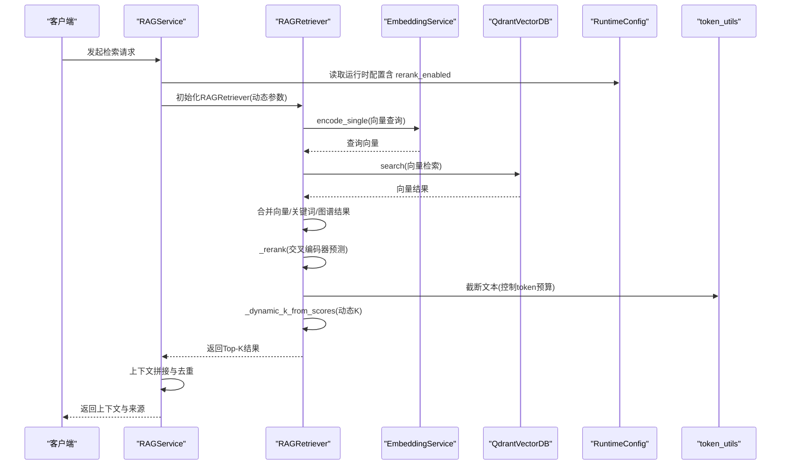
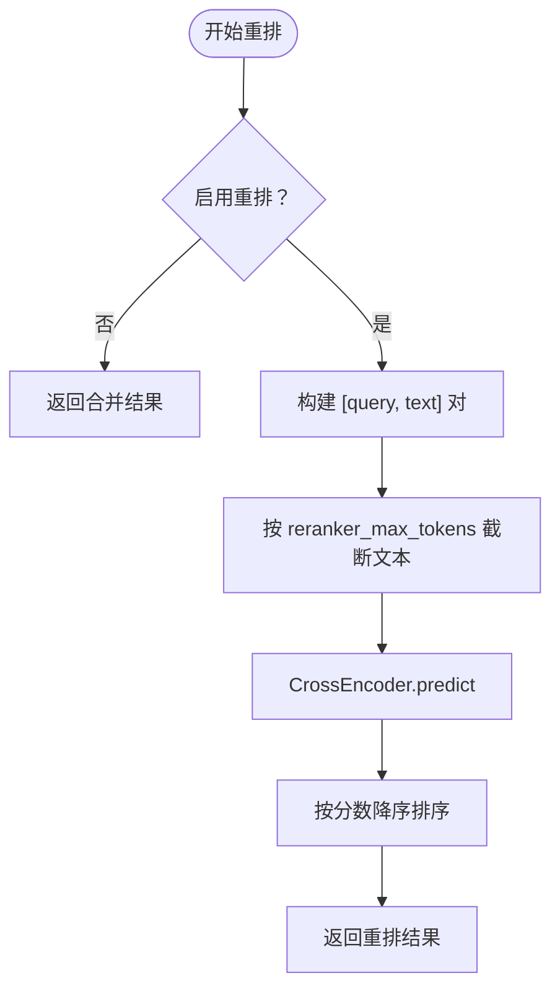
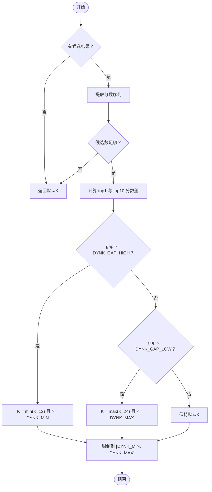
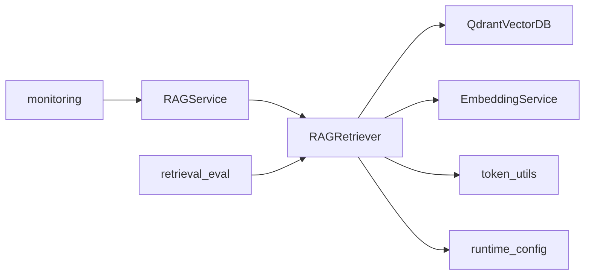

# 精准重排优化

<cite>
**本文引用的文件**
- [rag_retriever.py](file://retrieval/rag_retriever.py)
- [embedding_service.py](file://embedding/embedding_service.py)
- [rag_service.py](file://services/rag_service.py)
- [token_utils.py](file://utils/token_utils.py)
- [runtime_config.py](file://services/runtime_config.py)
- [qdrant_client.py](file://database/qdrant_client.py)
- [retrieval_eval.py](file://eval/retrieval_eval.py)
- [monitoring.py](file://utils/monitoring.py)
</cite>

## 目录
1. [简介](#简介)
2. [项目结构](#项目结构)
3. [核心组件](#核心组件)
4. [架构总览](#架构总览)
5. [详细组件分析](#详细组件分析)
6. [依赖分析](#依赖分析)
7. [性能考量](#性能考量)
8. [故障排查指南](#故障排查指南)
9. [结论](#结论)
10. [附录](#附录)

## 简介
本文件聚焦 Advanced RAG 项目中的“精准重排优化”，围绕基于 BGE-reranker 的交叉编码器重排机制展开，系统阐述以下主题：
- 重排模型的加载策略、延迟初始化与设备配置
- 动态K值调整算法（DYNK）的实现原理与参数调优
- 重排过程中的 token 预算控制、文本截断优化与性能调优
- 重排参数配置指南、效果评估指标与最佳实践
- 具体重排流程示例、参数调优案例与性能监控方案

## 项目结构
与重排优化直接相关的模块与文件如下：
- 检索与重排主流程：retrieval/rag_retriever.py
- 向量检索与嵌入服务：embedding/embedding_service.py、database/qdrant_client.py
- 上下文拼接与动态参数：services/rag_service.py
- 重排参数与运行时配置：services/runtime_config.py
- 重排评估与指标：eval/retrieval_eval.py
- 性能监控：utils/monitoring.py
- Token 预算与截断：utils/token_utils.py

图表来源
- [rag_retriever.py:17-137](file://retrieval/rag_retriever.py#L17-L137)
- [embedding_service.py:8-44](file://embedding/embedding_service.py#L8-L44)
- [qdrant_client.py:336-413](file://database/qdrant_client.py#L336-L413)
- [rag_service.py:34-126](file://services/rag_service.py#L34-L126)
- [runtime_config.py:140-161](file://services/runtime_config.py#L140-L161)
- [retrieval_eval.py:35-74](file://eval/retrieval_eval.py#L35-L74)
- [monitoring.py:118-184](file://utils/monitoring.py#L118-L184)
- [token_utils.py:16-71](file://utils/token_utils.py#L16-L71)

章节来源
- [rag_retriever.py:17-137](file://retrieval/rag_retriever.py#L17-L137)
- [embedding_service.py:8-44](file://embedding/embedding_service.py#L8-L44)
- [qdrant_client.py:336-413](file://database/qdrant_client.py#L336-L413)
- [rag_service.py:34-126](file://services/rag_service.py#L34-L126)
- [runtime_config.py:140-161](file://services/runtime_config.py#L140-L161)
- [retrieval_eval.py:35-74](file://eval/retrieval_eval.py#L35-L74)
- [monitoring.py:118-184](file://utils/monitoring.py#L118-L184)
- [token_utils.py:16-71](file://utils/token_utils.py#L16-L71)

## 核心组件
- RAGRetriever：负责混合检索（向量、关键词、图谱）与重排，支持延迟加载 CrossEncoder、动态K值调整与 token 预算控制。
- EmbeddingService：封装 Ollama 嵌入服务，负责向量生成与模型检测。
- RAGService：高层封装，动态计算检索参数（prefetch_k、final_k），并进行上下文拼接与来源去重。
- RuntimeConfig：运行时配置中心，支持 rerank_enabled 等模块开关。
- token_utils：提供近似 token 估算与截断工具，保障重排输入长度可控。
- retrieval_eval：提供召回率/精确率 at K 的评估流程，便于重排参数调优。
- monitoring：提供请求耗时与系统指标监控，辅助性能优化。

章节来源
- [rag_retriever.py:17-137](file://retrieval/rag_retriever.py#L17-L137)
- [embedding_service.py:8-44](file://embedding/embedding_service.py#L8-L44)
- [rag_service.py:34-126](file://services/rag_service.py#L34-L126)
- [runtime_config.py:140-161](file://services/runtime_config.py#L140-L161)
- [token_utils.py:16-71](file://utils/token_utils.py#L16-L71)
- [retrieval_eval.py:35-74](file://eval/retrieval_eval.py#L35-L74)
- [monitoring.py:118-184](file://utils/monitoring.py#L118-L184)

## 架构总览
下图展示了从查询到最终上下文输出的关键路径，重点体现重排与动态K值调整的位置。

图表来源
- [rag_service.py:34-126](file://services/rag_service.py#L34-L126)
- [rag_retriever.py:89-137](file://retrieval/rag_retriever.py#L89-L137)
- [embedding_service.py:316-318](file://embedding/embedding_service.py#L316-L318)
- [qdrant_client.py:336-413](file://database/qdrant_client.py#L336-L413)
- [runtime_config.py:140-161](file://services/runtime_config.py#L140-L161)
- [token_utils.py:48-71](file://utils/token_utils.py#L48-L71)

## 详细组件分析

### 基于 BGE-reranker 的交叉编码器重排机制
- 模型加载策略
  - 延迟初始化：仅在需要时加载 CrossEncoder，避免导入阶段崩溃影响服务启动；失败自动降级并记录告警。
  - 设备配置：支持 CPU/CUDA，由环境变量控制；默认 CPU。
  - 模型选择：默认模型名可通过环境变量配置。
- 重排流程
  - 准备 pairs：[query, doc_text]，并对 doc_text 进行 token 预算截断，避免长 chunk 导致延迟或崩溃。
  - 预测与排序：调用 CrossEncoder.predict 得到分数并按降序排序。
- 错误处理
  - 重排失败时记录日志并回退到合并后的排序结果，保证检索链路可用。

图表来源
- [rag_retriever.py:52-69](file://retrieval/rag_retriever.py#L52-L69)
- [rag_retriever.py:365-391](file://retrieval/rag_retriever.py#L365-L391)
- [token_utils.py:48-71](file://utils/token_utils.py#L48-L71)

章节来源
- [rag_retriever.py:52-69](file://retrieval/rag_retriever.py#L52-L69)
- [rag_retriever.py:365-391](file://retrieval/rag_retriever.py#L365-L391)
- [token_utils.py:48-71](file://utils/token_utils.py#L48-L71)

### 动态K值调整算法（DYNK）
- 目标：在启用重排的前提下，基于重排分数分布自动调整最终返回数量 K，兼顾召回率与精确率。
- 核心思想
  - 分数区分度高（top1 与 top10 差距大）：减小 K，提升精确率。
  - 分数区分度低（分数接近）：增大 K，保留召回。
- 实现要点
  - 仅在候选数达到一定规模时才进行判断（避免样本不足导致误判）。
  - 通过环境变量控制 K 的上下界与区分度阈值，便于线上调优。
- 返回值：在 [DYNK_MIN, DYNK_MAX] 范围内钳制，确保稳定性。

图表来源
- [rag_retriever.py:139-167](file://retrieval/rag_retriever.py#L139-L167)

章节来源
- [rag_retriever.py:139-167](file://retrieval/rag_retriever.py#L139-L167)

### Token 预算控制、文本截断优化与性能调优
- Token 预算
  - 重排输入文本通过近似估算与二分截断，确保不超过 reranker_max_tokens，避免超长文本导致延迟或崩溃。
  - 上下文拼接同样采用近似 token 估算与截断，防止 prompt 过大。
- 性能调优
  - 向量检索阶段使用 gRPC 连接 Qdrant，减少 HTTP 502 问题，提高稳定性与吞吐。
  - 运行时配置支持 rerank_enabled 开关，便于在不同场景下权衡质量与性能。
  - 重排失败自动降级，保证检索链路可用。

章节来源
- [token_utils.py:16-71](file://utils/token_utils.py#L16-L71)
- [rag_retriever.py:365-391](file://retrieval/rag_retriever.py#L365-L391)
- [qdrant_client.py:66-95](file://database/qdrant_client.py#L66-L95)
- [runtime_config.py:140-161](file://services/runtime_config.py#L140-L161)

### 重排参数配置指南
- 环境变量
  - ENABLE_RERANKER：是否启用重排（默认关闭）
  - RERANKER_MODEL：交叉编码器模型名（默认 BAAI/bge-reranker-base）
  - RERANKER_DEVICE：设备（cpu/cuda，默认 cpu）
  - RERANKER_MAX_TOKENS：重排输入最大 token（近似预算）
  - DYNK_MIN/DYNK_MAX：动态K的上下界
  - DYNK_GAP_HIGH/DYNK_GAP_LOW：区分度阈值
- 运行时配置
  - 通过 MongoDB 的 app_settings.runtime_config 存储与读取，支持热更新与 TTL 缓存。
  - RAGRetriever 在运行时读取 rerank_enabled，动态决定是否启用重排。

章节来源
- [rag_retriever.py:47-50](file://retrieval/rag_retriever.py#L47-L50)
- [rag_retriever.py:103-111](file://retrieval/rag_retriever.py#L103-L111)
- [runtime_config.py:140-161](file://services/runtime_config.py#L140-L161)

### 效果评估指标与最佳实践
- 评估指标
  - Recall@K、Precision@K：基于 gold 文档与 chunk 索引命中情况计算。
  - 支持多 K 值评估，便于观察不同 K 下的平衡。
- 最佳实践
  - 优先在高质量数据集上评估，结合 DYNK 参数微调区分度阈值。
  - 在生产环境中启用运行时配置开关，按需开启重排。
  - 结合性能监控，关注检索耗时与响应时间，确保用户体验。

章节来源
- [retrieval_eval.py:15-22](file://eval/retrieval_eval.py#L15-L22)
- [retrieval_eval.py:35-74](file://eval/retrieval_eval.py#L35-L74)

## 依赖分析
- RAGRetriever 依赖
  - 向量检索：QdrantVectorDB.search
  - 嵌入服务：EmbeddingService.encode_single
  - Token 工具：truncate_to_tokens
  - 运行时配置：get_runtime_config
- RAGService 依赖
  - RAGRetriever：动态参数初始化与检索
  - 上下文拼接与去重：基于 chunk_id 与 document_id
- 评估与监控
  - retrieval_eval：独立评估脚本
  - monitoring：请求耗时与系统指标

图表来源
- [rag_retriever.py:17-137](file://retrieval/rag_retriever.py#L17-L137)
- [embedding_service.py:316-318](file://embedding/embedding_service.py#L316-L318)
- [qdrant_client.py:336-413](file://database/qdrant_client.py#L336-L413)
- [rag_service.py:101-126](file://services/rag_service.py#L101-L126)
- [retrieval_eval.py:35-74](file://eval/retrieval_eval.py#L35-L74)
- [monitoring.py:118-184](file://utils/monitoring.py#L118-L184)

章节来源
- [rag_retriever.py:17-137](file://retrieval/rag_retriever.py#L17-L137)
- [embedding_service.py:316-318](file://embedding/embedding_service.py#L316-L318)
- [qdrant_client.py:336-413](file://database/qdrant_client.py#L336-L413)
- [rag_service.py:101-126](file://services/rag_service.py#L101-L126)
- [retrieval_eval.py:35-74](file://eval/retrieval_eval.py#L35-L74)
- [monitoring.py:118-184](file://utils/monitoring.py#L118-L184)

## 性能考量
- 检索阶段
  - 优先使用 gRPC 连接 Qdrant，降低网络与协议开销，提升稳定性。
  - 向量检索使用 score_threshold 与 prefetch_k 控制候选规模，避免过度扫描。
- 重排阶段
  - 延迟加载 CrossEncoder，失败自动降级，避免阻塞主线程。
  - 通过 reranker_max_tokens 限制输入长度，减少 GPU/CPU 压力。
- 上下文拼接
  - 采用近似 token 估算与截断，防止 prompt 过大导致推理失败或超时。
- 监控与告警
  - 使用性能监控器记录请求耗时、错误率与系统指标，及时发现瓶颈。

章节来源
- [qdrant_client.py:66-95](file://database/qdrant_client.py#L66-L95)
- [rag_retriever.py:365-391](file://retrieval/rag_retriever.py#L365-L391)
- [rag_service.py:251-260](file://services/rag_service.py#L251-L260)
- [monitoring.py:118-184](file://utils/monitoring.py#L118-L184)

## 故障排查指南
- 重排模型加载失败
  - 现象：日志提示重排模型加载失败并自动禁用重排。
  - 排查：确认 RERANKER_MODEL 与 RERANKER_DEVICE 配置正确；检查依赖安装与可用性。
- 重排失败
  - 现象：重排异常，系统回退到合并排序结果。
  - 排查：查看日志中的异常信息；检查输入文本长度与 token 预算设置。
- 向量检索不稳定
  - 现象：HTTP 502 或连接超时。
  - 排查：切换为 gRPC 连接；检查 Qdrant 服务健康状态与网络连通性。
- 评估指标异常
  - 现象：Recall/Precision 不达标。
  - 排查：调整 DYNK 参数、prefetch_k、final_k 与 score_threshold；在评估脚本中核对 gold 数据格式。

章节来源
- [rag_retriever.py:52-69](file://retrieval/rag_retriever.py#L52-L69)
- [rag_retriever.py:365-391](file://retrieval/rag_retriever.py#L365-L391)
- [qdrant_client.py:124-138](file://database/qdrant_client.py#L124-L138)
- [retrieval_eval.py:35-74](file://eval/retrieval_eval.py#L35-L74)

## 结论
Advanced RAG 的重排优化以“延迟加载 + 动态K + token 预算”为核心策略，在保证检索质量的同时兼顾性能与稳定性。通过运行时配置与评估脚本，开发者可以快速定位参数瓶颈并进行迭代优化。建议在生产环境中结合监控体系持续观测检索耗时与响应时间，配合 DYNK 与 token 截断策略，实现更精准的召回与更稳定的用户体验。

## 附录
- 重排流程示例（步骤化）
  1) 初始化 RAGRetriever（动态参数与运行时配置）
  2) 向量检索（QdrantVectorDB.search）
  3) 合并向量/关键词/图谱结果
  4) 重排（CrossEncoder.predict + 截断）
  5) 动态K（DYNK）
  6) 返回 Top-K 结果并进行上下文拼接与去重
- 参数调优案例
  - 高区分度场景：增大 DYNK_GAP_HIGH，缩小 K，提升精确率
  - 低区分度场景：减小 DYNK_GAP_LOW，增大 K，保留召回
  - 长文本场景：降低 reranker_max_tokens，确保重排稳定
- 性能监控方案
  - 使用 PerformanceMonitor 记录请求耗时与错误率
  - 结合系统指标（CPU/Memory/Disk）与慢请求告警，定位瓶颈