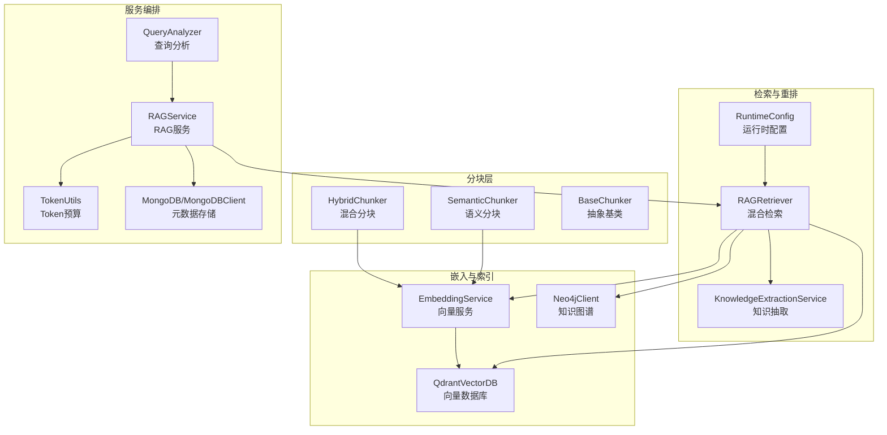
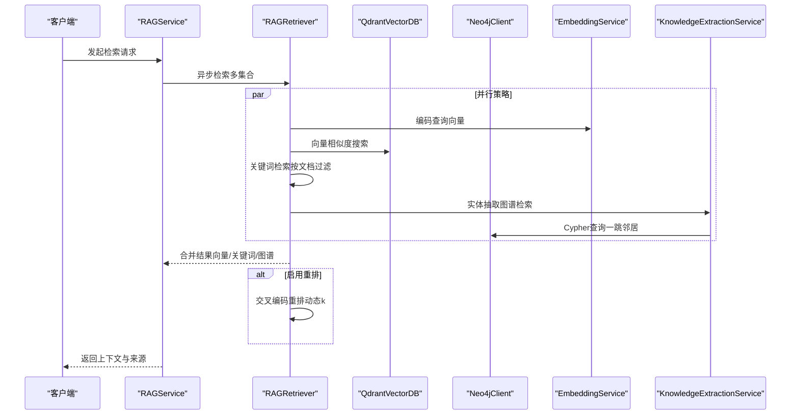
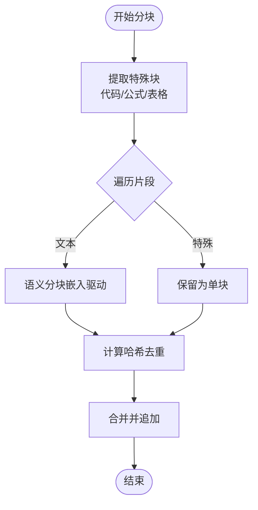
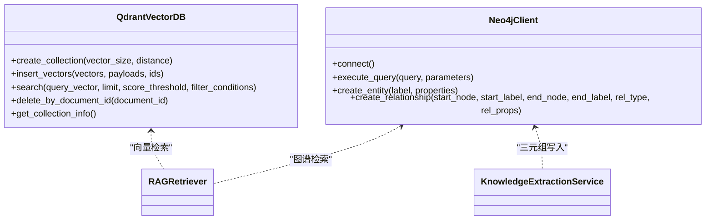
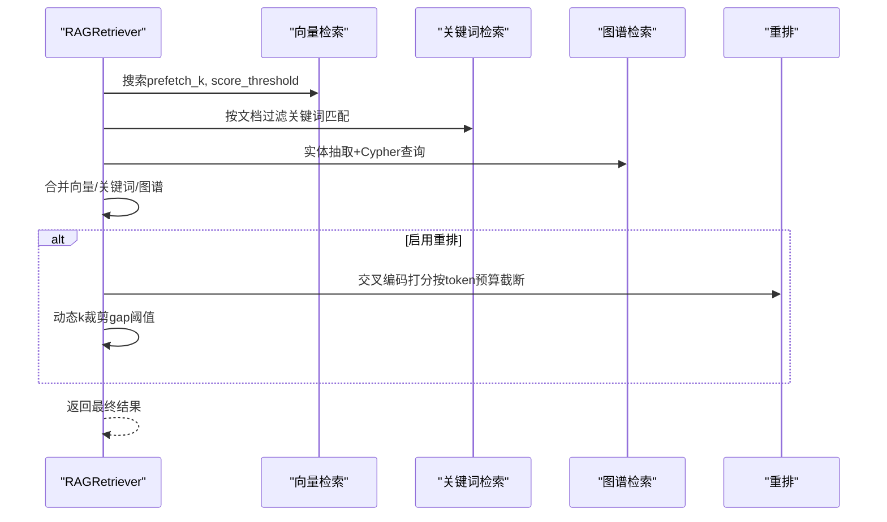
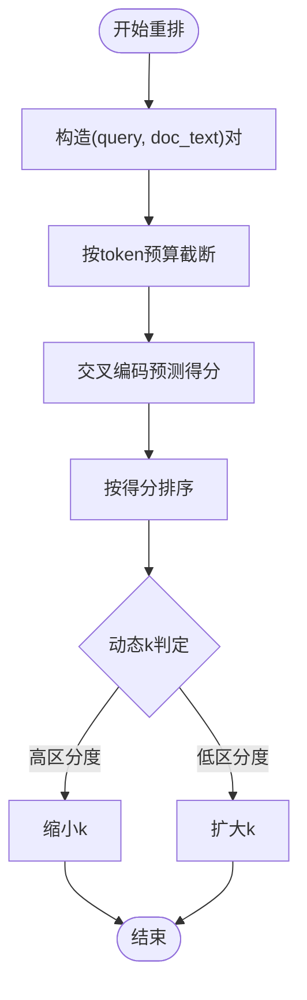
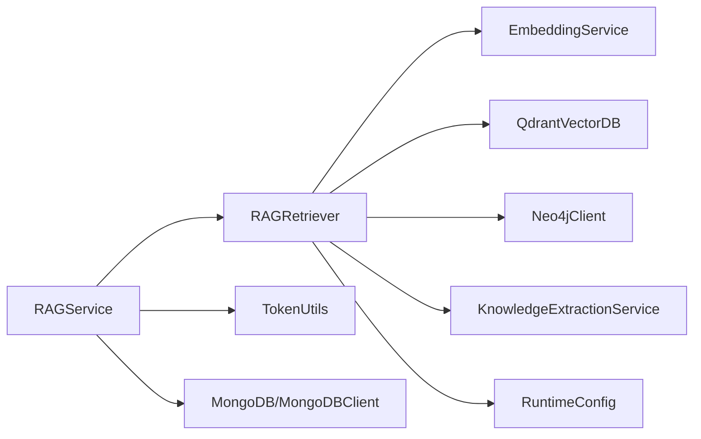

# 高级RAG引擎

<cite>
**本文引用的文件**
- [chunking/hybrid_chunker.py](file://chunking/hybrid_chunker.py)
- [chunking/langchain/semantic_chunker.py](file://chunking/langchain/semantic_chunker.py)
- [chunking/base.py](file://chunking/base.py)
- [retrieval/rag_retriever.py](file://retrieval/rag_retriever.py)
- [embedding/embedding_service.py](file://embedding/embedding_service.py)
- [database/qdrant_client.py](file://database/qdrant_client.py)
- [database/neo4j_client.py](file://database/neo4j_client.py)
- [services/knowledge_extraction_service.py](file://services/knowledge_extraction_service.py)
- [services/runtime_config.py](file://services/runtime_config.py)
- [services/rag_service.py](file://services/rag_service.py)
- [services/query_analyzer.py](file://services/query_analyzer.py)
- [utils/token_utils.py](file://utils/token_utils.py)
- [database/mongodb.py](file://database/mongodb.py)
</cite>

## 目录
1. [简介](#简介)
2. [项目结构](#项目结构)
3. [核心组件](#核心组件)
4. [架构总览](#架构总览)
5. [详细组件分析](#详细组件分析)
6. [依赖关系分析](#依赖关系分析)
7. [性能考量](#性能考量)
8. [故障排查指南](#故障排查指南)
9. [结论](#结论)
10. [附录](#附录)

## 简介
本文件面向Advanced RAG项目的高级RAG引擎，系统阐述四大核心能力的技术实现与工程化落地：混合分块策略（规则分块+语义分块）、双路索引（向量索引+知识图谱索引）、混合检索（向量+关键词+图谱关联检索）、精准重排（BGE-reranker排序优化）。文档同时给出向量嵌入服务的配置与调优方法、相似度计算与批量处理优化策略，并提供可操作的配置参数与使用示例，帮助开发者理解并优化RAG引擎的性能表现。

## 项目结构
项目采用按功能域划分的模块化组织方式，核心链路围绕“分块-嵌入-索引-检索-重排-生成”的流水线展开。前端Web应用位于web目录，后端服务集中在根目录，核心能力分布在chunking、embedding、database、retrieval、services、utils等子模块。

图表来源
- [chunking/hybrid_chunker.py:1-179](file://chunking/hybrid_chunker.py#L1-L179)
- [chunking/langchain/semantic_chunker.py:1-139](file://chunking/langchain/semantic_chunker.py#L1-L139)
- [chunking/base.py:1-23](file://chunking/base.py#L1-L23)
- [embedding/embedding_service.py:1-333](file://embedding/embedding_service.py#L1-L333)
- [database/qdrant_client.py:1-544](file://database/qdrant_client.py#L1-L544)
- [database/neo4j_client.py:1-104](file://database/neo4j_client.py#L1-L104)
- [services/knowledge_extraction_service.py:1-229](file://services/knowledge_extraction_service.py#L1-L229)
- [services/runtime_config.py:1-218](file://services/runtime_config.py#L1-L218)
- [retrieval/rag_retriever.py:1-393](file://retrieval/rag_retriever.py#L1-L393)
- [services/rag_service.py:1-323](file://services/rag_service.py#L1-L323)
- [services/query_analyzer.py:1-163](file://services/query_analyzer.py#L1-L163)
- [utils/token_utils.py:1-72](file://utils/token_utils.py#L1-L72)
- [database/mongodb.py:1-800](file://database/mongodb.py#L1-L800)

章节来源
- [chunking/hybrid_chunker.py:1-179](file://chunking/hybrid_chunker.py#L1-L179)
- [chunking/langchain/semantic_chunker.py:1-139](file://chunking/langchain/semantic_chunker.py#L1-L139)
- [chunking/base.py:1-23](file://chunking/base.py#L1-L23)
- [embedding/embedding_service.py:1-333](file://embedding/embedding_service.py#L1-L333)
- [database/qdrant_client.py:1-544](file://database/qdrant_client.py#L1-L544)
- [database/neo4j_client.py:1-104](file://database/neo4j_client.py#L1-L104)
- [services/knowledge_extraction_service.py:1-229](file://services/knowledge_extraction_service.py#L1-L229)
- [services/runtime_config.py:1-218](file://services/runtime_config.py#L1-L218)
- [retrieval/rag_retriever.py:1-393](file://retrieval/rag_retriever.py#L1-L393)
- [services/rag_service.py:1-323](file://services/rag_service.py#L1-L323)
- [services/query_analyzer.py:1-163](file://services/query_analyzer.py#L1-L163)
- [utils/token_utils.py:1-72](file://utils/token_utils.py#L1-L72)
- [database/mongodb.py:1-800](file://database/mongodb.py#L1-L800)

## 核心组件
- 混合分块策略：结合规则分块（代码/公式/表格完整性保留）与语义分块（基于嵌入的语义边界检测），并内置去重与细粒度元数据标注。
- 双路索引：向量索引（Qdrant）与知识图谱索引（Neo4j）协同，分别支撑高效相似度检索与结构化关联推理。
- 混合检索：并行执行向量检索、关键词检索与图谱检索，统一合并与初步去重，再进行交叉编码重排与在线动态裁剪。
- 精准重排：基于BGE系列交叉编码器（CrossEncoder）对候选上下文进行精细排序，结合动态k调优提升召回与精度平衡。

章节来源
- [chunking/hybrid_chunker.py:1-179](file://chunking/hybrid_chunker.py#L1-L179)
- [chunking/langchain/semantic_chunker.py:1-139](file://chunking/langchain/semantic_chunker.py#L1-L139)
- [retrieval/rag_retriever.py:1-393](file://retrieval/rag_retriever.py#L1-L393)
- [embedding/embedding_service.py:1-333](file://embedding/embedding_service.py#L1-L333)
- [database/qdrant_client.py:1-544](file://database/qdrant_client.py#L1-L544)
- [database/neo4j_client.py:1-104](file://database/neo4j_client.py#L1-L104)
- [services/knowledge_extraction_service.py:1-229](file://services/knowledge_extraction_service.py#L1-L229)
- [services/runtime_config.py:1-218](file://services/runtime_config.py#L1-L218)

## 架构总览
高级RAG引擎以“异步并行检索+统一合并+交叉编码重排”为核心流程，结合运行时配置与动态参数调整，实现高吞吐、高准确率的检索增强生成。

图表来源
- [services/rag_service.py:1-323](file://services/rag_service.py#L1-L323)
- [retrieval/rag_retriever.py:1-393](file://retrieval/rag_retriever.py#L1-L393)
- [embedding/embedding_service.py:1-333](file://embedding/embedding_service.py#L1-L333)
- [database/qdrant_client.py:1-544](file://database/qdrant_client.py#L1-L544)
- [database/neo4j_client.py:1-104](file://database/neo4j_client.py#L1-L104)
- [services/knowledge_extraction_service.py:1-229](file://services/knowledge_extraction_service.py#L1-L229)

## 详细组件分析

### 混合分块策略（规则+语义）
- 规则分块：正则识别代码块、公式与表格，保证结构化内容完整性，作为独立块保留。
- 语义分块：基于嵌入的语义断点检测，维持自然语言的语义连贯性；失败时回退到简单分块。
- 去重与元数据：对分块文本计算哈希去重，附加content_type等细粒度元数据，便于后续检索与重排。

图表来源
- [chunking/hybrid_chunker.py:123-179](file://chunking/hybrid_chunker.py#L123-L179)
- [chunking/langchain/semantic_chunker.py:1-139](file://chunking/langchain/semantic_chunker.py#L1-L139)
- [chunking/base.py:1-23](file://chunking/base.py#L1-L23)

章节来源
- [chunking/hybrid_chunker.py:1-179](file://chunking/hybrid_chunker.py#L1-L179)
- [chunking/langchain/semantic_chunker.py:1-139](file://chunking/langchain/semantic_chunker.py#L1-L139)
- [chunking/base.py:1-23](file://chunking/base.py#L1-L23)

### 双路索引（向量+图谱）
- 向量索引：QdrantVectorDB封装，支持gRPC优先、连接池与超时配置，自动维度校验与集合重建，提供Upsert/Scroll/Search等能力。
- 知识图谱：Neo4jClient封装，支持容器环境URI适配、连接校验与Cypher查询，配合知识抽取服务构建实体-关系-实体三元组。

图表来源
- [database/qdrant_client.py:1-544](file://database/qdrant_client.py#L1-L544)
- [database/neo4j_client.py:1-104](file://database/neo4j_client.py#L1-L104)
- [retrieval/rag_retriever.py:1-393](file://retrieval/rag_retriever.py#L1-L393)
- [services/knowledge_extraction_service.py:1-229](file://services/knowledge_extraction_service.py#L1-L229)

章节来源
- [database/qdrant_client.py:1-544](file://database/qdrant_client.py#L1-L544)
- [database/neo4j_client.py:1-104](file://database/neo4j_client.py#L1-L104)
- [services/knowledge_extraction_service.py:1-229](file://services/knowledge_extraction_service.py#L1-L229)

### 混合检索（向量+关键词+图谱）
- 并行策略：向量检索、关键词检索、图谱检索三路并行，统一合并与初步去重（关键词对命中chunk进行分数提升）。
- 合并与重排：若启用重排，对候选上下文进行交叉编码打分，随后基于分数分布进行在线动态k裁剪，兼顾召回与精度。
- 运行时开关：通过运行时配置模块控制图谱检索、重排等功能开关，支持低/高预设与自定义参数。

图表来源
- [retrieval/rag_retriever.py:1-393](file://retrieval/rag_retriever.py#L1-L393)
- [services/runtime_config.py:1-218](file://services/runtime_config.py#L1-L218)

章节来源
- [retrieval/rag_retriever.py:1-393](file://retrieval/rag_retriever.py#L1-L393)
- [services/runtime_config.py:1-218](file://services/runtime_config.py#L1-L218)

### 精准重排（BGE交叉编码器）
- 重排模型：延迟加载CrossEncoder，支持CPU/GPU设备切换，默认模型可配置，失败自动降级。
- 重排流程：构造(query, doc_text)对，按最大token预算截断，预测得分并排序，最终返回动态k条结果。
- 动态k：基于top1与topN分数差距自适应调整k，高区分度场景缩小k提升精度，低区分度场景扩大k保留召回。

图表来源
- [retrieval/rag_retriever.py:365-393](file://retrieval/rag_retriever.py#L365-L393)

章节来源
- [retrieval/rag_retriever.py:1-393](file://retrieval/rag_retriever.py#L1-L393)

### 向量嵌入服务配置与调优
- 模型选择：优先使用Ollama嵌入模型，支持自动检测与规范化模型名称，失败时抛出明确提示。
- 文本截断：针对Ollama上下文长度限制进行字符级截断，避免超长报错；支持环境变量覆盖。
- 重试与超时：嵌入请求具备指数退避重试与超时控制，提升稳定性。
- 维度探测：首次调用时探测向量维度，后续用于日志与一致性校验。
- 批量处理：当前实现逐条编码，便于与Ollama接口对齐；如需批处理可扩展为批量API调用（需适配外部服务）。

章节来源
- [embedding/embedding_service.py:1-333](file://embedding/embedding_service.py#L1-L333)

### 相似度计算与上下文控制
- 相似度服务：提供文本相似度（Jaccard）、字段匹配度（加权）与关系相似度（共同连接）计算，支持组合评分。
- 上下文控制：使用近似token估算与二分截断策略，避免超长prompt导致的性能与稳定性问题。

章节来源
- [services/similarity_service.py:1-276](file://services/similarity_service.py#L1-L276)
- [utils/token_utils.py:1-72](file://utils/token_utils.py#L1-L72)

## 依赖关系分析
- 组件耦合：RAGRetriever依赖嵌入服务、向量数据库与知识图谱客户端；运行时配置模块通过异步读取影响检索行为；RAGService负责编排检索与上下文拼接。
- 外部依赖：LangChain（语义分块）、SentenceTransformers（交叉编码器）、Qdrant/Neo4j/MongoDB等数据库。
- 循环依赖：未发现直接循环依赖，模块间通过服务接口解耦。

图表来源
- [services/rag_service.py:1-323](file://services/rag_service.py#L1-L323)
- [retrieval/rag_retriever.py:1-393](file://retrieval/rag_retriever.py#L1-L393)
- [embedding/embedding_service.py:1-333](file://embedding/embedding_service.py#L1-L333)
- [database/qdrant_client.py:1-544](file://database/qdrant_client.py#L1-L544)
- [database/neo4j_client.py:1-104](file://database/neo4j_client.py#L1-L104)
- [services/knowledge_extraction_service.py:1-229](file://services/knowledge_extraction_service.py#L1-L229)
- [services/runtime_config.py:1-218](file://services/runtime_config.py#L1-L218)
- [utils/token_utils.py:1-72](file://utils/token_utils.py#L1-L72)
- [database/mongodb.py:1-800](file://database/mongodb.py#L1-L800)

## 性能考量
- 并行与异步：检索阶段采用async gather并行执行，显著降低端到端延迟。
- 预取与动态裁剪：prefetch_k放大候选池，重排后在线动态k调优，平衡召回与精度。
- 连接与超时：Qdrant优先gRPC、连接池与超时配置，减少网络抖动影响；MongoDB连接池参数可调以适配高并发。
- Token预算：统一的token估算与截断策略，避免超长上下文引发的性能问题。
- 模型与硬件：交叉编码器可在GPU/CPU间切换；嵌入服务支持多模型与重试，提升鲁棒性。

## 故障排查指南
- 向量检索失败：检查Qdrant连接、集合维度与过滤条件；关注自动重建与重试逻辑。
- 图谱检索失败：确认Neo4j连接与Cypher语法；实体抽取失败时查看冷却与降级日志。
- 重排模型加载失败：检查模型名与设备配置，确认自动降级是否生效。
- 嵌入服务异常：核对Ollama地址、模型名称与上下文截断参数；关注重试与超时设置。
- 运行时配置：通过运行时配置模块调整模块开关与参数，观察对检索行为的影响。

章节来源
- [retrieval/rag_retriever.py:1-393](file://retrieval/rag_retriever.py#L1-L393)
- [database/qdrant_client.py:1-544](file://database/qdrant_client.py#L1-L544)
- [database/neo4j_client.py:1-104](file://database/neo4j_client.py#L1-L104)
- [services/knowledge_extraction_service.py:1-229](file://services/knowledge_extraction_service.py#L1-L229)
- [embedding/embedding_service.py:1-333](file://embedding/embedding_service.py#L1-L333)
- [services/runtime_config.py:1-218](file://services/runtime_config.py#L1-L218)

## 结论
Advanced RAG引擎通过“混合分块+双路索引+混合检索+精准重排”的体系化设计，在保证结构化内容完整性的同时，兼顾语义连贯性与图谱关联推理能力。借助运行时配置与动态参数调整，系统在不同场景下可灵活权衡召回与精度，满足多样化的检索增强生成需求。

## 附录

### 配置参数与使用示例（节选）
- 向量检索参数
  - final_k：最终返回的检索结果数量
  - prefetch_k：向量检索候选池大小（默认按final_k放大）
  - score_threshold：相似度阈值
  - enable_reranker/reranker_model/reranker_device：重排开关与模型/设备
  - reranker_max_tokens：交叉编码输入最大token预算
- 运行时配置
  - modules：kg_extract_enabled/kg_retrieve_enabled/rerank_enabled等模块开关
  - params：kg_concurrency/kg_chunk_timeout_s/kg_max_chunks/embedding_batch_size/embedding_concurrency等参数
- 环境变量
  - OLLAMA_BASE_URL/OLLAMA_EMBEDDING_MODEL/OLLAMA_EMBEDDING_MAX_CHARS
  - QDRANT_URL/QDRANT_API_KEY/QDRANT_TIMEOUT/QDRANT_GRPC_PORT
  - NEO4J_URI/NEO4J_USER/NEO4J_PASSWORD
  - ENABLE_RERANKER/RERANKER_MODEL/RERANKER_DEVICE
  - DYNK_MIN/DYNK_MAX/DYNK_GAP_HIGH/DYNK_GAP_LOW

章节来源
- [retrieval/rag_retriever.py:1-393](file://retrieval/rag_retriever.py#L1-L393)
- [services/runtime_config.py:1-218](file://services/runtime_config.py#L1-L218)
- [embedding/embedding_service.py:1-333](file://embedding/embedding_service.py#L1-L333)
- [database/qdrant_client.py:1-544](file://database/qdrant_client.py#L1-L544)
- [database/neo4j_client.py:1-104](file://database/neo4j_client.py#L1-L104)