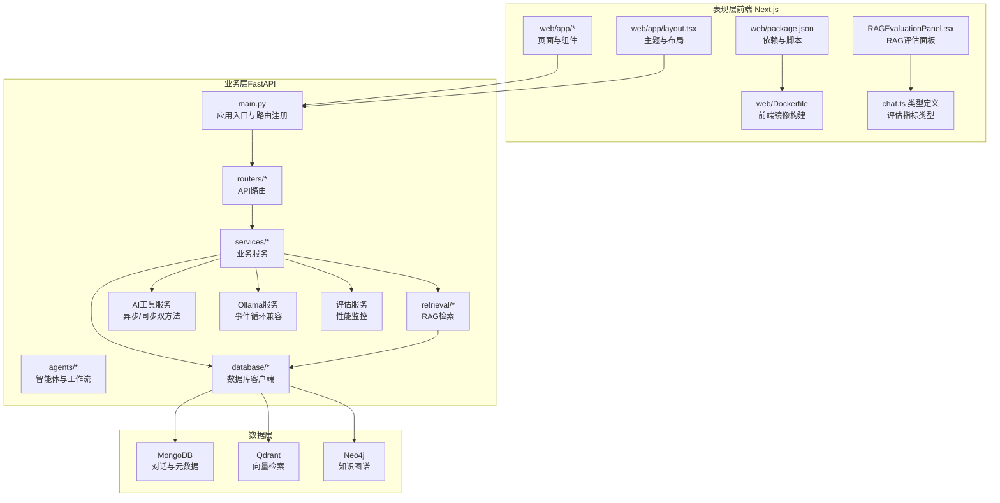
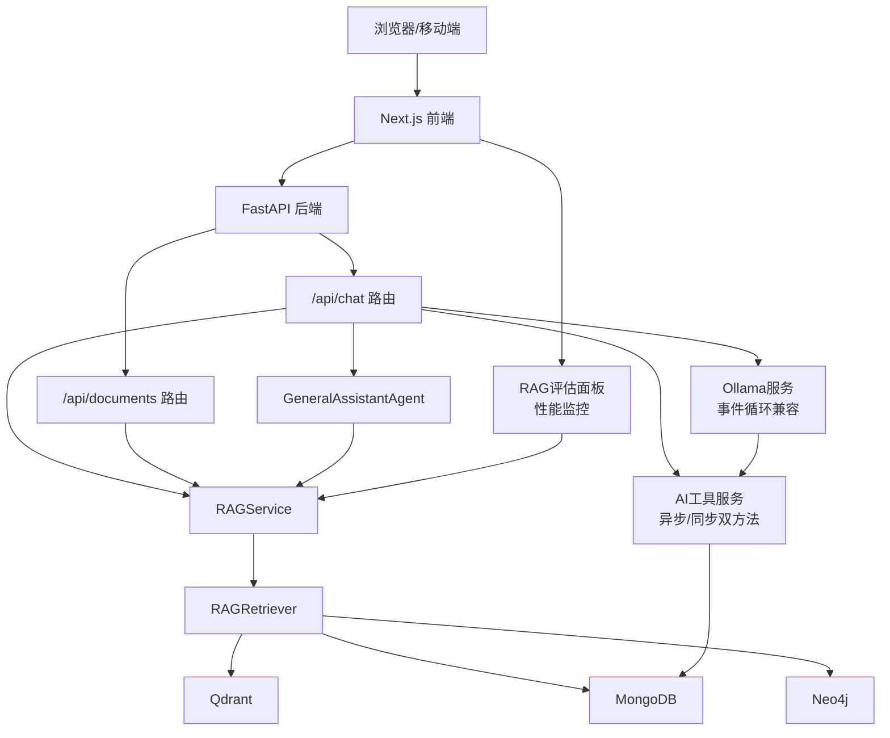
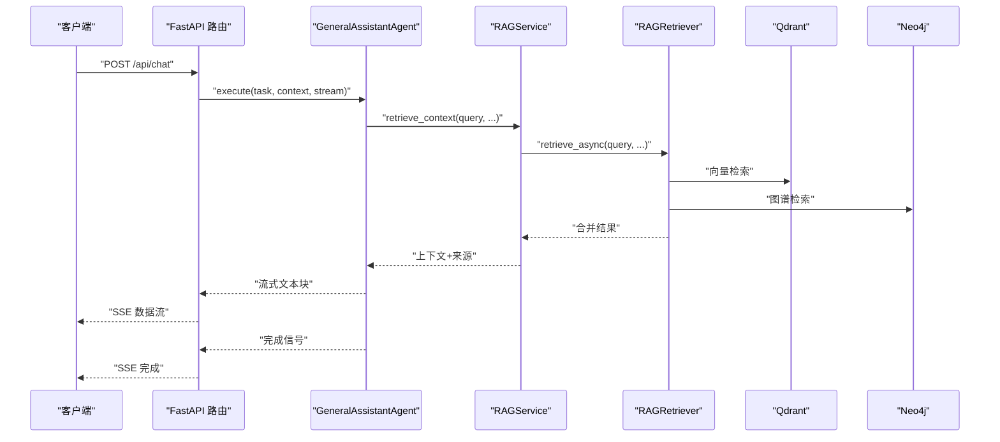
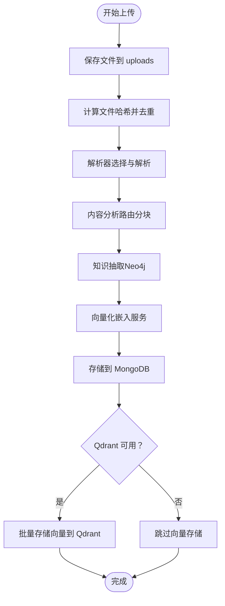
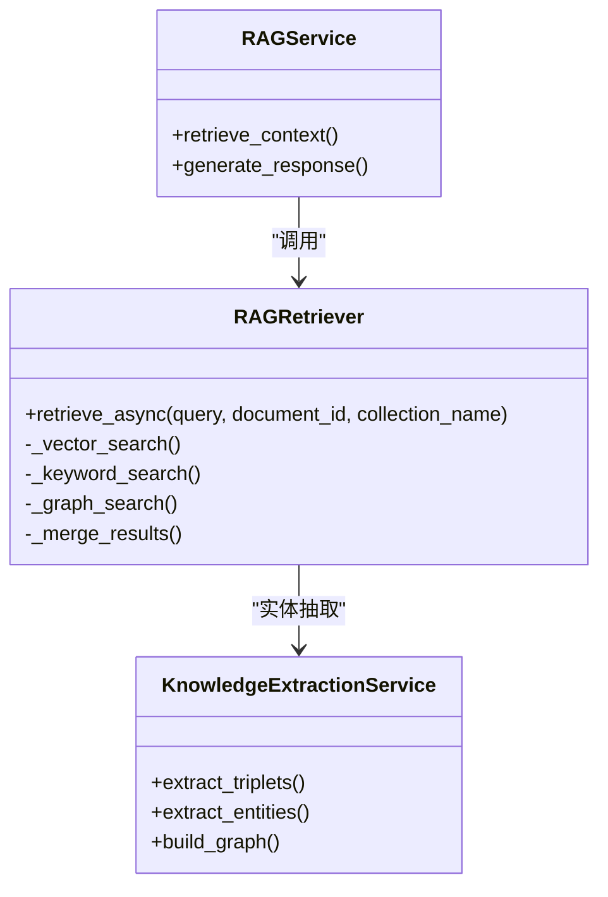
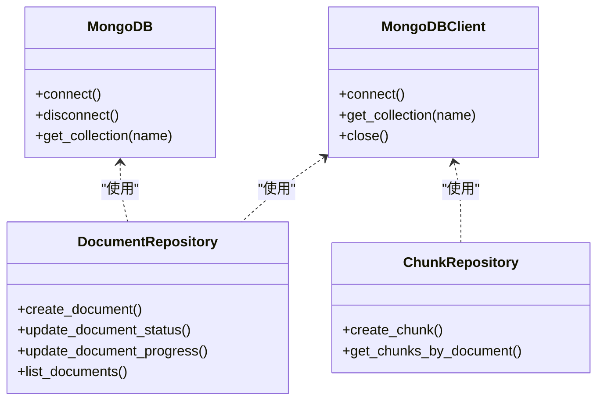
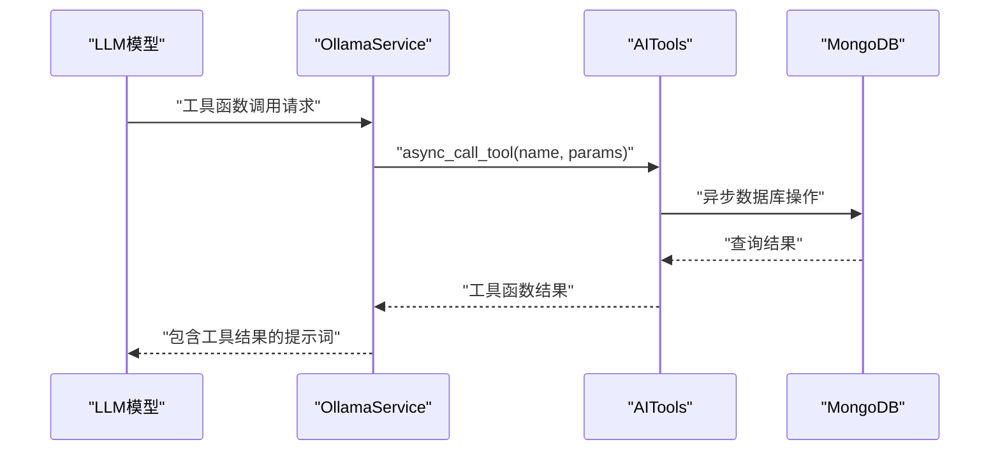
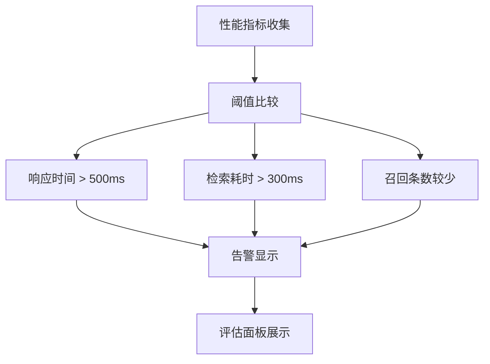
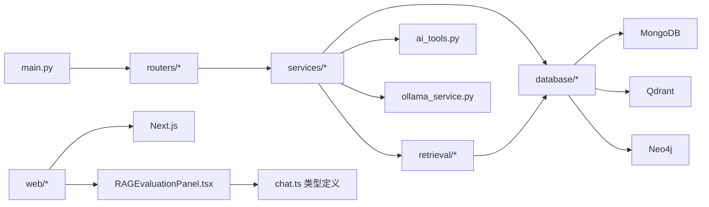

# 系统架构总览

<cite>
**本文档引用的文件**
- [main.py](file://main.py)
- [routers/chat.py](file://routers/chat.py)
- [routers/documents.py](file://routers/documents.py)
- [services/rag_service.py](file://services/rag_service.py)
- [services/knowledge_extraction_service.py](file://services/knowledge_extraction_service.py)
- [retrieval/rag_retriever.py](file://retrieval/rag_retriever.py)
- [database/mongodb.py](file://database/mongodb.py)
- [agents/general_assistant/general_assistant_agent.py](file://agents/general_assistant/general_assistant_agent.py)
- [services/ai_tools.py](file://services/ai_tools.py)
- [services/ollama_service.py](file://services/ollama_service.py)
- [web/components/chat/RAGEvaluationPanel.tsx](file://web/components/chat/RAGEvaluationPanel.tsx)
- [web/types/chat.ts](file://web/types/chat.ts)
- [eval/evaluate.py](file://eval/evaluate.py)
- [web/Dockerfile](file://web/Dockerfile)
- [Dockerfile](file://Dockerfile)
- [docker-compose.yml](file://docker-compose.yml)
- [requirements.txt](file://requirements.txt)
- [web/package.json](file://web/package.json)
- [web/app/layout.tsx](file://web/app/layout.tsx)
- [README.md](file://README.md)
</cite>

## 更新摘要
**所做更改**
- 新增 AI 工具服务的异步/同步双方法架构说明
- 更新 Ollama 服务的 async_call_tool 确保事件循环兼容性
- 新增 RAG 评估面板的性能监控功能
- 更新工具调用模式和性能监控增强的技术细节

## 目录
1. [简介](#简介)
2. [项目结构](#项目结构)
3. [核心组件](#核心组件)
4. [架构总览](#架构总览)
5. [详细组件分析](#详细组件分析)
6. [依赖关系分析](#依赖关系分析)
7. [性能考量](#性能考量)
8. [故障排查指南](#故障排查指南)
9. [结论](#结论)
10. [附录](#附录)

## 简介
advanced-rag 是一个"纯开源高级RAG系统"，采用前后端分离架构，后端基于 FastAPI，前端基于 Next.js。系统围绕两大核心能力展开：AI 助手对话（含深度研究）与知识库检索/入库。系统采用微服务风格的模块化设计，结合事件驱动的异步处理机制，支持流式响应与后台任务处理。数据库层整合 MongoDB、Qdrant、Neo4j 等多数据库，形成"文本向量索引 + 知识图谱索引"的混合检索体系。

**更新** 新增 AI 工具服务的异步/同步双方法架构，确保在事件循环环境中安全调用数据库操作，同时引入 RAG 评估面板提供性能监控能力。

## 项目结构
项目采用分层与功能域结合的组织方式：
- 表现层（前端 Next.js）：位于 web/ 目录，负责用户界面与交互，包含 RAG 评估面板组件。
- 业务层（FastAPI 服务）：位于项目根目录，包含路由、服务、代理、检索、数据库等模块。
- 数据层：MongoDB（对话与元数据）、Qdrant（向量检索）、Neo4j（知识图谱）。
- 部署层：Docker 与 docker-compose，支持一键启动数据库与服务。

**图表来源**
- [main.py:55-98](file://main.py#L55-L98)
- [routers/chat.py:1-800](file://routers/chat.py#L1-L800)
- [routers/documents.py:1-800](file://routers/documents.py#L1-L800)
- [services/rag_service.py:1-248](file://services/rag_service.py#L1-L248)
- [services/knowledge_extraction_service.py:1-211](file://services/knowledge_extraction_service.py#L1-L211)
- [retrieval/rag_retriever.py:1-325](file://retrieval/rag_retriever.py#L1-L325)
- [database/mongodb.py:1-800](file://database/mongodb.py#L1-L800)
- [services/ai_tools.py:155-195](file://services/ai_tools.py#L155-L195)
- [services/ollama_service.py:644-669](file://services/ollama_service.py#L644-L669)
- [web/components/chat/RAGEvaluationPanel.tsx:1-121](file://web/components/chat/RAGEvaluationPanel.tsx#L1-L121)
- [web/types/chat.ts:4-19](file://web/types/chat.ts#L4-L19)
- [web/Dockerfile:1-39](file://web/Dockerfile#L1-L39)
- [web/package.json:1-40](file://web/package.json#L1-L40)
- [web/app/layout.tsx:1-49](file://web/app/layout.tsx#L1-L49)

**章节来源**
- [README.md:55-70](file://README.md#L55-L70)
- [main.py:55-98](file://main.py#L55-L98)

## 核心组件
- 应用入口与路由注册：在 main.py 中创建 FastAPI 应用，注册 CORS、静态文件、日志中间件与各模块路由。
- 路由层：routers/chat.py 提供对话与深度研究接口；routers/documents.py 提供文档上传与入库流程。
- 服务层：services/rag_service.py 封装 RAG 检索与生成；services/knowledge_extraction_service.py 提供知识抽取与图谱构建。
- 检索层：retrieval/rag_retriever.py 实现向量检索、关键词检索与图谱检索的混合与合并。
- 数据层：database/mongodb.py 提供 MongoDB 异步/同步客户端与仓储类；配合 Qdrant 与 Neo4j 客户端。
- 代理层：agents/general_assistant/general_assistant_agent.py 封装通用助手 Agent 的执行流程。
- AI 工具服务：services/ai_tools.py 提供异步/同步双方法架构，支持 MongoDB 操作的事件循环兼容调用。
- Ollama 服务：services/ollama_service.py 通过 async_call_tool 确保事件循环兼容性，支持工具函数调用。
- 性能监控：web/components/chat/RAGEvaluationPanel.tsx 提供 RAG 评估面板，包含性能指标监控。
- 前端：web/ 目录下的 Next.js 应用，包含页面、组件与主题配置。

**章节来源**
- [main.py:55-98](file://main.py#L55-L98)
- [routers/chat.py:1-800](file://routers/chat.py#L1-L800)
- [routers/documents.py:1-800](file://routers/documents.py#L1-L800)
- [services/rag_service.py:1-248](file://services/rag_service.py#L1-L248)
- [services/knowledge_extraction_service.py:1-211](file://services/knowledge_extraction_service.py#L1-L211)
- [retrieval/rag_retriever.py:1-325](file://retrieval/rag_retriever.py#L1-L325)
- [database/mongodb.py:1-800](file://database/mongodb.py#L1-L800)
- [services/ai_tools.py:155-195](file://services/ai_tools.py#L155-L195)
- [services/ollama_service.py:644-669](file://services/ollama_service.py#L644-L669)
- [web/components/chat/RAGEvaluationPanel.tsx:1-121](file://web/components/chat/RAGEvaluationPanel.tsx#L1-L121)
- [web/package.json:1-40](file://web/package.json#L1-L40)

## 架构总览
系统采用"前后端分离 + 微服务风格模块化 + 事件驱动异步处理"的架构：
- 前端 Next.js：负责用户界面渲染与交互，通过 HTTP/Server-Sent Events 与后端通信，包含 RAG 评估面板组件。
- 后端 FastAPI：提供 REST API，支持流式响应（SSE）、后台任务与中间件（CORS、日志）。
- 模块化设计：路由、服务、代理、检索、数据库等模块职责清晰，便于扩展与维护。
- 事件驱动：对话与文档入库流程广泛使用异步与后台任务，提升吞吐与用户体验。
- 多数据库集成：MongoDB 存储对话与元数据，Qdrant 提供向量检索，Neo4j 提供知识图谱。
- 工具调用增强：AI 工具服务采用异步/同步双方法架构，确保事件循环兼容性。
- 性能监控：新增 RAG 评估面板提供性能指标监控与告警功能。

**图表来源**
- [main.py:90-98](file://main.py#L90-L98)
- [routers/chat.py:615-750](file://routers/chat.py#L615-L750)
- [routers/documents.py:723-800](file://routers/documents.py#L723-L800)
- [services/rag_service.py:10-242](file://services/rag_service.py#L10-L242)
- [retrieval/rag_retriever.py:69-101](file://retrieval/rag_retriever.py#L69-L101)
- [agents/general_assistant/general_assistant_agent.py:49-167](file://agents/general_assistant/general_assistant_agent.py#L49-L167)
- [services/ai_tools.py:155-195](file://services/ai_tools.py#L155-L195)
- [services/ollama_service.py:644-669](file://services/ollama_service.py#L644-L669)
- [web/components/chat/RAGEvaluationPanel.tsx:1-121](file://web/components/chat/RAGEvaluationPanel.tsx#L1-L121)

## 详细组件分析

### 组件A：对话与深度研究（流式响应）
- 路由：/api/chat 提供常规对话与深度研究两种模式，均通过 SSE 流式返回。
- 流式断开检测：在生成过程中定期检查客户端断开，及时停止输出。
- 深度研究：通过 AgentWorkflow 与多个专家 Agent 协作，返回 HTML 格式结果。
- 代理执行：GeneralAssistantAgent 负责 RAG 检索与 LLM 生成，支持模型选择与上下文注入。

**图表来源**
- [routers/chat.py:615-750](file://routers/chat.py#L615-L750)
- [agents/general_assistant/general_assistant_agent.py:49-167](file://agents/general_assistant/general_assistant_agent.py#L49-L167)
- [services/rag_service.py:10-242](file://services/rag_service.py#L10-L242)
- [retrieval/rag_retriever.py:69-101](file://retrieval/rag_retriever.py#L69-L101)

**章节来源**
- [routers/chat.py:615-750](file://routers/chat.py#L615-L750)
- [agents/general_assistant/general_assistant_agent.py:49-167](file://agents/general_assistant/general_assistant_agent.py#L49-L167)

### 组件B：文档上传与入库（后台任务与进度追踪）
- 路由：/api/documents/upload 接收文件，启动后台任务处理。
- 处理流程：解析（PDF/Word/Markdown/TXT）→ 分块（内容分析路由）→ 知识抽取（Neo4j）→ 向量化（嵌入服务）→ 存储（MongoDB/Qdrant）。
- 进度追踪：通过文档仓储更新状态与进度，支持失败回退与清理。
- 超时与并发控制：解析与分块采用线程+超时监控，向量化分批处理，避免内存与服务压力。

**图表来源**
- [routers/documents.py:723-800](file://routers/documents.py#L723-L800)
- [routers/documents.py:274-721](file://routers/documents.py#L274-L721)
- [services/knowledge_extraction_service.py:144-211](file://services/knowledge_extraction_service.py#L144-L211)

**章节来源**
- [routers/documents.py:723-800](file://routers/documents.py#L723-L800)
- [routers/documents.py:274-721](file://routers/documents.py#L274-L721)
- [services/knowledge_extraction_service.py:144-211](file://services/knowledge_extraction_service.py#L144-L211)

### 组件C：RAG 检索与混合检索
- 检索策略：向量检索（Qdrant）、关键词检索（MongoDB）、图谱检索（Neo4j）。
- 结果合并：按 chunk_id 去重与分数合并，必要时进行重排（当前禁用）。
- 上下文构建：聚合文本与来源元数据，支持对话历史注入。

**图表来源**
- [retrieval/rag_retriever.py:22-325](file://retrieval/rag_retriever.py#L22-L325)
- [services/rag_service.py:7-242](file://services/rag_service.py#L7-L242)
- [services/knowledge_extraction_service.py:10-211](file://services/knowledge_extraction_service.py#L10-L211)

**章节来源**
- [retrieval/rag_retriever.py:22-325](file://retrieval/rag_retriever.py#L22-L325)
- [services/rag_service.py:7-242](file://services/rag_service.py#L7-L242)
- [services/knowledge_extraction_service.py:10-211](file://services/knowledge_extraction_service.py#L10-L211)

### 组件D：数据库与仓储
- MongoDB：提供异步客户端与同步客户端，分别用于实时查询与后台处理；仓储类封装 CRUD 与统计。
- Qdrant：提供集合创建、向量插入与检索接口。
- Neo4j：提供实体与关系创建，支持知识图谱构建。

**图表来源**
- [database/mongodb.py:92-200](file://database/mongodb.py#L92-L200)
- [database/mongodb.py:209-313](file://database/mongodb.py#L209-L313)
- [database/mongodb.py:315-597](file://database/mongodb.py#L315-L597)
- [database/mongodb.py:770-800](file://database/mongodb.py#L770-L800)

**章节来源**
- [database/mongodb.py:92-200](file://database/mongodb.py#L92-L200)
- [database/mongodb.py:209-313](file://database/mongodb.py#L209-L313)
- [database/mongodb.py:315-597](file://database/mongodb.py#L315-L597)
- [database/mongodb.py:770-800](file://database/mongodb.py#L770-L800)

### 组件E：AI 工具服务与 Ollama 集成
- AI 工具服务：采用异步/同步双方法架构，支持 MongoDB 操作的事件循环兼容调用。
- Ollama 服务：通过 async_call_tool 确保事件循环兼容性，支持工具函数调用与流式生成。
- 工具函数：包括知识库文档列表、系统信息、知识库统计等实时数据获取。

**图表来源**
- [services/ai_tools.py:155-195](file://services/ai_tools.py#L155-L195)
- [services/ollama_service.py:426-451](file://services/ollama_service.py#L426-L451)
- [services/ollama_service.py:644-669](file://services/ollama_service.py#L644-L669)

**章节来源**
- [services/ai_tools.py:155-195](file://services/ai_tools.py#L155-L195)
- [services/ollama_service.py:426-451](file://services/ollama_service.py#L426-L451)
- [services/ollama_service.py:644-669](file://services/ollama_service.py#L644-L669)

### 组件F：性能监控与评估面板
- RAG 评估面板：提供响应时间、检索耗时、召回条数等性能指标监控。
- 阈值告警：基于预设阈值自动检测性能异常并提供告警。
- 指标收集：支持 TTFT（首 token 耗时）、总响应耗时、上下文长度等指标。

**图表来源**
- [web/components/chat/RAGEvaluationPanel.tsx:6-9](file://web/components/chat/RAGEvaluationPanel.tsx#L6-L9)
- [web/components/chat/RAGEvaluationPanel.tsx:31-39](file://web/components/chat/RAGEvaluationPanel.tsx#L31-L39)
- [web/types/chat.ts:4-19](file://web/types/chat.ts#L4-L19)

**章节来源**
- [web/components/chat/RAGEvaluationPanel.tsx:1-121](file://web/components/chat/RAGEvaluationPanel.tsx#L1-L121)
- [web/types/chat.ts:4-19](file://web/types/chat.ts#L4-L19)

### 组件G：前端 Next.js 与主题
- 主题系统：通过 layout.tsx 注入主题逻辑，支持系统/浅色/深色切换。
- 依赖与脚本：package.json 管理 Next.js 与渲染相关依赖，支持开发/构建/启动。

**章节来源**
- [web/app/layout.tsx:16-49](file://web/app/layout.tsx#L16-L49)
- [web/package.json:1-40](file://web/package.json#L1-L40)

## 依赖关系分析
- 后端依赖：FastAPI、Uvicorn、MongoDB（Motor/Mongo）、Qdrant 客户端、Neo4j 客户端、LangChain、PaddleOCR、PyMuPDF、PyPDF2、python-docx、unstructured 等。
- 前端依赖：Next.js、React、react-markdown、MathJax、KaTeX 等。
- 部署依赖：Docker 与 docker-compose，支持数据库与服务的容器化编排。

**图表来源**
- [main.py:15-18](file://main.py#L15-L18)
- [requirements.txt:1-38](file://requirements.txt#L1-L38)
- [web/Dockerfile:1-39](file://web/Dockerfile#L1-L39)
- [Dockerfile:1-95](file://Dockerfile#L1-L95)
- [docker-compose.yml:1-76](file://docker-compose.yml#L1-L76)

**章节来源**
- [requirements.txt:1-38](file://requirements.txt#L1-L38)
- [web/Dockerfile:1-39](file://web/Dockerfile#L1-L39)
- [Dockerfile:1-95](file://Dockerfile#L1-L95)
- [docker-compose.yml:1-76](file://docker-compose.yml#L1-L76)

## 性能考量
- 并发与连接池：MongoDB 使用连接池参数优化高并发；Uvicorn 在生产环境使用多 worker 与 keep-alive 超时。
- 流式响应：对话与深度研究采用 SSE 流式输出，降低首包延迟与内存占用。
- 分批处理：文档入库的向量化与 Qdrant 批量插入采用分批策略，避免内存峰值。
- 超时与重试：解析、分块、向量化与 Qdrant 插入均有超时与重试控制，提升稳定性。
- 模型选择：Agent 层支持动态模型选择，按任务复杂度调整推理负载。
- 事件循环兼容：AI 工具服务通过 async_call_tool 确保在事件循环环境中安全调用数据库操作。
- 性能监控：RAG 评估面板提供实时性能指标监控，包括响应时间、检索耗时、召回条数等关键指标。

**章节来源**
- [main.py:128-157](file://main.py#L128-L157)
- [database/mongodb.py:122-136](file://database/mongodb.py#L122-L136)
- [routers/documents.py:466-492](file://routers/documents.py#L466-L492)
- [routers/documents.py:594-672](file://routers/documents.py#L594-L672)
- [agents/general_assistant/general_assistant_agent.py:80-96](file://agents/general_assistant/general_assistant_agent.py#L80-L96)
- [services/ai_tools.py:155-195](file://services/ai_tools.py#L155-L195)
- [web/components/chat/RAGEvaluationPanel.tsx:6-9](file://web/components/chat/RAGEvaluationPanel.tsx#L6-L9)

## 故障排查指南
- 全局异常处理：main.py 中注册全局异常处理器，统一记录错误并返回 JSON。
- 日志中间件：请求进入与异常均通过日志中间件记录，便于定位问题。
- 数据库连接：MongoDB 连接失败会抛出详细错误提示，检查 URI/主机/端口/认证。
- Qdrant/Neo4j 可用性：文档入库流程在 Qdrant 不可用时仅存储到 MongoDB，并更新进度。
- 前端健康检查：Dockerfile 中 HEALTHCHECK 通过 HTTP 访问 /health，可用于容器健康状态判断。
- 事件循环兼容性：AI 工具调用需使用 async_call_tool 方法，避免在事件循环中直接调用同步数据库操作。
- 性能监控告警：RAG 评估面板提供实时性能告警，包括响应时间过长、检索耗时过高等异常情况。

**章节来源**
- [main.py:109-126](file://main.py#L109-L126)
- [main.py:18-18](file://main.py#L18-L18)
- [database/mongodb.py:168-184](file://database/mongodb.py#L168-L184)
- [routers/documents.py:546-559](file://routers/documents.py#L546-L559)
- [Dockerfile:91-92](file://Dockerfile#L91-L92)
- [services/ai_tools.py:155-195](file://services/ai_tools.py#L155-L195)
- [web/components/chat/RAGEvaluationPanel.tsx:31-39](file://web/components/chat/RAGEvaluationPanel.tsx#L31-L39)

## 结论
advanced-rag 通过前后端分离、微服务风格的模块化设计与事件驱动的异步处理，实现了高性能、可扩展的 RAG 能力。系统在对话与知识库入库两条主链路上均采用流式与后台任务，结合多数据库与混合检索策略，满足复杂场景下的检索与生成需求。容器化部署与健康检查进一步提升了运维效率与稳定性。

**更新** 新增的 AI 工具服务异步/同步双方法架构确保了事件循环环境下的数据库操作安全性，Ollama 服务的 async_call_tool 机制保证了工具函数调用的兼容性。RAG 评估面板提供了全面的性能监控能力，包括响应时间、检索耗时、召回条数等关键指标，为系统优化和故障排查提供了有力支撑。

## 附录
- 系统边界与集成点
  - 前端 Next.js 与后端 FastAPI 通过 REST API 与 SSE 通信。
  - 后端与数据库通过客户端库集成，MongoDB 用于对话与元数据，Qdrant 用于向量检索，Neo4j 用于知识图谱。
  - 外部服务：Ollama（本地模型推理）、PaddleOCR（OCR）、Unstructured（复杂格式解析）等。
  - AI 工具服务：提供知识库文档列表、系统信息、知识库统计等实时数据获取。
- 技术决策的架构影响
  - FastAPI：提供高性能 ASGI 服务与自动生成 OpenAPI 文档，适合高并发与可观测性。
  - Docker 容器化：统一环境与依赖，简化部署与扩缩容。
  - SSE 流式：改善用户体验，降低前端复杂度。
  - 混合检索：提升召回质量与准确性，兼顾速度与效果。
  - 异步/同步双方法架构：确保事件循环兼容性，提升系统稳定性。
  - 性能监控：提供实时性能指标，支持系统优化与故障排查。

**章节来源**
- [README.md:26-54](file://README.md#L26-L54)
- [README.md:189-227](file://README.md#L189-L227)
- [main.py:55-98](file://main.py#L55-L98)
- [Dockerfile:1-95](file://Dockerfile#L1-L95)
- [web/Dockerfile:1-39](file://web/Dockerfile#L1-L39)
- [services/ai_tools.py:155-195](file://services/ai_tools.py#L155-L195)
- [services/ollama_service.py:644-669](file://services/ollama_service.py#L644-L669)
- [web/components/chat/RAGEvaluationPanel.tsx:1-121](file://web/components/chat/RAGEvaluationPanel.tsx#L1-L121)