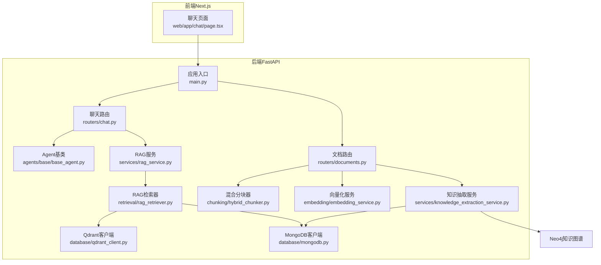
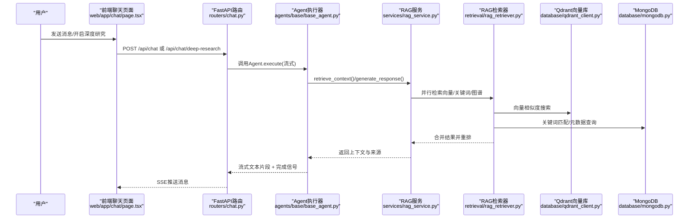
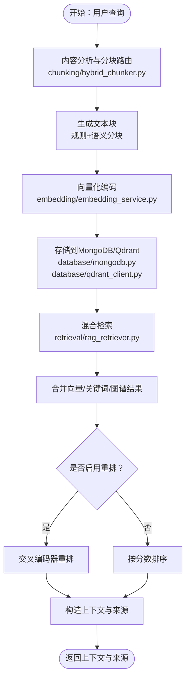
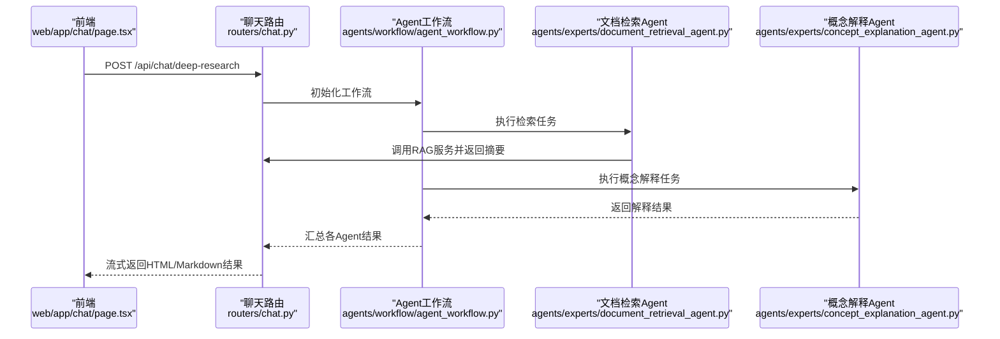
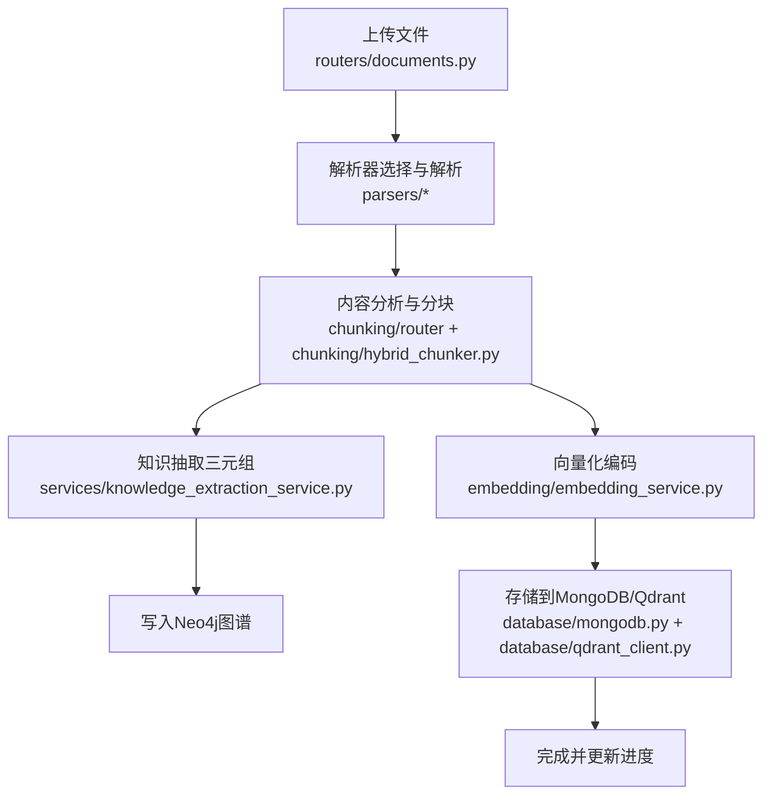
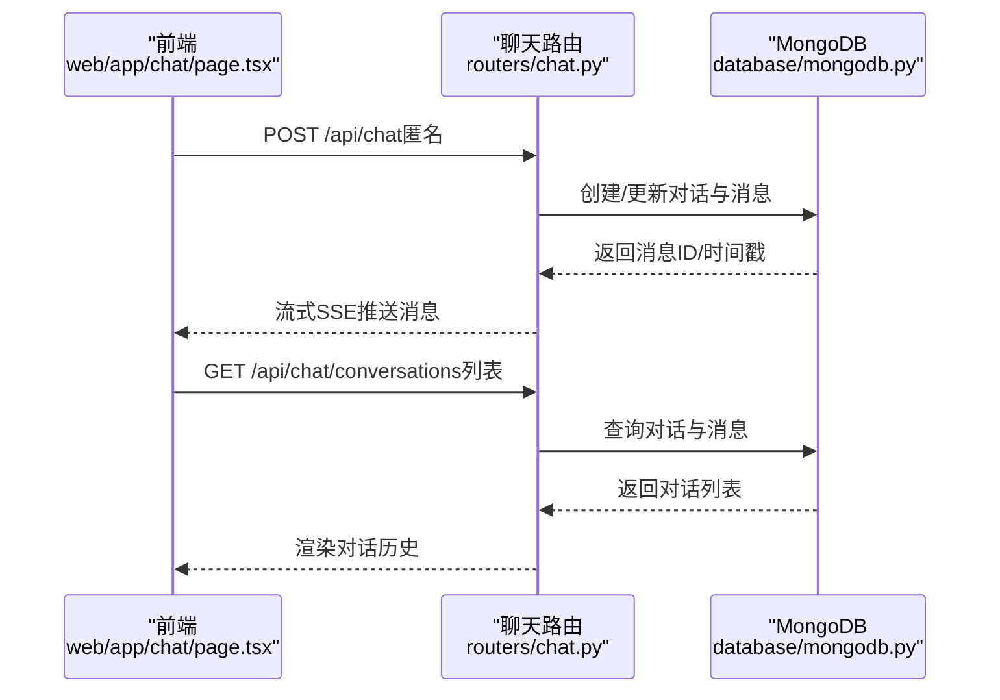
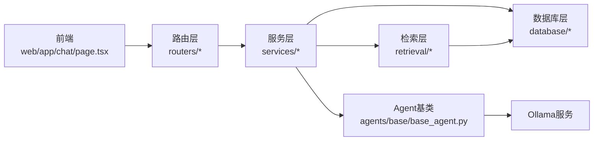

# 项目介绍

<cite>
**本文引用的文件**
- [README.md](file://README.md)
- [main.py](file://main.py)
- [agents/base/base_agent.py](file://agents/base/base_agent.py)
- [services/rag_service.py](file://services/rag_service.py)
- [retrieval/rag_retriever.py](file://retrieval/rag_retriever.py)
- [chunking/hybrid_chunker.py](file://chunking/hybrid_chunker.py)
- [embedding/embedding_service.py](file://embedding/embedding_service.py)
- [database/qdrant_client.py](file://database/qdrant_client.py)
- [web/app/chat/page.tsx](file://web/app/chat/page.tsx)
- [routers/chat.py](file://routers/chat.py)
- [routers/documents.py](file://routers/documents.py)
- [services/knowledge_extraction_service.py](file://services/knowledge_extraction_service.py)
- [database/mongodb.py](file://database/mongodb.py)
</cite>

## 目录
1. [引言](#引言)
2. [项目结构](#项目结构)
3. [核心组件](#核心组件)
4. [架构总览](#架构总览)
5. [详细组件分析](#详细组件分析)
6. [依赖关系分析](#依赖关系分析)
7. [性能考量](#性能考量)
8. [故障排查指南](#故障排查指南)
9. [结论](#结论)
10. [附录](#附录)

## 引言
advanced-rag 是一个“纯粹的开源高级RAG系统”，专注于提供“AI助手对话（含深度研究/深度思考）”与“知识库检索/入库”的两大核心能力，所有API均支持匿名访问。项目通过“混合分块 + 双路索引 + 混合检索 + 精准重排”的高阶RAG引擎，结合多Agent协作与知识图谱，为用户提供高质量、可溯源、可扩展的智能问答体验。

本项目强调开源理念与社区价值：  
- 无认证、无用户系统、无后台管理，降低使用门槛，鼓励自由探索与二次开发  
- 提供清晰的API与前后端分离架构，便于集成与定制  
- 通过匿名对话与全局对话历史，保护隐私并提升易用性  
- 专注RAG能力本身，移除非核心功能，使系统更轻量、更稳定  

## 项目结构
项目采用前后端分离架构：  
- 后端：FastAPI + 多模块分层（路由层、服务层、数据库层、工具层）  
- 前端：Next.js（React）聊天界面与知识空间展示  
- 数据与存储：MongoDB（文档/对话/分块）、Qdrant（向量）、Neo4j（知识图谱）、Redis（可选缓存）  
- AI推理：Ollama（本地模型推理）

**图表来源**
- [main.py:1-157](file://main.py#L1-L157)
- [routers/chat.py:1-800](file://routers/chat.py#L1-L800)
- [routers/documents.py:1-800](file://routers/documents.py#L1-L800)
- [services/rag_service.py:1-248](file://services/rag_service.py#L1-L248)
- [services/knowledge_extraction_service.py:1-211](file://services/knowledge_extraction_service.py#L1-L211)
- [retrieval/rag_retriever.py:1-325](file://retrieval/rag_retriever.py#L1-L325)
- [chunking/hybrid_chunker.py:1-179](file://chunking/hybrid_chunker.py#L1-L179)
- [embedding/embedding_service.py:1-278](file://embedding/embedding_service.py#L1-L278)
- [database/qdrant_client.py:1-544](file://database/qdrant_client.py#L1-L544)
- [database/mongodb.py:1-800](file://database/mongodb.py#L1-L800)

**章节来源**
- [README.md:55-70](file://README.md#L55-L70)
- [main.py:90-98](file://main.py#L90-L98)

## 核心组件
- 代理系统（agents/）：多Agent协作框架，提供统一的Agent基类与具体专家Agent（概念解释、文档检索等）
- 检索系统（retrieval/）：高阶RAG检索器，支持向量检索、关键词检索、图谱检索与混合重排
- 分块系统（chunking/）：混合分块器，兼顾规则分块（代码/公式/表格）与语义分块
- 向量化服务（embedding/）：基于Ollama的嵌入服务，支持模型检测与批量编码
- 数据库与存储（database/）：MongoDB（文档/对话/分块）、Qdrant（向量）、Neo4j（知识图谱）
- 服务层（services/）：RAG服务、知识抽取服务、Ollama服务等
- 路由层（routers/）：聊天、文档、检索、知识空间、健康检查等API
- 前端（web/）：聊天界面、深度研究渲染、消息流式输出、文件上传与状态轮询

**章节来源**
- [README.md:46-54](file://README.md#L46-L54)
- [agents/base/base_agent.py:1-122](file://agents/base/base_agent.py#L1-L122)
- [services/rag_service.py:1-248](file://services/rag_service.py#L1-L248)
- [retrieval/rag_retriever.py:1-325](file://retrieval/rag_retriever.py#L1-L325)
- [chunking/hybrid_chunker.py:1-179](file://chunking/hybrid_chunker.py#L1-L179)
- [embedding/embedding_service.py:1-278](file://embedding/embedding_service.py#L1-L278)
- [database/qdrant_client.py:1-544](file://database/qdrant_client.py#L1-L544)
- [database/mongodb.py:1-800](file://database/mongodb.py#L1-L800)
- [services/knowledge_extraction_service.py:1-211](file://services/knowledge_extraction_service.py#L1-L211)

## 架构总览
系统采用“API网关 + 多模块服务 + 多数据源”的分层设计：  
- API层：FastAPI路由负责请求接入、参数校验与流式响应  
- 业务层：RAG服务、知识抽取服务等封装复杂逻辑  
- 检索层：RAG检索器聚合向量、关键词、图谱三种检索策略  
- 存储层：MongoDB持久化元数据与对话，Qdrant存储向量，Neo4j构建知识图谱  
- 推理层：Ollama提供本地LLM与嵌入模型能力

**图表来源**
- [web/app/chat/page.tsx:680-800](file://web/app/chat/page.tsx#L680-L800)
- [routers/chat.py:615-751](file://routers/chat.py#L615-L751)
- [agents/base/base_agent.py:37-55](file://agents/base/base_agent.py#L37-L55)
- [services/rag_service.py:10-191](file://services/rag_service.py#L10-L191)
- [retrieval/rag_retriever.py:69-101](file://retrieval/rag_retriever.py#L69-L101)
- [database/qdrant_client.py:336-414](file://database/qdrant_client.py#L336-L414)
- [database/mongodb.py:799-800](file://database/mongodb.py#L799-L800)

## 详细组件分析

### 组件A：高阶RAG引擎
- 混合分块：规则分块（代码/公式/表格）+ 语义分块（Ollama嵌入），并进行去重与细粒度元数据标注  
- 双路索引：向量索引（Qdrant）+ 知识图谱索引（Neo4j）  
- 混合检索：向量检索 + 关键词检索 + 图谱关联检索  
- 精准重排：交叉编码器（Cross-Encoder）进行重排（当前代码中为可选禁用状态，保留接口）  

**图表来源**
- [chunking/hybrid_chunker.py:52-121](file://chunking/hybrid_chunker.py#L52-L121)
- [embedding/embedding_service.py:230-263](file://embedding/embedding_service.py#L230-L263)
- [database/mongodb.py:770-798](file://database/mongodb.py#L770-L798)
- [database/qdrant_client.py:210-335](file://database/qdrant_client.py#L210-L335)
- [retrieval/rag_retriever.py:51-101](file://retrieval/rag_retriever.py#L51-L101)

**章节来源**
- [README.md:16-21](file://README.md#L16-L21)
- [retrieval/rag_retriever.py:22-101](file://retrieval/rag_retriever.py#L22-L101)
- [chunking/hybrid_chunker.py:9-18](file://chunking/hybrid_chunker.py#L9-L18)
- [embedding/embedding_service.py:8-44](file://embedding/embedding_service.py#L8-L44)
- [database/qdrant_client.py:18-96](file://database/qdrant_client.py#L18-L96)

### 组件B：多Agent协作与深度研究
- Agent基类提供统一的执行接口、提示词构建与LLM调用封装  
- 深度研究模式通过协调型Agent与多个专家Agent协作，输出结构化结果  
- 前端支持深度研究渲染与Agent工作状态面板，提供可视化反馈  

**图表来源**
- [web/app/chat/page.tsx:680-800](file://web/app/chat/page.tsx#L680-L800)
- [routers/chat.py:753-800](file://routers/chat.py#L753-L800)
- [agents/experts/document_retrieval_agent.py:25-79](file://agents/experts/document_retrieval_agent.py#L25-L79)
- [agents/experts/concept_explanation_agent.py:25-70](file://agents/experts/concept_explanation_agent.py#L25-L70)

**章节来源**
- [agents/base/base_agent.py:1-122](file://agents/base/base_agent.py#L1-L122)
- [routers/chat.py:753-800](file://routers/chat.py#L753-L800)

### 组件C：知识库入库与处理流水线
- 支持PDF/Word/Markdown/TXT上传，自动去重、解析、分块、知识抽取、向量化、入库  
- 后台任务异步处理，进度实时反馈，支持轮询状态  
- 知识抽取服务基于Ollama抽取三元组并写入Neo4j图数据库  

**图表来源**
- [routers/documents.py:723-800](file://routers/documents.py#L723-L800)
- [services/knowledge_extraction_service.py:144-211](file://services/knowledge_extraction_service.py#L144-L211)
- [chunking/hybrid_chunker.py:52-121](file://chunking/hybrid_chunker.py#L52-L121)
- [embedding/embedding_service.py:230-263](file://embedding/embedding_service.py#L230-L263)
- [database/mongodb.py:315-383](file://database/mongodb.py#L315-L383)
- [database/qdrant_client.py:210-335](file://database/qdrant_client.py#L210-L335)

**章节来源**
- [README.md:21-21](file://README.md#L21-L21)
- [routers/documents.py:1-800](file://routers/documents.py#L1-L800)

### 组件D：匿名对话与全局历史
- 无需登录即可发起对话，对话历史保存在MongoDB中  
- 前端支持对话列表、消息流式输出、消息编辑与重新生成  
- 支持对话附件上传并入库，独立向量空间增强  

**图表来源**
- [web/app/chat/page.tsx:680-800](file://web/app/chat/page.tsx#L680-L800)
- [routers/chat.py:97-149](file://routers/chat.py#L97-L149)
- [database/mongodb.py:315-383](file://database/mongodb.py#L315-L383)

**章节来源**
- [README.md:14-14](file://README.md#L14-L14)
- [routers/chat.py:151-193](file://routers/chat.py#L151-L193)

## 依赖关系分析
- 模块耦合：路由层依赖服务层；服务层依赖检索器与数据库客户端；Agent基类依赖Ollama服务  
- 外部依赖：FastAPI、MongoDB、Qdrant、Neo4j、Ollama、PaddleOCR、PyMuPDF、PyPDF2、python-docx 等  
- 数据流：前端请求经路由层进入服务层，服务层驱动检索器与数据库交互，再返回给前端  

**图表来源**
- [main.py:15-98](file://main.py#L15-L98)
- [routers/chat.py:1-800](file://routers/chat.py#L1-L800)
- [services/rag_service.py:1-248](file://services/rag_service.py#L1-L248)
- [retrieval/rag_retriever.py:1-325](file://retrieval/rag_retriever.py#L1-L325)
- [database/mongodb.py:1-800](file://database/mongodb.py#L1-L800)
- [agents/base/base_agent.py:1-122](file://agents/base/base_agent.py#L1-L122)

**章节来源**
- [main.py:15-98](file://main.py#L15-L98)
- [README.md:26-54](file://README.md#L26-L54)

## 性能考量
- 并发与连接池：MongoDB连接池参数可配置，Qdrant优先使用gRPC并支持连接复用  
- 异步与流式：RAG检索并行执行，前端SSE流式输出，提升用户体验  
- 批量处理：向量化与Qdrant入库采用分批处理，避免内存压力  
- 重试与降级：Qdrant插入与MongoDB操作具备重试与降级策略，保证稳定性  
- 模型与超时：Ollama嵌入请求具备超时与重试机制，避免长时间阻塞  

**章节来源**
- [database/mongodb.py:122-136](file://database/mongodb.py#L122-L136)
- [database/qdrant_client.py:66-96](file://database/qdrant_client.py#L66-L96)
- [database/qdrant_client.py:278-335](file://database/qdrant_client.py#L278-L335)
- [embedding/embedding_service.py:175-229](file://embedding/embedding_service.py#L175-L229)
- [web/app/chat/page.tsx:680-800](file://web/app/chat/page.tsx#L680-L800)

## 故障排查指南
- 启动与环境  
  - 确认 .env 配置（MongoDB、Qdrant、Neo4j、Redis、Ollama）  
  - Docker部署需提前下载第三方依赖（PaddleOCR等）  
- 数据库连接  
  - MongoDB连接失败：检查URI/主机/端口/认证/连接池参数  
  - Qdrant不可用：确认gRPC端口与服务状态，必要时切换为HTTP（不推荐）  
- 检索与重排  
  - 重排模块（sentence-transformers）当前被禁用以避免崩溃，可按需启用  
  - 图谱检索依赖Neo4j，未连接时会降级为基础检索  
- 文档入库  
  - 大文件解析/分块/向量化超时：适当增大超时时间或分批处理  
  - Qdrant维度不匹配：自动重建集合或调整向量维度  
- 前端交互  
  - 断开连接检测：后端SSE流式输出支持客户端断开检测，及时停止生成  
  - 附件处理轮询：前端轮询状态接口，完成后自动刷新消息  

**章节来源**
- [README.md:125-166](file://README.md#L125-L166)
- [README.md:200-228](file://README.md#L200-L228)
- [retrieval/rag_retriever.py:12-21](file://retrieval/rag_retriever.py#L12-L21)
- [database/qdrant_client.py:124-123](file://database/qdrant_client.py#L124-L123)
- [routers/documents.py:114-188](file://routers/documents.py#L114-L188)
- [routers/documents.py:274-722](file://routers/documents.py#L274-L722)
- [web/app/chat/page.tsx:242-327](file://web/app/chat/page.tsx#L242-L327)

## 结论
advanced-rag 通过“高阶RAG引擎 + 多Agent协作 + 知识图谱 + 匿名对话”的组合，构建了一个纯粹、开源、可扩展的智能问答平台。项目以简洁的架构与强大的检索能力为核心，既适合个人学习与探索，也可作为企业级知识问答系统的基石进行二次开发与定制。开源理念与社区价值贯穿始终，鼓励自由使用、贡献与创新。

## 附录
- 快速开始与部署参考：  
  - 环境要求与安装步骤  
  - Docker与Docker Compose部署  
  - API文档与健康检查  
- 开发指南：  
  - 代码结构说明与新增功能流程  
  - 测试与调试建议  
- 相关文档与贡献：  
  - 测试文档、变更日志、贡献指南、行为准则等  

**章节来源**
- [README.md:71-199](file://README.md#L71-L199)
- [README.md:255-266](file://README.md#L255-L266)