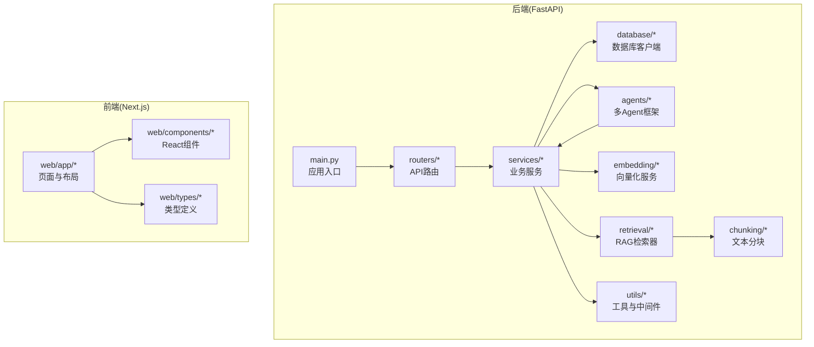
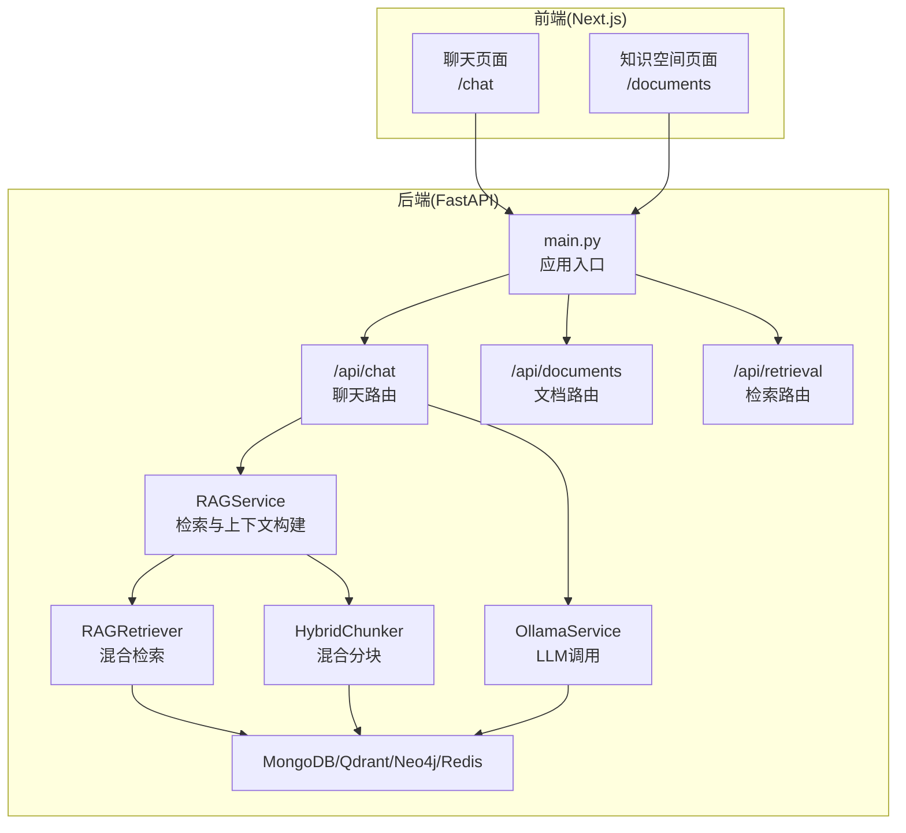
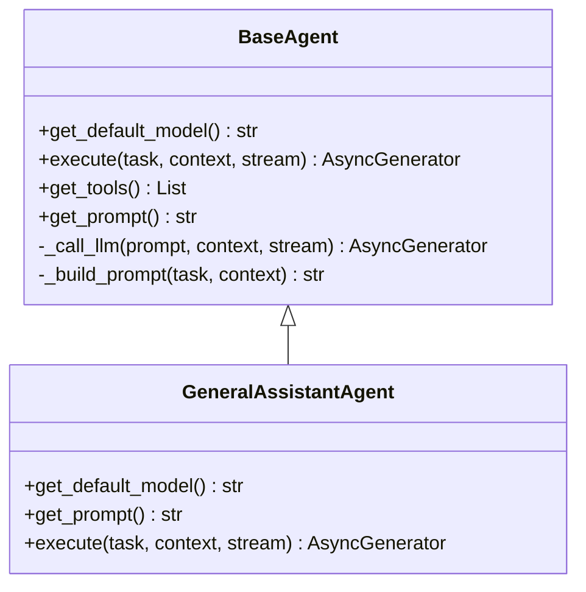
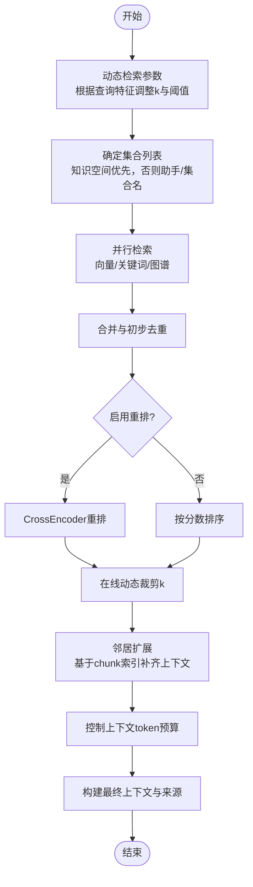
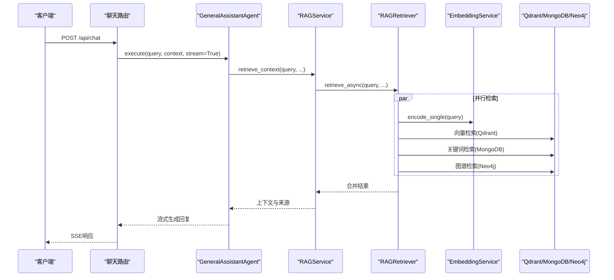
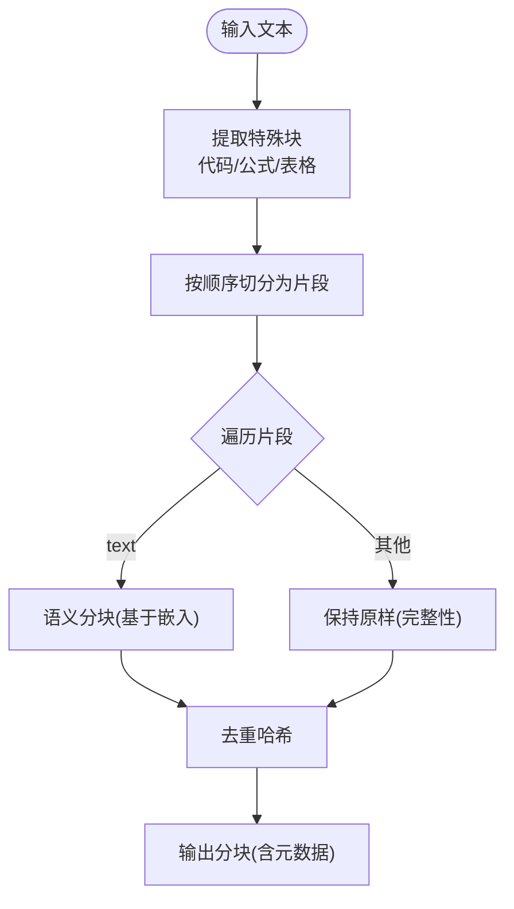
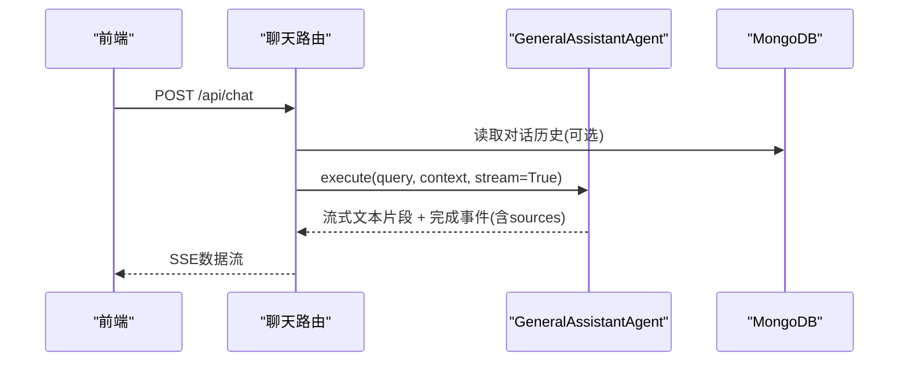
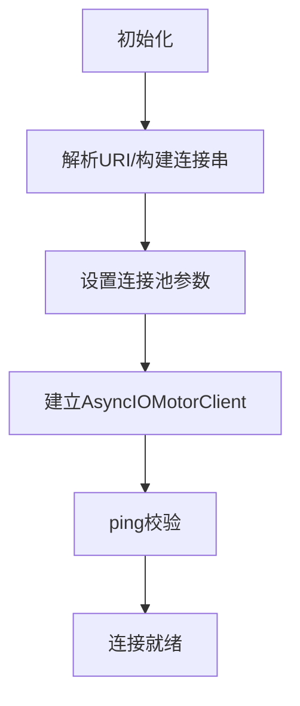
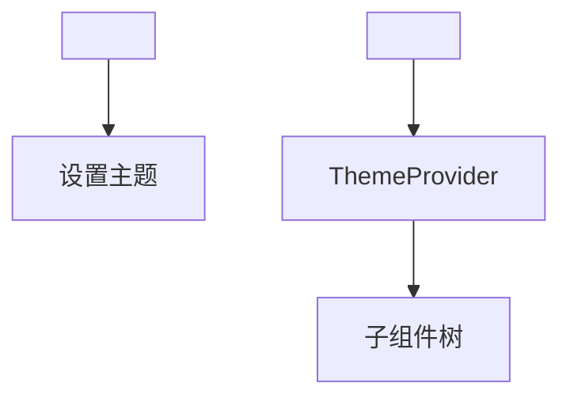
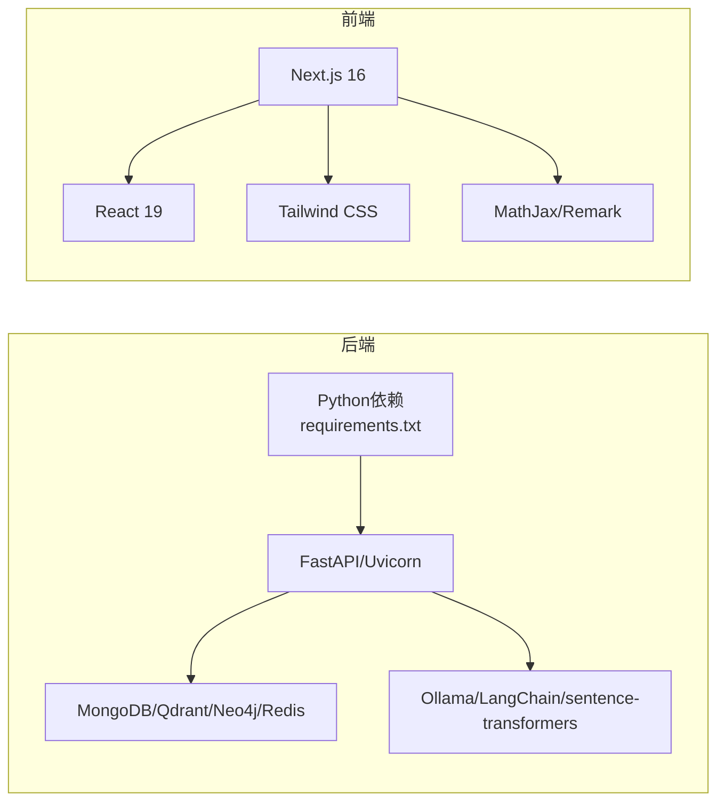

# 项目介绍与目标

<cite>
**本文引用的文件**
- [README.md](file://README.md)
- [main.py](file://main.py)
- [web/README.md](file://web/README.md)
- [requirements.txt](file://requirements.txt)
- [web/package.json](file://web/package.json)
- [routers/chat.py](file://routers/chat.py)
- [services/rag_service.py](file://services/rag_service.py)
- [retrieval/rag_retriever.py](file://retrieval/rag_retriever.py)
- [chunking/hybrid_chunker.py](file://chunking/hybrid_chunker.py)
- [agents/base/base_agent.py](file://agents/base/base_agent.py)
- [agents/general_assistant/general_assistant_agent.py](file://agents/general_assistant/general_assistant_agent.py)
- [database/mongodb.py](file://database/mongodb.py)
- [services/ollama_service.py](file://services/ollama_service.py)
- [web/app/layout.tsx](file://web/app/layout.tsx)
</cite>

## 目录
1. [简介](#简介)
2. [项目结构](#项目结构)
3. [核心组件](#核心组件)
4. [架构总览](#架构总览)
5. [详细组件分析](#详细组件分析)
6. [依赖分析](#依赖分析)
7. [性能考量](#性能考量)
8. [故障排查指南](#故障排查指南)
9. [结论](#结论)
10. [附录](#附录)

## 简介
Advanced RAG 是一个“纯粹的开源高级RAG系统”，以“AI助手对话（含深度研究/深度思考）”与“知识库检索/入库”为核心能力，所有API支持匿名访问。项目采用 FastAPI + Next.js 技术栈，构建高性能、可扩展、易于部署的RAG平台，服务于教育、科研、企业知识管理等场景。

- 核心使命
  - 构建一个“纯粹开源”的高级RAG系统，聚焦两大核心能力：AI助手对话（含深度研究/深度思考）与知识库检索/入库。
  - 通过“混合检索 + 知识图谱 + 重排”的高阶RAG引擎，提供更准确、可溯源的智能问答体验。
  - 以匿名访问的方式降低使用门槛，便于快速部署与推广。

- 价值主张
  - 高性能：后端基于FastAPI + Uvicorn多worker模式，前端基于Next.js App Router，整体具备良好的并发与响应能力。
  - 高可用：支持可选的Qdrant、Neo4j、Redis、MongoDB等组件，按需启用；即使部分组件未连接，系统仍可启动并提供核心功能。
  - 易扩展：模块化设计（代理系统、解析器、分块器、检索器、服务层、路由层），便于二次开发与定制。
  - 开放生态：MIT许可证，鼓励社区贡献与二次开发。

- 解决的实际问题
  - 教育领域：教师与学生可快速检索课件、论文与讲义，获得结构化、可溯源的解答。
  - 科研领域：研究人员可基于知识图谱进行跨文献关联分析，提升发现效率。
  - 企业知识管理：员工可对内部文档进行检索与问答，减少信息孤岛，提高决策效率。

- 技术栈选择理由
  - FastAPI：现代、高性能、自动生成OpenAPI文档，适合构建高并发API。
  - Next.js：App Router + SSR/Streaming，提供优秀的用户体验与SEO支持。
  - Ollama：本地模型推理，保障隐私与可控性。
  - 多数据库：MongoDB存储对话与元数据，Qdrant提供向量检索，Neo4j提供知识图谱，Redis提供可选缓存。

- 应用场景
  - 教育：课堂问答、作业辅导、课程资料检索。
  - 科研：文献综述、跨学科知识关联、实验方案检索。
  - 企业：内部知识库问答、政策解读、流程指导。

- 目标用户
  - 研究人员、高校教师与学生、企业知识管理员、开发者与技术爱好者。

- 发展愿景与规划
  - 短期：完善RAG引擎与UI体验，提供稳定可靠的生产级部署方案。
  - 中期：扩展多语言支持、多模态（图像/表格）解析与检索，增强知识图谱构建能力。
  - 长期：探索多Agent协作的复杂推理与决策支持，构建开放的知识智能平台。

**章节来源**
- [README.md:1-290](file://README.md#L1-L290)
- [web/README.md:1-96](file://web/README.md#L1-L96)

## 项目结构
后端采用FastAPI，路由集中在routers目录，业务逻辑在services，数据访问在database，AI能力通过agents与ollama_service集成；前端采用Next.js App Router，页面位于web/app，组件位于web/components。

**图表来源**
- [main.py:55-100](file://main.py#L55-L100)
- [README.md:55-70](file://README.md#L55-L70)
- [web/README.md:66-80](file://web/README.md#L66-L80)

**章节来源**
- [README.md:55-70](file://README.md#L55-L70)
- [web/README.md:66-80](file://web/README.md#L66-L80)

## 核心组件
- 后端核心
  - 应用入口与路由注册：main.py负责FastAPI实例创建、CORS、静态文件挂载、路由注册与全局异常处理。
  - 路由层：routers/chat.py提供对话、深度研究、知识空间、文档管理等API。
  - 服务层：services/rag_service.py封装RAG检索与上下文构建；services/ollama_service.py封装LLM调用。
  - 检索层：retrieval/rag_retriever.py实现向量检索、关键词检索、图谱检索与重排。
  - 分块层：chunking/hybrid_chunker.py实现规则分块（代码/公式/表格）与语义分块的混合策略。
  - 数据层：database/mongodb.py提供MongoDB连接与集合访问。
  - 代理层：agents/base/base_agent.py定义Agent抽象；agents/general_assistant/general_assistant_agent.py实现通用RAG助手。

- 前端核心
  - 页面与布局：web/app/layout.tsx定义全局主题与元数据；web/app/chat/page.tsx与web/app/documents/page.tsx提供聊天与知识空间页面。
  - 组件：web/components/chat/*与web/components/document/*提供聊天、文档上传与进度展示等组件。
  - 类型：web/types/*定义前端数据模型。

**章节来源**
- [main.py:55-100](file://main.py#L55-L100)
- [routers/chat.py:1-1342](file://routers/chat.py#L1-L1342)
- [services/rag_service.py:1-323](file://services/rag_service.py#L1-L323)
- [retrieval/rag_retriever.py:1-393](file://retrieval/rag_retriever.py#L1-L393)
- [chunking/hybrid_chunker.py:1-179](file://chunking/hybrid_chunker.py#L1-L179)
- [database/mongodb.py:1-200](file://database/mongodb.py#L1-L200)
- [agents/base/base_agent.py:1-122](file://agents/base/base_agent.py#L1-L122)
- [agents/general_assistant/general_assistant_agent.py:1-167](file://agents/general_assistant/general_assistant_agent.py#L1-L167)
- [web/app/layout.tsx:1-49](file://web/app/layout.tsx#L1-L49)

## 架构总览
系统采用“API网关 + 多Agent协作 + 多数据库 + 多检索策略”的架构，后端通过FastAPI统一对外提供REST API，前端通过Next.js提供交互界面。RAG流程包括：文档入库（解析/分块/向量化/入库）、检索增强（向量/关键词/图谱/重排）、LLM生成（流式输出）与对话历史管理。

**图表来源**
- [main.py:90-99](file://main.py#L90-L99)
- [routers/chat.py:623-760](file://routers/chat.py#L623-L760)
- [services/rag_service.py:34-126](file://services/rag_service.py#L34-L126)
- [retrieval/rag_retriever.py:89-137](file://retrieval/rag_retriever.py#L89-L137)
- [chunking/hybrid_chunker.py:52-121](file://chunking/hybrid_chunker.py#L52-L121)
- [database/mongodb.py:92-200](file://database/mongodb.py#L92-L200)

## 详细组件分析

### 通用RAG助手Agent（GeneralAssistantAgent）
通用RAG助手Agent封装了“检索增强 + LLM生成”的完整流程，支持动态模型选择、流式输出与来源标注。其核心职责包括：
- 智能模型选择：根据问题特征动态选择合适模型。
- RAG检索：调用RAGService进行上下文检索与来源聚合。
- LLM生成：通过OllamaService生成流式回复，支持断开连接检测。

**图表来源**
- [agents/base/base_agent.py:8-122](file://agents/base/base_agent.py#L8-L122)
- [agents/general_assistant/general_assistant_agent.py:9-167](file://agents/general_assistant/general_assistant_agent.py#L9-L167)

**章节来源**
- [agents/base/base_agent.py:1-122](file://agents/base/base_agent.py#L1-L122)
- [agents/general_assistant/general_assistant_agent.py:1-167](file://agents/general_assistant/general_assistant_agent.py#L1-L167)

### RAG服务（RAGService）
RAGService负责检索参数动态调整、并行检索、邻居扩展、上下文拼接与来源去重。其关键流程如下：

**图表来源**
- [services/rag_service.py:11-32](file://services/rag_service.py#L11-L32)
- [services/rag_service.py:34-126](file://services/rag_service.py#L34-L126)
- [services/rag_service.py:128-266](file://services/rag_service.py#L128-L266)

**章节来源**
- [services/rag_service.py:1-323](file://services/rag_service.py#L1-L323)

### RAG检索器（RAGRetriever）
RAGRetriever实现“向量检索 + 关键词检索 + 图谱检索 + 重排”的混合检索策略，支持异步并行与动态裁剪k值，具备良好的性能与召回效果。

**图表来源**
- [routers/chat.py:623-760](file://routers/chat.py#L623-L760)
- [agents/general_assistant/general_assistant_agent.py:49-167](file://agents/general_assistant/general_assistant_agent.py#L49-L167)
- [services/rag_service.py:34-126](file://services/rag_service.py#L34-L126)
- [retrieval/rag_retriever.py:89-137](file://retrieval/rag_retriever.py#L89-L137)

**章节来源**
- [retrieval/rag_retriever.py:1-393](file://retrieval/rag_retriever.py#L1-L393)

### 混合分块器（HybridChunker）
混合分块器结合“规则分块（代码/公式/表格）+ 语义分块（基于嵌入）”，并在分块后进行去重与元数据增强，保证检索质量与上下文完整性。

**图表来源**
- [chunking/hybrid_chunker.py:52-121](file://chunking/hybrid_chunker.py#L52-L121)
- [chunking/hybrid_chunker.py:123-174](file://chunking/hybrid_chunker.py#L123-L174)

**章节来源**
- [chunking/hybrid_chunker.py:1-179](file://chunking/hybrid_chunker.py#L1-L179)

### 对话路由（/api/chat）
聊天路由提供常规对话与深度研究两种模式，支持流式SSE输出、对话历史管理、RAG检索增强与来源返回。深度研究模式通过多Agent协作生成长文研究结果。

**图表来源**
- [routers/chat.py:623-760](file://routers/chat.py#L623-L760)
- [routers/chat.py:762-800](file://routers/chat.py#L762-L800)

**章节来源**
- [routers/chat.py:1-1342](file://routers/chat.py#L1-L1342)

### 数据库连接（MongoDB）
MongoDB客户端提供连接池配置、惰性连接与首次校验，支持高并发场景下的稳定性与性能。

**图表来源**
- [database/mongodb.py:92-184](file://database/mongodb.py#L92-L184)

**章节来源**
- [database/mongodb.py:1-200](file://database/mongodb.py#L1-L200)

### 前端布局与主题
前端采用Next.js App Router，RootLayout负责全局主题切换与元数据注入，支持深浅色主题与系统偏好。

**图表来源**
- [web/app/layout.tsx:16-48](file://web/app/layout.tsx#L16-L48)

**章节来源**
- [web/app/layout.tsx:1-49](file://web/app/layout.tsx#L1-L49)

## 依赖分析
- 后端依赖
  - FastAPI + Uvicorn：提供高性能ASGI服务与多worker支持。
  - MongoDB（Motor）：异步连接与集合操作。
  - Qdrant：向量检索。
  - Neo4j：知识图谱检索。
  - LangChain：文本分块与语义处理。
  - sentence-transformers：重排模型。
  - Ollama：本地模型推理。

- 前端依赖
  - Next.js 16 + React 19：App Router与组件体系。
  - Tailwind CSS：样式与主题。
  - MathJax/Remark：公式渲染与Markdown处理。

**图表来源**
- [requirements.txt:1-42](file://requirements.txt#L1-L42)
- [web/package.json:1-40](file://web/package.json#L1-L40)

**章节来源**
- [requirements.txt:1-42](file://requirements.txt#L1-L42)
- [web/package.json:1-40](file://web/package.json#L1-L40)

## 性能考量
- 后端性能
  - 多worker模式：生产环境默认使用多worker（可通过环境变量UVICORN_WORKERS配置），提升并发处理能力。
  - keep-alive与并发限制：增加keep-alive超时与每worker并发连接限制，适配大文件上传与长连接场景。
  - 连接池优化：MongoDB连接池参数可调，建议根据CPU核数与负载合理配置。
  - 异步并行：RAG检索采用asyncio.gather并行执行向量/关键词/图谱检索，显著缩短响应时间。
  - 动态k裁剪：基于重排分数分布自适应调整最终返回数量，平衡召回与精度。

- 前端性能
  - App Router + Streaming：Next.js提供SSR与流式渲染，提升首屏体验。
  - 组件拆分：聊天与文档组件按需加载，减少初始包体积。
  - 主题系统：本地存储主题偏好，避免闪烁与重复计算。

- 存储与检索
  - 向量检索：Qdrant提供高效的高维向量相似度搜索。
  - 图谱检索：Neo4j支持实体关系查询，增强语义关联。
  - 重排：BGE-reranker提升相关性排序质量。

**章节来源**
- [main.py:142-171](file://main.py#L142-L171)
- [retrieval/rag_retriever.py:115-137](file://retrieval/rag_retriever.py#L115-L137)
- [services/rag_service.py:11-32](file://services/rag_service.py#L11-L32)

## 故障排查指南
- 后端启动与连接
  - MongoDB连接失败：检查MONGODB_URI或MONGODB_HOST/PORT配置，确认服务可达与认证信息正确；若容器内访问宿主，使用host.docker.internal或127.0.0.1。
  - Qdrant/Neo4j未连接：服务启动时仅告警不阻断，可在配置中启用相应模块。
  - Ollama模型不可用：确认OLLAMA_BASE_URL与OLLAMA_MODEL配置正确，模型已拉取。

- API调用与流式输出
  - SSE断开：客户端断开连接时自动停止流式输出，属预期行为。
  - RAG检索失败：系统会回退到不使用上下文继续生成，确保服务可用性。

- 前端访问
  - NEXT_PUBLIC_API_URL：若未设置，前端默认使用http://localhost:8000作为后端地址。
  - 主题切换：浏览器本地存储主题偏好，若出现异常可清除localStorage或刷新页面。

**章节来源**
- [database/mongodb.py:154-184](file://database/mongodb.py#L154-L184)
- [main.py:110-126](file://main.py#L110-L126)
- [web/README.md:40-48](file://web/README.md#L40-L48)

## 结论
Advanced RAG以“纯粹开源 + 高性能 + 易扩展”为核心理念，通过FastAPI + Next.js的技术组合，构建了面向教育、科研与企业知识管理的高级RAG系统。其混合检索、知识图谱与重排能力，配合流式对话与深度研究模式，为用户提供高质量、可溯源的智能问答体验。未来将持续完善多模态、多语言与多Agent协作能力，打造开放的知识智能平台。

## 附录
- 快速开始与部署
  - 后端：安装Python依赖与第三方库，配置.env，启动main.py或使用Docker Compose。
  - 前端：安装Node依赖，配置NEXT_PUBLIC_API_URL，运行dev/build/start。
- 核心API
  - /api/chat：常规对话（流式SSE）
  - /api/chat/deep-research：深度研究模式
  - /api/documents/upload：文档上传入库
  - /api/knowledge-spaces：知识空间列表
  - /health：健康检查

**章节来源**
- [README.md:71-227](file://README.md#L71-L227)
- [web/README.md:19-48](file://web/README.md#L19-L48)