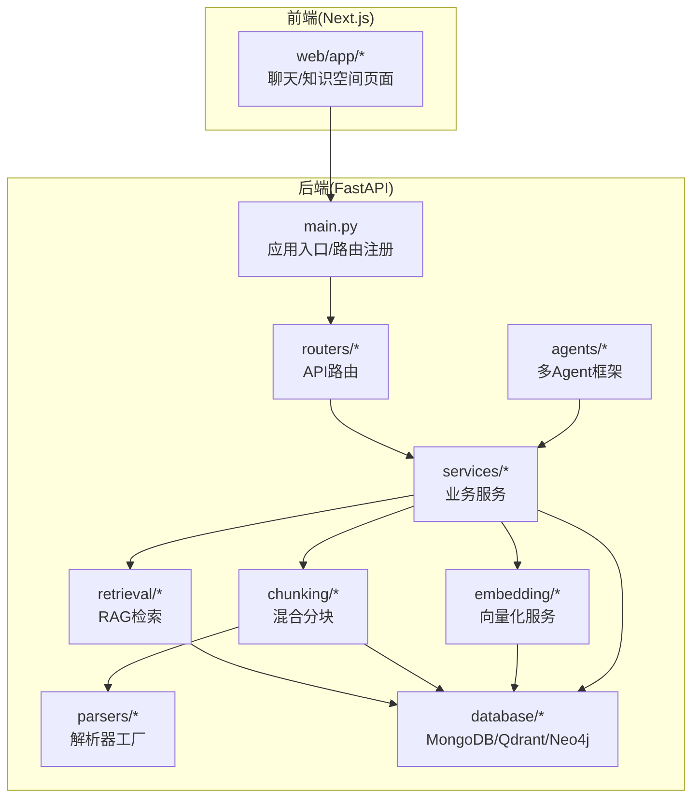
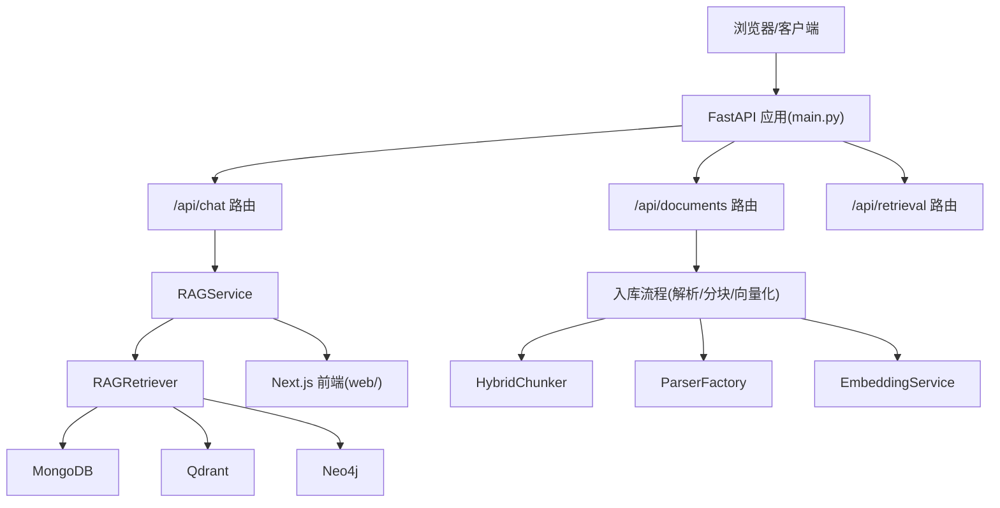
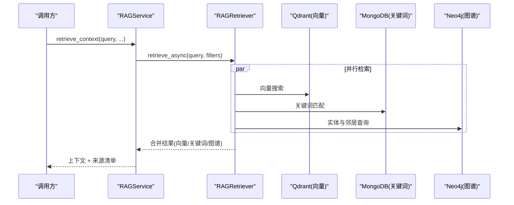
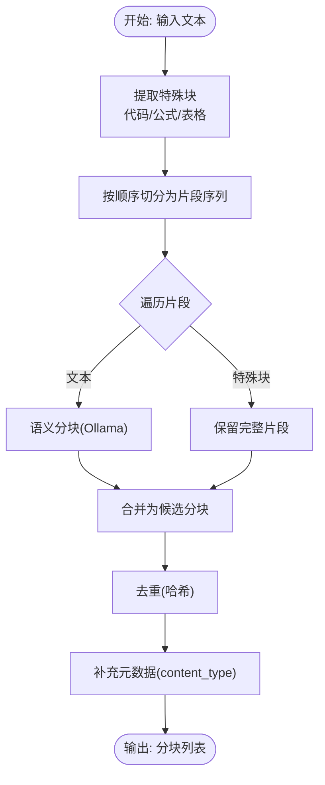
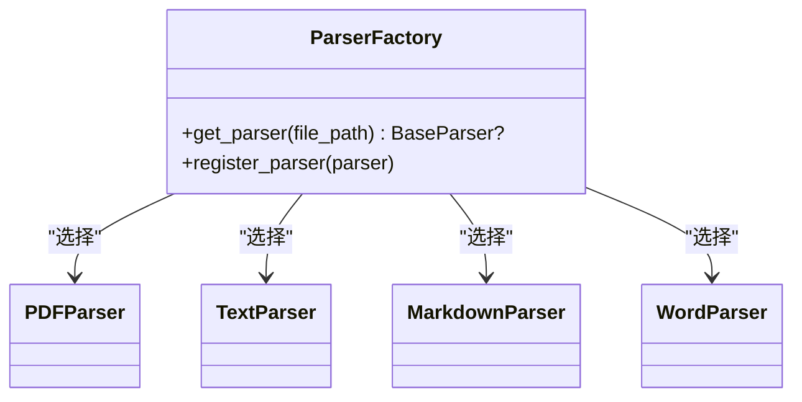
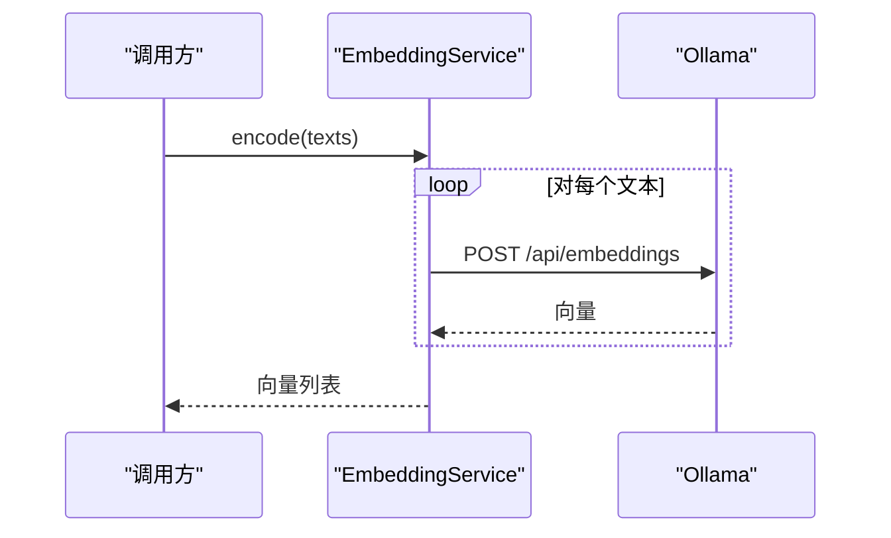
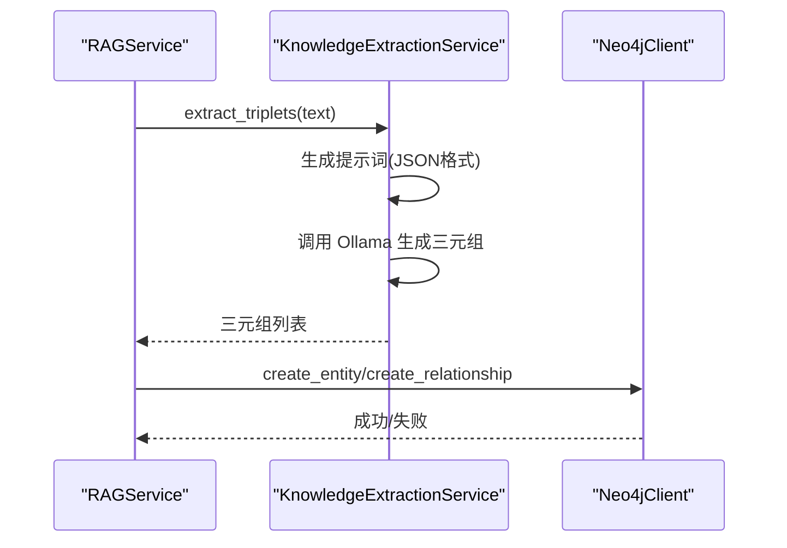
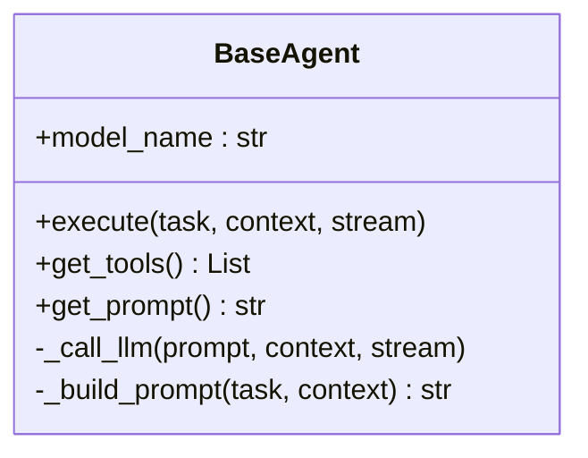
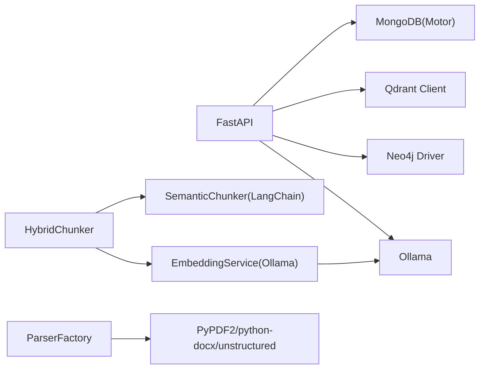

# 项目概述

<cite>
**本文引用的文件**
- [README.md](file://README.md)
- [main.py](file://main.py)
- [requirements.txt](file://requirements.txt)
- [docker-compose.yml](file://docker-compose.yml)
- [web/README.md](file://web/README.md)
- [agents/base/base_agent.py](file://agents/base/base_agent.py)
- [retrieval/rag_retriever.py](file://retrieval/rag_retriever.py)
- [services/rag_service.py](file://services/rag_service.py)
- [database/mongodb.py](file://database/mongodb.py)
- [database/qdrant_client.py](file://database/qdrant_client.py)
- [database/neo4j_client.py](file://database/neo4j_client.py)
- [embedding/embedding_service.py](file://embedding/embedding_service.py)
- [services/knowledge_extraction_service.py](file://services/knowledge_extraction_service.py)
- [chunking/hybrid_chunker.py](file://chunking/hybrid_chunker.py)
- [parsers/parser_factory.py](file://parsers/parser_factory.py)
</cite>

## 目录
1. [简介](#简介)
2. [项目结构](#项目结构)
3. [核心组件](#核心组件)
4. [架构总览](#架构总览)
5. [详细组件分析](#详细组件分析)
6. [依赖分析](#依赖分析)
7. [性能考量](#性能考量)
8. [故障排查指南](#故障排查指南)
9. [结论](#结论)
10. [附录](#附录)

## 简介
advanced-rag 是一个“纯开源的高级 RAG 系统”，专注于“AI 助手对话（含深度研究/深度思考）”与“知识库检索/入库”。系统提供匿名访问能力，支持深度研究模式（多 Agent 协作）、高阶 RAG 引擎（混合分块、双路索引、混合检索、精准重排），以及从文档上传到入库的完整流水线。

- 匿名对话：无需登录即可使用对话与对话历史（全局）
- 深度研究：多 Agent 协作输出深度研究结果
- 高阶 RAG 引擎：混合分块 + 双路索引（向量/Qdrant + 图谱/Neo4j）+ 混合检索 + 精准重排
- 知识库入库：前端上传文档（PDF/Word/Markdown/TXT）→ 解析/混合分块/知识抽取/向量化 → 入库

系统采用 FastAPI + Next.js 技术栈，后端数据库包含 MongoDB、Qdrant、Neo4j、Redis，AI 推理由 Ollama 提供，文本处理结合 LangChain、sentence-transformers、jieba 等。

**章节来源**
- [README.md:11-25](file://README.md#L11-L25)
- [README.md:26-54](file://README.md#L26-L54)
- [README.md:189-199](file://README.md#L189-L199)

## 项目结构
后端以 FastAPI 为核心，路由层负责 API 定义，服务层承载业务逻辑，数据库层对接 MongoDB、Qdrant、Neo4j，工具与中间件提供日志与生命周期管理。前端采用 Next.js，提供聊天与知识空间管理界面。

**图表来源**
- [main.py:90-98](file://main.py#L90-L98)
- [README.md:55-70](file://README.md#L55-L70)
- [web/README.md:66-80](file://web/README.md#L66-L80)

**章节来源**
- [README.md:55-70](file://README.md#L55-L70)
- [web/README.md:66-80](file://web/README.md#L66-L80)

## 核心组件
- 多 Agent 框架：统一抽象与提示词构建，便于扩展不同角色（如概念解释、批评、检索、总结等）
- RAG 检索器：向量检索 + 关键词检索 + 图谱检索 + 可选重排
- RAG 服务：整合检索、上下文构建与来源标注，支持知识空间与对话附件
- 混合分块器：规则分块（代码/公式/表格）+ 语义分块（Ollama），并去重
- 解析器工厂：按文件类型选择解析器（PDF/Text/Markdown/Word）
- 向量化服务：基于 Ollama 的嵌入生成
- 数据库适配：MongoDB（文档/分块/元数据）、Qdrant（向量）、Neo4j（图谱）

**章节来源**
- [agents/base/base_agent.py:8-122](file://agents/base/base_agent.py#L8-L122)
- [retrieval/rag_retriever.py:22-325](file://retrieval/rag_retriever.py#L22-L325)
- [services/rag_service.py:7-248](file://services/rag_service.py#L7-L248)
- [chunking/hybrid_chunker.py:9-179](file://chunking/hybrid_chunker.py#L9-L179)
- [parsers/parser_factory.py:10-41](file://parsers/parser_factory.py#L10-L41)
- [embedding/embedding_service.py:8-278](file://embedding/embedding_service.py#L8-L278)
- [database/mongodb.py:92-200](file://database/mongodb.py#L92-L200)
- [database/qdrant_client.py:18-544](file://database/qdrant_client.py#L18-L544)
- [database/neo4j_client.py:6-104](file://database/neo4j_client.py#L6-L104)

## 架构总览
系统采用“API 层 → 服务层 → 检索/分块/解析/向量化 → 数据库”的分层架构。RAG 引擎通过并行检索多种来源，融合为统一上下文，并在前端以流式方式呈现。

**图表来源**
- [main.py:90-98](file://main.py#L90-L98)
- [services/rag_service.py:64-83](file://services/rag_service.py#L64-L83)
- [retrieval/rag_retriever.py:69-101](file://retrieval/rag_retriever.py#L69-L101)
- [chunking/hybrid_chunker.py:52-121](file://chunking/hybrid_chunker.py#L52-L121)
- [parsers/parser_factory.py:20-34](file://parsers/parser_factory.py#L20-L34)
- [embedding/embedding_service.py:230-263](file://embedding/embedding_service.py#L230-L263)
- [database/mongodb.py:315-800](file://database/mongodb.py#L315-L800)
- [database/qdrant_client.py:336-414](file://database/qdrant_client.py#L336-L414)
- [database/neo4j_client.py:40-62](file://database/neo4j_client.py#L40-L62)

## 详细组件分析

### RAG 检索器（混合检索）
RAGRetriever 实现“向量 + 关键词 + 图谱”的混合检索，并支持可选重排。检索过程并行执行三种策略，随后合并、去重与排序，最终返回 top_k 结果及来源信息。

**图表来源**
- [services/rag_service.py:64-83](file://services/rag_service.py#L64-L83)
- [retrieval/rag_retriever.py:69-101](file://retrieval/rag_retriever.py#L69-L101)
- [retrieval/rag_retriever.py:110-139](file://retrieval/rag_retriever.py#L110-L139)
- [retrieval/rag_retriever.py:140-174](file://retrieval/rag_retriever.py#L140-L174)
- [retrieval/rag_retriever.py:176-260](file://retrieval/rag_retriever.py#L176-L260)

**章节来源**
- [retrieval/rag_retriever.py:22-325](file://retrieval/rag_retriever.py#L22-L325)
- [services/rag_service.py:10-191](file://services/rag_service.py#L10-L191)

### 混合分块器（规则 + 语义）
HybridChunker 将输入文本拆分为“特殊块（代码/公式/表格）+ 普通文本”，对普通文本使用基于嵌入的语义分块，最后进行去重与元数据补充。

**图表来源**
- [chunking/hybrid_chunker.py:52-121](file://chunking/hybrid_chunker.py#L52-L121)
- [chunking/hybrid_chunker.py:123-179](file://chunking/hybrid_chunker.py#L123-L179)

**章节来源**
- [chunking/hybrid_chunker.py:9-179](file://chunking/hybrid_chunker.py#L9-L179)

### 解析器工厂与文档处理
解析器工厂根据文件路径选择对应解析器（PDF/Text/Markdown/Word），并配合统一的解析流程与结果合成。

**图表来源**
- [parsers/parser_factory.py:10-41](file://parsers/parser_factory.py#L10-L41)

**章节来源**
- [parsers/parser_factory.py:10-41](file://parsers/parser_factory.py#L10-L41)

### 向量化服务（Ollama）
EmbeddingService 基于 Ollama 的嵌入接口生成向量，具备模型名称规范化、自动检测、超时与重试机制，支持单文本与批量编码。

**图表来源**
- [embedding/embedding_service.py:175-263](file://embedding/embedding_service.py#L175-L263)

**章节来源**
- [embedding/embedding_service.py:8-278](file://embedding/embedding_service.py#L8-L278)

### 知识抽取与图谱构建
KnowledgeExtractionService 从文本中抽取三元组并写入 Neo4j，同时支持从查询中提取实体，用于图谱检索。

**图表来源**
- [services/knowledge_extraction_service.py:32-103](file://services/knowledge_extraction_service.py#L32-L103)
- [services/knowledge_extraction_service.py:144-210](file://services/knowledge_extraction_service.py#L144-L210)
- [database/neo4j_client.py:64-101](file://database/neo4j_client.py#L64-L101)

**章节来源**
- [services/knowledge_extraction_service.py:10-211](file://services/knowledge_extraction_service.py#L10-L211)
- [database/neo4j_client.py:6-104](file://database/neo4j_client.py#L6-L104)

### 多 Agent 框架
BaseAgent 定义统一接口与提示词构建、工具与 LLM 调用封装，便于扩展不同角色 Agent。

**图表来源**
- [agents/base/base_agent.py:8-122](file://agents/base/base_agent.py#L8-L122)

**章节来源**
- [agents/base/base_agent.py:8-122](file://agents/base/base_agent.py#L8-L122)

## 依赖分析
- 后端框架与运行：FastAPI、uvicorn
- 数据库与存储：MongoDB（Motor）、Qdrant（Python 客户端）、Neo4j（Python 驱动）
- 文本与向量化：LangChain、jieba、sentence-transformers（当前禁用重排以避免崩溃）
- 文档解析：PyPDF2、python-docx、unstructured、PaddleOCR（OCR）
- AI 推理：Ollama（本地模型推理）
- 缓存：Redis（可选）

**图表来源**
- [requirements.txt:4-38](file://requirements.txt#L4-L38)
- [database/mongodb.py:92-200](file://database/mongodb.py#L92-L200)
- [database/qdrant_client.py:18-544](file://database/qdrant_client.py#L18-L544)
- [database/neo4j_client.py:6-104](file://database/neo4j_client.py#L6-L104)
- [chunking/hybrid_chunker.py:6-41](file://chunking/hybrid_chunker.py#L6-L41)
- [embedding/embedding_service.py:21-44](file://embedding/embedding_service.py#L21-L44)
- [parsers/parser_factory.py:13-18](file://parsers/parser_factory.py#L13-L18)

**章节来源**
- [requirements.txt:1-38](file://requirements.txt#L1-L38)
- [docker-compose.yml:1-76](file://docker-compose.yml#L1-L76)

## 性能考量
- 连接池与超时：MongoDB 连接池参数（maxPoolSize/minPoolSize/maxIdleTimeMS/serverSelectionTimeoutMS/connectTimeoutMS/socketTimeoutMS）提升高并发稳定性
- Qdrant gRPC 优先：优先使用 gRPC（端口 6334）以避免 httpx 导致的 502 错误，支持连接复用
- 检索并行化：RAG 检索并行执行向量/关键词/图谱三种策略，减少总体延迟
- 重排可选：sentence-transformers 当前禁用以避免进程崩溃，后续可按需启用
- 向量维度自适应：插入前自动检测维度并按需重建集合，保证一致性

**章节来源**
- [database/mongodb.py:122-136](file://database/mongodb.py#L122-L136)
- [database/qdrant_client.py:66-91](file://database/qdrant_client.py#L66-L91)
- [retrieval/rag_retriever.py:82-89](file://retrieval/rag_retriever.py#L82-L89)
- [retrieval/rag_retriever.py:12-21](file://retrieval/rag_retriever.py#L12-L21)
- [database/qdrant_client.py:247-267](file://database/qdrant_client.py#L247-L267)

## 故障排查指南
- MongoDB 连接失败：检查 MONGODB_URI/MONGODB_HOST/MONGODB_PORT/MONGODB_AUTH_SOURCE 配置，确认服务可达与权限正确
- Qdrant 连接失败：确认 QDRANT_URL 使用 gRPC 端口（6334），避免 httpx 502；若集合不存在会自动创建
- Neo4j 连接失败：检查 NEO4J_URI/USER/PASSWORD，容器内访问使用 host.docker.internal 替换 localhost
- Ollama 模型未找到：确认 OLLAMA_EMBEDDING_MODEL 已安装，或通过环境变量指定；注意模型名称规范化
- 重排功能不可用：sentence-transformers 当前禁用，如需启用请按需调整加载逻辑
- 前端无法访问后端：确认 NEXT_PUBLIC_API_URL 指向正确的后端地址

**章节来源**
- [database/mongodb.py:154-184](file://database/mongodb.py#L154-L184)
- [database/qdrant_client.py:102-123](file://database/qdrant_client.py#L102-L123)
- [database/neo4j_client.py:16-33](file://database/neo4j_client.py#L16-L33)
- [embedding/embedding_service.py:39-44](file://embedding/embedding_service.py#L39-L44)
- [retrieval/rag_retriever.py:12-21](file://retrieval/rag_retriever.py#L12-L21)
- [web/README.md:42-48](file://web/README.md#L42-L48)

## 结论
advanced-rag 通过“解析/分块/向量化/入库/检索/生成”的完整链路，实现了高性能、可扩展的 RAG 能力。其混合检索与图谱增强提升了召回质量，匿名对话与深度研究模式满足多样化应用场景。技术栈选择兼顾易部署与本地化推理，适合中小型团队快速落地与二次开发。

## 附录
- 快速开始与环境配置参考：[README.md:71-188](file://README.md#L71-L188)
- Docker 部署与服务编排：[docker-compose.yml:1-76](file://docker-compose.yml#L1-L76)
- 前端页面与交互说明：[web/README.md:1-96](file://web/README.md#L1-L96)