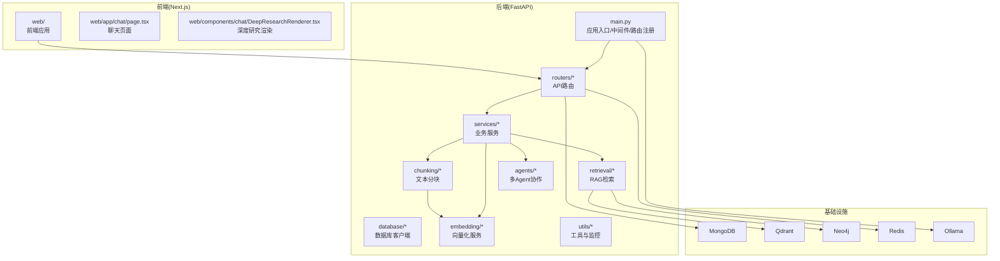
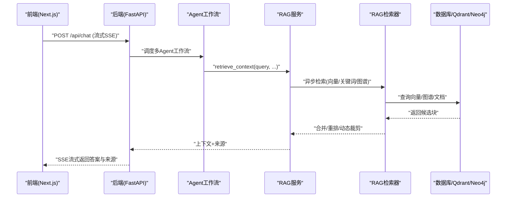
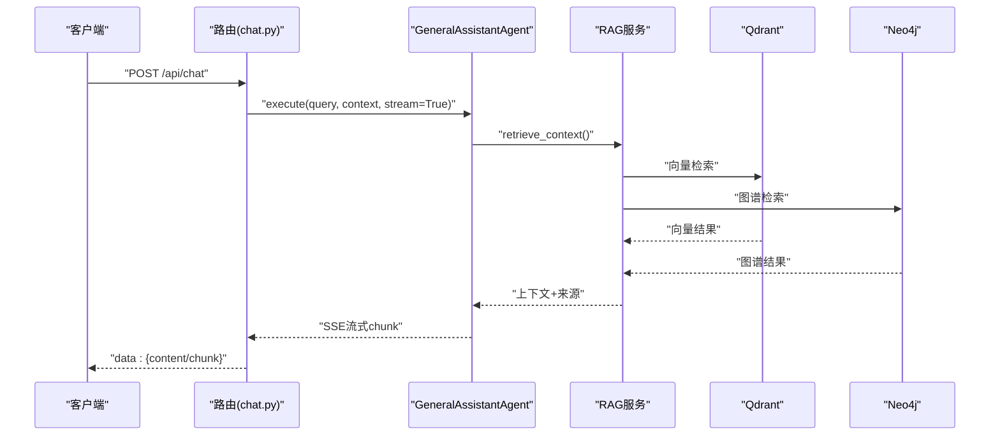
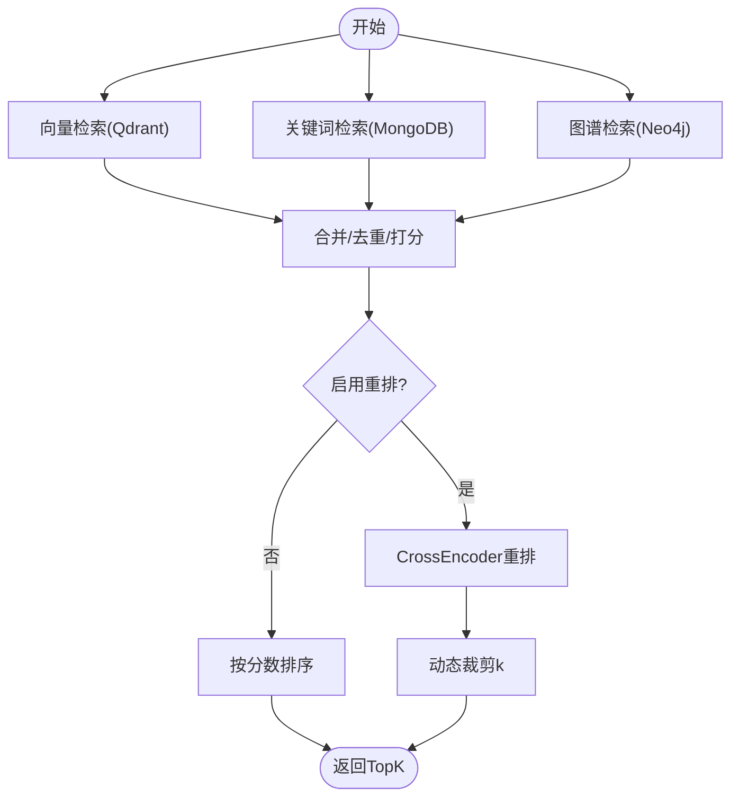
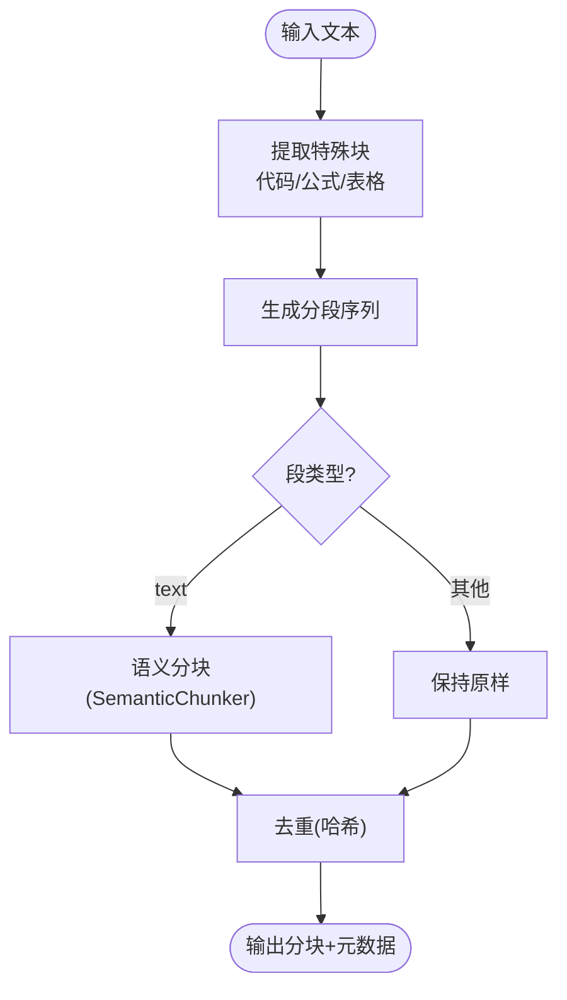
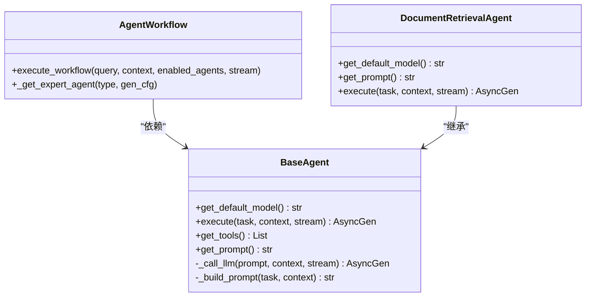
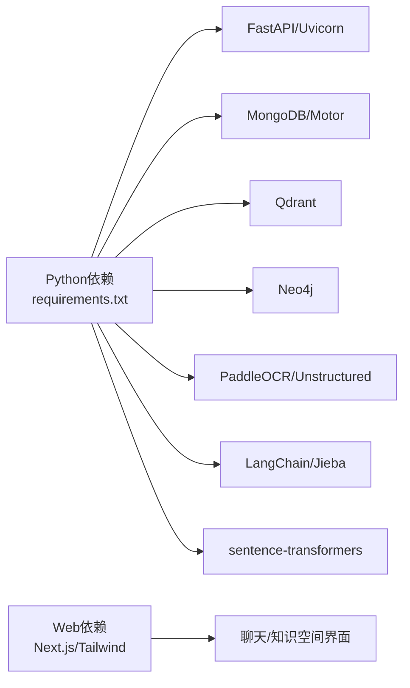

# 项目概述

<cite>
**本文引用的文件**
- [README.md](file://README.md)
- [main.py](file://main.py)
- [requirements.txt](file://requirements.txt)
- [web/README.md](file://web/README.md)
- [docker-compose.yml](file://docker-compose.yml)
- [chunking/README.md](file://chunking/README.md)
- [chunking/hybrid_chunker.py](file://chunking/hybrid_chunker.py)
- [retrieval/rag_retriever.py](file://retrieval/rag_retriever.py)
- [services/rag_service.py](file://services/rag_service.py)
- [agents/base/base_agent.py](file://agents/base/base_agent.py)
- [agents/experts/document_retrieval_agent.py](file://agents/experts/document_retrieval_agent.py)
- [agents/workflow/agent_workflow.py](file://agents/workflow/agent_workflow.py)
- [web/app/chat/page.tsx](file://web/app/chat/page.tsx)
- [web/components/chat/DeepResearchRenderer.tsx](file://web/components/chat/DeepResearchRenderer.tsx)
- [routers/chat.py](file://routers/chat.py)
</cite>

## 目录
1. [简介](#简介)
2. [项目结构](#项目结构)
3. [核心组件](#核心组件)
4. [架构总览](#架构总览)
5. [详细组件分析](#详细组件分析)
6. [依赖分析](#依赖分析)
7. [性能考虑](#性能考虑)
8. [故障排查指南](#故障排查指南)
9. [结论](#结论)
10. [附录](#附录)

## 简介
Advanced RAG 是一个“纯开源高级RAG系统”，采用 FastAPI + Next.js 构建，专注于两大核心能力：
- AI 助手对话（含深度研究/深度思考）
- 知识库检索与入库

系统强调“匿名访问”与“高阶RAG引擎”，提供混合分块、双路索引（向量+知识图谱）、混合检索与精准重排等能力，旨在为用户提供“所问即所得”的智能问答体验。

- 项目定位：纯开源、专注RAG、面向生产可用
- 目标用户：需要快速搭建“对话+知识库”的个人或团队
- 应用场景：企业知识问答、学术研究辅助、教学与培训、技术文档检索与问答

章节来源
- [README.md:11-25](file://README.md#L11-L25)

## 项目结构
后端采用 FastAPI，路由层负责对外 API，服务层封装业务逻辑，数据库层对接 MongoDB、Qdrant、Neo4j、Redis 等，前端采用 Next.js，提供聊天与知识空间管理界面。

图表来源
- [main.py:90-99](file://main.py#L90-L99)
- [docker-compose.yml:1-96](file://docker-compose.yml#L1-L96)

章节来源
- [README.md:55-70](file://README.md#L55-L70)
- [web/README.md:66-80](file://web/README.md#L66-L80)

## 核心组件
- 路由层（routers）：提供聊天、文档、知识空间、检索、健康检查等 API，支持匿名对话与流式响应。
- 服务层（services）：封装 RAG 服务、查询分析、模型选择、相似度计算等。
- 检索层（retrieval）：实现混合检索（向量+关键词+图谱），并支持重排与动态裁剪。
- 分块层（chunking）：提供混合分块策略（规则+语义），保障代码、公式、表格完整性。
- 代理系统（agents）：多 Agent 协作，支持深度研究模式与专家 Agent 串联。
- 前端（web）：聊天界面、深度研究渲染、知识空间上传与列表。

章节来源
- [README.md:46-54](file://README.md#L46-L54)
- [routers/chat.py:623-760](file://routers/chat.py#L623-L760)
- [services/rag_service.py:8-323](file://services/rag_service.py#L8-L323)
- [retrieval/rag_retriever.py:17-393](file://retrieval/rag_retriever.py#L17-L393)
- [chunking/hybrid_chunker.py:9-179](file://chunking/hybrid_chunker.py#L9-L179)
- [agents/workflow/agent_workflow.py:47-388](file://agents/workflow/agent_workflow.py#L47-L388)

## 架构总览
系统采用“API网关 + 业务服务 + 多数据库 + 多模型服务”的分层架构。后端通过 FastAPI 提供 REST API，前端通过 Next.js 提供交互界面。RAG 核心流程包括：查询分析 → 多路检索 → 结果融合与重排 → 上下文拼接 → LLM生成 → 溯源与评估。

图表来源
- [routers/chat.py:623-760](file://routers/chat.py#L623-L760)
- [services/rag_service.py:34-267](file://services/rag_service.py#L34-L267)
- [retrieval/rag_retriever.py:89-138](file://retrieval/rag_retriever.py#L89-L138)
- [agents/workflow/agent_workflow.py:106-337](file://agents/workflow/agent_workflow.py#L106-L337)

## 详细组件分析

### 路由与对话流
- 路由层提供匿名对话、深度研究、文档管理、知识空间、健康检查等接口。
- 对话采用 SSE 流式输出，支持客户端断开检测与优雅中断。
- 支持对话历史、消息增删改、重新生成等能力。

图表来源
- [routers/chat.py:623-760](file://routers/chat.py#L623-L760)
- [agents/experts/document_retrieval_agent.py:25-79](file://agents/experts/document_retrieval_agent.py#L25-L79)
- [services/rag_service.py:34-123](file://services/rag_service.py#L34-L123)
- [retrieval/rag_retriever.py:176-241](file://retrieval/rag_retriever.py#L176-L241)

章节来源
- [routers/chat.py:623-760](file://routers/chat.py#L623-L760)
- [web/app/chat/page.tsx:680-800](file://web/app/chat/page.tsx#L680-L800)

### 检索与重排
- 检索器支持向量检索、关键词检索、图谱检索三路并行，再进行合并与重排。
- 重排采用 CrossEncoder（BGE），并支持动态裁剪 k 值，平衡召回与精确度。
- 图谱检索基于实体抽取与一跳邻居查询，构造结构化上下文。

图表来源
- [retrieval/rag_retriever.py:89-138](file://retrieval/rag_retriever.py#L89-L138)
- [retrieval/rag_retriever.py:365-392](file://retrieval/rag_retriever.py#L365-L392)

章节来源
- [retrieval/rag_retriever.py:17-393](file://retrieval/rag_retriever.py#L17-L393)

### 混合分块策略
- 混合分块器结合规则分块（代码/公式/表格）与语义分块（基于 Ollama 嵌入），并进行去重与元数据增强。
- 适合多格式文档入库，提升检索质量与上下文完整性。

图表来源
- [chunking/hybrid_chunker.py:52-122](file://chunking/hybrid_chunker.py#L52-L122)
- [chunking/hybrid_chunker.py:123-175](file://chunking/hybrid_chunker.py#L123-L175)

章节来源
- [chunking/README.md:1-89](file://chunking/README.md#L1-L89)
- [chunking/hybrid_chunker.py:9-179](file://chunking/hybrid_chunker.py#L9-L179)

### 多Agent协作与深度研究
- 协调型 Agent 负责规划任务与选择专家 Agent。
- 专家 Agent 各司其职（文档检索、公式分析、代码分析、概念解释、示例生成、总结、练习、科学编程等）。
- 前端提供深度研究渲染组件，支持 HTML/Markdown 内容展示与动画过渡。

图表来源
- [agents/base/base_agent.py:8-122](file://agents/base/base_agent.py#L8-L122)
- [agents/workflow/agent_workflow.py:47-388](file://agents/workflow/agent_workflow.py#L47-L388)
- [agents/experts/document_retrieval_agent.py:8-79](file://agents/experts/document_retrieval_agent.py#L8-L79)

章节来源
- [agents/workflow/agent_workflow.py:106-337](file://agents/workflow/agent_workflow.py#L106-L337)
- [web/components/chat/DeepResearchRenderer.tsx:17-177](file://web/components/chat/DeepResearchRenderer.tsx#L17-L177)

### 前端交互与深度研究渲染
- 聊天页面支持匿名访问、流式输出、RAG 增强、深度研究模式、对话历史侧边栏、附件上传与进度轮询。
- 深度研究渲染器支持 HTML → Markdown 转换与标题样式展示。

章节来源
- [web/README.md:3-11](file://web/README.md#L3-L11)
- [web/app/chat/page.tsx:1-800](file://web/app/chat/page.tsx#L1-L800)
- [web/components/chat/DeepResearchRenderer.tsx:17-177](file://web/components/chat/DeepResearchRenderer.tsx#L17-L177)

## 依赖分析
- 后端依赖：FastAPI、Uvicorn、MongoDB/Motor、Qdrant、Neo4j、PaddleOCR、PyPDF2/python-docx、LangChain、sentence-transformers、jieba 等。
- 前端依赖：Next.js 16、React 19、TypeScript、Tailwind CSS。
- 基础设施：Docker Compose 提供 MongoDB、Qdrant、Neo4j、Redis 的一键部署。

图表来源
- [requirements.txt:1-42](file://requirements.txt#L1-L42)
- [docker-compose.yml:1-96](file://docker-compose.yml#L1-L96)

章节来源
- [requirements.txt:1-42](file://requirements.txt#L1-L42)
- [docker-compose.yml:1-96](file://docker-compose.yml#L1-L96)

## 性能考虑
- 检索性能：向量检索使用 Qdrant，关键词检索限定在指定文档范围内，图谱检索按实体展开一跳邻居，避免全局扫描。
- 重排与动态裁剪：启用 CrossEncoder 重排并根据分数分布动态调整 k 值，兼顾召回与精确度。
- 流式输出：SSE 流式返回，前端节流更新，降低首字节延迟与内存占用。
- 并发与限流：生产环境使用多 worker，限制 keep-alive 超时与并发连接数，适配大文件上传与高并发场景。
- 缓存与可选组件：Redis 可选缓存，Ollama 本地推理减少网络抖动。

章节来源
- [main.py:129-171](file://main.py#L129-L171)
- [retrieval/rag_retriever.py:139-168](file://retrieval/rag_retriever.py#L139-L168)
- [web/app/chat/page.tsx:57-58](file://web/app/chat/page.tsx#L57-L58)

## 故障排查指南
- 启动与环境
  - 确认 .env/.env.development/.env.production 配置正确，特别是数据库与 Ollama 地址。
  - Docker Compose 一键启动 MongoDB、Qdrant、Neo4j、Redis。
- 数据库连接
  - MongoDB 未连接不会阻止服务启动，但相关接口不可用；Qdrant/Neo4j 未连接仅告警。
- 检索异常
  - 向量/图谱检索失败会记录日志并降级；重排模型加载失败会自动禁用重排。
- 前端交互
  - 深度研究渲染器会将 HTML 转换为 Markdown；若内容为空，检查后端返回与前端解析逻辑。
- 对话中断
  - SSE 流式输出支持客户端断开检测，断开后自动停止生成。

章节来源
- [README.md:125-166](file://README.md#L125-L166)
- [docker-compose.yml:1-96](file://docker-compose.yml#L1-L96)
- [retrieval/rag_retriever.py:52-69](file://retrieval/rag_retriever.py#L52-L69)
- [web/components/chat/DeepResearchRenderer.tsx:26-112](file://web/components/chat/DeepResearchRenderer.tsx#L26-L112)

## 结论
Advanced RAG 以“纯开源 + 高阶RAG引擎”为核心，围绕“对话 + 知识库”两条主线构建：后端通过 FastAPI 提供稳定 API，服务层整合检索、分块与多 Agent 协作；前端通过 Next.js 提供流畅的交互体验。系统在检索层面实现了“混合分块 + 双路索引 + 混合检索 + 精准重排”的闭环，在生成层面通过流式输出与来源溯源提升用户体验。适合希望快速落地“智能问答+知识增强”的个人与团队。

## 附录
- 快速开始与部署
  - 安装依赖、下载第三方依赖、配置 .env、启动服务或 Docker Compose。
- 核心 API
  - 对话（流式SSE）、深度研究、文档上传/列表、知识空间、健康检查等。
- 开发指南
  - 模型/服务/路由/数据库/工具分层清晰，新增功能遵循“模型→服务→路由→注册”的流程。

章节来源
- [README.md:71-227](file://README.md#L71-L227)
- [README.md:189-199](file://README.md#L189-L199)